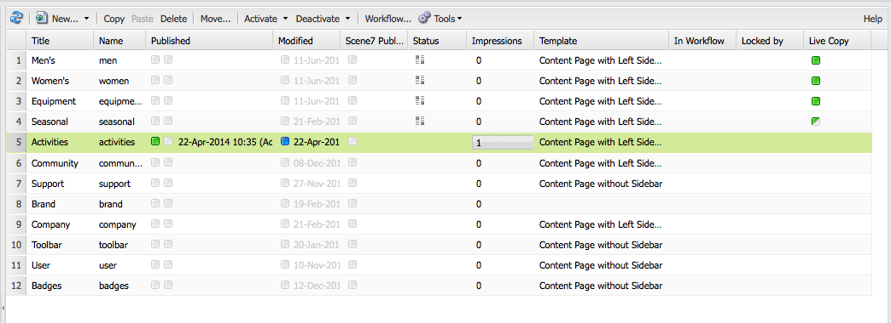

# Basisverwerking{#basic-handling}

>[!NOTE]
>
>* Deze pagina is ontworpen om een overzicht te geven van de basisafhandeling bij gebruik van de Adobe Experience Manager (AEM)-auteursomgeving. Het gebruikt de **console van Plaatsen** als basis.
>
>* Bepaalde functionaliteit is niet in alle consoles beschikbaar en in sommige consoles is aanvullende functionaliteit beschikbaar. Specifieke informatie over de afzonderlijke consoles en de bijbehorende functionaliteit wordt meer in detail besproken op andere pagina&#39;s.
>* Sneltoetsen zijn beschikbaar in alle AEM. Met name wanneer [ het gebruiken consoles ](/help/sites-classic-ui-authoring/author-env-keyboard-shortcuts.md) en [ het uitgeven pagina&#39;s ](/help/sites-classic-ui-authoring/classic-page-author-keyboard-shortcuts.md).
>

## Het welkomstscherm {#the-welcome-screen}

De klassieke UI verstrekt een selectie van consoles, gebruikend bekende mechanismen voor het navigeren en het in werking stellen van acties, met inbegrip van klik, dubbelklik, en [ contextmenu&#39;s ](#context-menus).

Na aanmelding wordt het welkomstscherm weergegeven. Het verstrekt een lijst van verbindingen aan consoles en de diensten:

## Consoles {#consoles}

De belangrijkste consoles zijn:

<table>
 <tbody>
  <tr>
   <td><strong>Console</strong></td>
   <td><strong>Doel</strong></td>
  </tr>
  <tr>
   <td><strong>Welkom</strong></td>
   <td>Biedt een overzicht en directe toegang (via koppelingen) tot de hoofdfunctionaliteit van AEM.</td>
  </tr>
  <tr>
   <td><strong> Digitale Assets </strong>  </td>
   <td>Deze consoles laten u invoeren en <a href="/help/sites-classic-ui-authoring/classicui-assets.md"> digitale activa </a> zoals beelden, video's, documenten, en audiodossiers beheren. Deze elementen kunnen vervolgens worden gebruikt door elke website die op hetzelfde AEM wordt uitgevoerd. </td>
  </tr>
  <tr>
   <td><strong>Lanceringen</strong></td>
   <td>Dit helpt u uw <a href="/help/sites-classic-ui-authoring/classic-launches.md"> lanceringen </a> beheren; deze laten u toe om de inhoud voor een toekomstige versie van één of meerdere geactiveerde Web-pagina's te ontwikkelen.  <i> Nota: In aanraking-toegelaten UI is veel van de zelfde functionaliteit beschikbaar in de console van Plaatsen, samen met de spoorstaaf van Verwijzingen.</i> <i> indien nodig, is deze console beschikbaar bij de console van Hulpmiddelen; uitgezochte Verrichtingen, toen Lanceringen.</i></td>
  </tr>
  <tr>
   <td><strong>Inbox </strong></td>
   <td>Vaak zijn verschillende personen betrokken bij de subtaken van een werkstroom en moet elke persoon zijn stap voltooien voordat het werk aan de volgende persoon wordt overgedragen. Met het Postvak IN kunt u meldingen weergeven die betrekking hebben op dergelijke taken. Zie <a href="/help/sites-administering/workflows.md"> Werkend met Werkschema's </a>.   </td>
  </tr>
  <tr>
   <td><strong>Tags</strong></td>
   <td>Met de coderingsconsoles kunt u tags beheren. Tags zijn korte namen of woordgroepen die u kunt gebruiken om stukken inhoud te classificeren en er notities aan toe te voegen, zodat u ze gemakkelijker kunt vinden en organiseren. Voor meer informatie, zie <a href="/help/sites-classic-ui-authoring/classic-feature-tags.md"> Gebruikend en het Leiden Markeringen </a>.</td>
  </tr>
  <tr>
   <td><strong>Gereedschappen</strong></td>
   <td>De <a href="/help/sites-administering/tools-consoles.md"> consoles van Hulpmiddelen </a> verlenen toegang tot verscheidene gespecialiseerde hulpmiddelen en consoles die u helpen uw websites, digitale activa, en andere aspecten van uw inhoudsbewaarplaats beheren.</td>
  </tr>
  <tr>
   <td><strong>Gebruikers</strong></td>
   <td>Met deze consoles kunt u toegangsrechten voor gebruikers en groepen beheren. Voor volledige details, zie <a href="/help/sites-administering/security.md"> Beleid van de Gebruiker en Veiligheid </a>.  </td>
  </tr>
  <tr>
   <td><strong>Websites</strong></td>
   <td>De plaatsen/de consoles van Websites laten u <a href="/help/sites-classic-ui-authoring/classic-page-author.md"> tot stand brengen, bekijken en, websites </a> leiden die op uw AEM instantie lopen. Via deze consoles kunt u websitepagina's maken, kopiëren, verplaatsen en verwijderen, workflows starten en pagina's activeren (publiceren). U kunt een pagina voor het uitgeven ook openen.  </td>
  </tr>
  <tr>
   <td><strong>Workflows</strong></td>
   <td>Een workflow is een gedefinieerde reeks stappen die het voltooien van een taak beschrijft. Vaak zijn meerdere personen betrokken bij een taak en moet elke persoon zijn stap voltooien voordat hij het werk aan de volgende persoon overdraagt. Met de workflowconsole kunt u workflowmodellen maken en actieve workflowinstanties beheren. Zie <a href="/help/sites-administering/workflows.md"> Werkend met Werkschema's </a>.  </td>
  </tr>
 </tbody>
</table>

De **console van Websites** verstrekt twee ruiten voor u om uw pagina&#39;s te navigeren en te beheren:

* Linkerdeelvenster

  Dit toont de boomstructuur van uw websites en de pagina&#39;s binnen die websites.

  Het toont ook informatie over andere aspecten of AEM, met inbegrip van projecten, blauwdrukken, en activa.

* Rechtervenster

  Hier worden de pagina&#39;s weergegeven (op de locatie die in het linkervenster is geselecteerd) en u kunt deze gebruiken om actie te ondernemen.

Van hier kunt u uw pagina&#39;s [&#128279;](/help/sites-authoring/managing-pages.md) beheren gebruikend of de toolbar, een contextmenu of door een pagina voor verdere acties te openen.

>[!NOTE]
>
>De basisafhandeling is voor alle consoles hetzelfde. Deze sectie concentreert zich op de **&#x200B;**&#x200B;console van Websites aangezien het de primaire console is die wanneer het ontwerpen wordt gebruikt.

## Toegang tot Help {#accessing-help}

Op diverse consoles (bijvoorbeeld, Websites), is de knoop van de Hulp van de a **&#x200B;**&#x200B;beschikbaar. Het klikken van **Hulp** opent of het Aandeel van het Pakket of de documentatieplaats.

Wanneer het uitgeven van een pagina, heeft [ hulplid ook een knoop voor de toegang tot van hulp ](/help/sites-classic-ui-authoring/classic-page-author-env-tools.md#accessing-help).

## Navigeren met de websiteconsole {#navigating-with-the-websites-console}

De **Websites** console maakt een lijst van uw pagina&#39;s van inhoud in een boomstructuur (linkerruit). Voor het gemak van navigatie, kunnen de secties van de boomstructuur worden uitgebreid (+) of worden doen ineenstorten (-) zoals vereist:

* Als u in het linkerdeelvenster op de paginanaam klikt, gebeurt het volgende:

   * Hiermee geeft u de onderliggende pagina&#39;s in het rechterdeelvenster weer
   * Breidt de structuur in de linkerruit uit.

     Om redenen van prestaties, hangt deze actie van het aantal kindknopen af. Bij een standaardinstallatie werkt deze uitbreidingsmethode wanneer er `30` of minder onderliggende knooppunten zijn.

* Als u dubbelklikt op de paginanaam (linkerdeelvenster), wordt de structuur uitgebreid, hoewel dit effect niet zo duidelijk is wanneer de pagina tegelijkertijd wordt geopend.

>[!NOTE]
>
>Deze standaardwaarde ( `30`) kan per console in uw toepassing-specifieke configuraties van de plaats worden veranderd admin widget:
>
>Op het knooppunt voor sitebeheer:
>
>Stel de waarde van de eigenschap in:
>`treeAutoExpandMax`
>op:
>`/apps/wcm/core/content/siteadmin`
>
>Of globaal in het thema:
>Stel de waarde in van:
>`TREE_AUTOEXPAND_MAX`
>in:
>`/apps/cq/ui/widgets/themes/default/widgets/wcm/SiteAdmin.js`
>
>Zie [ SiteAdmin in CQ Widget API ](https://developer.adobe.com/experience-manager/reference-materials/6-5/widgets-api/index.html?class=CQ.wcm.SiteAdmin) voor meer details.

## Pagina-informatie op de websiteconsole {#page-information-on-the-websites-console}

De juiste ruit van de **&#x200B;**&#x200B;console Websites verstrekt een lijstmening met informatie over pagina&#39;s:

De volgende velden zijn beschikbaar; een subset van deze velden wordt standaard weergegeven:

<table>
 <tbody>
  <tr>
   <td><strong>Kolom</strong></td>
   <td><strong>Beschrijving</strong></td>
  </tr>
  <tr>
   <td>Miniatuur</td>
   <td>Hiermee wordt een miniatuur voor de pagina weergegeven.</td>
  </tr>
  <tr>
   <td>Titel</td>
   <td>De titel die op de pagina wordt weergegeven</td>
  </tr>
  <tr>
   <td>Naam</td>
   <td>De naam AEM verwijst naar de pagina</td>
  </tr>
  <tr>
   <td>Gepubliceerd</td>
   <td>Geeft aan of de pagina is gepubliceerd en de publicatiedatum en -tijd bevat.</td>
  </tr>
  <tr>
   <td>gewijzigd</td>
   <td>Geeft aan of de pagina is gewijzigd en geeft de wijzigingsdatum en -tijd weer. Als u wijzigingen wilt opslaan, moet u de pagina activeren.</td>
  </tr>
  <tr>
   <td>Scene7 Publish</td>
   <td>Geeft aan of de pagina is gepubliceerd naar Scene7.  </td>
  </tr>
  <tr>
   <td>Status</td>
   <td>Hiermee wordt de status van de pagina aangegeven, bijvoorbeeld of de pagina deel uitmaakt van een workflow of een live kopie, of dat een pagina is vergrendeld.</td>
  </tr>
  <tr>
   <td>Impressies</td>
   <td>Hiermee wordt de activiteit op een pagina in aantal hits weergegeven.</td>
  </tr>
  <tr>
   <td>Sjabloon</td>
   <td>Geeft de sjabloon aan waarop een pagina is gebaseerd.</td>
  </tr>
  <tr>
   <td>In workflow</td>
   <td>Geeft aan wanneer de pagina zich in een workflow bevindt.</td>
  </tr>
  <tr>
   <td>Vergrendeld door</td>
   <td>Toont wanneer een pagina is gesloten en de gebruikersrekening die het heeft gesloten.</td>
  </tr>
  <tr>
   <td>Live kopie</td>
   <td>Hiermee wordt aangegeven wanneer de pagina deel uitmaakt van een live kopie.</td>
  </tr>
 </tbody>
</table>

>[!NOTE]
>
>Als u de kolommen zichtbaar wilt selecteren, plaatst u de muis boven een kolomtitel. Een drop-down menu wordt getoond, en van hieruit kunt u de **optie van Kolommen** gebruiken.

De kleuren naast pagina&#39;s in **Gepubliceerde** en **Gewijzigde** kolommen wijzen op publicatiestatus:

| **Kolom** | **Kleur** | **Beschrijving** |
|---|---|---|
| Gepubliceerd | Groen | Publicatie is gelukt. Inhoud wordt gepubliceerd. |
| Gepubliceerd | Geel | Publicatie is in behandeling. Het systeem heeft nog geen bevestiging van publicatie ontvangen. |
| Gepubliceerd | Rood | Publicatie mislukt. Er is geen verbinding met het publicatieexemplaar. Dit kan ook betekenen dat de inhoud is gedeactiveerd. |
| Gepubliceerd | *leeg* | Deze pagina is nog nooit gepubliceerd. |
| gewijzigd | Blauw | De pagina is gewijzigd sinds de laatste publicatie. |
| gewijzigd | *leeg* | Deze pagina is nooit gewijzigd of is niet gewijzigd sinds de laatste publicatie. |

## Contextmenu&#39;s {#context-menus}

In de klassieke gebruikersinterface worden bekende mechanismen gebruikt voor het navigeren en starten van handelingen, waaronder klikken en dubbelklikken. Afhankelijk van de huidige situatie is er ook een reeks contextmenu&#39;s beschikbaar (geopend met de rechtermuisknop):

