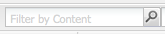

# Zoeken{#searching}

De auteursomgeving van AEM verstrekt diverse mechanismen om naar inhoud te zoeken, afhankelijk van het middeltype.

>[!NOTE]
>
>Buiten het auteursmilieu zijn andere mechanismen ook beschikbaar voor het zoeken, zoals de [ Bouwer van de Vraag ](/help/sites-developing/querybuilder-api.md) en [ CRXDE Lite ](/help/sites-developing/developing-with-crxde-lite.md).

## Basisinformatie zoeken {#search-basics}

Om tot het onderzoekspaneel toegang te hebben, klik het **lusje van het Onderzoek** bij de bovenkant van de linkerruit van de aangewezen console.

Met het deelvenster Zoeken kunt u al uw websitepagina&#39;s doorzoeken. Het bevat velden en widgets voor het volgende:

* **Fulltext**: Onderzoek naar de gespecificeerde tekst
* **Gewijzigd na/vóór**: Onderzoek slechts die pagina&#39;s die tussen de specifieke data werden veranderd
* **Malplaatje**: Onderzoek slechts die pagina&#39;s die op het gespecificeerde malplaatje worden gebaseerd
* **Markeringen**: Onderzoek slechts die pagina&#39;s met de gespecificeerde markeringen

>[!NOTE]
>
>Wanneer uw instantie voor [ het onderzoek van Lucene ](/help/sites-deploying/queries-and-indexing.md) wordt gevormd kunt u het volgende in **Fulltext** gebruiken:
>
>* [ Jokertekens ](https://lucene.apache.org/core/5_3_1/queryparser/org/apache/lucene/queryparser/classic/package-summary.html#Wildcard_Searches)
>* [ de Exploitanten van Boole ](https://lucene.apache.org/core/5_3_1/queryparser/org/apache/lucene/queryparser/classic/package-summary.html#Boolean_operators)
>
>* [ Reguliere uitdrukkingen ](https://lucene.apache.org/core/5_3_1/queryparser/org/apache/lucene/queryparser/classic/package-summary.html#Regexp_Searches)
>* [ Gebied groeperen ](https://lucene.apache.org/core/5_3_1/queryparser/org/apache/lucene/queryparser/classic/package-summary.html#Field_Grouping)
>* [ het Van een poot {](https://lucene.apache.org/core/5_3_1/queryparser/org/apache/lucene/queryparser/classic/package-summary.html#Boosting_a_Term)
>

Voer het onderzoek uit door **Onderzoek** bij de bodem van de ruit te klikken. Klik **Terugstellen** om de onderzoekscriteria te ontruimen.

## Filter {#filter}

Op verschillende locaties kan een filter worden ingesteld (en gewist) om de weergave omlaag te doorlopen en te verfijnen:

## Zoeken en vervangen {#find-and-replace}

In de **console van Websites** a **vindt &amp; vervangt** menuoptie laat u naar, en vervangt veelvoudige instanties van een koord, binnen een sectie van de website zoeken.

1. Selecteer de hoofdpagina, of map, waar de zoek- en vervangactie moet plaatsvinden.
1. Selecteer **toen de Hulpmiddelen van 0}** Vondst &amp; vervangt **:**

   

1. De **Vondst &amp; vervangt** dialoog doet het volgende:

   * bevestigt het hoofdpad waar de zoekactie moet beginnen
   * definieert de term die moet worden gevonden
   * bepaalt de termijn die het moet vervangen
   * Hiermee wordt aangegeven of de zoekopdracht hoofdlettergevoelig moet zijn
   * Hiermee wordt aangegeven of alleen hele woorden moeten worden gevonden (anders worden ook subtekenreeksen gevonden)

   Het klikken van **Voorproef** lijsten waar de termijn is gevonden. U kunt specifieke te vervangen exemplaren selecteren/wissen:

   

1. Klik **vervangen** om eigenlijk alle instanties te vervangen. U wordt gevraagd de actie te bevestigen.

Het standaardwerkingsgebied voor het vondst en vervangt servlet behandelt de volgende eigenschappen:

* `jcr:title`
* `jcr:description`
* `jcr:text`
* `text`

Het bereik kan worden gewijzigd met de Apache Felix Web Management Console (bijvoorbeeld bij `https://localhost:4502/system/console/configMgr` ). Selecteer `CQ WCM Find Replace Servlet (com.day.cq.wcm.core.impl.servlets.FindReplaceServlet)` en configureer het bereik naar wens.

>[!NOTE]
>
>In een standaardinstallatie AEM vindt en vervangt het gebruik van Lucene voor de zoekfunctionaliteit.
>
>Lucene indexeert tekenreekseigenschappen met een lengte van maximaal 16 k. Tekenreeksen die dit overschrijden, worden niet doorzocht.
