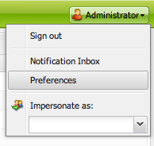

# Uw accountomgeving configureren{#configuring-your-account-environment}

Adobe Experience Manager (AEM) biedt u de mogelijkheid om uw account en bepaalde aspecten van de auteursomgeving te configureren.

Gebruikend de [&#x200B; rekeningsmontages &#x200B;](#account-settings) en [&#x200B; gebruikersvoorkeur &#x200B;](#user-preferences) kunnen de volgende opties en de voorkeur worden bepaald:

* **het Uitgeven Toolbar**
Selecteer of u de algemene bewerkingswerkbalk wilt gebruiken. Deze toolbar, die bij de bovenkant van het browser venster wordt getoond, geeft u **Exemplaar**, **Besnoeiing**, **Deeg**, **schrap** knopen voor het gebruiken met de paragraafcomponenten op die pagina:

   * Weergeven indien nodig (standaard)
   * Altijd tonen
   * Verborgen houden

* **impersonate als**
De functionaliteit van [&#x200B; imiteert als &#x200B;](/help/sites-administering/security.md#impersonating-another-user) laat een gebruikerswerk namens een andere gebruiker.

* **Taal**
De taal die voor UI van het auteursmilieu moet worden gebruikt. Selecteer de gewenste taal in de beschikbare lijst.

* **Beheer van het Venster**
Selecteer een van de volgende opties:

   * Meerdere vensters (standaard)
Pagina&#39;s worden geopend in een nieuw venster.
   * Eén venster
Pagina&#39;s worden geopend in het huidige venster.

## Accountinstellingen {#account-settings}

Met het gebruikerspictogram hebt u toegang tot de volgende opties:

* Afmelden
* [Imiteren als](/help/sites-administering/security.md#impersonating-another-user)
* [Gebruikersvoorkeuren](#user-preferences)
* [Melding in vak](/help/sites-classic-ui-authoring/author-env-inbox.md)

### Gebruikersvoorkeuren {#user-preferences}

Elke gebruiker kan bepaalde eigenschappen voor zichzelf instellen. Dit is beschikbaar van het **de dialoogvakje van de Voorkeur** in de hoger-juiste hoek van de consoles.

Het dialoogvenster bevat de volgende opties:

