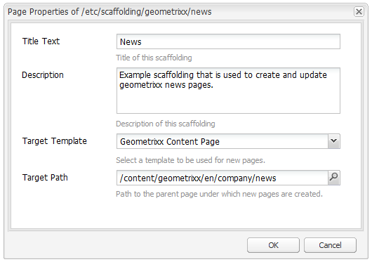

# Basisstructuur{#scaffolding}

Soms moet u een grote set pagina&#39;s maken die dezelfde structuur hebben maar andere inhoud hebben. Via de standaard-AEM-interface moet u elke pagina maken, de juiste componenten naar de pagina slepen en elk van de pagina&#39;s afzonderlijk invullen.

Met een basisstructuur kunt u een formulier (een basisblad) maken met velden die de gewenste structuur voor uw pagina&#39;s weerspiegelen. Met dit formulier kunt u eenvoudig pagina&#39;s maken op basis van deze structuur.

>[!NOTE]
>
>Basisstructuur (in de klassieke UI) [respecteert MSM-overerving](#scaffolding-with-msm-inheritance).

## Hoe structuur werkt {#how-scaffolding-works}

Schaalbestanden worden opgeslagen in de console **Tools** van de site-beheerder.

* Open de **console van Hulpmiddelen** en klik op het **StandaardGebied van de Pagina**.
* Klik onder deze optie op **geometrixx**.
* Onder **geometrixx** vindt u een *basispagina* met de naam **Nieuws**. Dubbelklik om deze pagina te openen.

Het subformulier bestaat uit een formulier met een veld voor elk stuk inhoud dat de pagina vormt die moet worden gemaakt en vier belangrijke parameters die kunnen worden geopend via de **Pagina-eigenschappen** van de basispagina.

De basispagina-eigenschappen zijn:

* **Tekst** titel: Dit is de naam van deze basispagina zelf. In dit voorbeeld heet het &quot;Nieuws&quot;.
* **Omschrijving**: Dit wordt onder de titel op de basispagina weergegeven.
* **Doelsjabloon**: Dit is de sjabloon die dit subbestand gebruikt wanneer het een nieuwe pagina maakt. In dit voorbeeld is het een sjabloon voor *Geometrixx-inhoudspagina* .
* **Doelpad**: Dit is het pad van de bovenliggende pagina waaronder dit subbestand nieuwe pagina&#39;s maakt. In dit voorbeeld is het pad */content/geometrixx/nl/news*.

Het lichaam van het substraat is de vorm. Wanneer een gebruiker een pagina wil maken met het subformulier, vult hij het formulier in en klikt u onderaan op *Maken*. In het **nieuwvoorbeeld** hierboven heeft het formulier de volgende velden:

* **Titel**: Dit is de naam van de pagina die moet worden gemaakt. Dit veld is altijd aanwezig op elk substraat.
* **Tekst**: Dit veld komt overeen met een tekstcomponent op de resulterende pagina.
* **Afbeelding**: Dit veld komt overeen met een afbeeldingscomponent op de resulterende pagina.
* **Afbeelding/Geavanceerd**: **Titel**:De titel van de afbeelding.
* **Afbeelding/Geavanceerd**: **Alt-tekst**: De alt-tekst voor de afbeelding.
* **Afbeelding/Geavanceerd**: **Omschrijving**: De beschrijving van de afbeelding.
* **Afbeelding/Geavanceerd**: **Grootte**: De grootte van de afbeelding.
* **Tags/trefwoorden**: Metagegevens die aan deze pagina moeten worden toegewezen. Dit veld is altijd aanwezig op elk substraat.

### Een stapel maken {#creating-a-scaffold}

Als u een nieuw subpagina wilt maken, gaat u naar de **gereedschapsconsole** , **Standaardpaginascheiding** en maakt u een nieuwe pagina. Er is één paginasjabloontype beschikbaar, de *sjabloon Sorteren.*

Ga naar de **Pagina-eigenschappen** van de nieuwe pagina en stel de *Titel Tekst*, *Beschrijving*, *Doelsjabloon* en *Doelpad* in, zoals hierboven beschreven.

Vervolgens moet u de structuur definiëren van de pagina die dit subbestand maakt. Hiervoor gaat u naar de **[ontwerpmodus](/help/sites-authoring/page-authoring.md#sidekick)**op de basispagina. Er wordt een koppeling weergegeven waarmee u het subbestand kunt bewerken in de **dialoogeditor**.

Met de dialoogeditor geeft u de eigenschappen op die worden gemaakt wanneer een nieuwe pagina wordt gemaakt met dit subbestand.

De dialoogdefinitie van een subset werkt op ongeveer dezelfde manier als een component (zie [Componenten](/help/sites-developing/components.md)). Er zijn echter enkele belangrijke verschillen van toepassing:

* Dialoogvensterdefinities van componenten worden weergegeven als normale dialoogvensters (zoals bijvoorbeeld in het middelste venster van de dialoogvenster-editor), terwijl definities van subdialoogvensters, hoewel deze als normale dialoogvensters in de dialoogeditor worden weergegeven, op de basispagina worden weergegeven als een subformulier (zoals hierboven in het **nieuwscaffold** wordt getoond).
* De dialoogvensters van de component verstrekken gebieden voor slechts die waarden nodig om de inhoud van één enkele specifieke component te bepalen. Een basisdialoogvenster moet velden bevatten voor elke eigenschap in elke alinea van de pagina die moet worden gemaakt.
* In het geval van componentdialoogvensters is de component die wordt gebruikt om de opgegeven inhoud te renderen impliciet en daarom wordt de eigenschap van de alinea automatisch ingevuld wanneer de alinea wordt gemaakt. `sling:resourceType` Met een subformulier moet alle informatie die zowel de inhoud als het toegewezen onderdeel voor een bepaalde alinea definieert, door het dialoogvenster zelf worden verstrekt. In basisdialoogvensters moet deze informatie worden opgegeven met *Verborgen* velden.

Als u het voorbeelddialoogvenster **Nieuws** in de dialoogeditor bekijkt, kunt u uitleggen hoe dit werkt. Ga naar de ontwerpmodus op de basispagina en klik op de koppeling voor de dialoogeditor.

Klik nu op het dialoogvenster **Dialoogvenster > Tabdeelvenster > Tekst > Tekst**, als volgt:

De eigenschappenlijst voor dit veld wordt als volgt weergegeven aan de rechterkant van de dialoogeditor:

Let op de eigenschap name voor dit veld. Het heeft de waarde

`./jcr:content/par/text/text`

Dit is de naam van de eigenschap waarnaar de inhoud van dit veld wordt geschreven wanneer het subbestand wordt gebruikt om een pagina te maken. De eigenschap wordt gedeclareerd als een relatief pad van het knooppunt dat staat voor de pagina die moet worden gemaakt. Hiermee wordt de eigenschapstekst onder de nodetekst opgegeven. Deze bevindt zich onder de nodepari, die zelf een onderliggend item is van het knooppunt jcr:content onder het paginaknooppunt.

Hiermee bepaalt u de locatie van de opslag van de inhoud voor de tekst die in dit veld wordt ingevoerd. Voor deze inhoud moeten echter nog twee kenmerken worden vastgesteld:

* Het feit dat de tekenreeks die hier wordt opgeslagen, moet worden geïnterpreteerd als *RTF-tekst*, en
* welke component moet worden gebruikt om deze inhoud weer te geven op de resulterende pagina.

Let op: in een normaal componentdialoogvenster hoeft u deze informatie niet op te geven omdat dit impliciet is in het feit dat het dialoogvenster al is gebonden aan een specifieke component.

Als u deze twee gegevens wilt opgeven, gebruikt u verborgen velden. Klik op het eerste verborgen veld **Dialoogvenster > Tab-venster > Tekst > Verborgen**, als volgt:

De eigenschappen van dit verborgen veld zijn als volgt:

De eigenschap name van dit verborgen veld is

`./jcr:content/par/text/textIsRich`

Dit is een Booleaanse eigenschap die wordt gebruikt om de tekstreeks te interpreteren die is opgeslagen bij `./jcr:content/par/text/text`.

Omdat we weten dat de tekst moet worden geïnterpreteerd als tekst met opmaak, geven we de `value` eigenschap van dit veld op als `true`.

>[!CAUTION]
>
>In de dialoogvenster-editor kan de gebruiker de waarden van *bestaande* eigenschappen in de dialoogdefinitie wijzigen. Om een nieuwe eigenschap toe te voegen, moet de gebruiker [CRXDE Lite](/help/sites-developing/developing-with-crxde-lite.md)gebruiken. Wanneer bijvoorbeeld een nieuw verborgen veld wordt toegevoegd aan een dialoogdefinitie met de dialoogeditor, heeft dit veld geen *waarde* -eigenschap (een eigenschap met de naam &quot;value&quot;). Als voor het verborgen veld in kwestie een standaardeigenschap voor de *waarde* moet worden ingesteld, moet deze eigenschap handmatig worden toegevoegd met een van de CRX-gereedschappen. De waarde kan niet worden toegevoegd met de dialoogeditor zelf. Als de eigenschap echter aanwezig is, kan de waarde ervan worden bewerkt in de dialoogeditor.

Het tweede verborgen veld is zichtbaar door er als volgt op te klikken:

De eigenschappen van dit verborgen veld zijn als volgt:

De eigenschap name van dit verborgen veld is

`./jcr:content/par/text/sling:resourceType`

en de vaste waarde die voor deze eigenschap is opgegeven, is

`foundation/components/textimage`

Geeft aan dat de component die moet worden gebruikt om de tekstinhoud van deze alinea te renderen, de component *Tekstafbeelding* is. Met behulp van de `isRichText` `./jcr:content/par/text/text` Booleaanse waarde die in het andere verborgen veld is opgegeven, kan de component de werkelijke tekenreeks renderen die op de gewenste manier is opgeslagen.

### Basisstructuur met MSM-overerving {#scaffolding-with-msm-inheritance}

In de klassieke UI, is het steigeren volledig geïntegreerd met overerving MSM (indien van toepassing).

Wanneer u een pagina opent in de **structuurmodus** (met het pictogram onder aan het hulpstuk), worden alle componenten die overerving ondergaan, aangegeven met:

* een slotsymbool (voor de meeste onderdelen); bijv. tekst en titel)
* een masker met de tekst **Klik om overerving** te annuleren (voor componenten van het Beeld)

Hierin ziet u dat de component niet kan worden bewerkt, totdat de overerving wordt geannuleerd.

>[!NOTE]
>
>Dit is vergelijkbaar met [overgeërfde componenten wanneer u pagina-inhoud](/help/sites-authoring/editing-content.md#inheritedcomponentsclassicui)bewerkt.

Als u op het vergrendelingssymbool of het afbeeldingspictogram klikt, kunt u de overerving verbreken:

* het symbool verandert in een open hangslot .
* als de vergrendeling eenmaal is opgeheven, kunt u de inhoud bewerken.

Na ontgrendelen kunt u de overerving herstellen door op het ontgrendelde hangslotsymbool te klikken. Alle bewerkingen die u hebt aangebracht, gaan hierdoor verloren.

>[!NOTE]
>
>Als de overerving wordt geannuleerd op paginaniveau (op het tabblad Bibliotheek van Pagina-eigenschappen), kunnen alle componenten worden bewerkt in de **sorteermodus** (ze worden weergegeven in ontgrendelde toestand).
