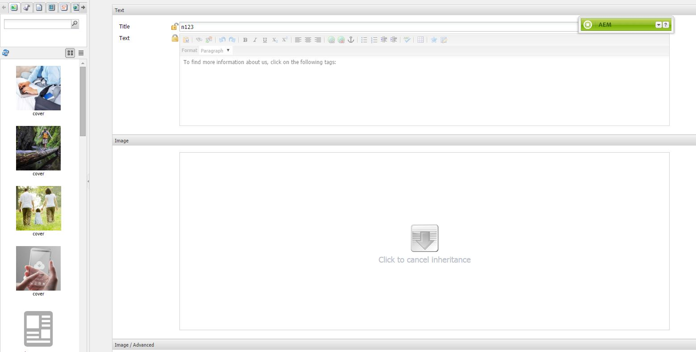

# Basisstructuur{#scaffolding}

Soms moet u een grote set pagina&#39;s maken die structuur delen, maar andere inhoud hebben. Via de standaard Adobe Experience Manager-interface (AEM) moet u elke pagina maken, de juiste componenten naar de pagina slepen en elk afzonderlijk invullen.

Met een basisstructuur kunt u een formulier (een basisblad) maken met velden die de gewenste structuur voor uw pagina&#39;s weerspiegelen. Met dit formulier kunt u eenvoudig op deze structuur gebaseerde pagina&#39;s maken.

>[!NOTE]
>
>Het filtreren (in klassieke UI) [ respecteert overerving MSM ](#scaffolding-with-msm-inheritance).

## Hoe structuur werkt {#how-scaffolding-works}

Steunen worden opgeslagen in de **console van Hulpmiddelen** van plaats admin.

* Open de **console van Hulpmiddelen**, en klik **Standaard het Kader van de Pagina**.
* Onder dit, klik **Geometrixx**.
* Onder **Geometrixx**, vindt u a *steile pagina* geroepen **Nieuws**. Dubbelklik om deze pagina te openen.

Het substraat bestaat uit een vorm met een gebied voor elk stuk van inhoud dat omhoog de te creëren pagina en vier belangrijke parameters zal maken die door de **Eigenschappen van de Pagina** van de steigerpagina worden betreden.

De basispagina-eigenschappen zijn:

* **Tekst van de Titel**: Dit is de naam van deze steigerpagina zelf. In dit voorbeeld heet het &#39;Nieuws&#39;.
* **Beschrijving**: Dit verschijnt onder de titel op de steigerpagina.
* **Malplaatje van het Doel**: Dit is het malplaatje dat dit subold zal gebruiken wanneer het tot een pagina leidt. In dit voorbeeld, is het a *malplaatje van de Pagina van de Inhoud van 0} Geometrixx.*
* **Weg van het Doel**: Dit is de weg van de ouderpagina waarbeneden dit subold pagina tot pagina&#39;s zal leiden. In dit voorbeeld is het pad */content/geometrixx/nl/news* .

Het lichaam van het substraat is de vorm. Wanneer een gebruiker een pagina wil tot stand brengen gebruikend het substraat vult uit de vorm en klikt *creeert*, bij de bodem. In het **Voorbeeld van het Nieuws** boven de vorm heeft de volgende gebieden:

* **Titel**: Dit is de naam van de te creëren pagina. Dit veld is altijd aanwezig op elk substraat.
* **Tekst**: Dit gebied beantwoordt aan een Component van de Tekst op de resulterende pagina.
* **Beeld**: Dit gebied beantwoordt aan een Component van het Beeld op de resulterende pagina.
* **Beeld/Geavanceerd**: **Titel**: De titel van het beeld.
* **Beeld/Geavanceerd**: **Tekst van Alt**: De alt tekst voor het beeld.
* **Beeld/Geavanceerd**: **Beschrijving**: De beschrijving van het beeld.
* **Beeld/Geavanceerd**: **Grootte**: De grootte van het beeld.
* **Markeringen/Sleutelwoorden**: Meta-gegevens die aan deze pagina moeten worden toegewezen. Dit veld is altijd aanwezig op elk substraat.

### Een stapel maken {#creating-a-scaffold}

Om een subold tot stand te brengen, ga naar de **console van Hulpmiddelen**, toen **StandaardBasisstructuur van de Pagina** en creeer een pagina. Één enkel type van paginamalplaatje is beschikbaar, het *Stapsgewijze Malplaatje.*

Ga naar de **Eigenschappen van de Pagina** van de nieuwe pagina en plaats de *Tekst van de Titel*, *Beschrijving*, *Malplaatje van het Doel*, en *Weg van het Doel*, zoals hierboven beschreven.

Vervolgens moet u de structuur definiëren van de pagina die dit subbestand maakt. Om dit te doen, ga in **[ontwerpwijze](/help/sites-authoring/page-authoring.md#sidekick)** op de steigerpagina. Een verbinding verschijnt, latend u het subold in de **dialoogredacteur** uitgeven.

Met de dialoogeditor geeft u de eigenschappen op die worden gemaakt wanneer een nieuwe pagina wordt gemaakt met dit subbestand.

De dialoogdefinitie voor een basiswerk gelijkaardig aan dat van een component (zie [ Componenten ](/help/sites-developing/components.md)). Er zijn echter enkele belangrijke verschillen van toepassing:

* De de dialoogdefinities van de component worden teruggegeven als normale dialoogvakjes (zoals aangetoond in de middelste ruit van de dialoogredacteur, bijvoorbeeld) terwijl de gesegmenteerde dialoogdefinities, hoewel zij als normale dialoogvakjes in de dialoogredacteur verschijnen, op de basispagina als basisvorm (zoals aangetoond in het **Vernieuwen** hierboven) worden teruggegeven.
* De dialoogvensters van de component verstrekken gebieden voor slechts die waarden nodig om de inhoud van één enkele specifieke component te bepalen. Een basisdialoogvenster moet velden bevatten voor elke eigenschap in elke alinea van de pagina die moet worden gemaakt.
* Als er componentdialoogvensters zijn, is de component die wordt gebruikt om de opgegeven inhoud te renderen impliciet en wordt daarom de eigenschap `sling:resourceType` van de alinea automatisch ingevuld wanneer de alinea wordt gemaakt. Met een subformulier moet alle informatie die zowel de inhoud als het toegewezen onderdeel voor een bepaalde alinea definieert, door het dialoogvenster zelf worden verstrekt. In subold dialogs moet deze informatie worden verstrekt door *Verborgen* gebieden te gebruiken om deze informatie over paginaverwezenlijking voor te leggen.

Een blik op de voorbeeld **het steile dialoog van het News** in de dialoogredacteur helpt om te verklaren hoe dit werkt. Ga naar de ontwerpmodus op de basispagina en klik op de koppeling voor de dialoogeditor.

Nu, klik de dialoog van het de dialoogvakje **Dialoog > Comité van het Lusje > Tekst > Tekst**, als dit:

De eigenschappenlijst voor dit veld wordt als volgt weergegeven aan de rechterkant van de dialoogeditor:

Let op de eigenschap name voor dit veld. Het heeft de waarde

`./jcr:content/par/text/text`

Dit is de naam van de eigenschap waarnaar de inhoud van dit veld wordt geschreven wanneer het subbestand wordt gebruikt om een pagina te maken. De eigenschap wordt gedeclareerd als een relatief pad van het knooppunt dat staat voor de pagina die moet worden gemaakt. Hiermee wordt de eigenschapstekst onder de nodetekst opgegeven. Deze bevindt zich onder de nodepari, die zelf een onderliggend item is van het knooppunt jcr:content onder het paginaknooppunt.

Hiermee bepaalt u de locatie van de opslag van de inhoud voor de tekst die in dit veld wordt ingevoerd. Voor deze inhoud moeten echter nog twee kenmerken worden vastgesteld:

* Het feit dat het koord dat hier wordt opgeslagen als *rijke tekst* moet worden geïnterpreteerd, en
* welke component moet worden gebruikt om deze inhoud weer te geven op de resulterende pagina.

In een normaal componentendialoog zou u deze informatie niet moeten specificeren omdat het impliciet in het feit is dat de dialoog reeds aan een specifieke component gebonden is.

Als u deze twee gegevens wilt opgeven, gebruikt u verborgen velden. Klik het eerste verborgen gebied **Dialoog > Comité van het Lusje > Tekst > Verborgen**, als dit:

De eigenschappen van dit verborgen veld zijn als volgt:

De eigenschap name van dit verborgen veld is

`./jcr:content/par/text/textIsRich`

Dit is een Booleaanse eigenschap die wordt gebruikt om de tekstreeks te interpreteren die zich op `./jcr:content/par/text/text` bevindt.

Omdat we weten dat de tekst moet worden geïnterpreteerd als tekst met opmaak, geven we de eigenschap `value` van dit veld op als `true` .

>[!CAUTION]
>
>De dialoogredacteur staat de gebruiker toe om de waarden van *bestaande* eigenschappen in de dialoogdefinitie te veranderen. Om een nieuw bezit toe te voegen, moet de gebruiker [ CRXDE Lite ](/help/sites-developing/developing-with-crxde-lite.md) gebruiken. Bijvoorbeeld, wanneer een nieuw verborgen gebied aan een dialoogdefinitie met de dialoogredacteur wordt toegevoegd heeft het geen a *waarde* bezit (namelijk een bezit met de naam &quot;waarde&quot;). Als voor het verborgen veld in kwestie een standaardeigenschap moet worden ingesteld, moet deze eigenschap handmatig worden toegevoegd met een van de CRX-gereedschappen. De waarde kan niet worden toegevoegd met de dialoogeditor zelf. Als de eigenschap echter aanwezig is, kan de waarde ervan worden bewerkt in de dialoogeditor.

Het tweede verborgen veld kan worden weergegeven door er als volgt op te klikken:

De eigenschappen van dit verborgen veld zijn als volgt:

De eigenschap name van dit verborgen veld is

`./jcr:content/par/text/sling:resourceType`

De vaste waarde die voor deze eigenschap is opgegeven, is

`foundation/components/textimage`

Dit specificeert dat de component die moet worden gebruikt om de tekstinhoud van deze paragraaf terug te geven is de *component van het Beeld van de Tekst 0} {.* Met de Booleaanse waarde `isRichText` die in het andere verborgen veld is opgegeven, kan de component de werkelijke tekenreeks die op `./jcr:content/par/text/text` is opgeslagen, op de gewenste manier renderen.

### Basisstructuur met MSM-overerving {#scaffolding-with-msm-inheritance}

In de klassieke UI, is het steigeren volledig geïntegreerd met overerving MSM (indien van toepassing).

Wanneer u een pagina op **het Omzetten van de Basisvolgorde** wijze (gebruikend het pictogram bij de bodem van sidekick) opent zullen om het even welke componenten die aan overerving onderworpen zijn door worden aangewezen:

* een vergrendelingssymbool (voor de meeste componenten, bijvoorbeeld Tekst en Titel)
* een masker met de tekst **klikt om overerving** (voor de componenten van het Beeld) te annuleren

Hierin ziet u dat de component niet kan worden bewerkt, totdat de overerving wordt geannuleerd.

>[!NOTE]
>
>Dit is vergelijkbaar met [ geërfte componenten wanneer het uitgeven van paginacontent ](/help/sites-authoring/editing-content.md#inheritedcomponentsclassicui).

Als u op het vergrendelingssymbool of het afbeeldingspictogram klikt, kunt u de overerving verbreken:

* het symbool verandert in een open hangslot.
* als de vergrendeling eenmaal is opgeheven, kunt u de inhoud bewerken.

Na ontgrendelen kunt u de overerving herstellen door op het ontgrendelde hangslotsymbool te klikken. Alle bewerkingen die u hebt aangebracht, gaan hierdoor verloren.

>[!NOTE]
>
>Als de overerving op het paginaniveau (van het lusje van de Lezing van het lusje van de Eigenschappen van de Pagina) wordt geannuleerd, dan zijn alle componenten editable op **het Kader** wijze (zij worden getoond in een ontgrendelde staat).
