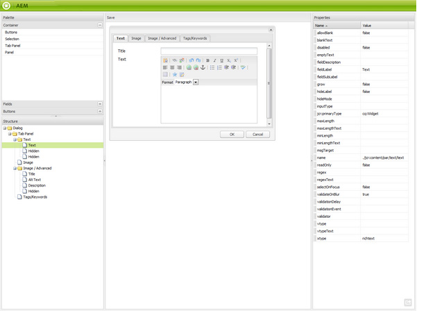
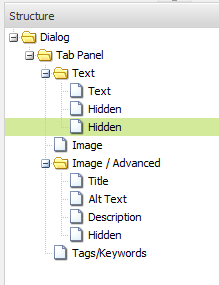

# Basisstructuur{#scaffolding}

Soms moet u een grote set pagina&#39;s maken die structuur delen, maar andere inhoud hebben. Via de standaard Adobe Experience Manager-interface (AEM) moet u elke pagina maken, de juiste componenten naar de pagina slepen en elk afzonderlijk invullen.

Met een basisstructuur kunt u een formulier (een basisblad) maken met velden die de gewenste structuur voor uw pagina&#39;s weerspiegelen. Met dit formulier kunt u eenvoudig op deze structuur gebaseerde pagina&#39;s maken.

>[!NOTE]
>
>Basisstructuur (in de klassieke gebruikersinterface) [respecteert MSM-overerving](#scaffolding-with-msm-inheritance).

## Hoe structuur werkt {#how-scaffolding-works}

Basispagina&#39;s worden opgeslagen in de **Gereedschappen** console van de sitebeheerder.

* Open de **Gereedschappen** console, en klik **Standaardpaginascheiding**.
* Klik onder deze optie op **Geometrixx**.
* Onder **Geometrixx**, vindt u een *basispagina* gebeld **Nieuws**. Dubbelklik om deze pagina te openen.

Het subformulier bestaat uit een formulier met een veld voor elk stuk inhoud dat de pagina zal vormen die moet worden gemaakt en vier belangrijke parameters die via het **Pagina-eigenschappen** van de basispagina.

De basispagina-eigenschappen zijn:

* **Titeltekst**: Dit is de naam van deze basispagina zelf. In dit voorbeeld heet het &#39;Nieuws&#39;.
* **Beschrijving**: Dit wordt onder de titel op de basispagina weergegeven.
* **Doelsjabloon**: Dit is de sjabloon die in dit subbestand wordt gebruikt wanneer een pagina wordt gemaakt. In dit voorbeeld is het een *Pagina met inhoud Geometrixx* sjabloon.
* **Doelpad**: Dit is het pad van de bovenliggende pagina waaronder met dit subbestand pagina&#39;s worden gemaakt. In dit voorbeeld is het pad */content/geometrixx/nl/news*.

Het lichaam van het substraat is de vorm. Wanneer een gebruiker een pagina wil maken met het subformulier, vult hij het formulier in en klikt u op *Maken*, onderaan. In de **Nieuws** Het voorbeeld boven het formulier heeft de volgende velden:

* **Titel**: Dit is de naam van de pagina die moet worden gemaakt. Dit veld is altijd aanwezig op elk substraat.
* **Tekst**: Dit veld komt overeen met een tekstcomponent op de resulterende pagina.
* **Afbeelding**: Dit veld komt overeen met een afbeeldingscomponent op de resulterende pagina.
* **Afbeelding/Geavanceerd**: **Titel**: De titel van de afbeelding.
* **Afbeelding/Geavanceerd**: **Alt-tekst**: De alt-tekst voor de afbeelding.
* **Afbeelding/Geavanceerd**: **Beschrijving**: De beschrijving van de afbeelding.
* **Afbeelding/Geavanceerd**: **Grootte**: De grootte van de afbeelding.
* **Tags/trefwoorden**: Metagegevens die aan deze pagina moeten worden toegewezen. Dit veld is altijd aanwezig op elk substraat.

### Een stapel maken {#creating-a-scaffold}

Als u een subpagina wilt maken, gaat u naar de **Gereedschappen** console, dan **Standaardpaginascheiding** en maakt u een pagina. Er is één paginasjabloontype beschikbaar, namelijk *Basisstructuursjabloon.*

Ga naar de **Pagina-eigenschappen** van de nieuwe pagina en stel de *Titeltekst*, *Beschrijving*, *Doelsjabloon*, en *Doelpad*, zoals hierboven beschreven.

Vervolgens moet u de structuur definiëren van de pagina die dit subbestand maakt. Om dit te doen, ga **[ontwerpmodus](/help/sites-authoring/page-authoring.md#sidekick)** op de basispagina. Er verschijnt een koppeling waarmee u het subformulier kunt bewerken in het dialoogvenster **dialoogeditor**.

Met de dialoogeditor geeft u de eigenschappen op die worden gemaakt wanneer een nieuwe pagina wordt gemaakt met dit subbestand.

De dialoogdefinitie van een subformulier werkt op dezelfde manier als een component (zie [Componenten](/help/sites-developing/components.md)). Er zijn echter enkele belangrijke verschillen van toepassing:

* Componentdialoogdefinities worden weergegeven als normale dialoogvensters (zoals bijvoorbeeld in het middelste venster van de dialoogvenster-editor), terwijl definities van de subdialoogvensters, hoewel deze als normale dialoogvensters in de dialoogeditor worden weergegeven, op de basispagina worden weergegeven als een subformulier (zoals in het dialoogvenster **Nieuws** steiger).
* De dialoogvensters van de component verstrekken gebieden voor slechts die waarden nodig om de inhoud van één enkele specifieke component te bepalen. Een basisdialoogvenster moet velden bevatten voor elke eigenschap in elke alinea van de pagina die moet worden gemaakt.
* Als er componentendialogen zijn, is de component die wordt gebruikt om de gespecificeerde inhoud terug te geven impliciet en daarom `sling:resourceType` wordt automatisch ingevuld wanneer de alinea wordt gemaakt. Met een subformulier moet alle informatie die zowel de inhoud als het toegewezen onderdeel voor een bepaalde alinea definieert, door het dialoogvenster zelf worden verstrekt. In basisdialoogvensters moet deze informatie worden verstrekt door *Verborgen* velden om deze informatie te verzenden bij het maken van pagina&#39;s.

Een blik bij het voorbeeld **Nieuws** het subold-dialoogvenster in de dialoogeditor helpt u uit te leggen hoe dit werkt. Ga naar de ontwerpmodus op de basispagina en klik op de koppeling voor de dialoogeditor.

Klik nu op het dialoogvenster **Dialog > Tab Panel > Text > Text**, als volgt:

De eigenschappenlijst voor dit veld wordt als volgt weergegeven aan de rechterkant van de dialoogeditor:

Let op de eigenschap name voor dit veld. Het heeft de waarde

`./jcr:content/par/text/text`

Dit is de naam van de eigenschap waarnaar de inhoud van dit veld wordt geschreven wanneer het subbestand wordt gebruikt om een pagina te maken. De eigenschap wordt gedeclareerd als een relatief pad van het knooppunt dat staat voor de pagina die moet worden gemaakt. Hiermee wordt de eigenschapstekst onder de nodetekst opgegeven. Deze bevindt zich onder de nodepari, die zelf een onderliggend item is van het knooppunt jcr:content onder het paginaknooppunt.

Hiermee bepaalt u de locatie van de opslag van de inhoud voor de tekst die in dit veld wordt ingevoerd. Voor deze inhoud moeten echter nog twee kenmerken worden vastgesteld:

* Het feit dat de hier opgeslagen tekenreeks moet worden geïnterpreteerd als *rijke tekst*, en
* welke component moet worden gebruikt om deze inhoud weer te geven op de resulterende pagina.

In een normaal componentendialoog zou u deze informatie niet moeten specificeren omdat het impliciet in het feit is dat de dialoog reeds aan een specifieke component gebonden is.

Als u deze twee gegevens wilt opgeven, gebruikt u verborgen velden. Klik op het eerste verborgen veld **Dialog > Tab Panel > Text > Hidden**, als volgt:

De eigenschappen van dit verborgen veld zijn als volgt:

De eigenschap name van dit verborgen veld is

`./jcr:content/par/text/textIsRich`

Dit is een Booleaanse eigenschap die wordt gebruikt om de tekstreeks te interpreteren die is opgeslagen op `./jcr:content/par/text/text`.

Omdat we weten dat de tekst moet worden geïnterpreteerd als tekst met opmaak, moeten we de eigenschap `value` eigenschap van dit veld als `true`.

>[!CAUTION]
>
>In de dialoogvenster-editor kan de gebruiker de waarden wijzigen van *bestaand* in de definitie van het dialoogvenster. Om een nieuwe eigenschap toe te voegen, moet de gebruiker [CRXDE Lite](/help/sites-developing/developing-with-crxde-lite.md). Wanneer bijvoorbeeld een nieuw verborgen veld wordt toegevoegd aan een dialoogdefinitie met de dialoogeditor, heeft dit veld geen *value* eigenschap (dat wil zeggen, een eigenschap met de naam &quot;value&quot;). Als voor het verborgen veld in kwestie een standaardeigenschap moet worden ingesteld, moet deze eigenschap handmatig met een van de CRX-gereedschappen worden toegevoegd. De waarde kan niet worden toegevoegd met de dialoogeditor zelf. Als de eigenschap echter aanwezig is, kan de waarde ervan worden bewerkt in de dialoogeditor.

Het tweede verborgen veld kan worden weergegeven door er als volgt op te klikken:

De eigenschappen van dit verborgen veld zijn als volgt:

De eigenschap name van dit verborgen veld is

`./jcr:content/par/text/sling:resourceType`

De vaste waarde die voor deze eigenschap is opgegeven, is

`foundation/components/textimage`

Geeft aan dat de component die moet worden gebruikt om de tekstinhoud van deze alinea weer te geven, de component *Tekstafbeelding* component. Met de opdracht `isRichText` Booleaanse waarde die in het andere verborgen veld is opgegeven, kan de component de werkelijke tekstreeks renderen die is opgeslagen op `./jcr:content/par/text/text` op de gewenste manier.

### Basisstructuur met MSM-overerving {#scaffolding-with-msm-inheritance}

In de klassieke UI, is het steigeren volledig geïntegreerd met overerving MSM (indien van toepassing).

Wanneer u een pagina opent in **Basisstructuur** in de modus (met het pictogram onder aan sidekick) worden alle componenten die overerving ondergaan, aangeduid met:

* een vergrendelingssymbool (voor de meeste componenten, bijvoorbeeld Tekst en Titel)
* een masker met de tekst **Klik om overname te annuleren** (voor afbeeldingscomponenten)

Hierin ziet u dat de component niet kan worden bewerkt, totdat de overerving wordt geannuleerd.

>[!NOTE]
>
>Dit is vergelijkbaar met [overgeërfde componenten bij het bewerken van pagina-inhoud](/help/sites-authoring/editing-content.md#inheritedcomponentsclassicui).

Als u op het vergrendelingssymbool of het afbeeldingspictogram klikt, kunt u de overerving verbreken:

* het symbool verandert in een open hangslot.
* als de vergrendeling eenmaal is opgeheven, kunt u de inhoud bewerken.

Na ontgrendelen kunt u de overerving herstellen door op het ontgrendelde hangslotsymbool te klikken. Alle bewerkingen die u hebt aangebracht, gaan hierdoor verloren.

>[!NOTE]
>
>Als de overerving op paginaniveau wordt geannuleerd (op het tabblad Bibliotheek van Pagina-eigenschappen), kunnen alle componenten worden bewerkt in **Basisstructuur** modus (deze worden in ontgrendelde toestand weergegeven).
