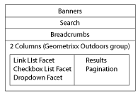

# Search&amp;Promote toevoegen aan uw pagina{#adding-search-promote-features-to-your-page}

Als u de mogelijkheden van Search&amp;Promote wilt integreren in uw website, gebruikt u de onderdelen Search&amp;Promote om de volgende functies aan uw pagina&#39;s toe te voegen:

* Trefwoordzoekopdracht
* Pagina met zoekresultaten
* Zoekverfijning
* Banners

Merk op dat u de mogelijkheden van de Search&amp;Promote slechts kunt gebruiken als uw AEM beheerder hen heeft toegelaten. Zie [Integreren met Adobe Search&amp;Promote](/help/sites-administering/search-and-promote.md).

Facetten worden gevormd op de server van de Search&amp;Promote, zoals de informatie die elke component verstrekt. De volgende tabel bevat een korte beschrijving van elke component. De volgende secties verstrekken gedetailleerde informatie over hun gebruik.

<table>
 <tbody>
  <tr>
   <th>component Search&amp;Promote</th>
   <th>Beschrijving</th>
  </tr>
  <tr>
   <td>Banners</td>
   <td>Hiermee geeft u banneradvertenties weer. Banners worden geselecteerd op basis van gegevens die via Search&amp;Promote zijn verzameld.  </td>
  </tr>
  <tr>
   <td>Broodkruimels</td>
   <td>Geeft het zoekwoord en de reeks filters weer die de gebruiker op de zoekresultaten heeft toegepast.</td>
  </tr>
  <tr>
   <td>Selectievakje List-Facet</td>
   <td>Een lijst met selectievakjes voor het selecteren van facetten voor het filteren van zoekresultaten.</td>
  </tr>
  <tr>
   <td>Vervolgkeuzefactor</td>
   <td>Een vervolgkeuzelijst met facetten voor het filteren van zoekresultaten.</td>
  </tr>
  <tr>
   <td>Koppelingslijstfacet</td>
   <td>Een lijst met facetkoppelingen voor het filteren van zoekresultaten.</td>
  </tr>
  <tr>
   <td>Paginering</td>
   <td>Hiermee regelt u het navigeren door pagina's met zoekresultaten.</td>
  </tr>
  <tr>
   <td>Resultaten</td>
   <td>Geeft de resultaten van een trefwoordzoekopdracht weer.</td>
  </tr>
  <tr>
   <td>Zoeken</td>
   <td>Hiermee voegt u een zoekveld aan de pagina toe.</td>
  </tr>
 </tbody>
</table>

## De pagina {#creating-the-search-results-page} met zoekresultaten maken

Gebruik de console van Websites WCM om een pagina tot stand te brengen voor het tonen van onderzoeksresultaten. De resultaten van een zoekopdracht vanuit een zoekcomponent kunnen op deze pagina worden weergegeven als deze dezelfde Search&amp;Promote-service gebruikt.

De componenten waarmee gebruikers zoekresultaten kunnen bekijken, zijn Resultaten en Paginering. De component **Results** heeft geen configureerbare eigenschappen in de modus Bewerken of Ontwerpen. De component Resultaten geeft alleen de zoekresultaten weer, die koppelingen naar andere pagina&#39;s bevatten, en geeft het aantal resultaten voor het trefwoord Zoeken weer.

Met de component **Paginering** kunnen gebruikers door meerdere pagina&#39;s met zoekresultaten navigeren. De gebruiker kan het aantal pagina&#39;s zien, naar de volgende of vorige pagina gaan, een pagina selecteren om te openen, of alle resultaten op één pagina consolideren.

U kunt de volgende componenteneigenschappen op Edit wijze vormen om runtime gedrag te controleren:

* Eén resultatenpagina verbergen: Selecteer deze optie om de besturingselementen voor paginanavigatie te verbergen wanneer de zoekopdracht één pagina met resultaten retourneert.
* Eerste/laatste verbergen: Selecteer deze optie om te voorkomen dat gebruikers naar de eerste of laatste pagina met resultaten gaan.
* Vorige/volgende verbergen: Hiermee bepaalt u of gebruikers door resultatenpagina&#39;s kunnen navigeren ten opzichte van de huidige pagina.
* Alle weergaven verbergen: Hiermee bepaalt u of de gebruiker alle zoekresultaten op één pagina kan samenvoegen. Gewoonlijk maakt het verstrekken van gepagineerde gegevens efficiënter gebruik van servermiddelen. Selecteer deze optie als u wilt voorkomen dat grote gegevenssets in één antwoordbericht worden overgedragen.

### Filteren van resultaten op facetten {#enabling-the-filtering-of-results-by-facets} inschakelen

U kunt gebruikers toestaan om onderzoeksresultaten door facetten te filtreren. Met de componenten **Checkbox List Facet**, **Dropdown Facet** en **Link List Facet** kunnen gebruikers een of meer facetten selecteren om te filteren. Wanneer u deze componenten gebruikt, moet u ook de component **Breadcrumbs** opnemen. Broodkruimels geven de huidige filters aan die worden gebruikt.

De **CheckBox List Facet**, **Dropdown Facet** en **Link List Facet** componenten hebben elk de volgende eigenschappen die u in **Edit** modus configureert:

* **Naam** facet: De naam van het facet dat voor filters wordt gebruikt.

De **component Checkbox List Facet** geeft een lijst met facetten weer met een bijbehorend selectievakje. Gebruik een **Selectievakjeslijstfacet** zodat gebruikers een subset van resultaten kunnen weergeven die items van meerdere facetten bevatten. Het facet **Merk** is bijvoorbeeld geschikt omdat meerdere merken hetzelfde type product leveren.

Er wordt een selectievakje weergegeven voor elk facet dat aan een zoekresultaat is gekoppeld. Wanneer een gebruiker een selectievakje selecteert, wordt de pagina opnieuw geladen met een bijgewerkte resultatenset. Alle selectievakjes blijven op de pagina aanwezig, zodat klanten op elk gewenst moment facetten aan het filter kunnen toevoegen of eruit kunnen verwijderen:

Met de component **Dropdown Facet** kunnen klanten een facetitem in een vervolgkeuzelijst selecteren. Deze component is handig wanneer u wilt dat klanten zich tegelijk op één facetitem richten. Bijvoorbeeld, is het facet van het Departement aangewezen voor het toelaten van klanten om productonderzoeken door geslacht te beperken. John zoekt naar *jeans* en filtert dan op de afdeling van Mannen.

De vervolgkeuzelijst wordt gevuld met de facetten die aan alle zoekresultaten zijn gekoppeld. Als u een item in de vervolgkeuzelijst selecteert, wordt de pagina opnieuw geladen met een bijgewerkte resultatenset. De punten in de drop-down lijst veranderen niet zodat de klanten van facet aan facet op elk ogenblik kunnen schakelen.

Met de component **Link List Facet** kunnen klanten hun focus geleidelijk beperken tot items die onder meerdere facetleden of facetten zijn gecategoriseerd.

De leden van Facet verschijnen als lijst van verbindingen. De tekst van elke koppeling is de naam van een facetlid dat is gekoppeld aan de huidige zoekresultaten. Wanneer een klant op een facetkoppeling klikt, wordt de pagina opnieuw geladen en wordt een subset van de zoekresultaten weergegeven. De lijst met koppelingen wordt dienovereenkomstig bijgewerkt, zodat de focus nog kleiner wordt.

De koppelingen in de lijst veranderen ook wanneer een filter wordt toegepast vanuit een ander type Search&amp;Promote-component. Het gebruik van meerdere typen filtercomponenten kan effectieve filtercombinaties opleveren.

Met de component **Breadcrumbs** kunnen klanten de filters zien die momenteel worden toegepast op zoekresultaten, in de volgorde waarin ze zijn toegepast. Klanten kunnen op de items in de broodkruimel klikken om terug te keren naar die filtercombinatie.

U kunt de volgende eigenschappen voor Breadcrubs op Edit wijze vormen om de blik van de component aan te passen:

* Scheidingsteken: Definieer de teken- of tekentekenreeks die moet fungeren als scheidingsteken tussen elke breadcrumb. In het veld Scheidingsteken kan elke tekenreeks als invoer worden geaccepteerd. De standaardinstelling is: &quot;>&quot; (zonder aanhalingstekens)
* Scheidingsteken navolgende: Definieer een teken- of tekentekenreeks die aan het einde van de breadcrumbs moet worden weergegeven. In het veld Scheidingsteken volgteken wordt elke tekenreeks als invoer geaccepteerd. De standaardinstelling voor deze waarde is *blank* (er wordt dus niets weergegeven aan het einde van de regel voor broodkruimels)

### Zoekvakken {#adding-search-boxes} toevoegen

Met de component Zoeken kunnen klanten trefwoordzoekopdrachten uitvoeren. Voeg componenten van het Onderzoek aan elke pagina toe waar u toegang tot het zoeken wilt verlenen.

Configureer de volgende eigenschappen in de modus Bewerken om het runtimegedrag te beheren:

* Pad naar resultatenpagina: Het pad naar de pagina waarop de zoekresultaten worden weergegeven.
* Automatisch aanvullen inschakelen: Selecteer deze optie om voorgestelde zoektrefwoorden weer te geven wanneer de klant in het zoekvak begint te typen.

### banners {#adding-banners} toevoegen

De component Banners geeft banneradvertenties weer op basis van de zoekopdrachten van de Search&amp;Promote van de klant. De logica op de zoek&amp;vervangingsserver bepaalt welke banner moet worden weergegeven. Een zoekopdracht op spijkerbroeken kan bijvoorbeeld tot gevolg hebben dat een modebanner wordt weergegeven. Door te filteren op de afdeling Mannen kan de keuze van de banner verder worden verfijnd.

De component Banners biedt een configureerbare eigenschap met de naam Bannergebied. Selecteer in de modus Bewerken een van de eigenschapswaarden om op te geven hoe de banner wordt weergegeven. De service Search&amp;Promote bepaalt de lijst met waarden die u kunt selecteren.

### Voorbeeld van Search&amp;Promote-zoekpagina {#example-search-promote-search-page}

Dit diagram toont de componenten die aan een pagina worden toegevoegd om tot de volledig-functionele hieronder Search&amp;Promote resultatenpagina te leiden.

 
