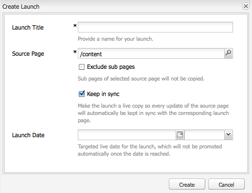

# Starten maken{#creating-launches}

Maak een lancering om het bijwerken van een nieuwe versie van bestaande Web-pagina&#39;s voor toekomstige activering toe te laten. Wanneer u een Starten creeert, specificeert u een titel en de bronpagina:

* De titel verschijnt in de **Sidekick**, van waar de auteurs tot hen kunnen toegang hebben om aan hen te werken.
* De onderliggende pagina&#39;s van de bronpagina worden standaard in de opstart opgenomen. U kunt desgewenst alleen de bronpagina gebruiken.
* Door gebrek, [ Levende Exemplaar ](/help/sites-administering/msm.md) werkt automatisch de lanceringspagina&#39;s bij aangezien de bronpagina&#39;s veranderen. U kunt opgeven dat er een statische kopie wordt gemaakt om automatische wijzigingen te voorkomen.

U kunt desgewenst de **Startdatum** (en -tijd) opgeven om te bepalen wanneer de startpagina&#39;s moeten worden gepromoveerd en geactiveerd. De **startdatum** werkt echter alleen in combinatie met de markering **Geschikt voor productie** (zie [Een startconfiguratie bewerken](/help/sites-classic-ui-authoring/classic-launches-editing.md#editing-a-launch-configuration)). Opdat de acties automatisch zouden optreden, moeten beide worden ingesteld.

## Starten maken {#creating-a-launch}

De volgende procedure leidt tot een lancering.

1. Open de het beleidspagina van de Website ([ http://localhost:4502/siteadmin ](http://localhost:4502/siteadmin)).
1. Klik **Nieuw...** toen **Nieuwe Lancering...**.
1. In **creeer de dialoog van de Lancering**, specificeer waarden voor de volgende eigenschappen:

   * **Titel van de Lancering**: De naam van de Lancering. De naam moet zinvol zijn voor auteurs.
   * **de Pagina van Source**: De weg aan de pagina waarvoor om de lancering tot stand te brengen. Standaard worden alle onderliggende pagina&#39;s opgenomen.
   * **sluit Subpagina&#39;s** uit: Selecteer deze optie om de lancering slechts voor de bronpagina en niet de kindpagina&#39;s tot stand te brengen. Deze optie is standaard niet geselecteerd.
   * **houden in Synchronisatie**: Selecteer deze optie om de inhoud van lanceringspagina&#39;s automatisch bij te werken wanneer de bronpagina&#39;s veranderen. Dit wordt bereikt door de lancering a [ levende exemplaar ](/help/sites-administering/msm.md) te maken.
   * **Datum van de Lancering**: De datum en de tijd wanneer het lanceringsexemplaar (afhankelijk van de **Klaar van de Productie** vlag moet worden geactiveerd; zie [ Lanceringen - de Orde van Gebeurtenissen ](/help/sites-authoring/launches.md#launches-the-order-of-events)).

   

1. Klik **creëren**.

## Een Starten verwijderen {#deleting-a-launch}

U kunt ook een opstart verwijderen.

1. In [ lanceert console ](/help/sites-classic-ui-authoring/classic-launches.md), selecteer de vereiste lancering.
1. Klik **Schrapping** - bevestiging wordt vereist:

   

   >[!CAUTION]
   >
   >Wanneer u geneste startpunten verwijdert, moet u eerst lagere niveaus verwijderen.
