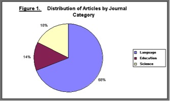

# Toegankelijke inhoud maken (WCAG 2.0-compatibiliteit){#creating-accessible-content-wcag-conformance}

>[!CAUTION]
>
>Omdat de klassieke gebruikersinterface in AEM 6.4 is vervangen, is de inhoud op deze pagina niet bijgewerkt voor WCAG 2.1.
>
>Raadpleeg de volgende pagina&#39;s voor meer informatie over AEM en WCAG 2.1:
>
>* [AEM en de Web Accessibility Guidelines](/help/managing/web-accessibility.md)
>* [Snelgids voor WCAG 2.1](/help/managing/qg-wcag.md)
>* [Toegankelijke content maken (WCAG 2.1-compatibiliteit)](/help/sites-authoring/creating-accessible-content.md)

WCAG 2.0 bestaat uit een reeks technologie-onafhankelijke richtlijnen en succescriteria om ervoor te zorgen dat webinhoud toegankelijk en bruikbaar is voor personen met een handicap.

>[!NOTE]
>
>Zie ook:
>
>* [Snelle gids aan WCAG 2.0](/help/managing/qg-wcag.md)
>* [De Rich Text Editor configureren voor het produceren van toegankelijke inhoud](/help/sites-administering/rte-accessible-content.md)
>

Deze richtlijnen worden ingedeeld op basis van drie conformiteitsniveaus: Niveau A (laagste), Niveau AA en Niveau AAA (hoogste). De niveaus worden kort samengevat als volgt gedefinieerd:

* **Niveau A:** Uw site bereikt een minimaal basistoegankelijkheidsniveau. Om aan dit niveau te voldoen moet aan alle slagingscriteria voor Niveau A worden voldaan.
* **Niveau AA:** Het ideale toegankelijkheidsniveau waarnaar u wilt streven, waarbij uw site een verbeterd toegankelijkheidsniveau bereikt, zodat deze in de meeste situaties toegankelijk is voor de meeste mensen die de meeste technologieën gebruiken. Om aan dit niveau te voldoen moet aan alle slagingscriteria voor Niveau A en Niveau AA worden voldaan.
* **Niveau AAA:** Uw site heeft een hoge mate van toegankelijkheid. Om aan dit niveau te voldoen moet aan alle slagingscriteria voor Niveau A, Niveau AA en Niveau AAA worden voldaan.

Wanneer u uw site maakt, moet u het algemene niveau bepalen waaraan u uw site wilt laten voldoen.

In het volgende gedeelte wordt de [WCAG 2.0-richtsnoeren](https://www.w3.org/TR/WCAG20/#guidelines) met de bijbehorende succescriteria voor niveau A en niveau A [conformiteitsniveaus](https://www.w3.org/TR/UNDERSTANDING-WCAG20/conformance.html).

>[!NOTE]
>
>Aangezien het niet mogelijk is om voor bepaalde soorten inhoud aan alle criteria van de Amerikaanse club van automobilisten van niveau A te voldoen, wordt het niet aanbevolen dat dit niveau van overeenstemming als algemeen beleid wordt vereist.

>[!NOTE]
>
>In dit document wordt het volgende gebruikt:
>
>* de korte namen van de [WCAG 2.0-richtsnoeren](https://www.w3.org/TR/WCAG20/#guidelines).
>* de nummering die wordt gebruikt in de [WCAG 2.0-richtsnoeren](https://www.w3.org/TR/WCAG20/#guidelines) kruisverwijzingen met de WCAG-website te ondersteunen.
>

## Beginsel 1: Overdraagbaar {#principle-perceivable}

[Beginsel 1: Perceerbaar - Informatie en gebruikersinterfacecomponenten moeten op waarneembare wijze aan de gebruikers kunnen worden getoond.](https://www.w3.org/TR/WCAG20/#perceivable)

### Alternatieven voor tekst (1.1) {#text-alternatives}

[Richtsnoer 1.1 Alternatieven voor tekst: bieden tekstalternatieven voor alle niet-tekstuele inhoud zodat deze kan worden gewijzigd in andere formulieren die mensen nodig hebben, zoals grote gedrukte tekst, braille, spraak, symbolen of eenvoudigere taal.](https://www.w3.org/TR/WCAG20/#text-equiv)

### Niet-tekstuele inhoud (1.1.1) {#non-text-content}

* Succescriterium 1.1.1
* Niveau A
* Niet-tekstuele inhoud: alle niet-tekstuele inhoud die aan de gebruiker wordt aangeboden, heeft een tekstalternatief dat hetzelfde doel dient, behalve in de onderstaande situaties.

#### Doel - Niet-tekstuele inhoud (1.1.1) {#purpose-non-text-content}

Informatie op een webpagina kan in vele verschillende niet-tekstindelingen worden opgegeven, zoals afbeeldingen, video&#39;s, animaties, grafieken en grafieken. Personen die blind zijn of een ernstige visuele handicap hebben, kunnen geen niet-tekstuele inhoud zien, maar hebben wel toegang tot tekstinhoud door deze door een schermlezer te laten lezen of in tactiele vorm te laten weergeven door een brailleweergaveapparaat. Dus door tekstalternatieven voor inhoud in grafische indeling te bieden, kunnen mensen die niet zien dat grafische inhoud toegang heeft tot een equivalente versie van de informatie die de inhoud biedt.

Een nuttig extra voordeel is dat tekstopties het mogelijk maken dat niet-tekstuele inhoud wordt geïndexeerd door zoekmachinetechnologie.

#### Ontmoeten - Niet-tekstuele inhoud (1.1.1) {#how-to-meet-non-text-content}

Voor statische afbeeldingen is het basisvereiste dat een equivalent tekstalternatief voor de afbeelding wordt geboden. Deze methode wordt uitgevoerd in het dialoogvenster **Alt-tekst** veld:

>[!NOTE]
>
>Sommige standaardcomponenten, zoals **Carrousel** en **Diapresentatie**, bieden geen manier om alternatieve tekstbeschrijvingen aan afbeeldingen toe te voegen. Wanneer het uitvoeren van versies van deze componenten voor uw AEM instantie, zou uw ontwikkelingsteam dergelijke componenten moeten vormen om `alt` kenmerk. Hiermee zorgt u ervoor dat auteurs het aan de inhoud kunnen toevoegen (zie [Ondersteuning toevoegen voor extra HTML-elementen en -kenmerken](/help/sites-administering/rte-accessible-content.md#add-support-for-more-html-elements-and-attributes)).

De **Alt-tekst** is beschikbaar in het dialoogvenster **Geavanceerd** tabblad Eigenschappen van afbeelding van het tabblad **Afbeelding** dialoogvenster component:


AEM voegt een **Alt-tekst** in uw afbeeldingen. Voor klassieke UI, zijn er twee verschillende scenario&#39;s voor hoe het standaardattribuut wordt gecreeerd, hoewel de standaardwaarde als alternatief kan niet voldoende zijn en waarschijnlijk moet in worden uitgegeven **Geavanceerd** tabblad Eigenschappen van afbeelding:

* Bestand:

  Een afbeelding wordt geüpload vanaf de vaste schijf van de gebruiker. Als u een afbeeldingscomponent aan een pagina toevoegt en vervolgens een afbeelding op de vaste schijf of een andere bron kiest, wordt de standaardwaarde voor **Alt-tekst** is `file`. Deze waarde moet worden gewijzigd in het dialoogvenster **Geavanceerd** tabblad Eigenschappen van afbeelding. Deze waarde wordt opnieuw niet weergegeven in het dialoogvenster **Alt-tekst** , maar als de waarde wordt gewijzigd, wordt de nieuwe waarde in het veld weergegeven.

* Element:

  Er wordt een afbeelding toegevoegd vanuit de gegevensopslagruimte voor digitale middelen. Als u een afbeelding van de gegevensopslagruimte voor digitale middelen naar een webpagina sleept, **Titel** en **Alt-tekst** worden waarden voor die afbeelding ontleend aan de metagegevens voor die afbeelding.

>[!NOTE]
>
>In beide bovenstaande scenario&#39;s wordt de standaardwaarde **Alt-tekst** waarde is niet zichtbaar in het dialoogvenster **Geavanceerde afbeeldingseigenschappen** tab. Als u de standaardwaarde wilt wijzigen, voert u eenvoudig een nieuwe waarde in het dialoogvenster **Alt-tekst** veld.

>[!NOTE]
>
>Als uw afbeelding zuiver decoratief is (zie [Alternatieven voor goede tekst maken](#creating-good-text-alternatives)), kunt u een spatie invoeren in het dialoogvenster **Alt-tekst** met de spatiebalk. Hiermee maakt u een lege `alt` -kenmerk, dat een schermlezer vraagt de afbeelding te negeren.

#### Alternatieven voor goede tekst maken {#creating-good-text-alternatives}

Er zijn verschillende vormen van niet-tekstuele inhoud, zodat de waarde van het tekstoptie afhankelijk is van de rol die de afbeelding in de webpagina speelt. Enkele algemene regels van duim omvatten het volgende:

* Alternatieven voor tekst moeten beknopt zijn, maar toch duidelijk aangeven welke essentiële informatie door de niet-tekstuele inhoud wordt verstrekt.
* Lange beschrijvingen (meer dan 100 tekens) moeten worden vermeden. Als een tekstalternatief meer details vereist:

   * een korte beschrijving geven in de alternatieve tekst
   * en hebben een langere beschrijving in tekst elders op dezelfde pagina of in een aparte webpagina. Koppel deze afzonderlijke beschrijving door van de afbeelding een koppeling te maken of door een tekstkoppeling naast de afbeelding te plaatsen.

* Alternatieve tekst mag geen inhoud repliceren die in tekstvorm dichtbij op dezelfde pagina wordt geleverd. Houd er rekening mee dat veel afbeeldingen illustraties zijn van punten die al in de tekst van een pagina zijn opgenomen, zodat er al een gedetailleerd tekstalternatief bestaat.
* Als de niet-tekstinhoud een koppeling naar een andere pagina of een ander document is en er geen andere tekst deel uitmaakt van dezelfde koppeling, moet de alternatieve tekst voor de afbeelding de bestemming van de koppeling aangeven. De afbeelding mag niet worden beschreven.
* Als de niet-tekstuele inhoud zich in een knopelement bevindt en er geen tekst bestaat die deel uitmaakt van dezelfde knop, moet de alternatieve tekst van de afbeelding de functionaliteit van de knop aangeven en de afbeelding niet beschrijven.
* Het is acceptabel dat aan een afbeelding lege (null) alternatieve tekst wordt gegeven, maar alleen als de afbeelding geen alternatieve tekst heeft. Het is bijvoorbeeld een zuiver decoratieve afbeelding. Of als de equivalente tekst al in de paginatekst staat.

De [W3C-concept: HTML5 Technieken voor het bieden van bruikbare tekstalternatieven](https://html.spec.whatwg.org/multipage/images.html#alt) bevat meer details en voorbeelden van geschikte alternatieve tekstvoorzieningen voor afbeeldingen van verschillende typen.

Specifieke typen niet-tekstuele inhoud waarvoor tekstopties nodig zijn, zijn onder meer:

* Illustratieve foto&#39;s:

  Dit zijn afbeeldingen van mensen, objecten of plaatsen. Denk na over de rol van de foto op de pagina. Een geschikt tekstequivalent is waarschijnlijk *Foto van [object]*, maar kan afhangen van de omringende tekst.

* pictogrammen:

  Kleine pictogrammen (afbeeldingen) die specifieke informatie bevatten. Ze moeten consistent worden gebruikt op een pagina en site. Alle exemplaren van het pictogram op een pagina of site moeten hetzelfde korte en korte tekstalternatief hebben, tenzij dit leidt tot onnodige duplicatie van aangrenzende tekst.

* Grafieken en grafieken:

  Deze vertegenwoordigen meestal numerieke gegevens. U kunt dus een alternatief voor tekst bieden door een korte samenvatting op te nemen van de belangrijkste trends die in de grafiek of afbeelding worden weergegeven. Geef zo nodig ook een meer gedetailleerde beschrijving in de tekst met behulp van de **Beschrijving** in het veld **Geavanceerd** tabblad Eigenschappen van afbeelding. U kunt de brongegevens ook elders op de pagina of op de site in tabelvorm opgeven.

  

  Als u een alternatief voor dit voorbeelddiagram wilt opgeven, voegt u een kort `alt` de tekst aan het beeld zelf en dan het beeld met een volledig tekstalternatief te volgen.

  ```xml
  <p></p>
  <p> Figure 1. Distribution of Articles by Journal Category.
  Pie chart: Language=68%, Education=14% and Science=18%.</p>
  ```

  >[!NOTE]
  >
  >Het bovenstaande fragment wordt alleen gebruikt om de volgorde te illustreren. Gebruik de **Afbeelding** in plaats van de `img src` hierboven gebruikte referentie.

  In AEM kunt u een combinatie van de **Alt-tekst** en **Beschrijving** velden in het configuratiedialoogvenster van de afbeelding - zoals in [Ontmoeten - Niet-tekstuele inhoud (1.1.1)](#how-to-meet-non-text-content).

* Kaarten, diagrammen, stroomdiagrammen:

  Voor afbeeldingen die ruimtelijke gegevens leveren (bijvoorbeeld om beschrijvende relaties tussen objecten of een proces te ondersteunen), zorgt u ervoor dat het sleutelbericht in tekstopmaak wordt weergegeven. Voor kaarten is het onpraktisch om een volledige tekstequivalent te bieden, maar als de kaart wordt verstrekt als een manier om mensen te helpen hun weg naar een bepaalde plaats vinden, dan kan de alternatieve tekst van het kaartafbeelding kort wijzen op *Kaart van X* en geeft u vervolgens aanwijzingen voor die locatie op in tekst elders op de pagina of via de **Beschrijving** in het veld **Geavanceerd** tabblad van het **Afbeelding** component.

* CAPTCHA&#39;s:

  Een CAPTCHA is een *Volledig geautomatiseerde openbare trainingstest om computers en mensen te informeren*. Het is een veiligheidscontrole die op webpagina&#39;s wordt gebruikt om mensen van kwaadaardige software te onderscheiden, maar die toegankelijkheidsbarrières kan veroorzaken. Dit zijn afbeeldingen waarvoor gebruikers een beschrijving moeten geven van wat ze zien om een beveiligingstest te doorstaan. Het is niet mogelijk om een tekstalternatief voor de afbeelding te bieden, dus u moet alternatieve niet-grafische oplossingen overwegen.

  De W3C biedt verschillende suggesties, zoals de volgende. Elk van deze benaderingen heeft hun eigen verdiensten en nadelen.

   * Logische puzzels
   * Het gebruik van geluidsuitvoer in plaats van afbeeldingen
   * Beperkte gebruikaccounts en spamfilters.

* Achtergrondafbeeldingen:

  Deze afbeeldingen worden bereikt met CSS (Cascading Style Sheets) in plaats van met HTML. Het is niet mogelijk om een alternatieve tekstwaarde op te geven. Achtergrondafbeeldingen mogen daarom geen belangrijke tekstgegevens opleveren. Als dat het geval is, moet deze informatie ook in de paginatekst worden vermeld.

  Het is echter belangrijk dat een andere achtergrond wordt weergegeven wanneer de afbeelding niet kan worden weergegeven.

  >[!NOTE]
  >
  >Er moet een passend contrastniveau zijn tussen de achtergrond en de voorgrondtekst. Dit contrast wordt nader besproken [Contrast (minimaal) (1.4.3)](#contrast-minimum).

#### Meer informatie - Niet-tekstuele inhoud (1.1.1) {#more-information-non-text-content}

* [Werken met succescriteria 1.1.1](https://www.w3.org/TR/UNDERSTANDING-WCAG20/text-equiv-all.html)
* [Voldoen aan criteria 1.1.1](https://www.w3.org/WAI/WCAG21/quickref/?versions=2.0#text-alternatives)
* [W3C: HTML5-technieken om bruikbare tekstalternatieven te bieden](https://html.spec.whatwg.org/multipage/images.html#alt)
* [W3C-uitleg van en alternatieven voor CAPTCHA&#39;s](https://www.w3.org/TR/turingtest/)

### Op tijd gebaseerde media (1.2) {#time-based-media}

[Richtsnoer 1.2 Op tijd gebaseerde media: alternatieven bieden voor op tijd gebaseerde media.](https://www.w3.org/TR/WCAG20/#text-equiv)

Deze informatie heeft betrekking op webinhoud die *op tijd gebaseerd*. Dit geldt voor inhoud die de gebruiker kan afspelen (zoals video, audio en bewegende inhoud) en die vooraf kan worden opgenomen of een live stream.

### Alleen audio en alleen video (vooraf opgenomen) (1.2.1) {#audio-only-and-video-only-pre-recorded}

* Succescriterium 1.2.1
* Niveau A
* Alleen audio en alleen video (vooraf opgenomen): Voor vooraf opgenomen media met alleen audio en vooraf opgenomen alleen video geldt het volgende, behalve wanneer de audio of video een media-alternatief is voor tekst en duidelijk als zodanig is gelabeld:

   * Vooraf opgenomen audio-slechts: een alternatief voor op tijd-gebaseerde media wordt verstrekt die gelijkwaardige informatie voor vooraf opgenomen audio-slechts inhoud voorstelt.
   * Vooraf opgenomen alleen-video: ofwel een alternatief voor op tijd gebaseerde media ofwel een audiotrack met gelijkwaardige informatie voor vooraf opgenomen alleen-video-inhoud.

#### Doel - Alleen audio en alleen video (vooraf opgenomen) (1.2.1) {#purpose-audio-only-and-video-only-pre-recorded}

Toegankelijkheidsproblemen voor video en audio kunnen worden ondervonden door:

* Mensen met een visuele handicap zonder soundtrack of de soundtrack volstaat niet om hen te informeren over wat er in de video of animatie gebeurt;
* personen met een slechthorende werking of doof zijn, die de soundtrack niet kunnen horen;
* Mensen die de soundtrack kunnen horen, maar niet begrijpen wat er wordt gesproken (bijvoorbeeld omdat het in een taal staat die ze niet begrijpen).

Video of audio is mogelijk ook niet beschikbaar voor gebruikers die browsers gebruiken of apparaten die het afspelen van inhoud in specifieke media-indelingen, zoals Adobe Flash, niet ondersteunen.

Als u deze informatie in een andere indeling verstrekt, zoals tekst (of audio voor video zonder audio), kunt u deze toegankelijk maken voor mensen die geen toegang hebben tot de oorspronkelijke inhoud.

#### Hoe kan ik-alleen-audio en alleen-video (vooraf opgenomen) (1.2.1) {#how-to-meet-audio-only-and-video-only-pre-recorded}

* Als de inhoud vooraf opgenomen audio zonder video is (zoals een podcast):

   * Geef een koppeling voor of na de inhoud op naar een teksttranscriptie van de audio-inhoud.

     De transcriptie moet een HTML-pagina zijn met een tekstequivalent van alle gesproken en belangrijke niet-gesproken inhoud. Het zou ook moeten wijzen wie spreekt, een beschrijving van het plaatsen, stemuitdrukkingen, en een beschrijving van om het even welke andere significante audio.

* Als de inhoud een animatie of een vooraf opgenomen video zonder audio is:

   * Een koppeling verschaffen vlak voor of na de inhoud naar een equivalente tekstbeschrijving van de informatie die door de video wordt verschaft
   * Of een equivalente audiobeschrijving in een veelgebruikte audio-indeling, zoals MP3.

>[!NOTE]
>
>Als de audio- of video-inhoud wordt aangeboden als alternatief voor inhoud die in een andere indeling op een webpagina bestaat, hoeven de bovenstaande vereisten niet te worden nageleefd. Als een video bijvoorbeeld een lijst met tekstinstructies illustreert, vereist deze video geen alternatief omdat de tekstinstructies al als alternatief voor de video fungeren.

Het invoegen van multimedia, met name inhoud van Flash, in uw AEM webpagina&#39;s lijkt op het invoegen van een afbeelding. Aangezien multimedia-inhoud echter veel meer is dan een stilstaand beeld, zijn er verschillende instellingen en opties om te bepalen hoe multimedia wordt afgespeeld.

>[!NOTE]
>
>Wanneer u multimedia met informatieve inhoud gebruikt, moet u verbindingen aan alternatieven ook tot stand brengen. Als u bijvoorbeeld een teksttranscriptie wilt opnemen, maakt u een HTML-pagina waarop de transcriptie wordt weergegeven en voegt u vervolgens een koppeling toe naast of onder de audio-inhoud.

#### Meer informatie - Alleen audio en alleen video (vooraf opgenomen) (1.2.1) {#more-information-audio-only-and-video-only-pre-recorded}

* [Werken met succescriteria 1.2.1](https://www.w3.org/TR/UNDERSTANDING-WCAG20/media-equiv-av-only-alt.html)
* [Voldoen aan criteria 1.2.1](https://www.w3.org/WAI/WCAG21/quickref/?versions=2.0#time-based-media)

### Bijschriften (vooraf opgenomen) (1.2.2) {#captions-pre-recorded}

* Succescriterium 1.2.2
* Niveau A
* Bijschriften (vooraf opgenomen): Bijschriften zijn beschikbaar voor alle vooraf opgenomen audio-inhoud in gesynchroniseerde media, behalve wanneer de media een media-alternatief voor tekst zijn en duidelijk als zodanig zijn gelabeld.

#### Doel - Bijschriften (vooraf opgenomen) (1.2.2) {#purpose-captions-pre-recorded}

Mensen die doof of moeilijk te horen zijn, hebben geen of grote moeite om toegang te krijgen tot audio-inhoud. Bijschriften zijn tekstequivalenten voor gesproken en niet-gesproken audio die op het juiste moment tijdens de video op het scherm worden weergegeven. Ze stellen mensen die de audio niet kunnen horen in staat te begrijpen wat er gebeurt.

>[!NOTE]
>
>Bijschriften zijn niet vereist wanneer geschikte tekst of niet-tekstequivalenten (die direct gelijkwaardige informatie verstrekken) beschikbaar zijn op dezelfde pagina als de video of animatie.

#### Hoe kan ik-Bijschriften (vooraf opgenomen) (1.2.2) {#how-to-meet-captions-pre-recorded}

Bijschriften kunnen:

* Openen: altijd zichtbaar wanneer de video wordt afgespeeld
* Gesloten: de ondertitels kunnen door de gebruiker worden in- of uitgeschakeld

Gebruik waar mogelijk ondertiteling sluiten. Hiermee kunnen gebruikers zelf kiezen of ze bijschriften willen bekijken.

Voor gesloten bijschriften maakt u een gesynchroniseerd bijschriftbestand in een geschikte indeling, zoals [SMIL](https://www.w3.org/AudioVideo/), samen met het videobestand.

Zie de zelfstudies in [Meer informatie - Bijschriften (vooraf opgenomen) (1.2.2)](#more-information-captions-pre-recorded). Zorg ervoor dat u een notitie opgeeft om gebruikers te laten weten dat er ondertitels beschikbaar zijn voor de video.

Sluit de tekst in de videotrack in als u open bijschriften moet gebruiken. Deze methode wordt bereikt met videobewerkingstoepassingen waarmee titels kunnen worden bedekt op de video.

#### Meer informatie - Bijschriften (vooraf opgenomen) (1.2.2) {#more-information-captions-pre-recorded}

* [Werken met succescriteria 1.2.2](https://www.w3.org/TR/UNDERSTANDING-WCAG20/media-equiv-captions.html):
* [Voldoen aan criteria 1.2.2](https://www.w3.org/WAI/WCAG21/quickref/?versions=2.0#time-based-media)
* [W3C: gesynchroniseerde multimedia](https://www.w3.org/AudioVideo/)
* [Bijschriften, transcripties en audiobeschrijvingen - door WebAIM](https://webaim.org/techniques/captions/)

### Audiobeschrijving of media-alternatief (vooraf opgenomen) (1.2.3) {#audio-description-or-media-alternative-pre-recorded}

* Succescriterium 1.2.3
* Niveau A
* Audiobeschrijving of Media-alternatief (vooraf opgenomen): een alternatief voor op tijd gebaseerde media of audiobeschrijving van de vooraf opgenomen video-inhoud is beschikbaar voor gesynchroniseerde media, behalve wanneer de media een media-alternatief voor tekst zijn en duidelijk als zodanig zijn gelabeld.

#### Doel - Audio-beschrijving of media-alternatief (vooraf opgenomen) (1.2.3) {#purpose-audio-description-or-media-alternative-pre-recorded}

Mensen die blind of visueel gehandicapt zijn ondervinden toegankelijkheidsbarrières als de informatie in een video of animatie slechts visueel wordt verstrekt. Of als de soundtrack niet voldoende informatie biedt om inzicht te krijgen in wat er visueel gebeurt.

#### Hoe kan ik-audio-beschrijving of media-alternatief (vooraf opgenomen) (1.2.3) {#how-to-meet-audio-description-or-media-alternative-pre-recorded}

Er zijn twee manieren om aan dit succescriterium te voldoen. Beide zijn acceptabel:

1. Neem een aanvullende audiobeschrijving op voor de video-inhoud. U kunt deze aanpak op een van de volgende drie manieren uitvoeren:

   * Geef tijdens pauzes in het bestaande dialoogvenster informatie over wijzigingen in de scène die niet worden weergegeven als onderdeel van de bestaande audiotrack.
   * Geef een nieuwe, aanvullende en optionele audiotrack op die de oorspronkelijke soundtrack bevat, maar ook aanvullende audiogegevens over wijzigingen in de scène bevat.

      * Gebruikers kunnen schakelen tussen de bestaande audiotrack ( *niet* bevat een audiobeschrijving) en de nieuwe audiotrack (die *doet* bevat een audiobeschrijving).
      * Deze methode voorkomt onderbrekingen voor gebruikers die de aanvullende beschrijving niet nodig hebben.

   * Maak een tweede versie van de video-inhoud voor uitgebreide audiobeschrijvingen. Dit vermindert de problemen die gepaard gaan met het verstrekken van gedetailleerde audiobeschrijvingen binnen de ruimten tussen de bestaande dialoog, door de audio en de video op aangewezen punten tijdelijk te pauzeren. Hierdoor kan een veel langere audiobeschrijving worden gegeven voordat de handeling opnieuw wordt gestart. Zoals in het vorige voorbeeld, is dit best verstrekt als facultatieve extra audiospoor om verstoring voor gebruikers te verhinderen die niet de extra beschrijving nodig hebben.

1. Verstrek een tekstranscriptie die een geschikt tekstequivalent van de audio en visuele elementen van de video of de animatie is. In voorkomend geval moet daarin worden vermeld wie het woord voert, een beschrijving van de instelling, mondelinge uitdrukkingen. Afhankelijk van de lengte kunt u de transcriptie op dezelfde pagina plaatsen als de video of animatie, of op een aparte pagina. Als u de laatste optie kiest, moet u een koppeling naar de transcriptie naast de video of animatie opgeven.

Exacte details over het maken van video met audioverichting vallen buiten het bereik van deze handleiding. Het maken van video&#39;s en audiobeschrijvingen kan tijdrovend zijn, maar andere producten van de Adobe kunnen u helpen deze taken uit te voeren. Als u inhoud maakt in Adobe Flash Professional, moet u ook een script maken waarmee de gebruiker wordt gevraagd de juiste plug-in te downloaden en een alternatief voor tekst te bieden via het dialoogvenster `<noscript>` element.

#### Meer informatie - Audio-beschrijving of Media-alternatief (vooraf opgenomen) (1.2.3) {#more-information-audio-description-or-media-alternative-pre-recorded}

* [Werken met succescriteria 1.2.3](https://www.w3.org/TR/UNDERSTANDING-WCAG20/media-equiv-audio-desc.html):
* [Voldoen aan criteria 1.2.3](https://www.w3.org/WAI/WCAG21/quickref/?versions=2.0#qr-media-equiv-audio-desc)
* [Adobe Encore CS5](https://helpx.adobe.com/premiere-pro/using/whats-new.html)

### Bijschriften (live) (1.2.4)  {#captions-live}

* Succescriterium 1.2.4
* Niveau AA
* Bijschriften (live): Bijschriften worden geleverd voor alle live audio-inhoud in gesynchroniseerde media.

#### Doel - Bijschriften (live) (1.2.4) {#purpose-captions-live}

Dit succescriterium is identiek aan [Bijschriften (vooraf opgenomen)](#captions-pre-recorded) in die zin dat het gaat om toegankelijkheidsbarrières voor doven of slechthorenden, behalve dat dit succescriterium betrekking heeft op live presentaties zoals webcasts.

#### Hoe kan ik-Bijschriften (live) ontmoeten (1.2.4) {#how-to-meet-captions-live}

Volg de aanwijzingen voor [Bijschriften (vooraf opgenomen)](#captions-pre-recorded) hierboven. Gezien de levende aard van de media moet er echter zo snel mogelijk een bijschriftvoorziening worden gecreëerd, als reactie op wat er gebeurt. Daarom zou u het gebruiken van ondertiteling in real time of toespraak-aan-tekst hulpmiddelen moeten overwegen.

Gedetailleerde instructies vallen buiten het bereik van dit document, maar de volgende bronnen bieden nuttige informatie:

* [WebAIM: Real Time Captioning](https://webaim.org/techniques/captions/realtime)
* [AccessIT (University of Washington): Kunnen bijschriften automatisch worden gegenereerd met spraakherkenning?](https://www.washington.edu/doit/programs/accessit?1209)

#### Meer informatie - Bijschriften (live) (1.2.4) {#more-information-captions-live}

* [Werken met succescriteria 1.2.4](https://www.w3.org/TR/UNDERSTANDING-WCAG20/media-equiv-real-time-captions.html)
* [Voldoen aan criteria 1.2.4](https://www.w3.org/WAI/WCAG21/quickref/?versions=2.0#qr-media-equiv-real-time-captions)

### Audiobeschrijving (vooraf opgenomen) (1.2.5)  {#audio-description-pre-recorded}

* Succescriterium 1.2.5
* Niveau AA
* Audiobeschrijving (vooraf opgenomen): audiobeschrijving is beschikbaar voor alle vooraf opgenomen video-inhoud in gesynchroniseerde media.

#### Doel - Audiobeschrijving (vooraf opgenomen) (1.2.5) {#purpose-audio-description-pre-recorded}

Dit succescriterium is identiek aan [Audiobeschrijving of media-alternatief (vooraf opgenomen)](#audio-description-or-media-alternative-pre-recorded), behalve dat auteurs een veel gedetailleerdere audiobeschrijving moeten verstrekken om te voldoen aan niveau A.

#### Hoe kan ik-audiobeschrijving (vooraf opgenomen) (1.2.5) {#how-to-meet-audio-description-pre-recorded}

Volg de aanwijzingen voor [Audiobeschrijving of media-alternatief (vooraf opgenomen)](#audio-description-or-media-alternative-pre-recorded).

#### Meer informatie - Audiobeschrijving (vooraf opgenomen) (1.2.5) {#more-information-audio-description-pre-recorded}

* [Werken met succescriteria 1.2.5](https://www.w3.org/TR/UNDERSTANDING-WCAG20/media-equiv-audio-desc-only.html)
* [Voldoen aan criteria 1.2.5](https://www.w3.org/WAI/WCAG21/quickref/?versions=2.0#qr-media-equiv-audio-desc-only)

### Aanpasbaar (1.3) {#adaptable}

[Richtsnoer 1.3 Aanpasbaar: Inhoud maken die op verschillende manieren kan worden weergegeven (bijvoorbeeld een eenvoudigere indeling) zonder verlies van informatie of structuur.](https://www.w3.org/TR/WCAG20/#content-structure-separation)

Dit richtsnoer heeft betrekking op de vereisten die nodig zijn ter ondersteuning van personen die:

* heeft mogelijk geen toegang tot informatie zoals deze door een auteur in een *standaard* tweedimensionale indeling van webpagina&#39;s met meerdere kolommen en kleur

* U kunt kiezen voor alleen-audio of een andere visuele weergave, zoals grote tekst of een hoog contrast.

### Informatie en relaties (1.3.1)  {#info-and-relationships}

* Succescriterium 1.3.1
* Niveau A
* Info en relaties: informatie, structuur en relaties die via presentatie worden overgebracht, kunnen via programmacode worden bepaald of zijn beschikbaar in tekst.

#### Doel - Informatie en relaties (1.3.1) {#purpose-info-and-relationships}

Veel ondersteunende hulpmiddelen die door mensen met een handicap worden gebruikt, vertrouwen op structurele informatie om inhoud effectief weer te geven of uit te voeren. Deze structuurinformatie kan de vorm hebben van paginakoppen, tabelrij- en kolomkoppen en lijsttypen. Een schermlezer kan een gebruiker bijvoorbeeld in staat stellen van kop naar kop door een pagina te navigeren. Wanneer pagina-inhoud echter alleen via visuele opmaak lijkt te zijn gestructureerd in plaats van via de onderliggende HTML, is er geen structurele informatie beschikbaar voor ondersteunende hulpmiddelen, waardoor deze minder geschikt zijn om eenvoudiger te kunnen bladeren.

Dit succescriterium bestaat erin ervoor te zorgen dat dergelijke structurele informatie via HTML wordt verstrekt, zodat browsers en ondersteunende hulpmiddelen toegang hebben tot de informatie en deze kunnen benutten.

#### Hoe te om te ontmoeten - Informatie en Verband (1.3.1) {#how-to-meet-info-and-relationships}

AEM maakt het eenvoudig om webpagina&#39;s samen te stellen met de juiste HTML-elementen. Open de pagina-inhoud in de RTE (een tekstcomponent) en gebruik de component **Indeling** om het juiste structuurelement (bijvoorbeeld alinea en kop) op te geven.

In de volgende afbeelding ziet u tekst die is opgemaakt als alineatekst. In de broncodeweergave die wordt gebruikt, wordt aangegeven dat de tekst juist is geopend en gesloten &lt;p> en &lt;/p> -tags.


Zorg ervoor dat uw webpagina&#39;s de juiste structuur hebben door:

* **Koppen gebruiken:**

  Zolang u de toegankelijkheidseigenschappen van toegelaten RTE hebt (zie [AEM en toegankelijkheid](/help/sites-administering/rte-accessible-content.md)), AEM biedt drie niveaus paginakoppen. U kunt deze gebruiken om secties en subsecties van content te identificeren. Kop 1 is het hoogste niveau van koptekst, kop 3 het laagste. De systeembeheerder kan het systeem configureren om het gebruik van meer kopniveaus toe te staan.

  In de volgende afbeelding ziet u een voorbeeld van de verschillende typen koppen.

  

* **Gemarkeerde tekst**:

  Gebruik het element of element om de nadruk aan te geven. Gebruik geen koppen om tekst in alinea&#39;s te markeren.

   * Markeer de tekst die u wilt benadrukken.
   * Klik op de knop **B** pictogram (voor &lt;strong>) of de **I** pictogram (voor &lt;em>) weergegeven in het dialoogvenster **Eigenschappen** (controleer of HTML is geselecteerd).

  >[!NOTE]
  >
  >RTE in een standaard AEM installatie is opstelling aan gebruik:
  >
  >* &lt;b> for &lt;strong>
  * &lt;i> for &lt;em>
  >
  Ze zijn in feite hetzelfde, maar en hebben de voorkeur omdat ze semantisch correct html zijn. Uw ontwikkelingsteam kan RTE vormen aan gebruik en  (in plaats van en ) wanneer het ontwikkelen van uw projectinstantie.

* **Lijsten gebruiken:** Met HTML kunt u drie verschillende typen lijsten opgeven:

   * De `<ul>` element is gebruikt voor *ongeordend* lijsten (met opsommingstekens). Afzonderlijke lijstitems worden geïdentificeerd aan de hand van de `<li>` element.

     in RTE, gebruik **Lijst met opsommingstekens** pictogram.

   * De `<ol>` element is gebruikt voor *genummerd* lijsten. Afzonderlijke lijstitems worden geïdentificeerd aan de hand van de `<li>` element.

     In RTE, gebruik **Genummerde lijst** pictogram.

  Als u bestaande inhoud wilt wijzigen in een specifiek lijsttype, markeert u de desbetreffende tekst en selecteert u het gewenste lijsttype. Zoals in het vorige voorbeeld wordt getoond hoe alineatekst wordt ingegaan, worden de aangewezen lijstelementen automatisch toegevoegd aan uw HTML, maar u kunt dit in bron bekijken uitgeeft mening.

  >[!NOTE]
  >
  De `<dl>` element wordt niet gesteund door RTE.

* **Gebruik tabellen**:

  Gegevenstabellen moeten worden geïdentificeerd met behulp van HTML-tabelelementen:

   * één `<table>` element
   * a `<tr>` element voor elke rij van de tabel
   * a `<th>` element voor elke rij en kolomkop
   * a `<td>` element voor elke gegevenscel

  >[!NOTE]
  >
  Tabellen moeten worden gerealiseerd met de **Tabel** component. Hoewel tabellen kunnen worden gemaakt in de component Text, wordt dit niet aanbevolen.

  Toegankelijke tabellen gebruiken ook de volgende elementen en kenmerken:

   * De `<caption>` -element wordt gebruikt om een zichtbaar bijschrift voor de tabel te maken. Bijschriften worden standaard gecentreerd boven de tabel weergegeven, maar kunnen op de juiste wijze worden geplaatst met CSS. Het bijschrift is via programmacode gekoppeld aan de tabel en is daarom een handige methode om inhoud te introduceren.
   * De `<h3 class="summary">` het element helpt niet-waargenomen gebruikers om de informatie gemakkelijker te begrijpen die binnen een lijst wordt voorgesteld, door een synopsis van te verstrekken wat een waargenomen gebruiker kan zien. Dit is met name handig wanneer complexe of onconventionele tabellay-outs worden gebruikt (dit kenmerk wordt niet weergegeven in de browser, het wordt alleen voorgelezen naar ondersteunende hulpmiddelen).
   * De `scope` kenmerk van de `<th>` -element wordt gebruikt om aan te geven of een cel een koptekst voor een bepaalde rij of voor een bepaalde kolom vertegenwoordigt. Een vergelijkbare aanpak is het gebruik van de kenmerken header en id in complexe tabellen, waarbij gegevenscellen aan een of meer kopteksten kunnen worden gekoppeld.

  >[!NOTE]
  >
  Door gebrek, zijn deze elementen en attributen niet direct beschikbaar, hoewel het voor de systeembeheerder mogelijk is om steun voor deze waarden in toe te voegen **Tabeleigenschappen** dialoogvenster (zie [Ondersteuning toevoegen voor extra HTML-elementen en -kenmerken](/help/sites-administering/rte-accessible-content.md#add-support-for-more-html-elements-and-attributes)).

  Wanneer u een **Tabel**, kunt u **Tabeleigenschappen** via het dialoogvenster.

   * een passende **Bijschrift**.
   * U kunt het beste standaardwaarden voor **Breedte**, **Hoogte**, **Rand**, **Celopvulling** en **Celafstand** verwijderen aangezien deze eigenschappen in een globaal opmaakmodel kunnen worden ingesteld.

  

  U kunt dan de **Celeigenschappen** om te kiezen of de cel een gegevens- of kopcel is en, in het geval van een kopcel, of het een rij- of kolomcel of beide betreft:

  

* **Complexe gegevenstabellen:**

  Soms, wanneer er complexe lijsten met twee of meer niveaus van kopballen zijn, dan kunnen de basiseigenschappen van de Lijst niet genoeg zijn om alle noodzakelijke structurele informatie te verstrekken. Voor dit soort complexe tabellen moeten directe relaties worden gemaakt tussen de koppen en de bijbehorende cellen met behulp van de **header** en **id** kenmerken. In de onderstaande tabel worden de koppen en id&#39;s bijvoorbeeld aangepast om een programmatische koppeling te maken voor gebruikers van ondersteunende technologie.

  >[!NOTE]
  >
  Het kenmerk id is niet beschikbaar in een installatie buiten de box. Het kan worden toegelaten door de regels van HTML en serializer in RTE te vormen.

  >[!NOTE]
  >
  Tabellen moeten worden gerealiseerd met de **Tabel** component. Hoewel tabellen kunnen worden gemaakt in de component Text, wordt dit niet aanbevolen.

  ```xml
  <table>
     <tr>
       <th rowspan="2" id="h">Homework</th>
       <th colspan="3" id="e">Exams</th>
       <th colspan="3" id="p">Projects</th>
     </tr>
     <tr>
       <th id="e1" headers="e">1</th>
       <th id="e2" headers="e">2</th>
       <th id="ef" headers="e">Final</th>
       <th id="p1" headers="p">1</th>
       <th id="p2" headers="p">2</th>
       <th id="pf" headers="p">Final</th>
     </tr>
     <tr>
      <td headers="h">15%</td>
      <td headers="e e1">15%</td>
      <td headers="e e2">15%</td>
      <td headers="e ef">20%</td>
      <td headers="p p1">10%</td>
      <td headers="p p2">10%</td>
      <td headers="p pf">15%</td>
     </tr>
    </table>
  ```

  Om dit in AEM te bereiken, moet u de prijsverhoging direct toevoegen gebruikend de bron uitgeeft wijze.

  >[!NOTE]
  >
  Deze functionaliteit is niet onmiddellijk beschikbaar in een standaardinstallatie. Het vereist configuratie van RTE; de regels van HTML en serializer.

#### Meer informatie - Informatie en relaties (1.3.1) {#more-information-info-and-relationships}

* [Werken met succescriteria 1.3.1](https://www.w3.org/TR/UNDERSTANDING-WCAG20/content-structure-separation-programmatic.html)
* [Voldoen aan criteria 1.3.1](https://www.w3.org/WAI/WCAG21/quickref/?versions=2.0#qr-content-structure-separation-programmatic)

### Sensorische kenmerken (1.3.3)  {#sensory-characteristics}

* Succescriterium 1.3.3
* Niveau A
* Sensorische kenmerken: instructies voor het begrijpen en gebruiken van inhoud zijn niet uitsluitend gebaseerd op sensorische kenmerken van componenten zoals vorm, grootte, visuele locatie, oriëntatie of geluid.

#### Doel - Sensorische kenmerken (1.3.3) {#purpose-sensory-characteristics}

Ontwerpers richten zich vaak op visuele ontwerpfuncties, zoals kleur, vorm, tekststijl of de absolute of relatieve positie van een stuk inhoud wanneer ze informatie presenteren. Dit kunnen krachtige ontwerptechnieken zijn voor het overbrengen van informatie, maar blinden of slechtzienden hebben mogelijk geen toegang tot informatie waarvoor visuele identificatie van kenmerken zoals positie, kleur of vorm vereist is.

Ook informatie die onderscheid moet maken tussen verschillende geluiden (bijvoorbeeld mannelijke of vrouwelijke gesproken inhoud), vormt toegankelijkheidsbelemmeringen voor mensen met gehoorstoornissen, als deze informatie niet wordt weerspiegeld in een tekstalternatief voor de audio-inhoud.

>[!NOTE]
>
Voor eisen met betrekking tot alternatieven voor kleur, zie [Gebruik van kleur](#use-of-color).

#### Voldoen aan sensorische kenmerken (1.3.3) {#how-to-meet-sensory-characteristics}

Zorg ervoor dat alle informatie die afhankelijk is van visuele kenmerken van pagina-inhoud, ook in een andere indeling wordt weergegeven.

* Vertrouw niet op de visuele positie om informatie te geven. Als u bijvoorbeeld gebruikers naar een menu aan de rechterkant van de pagina wilt verwijzen voor toegang tot meer informatie, verwijst u niet naar *het menu aan de rechterkant* In plaats daarvan geeft u het menu een naam (bijvoorbeeld als kop) en verwijst u naar die naam in de tekst.
* Vertrouw niet op tekstopmaak (bijvoorbeeld vette of cursieve tekst) als enige manier om informatie over te brengen.

>[!NOTE]
>
Het gebruik van beschrijvende termen is aanvaardbaar als ze in een niet-visuele context zinvol worden geacht. Als u bijvoorbeeld *boven* en *onder* is over het algemeen aanvaardbaar, aangezien zij inhoud vóór en na een bepaald inhoudselement inhouden. Het zou nog steeds zinvol zijn als de inhoud hardop wordt gesproken.

#### Meer informatie - Sensorische kenmerken (1.3.3) {#more-information-sensory-characteristics}

* [Werken met succescriteria 1.3.3](https://www.w3.org/TR/UNDERSTANDING-WCAG20/content-structure-separation-understanding.html)
* [Voldoen aan criteria 1.3.3](https://www.w3.org/WAI/WCAG21/quickref/?versions=2.0#qr-content-structure-separation-understanding)

### Doorneembaar (1.4) {#distinguishable}

[Richtsnoer 1.4 Duidelijk maken: Het voor gebruikers gemakkelijker maken om inhoud te zien en te horen, inclusief het scheiden van voorgrond en achtergrond.](https://www.w3.org/TR/WCAG20/#visual-audio-contrast)

### Gebruik van kleur (1.4.1)  {#use-of-color}

* Succescriterium 1.4.1
* Niveau A
* Gebruik van Kleur: kleur wordt niet gebruikt als het enige visuele middel om informatie over te brengen, een actie te wijzen, een reactie te veroorzaken, of een visueel element te onderscheiden.

>[!NOTE]
>
Dit succescriterium richt zich specifiek op kleurwaarneming. Andere vormen van perceptie worden behandeld in [Aanpasbaar (1.3)](#adaptable); met inbegrip van programmatische toegang tot kleur en andere codering van de visuele presentatie.

#### Doel - Gebruik van kleur (1.4.1) {#purpose-use-of-color}

Kleur is een effectieve manier om de esthetische aantrekkingskracht van webpagina&#39;s te verbeteren en is ook handig voor het overbrengen van informatie. Er is echter een reeks visuele beperkingen, van blindheid tot kleurstoornissen, wat betekent dat sommige mensen geen onderscheid kunnen maken tussen bepaalde kleuren. Door dit probleem wordt kleurcodering een onbetrouwbare manier om informatie te verschaffen.

Zo kan bijvoorbeeld iemand met een rode-groene kleurgezichtsstoornis geen onderscheid maken tussen groene en rode tinten. Beide kleuren worden mogelijk als een derde kleur (bijvoorbeeld bruin) weergegeven, waardoor ze geen onderscheid kunnen maken tussen rood, groen en bruin.

Kleuren kunnen ook niet worden waargenomen door mensen die alleen tekst weergeven, monochrome weergaveapparaten of een zwart-witafdruk van de pagina gebruiken.

#### Voldoen aan - gebruik van kleur (1.4.1) {#how-to-meet-use-of-color}

Telkens wanneer kleur wordt gebruikt om informatie over te brengen, zorg ervoor dat de informatie beschikbaar is zonder de behoefte om de kleur te zien.

Zorg er bijvoorbeeld voor dat informatie die door kleur wordt verschaft, ook expliciet in tekst wordt vermeld. In de onderstaande afbeelding ziet u hoe kleur en tekst beide de beschikbaarheid van zitplaatsen voor een bepaalde prestatie aangeven:

<table>
 <tbody>
  <tr>
   <td><p><strong>Prestaties</strong></p> </td>
   <td><p><strong>Beschikbaarheid</strong></p> </td>
  </tr>
  <tr>
   <td><p>Dinsdag 16 maart</p> </td>
   <td><p>BESCHIKBARE ZITPLAATSEN</p> </td>
  </tr>
  <tr>
   <td><p>Woensdag 17 maart</p> </td>
   <td><p>BESCHIKBARE ZITPLAATSEN</p> </td>
  </tr>
  <tr>
   <td><p>Donderdag 18 maart</p> </td>
   <td><p>VERKOCHT</p> </td>
  </tr>
 </tbody>
</table>

Wanneer kleur wordt gebruikt als een actiepunt om informatie te verschaffen, moet u een extra visuele aanwijzing opgeven, zoals het wijzigen van de stijl (bijvoorbeeld vet, cursief) of het lettertype. Dit helpt mensen met een laag gezichtsvermogen of die een kleurgezichtsgebrek hebben om de informatie te identificeren. Er kan echter niet volledig op worden vertrouwd, omdat het mensen die de pagina helemaal niet kunnen zien, niet helpt.

#### Meer informatie - Gebruik van kleur (1.4.1) {#more-information-use-of-color}

* [Werken met succescriteria 1.4.1](https://www.w3.org/TR/2008/NOTE-WCAG20-TECHS-20081211/working-examples/G183/link-contrast.html)
* [Voldoen aan criteria 1.4.1](https://www.w3.org/TR/2008/NOTE-WCAG20-TECHS-20081211/working-examples/G183/link-contrast.html)
* [Richtlijnen voor het bereiken van een contrastverhouding van 3:1, met een lijst &quot;webveilige&quot; kleuren](https://www.w3.org/TR/2008/NOTE-WCAG20-TECHS-20081211/working-examples/G183/link-contrast.html)

### Contrast (minimaal) (1.4.3) {#contrast-minimum}

* Succescriterium 1.4.3
* Niveau AA
* Contrast (Minimum): de visuele presentatie van tekst en afbeeldingen van tekst heeft een contrastverhouding van ten minste 4,5:1, behalve voor de volgende:

   * Grote tekst: tekst op grote schaal en afbeeldingen van grote tekst hebben een contrastverhouding van ten minste 3:1.
   * Incidenteel - Voor tekst of afbeeldingen van tekst die deel uitmaken van een niet-actieve gebruikersinterfacecomponent die voor iedereen zuiver decoratief zijn of niet zichtbaar zijn, of die deel uitmaken van een afbeelding die belangrijke andere visuele inhoud bevat, is geen contrast vereist.
   * Logotypes: tekst die deel uitmaakt van een logo of merknaam, heeft geen minimumvereiste voor contrast.

#### Doel - Contrast (minimaal) (1.4.3) {#purpose-contrast-minimum}

Mensen met een bepaalde visuele handicap kunnen mogelijk geen onderscheid maken tussen bepaalde kleurenparen met een laag contrast. Toegankelijkheidsproblemen kunnen optreden bij deze personen als:

* De tekst contrasteert slecht met de achtergrondkleur.
* De kleurcodering van tekst (zoals koppelingstekst en niet-koppelingstekst) is belangrijk voor het maken van onderscheid tussen gegevens.

>[!NOTE]
>
Tekst die uitsluitend voor decoratiedoeleinden wordt gebruikt, valt niet onder dit succescriterium.

#### Hoe kan ik-contrast (minimaal) (1.4.3) {#how-to-meet-contrast-minimum}

Zorg ervoor dat de tekst voldoende contrasteert met de achtergrond. Contrastverhoudingen zijn afhankelijk van de grootte en de stijl van de desbetreffende tekst:

* Voor tekst met een grootte kleiner dan 18 punten (of 14 punten vet) moet de contrastverhouding tussen tekst/afbeeldingen van tekst en de achtergrond ten minste 4,5:1 zijn.
* Voor tekst die minimaal 18 punten (of 14 punten vet) groot is, moet de contrastverhouding ten minste 3:1 zijn.
* Als een achtergrond een patroon krijgt, moet de achtergrond rondom elke tekst worden gearceerd, zodat de verhouding van 4,5:1 of 3:1 behouden blijft.

Als u contrastverhoudingen wilt controleren, gebruikt u een gereedschap voor kleurcontrast, zoals het gereedschap [Paciello Group Color Contrast Analyzer](https://www.paciellogroup.com/resources/contrast-analyser.html) of de [Controle van webAIM-kleurcontrast](https://webaim.org/resources/contrastchecker/). Met deze gereedschappen kunt u kleurenparen controleren en contrastproblemen melden.

Als u zich minder zorgen maakt over het opgeven van de vormgeving van de pagina, kunt u er ook voor kiezen geen kleur voor de achtergrond en de voorgrondtekst op te geven. Er is geen controle op het contrast vereist, omdat de browser van de gebruiker de kleuren van de tekst en de achtergrond bepaalt.

Als het niet mogelijk is om aan de aanbevolen contrastniveaus te voldoen, geef dan een koppeling op naar een andere, equivalente versie van de pagina (die geen problemen met het kleurcontrast heeft). Of laat de gebruiker het contrast van het kleurenschema van de pagina aan hun eigen vereisten aanpassen.

#### Meer informatie - Contrast (minimaal) (1.4.3) {#more-information-contrast-minimum}

* [Werken met succescriteria 1.4.3](https://www.w3.org/TR/UNDERSTANDING-WCAG20/visual-audio-contrast-contrast.html)
* [Voldoen aan criteria 1.4.3](https://www.w3.org/WAI/WCAG21/quickref/?versions=2.0#qr-visual-audio-contrast-contrast)

### Afbeeldingen van tekst (1.4.5) {#images-of-text}

* Succescriterium 1.4.5
* Niveau AA
* Afbeeldingen van tekst: als de gebruikte technologieën de visuele presentatie kunnen bereiken, wordt de tekst gebruikt om informatie over te brengen eerder dan beelden van tekst behalve het volgende:

   * Aanpasbaar: de afbeelding van tekst kan visueel worden aangepast aan de wensen van de gebruiker.
   * Essentieel: een bepaalde presentatie van de tekst is van essentieel belang voor de informatie die wordt doorgegeven.

>[!NOTE]
>
Logotypen (tekst die deel uitmaakt van een logo of merknaam) worden als essentieel beschouwd.

#### Doel - Afbeeldingen van tekst (1.4.5) {#purpose-images-of-text}

Afbeeldingen van tekst worden vaak gebruikt wanneer de voorkeur wordt gegeven aan een bepaalde tekststijl, bijvoorbeeld een logo of tekst die is gegenereerd vanuit een andere bron (bijvoorbeeld een scan van een papieren document). In vergelijking met tekst in HTML en opgemaakt met CSS beschikken tekstafbeeldingen echter niet over de flexibiliteit om de grootte of weergave te wijzigen die nodig kan zijn voor mensen met een visuele handicap of leesproblemen.

#### Procedure - Afbeeldingen van tekst (1.4.5) {#how-to-meet-images-of-text}

Als afbeeldingen van tekst moeten worden gebruikt, gebruikt u CSS om de afbeeldingen van tekst te vervangen door equivalente tekst in HTML, zodat de tekst op een aanpasbare manier beschikbaar is. Zie voor een voorbeeld [C30: CSS gebruiken om tekst te vervangen door afbeeldingen van tekst en besturingselementen voor de gebruikersinterface bieden voor het schakelen tussen](https://www.w3.org/TR/2008/NOTE-WCAG20-TECHS-20081211/C30).

#### Meer informatie - Afbeeldingen van tekst (1.4.5) {#more-information-images-of-text}

* [Werken met succescriteria 1.4.5](https://www.w3.org/TR/UNDERSTANDING-WCAG20/visual-audio-contrast-text-presentation.html)
* [Voldoen aan criteria 1.4.5](https://www.w3.org/WAI/WCAG21/quickref/?versions=2.0#qr-visual-audio-contrast-text-presentation)

## Beginsel 2: Werkbaar {#principle-operable}

[Beginsel 2: Werking - Onderdelen en navigatie van de gebruikersinterface moeten bruikbaar zijn.](https://www.w3.org/TR/WCAG20/#operable)

### Pauzeren, stoppen en verbergen (2.2.2)  {#pause-stop-hide}

* Succescriterium 2.2.2
* Niveau A
* Pauzeren, Stoppen, Verbergen: voor het verplaatsen, knipperen, schuiven of automatisch bijwerken van gegevens, geldt het volgende:

   * Verplaatsen, knipperen, schuiven: voor alle informatie over verplaatsen, knipperen of schuiven die
      * a) automatisch begint,
      * b) langer dan vijf seconden duurt, en
      * c) parallel met andere inhoud wordt aangeboden, er is een mechanisme waarmee de gebruiker deze kan onderbreken, stoppen of verbergen, tenzij de beweging, het knipperen of schuiven deel uitmaakt van een activiteit waar dit van essentieel belang is;
   * Automatisch bijwerken: voor automatisch bijwerken van gegevens die
      * a) automatisch begint, en
      * b) parallel met andere inhoud wordt aangeboden, is er een mechanisme dat de gebruiker kan onderbreken, stoppen of verbergen of de frequentie van de bijwerking kan regelen, tenzij de automatische bijwerking deel uitmaakt van een activiteit waar dit van essentieel belang is.

Opmerkingen zijn:

1. Voor eisen met betrekking tot flikkerende of knipperende inhoud raadpleegt u [Inhoud niet ontwerpen op een manier waarvan bekend is dat deze aanvallen veroorzaakt (2.3)](#seizures).
1. Aangezien inhoud die niet aan dit succescriterium voldoet, de mogelijkheid van een gebruiker om de hele pagina te gebruiken kan beïnvloeden, moet alle inhoud op de webpagina (ongeacht of deze wordt gebruikt om aan andere succescriteria te voldoen of niet) aan dit succescriterium voldoen. Zie [Conformiteitsvereiste 5: geen interferentie](https://www.w3.org/TR/WCAG20/#cc5).
1. Inhoud die regelmatig door software wordt bijgewerkt of naar de gebruikersagent wordt gestreamd, is niet verplicht informatie te bewaren of te presenteren die wordt gegenereerd of ontvangen tussen het begin van de pauze- en de hervattingspresentatie, aangezien dit technisch mogelijk is en in veel situaties misleidend kan zijn om dit te doen.
1. Een animatie die optreedt als onderdeel van een voorlaadfase of een vergelijkbare situatie, kan als essentieel worden beschouwd als er tijdens die fase geen interactie kan optreden voor alle gebruikers en als de voortgang niet wordt aangegeven, gebruikers in verwarring kan brengen of kan leiden tot het vermoeden dat de inhoud is bevroren of gebroken.

#### Doel - Pauzeren, Stoppen, Verbergen (2.2.2) {#purpose-pause-stop-hide}

Bepaalde gebruikers kunnen vinden dat de inhoud die wordt verplaatst, afleidt en het moeilijk maakt zich op andere delen van de pagina te concentreren. Bovendien kan dergelijke inhoud moeilijk leesbaar zijn voor mensen die moeite hebben met het bijhouden van bewegende tekst.

#### Ontmoeten - Pauzeren, Stoppen, Verbergen (2.2.2) {#how-to-meet-pause-stop-hide}

Afhankelijk van de aard van de inhoud kunt u een of meer van de volgende suggesties toepassen bij het maken van webpagina&#39;s met bewegende, knipperende of knipperende inhoud:

* Biedt een manier om schuivende inhoud te pauzeren zodat gebruikers voldoende tijd hebben om deze te lezen. Bijvoorbeeld nieuwstickers of automatisch bijgewerkte tekst.
* Zorg ervoor dat de inhoud die knippert na vijf seconden stopt met knipperen.
* Gebruik de juiste technologieën om knipperende inhoud weer te geven die door de browser kan worden uitgeschakeld. Bijvoorbeeld Graphics Interchange Format (GIF) of Geanimeerde Portable Network Graphics (APNG)-bestanden.
* Geef een formulierbesturingselement op de webpagina zodat de gebruiker alle knipperende inhoud op de pagina kan uitschakelen.
* Als een van de bovenstaande opties niet mogelijk is, geeft u een koppeling op naar een pagina die alle inhoud bevat, maar zonder knippering.

#### Meer informatie - Pauzeren, Stoppen, Verbergen (2.2.2) {#more-information-pause-stop-hide}

* [Succescriterium 2.2.2](https://www.w3.org/TR/UNDERSTANDING-WCAG20/time-limits-pause.html)
* [Voldoen aan criterium 2.2.2](https://www.w3.org/WAI/WCAG21/quickref/?versions=2.0#qr-time-limits-pause)

### Convulsies (2.3) {#seizures}

[Richtsnoer 2.3 Convulsies: Ontwerp de inhoud niet op een manier waarvan bekend is dat deze aanvallen veroorzaakt.](https://www.w3.org/TR/WCAG20/#seizure)

### Drie Flash of onder de drempelwaarde (2.3.1) {#three-flashes-or-below-threshold}

* Succescriterium 2.3.1
* Niveau A
* Drie Flash of onder Drempel: de Web-pagina&#39;s bevatten niets die meer dan drie keer in om het even welke één-tweede periode knippert, of de flits is onder de algemene flits en rode flitsdrempels.

>[!NOTE]
>
Omdat inhoud die niet aan dit succescriterium voldoet, de mogelijkheid van een gebruiker om de hele pagina te gebruiken kan beïnvloeden, moet alle inhoud op de webpagina (of deze nu wordt gebruikt om aan andere succescriteria te voldoen of niet) aan dit succescriterium voldoen. Zie [Conformiteitsvereiste 5: geen interferentie](https://www.w3.org/TR/WCAG20/#cc5).

#### Doel - Drie Flash of onder de drempelwaarde (2.3.1) {#purpose-three-flashes-or-below-threshold}

In bepaalde gevallen kan knipperende inhoud fotosensitieve aanvallen veroorzaken. Aan de hand van dit succescriterium kunnen dergelijke gebruikers toegang krijgen tot alle inhoud en deze beleven zonder zich zorgen te maken over knipperende inhoud.

#### Hoe te om te ontmoeten - Drie Flash of onder Drempel (2.3.1) {#how-to-meet-three-flashes-or-below-threshold}

Ga als volgt te werk om ervoor te zorgen dat de volgende technieken worden toegepast:

* ervoor zorgen dat de onderdelen gedurende een periode van één seconde niet meer dan drie keer knipperen;
* Als niet aan de bovenstaande voorwaarde kan worden voldaan, geeft u knipperende inhoud weer binnen een *klein veilig gebied* in pixels. Dit areaal wordt berekend aan de hand van een complexe formule, die in [G176: Het knipperende gebied klein genoeg houden](https://www.w3.org/TR/2008/NOTE-WCAG20-TECHS-20081211/G176)Deze techniek dient dus alleen te worden gevolgd als knipperende inhoud nodig is.

#### Meer informatie - drie Flash of onder de drempelwaarde (2.3.1) {#more-information-three-flashes-or-below-threshold}

* [Succescriterium 2.3.1](https://www.w3.org/TR/UNDERSTANDING-WCAG20/seizure-does-not-violate.html)
* [Voldoen aan criterium 2.3.1](https://www.w3.org/WAI/WCAG21/quickref/?versions=2.0#seizure)

### Getitelde pagina (2.4.2)  {#page-titled}

* Succescriterium 2.4.2
* Niveau A
* Getitelde pagina: webpagina&#39;s hebben titels die het onderwerp of het doel beschrijven.

#### Doel - Getitelde pagina (2.4.2) {#purpose-page-titled}

Met dit succescriterium kan iedereen, ongeacht een bepaalde handicap, de inhoud van een webpagina snel identificeren zonder de pagina volledig te lezen. Dit ontwerp is handig wanneer meerdere webpagina&#39;s op de tabbladen van de browser worden geopend, omdat de paginatitel op het tabblad wordt weergegeven en deze daarom snel kan worden gevonden.

#### Hoe kan ik-pagina getiteld (2.4.2) {#how-to-meet-page-titled}

Wanneer een nieuwe HTML-pagina wordt gemaakt in AEM, kunt u de paginatitel opgeven. Zorg ervoor dat de titel de inhoud van de pagina correct beschrijft, zodat bezoekers snel kunnen zien of de inhoud relevant is voor hun behoeften.

U kunt de paginatitel ook bewerken tijdens het bewerken van een pagina, die toegankelijk is via **Sidekick** - **Pagina** tab - **Pagina-eigenschappen...**

#### Meer informatie - Getitelde pagina (2.4.2) {#more-information-page-titled}

* [Succescriterium 2.4.2](https://www.w3.org/TR/UNDERSTANDING-WCAG20/navigation-mechanisms-title.html)
* [Voldoen aan criterium 2.4.2](https://www.w3.org/WAI/WCAG21/quickref/?versions=2.0#qr-navigation-mechanisms-title)

### Koppelingsdoel (in context) (2.4.4)  {#link-purpose-in-context}

* Succescriterium 2.4.4
* Niveau A
* Doel van koppeling (in context): het doel van elke koppeling kan worden bepaald aan de hand van de koppelingstekst alleen of vanuit de koppelingstekst in combinatie met de programmatisch bepaalde koppelingscontext. De uitzondering is waar het doel van de verbinding voor gebruikers in het algemeen dubbelzinnig is.

#### Doel - Koppelingsdoel (in context) (2.4.4) {#purpose-link-purpose-in-context}

Voor alle gebruikers, ongeacht de handicap, is het van essentieel belang dat duidelijk de richting van een koppeling wordt aangegeven door middel van de juiste koppelingstekst. Dit ontwerp helpt gebruikers te beslissen of zij eigenlijk een verbinding willen volgen. Voor zichtbare gebruikers is betekenisvolle koppelingstekst handig wanneer er meerdere koppelingen op een pagina staan (met name als de pagina veel tekst bevat), omdat betekenisvolle koppelingstekst een duidelijkere indicatie geeft van de functionaliteit van de doelpagina. Terwijl gebruikers van ondersteunende hulpmiddelen, die een lijst van alle verbindingen op één enkele pagina kunnen produceren, gemakkelijker de verbindingstekst uit context kunnen begrijpen.

#### Hoe te om te ontmoeten - verbind Doel (in context) (2.4.4) {#how-to-meet-link-purpose-in-context}

Zorg er vooral voor dat het doel van een koppeling duidelijk wordt beschreven in de tekst van de koppeling.

* Onjuist voorbeeld:

   * Tekst: Klik hier voor meer informatie over avondklassen voor het najaar van 2010.
   * Reden: de bestemming wordt niet duidelijk en ondubbelzinnig aangegeven.

* Goed voorbeeld:

   * Tekst: Gebeurtenisklassen voor het najaar van 2010 - details.
   * Reden: door de tekst en de positie van het koppelingselement enigszins aan te passen, kan de koppelingstekst worden verbeterd:

Koppelingen moeten op alle pagina&#39;s consistent worden gephrasd, met name voor navigatiebalken. Als bijvoorbeeld een koppeling naar een specifieke pagina een naam heeft **Publicaties** op één pagina, gebruik die tekst op andere pagina&#39;s om consistentie te verzekeren.

Op het moment van schrijven zijn er echter enkele problemen met betrekking tot het gebruik van titels:

* Tekst in het titelkenmerk is alleen beschikbaar voor muisgebruikers als pop-upvenster met knopinfo en kan niet worden geopend met het toetsenbord.
* Schermlezers kunnen titelkenmerken uitlezen, maar deze functionaliteit is mogelijk niet standaard ingeschakeld. Het is dus mogelijk dat gebruikers zich niet bewust zijn van het bestaan van een titelkenmerk.
* Het is moeilijk om de weergave van de titeltekst te wijzigen, wat betekent dat het moeilijk of onmogelijk kan zijn om door sommige mensen te lezen.

Dus terwijl het titelkenmerk kan worden gebruikt om extra context aan een koppeling te bieden, dient u zich bewust te zijn van de beperkingen ervan en deze niet te gebruiken als alternatief voor de juiste koppelingstekst.

Als de koppeling bestaat uit een afbeelding, controleert u of de alternatieve tekst voor de afbeelding de bestemming van de koppeling beschrijft. Als een afbeelding van een boekenkast bijvoorbeeld is ingesteld als een koppeling naar de publicaties van een persoon, moet de alternatieve tekst **Publicaties van John Smith** en niet **Boekenkast**.

Als het koppelingsanker echter tekst bevat die het doel van de koppeling naast het afbeeldingselement beschrijft (en de tekst dus naast de afbeelding verschijnt), gebruikt u een leeg alt-kenmerk voor de afbeelding:

```xml
<a href="publications.html">

John Smith's publications
</a>
```

>[!NOTE]
>
Het bovenstaande fragment is een illustratie. Het wordt aangeraden het **Afbeelding** component.

Hoewel het raadzaam is om koppelingstekst te verstrekken die het doel van de verbinding zonder extra context identificeert, wordt erkend dat dit niet altijd mogelijk is. U kunt contextvrije koppelingen gebruiken in de volgende gevallen, waarvan HTML-voorbeelden te vinden zijn in [Voldoen aan criterium 2.4.4](https://www.w3.org/WAI/WCAG21/quickref/?versions=2.0#qr-navigation-mechanisms-refs).

* Waar de koppelingstekst deel uitmaakt van een lijst met nauw verwante koppelingen en wanneer het lijstitem dat de koppeling omsluit voldoende context biedt.
* Wanneer het doel van een koppeling duidelijk kan worden vastgesteld aan de hand van de *voorafgaand* (niet de volgende) alineatekst.
* Indien de koppeling zich in een gegevenstabel bevindt, kan het doel duidelijk worden aangegeven in de desbetreffende rubrieken.
* Wanneer een lijst met koppelingen zich in een reeks koppen bevindt en de kop zelf een geschikte context biedt.
* Wanneer een lijst met koppelingen zich in een geneste koppeling bevindt en het bovenliggende lijstitem boven de geneste koppeling een geschikte context biedt.

Soms, wanneer er meerdere koppelingen op een pagina staan (die elk de richting van een koppeling in complexe, maar noodzakelijke details aangeven), kan het aangewezen zijn een alternatieve versie van de webpagina op te geven die exact dezelfde inhoud weergeeft, maar waarbij de koppelingstekst niet zo gedetailleerd is.

U kunt scripts ook gebruiken, zodat er een minimale hoeveelheid tekst in de koppeling zelf wordt opgegeven. Maar bij het activeren van een geschikt besturingselement dat zich boven aan de pagina bevindt, wordt de koppelingstekst ingesteld op *uitgebreid* meer details. Een vergelijkbare aanpak is het gebruik van CSS voor *verbergen* de volledige koppeling van waargenomen gebruikers, maar deze nog steeds volledig uitvoeren naar schermlezers. Dit valt buiten het toepassingsgebied van dit document, maar meer informatie over hoe dit kan worden bereikt, is te vinden in het [Meer informatie - Koppelingsdoel (in context) (2.4.4)](#more-information-link-purpose-in-context) sectie.

#### Meer informatie - Koppelingsdoel (in context) (2.4.4) {#more-information-link-purpose-in-context}

* [Succescriterium 2.4.4](https://www.w3.org/TR/UNDERSTANDING-WCAG20/navigation-mechanisms-refs.html)
* [Voldoen aan criterium 2.4.4](https://www.w3.org/WAI/WCAG21/quickref/?versions=2.0#qr-navigation-mechanisms-refs)
* [C7: CSS gebruiken om een gedeelte van de koppelingstekst te verbergen](https://www.w3.org/TR/2008/NOTE-WCAG20-TECHS-20081211/C7)

## Beginsel 3: begrijpelijk {#principle-understandable}

[Beginsel 3: begrijpelijk - Informatie en de werking van de gebruikersinterface moeten begrijpelijk zijn.](https://www.w3.org/TR/WCAG20/#understandable)

### Tekstinhoud leesbaar en begrijpelijk maken (3.1) {#make-text-content-readable-and-understandable}

[Richtsnoer 3.1 Leesbaar: Tekstinhoud leesbaar en begrijpelijk maken.](https://www.w3.org/TR/WCAG20/#meaning)

### Taal van pagina (3.1.1) {#language-of-page}

* Succescriterium 3.1.1
* Niveau A
* Taal van pagina: de standaard menselijke taal van elke Web-pagina kan programmatically worden bepaald.

#### Doel - Taal van pagina (3.1.1) {#purpose-language-of-page}

Het doel van dit succescriterium is ervoor te zorgen dat tekst en andere taalkundige inhoud correct worden weergegeven. Voor gebruikers van schermlezers zorgt dit ervoor dat de inhoud correct wordt uitgedruct, terwijl visuele browsers eerder bepaalde tekensets correct zullen weergeven.

#### Hoe kan ik-taal van pagina (3.1.1) {#how-to-meet-language-of-page}

Om aan dit succescriterium te voldoen, kan de standaardtaal van een webpagina worden geïdentificeerd met behulp van de `lang` attribuut binnen `<html>` -element boven aan de pagina. Bijvoorbeeld:

* Als een pagina in het Engels (Engels) wordt geschreven, `<html>` Het element moet als volgt worden gelezen:

  `<html lang = "en-gb">`

* Overwegende dat een pagina die als Amerikaans Engels moet worden weergegeven, de volgende norm moet aannemen:

  `<html lang = "en-us">`

In AEM wordt de standaardtaal van uw pagina ingesteld bij het maken van de pagina, maar kan deze ook worden gewijzigd bij het bewerken van een pagina. Deze kan worden geopend via **Sidekick** - tabblad **Pagina** - **Pagina-eigenschappen** - tabblad **Geavanceerd**.

#### Meer informatie - Taal van pagina (3.1.1) {#more-information-language-of-page}

* [Werken met succescriterium 3.1.1](https://www.w3.org/TR/UNDERSTANDING-WCAG20/meaning-doc-lang-id.html)
* [Voldoen aan criterium 3.1.1](https://www.w3.org/WAI/WCAG21/quickref/?versions=2.0#qr-meaning-doc-lang-id)
* De codes zijn gebaseerd op ISO 639-1. Een uitgebreidere lijst met codes voor elke taal is te vinden op de website [W3 Schoolsite](https://www.w3schools.com/tags/ref_language_codes.asp).

### Taal van onderdelen (3.1.2)  {#language-of-parts}

* Succescriterium 3.1.2
* Niveau AA
* Taal van onderdelen: de menselijke taal van elke passage of uitdrukking in de inhoud kan via programmacode worden bepaald, behalve voor eigennamen, technische termen, woorden van onbepaalde taal en woorden of woordgroepen die deel zijn geworden van het woordenboek van de direct omliggende tekst.

#### Doel - Taal van onderdelen (3.1.2) {#purpose-language-of-parts}

Het doel van dit succescriterium is vergelijkbaar met het succescriterium [Taal van pagina](#language-of-page), behalve dat het van toepassing is op webpagina&#39;s die inhoud bevatten in meerdere talen op één pagina (bijvoorbeeld vanwege aanhalingstekens of ongebruikelijke woorden in een lening).

Pagina&#39;s die dit succescriterium toepassen, maken het mogelijk:

* Braille-overgangssoftware voor het invoegen van tekens met accenten.
* Schermlezers spreken de woorden uit die zich niet correct in de standaardtaal bevinden.
* Vertaalgereedschappen zoals Google Vertalen om inhoud van de ene taal naar de andere te vertalen.

#### Hoe kan ik-taal van onderdelen (3.1.2) {#how-to-meet-language-of-parts}

De `lang` kan worden gebruikt om wijzigingen in de taal van de inhoud te identificeren. Een citaat in het Duits (ISO 639-1 code &quot;de&quot;) kan bijvoorbeeld als volgt worden weergegeven:

```xml
<blockquote cite = "John F. Kennedy" lang = "de">
     <p>Ich bin ein Berliner</p>
 </blockquote>
```

>[!NOTE]
>
Blockquotes worden niet ondersteund in een out-of-the-box-instantie. Een aangepaste component kan worden ontwikkeld ter ondersteuning van de functie.

Op dezelfde manier kan de browser een ongewoon woord of een ongewone woordgroep correct weergeven als de `span` element wordt als volgt gebruikt:

```xml
<p>The only French phrase I know is <span lang = "fr">je ne sais quoi</span>.</p>
```

>[!NOTE]
>
Dit succescriterium hoeft niet te worden gevolgd wanneer namen of steden in verschillende talen worden opgenomen of wanneer leningswoorden of woordgroepen worden gebruikt die in de standaardtaal gangbaar zijn geworden (zoals *overlijden* Engels).

Om het spanwijdtelement, met een aangewezen taal toe te voegen, kunt u uw prijsverhoging van de HTML op de bron uitgeven wijze van RTE zodat het zoals hierboven leest. Als alternatief `lang` attributen kunnen in RTE door een systeembeheerder worden omvat (zie [Ondersteuning toevoegen voor extra HTML-elementen en -kenmerken](/help/sites-administering/rte-accessible-content.md#add-support-for-more-html-elements-and-attributes)).

#### Meer informatie - Taal van onderdelen (3.1.2) {#more-information-language-of-parts}

* [Succescriterium 3.1.2](https://www.w3.org/TR/UNDERSTANDING-WCAG20/meaning-other-lang-id.html)
* [Voldoen aan criterium 3.1.2](https://www.w3.org/WAI/WCAG21/quickref/?versions=2.0#qr-meaning-other-lang-id)

### Gebruikers helpen fouten te voorkomen en te corrigeren (3.3) {#help-users-avoid-and-correct-mistakes}

[Richtsnoer 3.3 Invoerassistentie: Help gebruikers fouten te voorkomen en te corrigeren.](https://www.w3.org/TR/WCAG20/#minimize-error)

### Labels of instructies (3.3.2) {#labels-or-instructions}

* Succescriterium 3.3.2
* Niveau A
* Labels of instructies: Er worden labels of instructies gegeven wanneer de inhoud door de gebruiker moet worden ingevoerd.

#### Doel - Labels of instructies (3.3.2) {#purpose-labels-or-instructions}

Het geven van instructies om mensen te helpen vormen in te vullen is een fundamenteel onderdeel van goede praktijken in interfacebruikbaarheid. Het is handig voor mensen met een visuele of cognitieve handicap die anders moeite zouden hebben om de indeling van een formulier en het soort gegevens dat in een bepaald formulierveld moet worden verstrekt, te begrijpen.

AEM wordt een standaardlabel toegevoegd wanneer u een formuliercomponent, zoals een **Tekstveld**, naar de pagina. Deze standaardtitel is afhankelijk van het componenttype. U kunt uw eigen titel toevoegen in het dialoogvenster **Titel en tekst** van het dialoogvenster Bewerken voor dat veld. Het is belangrijk dat labels gebruikers helpen de gegevens te begrijpen die aan elke formuliercomponent zijn gekoppeld.


Dit **Titel** het veld moet worden gebruikt voor veldelementen omdat het een label verschaft dat beschikbaar is voor ondersteunende hulpmiddelen. Alleen het schrijven van een label in tekst naast het veld is niet voldoende.

Voor sommige formuliercomponenten is het ook mogelijk om labels visueel te verbergen met het selectievakje **Titel verbergen**. Labels die op deze manier zijn verborgen, zijn nog steeds beschikbaar voor ondersteunende technologie, maar worden niet op het scherm weergegeven. Hoewel dit in sommige situaties een goede aanpak kan zijn, is het beter om waar mogelijk een visueel label op te nemen. Sommige gebruikers kunnen naar een klein gedeelte van het scherm kijken (één veld tegelijk) en hebben de labels nodig om het veld correct te identificeren.

#### Afbeeldingsknoppen {#image-buttons}

Wanneer afbeeldingsknoppen worden gebruikt (bijvoorbeeld de component **Afbeeldingsknop**), bevat het veld **Titel** op het tabblad **Titel en tekst** van het dialoogvenster Bewerken in feite de alternatieve tekst voor de afbeelding in plaats van het label. In het onderstaande voorbeeld heeft de afbeelding met de tekst `Submit` dus alternatieve tekst van `Submit`, toegevoegd met het veld **Titel** in het dialoogvenster Bewerken.


#### Groepen formuliervelden {#groups-of-form-fields}

Wanneer er een groep gerelateerde controles is, zoals **Groep keuzerondjes**, kan een titel voor de groep en individuele controles nodig zijn. Wanneer u een set keuzerondjes toevoegt in AEM, wordt in het veld **Titel** deze groepstitel weergegeven, terwijl afzonderlijke titels worden opgegeven wanneer de keuzerondjes (**Items**) worden gemaakt.


Er is echter geen programmatische koppeling tussen de groepstitel en de keuzerondjes zelf. De redacteurs van het malplaatje moeten de titel in het noodzakelijke verpakken `fieldset` en `legend` -tags om deze koppeling te maken en dit kan alleen worden gedaan door de broncode van de pagina te bewerken. Alternatief, kan een systeembeheerder steun voor deze elementen toevoegen zodat zij in **Veldeigenschappen** dialoogvenster (zie [Ondersteuning toevoegen voor extra HTML-elementen en -kenmerken](/help/sites-administering/rte-accessible-content.md#add-support-for-more-html-elements-and-attributes)).

#### Aanvullende overwegingen voor Forms {#additional-considerations-for-forms}

Als gegevens in een specifieke indeling moeten worden ingevoerd, maakt u dit duidelijk in de labeltekst. Als bijvoorbeeld een datum moet worden ingevoerd in de `DD-MM-YYYY` formaat, geeft dit specifiek aan als onderdeel van het label. Dit betekent dat wanneer gebruikers van schermlezers het veld tegenkomen, het label automatisch wordt aangekondigd, samen met aanvullende informatie over de indeling.

Als invoer voor een formulierveld verplicht is, maakt u dit duidelijk door het vereiste woord als onderdeel van het label te gebruiken. AEM voegt een sterretje toe wanneer een veld vereist is, maar het is ideaal om het woord `required`in het label zelf op te nemen (in het veld **Titel** in het dialoogvenster Bewerken).


Het positioneren van labels is ook belangrijk, omdat ze hierdoor geschikte velden kunnen vinden. Dit is van bijzonder belang wanneer de gebruiker met een complexe vorm wordt geconfronteerd. Volg de onderstaande conventie:

* Selectievakjes of keuzerondjes:

  De labels worden direct rechts van het veld geplaatst.

* Alle andere formuliercomponenten (bijvoorbeeld tekstvakken, keuzelijsten met invoervak):

  De labels worden direct boven of direct links van het veld geplaatst.

In eenvoudige formulieren met een beperkte functionaliteit, kunt u op de juiste manier een etiket aanbrengen op `Submit` De knop kan fungeren als een label voor het aangrenzende veld (bijvoorbeeld `Search`). Dit is handig in situaties waarin het lastig kan zijn om ruimte te zoeken voor de labeltekst.

#### Meer informatie - Labels of instructies (3.3.2) {#more-information-labels-or-instructions}

* [Werken met succescriterium 3.3.2](https://www.w3.org/TR/UNDERSTANDING-WCAG20/minimize-error-cues.html)
* [Voldoen aan criterium 3.3.2](https://www.w3.org/WAI/WCAG21/quickref/?versions=2.0#qr-minimize-error-cues)
