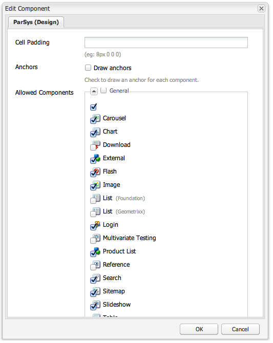

# Componenten configureren in ontwerpmodus{#configuring-components-in-design-mode}

Wanneer AEM instantie buiten de doos wordt geïnstalleerd, is een selectie van componenten onmiddellijk beschikbaar in sidekick.

Daarnaast zijn er verschillende andere componenten beschikbaar. U kunt de ontwerpmodus gebruiken om [Dergelijke componenten in-/uitschakelen](#enabledisablecomponentsusingdesignmode). Als deze optie is ingeschakeld en zich op de pagina bevindt, kunt u de ontwerpmodus gebruiken om [aspecten van het componentontwerp configureren](#configuringcomponentsusingdesignmode) door de kenmerkparameters te bewerken.

>[!NOTE]
>
>Bij het bewerken van deze componenten moet de nodige voorzichtigheid worden betracht. De ontwerpinstellingen vormen vaak een integraal onderdeel van het ontwerp van de gehele website en moeten daarom alleen worden gewijzigd door iemand met de juiste bevoegdheden (en ervaring), vaak een beheerder of ontwikkelaar. Zie [Componenten ontwikkelen](/help/sites-developing/components.md) voor meer informatie .

Hierbij worden in feite de onderdelen toegevoegd of verwijderd die in het alineasysteem voor de pagina zijn toegestaan. Het alineasysteem ( `parsys`) is een samengestelde component die alle andere alineacomponenten bevat. Met het alineasysteem kunnen auteurs componenten van verschillende typen aan een pagina toevoegen omdat deze alle andere alineacomponenten bevat. Elk alineatype wordt vertegenwoordigd als een component.

De inhoud van een productpagina kan bijvoorbeeld een alineasysteem bevatten dat het volgende bevat:

* Een afbeelding van het product (in de vorm van een afbeeldings- of textielafbeeldingsalinea)
* De productomschrijving (als tekstalinea)
* Een tabel met technische gegevens (als tabelalinea)
* Een formulier dat gebruikers invullen (als een formulier begint, formulierelement en alinea die eindigt met een formulier)

>[!NOTE]
>
>Zie [Componenten ontwikkelen](/help/sites-developing/components.md#paragraphsystem) en [Richtlijnen voor het gebruik van sjablonen en componenten](/help/sites-developing/dev-guidelines-bestpractices.md#guidelines-for-using-templates-and-components) voor meer informatie over `parsys`.

## Componenten in-/uitschakelen {#enable-disable-components}

In de ontwerpmodus wordt het hulpprogramma geminimaliseerd en kunt u de componenten configureren die toegankelijk zijn voor ontwerpen:

1. Als u de ontwerpmodus wilt activeren, opent u een pagina die u wilt bewerken en gebruikt u het pictogram Sidekick:

   

1. Klikken **Bewerken** over het alineasysteem (**Ontwerp van onderdeel**).

   

1. Er wordt een dialoogvenster geopend met een lijst van de componentgroepen die in de Sidekick worden weergegeven, samen met de afzonderlijke componenten die ze bevatten.

   Selecteer de gewenste onderdelen om de componenten toe te voegen of te verwijderen die beschikbaar moeten zijn in het zijpaneel.

   

1. De Sidekick minimaliseert in de ontwerpmodus. Klik op de pijl om de Sidekick te maximaliseren en terug te keren naar de bewerkingsmodus:

   

## Het ontwerp van een component configureren {#configuring-the-design-of-a-component}

In de ontwerpmodus kunt u ook kenmerken configureren voor de afzonderlijke componenten. Elke component heeft zijn eigen parameters, toont het volgende voorbeeld **Afbeelding** component:

1. Als u de ontwerpmodus wilt activeren, opent u een pagina die u wilt bewerken en gebruikt u het pictogram Sidekick:

   

1. U kunt het ontwerp van componenten configureren.

   Als u bijvoorbeeld op **Bewerken** op de component Image (**Ontwerp van de afbeelding**) kunt u de componentspecifieke parameters configureren:

   

1. Klikken **OK** om uw wijzigingen op te slaan.

1. De Sidekick minimaliseert in de ontwerpmodus. Klik op de pijl om de Sidekick te maximaliseren en terug te keren naar de bewerkingsmodus:

   
