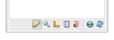

# Paginacontent bewerken{#editing-page-content}

Nadat u de pagina hebt gemaakt (nieuw of als onderdeel van een opstart of live kopie), kunt u de inhoud bewerken en de gewenste updates uitvoeren.

Inhoud wordt toegevoegd met [componenten](/help/sites-classic-ui-authoring/classic-page-author-default-components.md) (die geschikt zijn voor het inhoudstype) die naar de pagina kunnen worden gesleept. Deze kunnen vervolgens worden bewerkt, verplaatst of verwijderd.

>[!NOTE]
>
>Uw account heeft de [juiste toegangsrechten](/help/sites-administering/security.md) en [machtigingen](/help/sites-administering/security.md#permissions) nodig om pagina&#39;s te kunnen bewerken. bijvoorbeeld het toevoegen, bewerken of verwijderen van componenten, het annoteren en ontgrendelen.
>
>Als u om het even welke problemen ontmoet wij adviseren u uw systeembeheerder contacteert.

## Sidetrap {#sidekick}

De assistent is een belangrijk hulpmiddel bij het ontwerpen van pagina&#39;s. Het zweeft wanneer het ontwerpen van een pagina, zodat is het altijd zichtbaar.

Er zijn verschillende tabbladen en pictogrammen beschikbaar, waaronder:

* Onderdelen
* Pagina
* Informatie
* Versioning
* Workflow
* Modi
* Basisstructuur
* Clientcontext
* Websites

Deze bieden toegang tot een brede selectie van functies; met inbegrip van:

* [selecteren, componenten](/help/sites-classic-ui-authoring/classic-page-author-env-tools.md#sidekick)
* [verwijzingen tonen](/help/sites-classic-ui-authoring/classic-page-author-env-tools.md#showing-references)
* [toegang tot het auditlogboek](/help/sites-classic-ui-authoring/classic-page-author-env-tools.md#audit-log)
* [schakelmodi](/help/sites-classic-ui-authoring/classic-page-author-env-tools.md#page-modes)
* [maken](/help/sites-classic-ui-authoring/classic-page-author-work-with-versions.md#creating-a-new-version), [herstellen](/help/sites-classic-ui-authoring/classic-page-author-work-with-versions.md#restoring-a-page-version-from-sidekick) en [vergelijken](/help/sites-classic-ui-authoring/classic-page-author-work-with-versions.md#comparing-with-a-previous-version) versies

* [publiceren](/help/sites-classic-ui-authoring/classic-page-author-publish-pages.md#publishing-a-page), [publiceren](/help/sites-classic-ui-authoring/classic-page-author-publish-pages.md#unpublishing-a-page) van pagina&#39;s ongedaan maken

* [bewerken, pagina-eigenschappen](/help/sites-classic-ui-authoring/classic-page-author-edit-page-properties.md)

* [steigers](/help/sites-authoring/scaffolding.md)

* [clientcontext](/help/sites-administering/client-context.md)

## Een component invoegen {#inserting-a-component}

### Een component invoegen {#inserting-a-component-1}

Nadat u de pagina hebt geopend, kunt u beginnen met het toevoegen van inhoud. U doet dit door componenten (ook wel alinea&#39;s genoemd) toe te voegen.

Een nieuwe component invoegen:

1. Er zijn verschillende methoden om het type alinea te selecteren dat u wilt invoegen:

   * **Dubbelklik hier op het gebied met het label Componenten of elementen** slepen... - De werkbalk Nieuwe component **** invoegen wordt geopend. Selecteer een component en klik op **OK**.

   * Sleep een component van de zwevende werkbalk (sidekick genoemd) om een nieuwe alinea in te voegen.
   * **Klik met de rechtermuisknop op een bestaande alinea en selecteer** Nieuw... - De werkbalk Nieuwe component invoegen wordt geopend. Selecteer een component en klik op **OK**.
   

1. Op zowel de werkbalk **Nieuwe component** invoegen ziet u een lijst met de beschikbare componenten (alineatypen). Deze secties kunnen worden opgesplitst in verschillende secties (bijvoorbeeld Algemeen, Kolommen, enz.) die naar behoefte kunnen worden uitgebreid.

   Afhankelijk van uw productieomgeving kunnen deze opties afwijken. Zie [Standaardcomponenten](/help/sites-classic-ui-authoring/classic-page-author-default-components.md)voor meer informatie over componenten.

1. Voeg de gewenste component op de pagina in. Dubbelklik vervolgens op de alinea en er wordt een venster geopend waarin u de alinea kunt configureren en inhoud kunt toevoegen.

### Een component invoegen met de Inhoudszoeker {#inserting-a-component-using-the-content-finder}

U kunt ook een nieuwe component aan de pagina toevoegen door een element te slepen vanuit de [Inhoudszoeker](/help/sites-classic-ui-authoring/classic-page-author-env-tools.md#the-content-finder). Hiermee wordt automatisch een nieuwe component van het juiste type gemaakt die het element bevat.

Dit is geldig voor de volgende elementtypen (sommige zijn afhankelijk van het pagina-/alineasysteem):

| Elementtype | Resulterend componenttype |
|---|---|
| Afbeelding | Afbeelding |
| Document | Downloaden |
| Product | Product |
| Video | Flash |

>[!NOTE]
>
>Dit gedrag kan voor uw installatie worden gevormd. Zie Een alineasysteem [configureren, zodat door het slepen van een element een componentinstantie](/help/sites-developing/developing-components.md#configuring-a-paragraph-system-so-that-dragging-an-asset-creates-a-component-instance) wordt gemaakt voor meer informatie.

Een component maken door een van de bovenstaande elementtypen te slepen:

1. Zorg ervoor dat de pagina in de modus [**Bewerken **staat](/help/sites-classic-ui-authoring/classic-page-author-env-tools.md#page-modes).
1. Open de [Inhoudszoeker](/help/sites-classic-ui-authoring/classic-page-author-env-tools.md#the-content-finder).
1. Sleep het vereiste element naar de gewenste positie. De [plaatsaanduiding](#componentplaceholder) van de component geeft aan waar de component wordt geplaatst.

   Een component die geschikt is voor het type element, wordt op de vereiste locatie gemaakt. De component bevat het geselecteerde element.

1. [Bewerk](#editmovecopypastedelete) indien nodig de component.

## Een component bewerken (inhoud en eigenschappen) {#editing-a-component-content-and-properties}

Voer een van de volgende handelingen uit om een bestaande alinea te bewerken:

* **Dubbelklik** op de alinea om deze te openen. U ziet hetzelfde venster als wanneer u de alinea met de bestaande inhoud hebt gemaakt. Make your changes and click **OK**.

* **Klik met de rechtermuisknop** op de alinea en klik op **Bewerken**.

* **Klik** tweemaal op de paragraaf (langzaam tweemaal klikken) om op zijn plaats het uitgeven wijze in te gaan. U kunt de tekst op de pagina rechtstreeks bewerken in plaats van in een dialoogvenster. In deze modus krijgt u een werkbalk boven aan de pagina. Breng gewoon uw wijzigingen aan en deze worden automatisch opgeslagen.

## Een component verplaatsen {#moving-a-component}

Een alinea verplaatsen:

>[!NOTE]
>
>U kunt een component ook verplaatsen met [Knippen en Plakken](#cut-copy-paste-a-component) .

1. Selecteer de alinea die u wilt verplaatsen:

   

1. Sleep de alinea naar de nieuwe locatie - AEM geeft aan waar de alinea naar kan worden verplaatst met een groen vinkje. Zet het neer op de gewenste plaats.
1. Uw alinea wordt verplaatst:

   

## Een component verwijderen {#deleting-a-component}

Een alinea verwijderen:

1. Selecteer de alinea en **klik** met de rechtermuisknop:

   

1. Selecteer **Verwijderen** in het menu. AEM WCM vraagt om bevestiging dat u de paragraaf wilt schrappen aangezien deze actie niet ongedaan kan worden gemaakt.
1. Click **OK**.

>[!NOTE]
>
>Als u de [gebruikerseigenschappen zo hebt ingesteld dat de algemene bewerkingswerkbalk](/help/sites-classic-ui-authoring/author-env-user-props.md) wordt weergegeven, kunt u ook bepaalde handelingen op de alinea&#39;s uitvoeren met de beschikbare knoppen **Kopiëren**, **Knippen**, **Plakken** en **Verwijderen** .
>
>Er zijn ook verschillende [sneltoetsen](/help/sites-classic-ui-authoring/classic-page-author-keyboard-shortcuts.md) beschikbaar.

## Een component knippen/kopiëren/plakken {#cut-copy-paste-a-component}

Net als wanneer u een component  verwijdert, kunt u het contextmenu gebruiken om een component te kopiëren, te knippen en/of te plakken

>[!NOTE]
>
>Als u de [gebruikerseigenschappen zo hebt ingesteld dat de algemene bewerkingswerkbalk](/help/sites-classic-ui-authoring/author-env-user-props.md) wordt weergegeven, kunt u ook bepaalde handelingen op de alinea&#39;s uitvoeren met de beschikbare knoppen **Kopiëren**, **Knippen**, **Plakken** en **Verwijderen** .
>
>Er zijn ook verschillende [sneltoetsen](/help/sites-classic-ui-authoring/classic-page-author-keyboard-shortcuts.md) beschikbaar.

>[!NOTE]
>
>Inhoud knippen, kopiëren en plakken wordt alleen op dezelfde pagina ondersteund.

## Overgenomen componenten {#inherited-components}

Overerfde componenten kunnen het product van diverse scenario&#39;s zijn, die omvatten:

* [beheer](/help/sites-administering/msm.md)van meerdere locaties; ook in combinatie met [steigers](/help/sites-classic-ui-authoring/classic-feature-scaffolding.md#scaffolding-with-msm-inheritance).

* [Starten](/help/sites-classic-ui-authoring/classic-launches.md) (op basis van livecopy).
* specifieke onderdelen; bijvoorbeeld het Overgenomen alineasysteem in Geometrixx.

U kunt de overerving annuleren (en vervolgens opnieuw inschakelen). Afhankelijk van de component, kan dit beschikbaar zijn bij:

1. **Live kopie**

   Als een component deel uitmaakt van een livecopy of lancering, wordt het aangegeven met een hangslotpictogram. U kunt op de hangslot klikken om de overerving te annuleren.

   * Het hangslotpictogram wordt getoond wanneer de component wordt geselecteerd; bijvoorbeeld:
   

   * Het hangslot wordt ook weergegeven in het dialoogvenster van componenten; bijvoorbeeld:
   

1. **Een overerfd alineasysteem**

   Het configuratiedialoogvenster. Bijvoorbeeld, zoals met het Overgenomen Systeem van de Paragraaf binnen Geometrixx:

   

## Annotaties toevoegen {#adding-annotations}

[Met annotaties](/help/sites-classic-ui-authoring/classic-page-author-annotations.md) kunnen andere auteurs feedback geven over uw inhoud. Dit wordt vaak gebruikt voor evaluatie- en validatiedoeleinden.

## Pagina&#39;s voorvertonen {#previewing-pages}

Er zijn twee pictogrammen in de onderrand van het hulpstuk die belangrijk zijn voor het voorvertonen van pagina&#39;s:

* Met het potloodpictogram kunt u zien dat u in de bewerkingsmodus werkt waar u inhoud kunt toevoegen, wijzigen, verplaatsen of verwijderen.

   

* Met het vergrootglaspictogram kunt u de voorvertoningsmodus selecteren waarin de pagina wordt weergegeven zoals deze wordt weergegeven in de publicatieomgeving (pagina&#39;s moeten soms ook worden vernieuwd):

   

   In de voorvertoningsmodus wordt het hulpgereedschap kleiner, klikt u op het pijlpictogram omlaag om terug te keren naar de bewerkingsmodus:

   

## Zoeken en vervangen {#find-replace}

Voor grootschaliger bewerkingen van dezelfde zin kunt u met de menuoptie **[Zoeken en vervangen](/help/sites-classic-ui-authoring/author-env-search.md#find-and-replace)**meerdere instanties van een tekenreeks in een gedeelte van de website zoeken en vervangen.

## Een pagina vergrendelen {#locking-a-page}

Met AEM kunt u een pagina vergrendelen, zodat niemand anders de inhoud kan wijzigen. Dit is handig wanneer u veel bewerkingen uitvoert op een bepaalde pagina of wanneer u een pagina even wilt stilzetten.

>[!CAUTION]
>
>Het vergrendelen van een pagina moet voorzichtig worden toegepast, aangezien de enige persoon die een pagina kan ontgrendelen de persoon is die deze heeft vergrendeld (of een account met beheerdersrechten).

Een pagina vergrendelen:

1. Selecteer op het tabblad **Websites** de pagina die u wilt vergrendelen.
1. Dubbelklik op de pagina om deze te openen voor bewerking.
1. Selecteer Pagina **** vergrendelen op het tabblad **Pagina** van sidekick:

   

   Een bericht geeft aan dat de pagina is vergrendeld voor andere gebruikers. Bovendien wordt in het rechterdeelvenster van de **websiteconsole** door AEM WCM de pagina als vergrendeld weergegeven en wordt aangegeven welke gebruiker de pagina heeft vergrendeld.

   

## Een pagina ontgrendelen {#unlocking-a-page}

Een pagina ontgrendelen:

1. Selecteer op het tabblad **Websites** de pagina die u wilt ontgrendelen.
1. Dubbelklik op de pagina om deze te openen.
1. Selecteer op het tabblad **Pagina** van Help de optie **Pagina** ontgrendelen.

## Paginabewerkingen ongedaan maken en opnieuw uitvoeren {#undoing-and-redoing-page-edits}

Gebruik de volgende sneltoetsen terwijl het inhoudsframe van de pagina de focus heeft:

* Ongedaan maken: Ctrl+Z (Windows) of Cmd+Z (Mac)
* Opnieuw: Ctrl+Y (Windows) of Cmd+Y (Mac)

Wanneer u het verwijderen, optellen of verplaatsen van een of meer alinea&#39;s ongedaan maakt of opnieuw uitvoert, geven opvlammende (standaardgedrag) markeringen de desbetreffende alinea&#39;s aan.

>[!NOTE]
>
>Zie Paginabewerkingen [ongedaan maken en opnieuw uitvoeren - De theorie](#undoing-and-redoing-page-edits-the-theory) voor alle details van wat mogelijk is bij het ongedaan maken en opnieuw uitvoeren van paginabewerkingen.

## Paginabewerkingen ongedaan maken en opnieuw uitvoeren - De theorie {#undoing-and-redoing-page-edits-the-theory}

>[!NOTE]
>
>Uw systeembeheerder kan diverse aspecten van Ongedaan maken/opnieuw eigenschappen [volgens de vereisten voor uw instantie](/help/sites-administering/config-undo.md) vormen.

AEM slaat een geschiedenis van acties op die u uitvoert en de opeenvolging waarin u hen uitvoerde. U maakt dus verschillende handelingen ongedaan in de volgorde waarin u deze hebt uitgevoerd. Vervolgens kunt u de opdracht Opnieuw uitvoeren gebruiken om een of meer handelingen opnieuw toe te passen.

Als een element op de inhoudspagina wordt geselecteerd, is het ongedaan maken en opnieuw doen bevel op het geselecteerde punt, zoals een tekstcomponent van toepassing.

Het gedrag van de opdrachten Ongedaan maken en Opnieuw is vergelijkbaar met dat van andere softwareprogramma&#39;s. Gebruik de opdrachten om de recente status van uw webpagina te herstellen terwijl u beslissingen neemt over de inhoud. Als u bijvoorbeeld een tekstalinea naar een andere locatie op de pagina verplaatst, kunt u de opdracht Ongedaan maken gebruiken om de alinea terug te verplaatsen. Als u vervolgens nogmaals besluit de alinea te verplaatsen, gebruikt u de opdracht Opnieuw uitvoeren.

>[!NOTE]
>
>U kunt:
>
>* Voer handelingen opnieuw uit zolang u geen paginabewerking hebt uitgevoerd nadat u de bewerking ongedaan hebt gemaakt.
>* U kunt maximaal 20 bewerkhandelingen ongedaan maken (standaardinstelling).
>* Gebruik ook [sneltoetsen](/help/sites-classic-ui-authoring/classic-page-author-keyboard-shortcuts.md) voor ongedaan maken en opnieuw uitvoeren.
>

U kunt de volgende typen paginawijzigingen ongedaan maken en opnieuw uitvoeren:

* Alinea&#39;s toevoegen, bewerken, verwijderen en verplaatsen
* Lokaal bewerken van alinea-inhoud
* Items op een pagina kopiëren, knippen en plakken
* Items op pagina&#39;s kopiëren, knippen en plakken
* Bestanden en afbeeldingen toevoegen, verwijderen en wijzigen
* Annotaties en schetsen toevoegen, verwijderen en wijzigen
* Wijzigingen in Vet
* Referenties toevoegen en verwijderen
* Eigenschapswaarden wijzigen in dialoogvensters van componenten.

Formuliervelden die door formuliercomponenten worden gerenderd, mogen geen waarden hebben die zijn opgegeven tijdens het ontwerpen van pagina&#39;s. De opdrachten Ongedaan maken en Opnieuw hebben daarom geen invloed op wijzigingen die u aanbrengt in de waarden van die typen componenten. U kunt bijvoorbeeld het selecteren van een waarde in een vervolgkeuzelijst niet ongedaan maken.

>[!NOTE]
>
>Er zijn speciale machtigingen vereist voor het ongedaan maken en opnieuw uitvoeren van wijzigingen in bestanden en afbeeldingen. De historie voor het ongedaan maken van wijzigingen in bestanden en afbeeldingen duurt bovendien minimaal uren. Na deze tijd is het ongedaan maken van de wijzigingen echter niet gegarandeerd. Uw beheerder kan toestemmingen verstrekken en de standaardtijd van tien uren veranderen.
