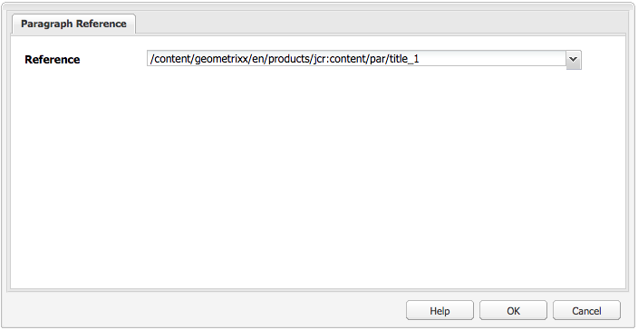
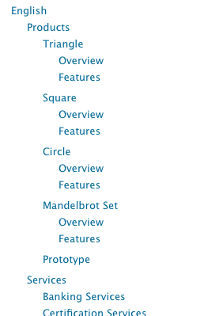
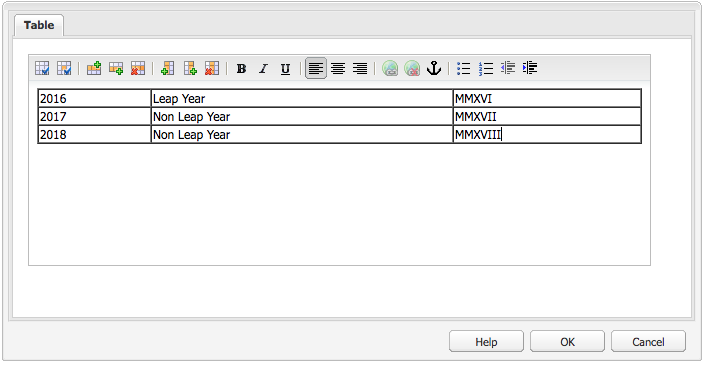

# Componenten voor paginaontwerp{#components-for-page-authoring}

De volgende componenten zijn bedoeld voor gebruik bij het ontwerpen van inhoud voor een standaardwebpagina. De componenten vormen een subset van de componenten die buiten de box voor een standaardinstallatie van AEM beschikbaar zijn.

Sommige zijn onmiddellijk beschikbaar door sidekick, diverse anderen zijn ook beschikbaar door [ wijze van het Ontwerp ](/help/sites-classic-ui-authoring/classic-page-author-design-mode.md) te gebruiken om hen toe te laten/onbruikbaar te maken.

>[!CAUTION]
>
>Deze sectie bespreekt slechts componenten die uit-van-de-doos in een standaard AEM installatie beschikbaar zijn.
>
>Afhankelijk van uw instantie, kunt u aangepaste componenten hebben die uitdrukkelijk voor uw vereisten worden ontwikkeld. Deze douanecomponenten kunnen zelfs de zelfde naam hebben zoals sommige hier besproken componenten.

De componenten zijn beschikbaar wanneer [ het uitgeven van een pagina ](/help/sites-classic-ui-authoring/classic-page-author-edit-content.md) van het **3} lusje van Componenten {van sidekick en** Nieuwe Component van het Tussenvoegsel **selecteur (wanneer u in het** de componenten of activa van de Belemmering hier **gebied tweemaal klikt).**

U kunt een component selecteren en het slepen aan de vereiste plaats op uw pagina en dan [ geeft Inhoud en Eigenschappen ](/help/sites-classic-ui-authoring/classic-page-author-edit-content.md#editing-a-component-content-and-properties) uit.

Componenten worden gesorteerd op basis van verschillende categorieën (componentgroepen), waaronder (voor het ontwerpen van pagina&#39;s):

* [ Algemeen ](#general): Omvat basiscomponenten, met inbegrip van tekst, beelden, lijsten, grafieken, etc.
* [ Kolommen ](#columns): Omvat componenten noodzakelijk voor het organiseren van de lay-out van de inhoud.
* [ Vorm ](#formgroup): Omvat alle componenten noodzakelijk om een vorm tot stand te brengen.

## Algemeen {#general}

De algemene componenten zijn de basiscomponenten die u gebruikt om inhoud te maken.

### Account-item {#account-item}

U kunt een koppeling definiëren met een titel en beschrijving.


### Aangepaste afbeelding {#adaptive-image}

De stichtingscomponent Adaptive Image genereert afbeeldingen die zo zijn geschaald dat ze passen in het venster waarin de webpagina wordt geopend. Om de component te gebruiken, verstrekt u een beeldmiddel of van het dossiersysteem of DAM. Wanneer de webpagina wordt geopend, downloadt de webbrowser een kopie van de afbeelding waarvan het formaat is gewijzigd, zodat deze geschikt is voor het huidige venster.

De volgende kenmerken kunnen de grootte van het venster bepalen:

* Apparaatscherm: mobiele apparaten geven meestal webpagina&#39;s weer, zodat deze zich over het hele scherm uitstrekken.
* Venstergrootte van de webbrowser: gebruikers van laptop- en desktopcomputers kunnen het formaat van vensters van webbrowsers wijzigen.

De component genereert bijvoorbeeld een kleine afbeelding wanneer de webpagina op een mobiele telefoon wordt geopend en een afbeelding van middelgrote grootte wanneer deze op een tablet wordt geopend. Op een laptop maakt en levert de component een grote afbeelding wanneer de pagina wordt geopend in een gemaximaliseerde webbrowser. Wanneer de grootte van de webbrowser wordt aangepast aan een gedeelte van het scherm, past de component zich aan door een kleinere afbeelding te leveren en wordt de weergave vernieuwd.

#### Ondersteunde afbeeldingsindelingen {#supported-image-formats}

U kunt afbeeldingsbestanden met de volgende bestandsnaamextensies gebruiken met de component Adaptive Image:

* .jpg
* .jpeg
* .png
* .gif &#42;&#42;

>[!CAUTION]
>
>&#42;&#42; Geanimeerde .gif-bestanden worden niet ondersteund in AEM voor adaptieve uitvoeringen.

#### Afbeeldingsgrootten en -kwaliteit {#images-sizes-and-quality}

In de volgende tabel wordt de breedte weergegeven van de afbeelding die wordt gegenereerd voor de opgegeven breedte van de viewport. De hoogte van de gegenereerde afbeelding wordt berekend om een constante hoogte-breedteverhouding te behouden en er wordt geen witruimte weergegeven binnen de afbeeldingsrand. Uitsnijden kan worden gebruikt om witruimte te voorkomen.

Wanneer de afbeelding een JPEG-afbeelding is, kan de grootte van de viewport ook van invloed zijn op de kwaliteit van de JPEG. De volgende JPEG-eigenschappen zijn mogelijk:

* Laag (0,42)
* Medium (0,82)
* Hoog (1,00)

| Breedtebereik van viewport (pixels) | Breedte afbeelding (pixels) | JPEG-kwaliteit | Type doelapparaat |
|---|---|---|---|
| width &lt;= 319 | 320 | laag |  |
| width = 320 | 320 | medium | Mobiele telefoon (staand) |
| 320 &lt; breedte &lt; 481 | 480 | medium | Mobiele telefoon (liggend) |
| 480 &lt; breedte &lt; 769 | 476 | hoog | Tablet (staand) |
| 768 &lt; breedte &lt; 1025 | 620 | hoog | Tablet (liggend) |
| breedte &lt;= 1025 | full (oorspronkelijke grootte) | hoog | Desktop |

#### Eigenschappen {#properties}

In het dialoogvenster kunt u eigenschappen bewerken voor uw instantie van de component Adaptieve afbeelding, die vaak worden gebruikt voor de component Image waarop deze is gebaseerd. De eigenschappen zijn beschikbaar op twee tabbladen:

* **Beeld**

   * **Beeld**
Sleep een afbeelding vanuit de zoekfunctie voor inhoud of klik om een bladervenster te openen waarin u een afbeelding kunt laden. Nadat de afbeelding is geladen, kunt u de afbeelding uitsnijden, roteren of verwijderen. Als u wilt in- of uitzoomen op de afbeelding, gebruikt u de schuifbalk onder de afbeelding (boven de knoppen OK en Annuleren)

   * **Uitsnijden**
Hiermee kunt u gedeelten van een afbeelding uitknippen. Sleep de rand om de afbeelding uit te snijden.

   * **roteren**
Klik herhaaldelijk op Roteren totdat de afbeelding naar wens is geroteerd.

   * **Duidelijk**
Verwijder de huidige afbeelding.

* **Geavanceerd**

   * **Titel**
De component Adaptive Image gebruikt deze eigenschap niet.

   * **de Tekst van Alt**
De alternatieve tekst die voor de afbeelding moet worden gebruikt.

   * **Verbinding aan**
De component Adaptive Image gebruikt deze eigenschap niet.

   * **Beschrijving**
De component Adaptive Image gebruikt deze eigenschap niet.

#### De component Adaptieve afbeelding uitbreiden {#extending-the-adaptive-image-component}

Voor informatie over het aanpassen van de Adaptieve component van het Beeld, zie [ Begrijpend de Aanpassende Component van het Beeld ](/help/sites-developing/responsive.md#using-adaptive-images).

### Carousel {#carousel}

Met de Carousel-component kunt u afbeeldingen weergeven die aan afzonderlijke pagina&#39;s zijn gekoppeld:

* één voor één
* voor een korte tijd
* in een volgorde die u opgeeft
* met een door u opgegeven tijdvertraging

Met de besturingselementen waarop u kunt klikken, kan de gebruiker de weergegeven pagina&#39;s ook in real-time doorlopen, op aanvraag. Als u de pagina selecteert die momenteel zichtbaar is, gaat u naar die pagina. Met andere woorden, de Carousel fungeert als navigatiecontrole.

#### Eigenschappen {#properties-1}

Eigenschappen zijn beschikbaar op twee tabbladen:

* **Carousel**
Hier geeft u op hoe de carrousel werkt:

   * Afspeelsnelheid
De tijd in milliseconden voordat de volgende dia wordt getoond.
   * Overgangstijd
De tijd in milliseconden voor de overgang tussen twee dia&#39;s.
   * Besturingselementstijl
Verschillende opties zijn beschikbaar in een keuzemenu, bijvoorbeeld Vorige/Volgende knoppen, Linksboven geschakeld.

* **Lijst**
Hier geeft u op hoe pagina&#39;s in uw carrousel moeten worden opgenomen:

   * **bouwt lijst gebruikend**
Er zijn verschillende manieren om een paginalijst samen te stellen: Onderliggende pagina&#39;s, Vaste lijst, Zoeken of Geavanceerd zoeken (allemaal hieronder beschreven).
Welke methode u ook kiest, aan de pagina&#39;s die u in de lijst opneemt, moet al een afbeelding zijn gekoppeld. Deze afbeelding wordt weergegeven in de carrousel. Als er geen afbeelding is voor een pagina onder de Pagina-eigenschappen van die pagina, moet u een afbeelding aan de pagina koppelen voordat u begint. Anders wordt er een lege pagina weergegeven. Zie [ het Uitgeven Eigenschappen van de Pagina ](/help/sites-classic-ui-authoring/classic-page-author-edit-page-properties.md).
Afhankelijk van het item dat u kiest, wordt een nieuw deelvenster weergegeven:

      * **Opties voor de Pagina&#39;s van het Kind**

         * **Ouderlijke Pagina**
Geef een pad handmatig of met de kiezer op. Laat leeg als u de huidige pagina als bovenliggend item wilt gebruiken.

      * **Opties voor Vaste Lijst**

         * **Pagina&#39;s**
Selecteer een lijst met pagina&#39;s. Gebruik `+` om meer items toe te voegen en de knoppen Omhoog en Omlaag om de volgorde aan te passen.

      * **Opties voor Onderzoek**

         * **Begin in**
Voer handmatig of met de kiezer een beginpad in.

         * **vraag van het Onderzoek**
U kunt een zoekquery voor onbewerkte tekst invoeren.

      * **Opties voor Geavanceerd Onderzoek**

         * **Querybuilder voorspelt aantekening**
U kunt een onderzoeksvraag ingaan gebruikend Querybuilder prediknotatie. U kunt bijvoorbeeld &quot;fulltext=Marketing&quot; invoeren om alle pagina&#39;s met &quot;Marketing&quot; in de inhoud weer te geven in de carrousel.
Zie [ QueryBuilder API ](/help/sites-developing/querybuilder-api.md) voor volledige bespreking van vraaguitdrukkingen en verdere voorbeelden.

   * **Orde door**
Selecteer `jcr:title` , `jcr:created` , `cq:lastModified` of `cq:template` in het vervolgkeuzemenu.

   * **Grens**
Optioneel. Het maximumaantal items dat u in de carrousel wilt gebruiken.

>[!NOTE]
>
U kunt een aangepaste carrouselcomponent voor Adobe Experience Manager maken die digitale elementen weergeeft in de AEM DAM.

### Diagram {#chart}

Met de component Diagram kunt u een balk, lijn of cirkeldiagram toevoegen. AEM maakt een grafiek op basis van de gegevens die u opgeeft. U verstrekt gegevens door direct in het lusje van Gegevens te typen of door een spreadsheet te kopiëren en te kleven.

* **Gegevens**

   * **Gegevens van de Grafiek**
Voer uw grafiekgegevens in met de CSV-indeling; in de indeling Door komma&#39;s gescheiden waarden worden komma&#39;s (&quot;,&quot;) gebruikt als veldscheidingsteken.

* **Geavanceerd**

   * **Type van Grafiek**
Selecteer Schijfdiagram, Lijngrafiek en Staafdiagram.

   * **Alternatieve tekst**
Tekst die wordt weergegeven in plaats van het diagram.

   * **Breedte**
De breedte van het diagram in pixels.

   * **Hoogte**
De hoogte van het diagram in pixels.

In het volgende voorbeeld ziet u een voorbeeld van diagramgegevens, gevolgd door het resulterende staafdiagram:

 


### Inhoudsfragment {#content-fragment}

>[!CAUTION]
>
De volledige functionaliteit van Content Fragment Management is alleen beschikbaar met de geoptimaliseerde interface voor aanraken.
>
De component van het Fragment van de Inhoud kan in het klassieke hulpje UI worden gezien, maar de verdere functies zijn niet beschikbaar.

{de fragmenten van 0} Inhoud ](/help/sites-classic-ui-authoring/classic-page-author-content-fragments.md) worden gecreeerd en als pagina-onafhankelijke activa beheerd. [ Vervolgens kunt u deze fragmenten en de variaties ervan gebruiken bij het ontwerpen van de inhoudspagina&#39;s.

### Design Importer {#design-importer}

Hiermee kunt u een ZIP-bestand uploaden dat een ontwerppakket bevat.

### Downloaden {#download}

De component Download maakt een koppeling op de geselecteerde webpagina om een specifiek bestand te downloaden. U kunt middelen van de Vinder van de Inhoud slepen of een dossier uploaden.

* **Download**

   * **Beschrijving**
Een korte beschrijving die wordt weergegeven met de downloadkoppeling.

   * **Dossier**
Het bestand dat kan worden gedownload op de resulterende webpagina. Sleep een element van de inhoudzoeker, of selecteer het gebied zodat kunt u het dossier uploaden dat u voor download beschikbaar wilt maken.

In het volgende voorbeeld wordt de component Download getoond in Geometrixx:


### Extern {#external}

De externe component van de toepassingsintegratie (**Extern**) laat u toe om externe toepassingen in uw AEM pagina in te bedden gebruikend een iframe.

* **Extern**

   * **toepassing van het Doel**

     Geef de URL op van de webtoepassing die moet worden geïntegreerd, bijvoorbeeld:

     ```
     https://en.wikipedia.org/wiki/Main_Page
     ```

   * **parameters van de Pas**

     Schakel het selectievakje in als de parameters naar de toepassing moeten worden doorgegeven.

   * **Breedte en Hoogte**

     De grootte van het iframe definiëren

De externe toepassing is geïntegreerd in het alineasysteem van de AEM pagina, bijvoorbeeld wanneer u een doeltoepassing van `https://en.wikipedia.org/wiki/Main_Page` gebruikt:


>[!NOTE]
>
Afhankelijk van uw gebruiksgeval, zijn andere opties beschikbaar voor integratie van externe toepassingen, bijvoorbeeld, de [ Integratie van Portlets ](/help/sites-administering/aem-as-portal.md).

### Flash {#flash}

Met de component Flash kunt u een Flash film laden. U kunt een Flash-element van de zoeker naar de component slepen of u kunt het dialoogvenster gebruiken:

* **Flash**

   * {de film van 0} Flash ****

     Het Flash-filmbestand. Sleep een element van de zoeker naar de inhoud of klik om een bladervenster te openen.

   * **Grootte**

     Dimensionen in pixels van het weergavegebied dat de film bevat.

* **Alternatief Beeld**

  Een alternatieve afbeelding die moet worden weergegeven

* **Geavanceerd**

   * **Contextmenu**

     Geeft aan of het contextmenu moet worden weergegeven of verborgen.

   * **Wijze van het Venster**

     Hoe het venster er uitziet, bijvoorbeeld dekkend, transparant of als een duidelijk (effen) venster.

   * **Achtergrondkleur**

     Een achtergrondkleur die is geselecteerd in het kleurendiagram dat wordt weergegeven.

   * **Minimale versie**

     De minimale versie van Adobe Flash Player die is vereist om de film uit te voeren. De standaardwaarde is 9.0.0.

   * **Attributen**

     Eventuele andere vereiste kenmerken.

### Afbeelding {#image}

In de afbeeldingscomponent wordt een afbeelding en de bijbehorende tekst weergegeven volgens de opgegeven parameters.

U kunt een afbeelding uploaden, deze vervolgens bewerken en bewerken (bijvoorbeeld uitsnijden, roteren, koppeling/titel/tekst toevoegen).

U kunt of een beeld van de [ Vinder van de Inhoud ](/help/sites-classic-ui-authoring/classic-page-author-env-tools.md#the-content-finder) direct slepen en laten vallen op de component of zijn Edit dialoog. U kunt ook dubbelklikken in het centrale gedeelte van het dialoogvenster Bewerken om door uw lokale bestandssysteem te bladeren en een afbeelding te uploaden. Op de twee tabbladen van het dialoogvenster Bewerken staan ook alle definities en bewerkingen van de afbeelding:


>[!NOTE]
>
De voortgang van het uploaden kan niet worden gecontroleerd met Internet Explorer.
>
De gebruikers van Internet Explorer moeten het beeld uploaden en **O.K.** klikken, dan het beeld opnieuw openen om het geuploade dossier in de voorproef te zien en wijzigingen (namelijk gewas) kunnen uitvoeren.
>
Zie de [ Verklaarde sectie van Platforms ](/help/release-notes/release-notes.md#certifiedplatforms) voor meer informatie over HTML5 eigenschappen die door AEM worden gebruikt.

Wanneer een beeld wordt geladen, kunt u het volgende vormen:

* **Kaart**

  Als u een afbeelding wilt toewijzen, selecteert u Kaart. U kunt opgeven hoe u de afbeelding met hyperlinks wilt maken (rechthoek, veelhoek enzovoort) en waar het gebied naartoe moet wijzen.

* **Uitsnijden**

  Selecteer Uitsnijden zodat u een gedeelte van een afbeelding kunt uitknippen. Gebruik de muis om de afbeelding uit te snijden.

* **roteren**

  Selecteer Roteren als u een afbeelding wilt roteren. Herhaal deze bewerking totdat de afbeelding op de gewenste manier is geroteerd.

* **Duidelijk**

  Verwijder de huidige afbeelding.

* **bar van het Gezoem**

  Als u wilt in- of uitzoomen op de afbeelding, gebruikt u de schuifbalk onder de afbeelding (boven de knoppen OK en Annuleren)

* **Titel**

  De titel van de afbeelding.

* **de Tekst van Alt**

  Een alternatieve tekst die kan worden gebruikt bij het maken van toegankelijke inhoud.

* **Verbinding aan**

  Maak een koppeling naar elementen of andere pagina&#39;s binnen uw website.

* **Beschrijving**

  Een beschrijving van de afbeelding.

* **Grootte**

  Hiermee stelt u de hoogte en de breedte van de afbeelding in.

Het definitieve beeld (met **Titel** en **Beschrijving**) kan als worden getoond:


### Layout Container {#layout-container}

>[!CAUTION]
>
Hoewel de component Layout Container beschikbaar is in de klassieke gebruikersinterface, is de volledige functionaliteit alleen beschikbaar in de interface met aanraakbediening. Voor details zie [ Responsieve Lay-out ](/help/sites-classic-ui-authoring/classic-page-author-responsive-layout.md).

### Lijst {#list}

Met de component List kunt u zoekcriteria configureren voor het weergeven van een lijst:

* **Lijst**

   * **bouwt lijst gebruikend**

     Hier geeft u op waar de lijst de inhoud ophaalt. Er zijn verschillende methoden:

   * Afhankelijk van het item dat u kiest, wordt een nieuw deelvenster weergegeven:

      * **Opties voor de Pagina&#39;s van het Kind**

         * **Kinderen van** (Ouderlijke Pagina)
Geef een pad handmatig of met de kiezer op. Laat leeg als u de huidige pagina als bovenliggend item wilt gebruiken.

      * **Opties voor Vaste Lijst**

         * **Pagina&#39;s**

           Selecteer een lijst met pagina&#39;s. Gebruik + om meer items toe te voegen en klik op de knop Omhoog/Omlaag om de volgorde aan te passen.

      * **Opties voor Onderzoek**

         * **Begin in**

           Voer handmatig of met de kiezer een beginpad in.

         * **vraag van het Onderzoek**

           U kunt een zoekquery voor onbewerkte tekst invoeren.

      * **Opties voor Geavanceerd Onderzoek**

         * **Querybuilder voorspelt aantekening**

           U kunt een onderzoeksvraag ingaan gebruikend Querybuilder prediknotatie. U kunt bijvoorbeeld &quot;fulltext=Marketing&quot; invoeren om alle pagina&#39;s met &quot;Marketing&quot; in de inhoud weer te geven in de carrousel.

           Zie [ QueryBuilder API ](/help/sites-developing/querybuilder-api.md) voor volledige bespreking van vraaguitdrukkingen en verdere voorbeelden.

      * **Markeringen**

        Specificeer de **Ouderlijke pagina**, **Markeringen/Trefwoorden**, en uw vereiste gelijkheidscriteria.

   * **Vertoning als**

     Hoe u de punten wilt worden vermeld; omvat Verbindingen, Teasers en Nieuws.

   * **Orde door**

     Of de lijst moet worden besteld en, zo ja, welke criteria moeten worden gebruikt voor sorteren. U kunt criteria invoeren of een criteria selecteren in de opgegeven vervolgkeuzelijst.

   * **Grens**

     Geef het maximumaantal items op dat u in de lijst wilt weergeven.

   * **laat Dieren** toe

     Geeft aan of een RSS-feed voor de lijst moet worden geactiveerd.

   * **pagineren na**

     Hier kunt u het aantal lijstitems opgeven dat in één keer moet worden weergegeven. Een lijst met meer items dan opgegeven gebruikt paginering om de lijst in verschillende delen weer te geven.

Het volgende voorbeeld toont de component van de Lijst van de a **** op de manier dat het een lijst van kindpagina&#39;s kan tonen (het ontwerp wordt gecontroleerd door de douaneCSS definities van een plaatsontwerp).


### Aanmelden {#login}

Hiermee worden de velden Gebruikersnaam en Wachtwoord weergegeven.


U kunt configureren:

* Aanmelden

   * Sectielabel

     Invultekst voor de invoervelden.

   * Label voor gebruikersnaam

     Tekst die een label moet geven aan het veld gebruikersnaam.

   * Wachtwoordlabel

     Tekst om het wachtwoordveld een label te geven.

   * Label van de knop Aanmelden

     Tekst voor de aanmeldknop.

   * Omleiden naar

     U kunt de pagina op uw website opgeven die moet worden geopend nadat de gebruiker zich heeft aangemeld.

* Al aangemeld

   * Doorgaan, knoplabel

     Tekst die aangeeft dat de gebruiker al is aangemeld.

### Status van bestelling {#order-status}

* **Titel**

   * **Titel**

     Geef de titeltekst op die u wilt weergeven.

   * **Verbinding**

     Geef de pagina (het product) op waarvoor de status van de bestelling moet worden weergegeven.

   * **Type/Grootte**

     Maak een keuze uit de beschikbare selectie.


### Referentie {#reference}

De **component van de Verwijzing** laat u tekst van een andere pagina van uw AEM website (binnen de huidige instantie) van verwijzingen voorzien. De inhoud van de alinea waarnaar wordt verwezen, wordt weergegeven alsof deze zich op de huidige pagina bevindt. De inhoud wordt bijgewerkt wanneer de bronalinea verandert (mogelijk moet de pagina worden vernieuwd).

* **Verwijzing van de Paragraaf**

   * **Verwijzing**

     Geef het pad op naar de pagina en alinea waarnaar u wilt verwijzen (inhoud opnemen).

Als u het pad naar een alinea wilt opgeven, moet u het pad (naar de pagina) als volgt achtervoegsel geven:

`.../jcr:content/par/<paragraph-ID>`

Bijvoorbeeld:

`/content/geometrixx-outdoors/en/equipment/biking/cajamara/jcr:content/par/similar-products`

Naast het verwijzen naar een specifieke alinea, kan het pad ook worden gewijzigd om een volledig pari-systeem te specificeren. Plaats het pad achter het volgende:

`/jcr:content/par`

Bijvoorbeeld:

`/content/geometrixx-outdoors/en/equipment/biking/cajamara/jcr:content/par`

Na de configuratie wordt de inhoud precies zo weergegeven als op de bronpagina. Het feit dat dit een verwijzing is, wordt alleen weergegeven wanneer u de component opent voor bewerking:



### Zoeken {#searching}

De component van het Onderzoek voegt onderzoeksmogelijkheden aan uw pagina toe.

U kunt configureren:

* Zoeken

   * **de Types van Knoop**

     Als de zoekopdracht moet worden beperkt tot een bepaald knooppunttype, geeft u hier een lijst van knooppunten op, bijvoorbeeld `cq:Page` .

   * **Weg aan onderzoek in**

     Geef de basispagina op van de vertakking die u wilt doorzoeken.

   * **de Tekst van de Knoop van het Onderzoek**

     De naam die wordt weergegeven op de werkelijke zoekknop.

   * **Tekst van Statistieken**

     De tekst die boven de zoekresultaten wordt weergegeven.

   * **Geen Tekst van Resultaten**

     Als er geen resultaten zijn, wordt de hier ingevoerde tekst weergegeven.

   * **Spellcheck Tekst**

     Als iemand een gelijkaardige termijn ingaat, wordt deze tekst getoond vóór de termijn.
Als u bijvoorbeeld `Geometrixxe` typt, geeft het systeem &quot;Bedoelde u? Geometrixx&quot;.

   * **Vergelijkbare Tekst van Pagina&#39;s**

     De tekst die wordt weergegeven naast een resultaat voor vergelijkbare pagina&#39;s. Klik op deze koppeling om een deel van een afbeelding uit te knippen.

   * **Verwante Tekst van Zoekopdrachten**

     De tekst die naast onderzoeken naar verwante termijnen en onderwerpen verschijnt.

   * **Tekst van de Trends van het Onderzoek van 0}**

     De titel boven de zoektermen die een gebruiker invoert.

   * **Etiket van de Pagina&#39;s van het Resultaat**

     De tekst die onder aan deze lijst wordt weergegeven met koppelingen naar andere resultatenpagina&#39;s.

   * **Vorig Etiket**

     De naam die wordt weergegeven op de koppeling naar vorige zoekpagina&#39;s.

   * **Volgende Etiket**

     De naam die wordt weergegeven op de koppeling naar volgende zoekpagina&#39;s.

In het volgende voorbeeld wordt de component Zoeken weergegeven na een zoekopdracht naar het woord *`geometrixx`* in de hoofdmap van een standaardinstallatie. Ook wordt de paginering van de resultaten geïllustreerd:


In het volgende voorbeeld wordt een zoekterm getoond die verkeerd is gespeld en niet beschikbaar is:


### Sitemap {#sitemap}

Een automatische sitemapvermelding die (met de standaardinstellingen) alle pagina&#39;s (als actieve koppelingen) op de huidige website weergeeft. Een extract toont bijvoorbeeld:



Indien nodig kunt u het volgende configureren:

* **Sitemap**

   * **Weg van de Wortel**

     Pad vanaf waar de aanbieding moet beginnen.

### Presentatie {#slideshow}

Met deze component kunt u een reeks afbeeldingen laden die als een diapresentatie op de pagina worden weergegeven. U kunt afbeeldingen toevoegen of verwijderen en elke titel toewijzen. Onder Geavanceerd kunt u ook de grootte van het weergavegebied opgeven.

U kunt configureren:

* **Dia&#39;s**

   * **Nieuwe Dia**

     U kunt een selectie van dia&#39;s specificeren gebruikend **voeg** toe (en **verwijder**) knopen.

   * **Titel**

     Geef indien nodig een titel op. Deze titel wordt over de juiste dia heen geplaatst.

* **Geavanceerd**

   * **Grootte**

     Geef de breedte en hoogte op in pixels.

In de diapresentatie-component worden vervolgens herhaaldelijk alle elementen in de juiste volgorde weergegeven, gedurende een korte tijd, voordat de volgende dia wordt afgevlakt:


### Tabel {#table}

>[!NOTE]
>
De **component van de Lijst** is gebaseerd op de [ Rich redacteur van de Tekst ](/help/sites-classic-ui-authoring/classic-page-author-rich-text-editor.md), zoals de **[](#text)** component van de Tekst is.
>
De Adobe adviseert dat u de **component van de Lijst** voor lijsten gebruikt, hoewel zij ook met de **** component van de Tekst kunnen worden geconstrueerd.

De **component van de Lijst** wordt preconfigured om u te laten, een lijst construeren vullen en formatteren. Gebruikend de dialoog, kunt u uw lijst vormen en de inhoud van kras tot stand brengen, of door een spreadsheet of een lijst van een externe redacteur, zoals Excel, OpenOffice, of Blocnote te kopiëren en te kleven.



In de volgende schermafbeelding ziet u een voorbeeld van de tabelcomponent. Het ontwerp wordt bepaald door de sitespecifieke CSS:


### Cloud labelen {#tag-cloud}

Een tagcloud geeft een grafisch weergegeven selectie van de tags die zijn toegepast op de inhoud van uw website:


Wanneer u de component Tag Cloud configureert, kunt u het volgende opgeven:

* **Markeringen aan Vertoning**
Waar de weer te geven tags worden verzameld. Selecteer op een pagina een pagina met alle onderliggende codes of alle codes.

* **Pagina**
Selecteer de pagina waarnaar moet worden verwezen.

* **Geen verbindingen op markeringen**
Of de weergegeven tags moeten fungeren als koppelingen.

Voor meer informatie over het toepassen van markeringen, bezoek [ Gebruikend Markeringen ](/help/sites-classic-ui-authoring/classic-feature-tags.md).

### Tekst {#text}

>[!NOTE]
>
De **component van de Tekst** is gebaseerd op de [ Rich redacteur van de Tekst ](/help/sites-classic-ui-authoring/classic-page-author-rich-text-editor.md), zoals de **[Lijst](#table)** component is.
>
De Adobe adviseert dat u de **component van de Lijst** voor lijsten gebruikt, hoewel zij ook met de **** component van de Tekst kunnen worden geconstrueerd.

De component van de Tekst laat u een tekstblok ingaan gebruikend een redacteur WYSIWYG, met functionaliteit die door de [ Rich redacteur van de Tekst ](/help/sites-classic-ui-authoring/classic-page-author-rich-text-editor.md) wordt verstrekt. Met een selectie pictogrammen kunt u de tekst opmaken, inclusief lettertypekenmerken, uitlijning, koppelingen, lijsten en inspringing.


Wanneer u het **lusje van Stijlen** van **opent geef** dialoog uit, kunt u het volgende ook plaatsen:

* **Spacer**
* **Stijl van de Tekst**

De opgemaakte tekst wordt vervolgens op de pagina weergegeven. Het daadwerkelijke ontwerp is afhankelijk van de site-CSS:


Voor meer gedetailleerde informatie over de component van de Tekst en de functionaliteit die door de Rich redacteur van de Tekst wordt verstrekt, zie de ](/help/sites-classic-ui-authoring/classic-page-author-rich-text-editor.md) pagina van de Redacteur van de Tekst 0} Rich.[

#### Op plaats bewerken {#inplace-editing}

Naast op dialoog-gebaseerde Rich Tekst het uitgeven wijze, verstrekt AEM ook [ het Uitgeven van de Plaats ](/help/sites-authoring/editing-content.md), die directe het uitgeven van de tekst toestaat aangezien het in de lay-out van de pagina wordt getoond.

### Tekst en afbeelding {#text-image}

De component Tekst en afbeelding voegt een tekstblok en een afbeelding toe. U kunt ook afzonderlijk tekst en afbeeldingen toevoegen en bewerken. Zie de [ Tekst ](#text) en [ 3} componenten van het Beeld {voor details.](#image)

 

U kunt configureren:

* **Stijlen van de Component** (**Stijlen**)

  Hier kunt u de afbeelding links of rechts uitlijnen. Het gebrek is **Linker** gericht, met het beeld bij de linkerzijde.

* **Eigenschappen van het Beeld** (**Geavanceerde Eigenschappen van het Beeld**)

  Hier kunt u het volgende opgeven:

   * **activa van het Beeld**

     Upload de vereiste afbeelding.

   * **Titel**

     De titel voor het blok. Het wordt getoond door mouseover.

   * **de Tekst van Alt**

     Alternatieve tekst die moet worden weergegeven als de afbeelding niet kan worden weergegeven. Als de titel leeg blijft, wordt deze gebruikt.

   * **Verbinding aan**

     Geef een doelpad op.

   * **Beschrijving**

     Een beschrijving van de afbeelding.

   * **Grootte**

     Hiermee stelt u de hoogte en breedte van de afbeelding in.

In het volgende voorbeeld ziet u een component Tekstafbeelding waarmee de afbeelding links wordt uitgelijnd:


### Titel {#title}

De component title kan:

* Geef de naam van de huidige pagina weer door het veld Titel leeg te laten.
* Geef een tekst weer die u opgeeft in het veld Titel.

U kunt het volgende configureren:

* **Titel**

  Als u een andere naam dan de paginatitel wilt gebruiken, voert u deze hier in.

* **Verbinding**

  De URI als de titel moet werken als een koppeling.

* **Type/Grootte**

  Selecteer Klein of Groot in de vervolgkeuzelijst. Klein wordt gegenereerd als een afbeelding. Groot wordt gegenereerd als tekst.

Het volgende voorbeeld toont de component van de a **Titel** die wordt getoond; het ontwerp wordt bepaald door plaats-specifieke CSS.


### Video {#video}

De **Video** component laat u een vooraf bepaald, uit-van-de-doos videoelement op een pagina plaatsen.

Zie ook [ uw Videoprofielen ](/help/sites-administering/config-video.md#configuringvideoprofiles) voor gebruik met HTML5 elementen vormen.

Nadat u een instantie van de component op de pagina hebt geplaatst, kunt u het volgende configureren:

* Video

   * **Video activa**

     Upload of zet uw video-element neer.

   * **Grootte**

     De native grootte van de video (breedte x hoogte in pixels) wordt weergegeven in de vakken naast Grootte (zie boven). Voer hier handmatig de afmetingen voor breedte en hoogte in als u de native afmetingen van de video wilt overschrijven. Het selecteren van **O.K.** verwerpt de dialoog.

>[!NOTE]
>
Ondersteunde indelingen zijn onder andere:
>
* `.mp4`
* `Ogg`
* `FLV` (video Flash)
>

## Kolommen {#columns}

Kolommen zijn een mechanisme om de lay-out van inhoud in AEM te bepalen. In een standaardinstallatie, worden de componenten voor het creëren van twee en/of drie kolommen verstrekt.

In het volgende voorbeeld worden de twee gebruikte kolommen en drie gebruikte kolomcomponenten getoond. U kunt de plaatsaanduidingen voor nieuwe componenten gebruiken:


### 2 kolommen {#columns-1}

Een component van de Controle van de Kolom die aan twee gelijke kolommen standaard.

### 3 kolommen {#columns-2}

Een component van de Controle van de Kolom die aan drie gelijke kolommen standaard.

### Kolombesturingselement {#column-control}

Met de component Kolombeheer kunnen gebruikers selecteren hoe ze de inhoud in het hoofdvenster van de webpagina in meerdere kolommen willen splitsen. Gebruikers kunnen het aantal vereiste kolommen selecteren (uit een vooraf gedefinieerde lijst) en vervolgens inhoud maken, verwijderen of verplaatsen binnen elk van de kolommen.

* **Controle van de Kolom**

   * **Lay-out van de Kolom**

     Selecteer het aantal kolommen dat u wilt renderen. Nadat elke kolom is gemaakt, bevat deze een eigen koppeling voor het slepen van componenten of elementen tijdens het toevoegen van inhoud.

## Formulier {#form}

Formuliercomponenten worden gebruikt om formulieren te maken waarmee bezoekers invoer kunnen verzenden. Forms en formuliercomponenten kunnen worden gebruikt om informatie te verzamelen, waaronder gebruikersfeedback (bijvoorbeeld een vragenlijst voor klanttevredenheid) en gebruikersgegevens (bijvoorbeeld gebruikersregistratie).

>[!NOTE]
>
Zie [ Hulp van AEM Forms ](/help/forms/using/introduction-aem-forms.md) voor informatie over AEM Forms.

Forms is opgebouwd uit verschillende onderdelen:

* **Vorm**

  De formuliercomponent definieert het begin en einde van een nieuw formulier op een pagina. Andere componenten kunnen vervolgens tussen deze elementen worden geplaatst, zoals tabellen en downloads.

* **de gebieden en de elementen van de Vorm**

  Formuliervelden en -elementen kunnen tekstvakken, keuzerondjes en afbeeldingen bevatten. De gebruiker voert vaak een handeling uit in een formulierveld, zoals het typen van tekst. Zie de afzonderlijke formulierelementen voor meer informatie.

* **Componenten van het Profiel**

  Profielcomponenten hebben betrekking op bezoekersprofielen die worden gebruikt voor sociale samenwerking en andere gebieden waar personalisatie van bezoekers vereist is.

Hieronder ziet u een voorbeeldformulier. Het is samengesteld uit de **component van de Vorm** (begin en eind), met twee **vorm** **de gebieden van de Tekst** die voor input worden gebruikt, a **Algemene** **het gebied van de Tekst** voor lood-in tekst en a **legt** knoop voor.


>[!NOTE]
>
De informatie over het ontwikkelen van en het aanpassen van uw vormen is beschikbaar op [ het Ontwikkelen van de pagina van Forms ](/help/sites-developing/developing-forms.md). Dit formulier aanpassen omvat onder andere het toevoegen van handelingen, beperkingen, het vooraf laden van velden en het gebruik van scripts om een service aan een actie aan te roepen.

### Algemene instellingen voor (veel) formuliercomponenten {#settings-common-to-many-form-components}

Hoewel elk van de formuliercomponenten een ander doel heeft, bestaan veel van deze componenten uit vergelijkbare opties en parameters.

Wanneer u een van de formuliercomponenten configureert, zijn de volgende tabbladen beschikbaar in het dialoogvenster:

* **Titel en Tekst**

  Hier moet u de basisinformatie opgeven, zoals de titel van het formulier en eventuele begeleidende tekst. U kunt zo nodig ook andere belangrijke informatie definiëren, zoals of het veld meerdere selecties kan bevatten en of items kunnen worden geselecteerd.

* **Aanvankelijke Waarden**

  Hier geeft u een standaardwaarde op.

* **Beperkingen**

  Hier kunt u opgeven of een veld verplicht is en beperkingen in dat veld plaatsen, bijvoorbeeld numeriek.

* **het Stijlen**

  Hiermee geeft u de grootte en opmaak van de velden aan.

>[!NOTE]
>
De velden die u ziet, variëren aanzienlijk, afhankelijk van de afzonderlijke component.

Deze lusjes voorzien u van de noodzakelijke parameters. De tabbladen zijn afhankelijk van het afzonderlijke componenttype, maar kunnen het volgende bevatten:

* **Titel en Tekst**

   * **Naam van het Element**

     Naam van het formulierelement. Het geeft aan waar in de gegevensopslagruimte de gegevens worden opgeslagen.
Dit veld is verplicht en mag alleen de volgende tekens bevatten:

      * alfanumerieke tekens
      * `_ . / : -`

   * **Titel**

     De titel die bij het veld wordt weergegeven. Indien leeg gelaten, wordt de standaardtitel getoond.

   * **Beschrijving**

     Hiermee kunt u, indien nodig, aanvullende informatie voor de gebruiker opgeven. In het formulier wordt deze beschrijving weergegeven onder het veld, in een kleiner lettertype dan de titel.

   * **tonen/verbergen**

     Hiermee bepaalt u wanneer het veld zichtbaar is.

* **Aanvankelijke Waarden**

   * **Standaardwaarde**

     De waarde die in het veld wordt weergegeven wanneer het formulier wordt geopend. Dat wil zeggen, voordat de gebruiker invoer heeft ingevoerd.

* **Beperkingen**

   * **Vereist**

     Deze beperking is afhankelijk van het type formuliercomponent, maar bevat een of meer klikvakken om aan te geven dat dit veld is vereist of dat bepaalde delen van dit veld zijn vereist.

   * **Vereiste Bericht**

     Een bericht om gebruikers te laten weten dat dit veld is vereist. Een vereist veld is gemarkeerd met een sterretje.

   * **Restrictie**

     Welke beperkingen beschikbaar zijn voor de selectie, is afhankelijk van het type formuliercomponent.

   * **Bericht van de Beperking**

     Een bericht om gebruikers te informeren wat wordt vereist.

* **het Stijlen**

   * **Grootte**

     In rijen en kolommen.

   * **Breedte**

     In pixels.

   * **CSS**

### Formulier (component) {#form-component}

De component van de Vorm bepaalt zowel het begin als het eind van een vorm gebruikend het **Begin van de Vorm** en **Eind van de Vorm** elementen. De begin- en eindelementen worden altijd gekoppeld om ervoor te zorgen dat het formulier correct is gedefinieerd.


Tussen het begin en het einde van een formulier kunt u formuliercomponenten toevoegen die de daadwerkelijke invoervelden voor gebruikers definiëren.

#### Begin van formulier {#start-of-form}

Met deze vereiste component wordt het begin van een nieuw formulier op een pagina gedefinieerd. U kunt het volgende configureren:

* **Vorm**

   * **Dank u Pagina**

     De pagina waarnaar wordt verwezen om bezoekers te bedanken voor hun invoer. Als het formulier leeg blijft, wordt het na verzending opnieuw weergegeven.

   * **Werkschema van het Begin**

     Hiermee bepaalt u welke workflow wordt geactiveerd wanneer een formulier wordt verzonden.

* **Geavanceerd**

   * **Type van Actie**

     Een formulier heeft een handeling nodig. De handeling definieert de bewerking die wordt geactiveerd voor uitvoering met de gegevens die door de gebruiker worden verzonden (vergelijkbaar met action= in HTML). Sommige hebben een overeenkomstige **Configuratie van de Actie** nodig.

     Een selectie van actietypen is inbegrepen in een standaard AEM installatie:

      * **Verzoek van de Rekening**
      * **creeer Inhoud**
      * **creeer lood**
      * **creeer en werk Rekening** bij
      * **E-mailDienst: Creeer Abonnee en voeg aan lijst toe**
      * **E-mailDienst: Verzend auto-antwoordapparaat e-mail**
      * **E-mailDienst: Unsubscribe gebruiker van lijst**
      * **geef Gemeenschap** uit
      * **geef Middelen** uit
      * **geef Werkstroom Gecontroleerde Middelen** uit
      * **Post**
      * **Geplaatste Details van de Orde**
      * **Update van het Profiel**
      * **Wachtwoord van het Terugstellen**
      * **plaats Wachtwoord**
      * **Inhoud van de Opslag**

        Het standaardhandelingstype.

      * **Inhoud van de opslag met uploads**
      * **voorleggen orde**
      * **Unsubscribe Subscriber**
      * **orde van de Update**

   * **Identifier van de Vorm**

     De formulier-id vormt een unieke identificatie van het formulier. Gebruik de formulier-id als u meerdere formulieren op één pagina hebt. Zorg ervoor dat deze verschillende id&#39;s hebben.

   * **Weg van de Lading**

     Het pad naar knooppunteigenschappen dat wordt gebruikt om vooraf gedefinieerde waarden in de formuliervelden te laden.
Dit veld is optioneel en geeft het pad naar een knooppunt in de repository aan. Als dit knooppunt eigenschappen heeft die overeenkomen met de veldnamen, worden de desbetreffende velden op het formulier vooraf geladen met de waarde van die eigenschappen. Als er geen overeenkomst bestaat, bevat het veld de standaardwaarde.
Gebruikend **Weg van de Lading** kunt u de vorm met waarden op de vereiste gebieden vooraf laden. Zie [ vooraf ladend de Waarden van de Vorm ](/help/sites-developing/developing-forms.md#preloading-form-values).

   * **Bevestiging van de Cliënt**

     Wijst erop of de cliëntbevestiging voor deze vorm (serverbevestiging *altijd* voorkomt.) De bevestiging wordt bereikt met **Forms Captcha** component.

   * **Type van Middel van Bevestiging**

     Hiermee definieert u het type resource voor formuliervalidatie als u het volledige formulier wilt valideren (in plaats van afzonderlijke velden). Als u het volledige formulier valideert, voert u ook een van de volgende handelingen uit:

      * Een script voor clientvalidatie:

        `/apps/<myApp>/form/<myValidation>/formclientvalidation.jsp`

      * Een script voor validatie aan de serverzijde:

        `/apps/<myApp>/form/<myValidation>/formservervalidation.jsp`

   * **Configuratie van de Actie**

     De opties beschikbaar in **Configuratie van de Actie** hangen van het geselecteerde **Type van Actie** af:

      * **Verzoek van de Rekening**

         * **creeer de Pagina van de Rekening**
De pagina die wordt gebruikt bij het maken van een account.

      * **creeer Inhoud**

         * Inhoudspad
Het inhoudspad voor alle inhoud die door het formulier wordt neergezet. Voer een pad in dat met een schuine streep `/` eindigt. De slash betekent dat voor elke formulierpoort een nieuw knooppunt wordt gemaakt op de opgegeven locatie, bijvoorbeeld:
           `/forms/feedback/`

         * **Type**

           Selecteer het gewenste type.

         * **Vorm**

           Geef het formulier op.

         * **teruggeeft met**

           Selecteer de gewenste optie in de lijst.

         * **Type van Middel**

           Indien ingesteld, wordt deze aan elke opmerking toegevoegd als `sling:resourceType`

         * **de Selecteur van de Mening**

      * **creeer lood**

         * **Lood zal aan deze lijst** worden toegevoegd
Geef de lijst met vereiste leads op.

      * **creeer en werk Rekening** bij

         * **Aanvankelijke Groep**

           Groep waaraan nieuwe gebruiker moet worden toegewezen.

         * **Huis**

           Pagina die moet worden weergegeven na geslaagde aanmelding.

         * **Weg**

           Het pad (relatief) naar waar de nieuwe account wordt gemaakt en opgeslagen.

         * **Gegevens van de Mening...**

           Selecteer de knop, zodat u toegang kunt krijgen tot de informatie over de formulierresultaten in de Bulk-editor. Van hieruit kunt u de informatie exporteren naar een `.tsv` (met tabs gescheiden) bestand (bijvoorbeeld in een Excel-spreadsheet).

      * **Post**

         * **van**

           Voer het e-mailadres in waaruit het e-mailadres moet komen.

         * **Brievenbus**

           Voer een of meer e-mailadressen in waarnaar het formulier wordt verzonden.

         * **CC**

           Voer een of meer CC-e-mailadressen in.

         * **BCC**

           Voer een of meer BCC-e-mailadressen in.

         * **Onderwerp**

           Voer een onderwerp voor de e-mail in.

      * **Wachtwoord van het Terugstellen**

         * **de Pagina van het Wachtwoord van de Verandering**

           De pagina die wordt gebruikt bij het wijzigen van het wachtwoord.

      * **Inhoud van de Opslag**

         * **Pad van de Inhoud**

           Het inhoudspad voor alle inhoud die door het formulier wordt neergezet. Voer een pad in dat met een schuine streep `/` eindigt. De slash betekent dat voor elke formulierpoort een nieuw knooppunt wordt gemaakt op de opgegeven locatie, bijvoorbeeld:
           `/forms/feedback/`

         * **Gegevens van de Mening...**

           Selecteer de knop, zodat u toegang kunt krijgen tot de informatie over de formulierresultaten in de Bulk-editor. Van hieruit kunt u de informatie exporteren naar een .tsv-bestand (gescheiden door tabs) (bijvoorbeeld in een Excel-spreadsheet).

      * **de Inhoud van de opslag met uploads**

        Heeft de zelfde opties zoals **Inhoud van de Opslag**.

      * **Unsubscribe Subscriber**

         * **Lood zal van deze lijst worden geschrapt**

           Geef de lijst met vereiste leads op.

#### Einde van formulier {#end-of-form}

Hiermee markeert u het einde van het formulier. U kunt het volgende configureren:

* **Eind van de Vorm**

   * **tonen voorleggen Knoop**

     Geeft aan of een knop Verzenden moet worden weergegeven.

   * **voorlegt Naam**

     Een id als u meerdere verzendknoppen in een formulier gebruikt.

   * **voorlegt Titel**

     De naam die op de knop wordt weergegeven, zoals Verzenden of Verzenden.

   * **toon de Knoop van het Terugstellen**

     Als u het selectievakje inschakelt, wordt de knop Herstellen zichtbaar.

   * **Titel van het Terugstellen**

     De naam die wordt weergegeven op de knop Herstellen.

   * **Beschrijving**

     Informatie die onder de knop wordt weergegeven.

### Accountnaam {#account-name}

Hiermee kan de gebruiker een accountnaam invoeren:


### Adres {#address}

Hiermee kunt u een internationaal adresveld met de volgende notatie toevoegen:


De component wordt gevormd voor onmiddellijk gebruik, maar u kunt de configuratie veranderen, indien nodig. Bijvoorbeeld, kunnen de beperkingen voor de individuele elementen van het adres worden toegevoegd. Als u velden leeg laat, worden de standaardinstellingen gebruikt.

### Captcha {#captcha}

De component Captcha vereist dat de gebruiker een alfanumerieke tekenreeks typt zoals deze op het scherm wordt weergegeven. De tekenreeks verandert bij elke vernieuwing.


U kunt diverse parameters voor deze component vormen, met inbegrip van een bericht dat moet worden getoond wanneer het koord captcha ongeldig is.

### Groep selectievakjes {#checkbox-group}

Met een selectievakje kunt u een lijst maken van een of meer selectievakjes, waarvan er meerdere tegelijk kunnen worden geselecteerd.


U kunt verschillende parameters opgeven, zoals een titel, beschrijving en elementnaam. Met de knoppen + en - kunt u items toevoegen of verwijderen en deze vervolgens met de pijl-omhoog en -omlaag plaatsen.

>[!NOTE]
>
Gebruikend **Pad van de Lading van Punten** kunt u de lijst van de controledoos groep met waarden vooraf laden.
>
Zie [ het Voorladen van de Gebieden van de Vorm met Veelvoudige Waarden ](/help/sites-developing/developing-forms.md#preloading-form-fields-with-multiple-values).

### Creditcardgegevens {#credit-card-details}

Hier geeft u de velden op die nodig zijn voor het invoeren van creditcardgegevens. U kunt het vormen om de types van toegelaten kaart en de vereiste informatie (bijvoorbeeld, veiligheidscode) te specificeren.


### Vervolgkeuzelijst {#dropdown-list}

Een vervolgkeuzelijst kan worden geconfigureerd om een reeks waarden voor selectie aan uw gebruik te bieden:


U kunt een titel en items opgeven die in de lijst moeten worden weergegeven. Met de knoppen + en - kunt u de lijstitems toevoegen of verwijderen en deze vervolgens plaatsen met de knoppen Omhoog en Omlaag. U kunt opgeven of gebruikers meerdere items in de lijst mogen selecteren en items die automatisch moeten worden geselecteerd wanneer ze de lijst voor de eerste keer openen (oorspronkelijke waarden).

>[!NOTE]
>
Gebruikend **Pad van de Lading van Punten** kunt u de drop-down lijst met waarden vooraf laden.
>
Zie [ het Voorladen van de Gebieden van de Vorm met Veelvoudige Waarden ](/help/sites-developing/developing-forms.md#preloading-form-fields-with-multiple-values).

### Bestand uploaden {#file-upload}

De component voor het uploaden van bestanden biedt de gebruiker een mechanisme voor het selecteren en uploaden van een bestand.


### Verborgen veld {#hidden-field}

Met deze component kunt u een verborgen veld maken. Deze verborgen velden kunnen worden gebruikt voor verschillende doeleinden, zoals wanneer u een actie moet uitvoeren nadat u het formulier hebt verzonden of wanneer verborgen gegevens vereist zijn tijdens de naverwerking.


>[!NOTE]
>
U kunt het formulier ook aanpassen om specifieke formuliercomponenten weer te geven of te verbergen op basis van de waarde van andere velden in het formulier. Het is handig de zichtbaarheid van een formulierveld te wijzigen als het veld alleen onder bepaalde omstandigheden nodig is.
>
Zie [ tonen en Hiding de Componenten van de Vorm ](/help/sites-developing/developing-forms.md#showing-and-hiding-form-components).

### Afbeeldingsknop {#image-button}

Met een afbeeldingsknop kunt u een knop maken met uw eigen afbeelding en tekst:


### Afbeelding uploaden {#image-upload}

De component voor het uploaden van afbeeldingen biedt de gebruiker een mechanisme voor het selecteren en uploaden van een afbeeldingsbestand.


### Koppelingsveld {#link-field}

In het koppelingsveld kan een gebruiker een URL opgeven:


Wordt meestal gebruikt voor het agendagebeurtenis, waar dit wordt gebruikt voor het URL-/koppelingsveld van een gebeurtenis.

### Wachtwoordveld {#password-field}

Hiermee kan een gebruiker zijn wachtwoord invoeren:


### Wachtwoord opnieuw instellen {#password-reset}

Deze component voorziet uw gebruiker van twee gebieden voor:

* de invoer van een wachtwoord
* herhaalde invoer van het wachtwoord om te controleren of de invoer juist is.

Bij de standaardinstellingen wordt de component als volgt weergegeven:


### Groep keuzerondjes {#radio-group}

Een groep keuzerondjes bevat een lijst met een of meer keuzerondjes, waarvan er slechts één op een bepaald moment kan worden geselecteerd.

U kunt de elementnaam samen met een titel en een beschrijving opgeven. Met de knoppen + en - kunt u items toevoegen of verwijderen, deze met de pijl-omhoog en -omlaag plaatsen en zo nodig een standaardwaarde opgeven:


>[!NOTE]
>
Gebruikend **Pad van de Lading van Punten** kunt u de radiobroep met waarden vooraf laden.
>
Zie [ het Voorladen van de Gebieden van de Vorm met Veelvoudige Waarden ](/help/sites-developing/developing-forms.md#preloading-form-fields-with-multiple-values).

### Verzendknop {#submit-button}

Met deze component kunt u een verzendknop maken met de standaardtekst:


Of met uw eigen tekst:


### Labels veld {#tags-field}

In dit veld kunt u tags selecteren:


U kunt verschillende parameters opgeven, inclusief de naamruimten die kunnen worden gebruikt, op het gespecialiseerde tabblad:

* **Gebied van de Markering**

   * **Toegestane Namespaces**

      * **Geometrixx Outdoors**
      * **Workflow**
      * **Forum**
      * **fotografie van de Voorraad**
      * **Geometrixx Media**
      * **StandaardMarkeringen**
      * **Marketing**
      * **Eigenschappen van Activa**

   * **Breedte in pixel**
   * **Popup Grootte**

### Tekstveld {#text-field}

Het standaardtekstveld kan worden geconfigureerd op de gewenste grootte en met uw eigen lead in een bericht:


### Knoppen Werkstroom verzenden {#workflow-submit-button-s}

Hiermee kunt u een knop Verzenden maken voor gebruik in een workflow.


