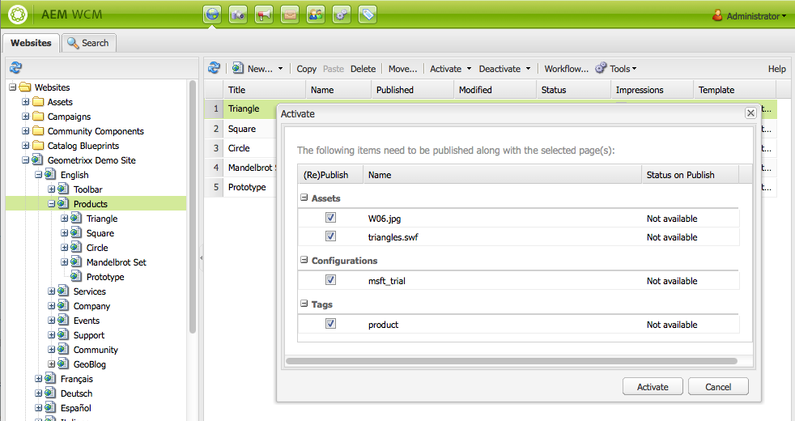
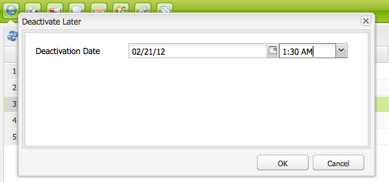

# Pagina&#39;s publiceren{#publishing-pages}

Nadat u de inhoud hebt gemaakt en gecontroleerd in de auteursomgeving, stelt u deze beschikbaar op uw openbare website (uw publicatieomgeving).

Dit wordt bedoeld als het publiceren van een pagina. Wanneer u een pagina uit het publicatiemilieu wilt verwijderen wordt bedoeld unpublishing. Wanneer u de pagina publiceert en publiceert, blijft deze beschikbaar in de ontwerpomgeving voor verdere wijzigingen totdat u de pagina verwijdert.

U kunt een pagina ook direct of op een vooraf gedefinieerde datum/tijd publiceren of verwijderen.

>[!NOTE]
>
>Bepaalde termen met betrekking tot publicatie kunnen worden verward:
>
>* **Publish/Unpublish**
>  Dit zijn de belangrijkste termen voor de acties die uw inhoud openbaar maken in uw publicatieomgeving (of niet).
>
>* **activeert/deactiveert**
>  Deze termen zijn synoniem met publiceren/verwijderen.
>
>* **Replicatie/Replicatie**
>  Dit zijn de technische termen die de beweging van gegevens (bijvoorbeeld pagina-inhoud, bestanden, code, gebruikerscommentaren) van de ene omgeving naar de andere beschrijven, zoals bij het publiceren of omgekeerd repliceren van gebruikerscommentaren.
>

>[!NOTE]
>
>Als u niet over de vereiste rechten voor het publiceren van een specifieke pagina beschikt:
>
>* Er wordt een workflow gestart om de juiste persoon op de hoogte te stellen van uw verzoek om te publiceren.
>* Er wordt een bericht weergegeven (voor een korte periode) om u hiervan op de hoogte te stellen.
>

## Pagina&#39;s publiceren {#publishing-a-page}

Er zijn twee methoden om een pagina te activeren:

* [vanuit de websiteconsole](#activating-a-page-from-the-websites-console)
* [van het hulplid op de pagina zelf](#activating-a-page-from-sidekick)

>[!NOTE]
>
>U kunt een subboom van veelvoudige pagina&#39;s ook activeren gebruikend [ boom ](#howtoactivateacompletesectiontreeofyourwebsite) op de console van Hulpmiddelen activeren.

### Een pagina activeren via de websiteconsole {#activating-a-page-from-the-websites-console}

U kunt pagina&#39;s activeren in de console Websites. Nadat u een pagina hebt geopend en de inhoud ervan hebt gewijzigd, keert u terug naar de console Websites:

1. Selecteer in de websiteconsole de pagina die u wilt activeren.
1. Selecteer **activeren**, of van het hoogste menu, of het drop-down menu op het geselecteerde paginapunt.

   Om de inhoud van de pagina en al zijn sub-pagina&#39;s te activeren gebruiken de **console van Hulpmiddelen[** ](/help/sites-classic-ui-authoring/classic-page-author-publish-pages.md#howtoactivateacompletesectiontreeofyourwebsite).

   

   >[!NOTE]
   >
   >Indien nodig, AEM u verzoeken om elementen die aan de pagina zijn gekoppeld, te activeren of opnieuw te activeren. U kunt de selectievakjes in- of uitschakelen om deze elementen te activeren.
   >
   >

1. Indien nodig, AEM u verzoeken om elementen die aan de pagina zijn gekoppeld, te activeren of opnieuw te activeren. U kunt de selectievakjes in- of uitschakelen om deze elementen te activeren.

   

1. AEM WCM activeert de geselecteerde inhoud. De gepubliceerde pagina of de pagina&#39;s verschijnen in de [ console van Websites ](/help/sites-classic-ui-authoring/author-env-basic-handling.md#page-information-on-the-websites-console) (duidelijk groen) met informatie over wie de inhoud en de datum en de tijd van activering activeerde.

   

### Een pagina vanuit Sidekick activeren {#activating-a-page-from-sidekick}

U kunt een pagina ook activeren wanneer u deze hebt geopend voor bewerking.

Nadat u de pagina hebt geopend en de inhoud ervan hebt gewijzigd, kunt u:

1. Selecteer het **lusje van de Pagina** in de Sidekick.
1. Klik **activeren Pagina**.
Rechtsboven in het venster wordt een bericht weergegeven waarin wordt bevestigd dat de pagina is geactiveerd.

## Publicatie van een pagina ongedaan maken {#unpublishing-a-page}

Als u een pagina uit de publicatieomgeving wilt verwijderen, deactiveert u de inhoud.

Een pagina deactiveren:

1. Selecteer in de websiteconsole de pagina die u wilt deactiveren.
1. Selecteer **Deactivate**, of van het hoogste menu, of het drop-down menu op het geselecteerde paginapunt. U wordt gevraagd de verwijdering te bevestigen.

   

1. Vernieuw de [ console van Websites ](/help/sites-classic-ui-authoring/author-env-basic-handling.md#page-information-on-the-websites-console) en de inhoud is duidelijk in rood, erop wijzend dat het niet meer wordt gepubliceerd.

   

## Later activeren/deactiveren {#activate-deactivate-later}

### Later activeren {#activate-later}

Uw activering voor een later tijdstip plannen:

1. In de console van Websites, ga **activeren** menu, en selecteer **later** activeren.
1. In de dialoog die opent verstrekt u de datum en de tijd voor activering en klikt **O.K.**. Hiermee wordt een versie van de pagina gemaakt die op het opgegeven tijdstip wordt geactiveerd.

   

Als u later activeert, wordt een workflow gestart om deze versie van de pagina op het opgegeven tijdstip te activeren. Als u later deactiveert, wordt daarentegen een workflow gestart om deze versie van de pagina op een bepaald moment te deactiveren.

Als u deze activering/deactivering wilt annuleren, ga naar de [ Console van het Werkschema ](/help/sites-administering/workflows-administering.md#main-pars_title_3-yjqslz-refd) om het overeenkomstige werkschema te eindigen.

### Later deactiveren {#deactivate-later}

U kunt als volgt de deactivering voor een later tijdstip plannen:

1. In de console van de Website, ga **Deactivate** menu, en selecteer **later** Deactivate.

1. In de dialoog die opent verstrekt u de datum en de tijd voor deactivatie en klikt **O.K.**.

   

**het Deactiveren laat** of begint een werkschema om deze versie van de pagina in een specifieke tijd te deactiveren.

Als u deze deactivering wilt annuleren, ga naar de [ Console van het Werkschema ](/help/sites-administering/workflows-administering.md#main-pars_title_3-yjqslz-refd) om het overeenkomstige werkschema te eindigen.

## Geplande activering/deactivering (aan/uit-tijd) {#scheduled-activation-deactivation-on-off-time}

U kunt tijden voor een te publiceren pagina plannen/unpublished gebruikend **op Tijd** en **van Tijd** die in de [ Eigenschappen van de Pagina ](/help/sites-classic-ui-authoring/classic-page-author-edit-page-properties.md) kunnen worden bepaald.

### Status van paginapublicatie bepalen {#determining-page-publication-status-classic-ui}

De status kan van de [ console van Websites ](/help/sites-classic-ui-authoring/author-env-basic-handling.md#page-information-on-the-websites-console) worden gezien. De kleuren geven de publicatiestatus aan.

## Een volledige sectie (structuur) van uw website activeren {#activating-a-complete-section-tree-of-your-website}

Van het **lusje van Websites** kunt u de individuele pagina&#39;s activeren. Wanneer u een aanzienlijk aantal inhoudspagina&#39;s hebt ingevoerd of bijgewerkt - die allen onder de zelfde wortelpagina ingezeten zijn - kan het gemakkelijker zijn om de volledige boom in één actie te activeren. U kunt ook een droog programma uitvoeren om een activering na te bootsen en te markeren welke pagina&#39;s moeten worden geactiveerd.

1. Open de **console van Hulpmiddelen** door het van de **Onthaal** pagina te selecteren en dan **Replicatie** tweemaal te klikken om de console ( `https://localhost:4502/etc/replication.html`) te openen.

   

1. Op de **console van de Replicatie**, klik **activeren Boom**.

   Het volgende venster ( `https://localhost:4502/etc/replication/treeactivation.html` ) wordt weergegeven.

   

1. Ga de **Weg van het Begin** in. Hiermee geeft u het pad op naar de hoofdmap van de sectie die u wilt activeren (publiceren). Deze pagina en alle onderliggende pagina&#39;s worden in overweging genomen voor activering (of worden gebruikt in de emulatie als er een Droge Run is geselecteerd).
1. Activeer de selectiecriteria naar wens:

   * **slechts Gewijzigd**: activeer slechts pagina&#39;s die zijn gewijzigd.
   * **slechts Geactiveerd**: slechts activeer pagina&#39;s die (reeds) zijn geactiveerd. Werkt als een vorm van reactivering.
   * **negeren Gedeactiveerde**: negeer om het even welke pagina&#39;s die zijn gedeactiveerd.

1. Selecteer de handeling die u wilt uitvoeren:

   1. Selecteer **Droog Looppas** als u wilt controleren welke pagina&#39;s ** zouden worden geactiveerd. Dit is slechts een emulatie, er worden geen pagina&#39;s geactiveerd.

   1. Selecteer **activeren** als u de pagina&#39;s wilt activeren.
