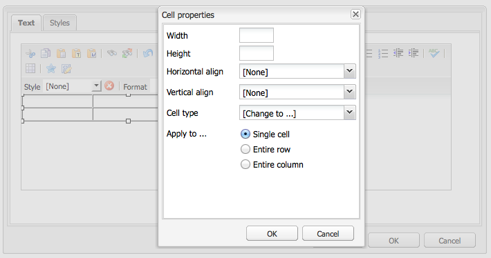

# RTF-editor {#rich-text-editor}

De rijke Redacteur van de Tekst is een basisbouwsteen voor het invoeren van tekstuele inhoud in AEM. Het vormt de basis van verschillende componenten, waaronder:

* Tekst
* Tekstafbeelding
* Tabel

## RTF-editor {#rich-text-editor-1}

Het WYSIWYG-bewerkingsdialoogvenster biedt een groot aantal functies:

>[!NOTE]
>
>De beschikbare eigenschappen kunnen voor individuele projecten worden gevormd, zodat zou voor uw installatie kunnen variëren.

## Plaatselijk bewerken {#in-place-editing}

Naast de op een dialoogvenster gebaseerde modus RTF-bewerking biedt AEM ook de modus Op plaats bewerken, waarmee de tekst direct kan worden bewerkt terwijl deze wordt weergegeven in de lay-out van de pagina.

Dubbelklik op een alinea (langzaam dubbelklikken) om de modus Op plaats bewerken te activeren (de rand van de component is nu oranje).

U kunt de tekst op de pagina rechtstreeks bewerken in plaats van in een dialoogvenster. Breng gewoon uw wijzigingen aan en deze worden automatisch opgeslagen.

>[!NOTE]
>
>Als u de zoeker naar inhoud hebt geopend, wordt boven aan het tabblad (zoals hierboven) een werkbalk met de opties voor de RTE-opmaak weergegeven.
>
>Als de zoeker naar inhoud niet geopend is, wordt de werkbalk niet weergegeven.

Momenteel is de modus Plaatsen bewerken ingeschakeld voor pagina-elementen die zijn gegenereerd door de componenten **Tekst** en **Titel** .

>[!NOTE]
>
>De component [!UICONTROL Title] is ontworpen voor korte tekst zonder regeleinden. Als u een titel bewerkt in de modus Op plaats bewerken, wordt door het invoeren van een regeleinde een nieuwe **tekstcomponent** onder de titel geopend.

## Functies van de Rich Text Editor {#features-of-the-rich-text-editor}

De rijke Redacteur van de Tekst verstrekt een waaier van eigenschappen, [hangen deze van de configuratie](/help/sites-administering/rich-text-editor.md) van de individuele component af. De functies zijn beschikbaar voor zowel de geoptimaliseerde interface voor aanrakingen als de klassieke interface.

### Standaardtekenopmaak {#basic-character-formats}

Hier kunt u opmaak toepassen op geselecteerde tekens (gemarkeerd); Sommige opties hebben ook sneltoetsen:

* Vet (Ctrl-B)
* Cursief (Ctrl-I)
* Onderstrepen (Ctrl-U)
* Subscript
* Superscript

Alles wordt als een schakeloptie gebruikt, dus bij herselectie wordt de indeling verwijderd.

### Vooraf gedefinieerde stijlen en indelingen {#predefined-styles-and-formats}

Uw installatie kan vooraf gedefinieerde stijlen en indelingen bevatten. Deze zijn beschikbaar in de vervolgkeuzelijsten **[!UICONTROL Stijl]** en **[!UICONTROL Opmaak]** en kunnen worden toegepast op tekst die u hebt geselecteerd.

Een stijl kan worden toegepast op een specifieke tekenreeks (een stijl heeft een CSS-correlatie):

Terwijl een opmaak wordt toegepast op de gehele tekstalinea (een opmaak is gebaseerd op HTML):

Een specifieke notatie kan alleen worden gewijzigd (de standaardinstelling is **[!UICONTROL Alinea]**).

Een stijl kan worden verwijderd. Plaats de cursor in de tekst waarop de stijl is toegepast en klik op het verwijderpictogram:

>[!CAUTION]
>
>U mag de tekst waarop de stijl is toegepast niet opnieuw selecteren of het pictogram moet worden gedeactiveerd.

### Knippen, kopiëren en plakken {#cut-copy-paste}

De standaardfuncties van **[!UICONTROL Knippen]** en **[!UICONTROL Kopiëren]** zijn beschikbaar. Er zijn verschillende kleveringen van **[!UICONTROL Plakken]** beschikbaar voor verschillende indelingen.

* Knippen (Ctrl+X)
* Kopiëren (Ctrl-C)
* PlakkenDit is het standaardplakmechanisme (Ctrl-V) voor de component; als deze functie is geïnstalleerd buiten de box, is deze geconfigureerd voor [!UICONTROL Plakken vanuit Word].

* Plakken als tekst: Hiermee worden alle stijlen en opmaak verwijderd, zodat alleen de onbewerkte tekst wordt geplakt.

* Plakken vanuit Word: Hiermee plakt u de inhoud als HTML (met de vereiste aanpassingen).

### Ongedaan maken, Opnieuw {#undo-redo}

AEM houdt een overzicht bij van de laatste 50 acties in de huidige component, in chronologische volgorde. Deze handelingen kunnen desgewenst ongedaan worden gemaakt (en vervolgens opnieuw worden uitgevoerd).

>[!CAUTION]
>
>De geschiedenis wordt alleen gehouden voor de huidige bewerkingssessie. Deze wordt telkens opnieuw gestart wanneer u de component voor bewerking opent.

>[!NOTE]
>
>Vijftig is het standaardaantal taken. Dit kan voor uw installatie anders zijn.

### Uitlijning {#alignment}

De tekst kan links, gecentreerd of rechts worden uitgelijnd.

### Inspringing {#indentation}

De inspringing van een alinea kan worden vergroot of verkleind. De geselecteerde alinea wordt ingesprongen, alle nieuwe tekst die wordt ingevoerd, behoudt het huidige inspringingsniveau.

### Lijsten {#lists}

U kunt zowel lijsten met opsommingstekens als genummerde lijsten maken in uw tekst. Selecteer het lijsttype en begin met typen of markeer de tekst die u wilt omzetten. In beide gevallen wordt met een lijnfeed een nieuw lijstitem gestart.

Geneste lijsten kunnen worden bereikt door een of meer lijstitems in te springen.

U kunt de stijl van een lijst wijzigen door de cursor in de lijst te plaatsen en vervolgens de andere stijl te selecteren. Een sublijst kan ook een andere stijl hebben dan de lijst met sublijsten. Dit kan worden toegepast zodra de sublijst is gemaakt (door inspringing).

### Koppelingen {#links}

Een koppeling naar een URL (binnen uw website of een externe locatie) wordt gegenereerd door de vereiste tekst te markeren en vervolgens op het hyperlinkpictogram te klikken:

In een dialoogvenster kunt u de doel-URL opgeven. ook of het in een nieuw venster moet worden geopend.

U kunt:

* Een URI rechtstreeks typen
* Gebruik het site-overzicht om een pagina binnen uw website te selecteren
* Voer de URI in en voeg vervolgens het doelanker toe;bijv. `www.TargetUri.org#AnchorName`
* Voer alleen een anker in (als u naar &quot;de huidige pagina&quot; wilt verwijzen);Bijvoorbeeld: `#anchor`
* Zoeken naar een pagina in de zoeker naar inhoud en vervolgens het paginapictogram naar het dialoogvenster Hyperlink slepen

>[!NOTE]
>
>URI kan met om het even welke protocollen worden voorafgegaan die voor uw installatie worden gevormd. In een standaardinstallatie zijn dit `https://`, `ftp://`en `mailto:`. Protocollen die niet voor uw installatie zijn geconfigureerd, worden afgewezen en als ongeldig gemarkeerd.

Als u de koppelingspositie wilt verbreken, plaatst u de cursor ergens in de koppelingstekst en klikt u op het pictogram [!UICONTROL Ontkoppelen] :

### Ankers {#anchors}

U kunt overal in de tekst een anker maken door de cursor te plaatsen of tekst te selecteren. Klik vervolgens op het pictogram **Anker** om het dialoogvenster te openen.

Voer de naam van het anker in en klik op **OK** om het anker op te slaan.

Het anker wordt weergegeven wanneer de component wordt bewerkt en kan nu worden gebruikt binnen een doel voor koppelingen.

### Zoeken en vervangen {#find-and-replace}

AEM biedt zowel de functie **Zoeken** als de functie **Vervangen** (zoeken en vervangen).

Beide hebben een volgende **knop** Zoeken om de geopende component naar de opgegeven tekst te zoeken. U kunt ook opgeven of de hoofdletters/kleine letters moeten worden gevonden.

De zoekopdracht begint altijd op de huidige cursorpositie in de tekst. Wanneer het einde van de component is bereikt, wordt u gewaarschuwd dat de volgende zoekbewerking van bovenaf zal beginnen.

Met de optie **Vervangen** kunt u **zoeken** en vervolgens een afzonderlijke instantie door de opgegeven tekst **vervangen** , of alle **instanties in de huidige component** vervangen.

### Afbeeldingen {#images}

Afbeeldingen kunnen worden gesleept vanuit de zoekfunctie voor inhoud om ze aan de tekst toe te voegen.

>[!NOTE]
>
>AEM biedt ook gespecialiseerde componenten voor meer gedetailleerde beeldconfiguratie. De componenten **Afbeelding** en **Tekstafbeelding** zijn bijvoorbeeld beschikbaar.

### Spellingcontrole {#spelling-checker}

De spellingcontrole controleert alle tekst in de huidige component.

Eventuele onjuiste spelling wordt gemarkeerd:

>[!NOTE]
>
>De spellingcontrole wordt uitgevoerd in de taal van de website door de eigenschap language van de substructuur te gebruiken of de taal uit de URL te halen. De `en` vertakking wordt bijvoorbeeld gecontroleerd op Engels en de `de` vertakking op Duits.

### Tabellen {#tables}

Tabellen zijn beschikbaar:

* Als **tabelcomponent**

   

* Vanuit de **component Text**

   

   >[!NOTE]
   >
   >Hoewel de lijsten in RTE beschikbaar zijn, wordt het geadviseerd om de component van de **Lijst** te gebruiken wanneer het creëren van lijsten.

In zowel de **Tekst** als de de componentenlijstfunctionaliteit van de **** Lijst van de Lijst is beschikbaar via het contextmenu (gewoonlijk de juist-muis-knoop) binnen de lijst wordt geklikt; bijvoorbeeld:

>[!NOTE]
>
>In de **component van de Lijst** , is een gespecialiseerde toolbar ook beschikbaar, met inbegrip van diverse standaard rijke functies van de tekstredacteur, samen met een ondergroep van de lijst-specifieke functies.

De tabelspecifieke functies zijn:

* [Tabeleigenschappen](#table-properties)
* [Celeigenschappen](#cell-properties)
* [Rijen toevoegen of verwijderen](#add-or-delete-rows)
* [Kolommen toevoegen of verwijderen](#add-or-delete-columns)
* [Gehele rijen of kolommen selecteren](#selecting-entire-rows-or-columns)
* [Cellen samenvoegen](#merge-cells)
* [Cellen splitsen](#split-cells)
* [Geneste tabellen](#creating-nested-tables)
* [Tabel verwijderen](#remove-table)

#### Tabeleigenschappen {#table-properties}

De basiseigenschappen van de tabel kunnen worden geconfigureerd voordat u op **OK** klikt om op te slaan:

* **Breedte**: De totale breedte van de tabel.

* **Hoogte**: De totale hoogte van de tabel.

* **Rand**: De grootte van de tabelrand.

* **Celopvulling**: Hiermee definieert u de witruimte tussen de celinhoud en de randen.

* **Celafstand**: Hiermee bepaalt u de afstand tussen de cellen.

>[!NOTE]
>
>Enkele celeigenschappen, zoals Breedte en Hoogte, kunnen worden gedefinieerd als pixels of als percentages.

>[!CAUTION]
>
>Adobe raadt u aan een breedte voor de tabel te definiëren.

#### Celeigenschappen {#cell-properties}

De eigenschappen van een specifieke cel, of reeks cellen, kunnen worden gevormd:

* **Breedte**
* **Hoogte**
* **Horizontaal uitlijnen** - Links, Midden of Rechts
* **Verticaal uitlijnen** - Boven, Midden, Onder of Basislijn
* **Celtype**- Gegevens of Koptekst
* **** Toepassen op: Enkele cel, gehele rij, gehele kolom

#### Rijen toevoegen of verwijderen {#add-or-delete-rows}

U kunt rijen boven of onder de huidige rij toevoegen.

De huidige rij kan ook worden verwijderd.

#### Kolommen toevoegen of verwijderen {#add-or-delete-columns}

Kolommen kunnen links of rechts van de huidige kolom worden toegevoegd.

De huidige kolom kan ook worden verwijderd.

#### Gehele rijen of kolommen selecteren {#selecting-entire-rows-or-columns}

Hiermee selecteert u de gehele huidige rij of kolom. Vervolgens zijn specifieke acties (bijvoorbeeld samenvoegen) beschikbaar.

#### Cellen samenvoegen {#merge-cells}

 

* Als u een groep cellen hebt geselecteerd, kunt u deze samenvoegen tot één groep cellen.
* Als u slechts één cel hebt geselecteerd, kunt u deze samenvoegen met de cel rechts of onder.

#### Cellen splitsen {#split-cells}

Selecteer één cel om deze te splitsen:

* Als u een cel horizontaal splitst, wordt er een nieuwe cel rechts van de huidige cel in de huidige kolom gegenereerd.
* Als u een cel verticaal splitst, wordt er een nieuwe cel onder de huidige cel gegenereerd, maar binnen de huidige rij.

#### Creating Nested Tables {#creating-nested-tables}

Als u een geneste tabel maakt, wordt er een nieuwe, op zichzelf staande tabel in de huidige cel gemaakt.

>[!NOTE]
>
>Bepaalde extra functies zijn afhankelijk van de browser:
>
>* Windows IE: Gebruik Ctrl+klikken terwijl u de muis ingedrukt houdt (meestal links) om meerdere cellen te selecteren.
>* Firefox: Sleep de aanwijzer om een celbereik te selecteren.

#### Tabel verwijderen {#remove-table}

Gebruik de optie om de tabel uit de **[!UICONTROL component Text]** te verwijderen.

### Speciale tekens {#special-characters}

Speciale tekens kunnen beschikbaar worden gemaakt in de RTF-editor. deze kunnen variëren afhankelijk van uw installatie.

Gebruik de muisaanwijzer om een vergrote versie van het teken weer te geven en klik vervolgens om het teken op de huidige locatie in de tekst op te nemen.

### Bronbewerkingsmodus {#source-editing-mode}

In de bronbewerkingsmodus kunt u de onderliggende HTML van de component zien en bewerken.

De tekst:

In de bronmodus ziet het er als volgt uit (vaak is de bron veel langer, dus moet u schuiven):

>[!CAUTION]
>
>Bij het verlaten van bronwijze, voert AEM bepaalde bevestigingscontroles uit (bijvoorbeeld, die ervoor zorgen dat de tekst correct bevat/in blokken wordt genest). Dit kan leiden tot wijzigingen in uw bewerkingen.
