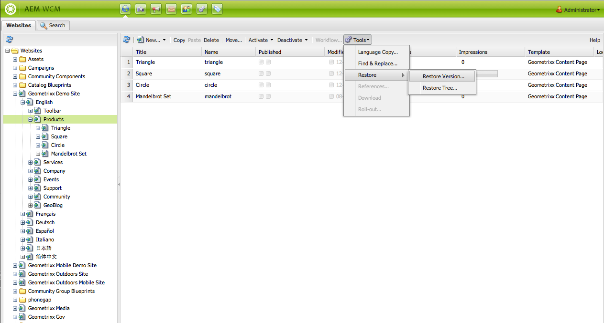
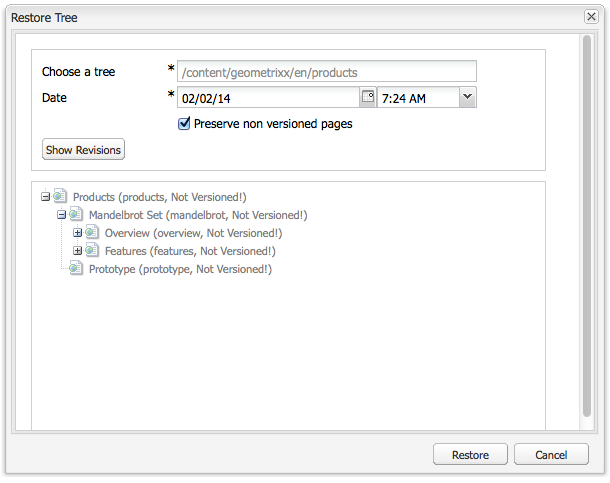

# Werken met paginaversies{#working-with-page-versions}

Met Versioning maakt u een &quot;momentopname&quot; van een pagina op een bepaald tijdstip. Met versioning kunt u de volgende handelingen uitvoeren:

* Maak een versie van een pagina.
* Herstel een pagina naar een vorige versie zodat u een wijziging die u hebt aangebracht in een pagina ongedaan kunt maken.
* Vergelijk de huidige versie van een pagina met een vorige versie met verschillen in de gemarkeerde tekst en afbeeldingen.

## Een versie maken {#creating-a-new-version}

Een versie van een pagina maken:

1. Open in uw browser de pagina waarvoor u een versie wilt maken.
1. In de Sidekick, selecteer het **Versioning** lusje, toen **creeer Versie** subtab.

   

1. Ga a **Commentaar** (facultatief) in.
1. Om een etiket aan de (facultatieve) versie te plaatsen, klik **Meer >>** knoop en plaats het **Etiket** om de versie te noemen. Als het label niet is ingesteld, wordt de versie automatisch verhoogd.
1. Klik **creëren Versie**. Er wordt een grijs bericht weergegeven op de pagina, bijvoorbeeld:
Versie 1.2 gemaakt voor: Hemden.

>[!NOTE]
>
>Er wordt automatisch een versie gemaakt wanneer de pagina wordt geactiveerd.

## Paginaversie herstellen vanuit Sidekick {#restoring-a-page-version-from-sidekick}

De pagina herstellen naar een vorige versie:

1. Open de pagina waarvoor u een vorige versie wilt herstellen.
1. In sidekick, selecteer het **Versioning** lusje, toen **herstelt Versie** subtab.

   

1. Selecteer de versie die u wilt herstellen en **selecteren herstelt**.

## Paginaversie herstellen vanuit de console {#restoring-a-page-version-from-the-console}

Deze methode kan worden gebruikt om een paginaversie te herstellen. Deze kan ook worden gebruikt om eerder verwijderde pagina&#39;s te herstellen:

1. In de **console van Websites**, navigeer aan de pagina u het wilt herstellen en selecteren.
1. Van het hoogste menu, uitgezochte **Hulpmiddelen**, dan **herstel**:

   

1. Het selecteren van **herstelt Versie..** maakt een lijst van versies van documenten in de huidige omslag. Zelfs als een pagina is verwijderd, wordt de laatste versie weergegeven:

   

1. Selecteer de versie die u wilt herstellen en **klikken herstelt**. AEM herstelt de versies (of bomen) die u selecteert.

### Een structuur herstellen vanuit de console {#restoring-a-tree-from-the-console}

Deze methode kan worden gebruikt om een paginaversie te herstellen. Deze kan ook worden gebruikt om eerder verwijderde pagina&#39;s te herstellen:

1. In de **console van Websites**, navigeer aan de omslag u het wilt herstellen en selecteren.
1. Van het hoogste menu, uitgezochte **Hulpmiddelen**, dan **herstel**.
1. Het selecteren van **herstelt Boom..** opent de dialoogdoos zodat kunt u de boom selecteren die u wilt herstellen:

   

1. Klik **herstellen**. AEM herstelt de structuur die u hebt geselecteerd.

## Vergelijken met een vorige versie {#comparing-with-a-previous-version}

De huidige versie van de pagina vergelijken met een vorige versie:

1. Open in uw browser de pagina die u met een vorige versie wilt vergelijken.
1. In de Sidekick, selecteer het **Versioning** lusje, dan **herstelt Versio** op subtab.

   

1. Selecteer de versie die u wilt vergelijken en de **Diff** knoop klikken.
1. De verschillen tussen de huidige versie en de geselecteerde versie worden als volgt weergegeven:

   * Tekst die is verwijderd, is rood en doorgehaald.
   * De toegevoegde tekst is groen en gemarkeerd.
   * Afbeeldingen die zijn toegevoegd of verwijderd, zijn groene afbeeldingen.

   

1. In de Sidekick, selecteer **herstelt Versie** subtab en klik **&lt;&lt;Back** knoop om de huidige versie te tonen.

## Timewarp {#timewarp}

De tijdverdraaiing is een eigenschap die wordt ontworpen om de ***gepubliceerde*** staat van een pagina op specifieke tijden in het verleden te simuleren.

Het doel is om de gepubliceerde website op het geselecteerde tijdstip bij te houden. Hiermee wordt de status van de publicatieomgeving bepaald aan de hand van de paginabactivering.

Dit doet u als volgt:

* Het systeem zoekt naar de paginaversie die op het geselecteerde tijdstip actief was.
* Dit betekent de getoonde versie werd gecreeerd/geactiveerd *vóór* het punt in tijd die in Tijdverdraaiing wordt geselecteerd.
* Wanneer u naar een pagina navigeert die is verwijderd, wordt dit ook weergegeven, zolang de oude versies van de pagina nog beschikbaar zijn in de opslagplaats.
* Als geen gepubliceerde versie wordt gevonden, dan keert Timewarp aan de huidige staat van de pagina op het auteursmilieu terug (dit moet een fout/404 pagina verhinderen, wat zou betekenen dat u niet meer kunt doorbladeren).

>[!NOTE]
>
>Als versies uit de dataopslag worden verwijderd, kan Timewarp niet de correcte mening tonen. Als de elementen (zoals code, css en afbeeldingen) voor het renderen van de website zijn gewijzigd, verschilt de weergave ook van wat oorspronkelijk was, omdat deze items niet in de repository zijn geversileerd.

### De tijdverdraaiingskalender gebruiken {#using-the-timewarp-calendar}

Timewarp is beschikbaar bij sidekick.

De kalenderversie wordt gebruikt als u een specifieke dag hebt om te bekijken:

1. Open het **Versioning** lusje en klik dan **Tijdverdraaiing** (dichtbij de bodem van sidekick). Het volgende dialoogvenster wordt weergegeven:

   

1. Gebruikend de datum en de tijdselecteurs specificeren de datum/de tijd u wilt en **gaat** klikken.

   Met Tijdlijn verdraaien wordt de pagina weergegeven zoals deze was gepubliceerd vóór/op de datum die u hebt gekozen.

   >[!NOTE]
   >
   >Tijdlijn verdraaien werkt alleen volledig als u de pagina eerder hebt gepubliceerd. Als dat niet het geval is, wordt bij Timewarp de huidige pagina in de auteursomgeving weergegeven.

   >[!NOTE]
   >
   >Als u navigeert naar een pagina die is verwijderd of verwijderd uit de opslagplaats, wordt deze correct weergegeven als de oude versies van de pagina nog steeds beschikbaar zijn in de opslagplaats.

   >[!NOTE]
   >
   >U kunt de oude versie van de pagina niet bewerken. Deze kan alleen worden weergegeven. Als u de oudere versie wilt herstellen, kunt u dat manueel doen gebruikend [&#x200B; herstellen &#x200B;](/help/sites-classic-ui-authoring/classic-page-author-work-with-versions.md#restoring-a-page-version-from-sidekick).

1. Klik op de volgende pagina als u de pagina hebt bekeken:

   * **Tijdlijn van de Uitgang** om weg te gaan en aan de huidige auteurspagina terug te keren.
   * [&#x200B; toon Chronologie &#x200B;](#using-the-timewarp-timeline) zodat kunt u de chronologie bekijken.

   

### De tijdlijn Tijdlijn Tijdlijn gebruiken {#using-the-timewarp-timeline}

De tijdlijnversie wordt gebruikt als u een overzicht wilt zien van de publicatieactiviteiten op de pagina.

Als u de tijdlijn van het document wilt weergeven:

1. Voer een van de volgende handelingen uit om de tijdlijn weer te geven:

   1. Open het **Versioning** lusje, en klik dan **Timewarp** (dichtbij de bodem van sidekick).

   1. Gebruik het sidekick dialoogvakje dat na [&#x200B; wordt getoond gebruikend de Kalender van de Verdraaiing van de Tijd &#x200B;](#using-the-timewarp-calendar).

1. Klik **tonen Chronologie** - de chronologie van het document verschijnt; bijvoorbeeld:

   

1. Selecteer en verplaats (houd ingedrukt en sleep) de tijdlijn om door de tijdlijn van het document te gaan.

   * Alle regels geven gepubliceerde versies aan.
Wanneer een pagina wordt geactiveerd, wordt een nieuwe regel gestart. Telkens wanneer het document wordt bewerkt, wordt er een nieuwe kleur weergegeven.
In het onderstaande voorbeeld geeft de rode lijn aan dat de pagina is bewerkt tijdens het tijdsbestek van de eerste groene versie. De gele lijn geeft aan dat de pagina ergens in de rode versie is bewerkt, enzovoort.

   

1. Klik:

   1. **ga** om de inhoud van de gepubliceerde pagina in de geselecteerde tijd te tonen.
   1. Wanneer het tonen van die inhoud, gebruik **Tijdverdraaiing van de Uitgang** om weg te gaan en aan de huidige auteurspagina terug te keren.

### Beperkingen voor tijdwijziging {#timewarp-limitations}

Met Timewarp wordt het best geprobeerd een pagina op een geselecteerd punt in de tijd te reproduceren. Vanwege de complexiteit van het voortdurend ontwerpen van inhoud in AEM is dit echter niet altijd mogelijk. Deze beperkingen moeten in gedachten worden gehouden wanneer u Tijdverdraaiing gebruikt.

* **de werken van de Onderbreking van de Onderbreking die op gepubliceerde pagina&#39;s** worden gebaseerd - de Onderbreking werkt slechts volledig als u eerder de pagina hebt gepubliceerd. Als dat niet het geval is, wordt bij Timewarp de huidige pagina in de auteursomgeving weergegeven.
* **Tijdverdraaiing gebruikt paginaversies** - als u aan een pagina navigeert die is verwijderd/geschrapt uit de bewaarplaats het behoorlijk teruggegeven als de oude versies van de pagina nog in de bewaarplaats beschikbaar zijn.
* **Verwijderde versies beïnvloeden Timewarp** - als de versies uit de bewaarplaats dan worden verwijderd kan de Timewarp niet de correcte mening tonen.

* **Tijdverdraaiing is read-only** - u kunt niet de oude versie van de pagina uitgeven. Deze kan alleen worden weergegeven. Als u de oudere versie wilt herstellen, kunt u dat manueel doen gebruikend [&#x200B; herstellen &#x200B;](#main-pars-title-1).

* **Tijdverdraaiing is slechts gebaseerd op paginacontent** - als elementen-zoals code, css, en beeld activa-voor het teruggeven van de website zijn veranderd, verschilt de mening van wat het oorspronkelijk was. De reden hiervoor is dat deze items niet zijn geautoriseerd in de gegevensopslagruimte.

>[!CAUTION]
>
>Timewarp is ontworpen om auteurs te helpen bij het begrijpen en creëren van hun inhoud. Het is niet bedoeld als controlelogboek of voor juridische doeleinden.
