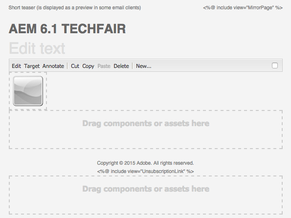
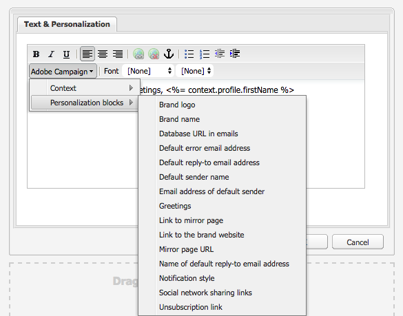

# Werken met Adobe Campaign 6.1 en Adobe Campaign Standard{#working-with-adobe-campaign-and-adobe-campaign-standard}

U kunt e-mailinhoud maken in AEM en deze verwerken in Adobe Campaign-e-mails. Daartoe moet u:

1. Maak een nieuwsbrief in AEM van een Adobe Campaign-specifieke sjabloon.
1. Selecteren [een Adobe Campaign-service](#selectingtheadobecampaigncloudservice) voordat u de inhoud bewerkt, hebt u toegang tot alle functies.
1. Bewerk de inhoud.
1. Valideer de inhoud.

Inhoud kan vervolgens worden gesynchroniseerd met een levering in Adobe Campaign. In dit document worden gedetailleerde instructies beschreven.

>[!NOTE]
>
>Voordat u deze functionaliteit kunt gebruiken, moet u AEM configureren voor integratie met een van beide [Adobe Campaign](/help/sites-administering/campaignonpremise.md) of [Adobe Campaign Standard](/help/sites-administering/campaignstandard.md).

## E-mailinhoud verzenden via Adobe Campaign {#sending-email-content-via-adobe-campaign}

Nadat u AEM en Adobe Campaign hebt geconfigureerd, kunt u rechtstreeks in AEM inhoud voor e-maillevering maken en deze vervolgens in Adobe Campaign verwerken.

Wanneer u Adobe Campaign-inhoud maakt in AEM, moet u een koppeling maken naar een Adobe Campaign-service voordat u de inhoud bewerkt, zodat u toegang hebt tot alle functies.

Er zijn twee mogelijke gevallen:

* Inhoud kan worden gesynchroniseerd met een levering vanuit Adobe Campaign. Hiermee kunt u AEM inhoud in een levering gebruiken.
* (Alleen Adobe Campaign op locatie) De inhoud kan rechtstreeks naar Adobe Campaign worden verzonden, waardoor automatisch een nieuwe e-maillevering wordt gegenereerd. Deze modus heeft beperkingen.

In dit document worden gedetailleerde instructies beschreven.

### Nieuwe e-mailinhoud maken {#creating-new-email-content}

>[!NOTE]
>
>Vergeet niet om e-mailsjablonen toe te voegen onder **/content/campagnes** ter beschikking te stellen.
>

1. Selecteer in AEM **Websites** Blader vervolgens naar de verkenner om te zoeken waar uw e-mailcampagnes worden beheerd. In het volgende voorbeeld is het betrokken knooppunt **Websites** > **Campagnes** > **Geometrixx Outdoors** > **E-mailcampagnes**.

   >[!NOTE]
   >
   >[E-mailvoorbeelden zijn alleen beschikbaar in Geometrixx](/help/sites-developing/we-retail.md#weretail). Download voorbeeldinhoud van het Geometrixx van het Pakket Delen.

   

1. Selecteren **Nieuw** > **Nieuwe pagina** om nieuwe e-mailinhoud te maken.
1. Selecteer een van de beschikbare sjablonen die specifiek zijn voor Adobe Campaign en vul vervolgens de algemene eigenschappen van de pagina in. Er zijn standaard drie sjablonen beschikbaar:

   * **Adobe Campaign-e-mail (AC 6.1)**: hiermee kunt u inhoud toevoegen aan een vooraf gedefinieerde sjabloon voordat u deze naar Adobe Campaign 6.1 verzendt voor levering.
   * **Adobe Campaign-e-mail (ACS)**: hiermee kunt u inhoud toevoegen aan een vooraf gedefinieerde sjabloon voordat u deze naar Adobe Campaign Standard verzendt voor levering.

   

1. Klikken **Maken** om uw e-mail of nieuwsbrief te maken.

### De Adobe Campaign-cloudservice en -sjabloon selecteren {#selecting-the-adobe-campaign-cloud-service-and-template}

Voor integratie met Adobe Campaign moet u een Adobe Campaign-cloudservice aan de pagina toevoegen. Zo hebt u toegang tot personalisatie en andere Adobe Campaign-gegevens.

Daarnaast moet u mogelijk ook de Adobe Campaign-sjabloon selecteren en het onderwerp wijzigen en onbewerkte tekstinhoud toevoegen voor gebruikers die het e-mailbericht niet in HTML zullen bekijken.

1. Selecteer de **Pagina** tabblad in het zijpaneel en selecteer vervolgens **Pagina-eigenschappen.**
1. In de **Cloud-services** in het pop-upvenster selecteert u **Service toevoegen** om de Adobe Campaign-service toe te voegen en klik op **OK**.

   

1. Selecteer in de vervolgkeuzelijst de configuratie die overeenkomt met uw Adobe Campaign-instantie en klik vervolgens op **OK**.

   >[!NOTE]
   >
   >Zorg ervoor dat u op **OK** of **Toepassen** na het toevoegen van de cloudservice. Hierdoor wordt de **Adobe Campaign** gebruiken om correct te werken.

1. Als u een specifieke sjabloon voor e-maillevering wilt toepassen (vanuit Adobe Campaign), anders dan de standaardsjabloon **post** sjabloon, selecteert u **Pagina-eigenschappen** opnieuw. In de **Adobe Campaign** voert u de interne naam van de sjabloon voor e-maillevering in het gerelateerde Adobe Campaign-exemplaar in.

   In Adobe Campaign Standard is de sjabloon **Levering met AEM inhoud**. In Adobe Campaign 6.1 is de sjabloon **E-maillevering met AEM inhoud**.

   Als u de sjabloon selecteert, schakelt AEM automatisch de optie **Adobe Campaign Newsletter** componenten.

### E-mailinhoud bewerken {#editing-email-content}

U kunt e-mailinhoud bewerken in de klassieke gebruikersinterface of in de gebruikersinterface met geoptimaliseerde aanrakingen.

1. Voer het onderwerp en de tekstversie van de e-mail in door **Pagina-eigenschappen** > **E-mail** in de gereedschapset.

   

1. Bewerk e-mailinhoud door de elementen toe te voegen die u van de beschikbare elementen in de assistent wilt gebruiken. U doet dit door ze te slepen en neer te zetten. Dubbelklik vervolgens op het element dat u wilt bewerken.

   U kunt bijvoorbeeld tekst toevoegen die verpersoonlijkingsvelden bevat.

   

   Zie [Adobe Campaign-componenten](/help/sites-classic-ui-authoring/classic-personalization-ac-components.md) voor een beschrijving van de onderdelen die beschikbaar zijn voor Adobe Campaign-nieuwsbrieven/e-mailcampagnes.

   

### Personalisatie invoegen {#inserting-personalization}

Wanneer u de inhoud bewerkt, kunt u het volgende invoegen:

* Adobe Campaign-context. Dit zijn gebieden die u binnen uw tekst kunt opnemen die volgens de gegevens van de ontvanger (bijvoorbeeld, voornaam, achternaam, of om het even welke gegevens van de doeldimensie) zal aanpassen.
* Adobe Campaign-verpersoonlijkingsblokken. Dit zijn blokken vooraf gedefinieerde inhoud die niet gerelateerd zijn aan de gegevens van de ontvanger, zoals een merklogo of een koppeling naar een spiegel.

Zie [Adobe Campaign-componenten](/help/sites-classic-ui-authoring/classic-personalization-ac-components.md) voor een volledige beschrijving van de onderdelen van de campagne.

>[!NOTE]
>
>* Alleen de velden van de Adobe Campaign **Profielen** er wordt rekening gehouden met de doelgerichte dimensie .
>* Wanneer u eigenschappen weergeeft vanuit **Sites** hebt u geen toegang tot de Adobe Campaign-contextvelden. U kunt deze rechtstreeks vanuit de e-mail openen tijdens het bewerken.
>

1. Een nieuwe invoegtoepassing **Nieuwsbrief** > **Tekst en persoonlijke voorkeur (campagne)** component.
1. Open de component door erop te dubbelklikken. De **Bewerken** venster heeft een functionaliteit waarmee u de personalisatie-elementen kunt invoegen.

   >[!NOTE]
   >
   >De beschikbare contextvelden komen overeen met de **Profielen** doelgericht in Adobe Campaign.
   >
   >Zie [Een AEM pagina koppelen aan een Adobe Campaign-e-mail](/help/sites-classic-ui-authoring/classic-personalization-ac-campaign.md#linkinganaempagetoanadobecampaignemail).

   

1. Selecteren **Clientcontext** in het zijpaneel om de verpersoonlijkingsgebieden te testen gebruikend de gegevens in de persona profielen.

   

1. Er verschijnt een venster waarin u de persoon kunt selecteren die u bevalt. De verpersoonlijkingsgebieden worden automatisch vervangen door gegevens van het geselecteerde profiel.

   

### Een voorvertoning van een nieuwsbrief weergeven {#previewing-a-newsletter}

U kunt voorvertonen hoe de nieuwsbrief eruit zal zien en een voorvertoning van de personalisatie bekijken.

1. Open de nieuwsbrief u voorproef en klik Voorproef (vergrootglas) om hulpdekick te krimpen.
1. Klik op een van de e-mailclientpictogrammen om te zien hoe uw nieuwsbrief er in elke e-mailclient uitziet.

   

1. Vouw het hulpwerktuig uit en bewerk het opnieuw.

### Inhoud in AEM goedkeuren {#approving-content-in-aem}

Nadat de inhoud is voltooid, kunt u het goedkeuringsproces starten. Ga naar de **Workflow** en selecteert u de **Goedkeuren voor Adobe Campaign** workflow.

Deze out-of-the-box werkstroom heeft twee stappen: revisie dan goedkeuring, of revisie dan verwerping. Deze workflow kan echter worden uitgebreid en aangepast aan een complexer proces.

Als u inhoud voor Adobe Campaign wilt goedkeuren, past u de workflow toe door **Workflow** in de sidekick en selecteren **Goedkeuren voor Adobe Campaign** en klik op **Workflow starten**. Doorloop de stappen en keur de inhoud goed. U kunt de inhoud ook afwijzen door **Afwijzen** in plaats van **Goedkeuren** in de laatste workflowstap.

Nadat de inhoud is goedgekeurd, wordt deze weergegeven als goedgekeurd in Adobe Campaign. Het e-mailbericht kan vervolgens worden verzonden.

In Adobe Campaign Standard:

In Adobe Campaign 6.1:

>[!NOTE]
>
>Niet-goedgekeurde inhoud kan worden gesynchroniseerd met een levering in Adobe Campaign, maar de levering kan niet worden uitgevoerd. Alleen goedgekeurde inhoud kan via campagneleveringen worden verzonden.

## AEM met Adobe Campaign Standard en Adobe Campaign 6.1 {#linking-aem-with-adobe-campaign-standard-and-adobe-campaign}

>[!NOTE]
>
>Zie [AEM met Adobe Campaign Standard en Adobe Campaign 6.1](/help/sites-authoring/campaign.md#linking-aem-with-adobe-campaign-standard-and-adobe-campaign-classic) krachtens [Werken met Adobe Campaign 6.1 en Adobe Campaign Standard](/help/sites-authoring/campaign.md) in de standaardontwerpdocumentatie voor meer informatie.
