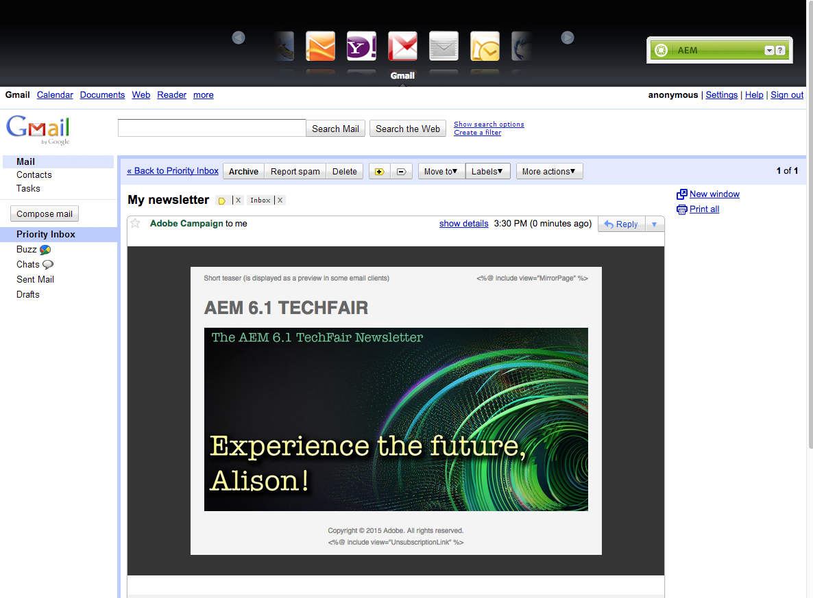

# Werken met Adobe Campaign 6.1 en Adobe Campaign Standard{#working-with-adobe-campaign-and-adobe-campaign-standard}

U kunt e-mailinhoud maken in AEM en deze verwerken in Adobe Campaign-e-mails. Daartoe moet u:

1. Maak een nieuwsbrief in AEM van een Adobe Campaign-specifieke sjabloon.
1. Selecteer [ de dienst van Adobe Campaign ](#selectingtheadobecampaigncloudservice) alvorens de inhoud uit te geven om tot alle functionaliteit toegang te hebben.
1. Bewerk de inhoud.
1. Valideer de inhoud.

Inhoud kan vervolgens worden gesynchroniseerd met een levering in Adobe Campaign. In dit document worden gedetailleerde instructies beschreven.

>[!NOTE]
>
>Alvorens u deze functionaliteit kunt gebruiken, moet u AEM vormen om met of [ Adobe Campaign ](/help/sites-administering/campaignonpremise.md) of [ Adobe Campaign Standard ](/help/sites-administering/campaignstandard.md) te integreren.

## E-mailinhoud verzenden via Adobe Campaign {#sending-email-content-via-adobe-campaign}

Nadat u AEM en Adobe Campaign hebt geconfigureerd, kunt u rechtstreeks in AEM inhoud voor e-maillevering maken en deze vervolgens in Adobe Campaign verwerken.

Wanneer u Adobe Campaign-inhoud maakt in AEM, moet u een koppeling maken naar een Adobe Campaign-service voordat u de inhoud bewerkt, zodat u toegang hebt tot alle functies.

Er zijn twee mogelijke gevallen:

* Inhoud kan worden gesynchroniseerd met een levering vanuit Adobe Campaign. Hiermee kunt u AEM inhoud in een levering gebruiken.
* (Alleen Adobe Campaign op locatie) De inhoud kan rechtstreeks naar Adobe Campaign worden verzonden, waardoor automatisch een nieuwe e-maillevering wordt gegenereerd. Deze modus heeft beperkingen.

In dit document worden gedetailleerde instructies beschreven.

### Nieuwe e-mailinhoud maken {#creating-new-email-content}

>[!NOTE]
>
>Wanneer u e-mailsjablonen toevoegt, moet u deze toevoegen onder **/content/campagnes** om ze beschikbaar te maken.
>

1. In AEM, selecteer de **omslag van Websites** dan doorblader uw ontdekkingsreiziger om te vinden waar uw e-mailcampagnes worden beheerd. In het volgende voorbeeld, is de betrokken knoop **Websites** > **Campagnes** > **Geometrixx Outdoors** > **E-mailcampagnes**.

   >[!NOTE]
   >
   >[ E-mailsteekproeven zijn slechts beschikbaar in Geometrixx ](/help/sites-developing/we-retail.md#weretail). Download voorbeeldinhoud van het Geometrixx van het Pakket Delen.

   

1. Selecteer **Nieuw** > **Nieuwe Pagina** om nieuwe e-mailinhoud tot stand te brengen.
1. Selecteer een van de beschikbare sjablonen die specifiek zijn voor Adobe Campaign en vul vervolgens de algemene eigenschappen van de pagina in. Er zijn standaard drie sjablonen beschikbaar:

   * **Adobe Campaign E-mail (AC 6.1)**: laat u inhoud aan een vooraf bepaald malplaatje toevoegen alvorens het naar Adobe Campaign 6.1 voor levering te verzenden.
   * **Adobe Campaign E-mail (ACS)**: laat u inhoud aan een vooraf bepaald malplaatje toevoegen alvorens het naar Adobe Campaign Standard voor levering te verzenden.

   

1. Klik **creëren** om uw e-mail of nieuwsbrief tot stand te brengen.

### De Adobe Campaign-cloudservice en -sjabloon selecteren {#selecting-the-adobe-campaign-cloud-service-and-template}

Voor integratie met Adobe Campaign moet u een Adobe Campaign-cloudservice aan de pagina toevoegen. Zo hebt u toegang tot personalisatie en andere Adobe Campaign-gegevens.

Daarnaast moet u mogelijk ook de Adobe Campaign-sjabloon selecteren en het onderwerp wijzigen en onbewerkte tekstinhoud toevoegen voor gebruikers die het e-mailbericht niet in HTML zullen bekijken.

1. Selecteer het **lusje van de Pagina** in sidekick, dan selecteren **de eigenschappen van de Pagina.**
1. In het **lusje van de Diensten van de Wolk** in het pop-up venster, uitgezocht **voeg de Dienst** toe om de dienst van Adobe Campaign toe te voegen en klik **O.K.**.

   

1. Selecteer de configuratie die uw instantie van Adobe Campaign van de drop-down lijst aanpast, dan klik O.K. **&#x200B;**.

   >[!NOTE]
   >
   >Ben zeker om **O.K.** te klikken of **&#x200B;**&#x200B;na het toevoegen van de wolkendienst van toepassing is. Dit laat het **Adobe Campaign** lusje toe om behoorlijk te werken.

1. Als u een specifiek malplaatje van de e-maillevering (van Adobe Campaign), buiten het standaard **post** malplaatje zou willen toepassen, selecteer **eigenschappen van de Pagina** opnieuw. In het **Adobe Campaign** lusje, ga de interne naam van het malplaatje van de e-maillevering in de verwante instantie van Adobe Campaign in.

   In Adobe Campaign Standard, is het malplaatje **Levering met AEM Inhoud**. In Adobe Campaign 6.1, is het malplaatje **E-maillevering met AEM inhoud**.

   Wanneer u het malplaatje selecteert, laat AEM automatisch de **Newsletter van Adobe Campaign** componenten toe.

### E-mailinhoud bewerken {#editing-email-content}

U kunt e-mailinhoud bewerken in de klassieke gebruikersinterface of in de gebruikersinterface met geoptimaliseerde aanrakingen.

1. Ga het onderwerp en de tekstversie van e-mail in door **eigenschappen van de Pagina** te selecteren > **E-mail** van toolbox.

   

1. Bewerk e-mailinhoud door de elementen toe te voegen die u van de beschikbare elementen in de assistent wilt gebruiken. U doet dit door ze te slepen en neer te zetten. Dubbelklik vervolgens op het element dat u wilt bewerken.

   U kunt bijvoorbeeld tekst toevoegen die verpersoonlijkingsvelden bevat.

   

   Zie [ Componenten van Adobe Campaign ](/help/sites-classic-ui-authoring/classic-personalization-ac-components.md) voor een beschrijving van componenten beschikbaar voor de bulletins/e-mailcampagnes van Adobe Campaign.

   

### Personalisatie invoegen {#inserting-personalization}

Wanneer u de inhoud bewerkt, kunt u het volgende invoegen:

* Adobe Campaign-context. Dit zijn gebieden die u binnen uw tekst kunt opnemen die volgens de gegevens van de ontvanger (bijvoorbeeld, voornaam, achternaam, of om het even welke gegevens van de doeldimensie) zal aanpassen.
* Adobe Campaign-verpersoonlijkingsblokken. Dit zijn blokken vooraf gedefinieerde inhoud die niet gerelateerd zijn aan de gegevens van de ontvanger, zoals een merklogo of een koppeling naar een spiegel.

Zie {de Componenten van 0} Adobe Campaign [&#128279;](/help/sites-classic-ui-authoring/classic-personalization-ac-components.md) voor een volledige beschrijving van de componenten van de Campagne.

>[!NOTE]
>
>* Slechts worden de gebieden van Adobe Campaign **Profielen** gericht afmeting in aanmerking genomen.
>* Wanneer het bekijken van Eigenschappen van **Plaatsen**, hebt u geen toegang tot de de contextgebieden van Adobe Campaign. U kunt deze rechtstreeks vanuit de e-mail openen tijdens het bewerken.
>

1. Tussenvoegsel nieuw **Nieuwsbrief** > **Tekst &amp; Personalization (Campagne)** component.
1. Open de component door erop te dubbelklikken. Het **geeft** venster uit heeft een functionaliteit die u de verpersoonlijkingselementen laat opnemen.

   >[!NOTE]
   >
   >De beschikbare contextgebieden beantwoorden aan **Profielen** richtend afmeting in Adobe Campaign.
   >
   >Zie [ Linking een AEM pagina aan een e-mail van Adobe Campaign ](/help/sites-classic-ui-authoring/classic-personalization-ac-campaign.md#linkinganaempagetoanadobecampaignemail).

   

1. Selecteer **Context van de Cliënt** in sidekick om de verpersoonlijkingsgebieden te testen gebruikend de gegevens in de persona profielen.

   

1. Er verschijnt een venster waarin u de persoon kunt selecteren die u bevalt. De verpersoonlijkingsgebieden worden automatisch vervangen door gegevens van het geselecteerde profiel.

   

### Een voorvertoning van een nieuwsbrief weergeven {#previewing-a-newsletter}

U kunt voorvertonen hoe de nieuwsbrief eruit zal zien en een voorvertoning van de personalisatie bekijken.

1. Open de nieuwsbrief u voorproef en klik Voorproef (vergrootglas) om hulpdekick te krimpen.
1. Klik op een van de e-mailclientpictogrammen om te zien hoe uw nieuwsbrief er in elke e-mailclient uitziet.

   

1. Vouw het hulpwerktuig uit en bewerk het opnieuw.

### Inhoud in AEM goedkeuren {#approving-content-in-aem}

Nadat de inhoud is voltooid, kunt u het goedkeuringsproces starten. Ga naar het **lusje van het Werkschema** van toolbox en selecteer **goedkeuren voor het werkschema van Adobe Campaign**.

Deze out-of-the-box werkstroom heeft twee stappen: revisie dan goedkeuring, of revisie dan verwerping. Deze workflow kan echter worden uitgebreid en aangepast aan een complexer proces.

Om inhoud voor Adobe Campaign goed te keuren, pas het werkschema toe door **Werkschema** in sidekick te selecteren en **te selecteren keurt voor Adobe Campaign** goed en klik **Werkschema van het Begin**. Doorloop de stappen en keur de inhoud goed. U kunt de inhoud ook verwerpen door **te selecteren verwerp** in plaats van **&#x200B;**&#x200B;in de laatste werkschemastap goedkeuren.

Nadat de inhoud is goedgekeurd, wordt deze weergegeven als goedgekeurd in Adobe Campaign. Het e-mailbericht kan vervolgens worden verzonden.

In Adobe Campaign Standard:

In Adobe Campaign 6.1:

>[!NOTE]
>
>Niet-goedgekeurde inhoud kan worden gesynchroniseerd met een levering in Adobe Campaign, maar de levering kan niet worden uitgevoerd. Alleen goedgekeurde inhoud kan via campagneleveringen worden verzonden.

## AEM met Adobe Campaign Standard en Adobe Campaign 6.1 {#linking-aem-with-adobe-campaign-standard-and-adobe-campaign}

>[!NOTE]
>
>Zie [ het Verbinden AEM met Adobe Campaign Standard en Adobe Campaign 6.1 ](/help/sites-authoring/campaign.md#linking-aem-with-adobe-campaign-standard-and-adobe-campaign-classic) onder [ Werkend met Adobe Campaign 6.1 en Adobe Campaign Standard ](/help/sites-authoring/campaign.md) in de standaard auteursdocumentatie voor details.
