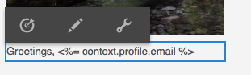

# Je Adobe Campaign als doelgroep instellen{#targeting-your-adobe-campaign}

Als u uw Adobe Campaign-nieuwsbrief als doel wilt instellen, moet u eerst segmentatie instellen. Deze is alleen beschikbaar in de klassieke gebruikersinterface. Daarna kunt u gerichte ervaringen voor Adobe Campaign maken.

## Segmentatie instellen in AEM {#setting-up-segmentation-in-aem}

De opstellingssegmentatie omvat het creëren van segmenten, een merk, een campagne, en ervaringen. U kunt slechts een segment in klassieke UI tot stand brengen. U kunt merken, campagnes en ervaringen maken in de interface met aanraakbediening.

>[!NOTE]
>
>Segment-id moet worden toegewezen aan de segment aan de Adobe Campaign-zijde.

### Segmenten maken {#creating-segments}

Segmenten maken:

1. Open de [ segmentation console ](http://localhost:4502/miscadmin#/etc/segmentation) bij **&lt;host>:&lt;port>/miscadmin#/etc/segmentation**.
1. Creeer een pagina en ga een titel in - bijvoorbeeld, **AC Segmenten** - en selecteer het **Segment (Adobe Campaign)** malplaatje.
1. Selecteer de gemaakte pagina in de structuurweergave aan de linkerkant.
1. Creeer een segment, bijvoorbeeld, richtend mannelijke gebruikers, door een pagina onder het segment te creëren u genoemd Mannelijk creeerde en het **Segment (Adobe Campaign)** malplaatje selecteert.
1. Open de gecreeerde segmentpagina en sleep identiteitskaart van het a **Segment** van sidekick op de pagina.
1. Dubbelklik het bezit, ga identiteitskaart die in dit geval vertegenwoordigt in, het mannelijke segment in Adobe Campaign - bijvoorbeeld, **MANNELIJKE** wordt bepaald - en klik **O.K.**. Het volgende bericht moet worden weergegeven: `targetData.segmentCode == "MALE"`
1. Herhaal de stappen voor een ander segment, bijvoorbeeld een segment dat zich richt op vrouwelijke gebruikers.

### Een merk maken {#creating-a-brand}

Een merk maken:

1. In **Plaatsen**, navigeer aan de **omslag van Campagnes** (bijvoorbeeld, in Wij.Retail).
1. Klik **creëren Pagina** en ga een titel voor de pagina in, bijvoorbeeld, Wij.Retail Merk en selecteer het **Merk** malplaatje.

### Een campagne maken {#creating-a-campaign}

Een campagne maken:

1. Open de **Merk** pagina u creeerde.
1. Klik **creëren Pagina** en ga een titel voor uw pagina in, bijvoorbeeld, wij.Retail Campagne, en selecteer het **malplaatje van de Campagne** en klik **creëren**.

### Ervaringen maken {#creating-experiences}

Zo creëert u ervaringen voor segmenten:

1. Open de **pagina van de Campagne** u creeerde.
1. Creeer ervaringen voor uw segmenten door **te klikken creëren Pagina** en een titel voor uw pagina in te gaan, bijvoorbeeld, Male aangezien u een ervaring voor het Mannelijke segment creeert, en selecteer het **3} malplaatje van de Ervaring {.**
1. Open de pagina voor het maken van ervaring.
1. Klik **uitgeven**, dan onder Segmenten klikt **Punt** toevoegen.
1. Ga de weg aan het mannelijke segment in, bijvoorbeeld, `/etc/segmentation/ac-segments/male` en klik **O.K.**. Het volgende bericht zou moeten verschijnen: *de Ervaring wordt gericht op: Mannelijk*
1. Herhaal de vorige stappen om een ervaring voor alle segmenten, bijvoorbeeld, het vrouwelijke doel tot stand te brengen.

## Een nieuwsbrief met doelinhoud maken {#creating-a-newsletter-with-targeted-content}

Nadat u segmenten, een merk, een campagne en een ervaring hebt gemaakt, kunt u een nieuwsbrief met gerichte inhoud maken. Nadat u de ervaring hebt gemaakt, koppelt u ervaringen aan uw segmenten.

U kunt de nieuwsbrief met gerichte inhoud in zowel aanraking-toegelaten als klassieke gebruikersinterface tot stand brengen. In dit document wordt de procedure beschreven voor de interface met aanraakbediening.

Een nieuwsbrief met doelinhoud maken:

1. Creeer een bulletin met gerichte inhoud: Onder E-mailcampagnes in Geometrixx Outdoors, klik **creëren** > **Pagina**, en selecteer één van de malplaatjes van de Post van Adobe Campaign.

   >[!NOTE]
   >
   >[ E-mailsteekproeven zijn slechts beschikbaar in Geometrixx ](/help/sites-developing/we-retail.md#weretail). Download voorbeeldinhoud van het Geometrixx van het Pakket Delen.

1. Voeg in de nieuwsbrief een component Text en Personalization toe.
1. Voeg tekst toe aan de component Text en Personalization, bijvoorbeeld &quot;Dit is de standaardinstelling&quot;.
1. Klik de pijl naast **uitgeven** en selecteren **het richten**.
1. Selecteer uw merk in het keuzemenu Merk en selecteer uw Campagne. (Dit is het merk en de campagne die u eerder hebt gemaakt).
1. Klik **Begin richtend**. U ziet de segmenten verschijnen in het gebied Soorten publiek. De standaardervaring wordt gebruikt als geen van de gedefinieerde segmenten overeenkomt.

   >[!NOTE]
   >
   >Standaard gebruiken de e-mailvoorbeelden die bij AEM worden geleverd Adobe Campaign als de doelengine. Voor aangepaste nieuwsbrieven moet u wellicht Adobe Campaign selecteren als de doelengine. Wanneer gericht, klik + in de toolbar, ga een titel voor de nieuwe activiteit in, en selecteer **Adobe Campaign** als het richten motor.

1. Klik **Gebrek** en dan de component van de Tekst en van Personalization u toevoegde en u ziet de Bullseye met een pijl in het. Klik op het pictogram om deze component als doel in te stellen.

   

1. Navigeer aan een ander segment (Mannelijk), en klik **voeg aanbieding** toe en klik plus pictogram +. Bewerk vervolgens het voorstel.
1. Navigeer aan een ander segment (Vrouwelijk) en klik **voeg aanbieding** en plus pictogram + toe. Bewerk dit voorstel vervolgens.
1. Klik **daarna** om Afbeelding te zien, dan klik **daarna** om Montages te zien, die niet op Adobe Campaign van toepassing is, en **te klikken sparen**.

   AEM genereert automatisch de juiste doelcode voor Adobe Campaign wanneer de inhoud wordt gebruikt in een levering binnen Adobe Campaign

1. In Adobe Campaign, creeer uw levering - selecteer **E-mail levering met AEM inhoud** en selecteer de lokale AEM rekening, zoals aangewezen en bevestig uw veranderingen.

   In de weergave HTML staan de verschillende ervaringen van doelcomponenten in Adobe Campaign-code voor doelcomponenten.

   

   >[!NOTE]
   >
   >Als u ook opstelling de segmenten in Adobe Campaign, die **klikt zal de Voorproef** u de ervaringen voor elk segment tonen.
