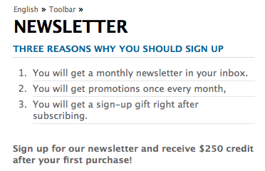

# Een effectieve openingspagina voor nieuwsbrieven maken{#creating-an-effective-newsletter-landing-page}

Met een effectieve bestemmingspagina voor nieuwsbrieven krijgt u zoveel mogelijk personen die zich aanmelden voor uw nieuwsbrief (of andere campagne voor e-mailmarketing). U kunt de informatie die u van uw nieuwsbrief ontvangt gebruiken ondertekent-ups om lood te krijgen.

Als u een effectieve bestemmingspagina voor nieuwsbrieven wilt maken, moet u het volgende doen:

1. Maak een lijst voor de nieuwsbrief zodat mensen zich op de nieuwsbrief kunnen abonneren.
1. Maak het aanmeldingsformulier. Voeg tijdens dit proces een workflowstap toe waarmee de persoon die zich aanmeldt voor de nieuwsbrief automatisch wordt toegevoegd aan de lijst met leads.
1. Maak een bevestigingspagina waarop gebruikers worden bedankt voor hun aanmelding en waarin ze mogelijk een speciale actie kunnen uitvoeren.
1. Voeg theers toe.

>[!NOTE]
>
>Adobe is niet van plan deze mogelijkheid verder te verbeteren (Leads en lijsten beheren).
>Aanbevolen wordt [Adobe Campaign en de integratie in AEM](/help/sites-administering/campaign.md).

## Een lijst maken voor de nieuwsbrief {#creating-a-list-for-the-newsletter}

Een lijst maken, bijvoorbeeld **Geometrixx-nieuwsbrief**, in MCM voor de nieuwsbrief waarop mensen zich moeten abonneren. Lijsten maken wordt beschreven in [Lijsten maken](/help/sites-classic-ui-authoring/classic-personalization-campaigns.md#creatingnewlists).

In het volgende voorbeeld ziet u een voorbeeld van een lijst:

## Een aanmeldingsformulier maken {#create-a-sign-up-form}

Maak een registratieformulier voor nieuwsbrieven waarmee gebruikers zich op tags kunnen abonneren. De voorbeeldwebsite van de Geometrixx bevat een nieuwsbrief op de werkbalk Geometrixx waar u het formulier kunt maken.

Als u uw eigen nieuwsbrief wilt maken, raadpleegt u de informatie over het maken van formulieren in het dialoogvenster [Forms-documentatie](/help/sites-authoring/default-components.md#form). De nieuwsbrief gebruikt de markeringen van de bibliotheek van de Markering. Zie voor meer tags [Tagbeheer](/help/sites-authoring/tags.md#tagadministration).

De verborgen velden in het volgende voorbeeld bieden de minimale hoeveelheid informatie (e-mail). Daarnaast kunt u later meer velden toevoegen, maar dit heeft invloed op de conversiesnelheid.

In het volgende voorbeeld wordt een formulier gemaakt op https://localhost:4502/cf#/content/geometrixx/en/toolbar/newsletter.html.

1. Maak het formulier.

   

1. Klikken **Bewerken** in de component Form om het formulier zo te configureren dat het naar een pagina Bedankt gaat (zie [Dankpagina's maken](#creating-a-thank-you-page)).

   

1. Stel de handeling Formulier in (dat is wat er gebeurt wanneer u het formulier verzendt) en configureer de groep zodanig dat geregistreerde gebruikers worden toegewezen aan de lijst die u eerder hebt gemaakt (bijvoorbeeld geometrixx-nieuwsbrief).

   

### Een pagina voor bedankt maken {#creating-a-thank-you-page}

Wanneer gebruikers op **Nu abonneren**, wilt u automatisch een pagina voor bedankt openen. Maak de pagina Bedankt op de pagina Geometrixx Newsletter. Nadat u het nieuwsbrief formulier hebt gemaakt, bewerkt u de component Formulier en voegt u het pad toe aan de pagina Hartelijk dank.

Als de aanvraag wordt ingediend, gaat de gebruiker naar een **Bedankt** pagina waarna zij een e-mail zullen ontvangen. Deze pagina Bedankt is gemaakt op /content/geometrixx/nl/toolbar/nieuwsbrief/bedankje.

### Teasers toevoegen {#adding-teasers}

Toevoegen [traasers](/help/sites-classic-ui-authoring/classic-personalization-campaigns.md#teasers) specifieke doelgroepen. U kunt bijvoorbeeld tellers toevoegen aan de pagina Vriendelijk bedankt en de pagina Nieuwsbrief.

Tasers toevoegen om een effectieve bestemmingspagina voor nieuwsbrieven te maken:

1. Maak een teasalinea voor een cadeau bij aanmelden. Selecteren **Eerste** als de strategie en met tekst die hen informeert over welk geschenk zij zullen ontvangen.

   

1. Maak een teasalinea voor de pagina Bedankt. Selecteren **Eerste** als de strategie en neem tekst op die aangeeft dat het geschenk onderweg is.

   

1. Maak een campagne met de twee theaters — neem er een aan met zaken en een zonder tags.

### Inhoud naar abonnees push {#pushing-content-to-subscribers}

Breng wijzigingen in pagina's aan via de nieuwsbrief-functionaliteit in de MCM. Vervolgens drukt u op bijgewerkte inhoud naar abonnees.

Zie [Nieuwsbrieven verzenden](/help/sites-classic-ui-authoring/classic-personalization-campaigns.md#newsletters).
