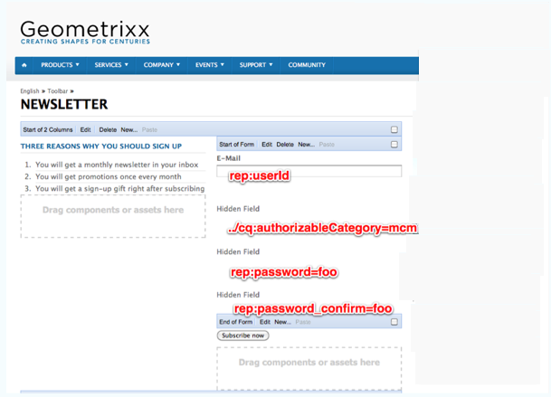

# Een effectieve openingspagina voor nieuwsbrieven maken{#creating-an-effective-newsletter-landing-page}

Met een effectieve bestemmingspagina voor nieuwsbrieven krijgt u zoveel mogelijk personen die zich aanmelden voor uw nieuwsbrief (of andere campagne voor e-mailmarketing). U kunt de informatie die u van uw nieuwsbrief ontvangt gebruiken ondertekent-ups om lood te krijgen.

Als u een effectieve bestemmingspagina voor nieuwsbrieven wilt maken, moet u het volgende doen:

1. Maak een lijst voor de nieuwsbrief zodat mensen zich op de nieuwsbrief kunnen abonneren.
1. Maak het aanmeldingsformulier. Voeg tijdens dit proces een workflowstap toe waarmee de persoon die zich aanmeldt voor de nieuwsbrief automatisch wordt toegevoegd aan de lijst met leads.
1. Maak een bevestigingspagina waarop gebruikers worden bedankt voor hun aanmelding en waarin ze mogelijk een speciale actie kunnen uitvoeren.
1. Voeg theers toe.

>[!NOTE]
>
>Adobe is niet van plan deze functionaliteit verder te verbeteren (Leads en lijsten beheren).
>De aanbeveling is om [Adobe-campagne en de integratie met AEM](/help/sites-administering/campaign.md)te benutten.

## Een lijst maken voor de nieuwsbrief {#creating-a-list-for-the-newsletter}

Maak een lijst, bijvoorbeeld **Geometrixx Newsletter**, in MCM voor de nieuwsbrief waarop mensen zich moeten abonneren. Lijsten maken wordt beschreven in [Lijsten](/help/sites-classic-ui-authoring/classic-personalization-campaigns.md#creatingnewlists)maken.

In het volgende voorbeeld ziet u een voorbeeld van een lijst:

## Een aanmeldingsformulier maken {#create-a-sign-up-form}

Maak een registratieformulier voor nieuwsbrieven waarmee gebruikers zich op tags kunnen abonneren. De voorbeeldwebsite Geometrixx biedt een nieuwsbrief op de werkbalk Geometrixx waarin u het formulier kunt maken.

Zie informatie over het maken van formulieren in de documentatie bij [Formulieren voor informatie over het maken van uw eigen nieuwsbrief](/help/sites-authoring/default-components.md#form). De nieuwsbrief gebruikt de markeringen van de bibliotheek van de Markering. Zie [Tagbeheer](/help/sites-authoring/tags.md#tagadministration)voor meer tags.

De verborgen gebieden in het volgende voorbeeld verstrekken de volledige minimale hoeveelheid informatie (e-mail); bovendien kunt u later meer velden toevoegen, maar dit heeft invloed op de conversiesnelheid.

In het volgende voorbeeld wordt een formulier gemaakt op https://localhost:4502/cf#/content/geometrixx/en/toolbar/newsletter.html.

1. Maak het formulier.

   

1. Klik op **Bewerken** in de component Formulier om het formulier te configureren voor een pagina Bedankt (zie [Dankuwel pagina's](#creating-a-thank-you-page)maken).

   

1. Stel de handeling Formulier in (dat is wat er gebeurt wanneer u het formulier verzendt) en configureer de groep zodanig dat geregistreerde gebruikers worden toegewezen aan de lijst die u eerder hebt gemaakt (bijvoorbeeld geometrixx-nieuwsbrief).

   

### Een pagina voor bedankt maken {#creating-a-thank-you-page}

Wanneer gebruikers op **Nu** abonneren klikken, wordt de pagina Bedankt automatisch geopend. Maak de pagina Bedankt op de pagina Geometrixx Newsletter. Nadat u het nieuwsbrief formulier hebt gemaakt, bewerkt u de component Formulier en voegt u het pad toe aan de pagina Hartelijk dank.

Als u de aanvraag verzendt, gaat de gebruiker naar de pagina **Bedankt** waarna hij of zij een e-mail ontvangt. Deze pagina Bedankt is gemaakt op /content/geometrixx/nl/toolbar/nieuwsbrief/bedankje.

### Teasers toevoegen {#adding-teasers}

Voeg [theaters](/help/sites-classic-ui-authoring/classic-personalization-campaigns.md#teasers) toe aan specifiek publiek. U kunt bijvoorbeeld tellers toevoegen aan de pagina Vriendelijk bedankt en de pagina Nieuwsbrief.

Tasers toevoegen om een effectieve bestemmingspagina voor nieuwsbrieven te maken:

1. Maak een teasalinea voor een cadeau bij aanmelden. Selecteer **Eerste** als strategie en voeg tekst toe die hen informeert welk geschenk zij zullen ontvangen.

   

1. Maak een teasalinea voor de pagina Bedankt. Selecteer **Eerste** als strategie en neem tekst op die aangeeft dat het geschenk onderweg is.

   

1. Maak een campagne met de twee theaters — neem er een aan met zaken en een zonder tags.

### Inhoud naar abonnees push {#pushing-content-to-subscribers}

Breng wijzigingen in pagina's aan via de nieuwsbrief-functionaliteit in de MCM. Vervolgens drukt u op bijgewerkte inhoud naar abonnees.

Zie [Nieuwsbrieven](/help/sites-classic-ui-authoring/classic-personalization-campaigns.md#newsletters)verzenden.
