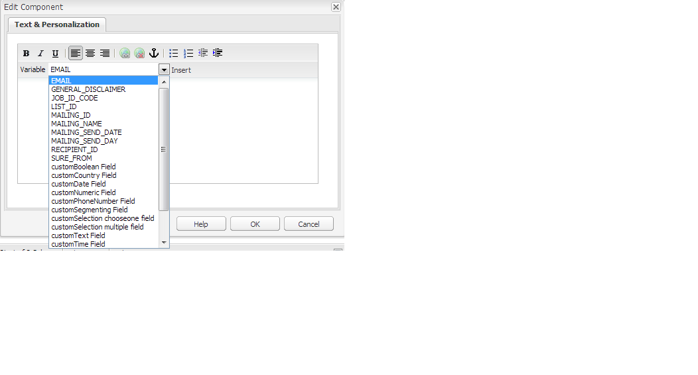

# E-mail naar e-mailserviceproviders publiceren{#publishing-an-email-to-email-service-providers}

U kunt nieuwsbrieven aan de e-maildiensten zoals Ingenieur publiceren ExactTarget en Silverpop. In dit document wordt beschreven hoe u AEM kunt configureren om een nieuwsbrief naar deze e-mailservices te publiceren.

>[!NOTE]
>
>U moet de serviceprovider configureren voordat u een e-mail kunt maken en publiceren. Zie [ExactTarget configureren](/help/sites-administering/exacttarget.md) en [Silverpop-engamage configureren](/help/sites-administering/silverpop.md) voor meer informatie .

Voer de volgende stappen uit om uw e-mail naar het e-mailservicebureau te publiceren:

1. Maak een e-mail.
1. Pas de configuratie van de E-mailservice toe op de e-mail.
1. Publiceer de e-mail.

>[!NOTE]
>
>Als u e-mailproviders bijwerkt, een vliegtest uitvoert of een nieuwsbrief verzendt, mislukken deze bewerkingen als de nieuwsbrief niet eerst naar de instantie Publiceren wordt gepubliceerd of als de instantie Publiceren niet beschikbaar is. Vergeet niet uw nieuwsbrief te publiceren en ervoor te zorgen dat de instantie Publiceren actief is.

## Een e-mail maken {#creating-an-email}

Een e-mail of nieuwsbrief die u aan een e-maildienst wilt publiceren kan onder een campagne worden gecreeerd gebruikend **Geometrixx-nieuwsbrief** sjabloon. U kunt ook de opdracht **E-mailadres Geometrixx Outdoors** sjabloon. Voorbeeld van e-mail/nieuwsbrief op basis van de **E-mailadres Geometrixx Outdoors** sjabloon is beschikbaar op `https://<hostname>:<port>/cf#/content/campaigns/geometrixx-outdoors/e-mails.html`.

Om een e-mail tot stand te brengen die aan de gevormde e-maildienst wordt gepubliceerd:

1. Ga naar **Websites** en vervolgens **Campagnes**. Selecteer een campagne.
1. Klikken **Nieuw** om de **Pagina maken** venster.
1. Voer de titel, naam en selecteer de **Geometrixx-nieuwsbrief** sjabloon uit de lijst met beschikbare sjablonen.
1. Klikken **Maken**.
1. Open het gemaakte e-mailbericht.
1. Schakel over naar de ontwerpmodus om de componenten te selecteren die u wilt weergeven in het hulpgedeelte.
1. Overschakelen naar bewerkingsmodus en beginnen met toevoegen van inhoud (tekst, afbeeldingen, [e-mailgereedschappen](#adding-exacttarget-email-tools-to-your-email), [personalisatievariabelen](#adding-text-and-personalization-tool-to-your-e-mail), enzovoort) aan uw e-mail.

### ExactTarget-e-mailhulpprogramma&#39;s toevoegen aan uw e-mail {#adding-exacttarget-email-tools-to-your-email}

>[!NOTE]
>
>Deze sectie is specifiek voor de dienst ExactTarget.

De **E-mailgereedschappen** voor ExactTarget kan meer e-mailfunctionaliteit toevoegen aan uw e-mail/nieuwsbrief.

1. Open een e-mail die naar ExactTarget moet worden gepubliceerd.
1. De component toevoegen **ET - E-mailgereedschappen** op uw pagina met behulp van het hulpwerktuig. Open de component in de modus Bewerken.

   

1. Selecteer een optie in het menu **Opties** menu:

<table>
 <tbody>
  <tr>
   <td>Fysiek mailadres (vereist)</td>
   <td>Deze component neemt het fysieke postingsadres van uw organisatie in uw e-mail op.</td>
  </tr>
  <tr>
   <td>Profielmidden (vereist)</td>
   <td>Het profielcentrum is een webpagina waar de abonnees de persoonlijke informatie kunnen ingaan en handhaven die u over hen houdt.</td>
  </tr>
  <tr>
   <td>E-mail weergeven als webpagina</td>
   <td>Met deze component kan de gebruiker de e-mail weergeven als een webpagina.</td>
  </tr>
  <tr>
   <td>Privacybeleid</td>
   <td>Deze component voegt de koppeling naar uw privacybeleid in de e-mail in.  </td>
  </tr>
  <tr>
   <td>Abonnementscentrum opzeggen</td>
   <td>Hiermee krijgt de gebruiker de mogelijkheid om zich af te melden bij uw mailinglijst.</td>
  </tr>
  <tr>
   <td>Abonnementencentrum</td>
   <td>Een abonnementscentrum is een webpagina waarop een abonnee de berichten kan beheren die hij of zij van uw organisatie ontvangt.</td>
  </tr>
  <tr>
   <td>E-mailopenen bijhouden</td>
   <td>Een verborgen component waarmee u de functie ExactTarget bijhouden kunt gebruiken.  </td>
  </tr>
 </tbody>
</table>

>[!NOTE]
>
>De **Opties** drop-down menu is slechts bevolkt als de configuratie ExactTarget op e-mail wordt toegepast. Zie [Configuratie van e-mailservice toepassen op e-mailinstellingen](#applying-e-mail-service-configuration-to-e-mail-settings) voor meer informatie .

1. Publiceer de e-mail naar ExactTarget.

   De e-mail met de e-mailhulpprogramma&#39;s is beschikbaar voor gebruik in de geconfigureerde ExactTarget-account.

>[!NOTE]
>
>* De URL&#39;s in de e-mailprogramma&#39;s worden alleen vervangen door de werkelijke waarden (in de ontvangen e-mail) wanneer een e-mailbericht wordt verzonden met **Eenvoudig verzenden** of **Bewerken met instructies** maar niet **Verzenden testen**.
>
>* Twee van de e-mailprogramma&#39;s zijn vereist: **Fysiek mailadres (vereist)** en **Profielmidden (vereist)**. Wanneer e-mail aan ExactTarget wordt gepubliceerd, worden deze twee e-mail-hulpmiddelen toegevoegd aan de bodem van elke post door gebrek.
>

### Tekst en personalisatie toevoegen aan uw e-mail {#adding-text-and-personalization-tool-to-your-e-mail}

U kunt gepersonaliseerde gebieden in een e-mail toevoegen door toe te voegen **Tekst en personalisatie** aan de pagina:

1. Open de e-mail die u naar uw e-mailservice wilt publiceren.
1. Om verpersoonlijkingsgebied van uw e-maildienst toe te laten, voeg de kaderconfiguratie toe terwijl het vormen van de e-maildienst. Zie [Silverpop-engine configureren](/help/sites-administering/silverpop.md) en [Exact doel configureren](/help/sites-administering/exacttarget.md) voor meer informatie .
1. De component toevoegen **Tekst en personalisatie** van het hulpje. Deze component is het deel van nieuwsbrief groep. Open deze component in de bewerkingsmodus.

   

1. Voeg het vereiste gepersonaliseerde gebied aan de tekst toe door het gebied van het drop-down menu te selecteren en te klikken **Invoegen**.
1. Klikken **OK** om te voltooien.

## Configuratie van e-mailservice toepassen op e-mailinstellingen {#applying-e-mail-service-configuration-to-e-mail-settings}

Om uw E-maildienstconfiguratie op een nieuwsbrief toe te passen:

1. Creeer een configuratie van de E-mailDienst.
1. Open uw e-mail/nieuwsbrief.
1. Open de instellingen voor e-mail/nieuwsbrief door op **Instellingen** of door te klikken **Pagina-eigenschappen in** het hulpje.
1. Klikken **Service toevoegen** in **Cloud Servicen** tab. U ziet de lijst met services. Selecteer uw vereiste configuratie - of **ExactTarget** of **Silverpop** - in de lijst in de vervolgkeuzelijst.

   

1. Klikken **OK**.

## E-mails naar e-mailservice publiceren {#publishing-emails-to-email-service}

E-mails/nieuwsbrieven kunnen aan uw E-maildienst worden gepubliceerd door deze stappen te volgen:

1. Open het e-mailbericht.
1. Voordat u een e-mailbericht publiceert, moet u controleren of u de juiste configuratie op uw e-mail hebt toegepast.
1. Klikken **Publiceren**. Hierdoor wordt het **Nieuwsbrief publiceren naar e-mailprovider** venster.
1. Vul de **Naam nieuwsbrief** veld. Het e-mailbericht/de nieuwsbrief wordt gepubliceerd aan E-mail Service Provider met deze naam. Als er geen e-mailnaam wordt opgegeven, wordt de e-mail gepubliceerd met de paginanaam van de nieuwsbrief in AEM.
1. Klikken **Publiceren**.

   

   AEM bevestigt dat u de e-mail kunt weergeven in ExactTarget of Silverpop Engage.

   Als er ExactTarget is, kan de gepubliceerde e-mail zijn weergegeven door op **Gepubliceerde e-mail weergeven**. Dit neemt u rechtstreeks aan de gepubliceerde nieuwsbrief in ExactTarget ([https://members.exacttarget.com/](https://members.exacttarget.com/).).

>[!NOTE]
>
>Als een e-mail/nieuwsbrief met dezelfde naam wordt gepubliceerd als een e-mail/nieuwsbrief die reeds is gepubliceerd, wordt de eerdere e-mail/nieuwsbrief niet vervangen. In plaats daarvan wordt een nieuwe e-mail/nieuwsbrief met dezelfde naam gemaakt (de id&#39;s van twee nieuwsbrieven zijn echter anders).
>
>Als u de e-mail/nieuwsbrief naar de e-mailserviceprovider publiceert, wordt ook de e-mail/nieuwsbrief naar de AEM-publicatie-instantie gepubliceerd.
>

### Een gepubliceerde e-mail bijwerken {#updating-a-published-e-mail}

De **Bijwerken** in het dialoogvenster Publiceren kunt u een nieuwsbrief bijwerken die al is gepubliceerd naar een e-mailserviceprovider. Indien de nieuwsbrief nog niet is gepubliceerd en **Bijwerken** op de knop wordt geklikt, **Nieuwsbrief is niet gepubliceerd** berichtenweergaven.

Een gepubliceerde e-mail bijwerken:

1. Open de e-mail/nieuwsbrief die eerder is gepubliceerd aan een e-mailserviceprovider die u opnieuw wilt publiceren nadat u wijzigingen in de e-mail/nieuwsbrief hebt aangebracht.
1. Klikken **Publiceren**. De **Nieuwsbrief publiceren naar e-mailprovider** wordt weergegeven. Klikken **Bijwerken**.

   Als u wilt controleren of de e-mail/nieuwsbrief is bijgewerkt op ExactTarget, klikt u op **Gepubliceerde e-mail weergeven**. Hiermee gaat u naar de gepubliceerde e-mail in ExactTarget.

   Ga naar de Silverpop Engage-site om te controleren of de e-mail/nieuwsbrief is bijgewerkt via de Silverpop-e-mailservice.
