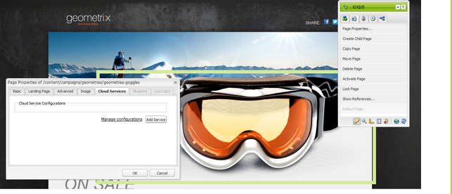

# Abonnementen beheren{#managing-subscriptions}

>[!NOTE]
>
>De Adobe is niet van plan deze mogelijkheid verder te verbeteren (Leads en lijsten beheren).
>De aanbeveling moet [ Adobe Campaign en zijn AEM integratie ](/help/sites-administering/campaign.md) gebruiken.

De gebruikers kunnen worden gevraagd om aan **het posteren lijsten 1&rbrace; van de E-mailDienstverlener {met hulp van de** 3} component in te tekenen van de Vorm &lbrace;die op een AEM Web-pagina wordt gebruikt. **&#x200B;**&#x200B;Als u een AEM pagina met een aanmeldingsformulier wilt voorbereiden voor een abonnement op de mailinglijsten van uw e-mailservice, moet u de bijbehorende serviceconfiguratie toepassen op de AEM pagina die de potentiële abonnee zal bezoeken.

## Configuratie van e-mailservice toepassen op een pagina {#applying-email-service-configuration-to-a-page}

Een AEM pagina configureren:

1. Navigeer aan de **Websites** tabel.
1. Selecteer de pagina die voor de dienst moet worden gevormd. Klik de pagina met de rechtermuisknop aan en selecteer **Eigenschappen**.

1. Selecteer **Cloud Servicen** toen **de Dienst** toevoegen. Selecteer een configuratie in de lijst met beschikbare configuraties.

   

1. Klik **OK**.

## Een aanmeldingsformulier op een AEM pagina maken voor het abonneren of afmelden van lijsten {#creating-a-sign-up-form-on-an-aem-page-for-subscribing-unsubscribing-to-lists}

Een aanmeldingsformulier maken en dit configureren voor abonnementen op de mailinglijsten van de e-mailprovider:

1. Open de AEM pagina die de gebruiker zal bezoeken.
1. Pas de configuratie van de E-mailserviceprovider toe op de pagina.

1. Voeg de component van de a **Vorm** aan de pagina toe door de component van sidekick te slepen. Als de component niet beschikbaar is, schakelaar om wijze te ontwerpen en **Groep van de Vorm** toe te laten.
1. Klik **uitgeven** in het **Begin van de bar van de Vorm** en navigeer aan **Geavanceerd** tabel.
1. In het **drop-down menu van de Vorm**, uitgezochte **E-mailDienst: Creeer Abonnees** en voeg aan lijst toe.
1. Bij de bodem van de dialoogdoos, open de **drop-down Configuratie van de Actie**, die u één of meerdere abonnementslijsten laat selecteren.
1. In de **Uitgezochte lijst**, selecteer de lijst u gebruikers wilt intekenen aan. U kunt veelvoudige lijsten toevoegen door de plus knoop te gebruiken (**voeg Punt** toe).

   

   >[!NOTE]
   >
   >Het dialoogvenster kan afwijken, afhankelijk van het e-mailservicebureau.

1. In het **lusje van de Vorm**, selecteer bedankt u pagina u gebruikers wilt gaan naar nadat zij de vorm (als verlaten leeg, de vorm na voorlegging opnieuw toont.) Klik **OK**. Een **identiteitskaart van de E-mail** component verschijnt in de Vorm, die u een vorm laat tot stand brengen waar de gebruikers hun e-mailadressen kunnen voorleggen om van een het posten lijst in te tekenen of af te melden.
1. Voeg **toe voorlegt** knoopcomponent van de **sectie van de Vorm** in sidekick.

   Het formulier is klaar. Publish de pagina die in de stappen hierboven samen met **wordt gevormd dankt u** pagina aan publiceer instantie. Eventuele abonnees die de pagina bezoeken, kunnen het formulier invullen en zich abonneren op de lijst in de configuratie.

   >[!NOTE]
   >
   >Om de functie van het vormabonnement correct te maken, [ encryptiesleutels van auteur moeten worden uitgevoerd en op publiceer instantie ](#exporting-keys-from-author-and-importing-on-publish) worden ingevoerd.

## Toetsen van auteur exporteren en importeren bij publicatie {#exporting-keys-from-author-and-importing-on-publish}

Als u wilt dat e-mailservices zich abonneren op of zich niet meer abonneren op het publicatieexemplaar, moet u de volgende stappen uitvoeren:

1. Navigeer in de auteurinstantie naar Package Manager.
1. Maak een pakket. Stel het filter in op `/etc/key` .
1. Het pakket maken en downloaden.
1. Navigeer naar Package Manager op de publicatie-instantie en upload dit pakket.
1. Navigeer aan de Publish osgi console en begin de bundel genoemd **Adobe Granite Crypto Steun** opnieuw.

## Gebruikers afmelden voor lijsten {#unsubscribing-users-from-lists}

Gebruikers afmelden bij lijsten:

1. Open de pagina-eigenschappen van de AEM pagina met het aanmeldingsformulier om het abonnement op een lead op te zeggen.
1. Pas de de dienstconfiguratie op de pagina toe.
1. Maak een aanmeldingsformulier op de pagina.
1. Terwijl het vormen van de component, selecteer de actie **E-mailDienst**: **Unsubscribe gebruiker van lijst.**
1. Selecteer in het keuzemenu de lijst waaruit de gebruiker bij het afmelden wordt verwijderd.

   

1. Exporteer de sleutels van de auteur om te publiceren.

## E-mails met automatische beantwoorders configureren voor e-mailservice {#configuring-auto-responder-emails-for-email-service}

Om een auto-antwoordapparaat e-mail voor een abonnee te vormen:

1. Open de pagina-eigenschappen van de AEM pagina die het aanmeldingsformulier hebben om auto responder voor een lead te configureren.
1. Pas de configuratie ExactTarget op de pagina toe.

1. Voeg de component van de a **Vorm** aan de pagina toe door de component van sidekick te slepen. Als de component niet beschikbaar is, schakelaar aan ontwerpwijze en laat de **1&rbrace; groep van de Vorm &lbrace;toe.**
1. Klik **uitgeven** in het **Begin van de bar van de Vorm** en navigeer aan **Geavanceerd** tabel.
1. In het **drop-down menu van de Vorm**, uitgezochte **E-mailDienst: verzend auto antwoordapparaat e-mail.**
1. **selecteer een e-mail** (dit is de post die als auto-antwoordapparaat e-mail wordt verzonden).

1. **Uitgezochte Classificatie** (deze classificatie wordt gebruikt om e-mail te verzenden).
1. Selecteer **Dank u** pagina (de pagina waar de gebruikers aan worden geleid zodra zij de vorm voorleggen).

   In het **lusje van de Vorm**, selecteer bedankt u pagina u gebruikers wilt gaan naar nadat zij de vorm voorleggen. (Als het formulier leeg blijft, wordt het opnieuw weergegeven bij verzending.) Klik **OK**.

1. Exporteer de sleutels van de auteur om te publiceren.
1. Voeg **toe voorlegt** knoopcomponent van de **sectie van de Vorm** in sidekick.

   Het aanmeldingsformulier is klaar. Publish de pagina die in de stappen hierboven samen met **wordt gevormd dankt u** pagina aan publiceer instantie. Eventuele abonnees die de pagina bezoeken, kunnen het formulier invullen en bij het verzenden van het formulier ontvangt de bezoeker een e-mail met de automatische beantwoorder op de in het formulier ingevulde e-mail.

   >[!NOTE]
   >
   >Om de correcte toepassing van het sign-up formulierabonnement te maken, [ encryptiesleutels van auteur moeten worden uitgevoerd en op publiceer instantie ](#exporting-keys-from-author-and-importing-on-publish) worden ingevoerd.

   
