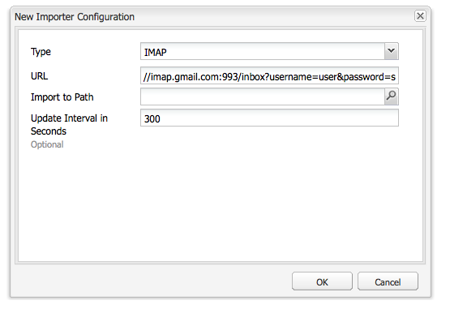

# Onbetaalde e-mails bijhouden{#tracking-bounced-emails}

>[!NOTE]
>
>De Adobe is niet van plan om het bijhouden van geopende/aangekondigde e-mails die door AEM SMTP-service worden verzonden, verder te verbeteren.
>
>De aanbeveling is: [Adobe Campaign gebruiken en de integratie AEM](/help/sites-administering/campaign.md).

Wanneer u een nieuwsbrief naar veel gebruikers verzendt, bevat de lijst meestal enkele ongeldige e-mailadressen. Het verzenden van nieuwsbrieven naar die adressen stuitert terug. AEM kan die grenzen beheren en kan ophouden verzendend nieuwsbrieven naar die adressen te verzenden nadat de gevormde stuiterteller wordt overschreden. Door gebrek, wordt het stuiterende tarief geplaatst aan 3 maar configureerbaar.

Als u AEM wilt instellen om teruggestuurde e-mails bij te houden, stelt u AEM in om een bestaande postbus te opiniepeilen waar teruggestuurde e-mails worden ontvangen. Meestal is deze locatie het e-mailadres &#39;van&#39; dat u opgeeft waar u de nieuwsbrief verzendt. AEM opiniepeilt dit postvak en importeert alle e-mailberichten onder het pad dat in de stemconfiguratie is opgegeven. Een werkschema wordt dan teweeggebracht om naar de verstopte e-mailadressen binnen de gebruikers te zoeken en bijwerkt de bounceCounter bezitswaarde van de gebruiker dienovereenkomstig bij. Nadat de gevormde maximumgrenzen worden overschreden, wordt de gebruiker verwijderd uit de nieuwsbrief lijst.

## De importmodule voor diervoeders configureren {#configuring-the-feed-importer}

Met de importfunctie kunt u herhaaldelijk inhoud uit externe bronnen importeren in uw opslagplaats. Met deze configuratie van de voederimporteur, AEM controleert de brievenbus van de afzender op bekende e-mails.

Ga als volgt te werk om de importmodule voor teruggestuurde e-mailberichten te configureren:

1. In **Gereedschappen** selecteert u de importmodule voor diervoeders.

1. Klikken **Toevoegen** om een configuratie te maken.

   

1. Voeg een configuratie toe door het type te selecteren en informatie toe te voegen aan opiniepeiling URL zodat kunt u de gastheer en de haven vormen. Bovendien voeg sommige post en protocol-specifieke parameters aan de vraag URL toe. Stel de configuratie in op minstens eenmaal per dag.

   Alle configuraties hebben informatie nodig over het volgende in de opiniepeiling-URL:

   `username`: De gebruikersnaam die wordt gebruikt voor het verbinden

   `password`: Het wachtwoord waarmee verbinding wordt gemaakt

   Afhankelijk van het protocol kunt u bovendien bepaalde instellingen configureren.

   **POP3-configuratie-eigenschappen:**

   `pop3.leave.on.server`: Definieert of berichten op de server moeten worden achtergelaten. Ingesteld op true om berichten op de server te laten, anders false. Heeft als standaardwaarde true.

   **POP3-voorbeelden:**

   | pop3s://pop.gmail.com:995/INBOX?username=user&amp;password=secret | Pop3 via SSL gebruiken om verbinding te maken met GMail op poort 995 met gebruiker/geheim, zodat berichten standaard op de server blijven staan |
   |---|---|
   | pop3s://pop.gmail.com:995/INBOX?username=user&amp;password=secret&amp;pop3.leave.on.server=false | pop3s://pop.gmail.com:995/INBOX?username=user&amp;password=secret&amp;pop3.leave.on.server=false |

   **IMAP-configuratie-eigenschappen:**

   Hiermee kunt u markeringen instellen waarnaar u wilt zoeken.

   `imap.flag.SEEN`:Stel false in voor nieuwe/onzichtbare berichten, true voor al-gelezen berichten

   Zie [https://javaee.github.io/javamail/docs/api/index.html?javax/mail/Flags.Flag.html](https://javaee.github.io/javamail/docs/api/index.html?javax/mail/Flags.Flag.html) voor de volledige lijst van vlaggen.

   **IMAP-voorbeelden:**

   | imaps://imap.gmail.com:993/inbox?username=user&amp;password=secret | Het gebruiken van IMAP over SSL om met GMail op haven 993 met gebruiker/geheim te verbinden. Nieuwe berichten alleen standaard ophalen. |
   |---|---|
   | imaps://imap.gmail.com:993/inbox?username=user&amp;password=secret&amp;imap.flag.SEEN=true | Het gebruiken van IMAP over SSL om met GMail 93 met gebruiker/geheim te verbinden, slechts het krijgen van reeds gezien bericht. |
   | imaps://imap.gmail.com:993/inbox?username=user&amp;password=secret&amp;imap.flag.SEEN=true&amp;imap.flag.SEEN=false | Het gebruiken van IMAP over SSL om met GMail 93 met gebruiker/geheim te verbinden, die reeds wordt gelezen OF nieuwe berichten. |

1. Sla de configuratie op.

## De service-component voor nieuwsbrieven configureren {#configuring-the-newsletter-service-component}

Na het vormen van de voederimporteur, vorm Van adres en de stuiterteller.

Om de nieuwsbrief dienst te vormen:

1. In de OSGi-console, op `<host>:<port>/system/console/configMgr`, navigeer naar **MCM-nieuwsbrief**.

1. Configureer de service en sla de wijzigingen op wanneer u klaar bent.

   

   De volgende configuraties kunnen worden ingesteld om het gedrag aan te passen:

   | Maximum voor stuitteller (max.bounce.count) | Hiermee definieert u het aantal instanties totdat een gebruiker wordt weggelaten bij het verzenden van een nieuwsbrief. Als u deze waarde instelt op 0, wordt de stuiteringscontrole volledig uitgeschakeld. |
   |---|---|
   | Activiteit geen Geheime voorgeheugen (sent.activity.nocache) | Definieert de cache-instelling die moet worden gebruikt voor de verzonden activiteit van de nieuwsbrief |

   Zodra bewaard, doet de nieuwsbriefMCM dienst het volgende:

   * Schrijft een activiteit aan de gebruikers verborgen stroom na het succesvol verzenden van een nieuwsbrief.
   * Schrijft een activiteit als een stuit wordt ontdekt en de gebruikers stuiteren tegenveranderingen.
