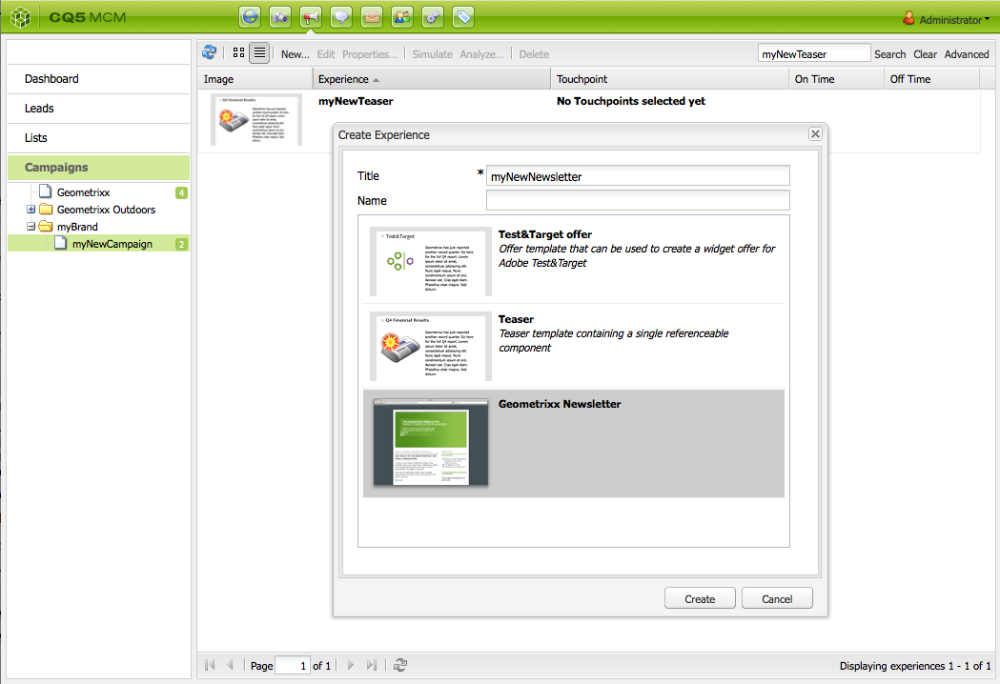

# E-mailmarketing{#e-mail-marketing}

>[!NOTE]
>
>De Adobe is niet van plan het e-mailvolgen van open/grenzen (niet leverbaar) verder te verbeteren die door AEM dienst SMTP worden verzonden.
>De aanbeveling moet [&#x200B; Adobe Campaign en de integratie aan AEM &#x200B;](/help/sites-administering/campaign.md) gebruiken.

E-mailmarketing (bijvoorbeeld nieuwsbrieven) is een belangrijk onderdeel van elke marketingcampagne die u gebruikt om inhoud naar uw leads te sturen. In AEM kunt u nieuwsbrieven maken op basis van bestaande AEM inhoud en nieuwe inhoud toevoegen die specifiek is voor de nieuwsbrieven.

Nadat u de nieuwsbrieven hebt gemaakt, kunt u deze direct of op een ander gepland tijdstip naar de specifieke groep gebruikers sturen (via een workflow). Bovendien kunnen gebruikers zich abonneren op nieuwsbrieven in de door hen gekozen indeling.

Daarnaast kunt AEM u de functionaliteit voor nieuwsbrieven beheren, waaronder het onderhouden van onderwerpen, het archiveren van nieuwsbrieven en het weergeven van nieuwsbrieven.

>[!NOTE]
>
>In Geometrixx wordt de e-maileditor automatisch geopend in de sjabloon voor nieuwsbrieven. U kunt de e-maileditor in andere sjablonen gebruiken die u e-mailberichten wilt verzenden, bijvoorbeeld in uitnodigingen. De e-mailredacteursvertoningen wanneer een pagina van **mcm/componenten/nieuwsbrief/pagina** wordt geërft.

In dit document worden de basisbeginselen van het maken van nieuwsbrieven in AEM beschreven. Raadpleeg de volgende documenten voor gedetailleerde informatie over het werken met e-mailmarketing:

* [Een effectieve openingspagina voor nieuwsbrieven maken](/help/sites-classic-ui-authoring/classic-personalization-campaigns-email-landingpage.md)
* [Abonnementen beheren](/help/sites-classic-ui-authoring/classic-personalization-campaigns-email-subscriptions.md)
* [E-mail naar e-mailserviceproviders publiceren](/help/sites-classic-ui-authoring/classic-personalization-campaigns-email-newsletters.md)
* [Onbetaalde e-mails bijhouden](/help/sites-classic-ui-authoring/classic-personalization-campaigns-email-tracking-bounces.md)

>[!NOTE]
>
>Als u e-mailproviders bijwerkt, een vliegtest uitvoert of een nieuwsbrief verzendt, mislukken deze bewerkingen als de nieuwsbrief niet eerst naar de Publish-instantie wordt gepubliceerd of als de Publish-instantie niet beschikbaar is. Publiceer uw nieuwsbrief en zorg ervoor dat het Publish-exemplaar actief is.

## Een nieuwsbrief maken {#creating-a-newsletter-experience}

>[!NOTE]
>
>E-mailmeldingen moeten via de osgi-configuratie worden geconfigureerd. Zie [&#x200B; het Vormen E-mailBericht.](/help/sites-administering/notification.md)

1. Selecteer uw nieuwe campagne in de linkerruit, of klik het in de juiste ruit tweemaal.

1. Selecteer de lijstweergave met het pictogram:

   

1. Klik **Nieuw..**

   U kunt de **Titel** specificeren, **Naam** en type van ervaring dat moet worden gecreeerd; in dit geval, Newsletter.

   

1. Klik **creëren**.

1. Er wordt direct een nieuw dialoogvenster geopend. Hier kunt u eigenschappen voor de nieuwsbrief ingaan.

   De **StandaardLijst van Ontvangers** is een verplicht gebied aangezien dit touchpoint voor nieuwsbrief vormt (zie [&#x200B; Werkend met Lijsten &#x200B;](/help/sites-classic-ui-authoring/classic-personalization-campaigns.md#workingwithlists) voor meer informatie over lijsten).

   

   * **van Naam**
Naam die als afzender van nieuwsbrief zou moeten verschijnen.

   * **van Adres**
E-mailadres dat moet worden weergegeven als de afzender van de nieuwsbrief.

   * **Onderwerp**
Onderwerp van de nieuwsbrief.

   * **Antwoord aan**
E-mailadres dat antwoorden op verzonden nieuwsbrief moet adresseren.

   * **Beschrijving**
Beschrijving van de nieuwsbrief.

   * **op Tijd**
De tijd waarop de nieuwsbrief moet worden verzonden.

   * **Standaard Ontvangers Lijst**
Standaardlijst die de nieuwsbrief moet ontvangen.

   Deze kunnen in een recentere fase van de **Eigenschappen worden bijgewerkt..** dialoog.

1. Klik **O.K.** om te bewaren.

## Inhoud toevoegen aan nieuwsbrieven {#adding-content-to-newsletters}

U kunt inhoud, inclusief dynamische inhoud, op dezelfde manier aan uw nieuwsbrief toevoegen als in elke AEM. In Geometrixx, heeft het malplaatje van de Nieuwsbrief bepaalde componenten beschikbaar voor het toevoegen van en het wijzigen van inhoud in nieuwsbrieven.

1. In MCM, klik de **Campagnes** tabel en klik nieuwsbrief tweemaal u inhoud aan wilt toevoegen of uitgeven. De nieuwsbrief wordt geopend.

1. Als componenten niet zichtbaar zijn, ga naar de mening van het Ontwerp en laat de noodzakelijke componenten (bijvoorbeeld, de componenten van de Nieuwsbrief) toe alvorens u begint uit te geven.
1. Voer eventueel nieuwe tekst, afbeeldingen of andere componenten in. In het voorbeeld Geometrixx zijn vier componenten beschikbaar: Tekst, Afbeelding, Kop en 2 kolommen. Uw nieuwsbrief kan meer of minder componenten hebben afhankelijk van hoe u het opstelling.

   >[!NOTE]
   >
   >U kunt nieuwsbrieven personaliseren door variabelen te gebruiken. In de nieuwsbrief van de Geometrixx zijn de variabelen beschikbaar in de component van de Tekst. Waarden voor de variabelen worden overgenomen van de gegevens in het gebruikersprofiel.

   

1. Om variabelen op te nemen, selecteer de variabele van de lijst en klik **Tussenvoegsel**. Variabelen worden gevuld vanuit het profiel.

## Nieuwsbrieven aanpassen {#personalizing-newsletters}

U kunt nieuwsbrieven personaliseren door vooraf bepaalde variabelen in de component van de Tekst van nieuwsbrieven in Geometrixx op te nemen. Waarden voor de variabelen worden overgenomen van de gegevens in het gebruikersprofiel.

U kunt ook simuleren hoe een nieuwsbrief wordt gepersonaliseerd door de clientcontext te gebruiken en een profiel te laden.

Een nieuwsbrief personaliseren en simuleren hoe het eruit zal zien:

1. Open vanuit de MCM de nieuwsbrief waarvoor u instellingen wilt aanpassen.

1. Open de tekstcomponent die u wilt aanpassen.

1. Plaats de curseur waar u de variabele wilt verschijnen en een variabele van de drop-down lijst selecteren en **Tussenvoegsel** klikken. Doe dit voor zo vele variabelen zoals vereist en klik **O.K.**.

   

1. Om te simuleren hoe de variabele wanneer verzonden zal kijken, druk CTRL+ALT+c om de cliëntcontext te openen en **Lading** te selecteren. Selecteer de gebruiker van de lijst waarvan profiel u zou willen laden en **O.K.** klikken.

   De gegevens uit het profiel dat u hebt geladen, bevatten de variabelen.

   

## Nieuwsbrieven testen in verschillende e-mailclients {#testing-newsletters-in-different-e-mail-clients}

>[!NOTE]
>
>Alvorens nieuwsbrieven te verzenden, controleer de configuratie OSGi voor de Verbinding van de Dag CQ Externalzer bij `https://localhost:4502/system/console/configMgr`.
>
>Standaard is de waarde van de parameter `localhost:4502` en kan de bewerking niet worden voltooid als de poort voor de actieve instantie wordt gewijzigd.

Schakel tussen algemene e-mailclients om te zien hoe uw nieuwsbrief eruit ziet voor uw leads. Standaard wordt uw nieuwsbrief geopend zonder dat een e-mailclient is geselecteerd.

Momenteel kunt u nieuwsbrieven in de volgende e-mailcliënten bekijken:

* Yahoo-mail
* Gmail
* Hotmail
* Thundervogel
* Microsoft Outlook 2007
* Apple Mail

Als u wilt schakelen tussen clients, klikt u op het bijbehorende pictogram om de nieuwsbrief in die e-mailclient weer te geven:

1. Open vanuit de MCM de nieuwsbrief waarvoor u instellingen wilt aanpassen.

1. Klik op een e-mailclient in de bovenste balk om te zien hoe de nieuwsbrief er in die client uitziet.

   

1. Herhaal deze stap voor alle andere e-mailclients die u wilt zien.

   

## Newsletter-instellingen aanpassen {#customizing-newsletter-settings}

Hoewel alleen geautoriseerde gebruikers een nieuwsbrief kunnen verzenden, dient u het volgende aan te passen:

* De onderwerpregel, zodat gebruikers uw e-mail willen openen en er ook voor zorgen dat uw nieuwsbrief niet als spam wordt gemarkeerd.
* Het adres Van, bijvoorbeeld, `noreply@geometrixx.com`, zodat de gebruikers e-mail van een gespecificeerd adres ontvangen.

Nieuwsbrieven aanpassen:

1. Open vanuit de MCM de nieuwsbrief waarvoor u instellingen wilt aanpassen.

   

1. Bij de bovenkant van nieuwsbrief, klik **Montages**.

   
1. Ga **van** e-mailadres in

1. Wijzig het **Onderwerp** van e-mail, indien nodig.

1. Selecteer a **StandaardLijst van Ontvangers** van de drop-down lijst.

1. Klik **OK**.

   Wanneer u de nieuwsbrief test of verzendt, zullen de ontvangers e-mail met het gespecificeerde e-mailadres en onderwerp ontvangen.

## Nieuwsbrieven voor vliegtests {#flight-testing-newsletters}

Hoewel het testen van de vlucht niet verplicht is, kunt u het best testen voordat u een nieuwsbrief verstuurt om er zeker van te zijn dat het lijkt zoals u wilt.

Bij het testen van de vlucht kunt u het volgende doen:

* Bekijk nieuwsbrief in [&#x200B; alle voorgenomen cliënten &#x200B;](#testing-newsletters-in-different-e-mail-clients).
* Controleer of de mailserver op de juiste wijze is ingesteld.
* Bepaal of je e-mail wordt gemarkeerd als spam. (Zorg ervoor dat u uzelf opneemt in de lijst met ontvangers.)

>[!NOTE]
>
>Als u e-mailproviders bijwerkt, een vliegtest uitvoert of een nieuwsbrief verzendt, mislukken deze bewerkingen als de nieuwsbrief niet eerst naar de Publish-instantie wordt gepubliceerd of als de Publish-instantie niet beschikbaar is. Publiceer uw nieuwsbrief en zorg ervoor dat het Publish-exemplaar actief is.

Voor nieuwsbrieven voor vliegproeven:

1. Open vanuit de MCM de nieuwsbrief die u wilt testen en verzenden.

1. Bij de bovenkant van nieuwsbrief, klik **Test** om te testen alvorens te verzenden.

    te testen

1. Ga het teste-mailadres in waar u verzonden nieuwsbrief wilt en **klikken verzendt**. Als u het profiel wilt wijzigen, laadt u een ander profiel in de clientcontext. U doet dit door op CTRL+ALT+c te drukken en een profiel laden en laden te selecteren.

## Nieuwsbrieven verzenden {#sending-newsletters}

>[!NOTE]
>
>De Adobe is niet van plan het e-mailvolgen van open/grenzen (niet leverbaar) verder te verbeteren die door AEM dienst SMTP worden verzonden.
>De aanbeveling moet [&#x200B; Adobe Campaign en de integratie aan AEM &#x200B;](/help/sites-administering/campaign.md) gebruiken.

U kunt een nieuwsbrief vanuit de nieuwsbrief of de lijst verzenden. Beide procedures worden beschreven.

>[!NOTE]
>
>Alvorens nieuwsbrieven te verzenden, controleer de configuratie OSGi voor de Verbinding van de Dag CQ Externalzer bij `https://localhost:4502/system/console/configMgr`.
>
>Standaard is de waarde van de parameter `localhost:4502` en kan de bewerking niet worden voltooid als de poort voor de actieve instantie wordt gewijzigd.

>[!NOTE]
>
>Als u e-mailproviders bijwerkt, een vliegtest uitvoert of een nieuwsbrief verzendt, mislukken deze bewerkingen als de nieuwsbrief niet eerst naar de Publish-instantie wordt gepubliceerd of als de Publish-instantie niet beschikbaar is. Publiceer uw nieuwsbrief en zorg ervoor dat het Publish-exemplaar actief is.

### Nieuwsbrieven verzenden vanuit een campagne {#sending-newsletters-from-a-campaign}

Een nieuwsbrief sturen vanuit de campagne:

1. Open vanuit de MCM de nieuwsbrief die u wilt verzenden.

   >[!NOTE]
   >
   >Alvorens uit te verzenden, zorg ervoor u het onderwerp van uw nieuwsbrief en voortkomend e-mailadres door [&#x200B; hebt aangepast zijn montages &#x200B;](#customizing-newsletter-settings) aangepast.
   >
   >
   >[&#x200B; het testen van de Vlucht &#x200B;](#flight-testing-newsletters) nieuwsbrief alvorens wordt het verzenden geadviseerd.

1. Bij de bovenkant van nieuwsbrief, verzendt de klik **&#x200B;**. De wizard Nieuwsbrief wordt geopend.

1. In de lijst van de ontvanger, selecteer de lijst u nieuwsbrief wilt ontvangen en **daarna** klikken.

   

1. De installatie is voltooid. Klik **verzenden** om nieuwsbrief eigenlijk te verzenden.

   

   >[!NOTE]
   >
   >Zorg ervoor dat u een van de ontvangers bent, zodat u zeker weet dat de nieuwsbrief is ontvangen.

### Nieuwsbrieven verzenden vanuit een lijst {#sending-newsletters-from-a-list}

Een nieuwsbrief verzenden vanuit een lijst:

1. In MCM, klik **Lijsten** in de linkerhand ruit.

   >[!NOTE]
   >
   >Alvorens uit te verzenden, zorg ervoor u het onderwerp van uw nieuwsbrief en voortkomend e-mailadres door [&#x200B; hebt aangepast zijn montages &#x200B;](#customizing-newsletter-settings) aangepast. U kunt geen nieuwsbrief testen als u het van de lijst verzendt; u kunt [&#x200B; vluchttest &#x200B;](#flight-testing-newsletters) het als u het van nieuwsbrief verzendt.

1. Schakel het selectievakje in naast de lijst met leads waarnaar u een nieuwsbrief wilt verzenden.

1. In het **menu van Hulpmiddelen**, uitgezochte **verzendt Newsletter**. Het **verzendt het venster van de Nieuwsbrief** opent.

   

1. Op het **gebied van het Bulletin**, selecteer nieuwsbrief u **daarna** wilt verzenden en klikken.

   

1. De installatie is voltooid. Klik **verzenden** om de geselecteerde nieuwsbrief naar de gespecificeerde lijst van lood te verzenden.

   

   Uw nieuwsbrief wordt verzonden naar de geselecteerde ontvangers.

## Abonneren op een nieuwsbrief {#subscribing-to-a-newsletter}

In deze sectie wordt beschreven hoe u zich op een nieuwsbrief kunt abonneren.

### Abonneren op een nieuwsbrief {#subscribing-to-a-newsletter-1}

Abonneren op een nieuwsbrief (de website van de Geometrixx als voorbeeld gebruiken):

1. Klik **Websites** en navigeer aan de Geometrixx **Toolbar** en open het.

   

1. Op het Bulletin van de Geometrixx **Teken omhoog** gebied, ga uw e-mailadres in en klik **Teken omhoog**. U bent nu geabonneerd op de nieuwsbrief.
