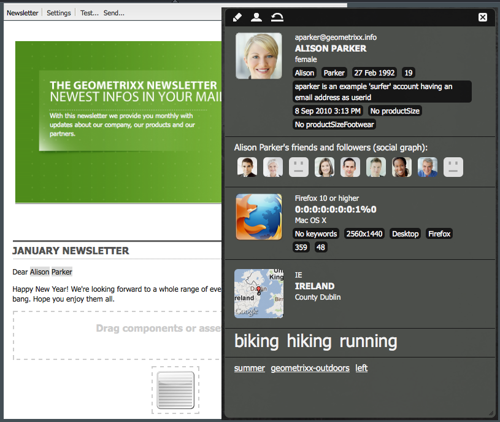

# E-mailmarketing{#e-mail-marketing}

>[!NOTE]
>
>Adobe is niet van plan het bijhouden van e-mailberichten over open en onbestelbare (niet te leveren) verzendingen door de AEM SMTP-service verder te verbeteren.
>De aanbeveling is om Adobe Campaign en de integratie met AEM [te](/help/sites-administering/campaign.md)benutten.

E-mailmarketing (bijvoorbeeld nieuwsbrieven) is een belangrijk onderdeel van elke marketingcampagne die u gebruikt om inhoud naar uw leads te sturen. In AEM kunt u nieuwsbrieven maken van bestaande AEM-inhoud en nieuwe inhoud toevoegen die specifiek is voor de nieuwsbrieven.

Nadat u de nieuwsbrieven hebt gemaakt, kunt u deze direct of op een ander gepland tijdstip naar de specifieke groep gebruikers sturen (via een workflow). Bovendien kunnen gebruikers zich abonneren op nieuwsbrieven in de door hen gekozen indeling.

Daarnaast kunt u met AEM de functionaliteit voor nieuwsbrieven beheren, waaronder het onderhouden van onderwerpen, het archiveren van nieuwsbrieven en het weergeven van nieuwsbrieven.

>[!NOTE]
>
>In Geometrixx wordt de e-maileditor automatisch geopend in de sjabloon voor nieuwsbrieven. U kunt de e-maileditor in andere sjablonen gebruiken die u e-mailberichten wilt verzenden, bijvoorbeeld in uitnodigingen. De e-maileditor geeft altijd weer wanneer een pagina wordt overgenomen van **mcm/componenten/nieuwsbrief/pagina**.

In dit document worden de basisbeginselen van het maken van nieuwsbrieven in AEM beschreven. Raadpleeg de volgende documenten voor gedetailleerde informatie over het werken met e-mailmarketing:

* [Een effectieve openingspagina voor nieuwsbrieven maken](/help/sites-classic-ui-authoring/classic-personalization-campaigns-email-landingpage.md)
* [Abonnementen beheren](/help/sites-classic-ui-authoring/classic-personalization-campaigns-email-subscriptions.md)
* [E-mail naar e-mailserviceproviders publiceren](/help/sites-classic-ui-authoring/classic-personalization-campaigns-email-newsletters.md)
* [Onbetaalde e-mails bijhouden](/help/sites-classic-ui-authoring/classic-personalization-campaigns-email-tracking-bounces.md)

>[!NOTE]
>
>Als u e-mailproviders bijwerkt, een vliegtest uitvoert of een nieuwsbrief verzendt, mislukken deze bewerkingen als de nieuwsbrief niet eerst naar de instantie Publiceren wordt gepubliceerd of als de instantie Publiceren niet beschikbaar is. Vergeet niet uw nieuwsbrief te publiceren en ervoor te zorgen dat de instantie Publiceren actief is.

## Een nieuwsbrief maken {#creating-a-newsletter-experience}

>[!NOTE]
>
>E-mailmeldingen moeten via de osgi-configuratie worden geconfigureerd. Zie E-mailmelding [configureren.](/help/sites-administering/notification.md)

1. Selecteer uw nieuwe campagne in de linkerruit, of klik het in de juiste ruit tweemaal.

1. Selecteer de lijstweergave met het pictogram:

   

1. Klik op **Nieuw...**

   U kunt de **titel**, de **naam** en het type ervaring opgeven dat moet worden gemaakt; in dit geval, Newsletter.

   

1. Klik op **Maken**.

1. Er wordt onmiddellijk een nieuw dialoogvenster geopend. Hier kunt u eigenschappen voor de nieuwsbrief ingaan.

   De **lijst** Standaardontvangers is een verplicht veld omdat dit het aanraakpunt voor de nieuwsbrief vormt (zie [Werken met lijsten](/help/sites-classic-ui-authoring/classic-personalization-campaigns.md#workingwithlists) voor meer informatie over lijsten).

   

   * **Van Naam** die als afzender van nieuwsbrief zou moeten verschijnen.

   * **Van het adres van de** Post van het Adres dat als afzender van nieuwsbrief zou moeten verschijnen.

   * **Onderwerp** van de nieuwsbrief.

   * **Reageren op** e-mailadres dat antwoorden voor verzonden nieuwsbrief zou moeten richten.

   * **Beschrijving** van de nieuwsbrief.

   * **On Time** The on time for sending the newsletter.

   * **De standaard Ontvangers van de Lijst** Gebrek lijst die nieuwsbrief zou moeten ontvangen.
   **Deze kunnen in een later stadium van de** Eigenschappen worden bijgewerkt... .

1. Klik op **OK** om op te slaan.

## Inhoud toevoegen aan nieuwsbrieven {#adding-content-to-newsletters}

U kunt inhoud, inclusief dynamische inhoud, op dezelfde manier aan uw nieuwsbrief toevoegen als in een willekeurige AEM-component. In Geometrixx, heeft het malplaatje van de Nieuwsbrief bepaalde componenten beschikbaar voor het toevoegen van en het wijzigen van inhoud in nieuwsbrieven.

1. Klik in de MCM op het tabblad **Campagnes** en dubbelklik op de nieuwsbrief waaraan u inhoud wilt toevoegen of bewerken. De nieuwsbrief wordt geopend.

1. Als componenten niet zichtbaar zijn, ga naar de mening van het Ontwerp en laat de noodzakelijke componenten (bijvoorbeeld, de componenten van de Nieuwsbrief) toe alvorens u begint uit te geven.
1. Voer eventueel nieuwe tekst, afbeeldingen of andere componenten in. In het voorbeeld Geometrixx zijn vier componenten beschikbaar: Tekst, Afbeelding, Kop en 2 kolommen. Uw nieuwsbrief kan meer of minder componenten hebben afhankelijk van hoe u het opstelling.

   >[!NOTE]
   >
   >U kunt nieuwsbrieven personaliseren door variabelen te gebruiken. In de nieuwsbrief van Geometrixx, zijn de variabelen beschikbaar in de component van de Tekst. Waarden voor de variabelen worden overgenomen van de gegevens in het gebruikersprofiel.

   

1. Als u variabelen wilt invoegen, selecteert u de variabele in de lijst en klikt u op **Invoegen**. Variabelen worden gevuld vanuit het profiel.

## Nieuwsbrieven aanpassen {#personalizing-newsletters}

U kunt nieuwsbrieven personaliseren door vooraf bepaalde variabelen in de component van de Tekst van nieuwsbrieven in Geometrixx op te nemen. Waarden voor de variabelen worden overgenomen van de gegevens in het gebruikersprofiel.

U kunt ook simuleren hoe een nieuwsbrief wordt gepersonaliseerd door de clientcontext te gebruiken en een profiel te laden.

Een nieuwsbrief personaliseren en simuleren hoe het eruit zal zien:

1. Open vanuit de MCM de nieuwsbrief waarvoor u instellingen wilt aanpassen.

1. Open de tekstcomponent die u wilt aanpassen.

1. Plaats de cursor op de gewenste plaats voor de variabele en selecteer een variabele in de vervolgkeuzelijst en klik op **Invoegen**. Doe dit voor zoveel variabelen als nodig is en klik op **OK**.

   

1. Als u wilt simuleren hoe de variabele eruitziet wanneer deze wordt verzonden, drukt u op CTRL+ALT+c om de clientcontext te openen en selecteert u **Laden**. Selecteer de gebruiker in de lijst waarvan u het profiel wilt laden en klik op **OK**.

   De gegevens uit het profiel dat u hebt geladen, bevatten de variabelen.

   

## Nieuwsbrieven testen in verschillende e-mailclients {#testing-newsletters-in-different-e-mail-clients}

>[!NOTE]
>
>Alvorens nieuwsbrieven te verzenden, controleer de configuratie OSGi voor Dag CQ Verbinding uiterlijk op `https://localhost:4502/system/console/configMgr`.
>
>Standaard is de waarde van de parameter `localhost:4502` en kan de bewerking niet worden voltooid als de poort voor de actieve instantie wordt gewijzigd.

Schakel tussen algemene e-mailclients om te zien hoe uw nieuwsbrief eruit ziet voor uw leads. Standaard wordt uw nieuwsbrief geopend zonder dat een e-mailclient is geselecteerd.

Momenteel kunt u nieuwsbrieven in de volgende e-mailcliënten bekijken:

* Yahoo-mail
* Gmail
* Hotmail
* Thundervogel
* Microsoft Outlook 2007
* Apple Mail

Als u wilt schakelen tussen clients, klikt u op het bijbehorende pictogram om de nieuwsbrief in die e-mailclient weer te geven:

1. Open vanuit de MCM de nieuwsbrief waarvoor u instellingen wilt aanpassen.

1. Klik op een e-mailclient in de bovenste balk om te zien hoe de nieuwsbrief er in die client uitziet.

   

1. Herhaal deze stap voor alle andere e-mailclients die u wilt zien.

   

## Newsletter-instellingen aanpassen {#customizing-newsletter-settings}

Hoewel alleen geautoriseerde gebruikers een nieuwsbrief kunnen verzenden, dient u het volgende aan te passen:

* De onderwerpregel, zodat gebruikers uw e-mail willen openen en er ook voor zorgen dat uw nieuwsbrief niet als spam wordt gemarkeerd.
* Het adres Van, bijvoorbeeld noreply@geometrixx.com, zodat de gebruikers e-mail van een gespecificeerd adres ontvangen.

De nieuwsbrief-instellingen aanpassen:

1. Open vanuit de MCM de nieuwsbrief waarvoor u instellingen wilt aanpassen.

   

1. Klik boven aan de nieuwsbrief op **Instellingen**.

   
1. Voer het **Van** e-mailadres in

1. Wijzig indien nodig het **onderwerp** van de e-mail.

1. Selecteer een **lijst** met standaardontvangers in de vervolgkeuzelijst.

1. Click **OK**.

   Wanneer u de nieuwsbrief test of verzendt, zullen de ontvangers e-mail met het gespecificeerde e-mailadres en onderwerp ontvangen.

## Nieuwsbrieven voor vliegtests {#flight-testing-newsletters}

Hoewel het testen van de vlucht niet verplicht is, kunt u het best testen voordat u een nieuwsbrief verstuurt om er zeker van te zijn dat het lijkt zoals u wilt.

Bij het testen van de vlucht kunt u het volgende doen:

* Kijk naar de nieuwsbrief in [alle beoogde klanten](#testing-newsletters-in-different-e-mail-clients).
* Controleer of de mailserver juist is ingesteld.
* Bepaal of je e-mail wordt gemarkeerd als spam. (Zorg ervoor dat u uzelf opneemt in de lijst met ontvangers.)

>[!NOTE]
>
>Als u e-mailproviders bijwerkt, een vliegtest uitvoert of een nieuwsbrief verzendt, mislukken deze bewerkingen als de nieuwsbrief niet eerst naar de instantie Publiceren wordt gepubliceerd of als de instantie Publiceren niet beschikbaar is. Vergeet niet uw nieuwsbrief te publiceren en ervoor te zorgen dat de instantie Publiceren actief is.

Voor nieuwsbrieven voor vliegproeven:

1. Open vanuit de MCM de nieuwsbrief die u wilt testen en verzenden.

1. Klik boven aan de nieuwsbrief op **Testen** om te testen voordat u de nieuwsbrief verzendt.

   

1. Voer het teste-mailadres in waarnaar u de nieuwsbrief wilt verzenden en klik op **Verzenden**. Als u het profiel wilt wijzigen, laadt u een ander profiel in de clientcontext. U doet dit door op CTRL+ALT+c te drukken en een profiel laden en laden te selecteren.

## Nieuwsbrieven verzenden {#sending-newsletters}

>[!NOTE]
>
>Adobe is niet van plan het bijhouden van e-mailberichten over open en onbestelbare (niet te leveren) verzendingen door de AEM SMTP-service verder te verbeteren.
>De aanbeveling is om Adobe Campaign en de integratie met AEM [te](/help/sites-administering/campaign.md)benutten.

U kunt een nieuwsbrief vanuit de nieuwsbrief of de lijst verzenden. Beide procedures worden beschreven.

>[!NOTE]
>
>Alvorens nieuwsbrieven te verzenden, controleer de configuratie OSGi voor Dag CQ Verbinding uiterlijk op `https://localhost:4502/system/console/configMgr`.
>
>Standaard is de waarde van de parameter `localhost:4502` en kan de bewerking niet worden voltooid als de poort voor de actieve instantie wordt gewijzigd.

>[!NOTE]
>
>Als u e-mailproviders bijwerkt, een vliegtest uitvoert of een nieuwsbrief verzendt, mislukken deze bewerkingen als de nieuwsbrief niet eerst naar de instantie Publiceren wordt gepubliceerd of als de instantie Publiceren niet beschikbaar is. Vergeet niet uw nieuwsbrief te publiceren en ervoor te zorgen dat de instantie Publiceren actief is.

### Nieuwsbrieven verzenden vanuit een campagne {#sending-newsletters-from-a-campaign}

Een nieuwsbrief sturen vanuit de campagne:

1. Open vanuit de MCM de nieuwsbrief die u wilt verzenden.

   >[!NOTE]
   >
   >Voordat u een nieuwsbrief verzendt, moet u het onderwerp en het e-mailadres van de nieuwsbrief aanpassen door de instellingen [ervan](#customizing-newsletter-settings)aan te passen.
   >
   >
   >[Het wordt aanbevolen de nieuwsbrief vóór verzending te testen](#flight-testing-newsletters) .

1. Klik boven aan de nieuwsbrief op **Verzenden**. De wizard Nieuwsbrief wordt geopend.

1. Selecteer in de lijst met ontvangers de lijst waarop u de nieuwsbrief wilt ontvangen en klik op **Volgende**.

   

1. De installatie is voltooid. Klik op **Verzenden** om de nieuwsbrief daadwerkelijk te verzenden.

   

   >[!NOTE]
   >
   >Zorg ervoor dat u een van de ontvangers bent, zodat u zeker weet dat de nieuwsbrief is ontvangen.

### Nieuwsbrieven verzenden vanuit een lijst {#sending-newsletters-from-a-list}

Een nieuwsbrief verzenden vanuit een lijst:

1. Klik in MCM op **Lijsten** in het linkerdeelvenster.

   >[!NOTE]
   >
   >Voordat u een nieuwsbrief verzendt, moet u het onderwerp en het e-mailadres van de nieuwsbrief aanpassen door de instellingen [ervan](#customizing-newsletter-settings)aan te passen. U kunt een nieuwsbrief niet testen als u het van de lijst verzendt; u kunt de [vlucht testen](#flight-testing-newsletters) als u het van de nieuwsbrief verzendt.

1. Schakel het selectievakje in naast de lijst met leads waarnaar u een nieuwsbrief wilt verzenden.

1. Selecteer in het menu **Gereedschappen** de optie **Nieuwsbrief** verzenden. Het venster **Send Newsletter** wordt geopend.

   

1. Selecteer in het veld **Nieuwsbrief** de nieuwsbrief die u wilt verzenden en klik op **Volgende**.

   

1. De installatie is voltooid. Klik op **Verzenden** om de geselecteerde nieuwsbrief naar de opgegeven lijst met leads te sturen.

   

   Uw nieuwsbrief wordt verzonden naar de geselecteerde ontvangers.

## Abonneren op een nieuwsbrief {#subscribing-to-a-newsletter}

In deze sectie wordt beschreven hoe u zich op een nieuwsbrief kunt abonneren.

### Abonneren op een nieuwsbrief {#subscribing-to-a-newsletter-1}

Een abonnement nemen op een nieuwsbrief (met de Geometrixx-website als voorbeeld):

1. Klik op **Websites** en navigeer naar de **werkbalk** Geometrixx en open deze.

   

1. Voer in het veld **Aanmelden bij** Geometrixx Newsletter uw e-mailadres in en klik op **Aanmelden**. U bent nu geabonneerd op de nieuwsbrief.
