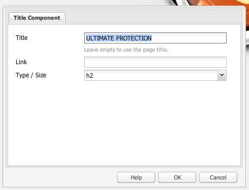
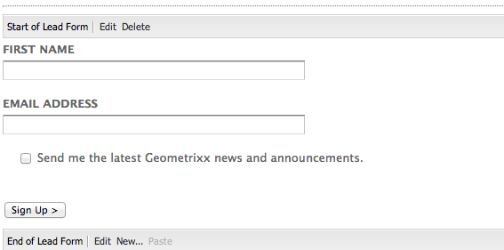
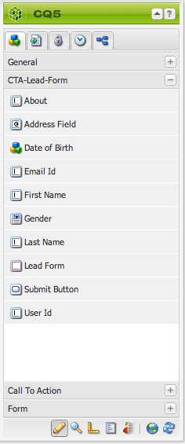
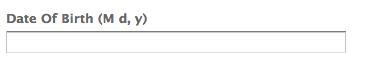
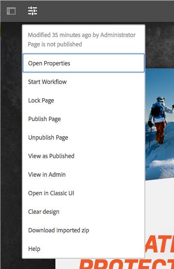

# Openingspagina&#39;s{#landing-pages}

Met de functie voor het plaatsen van pagina&#39;s kunt u snel en eenvoudig een ontwerp en inhoud rechtstreeks in een AEM pagina importeren. Een webontwikkelaar kan de HTML en aanvullende elementen voorbereiden die als een volledige pagina of slechts een deel van een pagina kunnen worden geïmporteerd. De functionaliteit is handig om bestemmingspagina&#39;s voor marketingdoeleinden te maken die slechts gedurende een beperkte tijd actief zijn en snel moeten worden gemaakt.

Deze pagina beschrijft het volgende:

* welke landingspagina&#39;s er uitzien in AEM met beschikbare onderdelen
* hoe u een openingspagina maakt en hoe u een ontwerppakket importeert
* hoe te met het landen van pagina&#39;s in AEM werken
* mobiele bestemmingspagina&#39;s instellen

De voorbereiding van het ontwerppakket voor het importeren wordt behandeld in [Het uitbreiden van en het Vormen van de Importeur van het Ontwerp](/help/sites-administering/extending-the-design-importer-for-landingpages.md). Integratie met Adobe Analytics valt onder [Landingpagina&#39;s integreren met Adobe Analytics.](/help/sites-administering/integrating-landing-pages-with-adobe-analytics.md)

>[!CAUTION]
>
>De ontwerpimportmodule die wordt gebruikt voor het importeren van bestemmingspagina&#39;s, [is vervangen door AEM 6.5](/help/release-notes/deprecated-removed-features.md#deprecated-features).

>[!CAUTION]
>
>Omdat de functie voor het importeren van ontwerpen toegang vereist tot `/apps`, werkt het niet in omgevingen met geïncludeerde wolken waarin `/apps` is onveranderlijk.

## Wat zijn bestemmingspagina&#39;s? {#what-are-landing-pages}

Landingspagina&#39;s zijn sites met één of meerdere pagina&#39;s die het &#39;eindpunt&#39; zijn van een marketingstrategie, bijvoorbeeld met e-mail, adwords/banners, sociale media. Een landingspagina kan verschillende doelen dienen, maar heeft allemaal één ding gemeen: de bezoeker moet een taak uitvoeren en dat bepaalt het succes van een landingspagina.

Met de functie Landing Pages in AEM kunnen marketers samenwerken met webontwerpers bij agentschappen of interne creatieve teams om paginaontwerpen te maken die gemakkelijk kunnen worden geïmporteerd in AEM en nog steeds bewerkbaar zijn door de marketers en die worden gepubliceerd onder hetzelfde bestuur als de rest van de AEM sites.

In AEM maakt u bestemmingspagina&#39;s door de volgende stappen uit te voeren:

1. Maak een pagina in AEM die het canvas van de bestemmingspagina&#39;s bevat. AEM schepen met een steekproef genoemd **Pagina importeren**.

1. [Bereid de HTML en activa voor.](/help/sites-administering/extending-the-design-importer-for-landingpages.md)
1. Verpak de middelen in een dossier van het PIT dat hier als het Pakket van het Ontwerp wordt bedoeld.
1. Importeer het ontwerppakket op de pagina Importeren.
1. Wijzig en publiceer de pagina.

### Openingspagina&#39;s bureaublad {#desktop-landing-pages}

Een voorbeeldlandingspagina in AEM ziet er als volgt uit:

### Mobiele bestemmingspagina&#39;s {#mobile-landing-pages}

Een openingspagina kan ook een mobiele versie van de pagina hebben. Voor een aparte mobiele versie van de bestemmingspagina moet het importontwerp twee HTML-bestanden hebben: *index.htm(l)* en *mobile.index.htm(l)*.

De invoerprocedure voor de landingspagina is dezelfde als die van een normale openingspagina. Het ontwerp van de bestemmingspagina heeft een extra HTML-bestand dat overeenkomt met de bestemmingspagina. Dit HTML-bestand moet ook een canvas hebben `div` with `id=cqcanvas` Net als de openingspagina van het bureaublad (html) en ondersteunt het alle bewerkbare onderdelen die worden beschreven voor de openingspagina van het bureaublad.

De mobiele openingspagina wordt gemaakt als een onderliggende pagina van de openingspagina van het bureaublad. Navigeer naar de openingspagina in Websites en open de onderliggende pagina om deze te openen.

>[!NOTE]
>
>De landingspagina voor mobiele apparaten wordt samen met de bestemmingspagina verwijderd of gedeactiveerd als de bestemmingspagina van het bureaublad wordt verwijderd of gedeactiveerd.

## Onderdelen van bestemmingspagina {#landing-page-components}

Als u delen van de HTML die worden geïmporteerd, bewerkbaar wilt maken binnen AEM, kunt u inhoud binnen de HTML van de bestemmingspagina&#39;s rechtstreeks toewijzen aan AEM componenten. De ontwerpimporteur begrijpt standaard de volgende componenten:

* Tekst, voor alle tekst
* Titel, voor inhoud in H1-6-tags
* Afbeelding, voor afbeeldingen die uitwisselbaar moeten worden gemaakt
* Oproep aan acties:

   * Koppeling doorklikken
   * Grafische koppeling

* CTA leiden-Vorm, om gebruikersinformatie te vangen
* Het Systeem van de paragraaf (Parsys), om het even welke component toe te staan om worden toegevoegd, of de bovengenoemde component om te zetten

Bovendien is het mogelijk om dit uit te breiden en douanecomponenten te steunen. In deze sectie worden de componenten gedetailleerd beschreven.

### Tekst {#text}

Met de component Text kunt u een tekstblok invoeren met een WYSIWYG-editor. Zie [Tekstcomponent](/help/sites-authoring/default-components.md#text) voor meer informatie .

Hieronder ziet u een voorbeeld van een tekstcomponent op een bestemmingspagina:

#### Titel {#title}

Met de titelcomponent kunt u een titel weergeven en de grootte configureren (h1-6). Zie [Titelcomponent](/help/sites-authoring/default-components.md#title) voor meer informatie .

Hieronder ziet u een voorbeeld van een titelcomponent op een landingspagina:

#### Afbeelding {#image}

De afbeeldingscomponent toont een afbeelding die u kunt slepen en neerzetten vanuit de Inhoudszoeker of waarop u kunt klikken om te uploaden. Zie [afbeeldingscomponent](/help/sites-authoring/default-components.md) voor meer informatie .

Hieronder ziet u een voorbeeld van een afbeeldingscomponent op een landingspagina:

#### Oproep tot actie (CTA) {#call-to-action-cta}

Een landingspagina-ontwerp kan verscheidene verbindingen hebben - sommige kunnen als &quot;Vraag aan actie&quot;worden bedoeld.

De oproep tot actie (CTA) wordt gebruikt om de bezoeker te krijgen onmiddellijk actie op de landende pagina zoals &quot;nu Abonneren,&quot;Bekijk deze video,&quot;Beperkte Tijd slechts&quot;, etc.

* Klik via koppeling - Hiermee kunt u een tekstkoppeling toevoegen waarmee de bezoeker naar een doel-URL gaat wanneer erop wordt geklikt.
* Grafische koppeling - Hiermee kunt u een afbeelding toevoegen die de bezoeker na het klikken naar een doel-URL stuurt.

Beide componenten CTA hebben gelijkaardige opties. De optie Doorklikken via koppeling heeft extra tekstopties. De componenten worden in de volgende alinea&#39;s uitgebreid beschreven.

#### Klikken door koppeling {#click-through-link}

Deze component CTA kan worden gebruikt om een tekstverbinding op de het landen pagina toe te voegen. Op die koppeling kan worden geklikt om de gebruiker naar de doel-URL te brengen die in de componenteigenschappen is opgegeven. Het maakt deel uit van de &quot;Vraag aan Actie&quot;groep.

**Label** De tekst die gebruikers zien. U kunt opmaak wijzigen met de RTF-editor.

**Doel-URL** Voer de URI in die gebruikers moeten bezoeken als ze op de tekst klikken.

**Renderopties** Beschrijft renderopties. U kunt een van de volgende opties selecteren:

* Pagina laden in een nieuw browservenster
* Pagina in huidig venster laden
* Pagina in het bovenliggende frame laden
* Alle frames annuleren en pagina in volledig browservenster laden

**CSS** Voer op het tabblad Stijl een pad naar de CSS-stijlpagina in.

**ID** Voer op het tabblad Stijl een id in waarmee de component deze op unieke wijze kan identificeren.

Hieronder ziet u een voorbeeld van een klik door een koppeling:

#### Grafische koppeling {#graphical-link}

Deze component CTA kan worden gebruikt om het even welk grafisch beeld met verbinding op de het landen pagina toe te voegen. De afbeelding kan een eenvoudige knop zijn of een grafische afbeelding als achtergrond. Wanneer op de afbeelding wordt geklikt, gaat de gebruiker naar de doel-URL die in de componenteigenschappen is opgegeven. Het maakt deel uit van de **Oproep tot actie** groep.

**Label** De tekst die gebruikers zien in de afbeelding. U kunt opmaak wijzigen met de RTF-editor.

**Doel-URL** Voer de URI in die gebruikers moeten bezoeken als ze op de afbeelding klikken.

**Renderopties** Beschrijft renderopties. U kunt een van de volgende opties selecteren:

* Pagina laden in een nieuw browservenster
* Pagina in huidig venster laden
* Pagina in het bovenliggende frame laden
* Alle frames annuleren en pagina in volledig browservenster laden

**CSS** Voer op het tabblad Stijl een pad naar de CSS-stijlpagina in.

**ID** Voer op het tabblad Stijl een id in waarmee de component deze op unieke wijze kan identificeren.

Hier volgt een voorbeeld van een grafische koppeling:

### Oproep tot actie (CTA) Lead Form {#call-to-action-cta-lead-form}

Een formulier voor leads is een formulier dat wordt gebruikt om de profielgegevens van een bezoeker/lead te verzamelen. Deze informatie kan later worden opgeslagen en gebruikt om een efficiënte marketing te doen die op de informatie wordt gebaseerd. Deze informatie omvat gewoonlijk titel, naam, e-mail, geboortedatum, adres, rente, enzovoort. Het maakt deel uit van de **Formulier voor CTA-lead** groep.

Een voorbeeld van een CTA-loodformulier ziet er als volgt uit:

CTA-loodformulieren worden samengesteld uit verschillende onderdelen:

* **Voorloopformulier**
De voorbeeldcomponent definieert het begin en einde van een nieuw formulier voor leads op een pagina. Andere componenten kunnen vervolgens tussen deze elementen worden geplaatst, zoals E-mailadres, Voornaam, enzovoort.

* **Formuliervelden en -elementen**
Formuliervelden en -elementen kunnen tekstvakken, keuzerondjes, afbeeldingen enzovoort bevatten. De gebruiker voert vaak een handeling uit in een formulierveld, zoals het typen van tekst. Zie de afzonderlijke formulierelementen voor meer informatie.

* **Profielcomponenten**
Profielcomponenten hebben betrekking op bezoekersprofielen die worden gebruikt voor sociale samenwerking en andere gebieden waar personalisatie van bezoekers vereist is.

In het voorgaande voorbeeld wordt een voorbeeldformulier weergegeven dat bestaat uit de **Voorloopformulier** component (begin en einde), met **Voornaam** en **E-mailadres** velden die worden gebruikt voor invoer en **Verzenden** field

Van sidekick, zijn de volgende componenten beschikbaar voor de CTA Lood Vorm:

#### Algemene instellingen voor veel onderdelen van formulieren voor lead {#settings-common-to-many-lead-form-components}

Hoewel elk van de componenten van het hoofdformulier een ander doel heeft, bestaan veel van deze componenten uit vergelijkbare opties en parameters.

Wanneer u een van de formuliercomponenten configureert, zijn de volgende tabbladen beschikbaar in het dialoogvenster:

* **Titel en tekst**
Hier moet u de basisinformatie opgeven, zoals de titel van de component en eventuele bijbehorende tekst. U kunt zo nodig ook andere belangrijke informatie definiëren, zoals of het veld meerdere selecties kan bevatten en of items kunnen worden geselecteerd.

* **Beginwaarden**
Hier geeft u een standaardwaarde op.

* **Restricties**
Hier kunt u opgeven of een veld verplicht is en plaatsbeperkingen in dat veld gelden (moet bijvoorbeeld numeriek zijn, enzovoort).

* **Stijlen**
Hiermee geeft u de grootte en opmaak van de velden aan.

>[!NOTE]
>
>Welke velden u ziet, is afhankelijk van de afzonderlijke component.
>
>Niet alle opties zijn beschikbaar voor alle onderdelen van het loodformulier. Zie Forms voor meer informatie hierover [algemene instellingen](/help/sites-authoring/default-components.md#formsgroup).

#### Voorloopformuliercomponenten {#lead-form-components}

De volgende sectie beschrijft de componenten beschikbaar aan vraag-aan-actie leiden vormen.

**Info** Hiermee kunnen gebruikers informatie over het programma toevoegen.

**Adresveld** Hiermee kunnen gebruikers adresgegevens invoeren. Wanneer u deze component configureert, moet u de elementnaam in het dialoogvenster invoeren. De elementnaam is de naam van het formulierelement. Dit geeft aan waar in de gegevensopslagruimte de gegevens worden opgeslagen.

**Geboortedatum** Gebruikers kunnen geboortedatum invoeren.

**E-mailadres** Hiermee kunnen gebruikers een e-mailadres (identificatie) invoeren.

**Voornaam** Biedt een veld waarin gebruikers hun voornaam kunnen invoeren.

**Geslacht** Gebruikers kunnen hun geslacht selecteren in een vervolgkeuzelijst.

**Achternaam** Gebruikers kunnen informatie over achternaam invoeren.

**Voorloopformulier** Voeg deze component toe om een loodformulier toe te voegen aan de bestemmingspagina. Een lead-formulier bevat automatisch het veld Start of Lead Form en End of Lead Form. Hierna voegt u de in deze sectie beschreven componenten Formulier lead toe.

De component Formulier lead definieert zowel het begin als het einde van een formulier met de component **Begin formulier** en **Einde formulier** elementen. Deze worden altijd gekoppeld om ervoor te zorgen dat het formulier correct is gedefinieerd.

Nadat u het voorbeeldformulier hebt toegevoegd, kunt u het begin of einde van het formulier configureren door op **Bewerken** in de desbetreffende balk.

**Begin van Lead-formulier**

Er zijn twee tabbladen beschikbaar voor de configuratie **Formulier** en **Geavanceerd**:

**Dankbriefje** De pagina waarnaar wordt verwezen om bezoekers te bedanken voor hun invoer. Als het formulier leeg blijft, wordt het na verzending opnieuw weergegeven.

**Workflow starten** Hiermee bepaalt u welke workflow wordt geactiveerd wanneer een hoofdformulier wordt verzonden.

**Post-opties** De volgende postopties zijn beschikbaar:

* Lead maken
* E-mailservice: Maak een abonnee en voeg deze toe aan de lijst - Gebruik deze functie als u een e-mailserviceprovider gebruikt, zoals ExactTarget.
* E-mailservice: verzend e-mail met automatische beantwoording - Gebruik deze als u een e-mailserviceprovider gebruikt, zoals ExactTarget.
* E-mailservice: gebruikers afmelden bij lijst - Gebruik deze optie als u een e-mailserviceprovider gebruikt, zoals ExactTarget.
* Abonnement op gebruiker opzeggen

**Formulierid** De formulier-id vormt een unieke identificatie van het hoofdformulier. Gebruik de formulier-id als u meerdere formulieren op één pagina hebt. Zorg ervoor dat deze verschillende id&#39;s hebben.

**Pad laden** Is het pad naar knoopeigenschappen die worden gebruikt om vooraf gedefinieerde waarden te laden in de hoofdformuliervelden.

Dit is een optioneel veld dat het pad naar een knooppunt in de repository aangeeft. Als dit knooppunt eigenschappen heeft die overeenkomen met de veldnamen, worden de desbetreffende velden op het formulier vooraf geladen met de waarde van die eigenschappen. Als er geen overeenkomst bestaat, bevat het veld de standaardwaarde.

**Clientvalidatie** Hiermee wordt aangegeven of clientvalidatie is vereist voor dit formulier (servervalidatie vindt altijd plaats). Dit kan in combinatie met de Forms Captcha-component worden bereikt.

**Brontype voor validatie** Hiermee definieert u het type resource voor formuliervalidatie als u het volledige hoofdformulier wilt valideren (in plaats van afzonderlijke velden).

Als u het volledige formulier valideert, voert u ook een van de volgende handelingen uit:

* Een script voor clientvalidatie:
  ` /apps/<myApp>/form/<myValidation>/formclientvalidation.jsp`

* Een script voor validatie aan de serverzijde:
  ` /apps/<myApp>/form/<myValidation>/formservervalidation.jsp`

**Configuratie van handelingen** Afhankelijk van de selectie in Post Options, verandert de Configuratie van de Actie. Als u bijvoorbeeld Lead maken selecteert, kunt u instellen aan welke lijst de lead wordt toegevoegd.

* **Verzendknop tonen**
Geeft aan of een knop Verzenden moet worden weergegeven.

* **Naam verzenden**
Een id als u meerdere verzendknoppen in een formulier gebruikt.

* **Titel verzenden**
De naam die op de knop wordt weergegeven, zoals Verzenden of Verzenden.

* **Knop Herstellen tonen**
Schakel het selectievakje in om de knop Herstellen zichtbaar te maken.

* **Titel opnieuw instellen**
De naam die wordt weergegeven op de knop Herstellen.

* **Beschrijving**
Informatie die onder de knop wordt weergegeven.

## Een bestemmingspagina maken {#creating-a-landing-page}

Wanneer u een landingspagina maakt, moet u drie stappen uitvoeren:

1. Maak een importerpagina.
1. [Bereid de HTML voor het invoeren voor.](/help/sites-administering/extending-the-design-importer-for-landingpages.md)
1. Importeer het ontwerppakket.

### Gebruik van de ontwerpimportmodule {#use-of-the-design-importer}

Omdat bij het importeren van pagina&#39;s de HTML, verificatie en het testen van de pagina&#39;s moet worden voorbereid, is het importeren van bestemmingspagina&#39;s een beheertaak. Als beheerder hebben de gebruikers die de importbewerking uitvoeren, lees-, schrijf-, maak- en verwijdermachtigingen voor `/apps`. Als de gebruiker niet over deze machtigingen beschikt, mislukt het importeren.

>[!NOTE]
>
>Omdat de ontwerpimportmodule bedoeld is als een beheerprogramma waarvoor lees-, schrijf-, maak- en verwijdermachtigingen vereist zijn op `/apps`, beveelt de Adobe het gebruik van de importeur van het model in productie niet aan.

Adobe raadt aan de importer van het ontwerp op een testinstantie te gebruiken. Op een testinstantie kan de import worden getest en gevalideerd door een ontwikkelaar die vervolgens verantwoordelijk is voor het implementeren van de code in de productieinstantie.

### Een importpagina maken {#creating-an-importer-page}

Voordat u het ontwerp van de bestemmingspagina kunt importeren, moet u bijvoorbeeld een importerpagina maken in het kader van een campagne. Met de sjabloon Pagina importeren kunt u de volledige HTML-landingspagina importeren. De pagina bevat een neerzetvak waarin het ontwerppakket van de bestemmingspagina kan worden geïmporteerd door slepen en neerzetten te gebruiken.

>[!NOTE]
>
>Standaard kan een pagina Importer alleen worden gemaakt via campagnes, maar u kunt deze sjabloon ook bedekken om een bestemmingspagina te maken onder `/content/mysite`.

Een openingspagina maken:

1. Ga naar de **Websites** console.
1. Selecteer de campagne in het linkerdeelvenster.
1. Klikken **Nieuw** om de **Pagina maken** venster.
1. Selecteer de **Pagina importeren** sjabloon en voeg desgewenst een titel en een naam toe en klik op **Maken**.

   

   De nieuwe importpagina wordt weergegeven.

### De HTML voorbereiden voor importeren {#preparing-the-html-for-import}

Voordat u het ontwerppakket importeert, moet de HTML worden voorbereid. Zie [De ontwerpimport uitbreiden en configureren](/help/sites-administering/extending-the-design-importer-for-landingpages.md) voor meer informatie .

### Het ontwerppakket importeren {#importing-the-design-package}

Nadat een importerpagina is gemaakt, kunt u een ontwerppakket op deze pagina importeren. Details over het maken van het ontwerppakket en de aanbevolen structuur worden uitgelegd in [De ontwerpimport uitbreiden en configureren](/help/sites-administering/extending-the-design-importer-for-landingpages.md).

Ervan uitgaande dat u het ontwerppakket klaar hebt, wordt in de volgende stappen beschreven hoe u het ontwerppakket op een importerpagina kunt importeren.

1. De importerpagina die u opent [eerder gemaakt](#creatingablankcanvaspage).

   

1. Sleep het ontwerppakket naar de dropbox. De pijl verandert van richting wanneer een pakket eroverheen wordt gesleept.
1. Als gevolg van slepen en neerzetten wordt de openingspagina weergegeven in plaats van de pagina Importer. De openingspagina van de HTML is geïmporteerd.

   

>[!NOTE]
>
>Tijdens het importeren wordt de markering om veiligheidsredenen ontsmet en om het importeren en publiceren van ongeldige opmaak te voorkomen. Dit veronderstelt HTML-slechts prijsverhoging en alle andere vorm van elementen zoals gealigneerde SVG of de Componenten van het Web zullen uit worden gefiltreerd.

>[!NOTE]
>
>Als u problemen ondervindt met het importeren van het ontwerppakket, raadpleegt u [Problemen oplossen](/help/sites-administering/extending-the-design-importer-for-landingpages.md#troubleshooting).

## Werken met bestemmingspagina&#39;s {#working-with-landing-pages}

Het ontwerp en de elementen voor een bestemmingspagina worden gewoonlijk gecreeerd door een ontwerper misschien bij een agentschap in hulpmiddelen die zij aan zoals Adobe Photoshop of Adobe Dreamweaver worden gebruikt. Wanneer het ontwerp is voltooid, stuurt de ontwerper een zip-bestand met alle elementen naar marketing. De contactpersoon bij marketing is dan verantwoordelijk voor het neerzetten van het ZIP-bestand in AEM en het publiceren van de inhoud.

Bovendien kan de ontwerper wijzigingen in de het landen pagina moeten aanbrengen nadat het door inhoud uit te geven of te schrappen en de vraag-aan-actie componenten te vormen wordt ingevoerd. Ten slotte wil de marketeer de bestemmingspagina voorvertonen en vervolgens de campagne activeren om ervoor te zorgen dat de bestemmingspagina wordt gepubliceerd.

In deze sectie wordt beschreven hoe u het volgende kunt doen:

* Een openingspagina verwijderen
* Download het ontwerppakket
* Informatie over importeren weergeven
* Een openingspagina opnieuw instellen
* [Vorm de componenten CTA en voeg inhoud aan de pagina toe](#call-to-action-cta)
* Voorvertoning van de openingspagina weergeven
* Een openingspagina activeren/publiceren

Wanneer u het ontwerppakket importeert, **Ontwerp wissen** en **Geïmporteerde postcode downloaden** zijn beschikbaar in het instellingenmenu van de pagina:

### Het geïmporteerde ontwerppakket downloaden {#downloading-the-imported-design-package}

Door het ZIP-bestand te downloaden, kunt u opnemen welk ZIP-bestand met een bepaalde bestemmingspagina is geïmporteerd. Wijzigingen die worden aangebracht op een pagina, worden niet toegevoegd aan het postvak.

Klik op **Postcode downloaden** op de werkbalk Landingspagina.

### Informatie over importeren weergeven {#viewing-import-information}

U kunt op elk gewenst moment informatie over de laatste importbewerking weergeven door op het blauwe uitroepteken boven aan de bestemmingspagina in de klassieke gebruikersinterface te klikken.

Als het geïmporteerde ontwerppakket enkele problemen heeft, bijvoorbeeld als het verwijst naar afbeeldingen/scripts die niet in het pakket voorkomen, enzovoort, geeft de ontwerpimportmodule deze problemen weer in de vorm van een lijst. Als u de lijst met problemen wilt weergeven, klikt u in de klassieke gebruikersinterface op de koppeling voor problemen op de werkbalk Openingspagina. Klik in de volgende afbeelding op **Problemen** Hiermee opent u het venster Problemen importeren.

### Een openingspagina opnieuw instellen {#resetting-a-landing-page}

Als u het ontwerppakket van de bestemmingspagina opnieuw wilt importeren nadat u er enkele wijzigingen in hebt aangebracht, kunt u de openingspagina &quot;wissen&quot; door op **Wissen** boven aan de openingspagina in de klassieke gebruikersinterface of klik op Wissen in het instellingenmenu in de gebruikersinterface met geoptimaliseerde aanrakingen. Hiermee verwijdert u de geïmporteerde bestemmingspagina en maakt u een lege importpagina.

Tijdens het wissen van de openingspagina kunt u de wijzigingen in de inhoud verwijderen. Als u op **Nee**, blijven de wijzigingen in de inhoud behouden, dat wil zeggen de structuur onder `jcr:content/importer`blijft behouden en worden alleen de component importerpagina en de bronnen in `etc/design` worden verwijderd. Als u op **Ja** de `jcr:content/importer` wordt ook verwijderd.

>[!NOTE]
>
>Als u besluit om de inhoudswijzigingen te verwijderen, gaan alle wijzigingen die u hebt aangebracht op de geïmporteerde bestemmingspagina en alle pagina-eigenschappen verloren wanneer u op **Wissen**.

### Componenten wijzigen en toevoegen op een bestemmingspagina {#modifying-and-adding-components-on-a-landing-page}

Als u componenten op de openingspagina wilt wijzigen, dubbelklikt u erop om ze te openen en te bewerken zoals u dat met andere componenten doet.

Als u componenten aan de bestemmingspagina wilt toevoegen, sleept u componenten naar de bestemmingspagina (van het hulpapparaat in de klassieke gebruikersinterface of vanuit het deelvenster Componenten in de gebruikersinterface met geoptimaliseerde aanrakingen) en bewerkt u de onderdelen naar wens.

>[!NOTE]
>
>Als een component op de landingspagina niet kan worden bewerkt, moet u het ZIP-bestand opnieuw importeren na [het HTML-bestand wijzigen.](/help/sites-administering/extending-the-design-importer-for-landingpages.md) Dit betekent dat de niet-bewerkbare onderdelen tijdens het importeren niet zijn omgezet in AEM componenten.

### Een openingspagina verwijderen {#deleting-a-landing-page}

Het verwijderen van een openingspagina is vergelijkbaar met het verwijderen van een normale AEM.

De enige uitzondering is dat wanneer u een bestemmingspagina verwijdert, deze ook de bijbehorende bestemmingspagina voor mobiele apparaten verwijdert (indien aanwezig), maar niet omgekeerd.

### Een openingspagina publiceren {#publishing-a-landing-page}

U kunt de openingspagina en alle bijbehorende afhankelijkheden publiceren, net als een normale pagina.

>[!NOTE]
>
>Wanneer u de bestemmingspagina publiceert, wordt ook de bijbehorende mobiele versie (indien van toepassing) gepubliceerd. Bij het publiceren van een bestemmingspagina voor mobiele apparaten wordt de bureaubladversie echter niet gepubliceerd.
