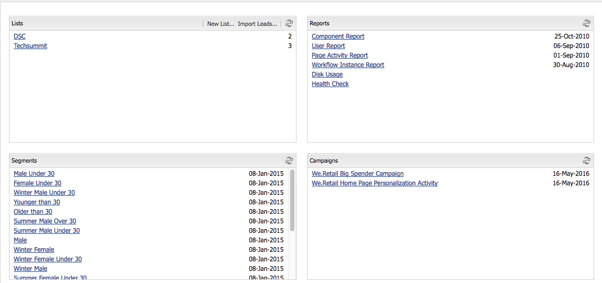
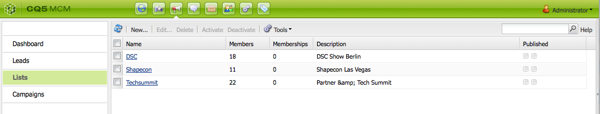

# Werken met de manager van de Campagne van de Marketing{#working-with-the-marketing-campaign-manager}

In AEM, is de Manager van de Campagne van de Marketing (MCM) een console die u multi-kanaalcampagnes helpt beheren. Met deze software voor marketingautomatisering kunt u al uw merken, campagnes en ervaringen beheren, samen met de verwante segmenten, lijsten, leads en rapporten.

MCM kan van diverse plaatsen in AEM worden betreden; bijvoorbeeld het Welkome scherm, gebruikend het pictogram van Campagnes of met URL:

`https://<hostname>:<port>/libs/mcm/content/admin.html`

Bijvoorbeeld:

`https://localhost:4502/libs/mcm/content/admin.html`

Via de MCM hebt u toegang tot:

* **[Dashboard](#dashboard)**
Dit bestaat uit vier deelvensters:

   * [ Lijsten ](#lists)
In dit deelvenster worden de lijsten weergegeven die u al hebt gemaakt, samen met het aantal leads in die lijst. In dit deelvenster kunt u rechtstreeks een lijst maken of een lijst maken door een lijst te importeren.
Het selecteren van een specifieke lijst zal u aan de [ sectie van Lijsten ](#lists) nemen die details voor uw lijst tonen.

   * [ Segmenten ](/help/sites-classic-ui-authoring/classic-personalization-campaigns.md#anoverviewofsegmentation)
In dit deelvenster ziet u de segmenten die u hebt gedefinieerd. Met segmenten kunt u een verzameling bezoekers karakteriseren die bepaalde kenmerken delen.
Als u een specifiek segment selecteert, wordt de pagina voor segmentdefinitie geopend.

   * [ Rapporten ](/help/sites-administering/reporting.md)
AEM verstrekt verschillende rapporten om u te helpen de staat van uw geval analyseren en controleren. In dit deelvenster MCM worden de rapporten weergegeven.
Als u een rapport selecteert, wordt de rapportpagina geopend.

   * [ Campagnes ](#campaigns)
Deze ruit maakt een lijst van uw campagneervaringen zoals [ nieuwsbrieven ](/help/sites-classic-ui-authoring/classic-personalization-campaigns.md#newsletters) en [ tellers ](/help/sites-classic-ui-authoring/classic-personalization-campaigns.md#teasers).

* **[Leads](#leads)**
Hier kun je je leads beheren. U kunt leads maken of importeren, specifieke details voor afzonderlijke leads bewerken of verwijderen wanneer u deze niet meer nodig hebt. U kunt ook leads in verschillende groepen plaatsen, genaamd Lijsten. **Nota:** de Adobe is niet van plan om dit vermogen verder te verbeteren.
De aanbeveling moet [ Adobe Campaign en de integratie aan AEM ](/help/sites-administering/campaign.md) gebruiken.

* **[Lijsten](#lists)**
Hier kunt u uw lijsten (van leads) beheren.**Nota:** de Adobe is niet van plan om dit vermogen verder te verbeteren.
De aanbeveling moet [ Adobe Campaign en de integratie aan AEM ](/help/sites-administering/campaign.md) gebruiken.

* **[Campagnes](#campaigns)**
Hier kunt u uw merken, campagnes en ervaringen beheren.

## Dashboard {#dashboard}

Het dashboard bevat vier deelvensters die u een overzicht bieden van uw lijsten (van leads), segmenten, rapporten en campagnes. Hier is ook toegang tot de basisfuncties beschikbaar.

### Leads {#leads}

>[!NOTE]
>
>Adobe is niet van plan deze mogelijkheid verder te verbeteren (Leads beheren).
>De aanbeveling moet [ Adobe Campaign en de integratie aan AEM ](/help/sites-administering/campaign.md) gebruiken.

In AEM MCM, kunt u organiseren en lood toevoegen door of hen manueel in te gaan of een komma-gescheiden lijst, bijvoorbeeld, een postingslijst in te voeren. Aanvullende manieren om leads te genereren zijn afkomstig van aanmeldingspogingen in een nieuwsbrief of aanmeldingspogingen van de gebruikersgemeenschap (als deze zijn geconfigureerd, kunnen ze een workflow activeren die leads vult). Leads worden gewoonlijk gecategoriseerd en in een lijst geplaatst zodat u later handelingen kunt uitvoeren op de hele lijst, bijvoorbeeld door een aangepaste e-mail naar een bepaalde lijst te verzenden.

Onder **Leads** in de linkerruit u kunt tot stand brengen, invoeren, uitgeven en uw lood schrappen, dan activeren of deactiveren zoals vereist. U kunt een lead aan een lijst toevoegen of zien tot welke lijsten deze al behoort.

>[!NOTE]
>
>Zie [ Werkend met Leads ](/help/sites-classic-ui-authoring/classic-personalization-campaigns.md#workingwithleads) voor gedetailleerde informatie over specifieke taken.

### Lijsten {#lists}

>[!NOTE]
>
>Adobe is niet van plan deze mogelijkheid verder te verbeteren (lijsten beheren).
>De aanbeveling moet [ Adobe Campaign en de integratie aan AEM ](/help/sites-administering/campaign.md) gebruiken.

Met lijsten kunt u uw leads ordenen in groepen. Met lijsten kunt u uw marketingcampagnes richten op een bepaalde groep personen. U kunt bijvoorbeeld een doelnieuwsbrief naar een lijst sturen.

Onder **Lijsten**, kunt u uw lijsten beheren door te creëren, het invoeren, het uitgeven, het samenvoegen en het schrappen van lijsten die u dan kunt activeren of desactiveren zoals vereist. U kunt ook de leads in die lijst bekijken, kijken of de lijst lid is van een andere lijst of de beschrijving bekijken.

>[!NOTE]
>
>Zie [ Werkend met Lijsten ](/help/sites-classic-ui-authoring/classic-personalization-campaigns.md#workingwithlists) voor gedetailleerde informatie over specifieke taken.

### Campagnes {#campaigns}

>[!NOTE]
>
>Zie [ Teasers en Strategieën ](/help/sites-classic-ui-authoring/classic-personalization-campaigns.md#workingwithlists), [ Vestiging uw Campagne ](/help/sites-classic-ui-authoring/classic-personalization-campaigns.md#settingupyourcampaign) en [ Nieuwsbrieven ](/help/sites-classic-ui-authoring/classic-personalization-campaigns.md#newsletters) voor gedetailleerde informatie over specifieke taken.

Om tot bestaande campagnes toegang te hebben, in MCM klik **Campagnes**.

* **in de linkerruit**:
Er is een lijst van alle merken en campagnes.
Als u op een merk klikt, wordt de lijst uitgebreid en worden in het linkervenster alle bijbehorende campagnes weergegeven. In deze lijst ziet u ook het aantal ervaringen dat voor elke campagne bestaat. Het opent ook het merkoverzicht in de juiste ruit.

* **in de juiste ruit**:
Pictogrammen worden voor elk merk getoond (historische campagnes worden niet weergegeven).
Dubbelklik op deze opties om het overzicht van het merk te openen.

#### Merk - overzicht {#brand-overview}

Vanaf hier kunt u:

* Zie het aantal campagnes en ervaringen (nummer weergegeven in het linkervenster) dat voor dit merk bestaat.
* Creeer a **Nieuw...** campagne voor dit merk.

* Verander timespan dat wordt bekeken; selecteer **Week**, **Maand** of **Kwartaal**, gebruik de pijlen om specifieke periodes te selecteren of op **vandaag** terug te keren.

* Selecteer een campagne (in het rechterdeelvenster) om:

   * Bewerk de **Eigenschappen..**
   * **Schrap** de campagne.

* Open het campagneoverzicht (dubbelklik op een campagne in het rechterdeelvenster of klik met één klik in het linkerdeelvenster).

#### Campagneoverzicht {#campaign-overview}

Voor de afzonderlijke campagnes zijn twee weergaven beschikbaar:

1. **Kalenderweergave**

   Gebruik het pictogram:

   

   Hierin wordt een lijst weergegeven van alle (grijze) aanraakpunten met een horizontaal tijdkader van de (groene) ervaringen die met dat aanraakpunt zijn verbonden:

   

   Vanaf hier kunt u:

   * Verander timespan u bekijkt door de pijlen te gebruiken, of terugkeer aan **vandaag**.

   * Het gebruik **voegt Aanraakpunt toe...** om een nieuw aanraakpunt voor een bestaande ervaring toe te voegen.

   * Klik op een meetapparaat (in de juiste ruit) om **op Tijd** en **van Tijd** te plaatsen.

1. **de Mening van de Lijst**

   Gebruik het pictogram:

   

   Hier worden alle ervaringen (bijvoorbeeld theaters en nieuwsbrieven) voor de geselecteerde campagne weergegeven:

   

   Vanaf hier kunt u:

   * Creeer a **Nieuw...** ervaring; bijvoorbeeld, aanbiedingen van Adobe Target, leerkrachten en nieuwsbrieven.
   * **geeft** de details van een specifieke teaser pagina of een nieuwsbrief uit (een dubbel-klik kan ook worden gebruikt).
   * Bepaal de **Eigenschappen...** voor een specifieke teaser pagina of een nieuwsbrief.
   * **Simuleer** de blik en het gevoel van een ervaring (laserpagina of nieuwsbrief).
Wanneer de gesimuleerde pagina is geopend, kunt u het hulpprogramma openen om over te schakelen naar de bewerkingsmodus voor die pagina.

   * **analyseert...** de beelden die voor een pagina worden geproduceerd.

   * **schrapt** punten wanneer zij niet meer nodig zijn.
   * **Onderzoek** naar uw tekst (het gebied van de Titel van de ervaring zal worden gezocht).
   * Het gebruik **Geavanceerd** onderzoek om filters op het onderzoek toe te passen.

### Simuleren van uw ervaringen met campagnes {#simulating-your-campaign-experiences}

In MCM, klik **Campagnes**. Zorg ervoor dat de lijstmening actief is, dan selecteer de vereiste campagneervaring en klik **simuleren**. Het aanraakpunt (teaser- of nieuwsbrief) wordt geopend om de ervaring te tonen die u hebt geselecteerd, zoals de bezoeker het ziet.

Van hieruit kunt u ook het hulpslot openen (klik op de kleine pijl-omlaag) om de bewerkingsmodus voor het bijwerken van de pagina te wijzigen.

### Uw ervaringen met campagnes analyseren {#analyzing-your-campaign-experiences}

In MCM, klik **Campagnes**. Zorg ervoor dat de lijstmening actief is, dan selecteer de vereiste campagneervaring en selecteer **analyseren...**. Er wordt een grafiek met de paginamonpressies weergegeven.

