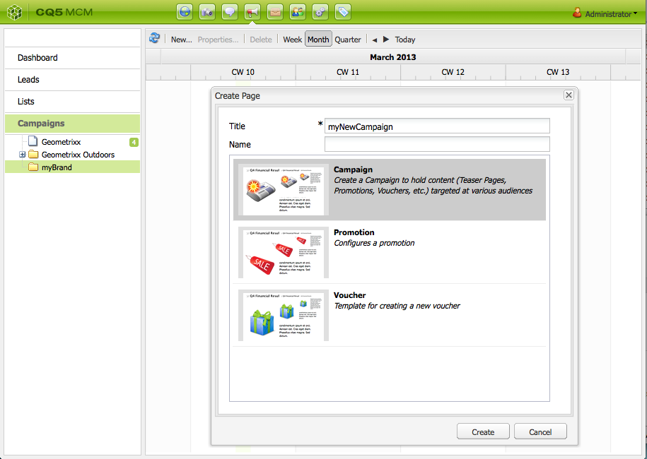

# Uw campagne instellen{#setting-up-your-campaign}

Het opzetten van een nieuwe campagne omvat de volgende (generische) stappen:

1. [Een merk maken](#creating-a-new-brand) om uw campagnes te houden.
1. Indien nodig kunt u [de eigenschappen van uw nieuwe merk definiëren](#defining-the-properties-for-your-new-brand).
1. [Een campagne maken](#creating-a-new-campaign) om ervaringen op te slaan, bijvoorbeeld laserpagina&#39;s of een nieuwsbrief.
1. Indien nodig kunt u [de eigenschappen voor uw nieuwe campagne definiëren](#defining-the-properties-for-your-new-campaign).

Afhankelijk van het type ervaringen dat u maakt, moet u [een ervaring creëren](#creating-a-new-experience). De details van de ervaring en de acties die volgen op de creatie zijn afhankelijk van het type ervaring dat u wilt maken:

* Als u een taser maakt:

   1. [Een gummetje maken](/help/sites-classic-ui-authoring/classic-personalization-campaigns.md#creatingateaserexperience).
   1. [Inhoud toevoegen aan uw taser](/help/sites-classic-ui-authoring/classic-personalization-campaigns.md#addingcontenttoyourteaser).
   1. [Een aanraakpunt voor uw taser maken](/help/sites-classic-ui-authoring/classic-personalization-campaigns.md#creatingatouchpointforyourteaser) (voeg het gummetje toe aan een inhoudspagina).

* Als u een nieuwsbrief maakt:

   1. [Een nieuwsbrief maken](/help/sites-classic-ui-authoring/classic-personalization-campaigns.md#creatinganewsletterexperience).
   1. [Voeg inhoud toe aan de nieuwsbrief.](/help/sites-classic-ui-authoring/classic-personalization-campaigns.md#addingcontenttonewsletters)
   1. [Pas de nieuwsbrief aan.](/help/sites-classic-ui-authoring/classic-personalization-campaigns.md#personalizingnewsletters)
   1. [Een aantrekkelijke bestemmingspagina voor nieuwsbrieven maken](/help/sites-classic-ui-authoring/classic-personalization-campaigns.md#settingupanewsletterlandingpage).
   1. [Nieuwsbrief verzenden](/help/sites-classic-ui-authoring/classic-personalization-campaigns.md#sendingnewsletters) aan abonnees of leads.

* Bij het maken van een Adobe Target-aanbieding (voorheen Test&amp;Target):

   1. [Een Adobe Target-aanbieding maken](/help/sites-classic-ui-authoring/classic-personalization-campaigns.md#creatingatesttargetofferexperience).
   1. [Integreren met Adobe Target](/help/sites-classic-ui-authoring/classic-personalization-campaigns.md#integratewithadobetesttarget)

>[!NOTE]
>
>Zie [Segmentering](/help/sites-administering/campaign-segmentation.md) voor gedetailleerde instructies voor het bepalen van uw segmenten.

## Een nieuw merk maken {#creating-a-new-brand}

1. Open de **MCM** en selecteert u **Campagnes** in het linkerdeelvenster.

1. Selecteren **Nieuw...** om de **Titel** en **Naam** en sjabloon voor uw nieuwe merk:

   

1. Klikken **Maken**. Uw nieuwe merk wordt weergegeven in de MCM (met een standaardpictogram).

### Eigenschappen voor uw nieuwe merk definiëren {#defining-the-properties-for-your-new-brand}

1. Van **Campagnes** in het linkerdeelvenster selecteert u het pictogram van het nieuwe merk in het rechterdeelvenster en klikt u op **Eigenschappen...**

   U kunt een **Titel**, **Beschrijving** en een afbeelding die als pictogram moet worden gebruikt.

   

1. Klikken **OK** opslaan.

### Nieuwe campagne maken {#creating-a-new-campaign}

1. Van **Campagnes** selecteert u het nieuwe merk in het linkervenster of dubbelklikt u op het pictogram in het rechtervenster.

   Het overzicht wordt weergegeven (leeg als het merk nieuw is).

1. Klikken **Nieuw...** en geeft de **Titel**, **Naam** en sjabloon voor uw nieuwe campagne.

   

1. Klikken **Maken**. Uw nieuwe campagne wordt getoond in MCM.

### Eigenschappen voor uw nieuwe campagne definiëren {#defining-the-properties-for-your-new-campaign}

Campagneigenschappen configureren die het gedrag bepalen:

* **Prioriteit:** De prioriteit van deze campagne ten opzichte van andere campagnes. Wanneer de veelvoudige campagnes gelijktijdig zijn, controleert de campagne die de hoogste prioriteit heeft de bezoekerservaring.
* **Aan- en uittijd:** Deze eigenschappen bepalen de periode waarin de campagne de ervaring van de bezoeker bepaalt. Het bezit op Tijd controleert de tijd wanneer de campagne begint de ervaring te controleren. De eigenschap Uit-tijd bepaalt wanneer de campagnes de ervaring niet meer besturen.
* **Afbeelding:** De afbeelding die de campagne in AEM vertegenwoordigt.
* **Cloud Servicen:** De configuraties van de Cloud Service waarmee de campagne wordt geïntegreerd. (Zie [Integreren met Adobe Marketing Cloud](/help/sites-administering/marketing-cloud.md).)

* **Adobe Target:** Eigenschappen die campagnes vormen die met Adobe Target worden geïntegreerd. (Zie [Integreren met Adobe Target](/help/sites-administering/target.md).)

1. Van **Campagnes**, selecteer uw merk. Selecteer uw campagne in het rechterdeelvenster en klik op **Eigenschappen**.

   U kunt verschillende eigenschappen invoeren, zoals een **Titel**, **Beschrijving** en alle **Cloud Servicen** dat wil je.

   

1. Klikken **OK** opslaan.

### Een nieuwe ervaring maken {#creating-a-new-experience}

De procedure voor het creëren van een ervaring is afhankelijk van het type ervaring:

* [Een taser maken](/help/sites-classic-ui-authoring/classic-personalization-campaigns.md#creatingateaser)
* [Een nieuwsbrief maken](/help/sites-classic-ui-authoring/classic-personalization-campaigns.md#creatinganewsletter)
* [Een Adobe Target-aanbieding maken](/help/sites-classic-ui-authoring/classic-personalization-campaigns.md#creatingatesttargetoffer)

>[!NOTE]
>
>Net als bij eerdere versies is het nog steeds mogelijk om de ervaring als een pagina op te nemen in de **Websites** console (en dergelijke pagina&#39;s die in vorige versies zijn gemaakt, worden nog steeds volledig ondersteund).
>
>Het wordt nu aanbevolen om de MCM te gebruiken voor het maken van ervaringen.

### Uw nieuwe ervaring configureren {#configuring-your-new-experience}

Nu u het basisskelet voor uw ervaring hebt gecreeerd, moet u met de volgende acties verdergaan, afhankelijk van het type ervaring:

* [Teaser](/help/sites-classic-ui-authoring/classic-personalization-campaigns.md#teasers):

   * [Verbind de teaspagina met bezoekerssegmenten.](/help/sites-classic-ui-authoring/classic-personalization-campaigns.md#applyingasegmenttoyourteaser)
   * [Een aanraakpunt voor uw taser maken](/help/sites-classic-ui-authoring/classic-personalization-campaigns.md#creatingatouchpointforyourteaser) (voeg het gummetje toe aan een inhoudspagina).

* [Nieuwsbrief](/help/sites-classic-ui-authoring/classic-personalization-campaigns.md#newsletters):

   * [Voeg inhoud toe aan de nieuwsbrief.](/help/sites-classic-ui-authoring/classic-personalization-campaigns.md#addingcontenttonewsletters)
   * [Pas de nieuwsbrief aan.](/help/sites-classic-ui-authoring/classic-personalization-campaigns.md#personalizingnewsletters)
   * [Nieuwsbrief verzenden](/help/sites-classic-ui-authoring/classic-personalization-campaigns.md#sendingnewsletters) aan abonnees of leads.
   * [Een aantrekkelijke bestemmingspagina voor nieuwsbrieven maken](/help/sites-classic-ui-authoring/classic-personalization-campaigns.md#settingupanewsletterlandingpage).

* [Adobe Target-voorstel](/help/sites-classic-ui-authoring/classic-personalization-campaigns.md#testtargetoffers):

   * [Integreren met Adobe Target](/help/sites-administering/target.md)

### Een nieuw aanraakpunt toevoegen {#adding-a-new-touchpoint}

Als u bestaande ervaringen hebt, kunt u een aanraakpunt rechtstreeks vanuit de kalenderweergave van MCM toevoegen:

1. Selecteer de kalenderweergave voor uw campagne.

1. Klikken **Aanraakpunt toevoegen...** het dialoogvenster openen. Geef de ervaring op die u wilt toevoegen:

   

1. Klikken **OK** opslaan.

## Werken met leads {#working-with-leads}

>[!NOTE]
>
>Adobe is niet van plan deze mogelijkheid verder te verbeteren (Leads beheren).
>Aanbevolen wordt [Adobe Campaign en de integratie in AEM](/help/sites-administering/campaign.md).

In AEM MCM kunt u verbindingen organiseren en toevoegen door ze handmatig in te voeren of door een lijst met door komma&#39;s gescheiden waarden te importeren, bijvoorbeeld een mailinglijst. Aanvullende manieren om leads te genereren zijn afkomstig van nieuwsbrief-ups of community-aanmeldingen (als deze zijn geconfigureerd, kunnen ze een workflow activeren die leads vult).

Regeleinden worden doorgaans gecategoriseerd en in een lijst geplaatst, zodat u later handelingen kunt uitvoeren in de hele lijst, bijvoorbeeld door een aangepaste e-mail naar een bepaalde lijst te verzenden.

In het dashboard hebt u toegang tot alle leads door op **Leads** in het linkerdeelvenster. U kunt ook toegang krijgen tot leads via de **Lijsten** venster.

>[!NOTE]
>
>Als u de avatars van gebruikers wilt toevoegen of wijzigen, opent u de clickstream-cloud (Ctrl+Alt+c), laadt u het profiel en klikt u op **Bewerken**.

### Nieuwe leads maken {#creating-new-leads}

Nadat u nieuwe leads hebt gemaakt, moet u [activeren](#activating-or-deactivating-leads) zodat u hun activiteit op het publicatieexemplaar kunt volgen en hun ervaring kunt personaliseren.

Een lead handmatig maken:

1. Navigeer in AEM naar de MCM. Klik in het dashboard op **Leads**.
1. Klikken **Nieuw**. De **Nieuw maken** wordt geopend.

   

1. Voer desgewenst gegevens in de velden in. Klik op de knop **Adres** tab.

   

1. Voer eventueel de adresgegevens in. Klikken **Opslaan** om de lead op te slaan. Als u extra leads wilt toevoegen, klikt u op **Opslaan en Nieuw**.

   De nieuwe lead wordt weergegeven in het deelvenster Leads. Wanneer u op het item klikt, worden alle ingevoerde gegevens in het rechterdeelvenster weergegeven. Nadat u een lead hebt gemaakt, kunt u deze aan een lijst toevoegen.

   

### Inleiding activeren of deactiveren {#activating-or-deactivating-leads}

Door leads te activeren kunt u hun activiteiten bijhouden op het publicatieexemplaar en kunt u hun ervaring aanpassen. Wanneer u hun activiteit niet meer wilt volgen, kunt u ze deactiveren.

Aan actieve of deactieve leads:

1. Navigeer in AEM naar de MCM en klik op **Leads**.

1. Selecteer de leads die u wilt activeren of deactiveren en klik op **Activeren** of **Deactiveren**.

   

   Net als bij AEM pagina&#39;s wordt de publicatiestatus aangegeven in het dialoogvenster **Gepubliceerd** kolom.

   

### Nieuwe leads importeren {#importing-new-leads}

Wanneer u nieuwe leads importeert, kunt u deze automatisch toevoegen aan een bestaande lijst of een lijst maken waarin deze leads worden opgenomen.

Om lood van een komma-gescheiden lijst te importeren:

1. Navigeer in AEM naar de MCM en klik op **Leads**.

   >[!NOTE]
   >
   >U kunt ook leads importeren door een van de volgende handelingen uit te voeren:
   >
   >* Klik in het dashboard op **Leads importeren** in de **Lijsten** ruit
   >* Klikken **Lijsten** en in de **Gereedschappen** menu, selecteert u **Leads importeren**.

1. In de **Gereedschappen** menu, selecteert u **Importeren** **Leads**.

1. Voer de informatie in zoals wordt beschreven in Voorbeeldgegevens. De volgende velden kunnen worden geïmporteerd: email,familyName,givenName,gender,aboutMe,city,country,phoneNumber,postalCode,region,streetAddress

   >[!NOTE]
   >
   >De eerste rij in de CSV-lijst is vooraf gedefinieerde labels die precies zo moeten worden geschreven als in het voorbeeld:
   >
   >
   >`email,givenName,familyName` - indien geschreven `givenname`Het systeem zal het bijvoorbeeld niet herkennen.
   >
   >

   

1. Klikken **Volgende**. Hier kunt u de leads bekijken om te controleren of ze accuraat zijn.

   

1. Klikken **Volgende**. Selecteer de lijst waartoe de leads moeten behoren. Als u niet wilt dat ze tot een lijst behoren, verwijdert u de gegevens in het veld. AEM maakt standaard een lijstnaam die de datum en tijd bevat. Klikken **Importeren**.

   

   De nieuwe lead wordt weergegeven in het deelvenster Leads. Als u op het item klikt, worden alle ingevoerde gegevens in het rechterdeelvenster weergegeven. Nadat u een lead hebt gemaakt, kunt u deze aan een lijst toevoegen.

### Leads toevoegen aan lijsten {#adding-leads-to-lists}

Om lood aan reeds bestaande lijsten toe te voegen:

1. Klik in de MCM op **Leads** om alle beschikbare leads te bekijken.

1. Selecteer de leads die u aan een lijst wilt toevoegen door het selectievakje naast de lead in te schakelen. U kunt zoveel leads toevoegen als u wilt.

   

1. In de **Gereedschappen** menu, selecteert u **Toevoegen aan lijst...** De **Toevoegen aan lijst** wordt geopend.

   

1. Selecteer de lijst waaraan u de leads wilt toevoegen en klik op **OK**. De leads worden toegevoegd aan de desbetreffende lijsten.

### Informatie over leads weergeven {#viewing-lead-information}

Als u informatie over leads wilt weergeven, klikt u in de MCM op het selectievakje naast de lead en wordt een rechtervenster geopend met alle informatie over de lead, inclusief de koppeling aan de lijst.

### Bestaande leads wijzigen {#modifying-existing-leads}

Bestaande lead-informatie wijzigen:

1. Klik in de MCM op **Leads**. Selecteer in de lijst met leads het selectievakje naast de lead die u wilt bewerken. Alle informatie over de lead wordt weergegeven in het rechterdeelvenster.

   

   >[!NOTE]
   >
   >U kunt slechts één lead tegelijk bewerken. Als u regels moet wijzigen die deel uitmaken van dezelfde lijst, kunt u de lijst wijzigen.

1. Klikken **Bewerken**. De **Lead bewerken** wordt geopend.

   

1. Breng de gewenste wijzigingen aan en klik op **Opslaan** om uw wijzigingen op te slaan.

   >[!NOTE]
   >
   >Ga naar het gebruikersprofiel als u de lead avatar wilt wijzigen. U kunt het profiel laden in de clickstream-cloud door op CTRL+ALT+c te klikken **Laden** en selecteert u vervolgens het profiel.

### Bestaande leads verwijderen {#deleting-existing-leads}

Als u bestaande leads in de MCM wilt verwijderen, schakelt u het selectievakje naast de lead in en klikt u **Verwijderen**. De lead wordt verwijderd uit de lijst met leads en alle bijbehorende lijsten.

>[!NOTE]
>
>Voordat u gaat verwijderen, bevestigt AEM dat u de bestaande lead wilt verwijderen. Nadat het wordt geschrapt, kan het niet worden teruggewonnen.

## Werken met lijsten {#working-with-lists}

>[!NOTE]
>
>Adobe is niet van plan deze mogelijkheid verder te verbeteren (lijsten beheren).
>Aanbevolen wordt [Adobe Campaign en de integratie in AEM](/help/sites-administering/campaign.md).

Met lijsten kunt u uw leads ordenen in groepen. Met lijsten kunt u uw marketingcampagnes richten op een bepaalde groep personen. U kunt bijvoorbeeld een doelnieuwsbrief naar een lijst sturen. Lijsten zijn zichtbaar in MCM, of in het Dashboard of door te klikken **Lijsten**. Beide verstrekken u de naam van de lijst en het aantal leden.

Als u op **Lijsten** kunt u ook bekijken of de lijst lid is van een andere lijst en een beschrijving zien.

### Nieuwe lijsten maken {#creating-new-lists}

1. Klik op het MCM-dashboard op **Nieuwe lijst...** of in **Lijsten**, klikt u op **Nieuw** ... Het venster Lijst maken wordt geopend.

   

1. Voer desgewenst een naam in (vereist) en een beschrijving in en klik op **Opslaan**. De lijst wordt weergegeven in de **Lijsten** venster.

   

### Bestaande lijsten wijzigen {#modifying-existing-lists}

1. Klik in de MCM op **Lijsten**.

1. Selecteer in de lijst het selectievakje naast de lijst die u wilt bewerken en klik op **Bewerken**. De **Lijst bewerken** wordt geopend.

   

   >[!NOTE]
   >
   >U kunt slechts één lijst tegelijk bewerken.

1. Breng desgewenst wijzigingen aan en klik op **Opslaan** om uw wijzigingen op te slaan.

### Bestaande lijsten verwijderen {#deleting-existing-lists}

Als u bestaande lijsten wilt verwijderen, selecteert u in de MCM het selectievakje naast de lijst en klikt u op **Verwijderen**. De lijst wordt verwijderd. Leads die aan de lijst zijn gekoppeld, worden niet verwijderd. Alleen de koppeling met de lijst wordt verwijderd.

>[!NOTE]
>
>AEM bevestigt vóór het verwijderen dat u de bestaande lijsten wilt verwijderen. Nadat het wordt geschrapt, kan het niet worden teruggewonnen.

### Lijsten samenvoegen {#merging-lists}

U kunt een bestaande lijst samenvoegen met een andere lijst. Wanneer u dit doet, wordt de lijst u samenvoegt een lid van de andere lijst. Het bestaat nog steeds als een afzonderlijke entiteit en mag niet worden geschrapt.

U kunt lijsten samenvoegen als u dezelfde conferentie op twee verschillende locaties hebt en u deze wilt samenvoegen in een lijst met deelnemers voor alle conferenties.

Bestaande lijsten samenvoegen:

1. Klik in de MCM op **Lijsten**.

1. Selecteer de lijst waarmee u een andere lijst wilt samenvoegen door het selectievakje naast de lijst in te schakelen.

1. In de **Gereedschappen** menu, selecteert u **Lijst samenvoegen**.

   >[!NOTE]
   >
   >U kunt slechts één lijst tegelijk samenvoegen.

1. In de **Lijst samenvoegen** venster, selecteert u de lijst waarmee u wilt samenvoegen en klikt u op **OK**.

   

   De lijst die u hebt samengevoegd, wordt met één lid verhoogd. Als u wilt zien dat uw lijst is samengevoegd, selecteert u de lijst die u hebt samengevoegd en in het dialoogvenster **Gereedschappen** menu, selecteert u **Leads tonen**.

1. Herhaal de stap totdat u alle gewenste lijsten hebt samengevoegd.

   

>[!NOTE]
>
>Het verwijderen van een samengevoegde lijst van zijn lidmaatschap is identiek aan het verwijderen van een lood uit een lijst. Open de **Lijsten** selecteert u de lijst die de samengevoegde lijst bevat en verwijdert u het lidmaatschap door op de rode cirkel naast de lijst te klikken.

### Regeleinden weergeven in lijsten {#viewing-leads-in-lists}

U kunt op elk gewenst moment bekijken welke leads tot een specifieke lijst behoren door te bladeren of te zoeken naar leden.

U kunt als volgt de leads in lijsten weergeven:

1. Klik in de MCM op **Lijsten**.

1. Schakel het selectievakje in naast de lijst waarvoor u de leden wilt weergeven.

1. In de **Gereedschappen** menu, selecteert u **Leads tonen**. AEM geeft de leads weer die lid zijn van die lijst. U kunt door de lijst bladeren of naar leden zoeken.

   >[!NOTE]
   >
   >Daarnaast kunt u leads uit een lijst verwijderen door deze te selecteren en vervolgens op **Lidmaatschap verwijderen**.

   

1. Klikken **Sluiten** om terug te keren naar de MCM.
