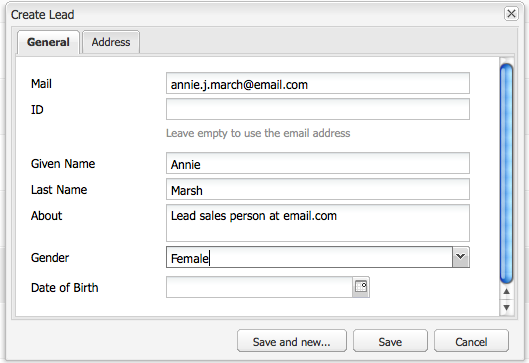

# Uw campagne instellen{#setting-up-your-campaign}

Het opzetten van een nieuwe campagne omvat de volgende (generische) stappen:

1. [ creeer een merk ](#creating-a-new-brand) om uw campagnes te houden.
1. Indien noodzakelijk kunt u [ de eigenschappen voor uw nieuw merk ](#defining-the-properties-for-your-new-brand) bepalen.
1. [ creeer een campagne ](#creating-a-new-campaign) om ervaringen te houden; bijvoorbeeld, laserpagina&#39;s of een nieuwsbrief.
1. Indien noodzakelijk kunt u [ de eigenschappen voor uw nieuwe campagne ](#defining-the-properties-for-your-new-campaign) bepalen.

Dan, afhankelijk van het type van ervaringen u creeert, moet u [ een ervaring ](#creating-a-new-experience) creëren. De details van de ervaring en de acties die volgen op de creatie zijn afhankelijk van het type ervaring dat u wilt maken:

* Als u een taser maakt:

   1. [ creeer een laserervaring ](/help/sites-classic-ui-authoring/classic-personalization-campaigns.md#creatingateaserexperience).
   1. [ voegt inhoud aan uw meetapparaat ](/help/sites-classic-ui-authoring/classic-personalization-campaigns.md#addingcontenttoyourteaser) toe.
   1. [ creeer een Aanraakpunt voor uw Taser ](/help/sites-classic-ui-authoring/classic-personalization-campaigns.md#creatingatouchpointforyourteaser) (voeg uw gummetje aan een inhoudspagina toe).

* Als u een nieuwsbrief maakt:

   1. [ creeer een nieuwsbrief ervaring ](/help/sites-classic-ui-authoring/classic-personalization-campaigns.md#creatinganewsletterexperience).
   1. [Voeg inhoud toe aan de nieuwsbrief.](/help/sites-classic-ui-authoring/classic-personalization-campaigns.md#addingcontenttonewsletters)
   1. [Pas de nieuwsbrief aan.](/help/sites-classic-ui-authoring/classic-personalization-campaigns.md#personalizingnewsletters)
   1. [ creeer een dwingende nieuwsbrief het landen pagina ](/help/sites-classic-ui-authoring/classic-personalization-campaigns.md#settingupanewsletterlandingpage).
   1. [ verzend nieuwsbrief ](/help/sites-classic-ui-authoring/classic-personalization-campaigns.md#sendingnewsletters) naar abonnees of lood.

* Bij het maken van een Adobe Target-aanbieding (voorheen Test&amp;Target):

   1. [ creeer een de aanbiedingservaring van Adobe Target ](/help/sites-classic-ui-authoring/classic-personalization-campaigns.md#creatingatesttargetofferexperience).
   1. [Integreren met Adobe Target](/help/sites-classic-ui-authoring/classic-personalization-campaigns.md#integratewithadobetesttarget)

>[!NOTE]
>
>Zie [ Segmentatie ](/help/sites-administering/campaign-segmentation.md) voor gedetailleerde instructies bij het bepalen van uw segmenten.

## Een nieuw merk maken {#creating-a-new-brand}

1. Open **MCM** en selecteer **Campagnes** in de linkerruit.

1. Selecteer **Nieuw...** om de **Titel** in te gaan en **Naam** en malplaatje dat voor uw nieuw merk moet worden gebruikt:

   

1. Klik **creëren**. Uw nieuwe merk wordt weergegeven in de MCM (met een standaardpictogram).

### Eigenschappen voor uw nieuwe merk definiëren {#defining-the-properties-for-your-new-brand}

1. Van **Campagnes** in de linkerruit, selecteer uw nieuw merkpictogram in de juiste ruit en klik **Eigenschappen..**

   U kunt a **Titel** ingaan, **Beschrijving** en een beeld dat als pictogram moet worden gebruikt.

   

1. Klik **O.K.** om te bewaren.

### Nieuwe campagne maken {#creating-a-new-campaign}

1. Van **Campagnes**, selecteer uw nieuw merk in de linkerruit, of klik het pictogram in de juiste ruit tweemaal.

   Het overzicht wordt weergegeven (leeg als het merk nieuw is).

1. Klik **Nieuw...** en specificeer de **Titel**, **Naam** en malplaatje dat voor uw nieuwe campagne moet worden gebruikt.

   

1. Klik **creëren**. Uw nieuwe campagne wordt getoond in MCM.

### Eigenschappen voor uw nieuwe campagne definiëren {#defining-the-properties-for-your-new-campaign}

Campagneigenschappen configureren die het gedrag bepalen:

* **Prioriteit:** De prioriteit van deze campagne met betrekking tot andere campagnes. Wanneer de veelvoudige campagnes gelijktijdig zijn, controleert de campagne die de hoogste prioriteit heeft de bezoekerservaring.
* **aan en uit Tijd:** Deze eigenschappen controleren de periode wanneer de campagne de bezoekerservaring controleert. Het bezit op Tijd controleert de tijd wanneer de campagne begint de ervaring te controleren. De eigenschap Uit-tijd bepaalt wanneer de campagnes de ervaring niet meer besturen.
* **Beeld:** het beeld dat de campagne in AEM vertegenwoordigt.
* **Clouden Services:** de configuraties van de Cloud Service waarmee de campagne wordt geïntegreerd. (Zie [ Integrerend met Adobe Marketing Cloud ](/help/sites-administering/marketing-cloud.md).)

* **Adobe Target:** Eigenschappen die campagnes vormen die met Adobe Target worden geïntegreerd. (Zie [ Integrerend met Adobe Target ](/help/sites-administering/target.md).)

1. Van **Campagnes**, selecteer uw merk. In de juiste ruit, selecteer uw campagne en klik **Eigenschappen**.

   U kunt diverse eigenschappen, met inbegrip van a **Titel**, **Beschrijving** en om het even welke **Cloud Servicen** ingaan u wilt.

   

1. Klik **O.K.** om te bewaren.

### Een nieuwe ervaring maken {#creating-a-new-experience}

De procedure voor het creëren van een ervaring is afhankelijk van het type ervaring:

* [Een taser maken](/help/sites-classic-ui-authoring/classic-personalization-campaigns.md#creatingateaser)
* [Een nieuwsbrief maken](/help/sites-classic-ui-authoring/classic-personalization-campaigns.md#creatinganewsletter)
* [Een Adobe Target-aanbieding maken](/help/sites-classic-ui-authoring/classic-personalization-campaigns.md#creatingatesttargetoffer)

>[!NOTE]
>
>Zoals met vorige versies is het nog mogelijk om de ervaring als pagina in de **** console van Websites tot stand te brengen {(en om het even welke die pagina&#39;s in vorige versies worden gecreeerd worden nog volledig gesteund).
>
>Het wordt nu aanbevolen om de MCM te gebruiken voor het maken van ervaringen.

### Uw nieuwe ervaring configureren {#configuring-your-new-experience}

Nu u het basisskelet voor uw ervaring hebt gecreeerd, moet u met de volgende acties verdergaan, afhankelijk van het type ervaring:

* [ Taser ](/help/sites-classic-ui-authoring/classic-personalization-campaigns.md#teasers):

   * [Verbind de teaspagina met bezoekerssegmenten.](/help/sites-classic-ui-authoring/classic-personalization-campaigns.md#applyingasegmenttoyourteaser)
   * [ creeer een Aanraakpunt voor uw Taser ](/help/sites-classic-ui-authoring/classic-personalization-campaigns.md#creatingatouchpointforyourteaser) (voeg uw gummetje aan een inhoudspagina toe).

* [ Nieuwsbrief ](/help/sites-classic-ui-authoring/classic-personalization-campaigns.md#newsletters):

   * [Voeg inhoud toe aan de nieuwsbrief.](/help/sites-classic-ui-authoring/classic-personalization-campaigns.md#addingcontenttonewsletters)
   * [Pas de nieuwsbrief aan.](/help/sites-classic-ui-authoring/classic-personalization-campaigns.md#personalizingnewsletters)
   * [ verzend nieuwsbrief ](/help/sites-classic-ui-authoring/classic-personalization-campaigns.md#sendingnewsletters) naar abonnees of lood.
   * [ creeer een dwingende nieuwsbrief het landen pagina ](/help/sites-classic-ui-authoring/classic-personalization-campaigns.md#settingupanewsletterlandingpage).

* [ Aanbieding van Adobe Target ](/help/sites-classic-ui-authoring/classic-personalization-campaigns.md#testtargetoffers):

   * [Integreren met Adobe Target](/help/sites-administering/target.md)

### Een nieuw aanraakpunt toevoegen {#adding-a-new-touchpoint}

Als u bestaande ervaringen hebt, kunt u een aanraakpunt rechtstreeks vanuit de kalenderweergave van MCM toevoegen:

1. Selecteer de kalenderweergave voor uw campagne.

1. Klik **toevoegen Aanraakpunt...** om de dialoog te openen. Geef de ervaring op die u wilt toevoegen:

   

1. Klik **O.K.** om te bewaren.

## Werken met leads {#working-with-leads}

>[!NOTE]
>
>Adobe is niet van plan deze mogelijkheid verder te verbeteren (Leads beheren).
>De aanbeveling moet [ Adobe Campaign en de integratie aan AEM ](/help/sites-administering/campaign.md) gebruiken.

In AEM MCM kunt u verbindingen organiseren en toevoegen door ze handmatig in te voeren of door een lijst met door komma&#39;s gescheiden waarden te importeren, bijvoorbeeld een mailinglijst. Aanvullende manieren om leads te genereren zijn afkomstig van nieuwsbrief-ups of community-aanmeldingen (als deze zijn geconfigureerd, kunnen ze een workflow activeren die leads vult).

Regeleinden worden doorgaans gecategoriseerd en in een lijst geplaatst, zodat u later handelingen kunt uitvoeren in de hele lijst, bijvoorbeeld door een aangepaste e-mail naar een bepaalde lijst te verzenden.

In het dashboard, hebt toegang u tot alle lood door **te klikken leidt** van de linkerruit. U kunt tot lood van de **ruit van Lijsten {ook toegang hebben 1}.**

>[!NOTE]
>
>Om de avatars van gebruikers toe te voegen of te wijzigen, open de klikstroomwolk (Ctrl+Alt+c), laad het profiel, en klik **geeft** uit.

### Nieuwe leads maken {#creating-new-leads}

Nadat u nieuwe lood creeert, ben zeker om hen [ te activeren ](#activating-or-deactivating-leads) zodat u hun activiteit op te volgen publiceert instantie en hun ervaring kunt personaliseren.

Een lead handmatig maken:

1. Navigeer in AEM naar de MCM. In het dashboard, klik **Leads**.
1. Klik **Nieuw**. **creeer Nieuw** venster opent.

   

1. Voer desgewenst gegevens in de velden in. Klik het **Adres** lusje.

   

1. Voer eventueel de adresgegevens in. Klik **sparen** om de lood te bewaren. Als u extra lood moet toevoegen, klik **sparen en Nieuw**.

   De nieuwe lead wordt weergegeven in het deelvenster Leads. Wanneer u op het item klikt, worden alle ingevoerde gegevens in het rechterdeelvenster weergegeven. Nadat u een lead hebt gemaakt, kunt u deze aan een lijst toevoegen.

   

### Inleiding activeren of deactiveren {#activating-or-deactivating-leads}

Door leads te activeren kunt u hun activiteiten bijhouden op het publicatieexemplaar en kunt u hun ervaring aanpassen. Wanneer u hun activiteit niet meer wilt volgen, kunt u ze deactiveren.

Aan actieve of deactieve leads:

1. In AEM, navigeer aan MCM en klik **Leads**.

1. Selecteer de lood u wilt activeren of deactiveren en **klikken activeert** of **** deactivate.

   

   Zoals met AEM pagina&#39;s, wordt de het publiceren status vermeld in de **Gepubliceerde** kolom.

   

### Nieuwe leads importeren {#importing-new-leads}

Wanneer u nieuwe leads importeert, kunt u deze automatisch toevoegen aan een bestaande lijst of een lijst maken waarin deze leads worden opgenomen.

Om lood van een komma-gescheiden lijst te importeren:

1. In AEM, navigeer aan MCM en klik **Leads**.

   >[!NOTE]
   >
   >U kunt ook leads importeren door een van de volgende handelingen uit te voeren:
   >
   >* In het dashboard, klik **de Hangt van de Invoer** in de **ruit van Lijsten**
   >* Klik **Lijsten** en in het **** menu van Hulpmiddelen, uitgezochte **Leads van de Invoer**.

1. In het **menu van Hulpmiddelen**, uitgezochte **Invoer** **leidt**.

1. Voer de informatie in zoals wordt beschreven in Voorbeeldgegevens. De volgende velden kunnen worden geïmporteerd: email,familyName,givenName,gender,aboutMe,city,country,phoneNumber,postalCode,region,streetAddress

   >[!NOTE]
   >
   >De eerste rij in de CSV-lijst is vooraf gedefinieerde labels die precies zo moeten worden geschreven als in het voorbeeld:
   >
   >
   >`email,givenName,familyName` - indien geschreven als `givenname` , herkent het systeem het bijvoorbeeld niet.
   >
   >

   

1. Klik **daarna**. Hier kunt u de leads bekijken om te controleren of ze accuraat zijn.

   

1. Klik **daarna**. Selecteer de lijst waartoe de leads moeten behoren. Als u niet wilt dat ze tot een lijst behoren, verwijdert u de gegevens in het veld. AEM maakt standaard een lijstnaam die de datum en tijd bevat. Klik **Invoer**.

   

   De nieuwe lead wordt weergegeven in het deelvenster Leads. Als u op het item klikt, worden alle ingevoerde gegevens in het rechterdeelvenster weergegeven. Nadat u een lead hebt gemaakt, kunt u deze aan een lijst toevoegen.

### Leads toevoegen aan lijsten {#adding-leads-to-lists}

Om lood aan reeds bestaande lijsten toe te voegen:

1. In MCM, klik **Leads** om alle beschikbare lood te bekijken.

1. Selecteer de leads die u aan een lijst wilt toevoegen door het selectievakje naast de lead in te schakelen. U kunt zoveel leads toevoegen als u wilt.

   

1. In het **menu van Hulpmiddelen**, uitgezocht **voeg aan Lijst toe...** **voegt aan het venster van de Lijst** toe opent.

   

1. Selecteer welke lijst u de lood aan wilt toevoegen en **O.K.** klikken. De leads worden toegevoegd aan de desbetreffende lijsten.

### Informatie over leads weergeven {#viewing-lead-information}

Als u informatie over leads wilt weergeven, klikt u in de MCM op het selectievakje naast de lead en wordt een rechtervenster geopend met alle informatie over de lead, inclusief de koppeling aan de lijst.

### Bestaande leads wijzigen {#modifying-existing-leads}

Bestaande lead-informatie wijzigen:

1. In MCM, klik **Leads**. Selecteer in de lijst met leads het selectievakje naast de lead die u wilt bewerken. Alle informatie over de lead wordt weergegeven in het rechterdeelvenster.

   

   >[!NOTE]
   >
   >U kunt slechts één lead tegelijk bewerken. Als u regels moet wijzigen die deel uitmaken van dezelfde lijst, kunt u de lijst wijzigen.

1. Klik **uitgeven**. Het **geeft 1} venster van de Lood uit opent.**

   

1. Breng zonodig uitgeeft aan en klik **sparen** om uw veranderingen te bewaren.

   >[!NOTE]
   >
   >Ga naar het gebruikersprofiel als u de lead avatar wilt wijzigen. U kunt het profiel in de klikstroomwolk laden door CTRL+ALT+c te drukken, **Lading** te klikken, en dan het profiel te selecteren.

### Bestaande leads verwijderen {#deleting-existing-leads}

Om bestaande lood in MCM te schrappen, selecteer de controledoos naast de lood en klik **Schrapping**. De lead wordt verwijderd uit de lijst met leads en alle bijbehorende lijsten.

>[!NOTE]
>
>Voordat u gaat verwijderen, bevestigt AEM dat u de bestaande lead wilt verwijderen. Nadat het wordt geschrapt, kan het niet worden teruggewonnen.

## Werken met lijsten {#working-with-lists}

>[!NOTE]
>
>Adobe is niet van plan deze mogelijkheid verder te verbeteren (lijsten beheren).
>De aanbeveling moet [ Adobe Campaign en de integratie aan AEM ](/help/sites-administering/campaign.md) gebruiken.

Met lijsten kunt u uw leads ordenen in groepen. Met lijsten kunt u uw marketingcampagnes richten op een bepaalde groep personen. U kunt bijvoorbeeld een doelnieuwsbrief naar een lijst sturen. De lijsten zijn zichtbaar in MCM, of in het Dashboard of door **Lijsten** te klikken. Beide verstrekken u de naam van de lijst en het aantal leden.

Als u **Lijsten** klikt, kunt u ook bekijken als de lijst een lid van een andere lijst is en een beschrijving ziet.

### Nieuwe lijsten maken {#creating-new-lists}

1. In het dashboard MCM, klik **Nieuwe Lijst...** of in **Lijsten**, klik **Nieuw**.. Het venster Lijst maken wordt geopend.

   

1. Ga een naam (vereist) in en indien gewenst, een beschrijving en klik **sparen**. De lijst verschijnt in de **ruit van Lijsten**.

   

### Bestaande lijsten wijzigen {#modifying-existing-lists}

1. In MCM, klik **Lijsten**.

1. Van de lijst, selecteer de controledoos naast de lijst u **uitgeven en wilt klikken geeft** uit. Het **geeft** venster van de Lijst uit opent.

   

   >[!NOTE]
   >
   >U kunt slechts één lijst tegelijk bewerken.

1. Breng desgewenst uitgeeft uit, en klik **sparen** om uw veranderingen te bewaren.

### Bestaande lijsten verwijderen {#deleting-existing-lists}

Om bestaande lijsten, in MCM te schrappen, selecteer de controledoos naast de lijst en klik **Schrapping**. De lijst wordt verwijderd. Leads die aan de lijst zijn gekoppeld, worden niet verwijderd. Alleen de koppeling met de lijst wordt verwijderd.

>[!NOTE]
>
>AEM bevestigt vóór het verwijderen dat u de bestaande lijsten wilt verwijderen. Nadat het wordt geschrapt, kan het niet worden teruggewonnen.

### Lijsten samenvoegen {#merging-lists}

U kunt een bestaande lijst samenvoegen met een andere lijst. Wanneer u dit doet, wordt de lijst u samenvoegt een lid van de andere lijst. Het bestaat nog steeds als een afzonderlijke entiteit en mag niet worden geschrapt.

U kunt lijsten samenvoegen als u dezelfde conferentie op twee verschillende locaties hebt en u deze wilt samenvoegen in een lijst met deelnemers voor alle conferenties.

Bestaande lijsten samenvoegen:

1. In MCM, klik **Lijsten**.

1. Selecteer de lijst waarmee u een andere lijst wilt samenvoegen door het selectievakje naast de lijst in te schakelen.

1. In het **menu van Hulpmiddelen**, uitgezochte **Lijst van de Fusie**.

   >[!NOTE]
   >
   >U kunt slechts één lijst tegelijk samenvoegen.

1. In het **venster van de Lijst van de Samenvoegen**, selecteer de lijst u met wilt samenvoegen en **O.K.** klikken.

   

   De lijst die u hebt samengevoegd, wordt met één lid verhoogd. Om te zien dat uw lijst werd samengevoegd, selecteer de lijst u samenvoegde en in het **menu van Hulpmiddelen**, uitgezocht **toont Leads**.

1. Herhaal de stap totdat u alle gewenste lijsten hebt samengevoegd.

   

>[!NOTE]
>
>Het verwijderen van een samengevoegde lijst van zijn lidmaatschap is identiek aan het verwijderen van een lood uit een lijst. Open het **lusje van Lijsten**, selecteer de lijst die de samengevoegde lijst omvat, en verwijder het lidmaatschap door de rode cirkel naast de lijst te klikken.

### Regeleinden weergeven in lijsten {#viewing-leads-in-lists}

U kunt op elk gewenst moment bekijken welke leads tot een specifieke lijst behoren door te bladeren of te zoeken naar leden.

U kunt als volgt de leads in lijsten weergeven:

1. In MCM, klik **Lijsten**.

1. Schakel het selectievakje in naast de lijst waarvoor u de leden wilt weergeven.

1. In het **menu van Hulpmiddelen**, uitgezocht **toont Leads**. AEM geeft de leads weer die lid zijn van die lijst. U kunt door de lijst bladeren of naar leden zoeken.

   >[!NOTE]
   >
   >Bovendien kunt u lood van een lijst schrappen door hen te selecteren en dan **te klikken verwijdert Lidmaatschap**.

   

1. Klik **dicht** om aan MCM terug te keren.
