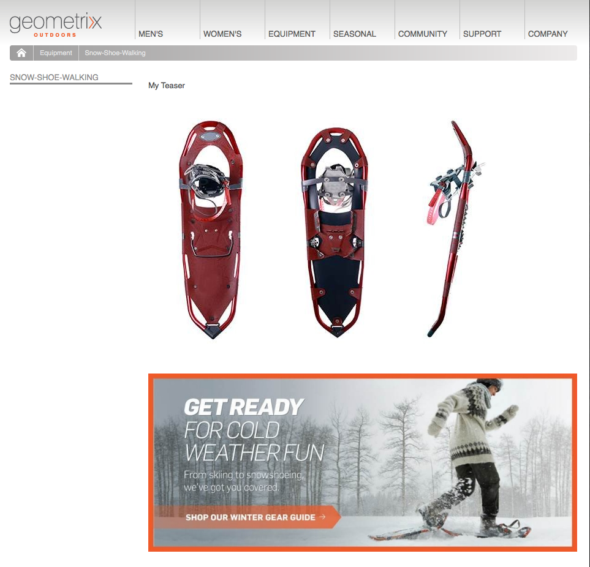

# Teasers en strategieën{#teasers-and-strategies}

Campagnes gebruiken vaak theaters als een mechanisme om een specifiek segment van de bezoekersbevolking door te zetten tot inhoud die op hun belangen is gericht. Een of meer theaters zijn gedefinieerd voor een specifieke campagne.

>[!NOTE]
>
>De component Teaser is nu afgekeurd in AEM 6.2. In plaats daarvan, gebruik de [ component van het Doel ](/help/sites-authoring/content-targeting-touch.md).

* **de pagina&#39;s van het Merk** worden opgeslagen binnen de sectie van Campagnes van de website. Een merk bevat de afzonderlijke campagnes.
* **de pagina&#39;s van de Campagne** worden opgeslagen binnen de sectie van Campagnes van de website. Elke campagne heeft een afzonderlijke pagina waarop de teasdefinities staan. De container, of overzichtspagina, bevat ook bepaalde informatie en statistieken over de afzonderlijke laserpagina&#39;s.

Teasers binnen AEM bestaan uit verschillende onderdelen:

* **de pagina&#39;s van het Taser** worden opgeslagen onder de aangewezen campagnepagina en houden de definities van de teaser paragrafen beschikbaar voor elke specifieke campagne. Deze definities worden gebruikt bij de weergave van de teasalinea&#39;s; inclusief variaties in de inhoud, het segment dat moet worden gebruikt voor het selecteren van een variatie- en versterkingsfactor.
* De **component van het Taser** is beschikbaar uit de doos en laat u een geval van uw specifieke teaser paragraaf in een inhoudspagina tot stand brengen. U kunt de lasercomponent van het hulpapparaat slepen, dan uw teasdefinitie specificeren om uw eigen teasparagraaf tot stand te brengen. **Nota:** de component van het Teaser wordt nu afgekeurd in AEM 6.2. In plaats daarvan, gebruik de [ component van het Doel ](/help/sites-authoring/content-targeting-touch.md).
* **de paragrafen van het Teken** zijn daadwerkelijke instanties van uw gummetje binnen een inhoudspagina. Deze maken een deel van de bezoekers bekend met inhoud die op hun belangen is toegespitst.
* Pagina&#39;s die de inhoud van de campagne bevatten, hebben de focus op een specifiek bezoekerssegment. Doorgaans leiden de laseralinea&#39;s de bezoeker naar dergelijke pagina&#39;s.

## Strategieën {#strategies}

Wanneer het toevoegen van een laserparagraaf aan een pagina, moet u de **Strategie** bepalen.

Dit is voor het geval dat verscheidene tellers voor selectie beschikbaar zijn aangezien hun toegewezen segmenten allen met succes oplossen. De **Strategie** specificeert dan een extra die criteria worden gebruikt om het getoonde meetapparaat te selecteren:

* **de Score van de KlikStream**, is gebaseerd op de markeringen en verwante markeringsklappen die binnen de de cliëntcontext van de bezoeker worden gehouden (toon hoe vaak een bezoeker pagina&#39;s heeft geklikt die de respectieve markering bevatten). De snelheden voor tags die op de teaspagina zijn gedefinieerd, worden vergeleken.
* **Willekeurig**, voor &quot;willekeurige&quot;selectie; gebruikt de willekeurige factor die voor een pagina wordt geproduceerd, dit kan met de [ cliëntcontext ](/help/sites-administering/client-context.md) worden gezien.
* **eerst** in de lijst van opgeloste segmenten. De volgorde is die van de trapsgewijze elementen op de pagina met de campagneccontainer.

De [ Factor van de Verhoging ](/help/sites-administering/campaign-segmentation.md#boost-factor) van het segment heeft ook een effect op de selectie. Dit is een wegingsfactor die aan een segmentdefinitie wordt toegevoegd om de relatieve waarschijnlijkheid van selectie te vergroten/verkleinen.

Het proces en de onderlinge relaties van de verschillende selectiecriteria kunnen het best worden geïllustreerd met een voorbeeld (een methode die ook kan worden gebruikt om ervoor te zorgen dat uw theers het vereiste publiek zullen bereiken).

Als de volgende segmenten reeds zijn gecreeerd en hun respectieve Factor van de Verhoging toegewezen:

| Segment | Verhoging van factor |
|---|---|
| S1 | 0 |
| S2 | 0 |
| S3 | 10 |
| S4 | 30 |
| S5 | 0 |
| S6 | 100 |

En wij gebruiken de volgende teasdefinities:

<table>
 <tbody>
  <tr>
   <td>Campagne</td>
   <td>Teaser</td>
   <td>Toegewezen segmenten</td>
   <td>Toegewezen labels </td>
  </tr>
  <tr>
   <td>C1</td>
   <td>T1</td>
   <td>S1, S2</td>
   <td>Zakelijk, marketing</td>
  </tr>
  <tr>
   <td>C1</td>
   <td>T2 </td>
   <td>S1</td>
   <td>  </td>
  </tr>
  <tr>
   <td>C1 </td>
   <td>T3</td>
   <td>S3, S4</td>
   <td>  </td>
  </tr>
  <tr>
   <td>C1 </td>
   <td>T4</td>
   <td>S2, S5</td>
   <td>  </td>
  </tr>
  <tr>
   <td>C1 </td>
   <td>T5</td>
   <td>S1, S2, S6</td>
   <td>Marketing</td>
  </tr>
  <tr>
   <td>C1 </td>
   <td>T6</td>
   <td>S6</td>
   <td>Zakelijk   </td>
  </tr>
 </tbody>
</table>

Als we dit vervolgens toepassen op een bezoeker waar:

* **S1**, **S2, en **S6** met succes oplossen

* de markering **marketing** heeft drie klappen
* de markering **zaken** heeft zes treffers

We zien het resultaat:

* succes van overeenkomst - los om het even welke segmenten die aan het meetapparaat worden toegewezen met succes voor de huidige bezoeker op?
* versterkingsfactor - de hoogste versterkingsfactor van alle toepasselijke segmenten
* clickstream-score - het cumulatieve totaal voor alle toepasselijke tagtreffers

die worden berekend voordat de passende strategie wordt toegepast:

<table>
 <tbody>
  <tr>
   <td>Campagne</td>
   <td>Teaser</td>
   <td>Toegewezen segmenten</td>
   <td>Tags </td>
   <td>Succesvolle overeenkomst?</td>
   <td>Resulterende boostfactor</td>
   <td>Resulterende Clickstream-score </td>
  </tr>
  <tr>
   <td>C1</td>
   <td>T1</td>
   <td>S1, S2</td>
   <td>Zakelijk, marketing</td>
   <td>Ja</td>
   <td>0</td>
   <td>9</td>
  </tr>
  <tr>
   <td>C1</td>
   <td>T2 </td>
   <td>S1</td>
   <td>  </td>
   <td>Ja</td>
   <td>0</td>
   <td>  </td>
  </tr>
  <tr>
   <td>C1 </td>
   <td>T3</td>
   <td>S3, S4</td>
   <td>  </td>
   <td>Nee</td>
   <td>  </td>
   <td>  </td>
  </tr>
  <tr>
   <td>C1 </td>
   <td>T4</td>
   <td>S2, S5</td>
   <td>  </td>
   <td>Ja  </td>
   <td>0  </td>
   <td>  </td>
  </tr>
  <tr>
   <td>C1 </td>
   <td>T5</td>
   <td>S1, S2, S6</td>
   <td>Marketing</td>
   <td>Ja</td>
   <td>100</td>
   <td>3</td>
  </tr>
  <tr>
   <td>C1 </td>
   <td>T6</td>
   <td>S6</td>
   <td>Zakelijk</td>
   <td>Ja</td>
   <td>100</td>
   <td>6 </td>
  </tr>
 </tbody>
</table>

Deze waarden worden gebruikt om de tellers te bepalen die de bezoeker, afhankelijk van de **Strategie** zal zien die op de teaser paragraaf wordt toegepast:

<table>
 <tbody>
  <tr>
   <td>Strategie</td>
   <td>Resulterende taser</td>
   <td>Opmerkingen</td>
  </tr>
  <tr>
   <td>Eerste</td>
   <td>T5</td>
   <td>Slechts worden T5 en T6 beschouwd als hun segmenten allen oplossen <i> en </i> zij hebben de hoogste verhogingsfactor. De geretourneerde lijst staat in de volgorde T5 en T6, zodat T5 wordt geselecteerd en weergegeven.</td>
  </tr>
  <tr>
   <td>Willekeurig</td>
   <td>T5 of T6</td>
   <td>Beide teasers hebben segmenten die alle oplossen en de zelfde verhogingsfactor. Daarom worden de twee theelmeters in gelijke verhouding weergegeven.</td>
  </tr>
  <tr>
   <td>Clikstream score</td>
   <td>T6</td>
   <td>
Segmenten voor T1, T4, T5 en T6 worden allemaal opgelost voor de bezoeker. De hogere stimulerende factoren van T5 en T6 sluiten vervolgens T1 en T4 uit. Tot slot resulteert de hogere Score van de ClikStream van T6 in het selecteren van dit.
 </td>
  </tr>
 </tbody>
</table>

>[!NOTE]
>
>Als er na de bovenstaande resolutietechnieken meerdere teasers beschikbaar zijn voor selectie, wordt met een interne selectie (willekeurig) één teaser voor weergave geselecteerd.
>
>Als de strategie bijvoorbeeld Clickstream Score was en T5 dezelfde Clickstream Score had als T6 (dus zes in plaats van drie), zou de interne selectie (willekeurig) worden gebruikt om een van deze twee te selecteren.

Taserpagina&#39;s/alinea&#39;s worden gebruikt om bepaalde bezoekerssegmenten te sturen naar inhoud die op hun belangen is toegespitst. Ze kunnen een reeks opties weergeven waaruit de bezoeker kan kiezen, of ze kunnen slechts één laseralinea weergeven die is gebaseerd op het specifieke bezoekerssegment. De weergegeven teasalinea kan bijvoorbeeld afhankelijk zijn van de leeftijd van de bezoeker.

Een laserpagina is doorgaans een tijdelijke actie die een bepaalde tijd duurt, totdat deze wordt vervangen door de volgende laserpagina.

Nadat u uw merk en campagne hebt gemaakt, kunt u uw taservaring maken en instellen.

### Een aanraakpunt voor uw taser maken {#creating-a-touchpoint-for-your-teaser}

>[!NOTE]
>
>De component Teaser is nu afgekeurd in AEM 6.2. In plaats daarvan, gebruik de [ component van het Doel ](/help/sites-authoring/content-targeting-touch.md).

1. Navigeer naar de inhoudspagina waar u de tasalinea wilt plaatsen die tot uw campagnepagina zal leiden.
1. Voeg de component van het a **Taser** (beschikbaar in de **Personalization** sectie van sidekick) in de vereiste positie toe. Wanneer eerst gecreeerd, zal het tonen dat de campagneweg nog niet wordt gevormd:

   

1. Bewerk de lasercomponent om het volgende toe te voegen:

   * **Pad van de Campagne**
Het pad naar de campagnepagina die de afzonderlijke teaspagina bevat. De segmenten bepalen exact welk teaser wordt weergegeven.

   * **[Strategie](/help/sites-classic-ui-authoring/classic-personalization-campaigns.md#strategies)**
Methode die wordt gebruikt voor selectie wanneer de veelvoudige segmenten met succes oplossen.

   

1. Klik **O.K.** om te bewaren. Afhankelijk van de segmenten die u hebt ingesteld op het taser en het profiel van de gebruiker die u momenteel als gebruiker bent aangemeld, wordt de juiste inhoud weergegeven:

   

1. Plaats de muisaanwijzer op de alinea met het gereedschap Taser om het pictogram van het vraagteken weer te geven (rechteronderhoek van de component). Klik op deze optie om de toegepaste segmenten weer te geven en of deze momenteel worden omgezet.

   

### Teaseroverzicht {#teaser-overview}

Naast de campagneweergave in de MCM bevat de campagnepagina ook informatie over de bijbehorende traders:

1. Van de **console Websites**, open de campagnepagina; bijvoorbeeld:

   `https://localhost:4502/content/campaigns/geometrixx-outdoors/storefront/summer.html`

   Hier ziet u een overzicht van de definities van de teaser en de weergavestatistieken:

   
