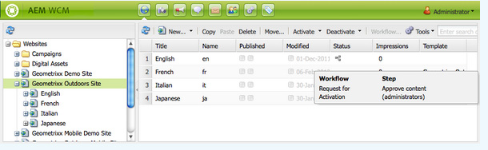
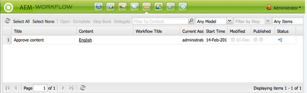

# Deelnemen aan workflows{#participating-in-workflows}

Workflows bevatten doorgaans stappen die vereisen dat een persoon een activiteit op een pagina of element uitvoert. De werkstroom selecteert een gebruiker of groep om de activiteit uit te voeren en wijst een het werkpunt aan die persoon of groep toe.

## Uw werkitems verwerken {#processing-your-work-items}

U kunt de volgende handelingen uitvoeren om een werkitem te verwerken:

* **Volledig**

  U kunt een item voltooien zodat de workflow naar de volgende stap kan gaan.

* **Delegate**

  Als een stap aan u is toegewezen, maar om het even welke reden u geen actie kunt ondernemen, kunt u de stap aan een andere gebruiker of een groep delegeren.

  De gebruikers die voor delegatie beschikbaar zijn hangen af van wie het het werkpunt werd toegewezen:

   * Als het het werkpunt aan een groep werd toegewezen, zijn de groepsleden beschikbaar.
   * Als het het werkpunt aan een groep werd toegewezen en dan aan een gebruiker werd afgevaardigd, zijn de groepsleden en de groep beschikbaar.
   * Als het het werkpunt aan één enkele gebruiker werd toegewezen, kan het het werkpunt niet worden afgevaardigd.

* **Stap terug**

  Als u ontdekt dat een stap, of een reeks stappen, moet worden herhaald kunt u achteruit stappen. Hiermee kunt u een stap selecteren die eerder in de workflow is opgetreden, voor opwerking. De werkstroom keert aan de stap terug u specificeert, dan gaat van daar te werk.

## Deelnemen aan een workflow {#participating-in-a-workflow}

### Meldingen van toegewezen workflowhandelingen {#notifications-of-assigned-workflow-actions}

Wanneer u een werkitem wordt toegewezen (bijvoorbeeld **Inhoud goedkeuren**), worden verschillende waarschuwingen en/of meldingen weergegeven:

* De **kolom van de Status** van de console van Websites wijst erop wanneer een pagina in een werkschema is:

  

* Wanneer u, of een groep die u tot behoort, een het werkpunt als deel van een werkschema wordt toegewezen, verschijnt het het werkpunt in uw Inbox van het Werkschema van de AEM.

  

### Een deelnemersstap voltooien {#completing-a-participant-step}

Nadat u de aangegeven actie hebt uitgevoerd, kunt u het werkitem voltooien, zodat de workflow kan worden voortgezet. Voer de volgende procedure uit om het werkitem te voltooien.

1. Selecteer de werkschemastap en klik de **Volledige** knoop in de hoogste navigatiebar.
1. In de resulterende dialoog, selecteer de **Volgende Stap**; namelijk de stap volgende uit te voeren. In een vervolgkeuzelijst worden alle geschikte doelen weergegeven. A **Commentaar** kan ook zijn ingegaan.

   

   Het aantal vermelde stappen is afhankelijk van het ontwerp van het workflowmodel.

1. Klik **O.K.** om de actie te bevestigen.

### Een deelnemersstap delegeren {#delegating-a-participant-step}

Gebruik de volgende procedure om een het werkpunt te delegeren.

1. Klik de **Afgevaardigde** knoop in de hoogste navigatiebar.
1. In de dialoog, gebruik de drop-down lijst om de **Gebruiker** te selecteren om het het werkpunt aan te delegeren. U kunt a **Commentaar** ook toevoegen.

   

1. Klik **O.K.** om de actie te bevestigen.

### Stap terug op een Stap van de Deelnemer uitvoeren {#performing-step-back-on-a-participant-step}

Gebruik de volgende procedure om terug te gaan.

1. Klik op de knop Stap terug in de bovenste navigatiebalk.
1. Selecteer in het resulterende dialoogvenster de vorige stap, dat wil zeggen de volgende stap, ook al is het een stap die eerder in de workflow plaatsvindt. In een vervolgkeuzelijst worden alle geschikte doelen weergegeven.

   

1. Klik op OK om de handeling te bevestigen.
