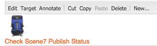

# Scene7-functies toevoegen aan uw pagina{#adding-scene-features-to-your-page}

[Adobe Scene7](https://help.adobe.com/en_US/scene7/using/WS26AB0D9A-F51C-464e-88C8-580A5A82F810.html) is een gehoste oplossing voor het beheren, verbeteren, publiceren en leveren van rijke media-elementen aan Web, mobiele apparaten, e-mail en internetschermen en drukwerk.

U kunt in Scene7 gepubliceerde Experience Managers weergeven in verschillende viewers:

* In-/uitzoomen
* Flyout
* Video
* Afbeeldingssjabloon
* Afbeelding

U kunt digitale elementen rechtstreeks van Experience Manager naar Scene7 publiceren en u kunt digitale elementen van Scene7 naar Experience Manager publiceren.

In dit document wordt beschreven hoe u digitale elementen kunt publiceren van Experience Manager naar Scene7 en omgekeerd. Viewers worden ook in detail beschreven. Voor informatie bij het vormen van Experience Manager voor Scene7, zie [Integrating Scene7 with Experience Manager](/help/sites-administering/scene7.md).

Zie ook [Afbeeldingskaarten toevoegen](/help/assets/image-maps.md).

Raadpleeg de volgende secties voor meer informatie over het gebruik van videocomponenten met Experience Manager:

* [Video](/help/sites-classic-ui-authoring/manage-assets-classic-s7-video.md)

>[!NOTE]
>
>Als Scene7-elementen niet correct worden weergegeven, moet u ervoor zorgen dat Dynamic Media [uitgeschakeld](/help/assets/config-dynamic.md#disabling-dynamic-media) is. Vernieuw vervolgens de pagina.

## Handmatig publiceren naar Scene7 vanaf middelen {#manually-publishing-to-scene-from-assets}

U kunt digitale middelen naar Scene7 publiceren vanuit de middelenconsole in de klassieke gebruikersinterface of rechtstreeks vanuit het element.

>[!NOTE]
>
>Experience Manager publiceert asynchroon naar Scene7. Nadat u op **Publiceren** hebt geklikt, kan het enkele seconden duren voordat uw element naar Scene7 wordt gepubliceerd.

### Publiceren vanaf de middelenconsole {#publishing-from-the-assets-console}

Publiceren naar Scene7 vanaf de middelenconsole als de middelen zich in een Scene7-doelmap bevinden:

1. In de klassieke UI van de Experience Manager, klik **Digitale Activa** om tot het beheer van digitale activa toegang te hebben.

1. Selecteer het element (of de elementen) of de map in de doelmap die u naar Scene7 wilt publiceren, klik met de rechtermuisknop en selecteer **Publiceren naar Scene7**. U kunt ook **Publiceren naar Scene7** selecteren in het **menu Extra**.

   

1. Ga naar Scene7 en bevestig dat de middelen beschikbaar zijn.

   >[!NOTE]
   >
   >Als de elementen zich niet in een gesynchroniseerde Scene7-map bevinden, is **Publiceren naar Scene7** in beide menu&#39;s zichtbaar maar uitgeschakeld.

### Publiceren op basis van een element {#publishing-from-an-asset}

U kunt een element handmatig publiceren zolang dat element zich in de gesynchroniseerde Scene7-map bevindt.

>[!NOTE]
>
>Als het element niet in de gesynchroniseerde Scene7-map staat, wordt de koppeling naar **Publiceren naar Scene7** niet weergegeven.

Direct vanaf een digitaal middel publiceren naar Scene7:

1. Klik in Experience Manager op **Digitale middelen** om toegang te krijgen tot het beheer van digitale elementen.

1. Dubbelklik om een element te openen.

1. Selecteer **Publiceren naar Scene7** in het deelvenster Elementdetails.

   

1. De koppeling wordt gewijzigd in **Publiceren..** en **Gepubliceerd**. Ga naar Scene7 en bevestig dat het middel beschikbaar is.

   >[!NOTE]
   >
   >Als het element niet correct naar Scene7 wordt gepubliceerd, verandert de koppeling in **Publiceren mislukt**. Als het element al naar Scene7 is gepubliceerd, leest de koppeling **Opnieuw publiceren naar Scene7**. Door middel van opnieuw publiceren kunt u wijzigingen aanbrengen in een element in de Experience Manager en deze opnieuw publiceren.

### Elementen publiceren van buiten de CQ-doelmap {#publishing-assets-from-outside-the-cq-target-folder}

Adobe raadt u aan elementen alleen naar Scene7 te publiceren vanuit middelen in de Scene7-doelmap. Als u echter elementen moet uploaden vanuit een map buiten de doelmap, kunt u dat nog steeds doen door ze te uploaden naar een map **ad-hoc** in Scene7.

U doet dit door eerst de configuratie van de Wolk voor de pagina te vormen waar de activa zullen verschijnen. Vervolgens voegt u een Scene7-component aan de pagina toe en sleept u een element naar de component. Nadat de pagina-eigenschappen voor die pagina zijn ingesteld, wordt een **Publiceren naar Scene7**-koppeling weergegeven die het uploaden naar Scene7 activeert wanneer deze optie is geselecteerd.

>[!NOTE]
>
>Elementen in de ad-hocmap worden niet weergegeven in de Scene7 Content Browser.

Elementen publiceren die zich buiten de CQ-doelmap bevinden:

1. In Experience Manager in klassieke UI, klik **Websites** en navigeer aan de Web-pagina die u een digitaal middel aan wilt toevoegen dat nog niet aan Scene7 wordt gepubliceerd. (Normale regels voor paginaovererving zijn van toepassing.)

1. Klik in de assistent op het pictogram **Pagina** en klik op **Pagina-eigenschappen**.

1. Klik op **Cloud Services** en klik op **Services toevoegen** en selecteer **Scene7**.
1. Selecteer in de vervolgkeuzelijst **Adobe Scene7** de gewenste configuratie en klik op **OK**.

   

1. Voeg op de webpagina een Scene7-component toe aan de gewenste locatie op de pagina.
1. Sleep een digitaal element vanuit de zoeker naar de component. U ziet een verbinding aan **Check Scene7 Publication Status**.

   >[!NOTE]
   >
   >Als het digitale element zich in de CQ-doelmap bevindt, wordt geen koppeling naar **Scene7-publicatiestatus controleren** weergegeven. De elementen worden eenvoudig in de component geplaatst.

   

1. Klik **Status Scene7-publicatie controleren**. Als de activa niet worden gepubliceerd, publiceert Experience Manager de activa aan Scene7. Nadat het element is geüpload, bevindt het zich in de ad-hocmap. Standaard bevindt de ad-hocmap zich in de map **name_of_the_company/CQ5_adhoc**. U kunt [dit, indien nodig ](#configuringtheadhocfolder) vormen.

   >[!NOTE]
   >
   >Als het element zich niet in een gesynchroniseerde Scene7-map bevindt en er geen Scene7-cloudconfiguratie is gekoppeld aan de huidige pagina, mislukt het uploaden.

## Scene7-componenten {#scene-components}

De volgende Scene7-componenten zijn beschikbaar in de Experience Manager:

* In-/uitzoomen
* Flyout (zoomen)
* Afbeeldingssjabloon
* Afbeelding
* Video

>[!NOTE]
>
>Deze componenten zijn niet standaard beschikbaar en moeten in de ontwerpmodus worden geselecteerd voordat ze kunnen worden gebruikt.

Nadat ze in de ontwerpmodus beschikbaar zijn gemaakt, kunt u de componenten net als alle andere Experience Managers aan de pagina toevoegen. Elementen die nog niet naar Scene7 zijn gepubliceerd, worden naar Scene7 gepubliceerd als ze zich in een gesynchroniseerde map of op een pagina of met een Scene7-cloudconfiguratie bevinden.

>[!NOTE]
>
>Als u de kijkers van douane S7 en het gebruiken van de Vinder van de Inhoud creeert en ontwikkelt, moet u de **allowfullscreen** parameter uitdrukkelijk toevoegen.

### Kennisgeving over de gebruiksduur van Flash-viewers {#flash-viewers-end-of-life-notice}

Vanaf 31 januari 2017 zal Adobe Scene7 officieel ondersteuning aan het einde van de levensduur van het Flash-viewerplatform bieden.

Zie [Flash Viewer End-of-Life FAQs](https://docs.adobe.com/content/docs/en/aem/6-1/administer/integration/marketing-cloud/scene7/flash-eol.html) voor meer informatie over deze belangrijke wijziging.

### Een Scene7-component toevoegen aan een pagina {#adding-a-scene-component-to-a-page}

Het toevoegen van een Scene7-component aan een pagina is hetzelfde als het toevoegen van een component aan een pagina. Scene7-componenten worden in de volgende secties uitgebreid beschreven.

Een Scene7-component/viewer toevoegen aan een pagina in de klassieke gebruikersinterface:

1. Open in Experience Manager de pagina waaraan u de Scene7-component wilt toevoegen.

1. Als er geen Scene7-componenten beschikbaar zijn, klikt u op de liniaal in het hulpwerkgebied om de modus **Design** te activeren, klikt u op **Edit** parsys en selecteert u alle **Scene7** componenten om deze beschikbaar te maken.

1. Ga terug naar de modus **Bewerken** door op het potlood in het hulpstuk te klikken.

1. Sleep een component van de **Scene7** groep in het hulpstuk op de pagina in de gewenste plaats.

1. Klik **Bewerken** om de component te openen.

1. Bewerk de component naar wens en klik op **OK** om de wijzigingen op te slaan.

### Interactieve kijkervaringen toevoegen aan een responsieve website {#adding-interactive-viewing-experiences-to-a-responsive-website}

Het responsieve ontwerp voor uw middelen betekent dat uw middelen worden aangepast afhankelijk van waar ze worden weergegeven. Bij een responsief ontwerp kunnen dezelfde elementen effectief op meerdere apparaten worden weergegeven.

Een interactieve kijkervaring toevoegen aan een responsieve site in de klassieke gebruikersinterface:

1. Meld u aan bij de Experience Manager en controleer of u [geconfigureerde Adobe Scene7-Cloud Services](/help/sites-administering/scene7.md#configuring-scene-integration) hebt en of Scene7-componenten beschikbaar zijn.

   >[!NOTE]
   >
   >Als Scene7 WCM-componenten niet beschikbaar zijn, moet u deze inschakelen via de ontwerpmodus.

1. In een website waarvoor de Scene7-componenten zijn ingeschakeld, sleept u een **Image**-viewer naar de pagina.
1. Bewerk de component en pas de onderbrekingspunten aan op het tabblad **Scene7 Settings**.

   

1. Controleer of de viewers het formaat responsief wijzigen en of alle interacties zijn geoptimaliseerd voor computers, tablets en mobiele apparaten.

### Gemeenschappelijke instellingen voor alle Scene7-componenten {#settings-common-to-all-scene-components}

Hoewel de configuratieopties variëren, zijn het volgende gemeenschappelijk voor alle componenten van Scene7:

* **Bestandsverwijzing** - Blader naar een bestand waarnaar u wilt verwijzen. De bestandsverwijzing toont de element-URL en niet noodzakelijkerwijs de volledige Scene7-URL inclusief de URL-opdrachten en -parameters. U kunt in dit veld geen Scene7 URL-opdrachten en -parameters toevoegen. Ze moeten worden toegevoegd via de bijbehorende functionaliteit in de component.
* **Breedte**  - Hiermee kunt u de breedte instellen.
* **Hoogte**  - Hiermee kunt u de hoogte instellen.

U stelt deze configuratieopties in door een Scene7-component te openen (dubbelklikken), bijvoorbeeld wanneer u een **Zoom**-component opent:

### In-/uitzoomen {#zoom}

De component HTML5 Zoom geeft een grotere afbeelding weer wanneer u op de knop + drukt.

Het element heeft onderaan zoomgereedschappen. Klik **+** om te vergroten. Klik **-** om te verminderen. Als u op de **x** of de zoompijl herstellen klikt, wordt de oorspronkelijke grootte van de afbeelding hersteld. Klik op de diagonale pijlen om deze op volledig scherm weer te geven. Klik **Bewerken** om de component te configureren. Met deze component, kunt u [montages vormen gemeenschappelijk voor alle componenten van Scene7](#settings-common-to-all-scene-components).

### Flyout {#flyout}

In de HTML5 Flyout-component wordt het element weergegeven als gesplitst scherm. het element in de opgegeven grootte laten staan; rechts wordt het zoomgedeelte weergegeven. Klik **Bewerken** om de component te configureren. Met deze component, kunt u [montages vormen gemeenschappelijk voor alle componenten van Scene7](/help/sites-administering/scene7.md#settingscommontoallscene7components).

>[!NOTE]
>
>Als uw Flyout-component een aangepaste grootte gebruikt, wordt die aangepaste grootte gebruikt en wordt de responsieve instelling van de component uitgeschakeld.
>
>Als de component Flyout de standaardgrootte gebruikt, zoals die in de ontwerpweergave is ingesteld, wordt de standaardgrootte gebruikt en wordt de component uitgerekt om de grootte van de paginalay-out aan te passen met de responsieve instelling van de component ingeschakeld. Houd er echter rekening mee dat er een beperking geldt voor de responsieve installatie van de component. Wanneer u de component Flyout met ontvankelijke opstelling gebruikt, zou u het niet met volledige paginalrek moeten gebruiken. Anders kan de Flyout de rechterrand van de pagina overschrijden.

### Afbeelding {#image}

Met de Scene7 Image-component kunt u Scene7-functionaliteit aan uw afbeeldingen toevoegen, zoals Scene7-wijzigingstoetsen, voorinstellingen voor afbeeldingen of viewers en verscherpen. De Scene7-afbeeldingscomponent is vergelijkbaar met andere afbeeldingscomponenten in Experience Manager met speciale Scene7-functionaliteit. In dit voorbeeld is op de afbeelding de Scene7 URL-modifier **&amp;op_invert=1** toegepast.

**Titel, Alt** TextIn het tabblad Geavanceerd voegt u een titel toe aan de afbeelding en alternatieve tekst voor gebruikers die afbeeldingen hebben uitgeschakeld.

**URL, Open** inU kunt een middel van plaatsen om een verbinding te openen. Stel de URL in en kies Openen in om aan te geven of deze in hetzelfde venster of in een nieuw venster moet worden geopend.

**Viewer-** voorinstellingSelecteer een bestaande viewervoorinstelling in het keuzemenu. Als de viewervoorinstelling die u zoekt niet zichtbaar is, moet u deze mogelijk zichtbaar maken. Zie Viewer-voorinstellingen beheren. U kunt geen viewervoorinstelling selecteren als u een voorinstelling voor afbeeldingen gebruikt en andersom.

**Scene7** ConfigurationSelecteer de configuratie van Scene7 u wilt gebruiken om actieve beeldvoorinstellingen van SPS te halen.

**AfbeeldingsvoorinstellingSelecteer een bestaande voorinstelling voor de afbeelding in het keuzemenu.** Als de voorinstelling die u zoekt niet zichtbaar is, moet u deze mogelijk zichtbaar maken. Zie Voorinstellingen afbeelding beheren. U kunt geen viewervoorinstelling selecteren als u een voorinstelling voor afbeeldingen gebruikt en andersom.

**Uitvoerindeling** Selecteer de uitvoerindeling van de afbeelding, bijvoorbeeld jpeg. Afhankelijk van de uitvoerindeling die u selecteert, hebt u mogelijk aanvullende configuratieopties. Zie Aanbevolen werkwijzen voor voorinstellingen afbeelding.

**** VerscherpenSelecteer hoe u de afbeelding wilt verscherpen. Verscherpen wordt gedetailleerd uitgelegd in de aanbevolen werkwijzen voor voorinstellingen van afbeeldingen en in de aanbevolen werkwijzen voor Verscherpen.

**URL-** modifiersU kunt afbeeldingseffecten wijzigen door extra opdrachten voor een S7-afbeelding te geven. Deze worden beschreven in Voorinstellingen afbeelding en de opdrachtverwijzing.

**** OnderbrekingspuntenAls uw website reageert, wilt u de onderbrekingspunten aanpassen. Onderbrekingspunten moeten worden gescheiden door komma&#39;s (,).

### Afbeeldingssjabloon {#image-template}

[Scene7 Image ](https://help.adobe.com/en_US/scene7/using/WS60B68844-9054-4099-BF69-3DC998A04D3C.html) Templatesare gelaagde Photoshop-inhoud die naar Scene7 is geïmporteerd, waar inhoud en eigenschappen zijn geparametriseerd voor variabiliteit. Met de component **Afbeeldingssjabloon** kunt u afbeeldingen importeren en de tekst dynamisch in Experience Manager wijzigen. Daarnaast kunt u de **Afbeeldingssjabloon** configureren om waarden uit de clientcontext te gebruiken, zodat elke gebruiker de afbeelding op een gepersonaliseerde manier ervaart.

Klik **Bewerken** om de component te configureren. U kunt [instellingen configureren die hetzelfde zijn voor alle Scene7-componenten](/help/sites-administering/scene7.md#settingscommontoallscene7components) en andere instellingen die in deze sectie worden beschreven.

**Bestandsverwijzing, Breedte en** HoogteZie gemeenschappelijke instellingen voor alle Scene7-componenten.

>[!NOTE]
>
>Scene7 URL-opdrachten en -parameters kunnen niet rechtstreeks aan de URL van de bestandsverwijzing worden toegevoegd. Ze kunnen alleen worden gedefinieerd in de interface van de component in het deelvenster **Parameter**.

**Titel, Alt** TextIn het tabblad Afbeeldingssjabloon van Scene7 voegt u een titel toe aan de afbeelding en alternatieve tekst voor gebruikers die afbeeldingen hebben uitgeschakeld.

**URL, Open** inU kunt een middel van plaatsen om een verbinding te openen. Stel de URL in en kies Openen in om aan te geven of deze in hetzelfde venster of in een nieuw venster moet worden geopend.

**Parameter** PanelWanneer u een afbeelding importeert, worden de parameters vooraf gevuld met informatie uit de afbeelding. Als er geen inhoud is die dynamisch kan worden gewijzigd, is dit venster leeg.

#### Tekst dynamisch wijzigen {#changing-text-dynamically}

Als u de tekst dynamisch wilt wijzigen, voert u nieuwe tekst in de velden in en klikt u op **OK**. In dit voorbeeld is **Price** nu $50 en is de verzending 99 cent.

De tekst in de afbeelding verandert. U kunt de tekst terugstellen naar de oorspronkelijke waarde door op **Herstellen** naast het veld te klikken.

#### Tekst wijzigen om de waarde van de context van een client weer te geven {#changing-text-to-reflect-the-value-of-a-client-context-value}

Als u een veld aan een clientcontextwaarde wilt koppelen, klikt u op **Selecteren** om het contextmenu van de client te openen, selecteert u de clientcontext en klikt u op **OK**. In dit voorbeeld verandert de naam op basis van de koppeling van de naam met de opgemaakte naam in het profiel.

De tekst geeft de naam weer van de gebruiker die momenteel is aangemeld. U kunt de tekst terugstellen naar de oorspronkelijke waarde door op **Herstellen** naast het veld te klikken.

#### Van de Scene7-afbeeldingssjabloon een koppeling maken {#making-the-scene-image-template-a-link}

Een klikbare koppeling maken van de Scene7-afbeeldingssjablooncomponent:

1. Klik op **Bewerken** op de pagina met de Scene7-afbeeldingssjablooncomponent.
1. Voer in het veld **URL** de URL in waarnaar gebruikers gaan wanneer op de afbeelding wordt geklikt. Selecteer in het veld **Openen in** of u het doel wilt openen (een nieuw venster of hetzelfde venster).

   

1. Klik **OK**.

### Videocomponent {#video-component}

De Scene7 **Video**-component (beschikbaar in het Scene7-gedeelte van het hulpstuk) gebruikt apparaat- en bandbreedtedetectie voor de juiste video voor elk scherm. Deze component is een HTML5-videospeler; het is één viewer die via meerdere kanalen kan worden gebruikt.

Deze kan worden gebruikt voor adaptieve videosets, één MP4-video of één F4V-video.

Zie [Video](/help/sites-classic-ui-authoring/manage-assets-classic-s7-video.md) voor meer informatie over hoe video&#39;s werken met Scene7-integratie. Bovendien zie hoe [de **Scene7 video** component zich met de stichting **video** component](/help/sites-classic-ui-authoring/manage-assets-classic-s7-video.md) vergelijkt.

### Bekende beperkingen voor de videocomponent {#known-limitations-for-the-video-component}

Adobe DAM en WCM laten zien of een primaire bronvideo is geüpload. Deze proxy-elementen worden niet weergegeven:

* Scene7-gecodeerde uitvoeringen
* Scene7 adaptieve videosets

Wanneer u een adaptieve videoset gebruikt met de Scene7-video-component, moet de grootte van de component worden aangepast aan de afmetingen van de video.

## Scene7 Content Browser {#scene-content-browser}

Met de Scene7-inhoudbrowser kunt u inhoud van Scene7 rechtstreeks in Experience Manager weergeven. Als u de inhoudbrowser wilt openen, selecteert u **Scene7** in de gebruikersinterface met geoptimaliseerde aanrakingen of het pictogram **S7** in de klassieke gebruikersinterface. De functionaliteit is identiek tussen beide gebruikersinterfaces.

Als u veelvoudige configuraties hebt, toont de Experience Manager door gebrek [standaardconfiguratie](/help/sites-administering/scene7.md#configuring-a-default-configuration). U kunt verschillende configuraties rechtstreeks selecteren in de Scene7-inhoudbrowser in de vervolgkeuzelijst.

>[!NOTE]
>
>* Middelen in de ad-hocmap worden niet weergegeven in de Scene7-inhoudbrowser.
>* Wanneer [Beveiligde voorvertoning is ingeschakeld](/help/sites-administering/scene7.md#configuring-the-state-published-unpublished-of-assets-pushed-to-scene), worden zowel gepubliceerde als niet-gepubliceerde elementen op Scene7 wel weergegeven in de Scene7-inhoudbrowser.
>* Als u **Scene7** of het **S7** pictogram niet als optie in inhoudbrowser ziet, moet u [vormen Scene7 om met Experience Manager](/help/sites-administering/scene7.md) te werken.
>* Voor video ondersteunt de Scene7-inhoudbrowser:
   >   * Adaptieve videosets: container met alle video-uitvoeringen die nodig zijn voor naadloze weergave op meerdere schermen
   >   * Eén MP4-video
   >   * Single F4V-video

### Door inhoud bladeren {#browsing-content-in-the-classic-ui}

Blader door inhoud in Scene7 door op het tabblad **S7** te klikken.

U kunt de configuratie veranderen u toegang hebt door de configuratie te selecteren.De omslagen veranderen afhankelijk van welke configuratie u selecteert.

Net als bij de zoekfunctie voor inhoud naar Middelen kunt u zoeken naar elementen en resultaten filteren. Nochtans, in tegenstelling tot de Finder van Activa, wanneer het ingaan van een sleutelwoord op **S7** tabel, begint het dossier - naam **met** het koord dat u inging, eerder dan **bevattend** het sleutelwoord in het dossier - naam.

Elementen worden standaard weergegeven op bestandsnaam. U kunt resultaten ook filteren op type element.

>[!NOTE]
>
>Voor video ondersteunt de Scene7-inhoudbrowser van WCM:
>
>* Adaptieve videosets: container met alle video-uitvoeringen die nodig zijn voor naadloze weergave op meerdere schermen
>* Eén MP4-video
>* Single F4V-video

>

### Scene7-elementen zoeken met de inhoudbrowser {#searching-for-scene-assets-with-the-content-browser}

Het zoeken naar Scene7-elementen lijkt op het zoeken naar Experience Manager-elementen, maar wanneer u een zoekopdracht uitvoert, ziet u in feite een externe weergave van de elementen in het Scene7-systeem in plaats van deze rechtstreeks in de Experience Manager te importeren.

U kunt zowel de klassieke interface als de interface met geoptimaliseerde aanrakingen gebruiken om elementen weer te geven en te zoeken. Afhankelijk van de interface, is hoe u zoekt lichtjes verschillend.

Wanneer u in een van beide UI zoekt, kunt u filteren op de volgende criteria (die hier in de voor aanraking geoptimaliseerde UI worden getoond):

**Voer** trefwoorden in. U kunt elementen zoeken op naam. Wanneer u de trefwoorden zoekt die u invoert, begint de bestandsnaam met. Als u bijvoorbeeld het woord &quot;zwemmen&quot; typt, wordt gezocht naar namen van elementbestanden die met die letters in die volgorde beginnen. Vergeet niet op Enter te klikken nadat u de term hebt getypt om het element te zoeken.

**Map/** padDe naam van de map die wordt weergegeven, is gebaseerd op de configuratie die u hebt geselecteerd. U kunt tot lagere niveaus boor door het omslagpictogram te klikken en een subomslag te selecteren, dan het controleteken te klikken om het te selecteren.

Als u een sleutelwoord ingaat en een omslag selecteert, zoekt de Experience Manager die omslag en om het even welke subfolders. Als u echter bij het zoeken geen trefwoorden invoert, worden bij het selecteren van de map alleen de elementen in die map weergegeven en worden er geen submappen opgenomen.

Standaard zoekt de Experience Manager naar de geselecteerde map en naar alle submappen.

**Type** AssetSelect Scene7 om door Scene7-inhoud te bladeren. Deze optie is alleen beschikbaar als Scene7 is geconfigureerd.

**** ConfigurationIf you have more than one Scene7 configuration defined in Cloud Services, you can select het hier. Hierdoor wordt de map gewijzigd op basis van de gekozen configuratie.

**ElementtypeIn de Scene7-browser kunt** u de resultaten filteren en de volgende items opnemen: afbeeldingen, sjablonen, video&#39;s en adaptieve videosets. Als u geen elementtype selecteert, zoekt Experience Manager standaard naar alle elementtypen.

>[!NOTE]
>
>* In klassieke UI, kunt u ook naar **Flash** en **FXG** zoeken. Filteren hiervoor in de interface met geoptimaliseerde aanrakingen wordt momenteel niet ondersteund.
   >
   >
* Bij het zoeken naar video zoekt u op één vertoning. Resultaten retourneren de oorspronkelijke uitvoering (alleen *.mp4) en de gecodeerde uitvoering.
* Wanneer u in een adaptieve videoset zoekt, zoekt u in de map en in alle submappen, maar alleen als u een trefwoord aan de zoekopdracht hebt toegevoegd. Als u geen trefwoord hebt toegevoegd, doorzoekt Experience Manager de submappen niet.

**PublicatiestatusU kunt** filteren op elementen die zijn gebaseerd op de publicatiestatus: Niet gepubliceerd of gepubliceerd. Als u geen publicatiestatus selecteert, zoekt de Experience Manager standaard naar alle publicatiestatussen.

