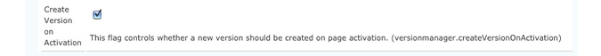

# OSGi configureren{#configuring-osgi}

[ OSGi ](https://www.osgi.org/) is een fundamenteel element in de technologiestapel van Adobe Experience Manager (AEM). Het wordt gebruikt om de samengestelde bundels van AEM en hun configuratie te controleren.

OSGi &quot;*verstrekt de gestandaardiseerde primitieven die toepassingen toestaan om van kleine, herbruikbare, en samenwerkingscomponenten worden geconstrueerd. Deze componenten kunnen in een toepassing worden samengesteld en worden opgesteld*&quot;.

Zo kunt u bundels eenvoudig beheren, aangezien ze kunnen worden gestopt, geïnstalleerd en afzonderlijk kunnen worden gestart. De onderlinge afhankelijkheden worden automatisch verwerkt. Elke Component OSGi (zie de [ Specificatie OSGi ](https://docs.osgi.org/specification/)) is bevat in één van de diverse bundels.

U kunt de configuratie-instellingen voor dergelijke bundels beheren door:

* gebruikend de [ console van het Web van Adobe CQ ](#osgi-configuration-with-the-web-console)
* het gebruiken van [ configuratiedossiers ](#osgi-configuration-with-configuration-files)
* het vormen [ inhoud-knopen ( `sling:OsgiConfig`) in de bewaarplaats ](#osgi-configuration-in-the-repository)

Één van beide methode kan worden gebruikt hoewel er subtiele verschillen zijn, hoofdzakelijk met betrekking tot [ Wijzen van de Looppas ](/help/sites-deploying/configure-runmodes.md):

* [Adobe CQ-webconsole](#osgi-configuration-with-the-web-console)

   * De console van het Web is de standaardinterface voor configuratie OSGi. Deze interface biedt een interface voor het bewerken van de verschillende eigenschappen, waarbij mogelijke waarden uit vooraf gedefinieerde lijsten kunnen worden geselecteerd.

     Als zodanig is het de eenvoudigste methode om te gebruiken.

   * Om het even welke configuraties die met de Console van het Web worden aangebracht worden onmiddellijk toegepast en van toepassing op de huidige instantie, ongeacht de huidige looppaswijze, of om het even welke verdere veranderingen in de looppaswijze.

* [configuratiebestanden](#osgi-configuration-with-configuration-files)

   * Bevat instellingen die zijn gedefinieerd in de webconsole.
   * Kan worden opgenomen in inhoudspakketten voor gebruik op andere instanties.

* [content-nodes (sling:osgiConfig) in de repository](#osgi-configuration-in-the-repository)

   * Vereist handconfiguratie gebruikend CRXDE Lite.
   * Wegens de noemende overeenkomsten van de `sling:OsgiConfig` knopen, kunt u de configuratie aan een specifieke [ looppaswijze ](/help/sites-deploying/configure-runmodes.md) binden. U kunt zelfs configuraties voor meer dan één uitvoeringswijze in de zelfde bewaarplaats opslaan.
   * Eventuele geschikte configuraties worden direct toegepast (afhankelijk van de uitvoeringsmodus).

Welke methode u ook gebruikt, al deze configuratiemethoden:

* Zorg ervoor dat bij het kopiëren of repliceren van de inhoud van de opslagplaats identieke configuraties worden hersteld.
* Hiermee kunt u configuraties uitchecken naar FileVault of Subversion; voor beveiliging of verdere updates.
* Kan in pakketten worden opgeslagen voor gebruik bij het instellen van andere instanties.
* Laat u configuratierolouts uitvoeren gebruikend manuscripten om de configuratiedetails te verspreiden.

>[!NOTE]
>
>De details van bepaalde belangrijke montages zijn vermeld onder [ de Montages van de Configuratie OSGi.](/help/sites-deploying/osgi-configuration-settings.md)

## OSGi Configuratie met de Console van het Web {#osgi-configuration-with-the-web-console}

De [ console van het Web ](/help/sites-deploying/web-console.md) in AEM verstrekt een gestandaardiseerde interface voor het vormen van de bundels. Het **lusje van de Configuratie** wordt gebruikt voor het vormen van de bundels OSGi, en is daarom het onderliggende mechanisme om AEM systeemparameters te vormen.

Eventuele aangebrachte wijzigingen worden onmiddellijk toegepast op de relevante OSGi-configuratie. Er is geen herstart nodig.

>[!NOTE]
>
>De veranderingen die in de Webconsole worden aangebracht worden bewaard in de bewaarplaats als [ configuratiedossiers ](#osgi-configuration-with-configuration-files). Deze bestanden kunnen worden opgenomen in inhoudspakketten voor hergebruik in verdere installaties.

>[!NOTE]
>
>Voor de console van het Web, hebben om het even welke beschrijvingen die standaardmontages vermelden met het Verschuiven gebreken.
>
>Adobe Experience Manager heeft zijn eigen gebreken en zo zouden de gebreken die worden geplaatst van de gebreken kunnen verschillen die op de console worden gedocumenteerd.

Om een configuratie met de Webconsole bij te werken:

1. Heb toegang tot het **lusje van de Configuratie** van de Console van het Web door of:

   * Het openen van de Webconsole van de verbinding op het **Hulpmiddel > het menu van Verrichtingen**. Na het registreren in de console, kunt u het drop-down menu gebruiken van:

     **OSGi >**

   * De directe URL, bijvoorbeeld:

     `http://localhost:4502/system/console/configMgr`

   Er wordt een lijst weergegeven.

1. Selecteer de bundel die u door één van beiden wilt vormen:

   * klikkend **geef** pictogram voor die bundel uit
   * klikkend de **Naam** van de bundel

1. Er wordt een dialoogvenster geopend. Hier kunt u desgewenst bewerken. Bijvoorbeeld, plaats het **Niveau van het Logboek** aan `INFO`:

   

   >[!NOTE]
   >
   >De updates worden bewaard in de bewaarplaats als [ configuratiedossiers ](#osgi-configuration-with-configuration-files). Als u deze bestanden achteraf wilt zoeken en wilt opnemen in een inhoudspakket voor gebruik op een andere instantie, noteert u bijvoorbeeld de blijvende identiteit ( `PID` ).

1. Klik **sparen**.

   Uw veranderingen worden onmiddellijk toegepast op de relevante configuratie OSGi van het lopende systeem, wordt geen nieuw begin vereist.

   >[!NOTE]
   >
   >U kunt van de verwante [ configuratiedossiers ](#osgi-configuration-with-configuration-files) nu de plaats bepalen. Bijvoorbeeld om op te nemen in een inhoudspakket voor gebruik op een andere instantie.

## OSGi-configuratie met configuratiebestanden {#osgi-configuration-with-configuration-files}

Wijzigingen in de configuratie die zijn aangebracht met de webconsole blijven in de opslagplaats aanwezig als configuratiebestanden ( `.config`) onder:

`/apps`

Deze bestanden kunnen worden opgenomen in inhoudspakketten en opnieuw worden gebruikt in andere gevallen.

>[!NOTE]
>
>De indeling van de configuratiebestanden is specifiek. Raadpleeg de documentatie bij Sling Apache voor:
>* de volledige details van [ het Model van de Levering Apache Sling en Apache SlingStart ](https://sling.apache.org/documentation/development/slingstart.html#default-configuration-format).
>* leerprogramma&#39;s en voorbeelden van [ het Krijgen Middelen en Eigenschappen in het Verdelen ](https://sling.apache.org/documentation/tutorials-how-tos/getting-resources-and-properties-in-sling.html).
>
>Daarom wordt aangeraden het configuratiebestand te maken en te onderhouden door werkelijke wijzigingen aan te brengen in de webconsole.

De console van het Web toont geen aanwijzing van waar in de bewaarplaats dat uw veranderingen zijn bewaard, maar zij kunnen gemakkelijk worden gevestigd:

1. Creeer het configuratiedossier door [ een aanvankelijke verandering in de Webconsole ](#osgi-configuration-with-the-web-console) te maken.
1. Open CRXDE Lite.
1. In het **menu van Hulpmiddelen**, uitgezochte **Vraag...**.
1. Om naar PID van de configuratie te zoeken die u hebt bijgewerkt, voorlegt een vraag van **Type** `SQL`.

   Bijvoorbeeld, **heeft de Console van het Beheer van de Felix OSGi van de Felix** de blijvende identiteit (PID) van:

   `org.apache.felix.webconsole.internal.servlet.OsgiManager`

   De SQL-query zou dus kunnen zijn:

   ```shell
   select * from nt:base where jcr:path like '/apps/%' and contains(*, 'org.apache.felix.webconsole.internal.servlet.OsgiManager')
   ```

1. Het knooppunt voor configuratiebestanden wordt weergegeven.

   In het bovenstaande voorbeeld:

   `/apps/system/config/org.apache.felix.webconsole.internal.servlet.OsgiManager.config`

   >[!CAUTION]
   >
   >U kunt dit bestand openen om uw wijzigingen weer te geven, maar om typefouten te voorkomen, is het raadzaam werkelijke wijzigingen aan te brengen met de console.

1. U kunt nu een inhoudspakket maken dat dit knooppunt bevat en dat naar wens op de andere instanties wordt gebruikt.

## OSGi-configuratie in de opslagplaats {#osgi-configuration-in-the-repository}

Naast het gebruik van de webconsole kunt u ook configuratiegegevens definiëren in de opslagplaats. Zo kunt u de verschillende uitvoeringsmodi eenvoudig configureren.

Deze configuraties worden gemaakt door `sling:OsgiConfig` knooppunten in de opslagplaats te maken waarnaar het systeem verwijst. Deze knopen weerspiegelen de configuraties OSGi, en een gebruikersinterface wordt gevormd aan hen. Om de configuratiegegevens bij te werken, werkt u de knoopeigenschappen bij.

Als u de configuratiegegevens in de bewaarplaats wijzigt, worden de veranderingen onmiddellijk toegepast op de relevante configuratie OSGi. Het is alsof de veranderingen gebruikend de console van het Web, met de aangewezen bevestiging en consistentiecontroles waren aangebracht. Deze workflow is ook van toepassing op het kopiëren van een configuratie van `/libs/` naar `/apps/` .

Aangezien de zelfde configuratieparameter op verscheidene plaatsen is, is het systeem:

* zoekopdrachten naar alle knooppunten van het type `sling:OsgiConfig`
* filters volgens de dienstnaam
* filters op basis van de uitvoermodus

>[!NOTE]
>
>Lees ook [ hoe te om een op bewaarplaats-gebaseerde configuratie voor een specifieke instantie slechts ](https://experienceleague.adobe.com/docs/experience-cloud-kcs/kbarticles/KA-17500.html) te bepalen.

### Een nieuwe configuratie toevoegen aan de opslagplaats {#adding-a-new-configuration-to-the-repository}

#### Wat u moet weten {#what-you-need-to-know}

Om een configuratie aan de bewaarplaats toe te voegen, moet u het volgende weten:

1. De **Blijvende Identiteit** (PID) van de dienst.

   Verwijs het **gebied van Configuraties** in de console van het Web. De naam wordt getoond in steunen na de bundelnaam (of in de **Informatie van de Configuratie** naar de bodem van de pagina).

   Bijvoorbeeld, creeer een knoop `com.day.cq.wcm.core.impl.VersionManagerImpl.` om **AEM de Manager van de Versie van WCM** te vormen.

   

1. Is een specifieke [ looppaswijze ](/help/sites-deploying/configure-runmodes.md) vereist? Maak de map:

   * `config` - voor alle runmodi
   * `config.author` - voor de auteursomgeving
   * `config.publish` - voor de publicatieomgeving
   * `config.<run-mode>` - indien van toepassing

1. Is a **Configuratie** of **de Configuratie van de Fabriek** noodzakelijk?
1. De individuele te vormen parameters, met inbegrip van om het even welke bestaande parameterdefinities die moeten worden ontspannen.

   Verwijs het individuele parametergebied in de console van het Web. De naam wordt tussen haakjes weergegeven voor elke parameter.

   Maak bijvoorbeeld een eigenschap
   `versionmanager.createVersionOnActivation` om **te vormen creeer Versie op Activering**.

   

1. Bestaat er een configuratie in `/libs`? Om van alle configuraties in uw instantie een lijst te maken, gebruik het **hulpmiddel van de Vraag** in CRXDE Lite om de volgende SQL vraag voor te leggen:

   `select * from sling:OsgiConfig`

   Als dat het geval is, kan deze configuratie naar ` /apps/<yourProject>/` worden gekopieerd en vervolgens op de nieuwe locatie worden aangepast.

#### De configuratie maken in de opslagplaats {#creating-the-configuration-in-the-repository}

Om de nieuwe configuratie aan de bewaarplaats eigenlijk toe te voegen:

1. Gebruik CRXDE Lite om te navigeren naar:

   ` /apps/<yourProject>`

1. Als deze niet bestaat, maakt u de map `config` ( `sling:Folder` ):

   * `config` - van toepassing op alle runmodi
   * `config.<run-mode>` - specifiek voor een bepaalde looppaswijze

1. Onder deze map maakt u een knooppunt:

   * Type: `sling:OsgiConfig`
   * Naam: de persistente identiteit (PID);

     Gebruik bijvoorbeeld voor AEM WCM Version Manager `com.day.cq.wcm.core.impl.VersionManagerImpl`

   >[!NOTE]
   >
   >Als u een fabrieksconfiguratie maakt, voegt u `-<identifier>` aan de naam toe.
   >
   >As in: `org.apache.sling.commons.log.LogManager.factory.config-<identifier>`
   >
   >Waar `<identifier>` wordt vervangen door vrije tekst die u (moet) invoeren om het exemplaar te identificeren (u kunt deze informatie niet weglaten), bijvoorbeeld:
   >
   >`org.apache.sling.commons.log.LogManager.factory.config-MINE`

1. Voor elke parameter die u wilt vormen, creeer een bezit op deze knoop:

   * Naam: de parameternaam zoals die in de console van het Web wordt getoond; de naam wordt getoond tussen haakjes aan het eind van de gebiedsbeschrijving. Bijvoorbeeld voor `Create Version on Activation` use `versionmanager.createVersionOnActivation`
   * Type: naargelang het geval.
   * Waarde: naar wens.

   U moet eigenschappen voor de parameters slechts tot stand brengen die u wilt vormen, anderen nemen nog de standaardwaarden zoals die door AEM worden geplaatst.

1. Sla alle wijzigingen op.

   De veranderingen worden toegepast wanneer de knoop door de dienst opnieuw te beginnen (zoals met veranderingen die in de console van het Web worden aangebracht) wordt bijgewerkt.

>[!CAUTION]
>
>Wijzig niets in het `/libs` -pad.

>[!CAUTION]
>
>De volledige weg van een configuratie moet correct zijn om het bij opstarten te lezen.

## Configuratiedetails {#configuration-details}

### Volgorde resolutie bij opstarten {#resolution-order-at-startup}

De volgende rangorde wordt gebruikt:

1. Bewaargegevensknooppunten onder `/apps/*/config...` .either met type `sling:OsgiConfig` - of eigenschapsbestanden.

1. Opslagknooppunten met het type `sling:OsgiConfig` onder `/libs/*/config...` . (definities buiten de box).

1. Alle `.config` bestanden van `<*cq-installation-dir*>/crx-quickstart/launchpad/config/...` . op het lokale bestandssysteem.

Een algemene configuratie in `/libs` kan door een project-specifieke configuratie in `/apps` worden gemaskeerd.

### Volgorde van resolutie bij uitvoering {#resolution-order-at-runtime}

De veranderingen van de configuratie die worden aangebracht terwijl het systeem loopt teweegbrengen een herlading met de gewijzigde configuratie.

Dan is de volgende orde van belangrijkheid van toepassing:

1. Het wijzigen van een configuratie in de console van het Web neemt onmiddellijk effect aangezien het belangrijkheid bij runtime neemt.
1. Het wijzigen van een configuratie in `/apps` wordt onmiddellijk van kracht.
1. Het wijzigen van een configuratie in `/libs` wordt onmiddellijk van kracht, tenzij het door een configuratie in `/apps` wordt gemaskeerd.

### Resolutie van meerdere uitvoermodi {#resolution-of-multiple-run-modes}

Voor configuraties die specifiek zijn voor de uitvoermodus, kunnen meerdere uitvoermodi worden gecombineerd. U kunt bijvoorbeeld configuratiemappen in de volgende stijl maken:

`/apps/*/config.<runmode1>.<runmode2>/`

Configuraties in dergelijke mappen worden toegepast als alle uitvoermodi overeenkomen met een uitvoeringsmodus die bij het opstarten is gedefinieerd.

Als een instantie bijvoorbeeld is gestart met de uitvoeringsmodi `author,dev,emea` , worden de configuratieknooppunten in `/apps/*/config.emea` , `/apps/*/config.author.dev/` en `/apps/*/config.author.emea.dev/` toegepast, terwijl de configuratieknooppunten in `/apps/*/config.author.asean/` en `/config/author.dev.emea.noldap/` niet worden toegepast.

Als meerdere configuraties voor dezelfde PID van toepassing zijn, wordt de configuratie met het hoogste aantal overeenkomende uitvoeringsmodi toegepast.

Als een instantie bijvoorbeeld is gestart met de uitvoermodi `author,dev,emea` en zowel `/apps/*/config.author/` als `/apps/*/config.emea.author/` een configuratie definiëren voor
`com.day.cq.wcm.core.impl.VersionManagerImpl` wordt de configuratie in `/apps/*/config.emea.author/` toegepast.

De granulariteit van deze regel staat op een PID-niveau.
U kunt bepaalde eigenschappen voor dezelfde PID niet definiëren in `/apps/*/config.author/` en niet meer in `/apps/*/config.emea.author/` voor dezelfde PID.
De configuratie met het hoogste aantal passende looppaswijzen is effectief voor volledige PID.

### Standaardconfiguraties {#standard-configurations}

De volgende lijst toont een kleine selectie van de configuraties beschikbaar (in een standaardinstallatie) in de bewaarplaats:

* Auteur - AEM WCM-filter:

  `libs/wcm/core/config.author/com.day.cq.wcm.core.WCMRequestFilter`

* Publish - AEM WCM-filter:

  `libs/wcm/core/config.publish/com.day.cq.wcm.core.WCMRequestFilter`

* Publish - AEM WCM-paginatistieken:

  `libs/wcm/core/config.publish/com.day.cq.wcm.core.stats.PageViewStatistics`

>[!NOTE]
>
>Aangezien deze configuraties zich in `/libs` bevinden, mogen ze niet rechtstreeks worden bewerkt, maar worden gekopieerd naar het toepassingsgebied ( `/apps` ) voordat ze worden aangepast.

Om van alle configuratieknooppunten in uw instantie een lijst te maken, gebruik de **functionaliteit van de Vraag** in CRXDE Lite om de volgende SQL vraag voor te leggen:

`select * from sling:OsgiConfig`

### Configuratievolstand {#configuration-persistence}

* Als u een configuratie door de console van het Web verandert, wordt het (gewoonlijk) geschreven in de bewaarplaats bij:

  `/apps/{somewhere}`

   * Standaard is `{somewhere}` `system/config` de configuratie waarnaar wordt geschreven

     `/apps/system/config`

   * Als u echter een configuratie bewerkt die oorspronkelijk van elders in de opslagplaats afkomstig was, bijvoorbeeld:

     /libs/foo/config/someconfig

     Dan wordt de bijgewerkte configuratie geschreven onder de originele plaats; bijvoorbeeld:

     `/apps/foo/config/someconfig`

* Instellingen die door `admin` worden gewijzigd, worden in `*.config` -bestanden opgeslagen onder:

  ```
     /crx-quickstart/launchpad/config
  ```

   * Dit gebied is de privé gegevens van OSGi configuratieadmin en houdt alle configuratiedetails die door `admin` worden gespecificeerd, ongeacht hoe zij het systeem inging.
   * Dit gebied is een implementatiedetail en u mag deze map nooit rechtstreeks bewerken.
   * Het is echter handig om de locatie van deze configuratiebestanden te kennen, zodat u kopieën kunt maken voor back-up, meerdere installaties of beide:

      * Apache Felix OSGi Management Console

        `../crx/org/apache/felix/webconsole/internal/servlet/OsgiManager.config`

      * CRX Sling Client Repository

        `../com/day/crx/sling/client/impl/CRXSlingClientRepository/<pid-nr>.config`

>[!CAUTION]
>
>Bewerk nooit de mappen of bestanden onder:
>
>`/crx-quickstart/launchpad/config`
