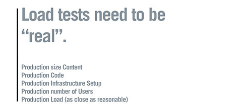

# Optimalisatie van prestaties {#performance-optimization}

>[!NOTE]
>
>Voor algemene richtlijnen over prestaties, lees de [ pagina van de Richtlijnen van Prestaties ](/help/sites-deploying/performance-guidelines.md).
>
>Voor meer informatie over het oplossen van problemen en het bevestigen van prestatieskwesties, zie ook de [ boom van Prestaties ](/help/sites-deploying/performance-tree.md).
>
>Ook, kunt u een artikel van de Kennisbank op [ Prestaties herzien richtend Tips ](https://experienceleague.adobe.com/nl/docs/experience-cloud-kcs/kbarticles/ka-17466).

Een belangrijk probleem is de tijd die uw website nodig heeft om te reageren op bezoekersverzoeken. Hoewel deze waarde voor elke aanvraag varieert, kan een gemiddelde doelwaarde worden bepaald. Zodra deze waarde zowel haalbaar als houdbaar is, kan deze worden gebruikt om de prestaties van de website te controleren en de ontwikkeling van potentiële problemen aan te geven.

De responstijden die u wilt opgeven, verschillen per auteur- en publicatieomgeving en weerspiegelen de verschillende kenmerken van het doelpubliek:

## Auteursomgeving {#author-environment}

Deze omgeving wordt gebruikt door auteurs die inhoud invoeren en bijwerken. Er moet rekening worden gehouden met een paar gebruikers die elk een groot aantal prestatie-intensieve aanvragen genereren bij het bijwerken van inhoudspagina&#39;s en de afzonderlijke elementen op die pagina&#39;s.

## Publish-omgeving {#publish-environment}

Deze omgeving bevat inhoud die u beschikbaar maakt voor uw gebruikers. Hier is het aantal verzoeken nog groter en de snelheid is net zo belangrijk. Maar omdat de aard van de verzoeken minder dynamisch is, kunnen er aanvullende mechanismen voor prestatieverbetering worden toegepast, zoals het in cache plaatsen van de inhoud of taakverdeling.

>[!NOTE]
>
>* Na het vormen voor prestatiesoptimalisering, volg de procedures in [ Dag van de Stevige ](/help/sites-developing/tough-day.md) om het milieu onder zware lading te testen.
>* Zie ook [ het stemmen van Prestaties uiteinden.](https://experienceleague.adobe.com/nl/docs/experience-cloud-kcs/kbarticles/ka-17466)

## Methode voor optimalisatie van prestaties {#performance-optimization-methodology}

Een prestatiesoptimaliseringsmethodologie voor AEM Projecten kan in vijf eenvoudige regels worden samengevat die kunnen worden gevolgd om prestatieskwesties van begin te vermijden:

1. [Planning voor Optimalisatie](#planning-for-optimization)
1. [Realiteit simuleren](#simulate-reality)
1. [Effen doelen vaststellen](#establish-solid-goals)
1. [Relevant blijven](#stay-relevant)
1. [Agile-iteratiecycli](#agile-iteration-cycles)

Deze regels gelden voor webprojecten in het algemeen en zijn relevant voor projectbeheerders en systeembeheerders om ervoor te zorgen dat hun projecten niet worden geconfronteerd met prestatieproblemen wanneer de starttijd aankomt.

### Planning voor Optimalisatie {#planning-for-optimization}


Plan ongeveer 10% van de projectinspanning voor de prestatiesoptimaliseringsfase. De werkelijke optimalisatievereisten voor de prestaties zijn afhankelijk van de complexiteit van een project en de ervaring van het ontwikkelingsteam. Hoewel uw project (uiteindelijk) niet de toegewezen tijd kan vereisen, is het goed om altijd voor prestatiesoptimalisering in het voorgestelde gebied te plannen.

Waar mogelijk moet een project eerst worden gelanceerd aan een beperkt publiek om praktijkervaring te vergaren en verdere optimalisaties uit te voeren, zonder de extra druk die volgt op een volledige aankondiging.

Nadat u &quot;live&quot; bent, is de optimalisatie van de prestaties nog niet voorbij. Het is nu wanneer u de &quot;echte&quot; lading op uw systeem ervaart. Het is belangrijk om na de lancering aanvullende aanpassingen te plannen.

Aangezien de systeembelasting verandert en de prestatieprofielen van uw systeem in de loop der tijd verschuiven, moet een &#39;afstelling&#39; van de prestaties of &#39;health check&#39; met tussenpozen van 6 tot 12 maanden worden gepland.

### Realiteit simuleren {#simulate-reality}



Als u live gaat met een website en u na de lancering ontdekt dat u prestatieproblemen ondervindt, is dit waarschijnlijk omdat uw belasting- en prestatietests de realiteit niet nauwkeurig genoeg hebben gesimuleerd.

Het simuleren van de realiteit is moeilijk en hoeveel moeite je wilt investeren om &#39;echt&#39; te worden hangt af van de aard van je project. &quot;Reëel&quot; betekent niet alleen &quot;echte code&quot; en &quot;echt verkeer&quot;, maar ook &quot;echte inhoud&quot;, met name met betrekking tot de grootte en structuur van de inhoud. Uw sjablonen gedragen zich mogelijk anders, afhankelijk van de grootte en structuur van de opslagplaats.

### Effen doelen vaststellen {#establish-solid-goals}


Het belang van een correcte vaststelling van prestatiedoelen mag niet worden onderschat. Vaak is het moeilijk om deze doelen achteraf te wijzigen, ook al zijn ze gebaseerd op veronderstellingen.

Het vaststellen van goede, stevige prestatiesdoelstellingen is echt één van de moeilijkste gebieden. Het is vaak het beste om logboeken en benchmarks uit de praktijk te verzamelen van een vergelijkbare website (bijvoorbeeld de voorganger van de nieuwe website).

### Relevant blijven {#stay-relevant}


Het is belangrijk om één knelpunt tegelijk te optimaliseren. Als u dingen tegelijkertijd probeert te doen zonder de impact van de ene optimalisatie te valideren, kunt u het spoor kwijtraken waarvan de optimalisatiemaatregel heeft bijgedragen.

### Agile-iteratiecycli {#agile-iteration-cycles}


Prestaties afstemmen is een herhalend proces dat betrekking heeft op meten, analyseren, optimaliseren en valideren totdat het doel is bereikt. Om rekening te houden met dit aspect, implementeert u een flexibel validatieproces in de optimalisatiefase in plaats van een zwaarder testproces na elke herhaling.

Dit betekent dat de ontwikkelaar die de optimalisatie implementeert, snel moet kunnen zien of de optimalisatie al het doel heeft bereikt. Deze informatie is waardevol, omdat wanneer het doel wordt bereikt, optimalisering voorbij is.

## Basisrichtsnoeren voor prestaties {#basic-performance-guidelines}

In het algemeen, houd uw uncaching HTML- verzoeken aan minder dan 100 milliseconden. Meer in het bijzonder kan het volgende als richtsnoer dienen:

* 70% van de aanvragen voor pagina&#39;s moet binnen 100 milliseconden worden beantwoord.
* 25% van de aanvragen voor pagina&#39;s moet een antwoord krijgen binnen 100 milliseconden - 300 milliseconden.
* 4% van de aanvragen voor pagina&#39;s moet een antwoord krijgen binnen 300 milliseconden - 500 milliseconden.
* 1% van de aanvragen voor pagina&#39;s moet een antwoord krijgen binnen 500 milliseconden - 1000 milliseconden.
* Geen pagina&#39;s mogen langzamer reageren dan 1 seconde.

De bovenstaande getallen voldoen aan de volgende voorwaarden:

* Gemeten bij publicatie (geen algemene kosten in verband met een ontwerpomgeving)
* Gemeten op de server (geen netwerkoverhead)
* Niet in cache geplaatst (geen AEM uitvoercache, geen Dispatcher-cache)
* Alleen voor complexe items met veel afhankelijkheden (HTML, JS, PDF, ...)
* Geen andere belasting op het systeem

Er zijn enkele problemen die vaak tot prestatieproblemen leiden, zoals:

* Dispatcher caching inefficiëntie
* Het gebruik van query&#39;s in normale weergavesjablonen.

Afstemming op JVM- en OS-niveau leidt gewoonlijk niet tot aanzienlijke prestatieverschillen en moet daarom aan het einde van de optimalisatiecyclus worden uitgevoerd.

De manier waarop een opslagplaats voor inhoud gestructureerd is, kan ook van invloed zijn op de prestaties. Voor de beste prestaties, zou het aantal kindknopen in bijlage aan individuele knopen in een inhoudsbewaarplaats niet 1.000 (als regel) moeten overschrijden.

Uw beste vrienden tijdens een gebruikelijke optimalisatie van de prestaties zijn:

* De `request.log`
* Op componenten gebaseerde timing
* Een Java™ profiler.

### Prestaties bij het laden en bewerken van Digital Assets {#performance-when-loading-and-editing-digital-assets}

Vanwege het grote gegevensvolume dat bij het laden en bewerken van digitale elementen is vereist, kunnen prestaties een probleem worden.

Twee dingen beïnvloeden de prestaties hier:

* CPU - meerdere kernen zorgen voor vloeiender werk bij transcodering
* Harde schijf - parallelle RAID-schijven bereiken hetzelfde

Houd rekening met het volgende om de prestaties te verbeteren:

* Hoeveel middelen worden per dag geüpload? Een goede schatting kan gebaseerd zijn op:


* Het tijdsbestek waarin bewerkingen worden uitgevoerd (doorgaans de duur van de werkdag, meer voor internationale operaties).
* De gemiddelde grootte van geüploade afbeeldingen (en de grootte van de uitvoeringen die per afbeelding worden gegenereerd) in megabytes.
* Bepaal de gemiddelde gegevenssnelheid:


* 80% van alle bewerkingen worden uitgevoerd in 20% van de tijd, dus in piektijd hebt u vier keer de gemiddelde gegevenssnelheid. Dergelijke prestaties zijn uw doel.

## Prestatiebewaking {#performance-monitoring}

Prestaties (of het ontbreken ervan) zijn een van de eerste dingen die uw gebruikers opmerken. Prestaties zijn dus net als bij elke toepassing met een gebruikersinterface van essentieel belang. Om de prestaties van uw AEM installatie te optimaliseren, controleert u verschillende kenmerken van de instantie en het gedrag ervan.

Voor informatie over hoe te om prestaties controle uit te voeren, zie [ Prestaties van de Controle ](/help/sites-deploying/monitoring-and-maintaining.md#monitoring-performance).

De problemen die prestatieproblemen veroorzaken, zijn vaak moeilijk op te sporen, zelfs als de effecten ervan gemakkelijk te zien zijn.

Een basisuitgangspunt is een goede kennis van uw systeem wanneer het zoals normaal werkt. Tenzij u weet hoe uw omgeving eruit ziet en zich gedraagt wanneer deze goed functioneert, is het moeilijk om het probleem op te sporen wanneer de prestaties achteruitgaan. Besteed tijd aan het onderzoeken van uw systeem wanneer het regelmatig loopt en zorg ervoor dat het verzamelen van prestatiesinformatie een voortdurende taak is. Dit biedt u een basis voor vergelijking als de prestaties hieronder lijden.

Het volgende diagram illustreert het pad dat een verzoek om AEM inhoud kan innemen, en dus het aantal verschillende elementen die de prestaties kunnen beïnvloeden.


De prestaties zijn ook een evenwicht tussen volume en capaciteit:

* **Volume** - de hoeveelheid output die wordt verwerkt en door het systeem geleverd.
* **Capaciteit** - de capaciteit van het systeem om het volume te leveren.

Prestaties kunnen op verschillende locaties in de hele webketen worden geïllustreerd.


Er zijn verschillende functionele gebieden die vaak van invloed zijn op de prestaties:

* Caching
* Toepassingscode (uw project)
* Zoekfunctionaliteit

### Basisregels voor prestaties {#basic-rules-regarding-performance}

Bij het optimaliseren van prestaties moet rekening worden gehouden met bepaalde regels:

* Prestaties het stemmen *moet* deel van elk project uitmaken.
* Niet vroeg optimaliseren in de ontwikkelingscyclus.
* Prestaties zijn slechts even goed als de zwakste schakel.
* Denk altijd aan capaciteit versus volume.
* Belangrijke zaken eerst optimaliseren.
* Optimaliseer nooit zonder *realistische* doelstellingen.

>[!NOTE]
>
>Houd er rekening mee dat het mechanisme dat u gebruikt om de prestaties te meten, vaak van invloed is op wat u probeert te meten. Probeer deze verschillen te compenseren en elimineer zoveel mogelijk het effect ervan. Let met name op dat browserplug-ins waar mogelijk moeten worden gedeactiveerd.

## Configureren voor prestaties {#configuring-for-performance}

Bepaalde aspecten van AEM (en/of de onderliggende opslagplaats) kunnen worden geconfigureerd om de prestaties te optimaliseren. Hieronder vindt u mogelijkheden en suggesties. Voordat u wijzigingen aanbrengt, moet u zeker weten of en hoe u de desbetreffende functionaliteit gebruikt.

>[!NOTE]
>
>Zie [ Optimalisering van Prestaties ](https://experienceleague.adobe.com/docs/experience-manager-65/deploying/configuring/configuring-performance.html?lang=nl-NL).

### Indexering zoeken {#search-indexing}

Vanaf AEM 6.0 gebruikt Adobe Experience Manager een op Oak gebaseerde opslagarchitectuur.

Hier vindt u de bijgewerkte indexeringsgegevens:

* [Beste praktijken voor Vragen en het Indexeren](/help/sites-deploying/best-practices-for-queries-and-indexing.md)
* [ Vragen en het Indexeren ](/help/sites-deploying/queries-and-indexing.md)

### Gelijktijdige workflowverwerking {#concurrent-workflow-processing}

Om de prestaties te verbeteren, beperkt u het aantal werkstroomprocessen die tegelijkertijd worden uitgevoerd. De workflowengine verwerkt standaard evenveel workflows als er processors beschikbaar zijn voor de Java™ VM. Wanneer workflowstappen grote hoeveelheden verwerkingsbronnen (RAM of CPU) vereisen, kan het uitvoeren van meerdere van deze workflows tegelijk hoge eisen stellen aan de beschikbare serverbronnen.

Wanneer bijvoorbeeld afbeeldingen (of DAM-elementen in het algemeen) worden geüpload, worden de afbeeldingen door de workflows automatisch in DAM geïmporteerd. Afbeeldingen hebben vaak een hoge resolutie en kunnen eenvoudig honderden MB heap-bestanden voor verwerking verbruiken. Door deze afbeeldingen parallel af te handelen, wordt er veel belasting gelegd op het geheugensubsysteem en de afvalophaler.

De workflowengine gebruikt Apache Sling-taakwachtrijen voor het verwerken en plannen van de verwerking van werkitems. De volgende taakrijservices zijn standaard gemaakt in de Apache Sling Job Queue Configuration-service factory voor het verwerken van werkstroomtaken:

* De Rij van het Werkschema van Granite: De meeste werkschemastappen, zoals degenen die activa DAM verwerken, gebruiken de dienst van de Rij van de Werkstroom van Granite.
* De Externe Rij van de Baan van het Proces van Granite Werkschema: Deze dienst wordt gebruikt voor speciale externe werkschemastappen die typisch voor contact met een extern systeem en opiniepeiling voor resultaten worden gebruikt. De stap Proces voor het uitpakken van media uit het InDesign wordt bijvoorbeeld geïmplementeerd als een extern proces. De workflowengine gebruikt de externe wachtrij voor het verwerken van de opiniepeiling. (Zie [ com.day.cq.workflow.exec.WorkflowExternalProcess ](https://developer.adobe.com/experience-manager/reference-materials/6-5/javadoc/com/day/cq/workflow/exec/WorkflowExternalProcess.html).)

Vorm deze diensten om het maximumaantal gelijktijdig lopende werkschemaprocessen te beperken.

>[!NOTE]
>
>Het vormen van deze baanrijen beïnvloedt alle werkschema&#39;s tenzij u een baanrij voor een specifiek werkschemamodel (zie [ vormt de Rij voor een Specifiek hieronder Model van het Werkschema ](/help/sites-deploying/configuring-performance.md#configure-the-queue-for-a-specific-workflow)) hebt gecreeerd.

#### Configuratie in de opslagplaats {#configuration-in-the-repo}

Als u de diensten [ vormt gebruikend een helling:Knoop OsgiConfig ](/help/sites-deploying/configuring-osgi.md#adding-a-new-configuration-to-the-repository), moet u PID van de bestaande diensten, bijvoorbeeld vinden: org.apache.sling.event.jobs.QueueConfiguration.370aad73-d01b-4a0b-abe4-20198d85f7 05. U kunt de PID ontdekken gebruikend de Console van het Web.

Configureer de eigenschap met de naam `queue.maxparallel` .

#### Configuratie in de webconsole {#configuration-in-the-web-console}

Om deze diensten [ te vormen gebruikend de Console van het Web ](/help/sites-deploying/configuring-osgi.md#osgi-configuration-with-the-web-console), bepaal de plaats van de bestaande configuratiepunten onder de Apache het Verdelen de dienstfabriek van de Configuratie van de Rij van de Rij van de Rij.

Vorm het bezit genoemd Maximum Parallelle Banen.

### Vorm de Rij voor een Specifieke Werkstroom {#configure-the-queue-for-a-specific-workflow}

Maak een taakwachtrij voor een specifiek workflowmodel, zodat u de verwerking van taken voor dat workflowmodel kunt configureren. Op deze manier, beïnvloeden uw configuraties de verwerking voor een specifiek werkschema, terwijl de configuratie van de standaard Rij van het Werkschema van Granite de de verwerking van andere werkschema&#39;s controleert.

Wanneer workflowmodellen worden uitgevoerd, creëren ze verschuivende taken voor een bepaald onderwerp. Door gebrek, past het onderwerp de onderwerpen aan die voor de algemene Rij van het Werkschema van Granite, of de Externe Rij van de Baan van het Proces van het Werkschema van Granite van het Werkschema worden gevormd:

* `com/adobe/granite/workflow/job*`
* `com/adobe/granite/workflow/external/job*`

Werkelijke taakonderwerpen die workflowmodellen genereren, zijn modelspecifiek achtervoegsel. Bijvoorbeeld, produceert het **werkschemamodel van de Activa van de Update 0&rbrace; DAM &lbrace;banen met het volgende onderwerp:**

`com/adobe/granite/workflow/job/etc/workflow/models/dam/update_asset/jcr_content/model`

Daarom kunt u een baanrij voor het onderwerp tot stand brengen dat de baanonderwerpen van uw werkschemamodel aanpast. Het vormen van de op prestaties betrekking hebbende eigenschappen van de rij beïnvloedt slechts het werkschemamodel dat de banen produceert die het rijonderwerp aanpassen.

De volgende procedure leidt tot een baanrij voor een werkschema, gebruikend het **werkschema van de Activa van de Update DAM** als voorbeeld.

1. Voer het werkschemamodel uit waarvoor u de baanrij wilt tot stand brengen, zodat de onderwerpstatistieken worden geproduceerd. Bijvoorbeeld, voeg een beeld aan Assets toe om het **DAM werkschema van de Activa van de Update uit te voeren**.
1. Open de Sling Job Console (`https://<host>:<port>/system/console/slingevent`).
1. Ontdek de werkschemagerelateerde onderwerpen in de console. Voor DAM Update Asset, zijn de volgende onderwerpen gevonden:

   * `com/adobe/granite/workflow/external/job/etc/workflow/models/dam/update_asset/jcr_content/model`
   * `com/adobe/granite/workflow/job/etc/workflow/models/dam/update_asset/jcr_content/model`
   * `com/adobe/granite/workflow/job/etc/workflow/models/dam-xmp-writeback/jcr_content/model`

1. Creeer één baanrij voor elk van deze onderwerpen. Als u een taakwachtrij wilt maken, maakt u een fabrieksconfiguratie voor de Apache Sling Job Queue-fabrieksservice.

   De fabrieksconfiguraties zijn gelijkaardig aan de Gerichte Rij van het Werkschema die in [ wordt beschreven Gelijktijdige Verwerking van het Werkschema ](/help/sites-deploying/configuring-performance.md#concurrent-workflow-processing), behalve het bezit van Onderwerpen past het onderwerp van uw werkschemabanen aan.

### DAM Asset Synchronization Service AEM {#cq-dam-asset-synchronization-service}

`AssetSynchronizationService` wordt gebruikt om elementen te synchroniseren van gekoppelde repositories (waaronder LiveLink, Documentum®). Standaard wordt bij deze synchronisatie elke 300 seconden (5 minuten) regelmatig gecontroleerd, dus als u geen gekoppelde opslagplaatsen gebruikt, kunt u deze service uitschakelen.

Het onbruikbaar maken van de dienst wordt gedaan door [ te vormen de dienst OSGi ](/help/sites-deploying/configuring-osgi.md) **CQ DAM de Dienst van de Synchronisatie van Activa** om de **Synchronisatie periode** ( `scheduler.period`) aan (een minimum van) één jaar (bepaald in seconden) te plaatsen.

### Meerdere DAM-instanties {#multiple-dam-instances}

De implementatie van meerdere DAM-instanties kan de prestaties verbeteren als bijvoorbeeld:

* U hebt een hoge belasting door regelmatig te uploaden van vele middelen voor de auteursomgeving; hier kan een afzonderlijke instantie DAM aan het onderhouden van auteur worden gewijd.
* U hebt meerdere teams op wereldwijde locaties (bijvoorbeeld VS, Europa, Azië).

Aanvullende overwegingen zijn:

* Scheiding &quot;werk in uitvoering&quot; op auteur van &quot;final&quot; bij publicatie
* Interne gebruikers op auteur scheiden van externe bezoekers/gebruikers bij het publiceren (bijvoorbeeld, agenten, persvertegenwoordigers, klanten, en studenten).

## Beste praktijken voor kwaliteitsborging {#best-practices-for-quality-assurance}

Prestaties zijn van het grootste belang voor uw publicatieomgeving. Daarom moet u de prestatietests zorgvuldig plannen en analyseren u voor het publicatiemilieu terwijl het uitvoeren van uw project maakt.

Deze sectie is bedoeld om een gestandaardiseerd overzicht van de kwesties te geven betrokken bij het bepalen van een testconcept specifiek voor prestatietests op uw *publiceer* milieu. Deze informatie is hoofdzakelijk van belang voor ingenieurs QA, projectmanagers, en systeembeheerders.

Het volgende behandelt een gestandaardiseerde benadering van prestatietests voor een AEM toepassing op het *milieu van Publish*. Deze prestatietest omvat de volgende vijf fasen:

* [Verificatie van kennis](#verification-of-knowledge)
* [Definitie van toepassingsgebied](#scope-definition)
* [Testmethoden](#test-methodologies)
* [Definitie van prestatiedoelstellingen](#defining-the-performance-goals)
* [Optimalisatie](#optimization)

De controle is een extra, allesomvattend proces - noodzakelijk maar niet beperkt tot het testen.

### Verificatie van kennis {#verification-of-knowledge}

Een eerste stap bestaat uit het documenteren van de basisgegevens die u moet weten voordat u kunt beginnen met testen:

* De architectuur van uw testomgeving
* Een toepassingskaart met de interne elementen die moeten worden getest (zowel afzonderlijk als gecombineerd)

#### Testarchitectuur {#test-architecture}

Documenteer de architectuur van de testomgeving die wordt gebruikt voor het testen van de prestaties.

U hebt een reproductie nodig van uw geplande Publish-productieomgeving, samen met Dispatcher en Load Balancer.

#### Toepassingsoverzicht {#application-map}

Krijg een duidelijk overzicht waarvan u een kaart van de volledige toepassing kunt creëren (u kunt deze kaart van tests op het milieu van de Auteur reeds hebben).

Een diagram waarin de interne elementen van de toepassing worden weergegeven, kan een overzicht geven van de testvereisten. Met kleurcodering kan de toepassing ook fungeren als basis voor rapportage.

### Toepassingsdefinitie {#scope-definition}

Een toepassing heeft gewoonlijk een selectie van gebruiksgevallen. Sommige gebruiksgevallen zijn belangrijk, andere minder.

Adobe raadt u aan het volgende te definiëren om het bereik van de prestatietests tijdens het publiceren te bepalen:

* De belangrijkste zaken van het bedrijfsgebruik
* Meest kritieke gevallen van technisch gebruik

Het aantal gebruiksgevallen is aan u, maar het zou tot een gemakkelijk handelbaar aantal moeten worden beperkt (bijvoorbeeld, tussen 5 tot 10).

Zodra de belangrijkste gebruiksgevallen zijn geselecteerd, kunnen de belangrijkste prestatie-indicatoren (KPI) en de instrumenten die worden gebruikt om deze te meten voor elk geval worden bepaald. Voorbeelden van veelvoorkomende KPI&#39;s zijn:

* Reactietijd van einde tot einde
* Responstijd servlet
* Responstijd voor één component
* Responstijd voor de services
* Aantal nutteloze draden in de draadpool
* Aantal gratis verbindingen
* Systeembronnen zoals CPU- en I/O-toegang

### Testmethoden {#test-methodologies}

Dit concept heeft vier scenario&#39;s die voor het bepalen van en het testen van de prestatiesdoelstellingen worden gebruikt:

* Tests met één component
* Gecombineerde componenttests
* *Going Levend* scenario
* Foutscenario&#39;s

Gebaseerd op de volgende beginselen.

#### Onderdeelpunten {#component-breakpoints}

* Elke component heeft een specifiek breekpunt wanneer gerelateerd aan prestaties. Met andere woorden, een component kan laten zien dat goede prestaties tot een bepaald punt is bereikt, waarna de prestaties snel afnemen.
* Voor een volledig overzicht van de toepassing, moet u eerst uw componenten verifiëren wanneer het breekpunt van elk wordt bereikt.
* Om het breekpunt te vinden dat u een ladingstest kunt uitvoeren waar, over een tijdspanne, u het aantal gebruikers verhoogt om een stijgende lading tot stand te brengen. Door deze lading, en de reactie van de componenten te controleren, ontmoet u specifiek prestatiesgedrag wanneer het breekpunt van de component wordt bereikt. Het punt kan door het aantal gezamenlijke transacties per seconde, samen met het aantal gezamenlijke gebruikers worden gekwalificeerd (als de component voor dit KPI gevoelig is).
* Deze informatie kan dan als benchmark voor verbeteringen dienen, de doeltreffendheid van de gebruikte maatregelen aangeven en helpen bij het definiëren van testscenario&#39;s.

#### Transacties {#transactions}

* De term transactie wordt gebruikt om het verzoek van een volledige Web-pagina, met inbegrip van de pagina zelf en alle verdere vraag te vertegenwoordigen. Namelijk het paginaverzoek, om het even welke AJAX vraag, beelden, en andere voorwerpen **Boorboor neer van het Verzoek**.
* Om elk verzoek volledig te analyseren, kunt u elk element van de vraagstapel vertegenwoordigen, dan totaal de gemiddelde verwerkingstijd voor elk.

### De prestatiedoelstellingen definiëren {#defining-the-performance-goals}

Nadat het werkingsgebied en verwante KPIs worden bepaald, worden de specifieke prestatiesdoelstellingen geplaatst. Dit proces omvat het ontwerpen van testscenario&#39;s, samen met streefwaarden.

Testprestaties onder zowel gemiddelde als piekomstandigheden. Daarnaast hebt u tests met live-scenario&#39;s nodig om ervoor te zorgen dat u meer interesse krijgt in uw website wanneer deze voor het eerst beschikbaar wordt gesteld.

Elke ervaring of statistische gegevens die u op een bestaande website hebt verzameld, kan ook nuttig zijn bij het bepalen van toekomstige doelen. Bijvoorbeeld, hoogste verkeer van uw levende website.

#### Tests met één component {#single-component-tests}

Kritieke onderdelen moeten worden getest - zowel onder gemiddelde als onder piekomstandigheden.

In beide gevallen kunt u het verwachte aantal transacties per seconde definiëren wanneer een vooraf gedefinieerd aantal gebruikers het systeem gebruikt.

| Component | Testtype | Nee. van gebruikers | Tx/sec (verwacht) | Tx/sec (getest) | Beschrijving |
|---|---|---|---|---|---|
| Homepage voor één gebruiker | Gemiddeld | 1 | 1 |  |  |
|   | Piek | 1 | 3 |  |  |
| Homepage 100 gebruikers | Gemiddeld | 100 | 3 |  |  |
|   | Piek | 100 | 3 |  |

#### Gecombineerde componenttests {#combined-component-tests}

Wanneer u de componenten in combinatie test, wordt het gedrag van de toepassingen beter weerspiegeld. Ook hier moeten de gemiddelde en piekomstandigheden worden getest.

| Scenario | Component | Nee. van gebruikers | Tx/sec (verwacht) | Tx/sec (getest) | Beschrijving |
|---|---|---|---|---|---|
| Gemengd gemiddelde | Homepage | 10 | 1 |  |  |
|   | Zoeken | 10 | 1 |  |  |
|   | Nieuws | 10 | 2 |  |  |
|   | Gebeurtenissen | 10 | 1 |  |  |
|   | Activering | 10 | 3 |  | Simulatie van auteurgedrag. |
| Gemengde piek | Homepage | 100 | 5 |  |  |
|   | Zoeken | 50 | 5 |  |  |
|   | Nieuws | 100 | 10 |  |  |
|   | Gebeurtenissen | 100 | 10 |  |  |
|   | Activering | 20 | 20 |  | Simulatie van auteurgedrag. |

#### Live tests uitvoeren {#going-live-tests}

In de eerste dagen nadat uw website beschikbaar is gemaakt, kunt u een hogere mate van belangstelling verwachten. Dit scenario is zelfs groter dan de piekwaarden u voor test. Adobe raadt u aan Going Live-scenario&#39;s te testen om ervoor te zorgen dat het systeem op deze situatie kan inspelen.

| Scenario | Testtype | Nee. van gebruikers | Tx/sec (verwacht) | Tx/sec (getest) | Beschrijving |
|---|---|---|---|---|---|
| Going Live peak | Homepage | 200 | 20 |  |  |
|   | Zoeken | 100 | 10 |  |  |
|   | Nieuws | 200 | 20 |  |  |
|   | Gebeurtenissen | 200 | 20 |  |  |
|   | Activering | 20 | 20 |  | Simulatie van auteurgedrag. |

#### Scenario-tests fout {#error-scenario-tests}

Test foutscenario&#39;s om ervoor te zorgen dat het systeem correct en correct reageert. Niet alleen in hoe de fout zelf wordt behandeld, maar het effect het op prestaties kan hebben. Bijvoorbeeld:

* Wat gebeurt er als de gebruiker een ongeldige zoekterm in het zoekvak probeert in te voeren
* Wat gebeurt er als de zoekterm zo algemeen is dat deze een buitensporig aantal resultaten oplevert

Bij het opstellen van deze tests moet men niet vergeten dat niet alle scenario&#39;s regelmatig voorkomen. Het is echter van belang dat de gevolgen voor het hele systeem worden beïnvloed.

| Foutscenario | Fouttype | Nee. van gebruikers | Tx/sec (verwacht) | Tx/sec (getest) | Beschrijving |
|---|---|---|---|---|---|
| Overbelasting van component zoeken | Zoeken op jokerteken (sterretje) | 10 | 1 |  | Alleen &ast;&ast;&ast; wordt doorzocht. |
|   | Woord stoppen | 20 | 2 |  | Zoeken naar een stopwoord. |
|   | Lege tekenreeks | 10 | 1 |  | Zoeken naar een lege tekenreeks. |
|   | Speciale tekens | 10 | 1 |  | Zoeken naar speciale tekens. |

#### Duurzaamheidstests {#endurance-tests}

Bepaalde problemen worden pas aangetroffen nadat het systeem gedurende een ononderbroken periode, uren of dagen wordt uitgevoerd. Een duurtest wordt gebruikt om een constante gemiddelde belasting over een vereiste periode te testen. Elke verslechtering van de prestaties kan vervolgens worden geanalyseerd.

| Scenario | Testtype | Nee. van gebruikers | Tx/sec (verwacht) | Tx/sec (getest) | Beschrijving |
|---|---|---|---|---|---|
| Duurzaamheidstest (72 uur) | Homepage | 10 | 1 |  |  |
|   | Zoeken | 10 | 1 |  |  |
|   | Nieuws | 20 | 2 |  |  |
|   | Gebeurtenissen | 10 | 1 |  |  |
|   | Activering | 1 | 3 |  | Simulatie van auteurgedrag. |

### Optimalisatie {#optimization}

In de latere stadia van de implementatie optimaliseert u de toepassing om de prestatiedoelen te halen en te maximaliseren.

Eventuele optimalisaties moeten worden getest om na te gaan of zij:

* De functionaliteit wordt niet beïnvloed
* Met de belastingtests zijn geverifieerd voordat ze worden vrijgegeven

U kunt kiezen uit verschillende gereedschappen voor het genereren van de belasting, het controleren van de prestaties en het analyseren van de resultaten. Enkele van deze gereedschappen zijn:

* [ JMeter ](https://jmeter.apache.org/)
* [ Laad Runner ](https://www.microfocus.com/en-us/portfolio/performance-engineering/overview)
* [ InfraRED ](https://www.infraredsoftware.com/)
* [ Java™ Interactief Profiel ](https://jiprof.sourceforge.net/)

Na optimalisering, test opnieuw om het effect te bevestigen.

### Rapportage {#reporting}

De voortdurende rapportering houdt iedereen op de hoogte van de status. Zoals eerder vermeld bij kleurcodering, kan de architectuurkaart voor deze status worden gebruikt.

Nadat alle tests zijn afgerond, rapporteren over het volgende:

* Eventuele kritieke fouten aangetroffen
* Niet-kritische kwesties die nog nader onderzoek behoeven
* Eventuele aannames tijdens de tests
* Eventuele aanbevelingen die uit de tests voortvloeien

## Prestaties optimaliseren bij gebruik van de Dispatcher {#optimizing-performance-when-using-the-dispatcher}

[ Dispatcher ](https://experienceleague.adobe.com/docs/experience-manager-dispatcher/using/dispatcher.html?lang=nl-NL) is het caching van de Adobe en/of lading-in evenwicht brengend hulpmiddel. Als u de Dispatcher gebruikt, kunt u uw website optimaliseren voor de prestaties van de cache.

>[!NOTE]
>
>Dispatcher-versies zijn onafhankelijk van AEM, maar de documentatie van Dispatcher is ingesloten in de AEM. Gebruik altijd de Dispatcher-documentatie die is ingesloten in de documentatie voor de meest recente versie van AEM.
>
>U bent mogelijk omgeleid naar deze pagina als u een koppeling naar de Dispatcher-documentatie hebt gevolgd die is ingesloten in de documentatie voor een vorige versie van AEM.

De Dispatcher biedt verschillende ingebouwde mechanismen die u kunt gebruiken om de prestaties te optimaliseren als uw website er gebruik van maakt. In deze sectie wordt uitgelegd hoe u uw website kunt ontwerpen om de voordelen van caching te maximaliseren.

>[!NOTE]
>
>Het kan u helpen herinneren dat de Dispatcher het geheime voorgeheugen op een standaardWebserver opslaat. Als u deze informatie kent, kunt u alles opslaan als pagina en aanvragen via een URL. En u kunt geen andere dingen opslaan, zoals cookies, sessiegegevens en formuliergegevens.
>
>In het algemeen, impliceren vele caching strategieën het selecteren van goede URLs en het verlaten van deze extra gegevens.
>
>Met versie 4.1.11 van Dispatcher kunt u reactiekopballen ook in het voorgeheugen onderbrengen, zie {de Kopballen van de Reactie van HTTP 0} Caching [&#128279;](https://experienceleague.adobe.com/docs/experience-manager-dispatcher/using/configuring/dispatcher-configuration.html?lang=nl-NL#configuring-the-dispatcher-cache-cache).
>

### De Dispatcher-cacheverhouding berekenen {#calculating-the-dispatcher-cache-ratio}

De formule van de geheim voorgeheugenverhouding schat het percentage verzoeken die door het geheime voorgeheugen uit het totale aantal verzoeken worden behandeld die in het systeem komen. Voor het berekenen van de cacheratio hebt u het volgende nodig:

* Het totale aantal aanvragen. Deze informatie is beschikbaar in de Apache `access.log` . Voor meer details, zie de [ officiële documentatie Apache ](https://httpd.apache.org/docs/2.4/logs.html#accesslog).

* Het aantal aanvragen dat de Publish-instantie heeft betekend. Deze informatie is beschikbaar in `request.log` van de instantie. Voor verdere details, zie [ Interpreting the request.log ](/help/sites-deploying/monitoring-and-maintaining.md#interpreting-the-request-log) en [ Vindend de logboekDossiers ](/help/sites-deploying/monitoring-and-maintaining.md#finding-the-log-files).

De formule voor het berekenen van de cacheverhouding is:

* (Het totale aantal verzoeken **minus** het aantal verzoeken op Publish) **verdeeld** door het totale aantal verzoeken.

Bijvoorbeeld, als het totale aantal verzoeken 129491 is en het aantal verzoeken door de instantie Publish 58959 is is het geheim voorgeheugenverhouding: **(129491 - 58959)/129491 = 54.5%**.

Als u geen één-op-één uitgever/verzender-telegrafering hebt, voeg verzoeken van alle verzenders en uitgevers samen om een nauwkeurige meting te krijgen. Zie ook [ Geadviseerde Inzet ](/help/sites-deploying/recommended-deploys.md).

>[!NOTE]
>
>Voor de beste prestaties raadt de Adobe een cacheverhouding aan van 90% tot 95%.

#### Consistente paginacodering gebruiken {#using-consistent-page-encoding}

Met Dispatcher versie 4.1.11 kunt u responsheaders in cache plaatsen. Als u geen antwoordheaders in cache plaatst op Dispatcher, kunnen er problemen optreden als u pagina-coderingsgegevens opslaat in de koptekst. Als Dispatcher dan een pagina uit het cachegeheugen bedient, wordt de standaardcodering van de webserver gebruikt voor de pagina. Dit probleem kan op twee manieren worden voorkomen:

* Als u slechts één codering gebruikt, moet u ervoor zorgen dat de codering die op de webserver wordt gebruikt, gelijk is aan de standaardcodering van de AEM website.
* Als u de codering wilt instellen, gebruikt u een `<META>` -tag in de sectie HTML `head` , zoals in het volgende voorbeeld:

```xml
        <META http-equiv="Content-Type" content="text/html; charset=EUC-JP">
```

#### URL-parameters vermijden {#avoid-url-parameters}

Vermijd indien mogelijk URL-parameters voor pagina&#39;s die u in cache wilt plaatsen. Bijvoorbeeld, als u een beeldgalerij hebt, wordt volgende URL nooit in het voorgeheugen ondergebracht (tenzij Dispatcher dienovereenkomstig [ wordt gevormd ](https://experienceleague.adobe.com/docs/experience-manager-dispatcher/using/configuring/dispatcher-configuration.html?lang=nl-NL#configuring-the-dispatcher-cache-cache)):

```xml
www.myCompany.com/pictures/gallery.html?event=christmas&amp;page=1
```

U kunt deze parameters echter als volgt in de pagina-URL plaatsen:

```xml
www.myCompany.com/pictures/gallery.christmas.1.html
```

>[!NOTE]
>
>Deze URL roept dezelfde pagina en dezelfde sjabloon aan als `gallery.html` . In de sjabloondefinitie kunt u opgeven welk script de pagina rendert of u kunt hetzelfde script voor alle pagina&#39;s gebruiken.

#### Aanpassen via URL {#customize-by-url}

Als u gebruikers toestaat de fontgrootte (of een andere lay-outaanpassing) te wijzigen, moet u ervoor zorgen dat de verschillende aanpassingen worden weerspiegeld in de URL.

Cookies worden bijvoorbeeld niet in de cache opgeslagen. Als u de fontgrootte opslaat in een cookie (of een vergelijkbaar mechanisme), blijft de fontgrootte dus niet behouden voor de pagina in de cache. Als gevolg hiervan retourneert Dispatcher willekeurige documenten van een willekeurige tekengrootte.

Door de tekengrootte als kiezer in de URL op te nemen voorkomt u dit probleem:

```xml
www.myCompany.com/news/main.large.html
```

>[!NOTE]
>
>Voor de meeste lay-outaspecten is het ook mogelijk om stijlbladen, of cliënt-zijmanuscripten, of allebei te gebruiken. Deze instrumenten werken goed met caching.
>
>Deze strategie is ook handig voor een afdrukversie, waar u bijvoorbeeld een URL kunt gebruiken:
>
>`www.myCompany.com/news/main.print.html`
>
>Met behulp van de scriptglobling van de sjabloondefinitie kunt u een afzonderlijk script opgeven dat de afdrukpagina&#39;s rendert.

#### Als titels gebruikte afbeeldingsbestanden ongeldig maken {#invalidating-image-files-used-as-titles}

Als u paginatitels of andere tekst als afbeeldingen rendert, is het raadzaam de bestanden op te slaan, zodat deze worden verwijderd bij een update van de inhoud op de pagina:

1. Plaats de afbeelding in dezelfde map als de pagina.
1. Gebruik de volgende naamgevingsindeling voor het afbeeldingsbestand:

   `<page file name>.<image file name>`

U kunt bijvoorbeeld de titel van de pagina `myPage.html` opslaan in de `file myPage.title.gif` . Dit bestand wordt automatisch verwijderd als de pagina wordt bijgewerkt. Wijzigingen in de paginatitel worden dus automatisch doorgevoerd in de cache.

>[!NOTE]
>
>Het afbeeldingsbestand bestaat niet noodzakelijkerwijs fysiek op de AEM. U kunt een script gebruiken waarmee het afbeeldingsbestand dynamisch wordt gemaakt. Dispatcher slaat het bestand vervolgens op de webserver op.

#### Beeldbestanden die voor navigatie worden gebruikt ongeldig maken {#invalidating-image-files-used-for-navigation}

Als u afbeeldingen gebruikt voor de navigatie-items, is de methode in principe hetzelfde als bij titels, maar iets complexer. Sla alle navigatieafbeeldingen op de doelpagina&#39;s op. Als u twee afbeeldingen gebruikt voor normaal en actief, kunt u de volgende scripts gebruiken:

* Een script waarmee de pagina als normaal wordt weergegeven.
* Een script dat &quot;.normal&quot;-verzoeken verwerkt en het normale beeld retourneert.
* Een script dat &quot;.active&quot;-aanvragen verwerkt en het geactiveerde beeld retourneert.

Het is belangrijk dat u deze afbeeldingen maakt met dezelfde naamgevingsgreep als de pagina om ervoor te zorgen dat deze afbeeldingen en de pagina worden verwijderd bij het bijwerken van de inhoud.

Voor pagina&#39;s die niet worden gewijzigd, blijven de afbeeldingen in het cachegeheugen staan, hoewel de pagina&#39;s zelf automatisch ongeldig worden gemaakt.

#### Personalization {#personalization}

U wordt aangeraden de personalisatie te beperken tot de plaats waar dat nodig is. Ter illustratie:

* Als u een vrij aanpasbare startpagina gebruikt, moet die pagina telkens worden samengesteld wanneer een gebruiker erom vraagt.
* Als u daarentegen een keuze hebt uit tien verschillende startpagina&#39;s, kunt u elk van deze in cache plaatsen, waardoor de prestaties verbeteren.

>[!TIP]
>Voor verdere details bij het vormen van het geheime voorgeheugen van Dispatcher, zie de [ AEM Zelfstudie van het Geheime voorgeheugen van Dispatcher ](https://experienceleague.adobe.com/docs/experience-manager-learn/dispatcher-tutorial/overview.html?lang=nl-NL) en zijn sectie op [ Caching Beschermde Inhoud.](https://experienceleague.adobe.com/docs/experience-manager-learn/dispatcher-tutorial/chapter-1.html?lang=nl-NL#dispatcher-tips-and-tricks)

Als u elke pagina personaliseert door de naam van de gebruiker in de titelbar (bijvoorbeeld) te zetten, heeft het een prestatieseffect.

>[!TIP]
>Voor het in het voorgeheugen onderbrengen beveiligde inhoud, zie [ In het voorgeheugen onderbrengend Beveiligde Inhoud ](https://experienceleague.adobe.com/docs/experience-manager-dispatcher/using/configuring/permissions-cache.html?lang=nl-NL) in de gids van Dispatcher.

Met betrekking tot het mengen van beperkte en openbare inhoud op één pagina, overweeg een strategie die serverinclude-bestanden in de Dispatcher gebruikt, of cliëntinclude-bestanden als Ajax in de browser.

>[!TIP]
>
>Voor het behandelen van gemengde openbare en beperkte inhoud, zie [ Opstelling het Verdelen Dynamische omvatten.](https://experienceleague.adobe.com/docs/experience-manager-learn/foundation/development/set-up-sling-dynamic-include.html?lang=nl-NL)

#### Vaste verbindingen {#sticky-connections}

[ de Vaste verbindingen ](https://experienceleague.adobe.com/docs/experience-manager-dispatcher/using/dispatcher.html?lang=nl-NL#the-benefits-of-load-balancing) zorgen ervoor dat de documenten voor één gebruiker allen op de zelfde server samengesteld zijn. Als een gebruiker deze map verlaat en er later weer naar terugkeert, blijft de verbinding behouden. Als u alle documenten wilt bewaren waarvoor kleverige verbindingen voor de website nodig zijn, definieert u één map. Probeer er geen andere documenten in op te nemen. Dit scenario beïnvloedt lading-in evenwicht brengend als u gepersonaliseerde pagina&#39;s en zittingsgegevens gebruikt.

#### MIME-typen {#mime-types}

Er zijn twee manieren waarop een browser het type bestand kan bepalen:

1. Met de extensie (bijvoorbeeld `.html` , `.gif` en `.jpg` ).
1. Door het MIME-type dat de server met het bestand verzendt.

Voor de meeste bestanden wordt het MIME-type geïmpliceerd in de bestandsextensie. Dat wil zeggen:

1. Met de extensie (bijvoorbeeld `.html` , `.gif` en `.jpg` ).
1. Door het MIME-type dat de server met het bestand verzendt.

Als de bestandsnaam geen extensie heeft, wordt deze weergegeven als onbewerkte tekst.

Met Dispatcher versie 4.1.11 kunt u responsheaders in cache plaatsen. Als u geen antwoordheaders in de cache plaatst op Dispatcher, maakt het MIME-type deel uit van de HTTP-header. Als uw AEM-toepassing bestanden retourneert die geen herkend bestand hebben dat eindigt en in plaats daarvan afhankelijk is van het MIME-type, worden deze bestanden mogelijk onjuist weergegeven.

Volg de onderstaande richtlijnen om ervoor te zorgen dat bestanden correct in het cachegeheugen worden opgeslagen:

* Zorg ervoor dat bestanden altijd de juiste extensie hebben.
* Vermijd generieke serverscripts, die URL&#39;s zoals `download.jsp?file=2214` hebben. Als u URL&#39;s met de bestandsspecificatie wilt gebruiken, moet u het script opnieuw schrijven. In het vorige voorbeeld is dit herschrijven `download.2214.pdf` .

## Back-upprestaties {#backup-performance}

Deze sectie bevat een reeks benchmarks die worden gebruikt om de prestaties van AEM back-ups en de effecten van back-upactiviteiten op de prestaties van de toepassing te beoordelen. AEM back-ups veroorzaken een aanzienlijke belasting voor het systeem terwijl het wordt uitgevoerd en de Adobe meet dit effect en het effect van de instellingen voor back-upvertraging die proberen deze effecten te moduleren. Het doel is om enkele referentiegegevens te bieden over de verwachte prestaties van back-ups in realistische configuraties en hoeveelheden productiegegevens, en om u te helpen bij het schatten van de back-uptijden voor geplande systemen.

### Referentiemilieu {#reference-environment}

#### Fysiek systeem {#physical-system}

De resultaten die in dit document worden gerapporteerd, zijn verkregen uit benchmarks die in een referentieomgeving met de volgende configuratie worden uitgevoerd. Deze configuratie is gelijkaardig aan een typische productiemilieu in een gegevenscentrum:

* HP ProLiant DL380 G6, 8 CPU&#39;s x 2,533 GHz
* Serial Attached SCSI 300 GB harde schijven (10.000 rpm)
* RAID-controller voor hardware; acht schijven in een RAID0+5-array
* VMware image CPU x 2 Intel Xeon® E5540 @ 2,53 GHz
* Red Hat® Linux® 2.6.18-194.el5; Java™ 1.6.0_29
* Single Author-instantie

Het schijfsubsysteem op deze server is snel en vertegenwoordigt een krachtige RAID-configuratie die in een productieserver kan worden gebruikt. Back-upprestaties kunnen gevoelig zijn voor schijfprestaties en de resultaten in deze omgeving weerspiegelen de prestaties bij een snelle RAID-configuratie. Het VMWare-image is geconfigureerd voor één groot schijfvolume dat zich fysiek in de lokale schijfopslag op de RAID-array bevindt.

De AEM configuratie plaatst de opslagplaats en datastore op hetzelfde logische volume, naast het besturingssysteem en de AEM. De doelmap voor back-ups bevindt zich ook op dit logische bestandssysteem.

#### Gegevensvolumes {#data-volumes}

De volgende tabel illustreert de grootte van gegevensvolumes die worden gebruikt in de back-upbenchmarks. De initiële basislijninhoud wordt eerst geïnstalleerd, waarna extra bekende hoeveelheden gegevens worden toegevoegd om de inhoud waarvan een back-up wordt gemaakt, groter te maken. Back-ups worden gemaakt in specifieke stappen, zodat de inhoud van de back-up aanzienlijk toeneemt en het resultaat per dag groter wordt. De distributie van inhoud (pagina&#39;s, afbeeldingen, tags) is ruwweg gebaseerd op een realistische compositie van productieelementen. Pagina&#39;s, afbeeldingen en tags zijn beperkt tot maximaal 800 onderliggende pagina&#39;s. Elke pagina bevat de volgende onderdelen: titel, Flash, tekst/afbeelding, video, presentatie, formulier, tabel, cloud en carrousel. Afbeeldingen worden geüpload uit een groep van 400 unieke bestanden, van 37 kB tot 594 kB.

| Inhoud | Knooppunten | Pagina&#39;s | Afbeeldingen | Tags |
|---|---|---|---|---|
| Basisinstallatie | 69 610 | 562 | 256 | 237 |
| Kleine inhoud voor incrementele back-up |  | +100 | +2 | +2 |
| Grote inhoud voor volledige back-up |  | +10 000 | +100 | +100 |

De reservebenchmark wordt herhaald met de extra inhoudssets die bij elke herhaling worden toegevoegd.

#### Benchmark Scenarios {#benchmark-scenarios}

De back-upbenchmarks hebben betrekking op twee hoofdscenario&#39;s: back-ups wanneer het systeem onder aanzienlijke toepassingsbelasting staat en back-ups wanneer het systeem niet actief is. Hoewel de algemene aanbeveling is dat back-ups moeten worden uitgevoerd wanneer AEM zo inactief mogelijk is, zijn er situaties waarin het nodig is dat de back-up moet worden uitgevoerd wanneer het systeem onder belasting is.

* **Niet-actieve Staat** - de steunen worden uitgevoerd met geen andere activiteit op AEM.
* **onder Lading** - de steunen worden uitgevoerd terwijl het systeem onder 80% lading van online processen is. De back-upvertraging varieerde om de impact op de belasting te zien.

De back-uptijden en -grootte van de resulterende back-up worden opgehaald uit de AEM serverlogboeken. Het wordt normaal aanbevolen dat back-ups worden gepland voor &#39;off-times&#39; wanneer AEM inactief is, bijvoorbeeld &#39;s nachts. Dit scenario is representatief voor de aanbevolen aanpak.

De lading bestaat uit gecreeerde pagina&#39;s, verwijderde pagina&#39;s, traversals, en vragen met de meeste lading die uit paginalandangen en vragen komt. Door te veel pagina&#39;s toe te voegen en te verwijderen wordt de werkruimte steeds groter en wordt voorkomen dat de back-ups worden voltooid. De verdeling van het laden die het script gebruikt, is 75% pagina-traversals, 24% query&#39;s en 1% pagina-ontwerpen (één niveau zonder geneste subpagina&#39;s). De piekgemiddelde transacties per seconde op een nutteloos systeem worden bereikt met vier gezamenlijke draden, die wanneer het testen van file-ups onder lading wordt gebruikt.

De impact van de belasting op de back-upprestaties kan worden geschat door het verschil tussen prestaties met en zonder deze toepassingsbelasting. De impact van de back-up op de doorvoer van de toepassing wordt gevonden door de doorvoerscenario&#39;s per uur te vergelijken met en zonder een gelijktijdige back-up aan de gang, en met back-ups die werken met verschillende instellingen voor &quot;back-upvertraging&quot;.

* **het Plaatsen van de Vertraging** - voor verscheidene van de scenario&#39;s, werd de reservevertraging het plaatsen ook gevarieerd, gebruikend waarden van 10 milliseconden (gebrek), 1 milliseconden, en 0 milliseconden, om te onderzoeken hoe dit plaatsen de prestaties van steunen beïnvloedde.
* **Reservekopype** - Alle steunen waren externe steunen van de bewaarplaats die aan een reservefolder zonder het creëren van een ritssluiting wordt gemaakt, behalve in één geval voor vergelijking waar het teerbevel direct werd gebruikt. Aangezien incrementele back-ups niet naar een ZIP-bestand kunnen worden gemaakt of wanneer de voorafgaande volledige back-up een ZIP-bestand is, wordt de back-upmapmethode het meest gebruikt in productiesituaties.

### Samenvatting van de resultaten {#summary-of-results}

#### Back-uptijd en -doorvoer {#backup-time-and-throughput}

Het belangrijkste resultaat van deze benchmarks is te laten zien hoe de back-uptijden variëren afhankelijk van het back-uptype en de totale hoeveelheid gegevens. In het volgende diagram wordt de verkregen back-uptijd weergegeven met de standaardback-upconfiguratie, als een functie van het totale aantal pagina&#39;s.


De reservetijden op een nutteloze instantie zijn vrij verenigbaar, die gemiddelde 0.608 MB per seconde, ongeacht volledige, of stijgende steunen (zie grafiek hieronder). De back-uptijd is gewoon een functie van de hoeveelheid gegevens waarvan een back-up wordt gemaakt. De tijd om een volledige steun te voltooien neemt duidelijk met het totale aantal pagina&#39;s toe. De tijd om een stijgende steun te voltooien klimt ook met het totale aantal pagina&#39;s, maar bij een veel lager tarief. De tijd die nodig is om de incrementele back-up te voltooien is veel korter vanwege de relatief kleine hoeveelheid gegevens waarvan een back-up wordt gemaakt.

De grootte van de gemaakte back-up is de belangrijkste bepalende factor voor de tijd die nodig is om de back-up te voltooien. In het volgende diagram wordt de tijd weergegeven die is ingenomen als functie van de uiteindelijke back-upgrootte.


Dit diagram illustreert dat zowel stijgende als volledige steunen een eenvoudig grootte tegenover tijdpatroon volgen dat de Adobe als productie kan meten. Back-uptijden op een inactieve instantie zijn redelijk consistent, met een gemiddelde van 0,61 MB per seconde, ongeacht de volledige of incrementele back-ups op de benchmarkomgeving.

#### Back-upvertraging {#backup-delay}

De parameter van de reservevertraging wordt verstrekt om de mate te beperken tot welke steunen productiewerklasten kunnen interfereren. De parameter geeft een wachttijd in milliseconden aan, die per bestand in de back-upbewerking wordt afgedrukt. Het algemene effect hangt gedeeltelijk af van de grootte van de betrokken bestanden. Het meten van back-upprestaties in MB/sec biedt een redelijke manier om de effecten van vertraging op de back-up te vergelijken.

* Als u een back-up tegelijkertijd uitvoert met de normale belasting van de toepassing, heeft dit een negatieve invloed op de doorvoer van de normale laadbewerking.
* De invloed kan gering zijn (maar niet minder dan 5%) of significant, waardoor de productie met maar liefst 75% afneemt. Het hangt waarschijnlijk het meest van de toepassing af.
* Back-up is geen zware belasting voor de CPU en dus zouden CPU-intensieve productiewerklasten minder worden beïnvloed door back-up dan I/O-intensieve werklasten.


Ter vergelijking: de doorvoer die wordt verkregen via een back-up van een bestandssysteem (&#39;tar&#39;) om back-ups te maken van dezelfde opslagplaats. De prestaties van het teer zijn vergelijkbaar, maar iets hoger dan de back-up met een vertraging die op nul is ingesteld. Zelfs een kleine vertraging verlaagt de back-updoorvoer aanzienlijk en de standaardvertraging van 10 milliseconden resulteert in een sterk verminderde doorvoer. In situaties waarin back-ups kunnen worden gepland wanneer het totale gebruik van de toepassing laag is of wanneer de toepassing inactief kan zijn, verlaagt u de vertraging tot onder de standaardwaarde, zodat de back-up sneller kan worden uitgevoerd.

De daadwerkelijke impact van de doorvoer van toepassingen van een continue back-up is afhankelijk van de toepassings- en infrastructuurdetails. De vertragingswaarde moet worden gekozen door een empirische analyse van de toepassing, maar moet zo klein mogelijk worden gekozen, zodat de back-ups zo snel mogelijk kunnen worden voltooid. Omdat er slechts een zwakke correlatie is tussen de keuze van vertragingswaarde en de invloed op de doorvoer van de toepassing, zou de keuze van vertraging kortere algemene back-uptijden moeten begunstigen om de algemene impact van back-ups te minimaliseren. Een back-up die acht uur duurt, maar die invloed heeft op de doorvoer met -20%, heeft waarschijnlijk een groter algemeen effect dan een back-up die twee uur duurt, maar die invloed heeft op de doorvoer met -30%.

### Verwijzingen {#references}

* [Beheer - Back-up en herstel](/help/sites-administering/backup-and-restore.md)
* [Beheer - Capaciteit en volume](/help/managing/best-practices-further-reference.md#capacity-and-volume)
