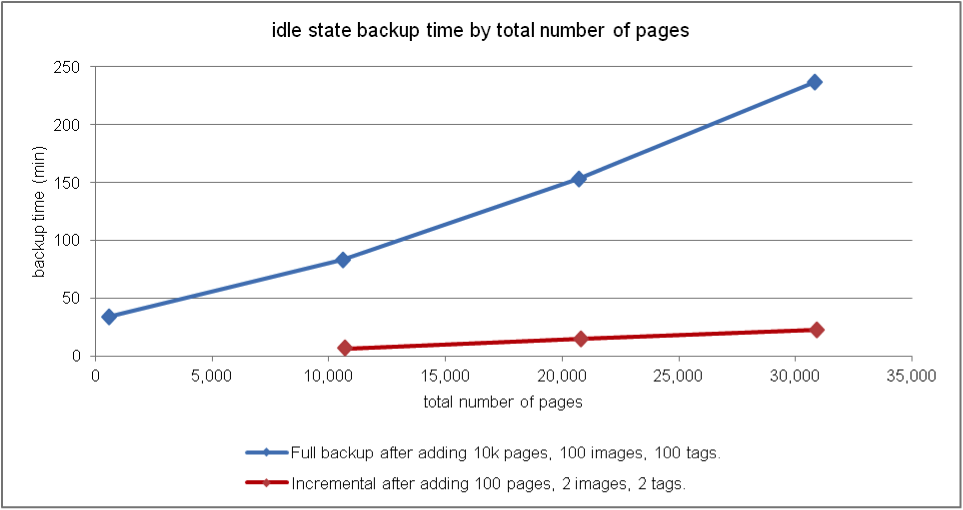

# Optimalisatie van prestaties {#performance-optimization}

>[!NOTE]
>
>Lees de pagina [Prestatierichtlijnen](/help/sites-deploying/performance-guidelines.md) voor algemene richtlijnen over prestaties.
>
>Zie ook de [Performance tree](/help/sites-deploying/performance-tree.md) voor meer informatie over het oplossen van problemen en het oplossen van prestatieproblemen.
>
>Bovendien kunt u een artikel van de Kennisbank op [Prestaties herzien die Tips stemmen.](https://helpx.adobe.com/experience-manager/kb/performance-tuning-tips.html)

Een belangrijk probleem is de tijd die uw website nodig heeft om te reageren op bezoekersverzoeken. Hoewel deze waarde voor elke aanvraag zal variëren, kan een gemiddelde doelwaarde worden bepaald. Zodra deze waarde zowel haalbaar als houdbaar is, kan deze worden gebruikt om de prestaties van de website te controleren en de ontwikkeling van potentiële problemen aan te geven.

De responstijden die u wilt bepalen, verschillen per auteur- en publicatieomgeving en weerspiegelen de verschillende kenmerken van het doelpubliek:

## Auteursomgeving {#author-environment}

Deze omgeving wordt gebruikt door auteurs die inhoud invoeren en bijwerken. Er moet rekening worden gehouden met een klein aantal gebruikers die elk een groot aantal prestatieintensieve verzoeken genereren bij het bijwerken van inhoudspagina&#39;s en de afzonderlijke elementen op die pagina&#39;s.

## Omgeving {#publish-environment} publiceren

Deze omgeving bevat inhoud die u beschikbaar maakt voor uw gebruikers. Het aantal verzoeken is hier nog groter en de snelheid is even belangrijk, maar aangezien de aard van de verzoeken minder dynamisch is, kunnen er aanvullende mechanismen voor prestatieverbetering worden toegepast. zoals het in cache plaatsen van de inhoud of taakverdeling.

>[!NOTE]
>
>* Na het vormen voor prestatiesoptimalisering, volg de procedures in [Tough Dag](/help/sites-developing/tough-day.md) om het milieu onder zware lading te testen.
>* Zie ook [Tips voor het afstemmen van prestaties.](https://helpx.adobe.com/experience-manager/kb/performance-tuning-tips.html)


## Methode {#performance-optimization-methodology} voor optimalisatie van prestaties

Een prestatiesoptimalisatiemethodologie voor AEM projecten kan in vijf zeer eenvoudige regels worden samengevat die kunnen worden gevolgd om prestatieskwesties van begin af aan te vermijden:

1. [Planning voor Optimalisatie](#planning-for-optimization)
1. [Realiteit simuleren](#simulate-reality)
1. [Effen doelen vaststellen](#establish-solid-goals)
1. [Relevant blijven](#stay-relevant)
1. [Agile-iteratiecycli](#agile-iteration-cycles)

Deze regels zijn in grote mate van toepassing op webprojecten in het algemeen en zijn relevant voor projectbeheerders en systeembeheerders om ervoor te zorgen dat hun projecten niet met prestatieproblemen worden geconfronteerd wanneer de lanceringstijd aankomt.

### Planning voor Optimalisatie {#planning-for-optimization}


Ongeveer 10% van de projectinspanningen moet worden gepland voor de optimalisatiefase van de prestaties. De daadwerkelijke optimalisatievereisten voor de prestaties zijn uiteraard afhankelijk van de complexiteit van een project en de ervaring van het ontwikkelingsteam. Hoewel uw project (uiteindelijk) niet alle toegewezen tijd kan vereisen, is het goed om altijd voor prestatiesoptimalisering in het voorgestelde gebied te plannen.

Voorzover mogelijk moet een project eerst worden gelanceerd aan een beperkt publiek om praktijkervaring te vergaren en verdere optimalisaties uit te voeren, zonder de extra druk die volgt op een volledige aankondiging.

Zodra u &quot;live&quot; bent, is de optimalisatie van de prestaties nog niet voorbij. Dit is het moment waarop u de &quot;echte&quot; belasting op uw systeem ervaart. Het is belangrijk om na de lancering aanvullende aanpassingen te plannen.

Aangezien de systeembelasting verandert en de prestatieprofielen van uw systeem in de loop der tijd verschuiven, moet een &#39;afstelling&#39; van de prestaties of &#39;health check&#39; met tussenpozen van 6 tot 12 maanden worden gepland.

### Realiteit simuleren {#simulate-reality}


Als u live gaat met een website en na de introductie ontdekt dat u problemen hebt met de prestaties, is er slechts één reden voor die problemen: Uw belasting- en prestatietests hebben de realiteit niet nauwkeurig genoeg gesimuleerd.

Het simuleren van de realiteit is moeilijk en hoeveel moeite u redelijkerwijs zult willen investeren om &quot;echt&quot; te worden hangt af van de aard van uw project. &quot;Reëel&quot; betekent niet alleen &quot;echte code&quot; en &quot;echt verkeer&quot;, maar ook &quot;echte inhoud&quot;, met name met betrekking tot de grootte en structuur van de inhoud. Houd er rekening mee dat uw sjablonen zich totaal anders gedragen, afhankelijk van de grootte en structuur van de opslagplaats.

### Effen doelen vaststellen {#establish-solid-goals}


Het belang van een correcte vaststelling van prestatiedoelen mag niet worden onderschat. Vaak is het, zodra mensen zich richten op specifieke prestatiedoelen, erg moeilijk om deze doelen achteraf te wijzigen, zelfs als ze gebaseerd zijn op wilde veronderstellingen.

Het vaststellen van goede, stevige prestatiesdoelstellingen is echt één van de moeilijkste gebieden. Het is vaak het beste om logboeken en benchmarks uit de praktijk te verzamelen van een vergelijkbare website (bijvoorbeeld de voorganger van de nieuwe website).

### Relevant {#stay-relevant} blijven


Het is belangrijk om één knelpunt tegelijk te optimaliseren. Als u dingen tegelijkertijd probeert te doen zonder de impact van één optimalisering te bevestigen, zult u spoor verliezen van welke optimaliseringsmaatregel eigenlijk hielp.

### Flexibele iteratiecycli {#agile-iteration-cycles}


Prestaties afstemmen is een herhalend proces dat betrekking heeft op meten, analyseren, optimaliseren en valideren totdat het doel is bereikt. Om dit aspect naar behoren in aanmerking te nemen, voert u na elke herhaling een flexibel validatieproces in de optimalisatiefase in plaats van een zwaarder testproces uit.

Dit betekent grotendeels dat de ontwikkelaar die de optimalisatie implementeert, snel moet kunnen zien of de optimalisatie al het doel heeft bereikt. Dit is waardevolle informatie, want wanneer het doel wordt bereikt, is optimalisatie voorbij.

## Basic Performance Guidelines {#basic-performance-guidelines}

In het algemeen, houd uw uncaching HTML- verzoeken aan minder dan 100 ms. Meer in het bijzonder kan het volgende als richtsnoer dienen:

* 70% van de aanvragen voor pagina&#39;s moet binnen 100 ms worden beantwoord.
* 25% van de aanvragen voor pagina&#39;s moet binnen 100 ms-300 ms een antwoord krijgen.
* 4% van de aanvragen voor pagina&#39;s moet een antwoord krijgen binnen 300 ms-500 ms.
* 1% van de aanvragen voor pagina&#39;s moet een antwoord krijgen binnen 500 ms-1000 ms.
* Geen pagina&#39;s mogen langzamer reageren dan 1 seconde.

De bovenstaande getallen voldoen aan de volgende voorwaarden:

* Gemeten bij publicatie (geen algemene kosten in verband met een ontwerpomgeving)
* Gemeten op de server (geen netwerkoverhead)
* Niet in cache geplaatst (geen AEM uitvoercache, geen Dispatcher-cache)
* Alleen voor complexe items met veel afhankelijkheden (HTML, JS, PDF, ...)
* Geen andere belasting op het systeem

Er zijn een aantal problemen die vaak tot prestatieproblemen leiden. Deze hebben voornamelijk betrekking op:

* Inefficiëntie in cache plaatsen door verzending
* Het gebruik van query&#39;s in normale weergavesjablonen.

JVM- en besturingssysteemniveau-tuning leiden gewoonlijk niet tot grote prestatieverschillen en moeten daarom aan het einde van de optimalisatiecyclus worden uitgevoerd.

De manier waarop een opslagplaats voor inhoud gestructureerd is, kan ook van invloed zijn op de prestaties. Voor de beste prestaties, zou het aantal kindknopen in bijlage aan individuele knopen in een inhoudsbewaarplaats niet 1.000 (als algemene regel) moeten overschrijden.

Uw beste vrienden tijdens een gebruikelijke optimalisatie van de prestaties zijn:

* The `request.log`
* Op componenten gebaseerde timing
* Last but not least een Java-profiler.

### Prestaties bij het laden en bewerken van digitale elementen {#performance-when-loading-and-editing-digital-assets}

Vanwege het grote gegevensvolume dat bij het laden en bewerken van digitale elementen is vereist, kunnen prestaties een probleem worden.

Hier zijn twee dingen van invloed op de prestaties:

* CPU - meerdere kernen zorgen voor vloeiender werk bij transcodering
* Harde schijf - parallelle RAID-schijven bereiken hetzelfde

Als u de prestaties wilt verbeteren, kunt u het volgende overwegen:

* Hoeveel middelen worden per dag geüpload? Een goede schatting kan gebaseerd zijn op:


* Het tijdsbestek waarin bewerkingen worden uitgevoerd (doorgaans de duur van de werkdag, meer voor internationale operaties).
* De gemiddelde grootte van geüploade afbeeldingen (en de grootte van de uitvoeringen die per afbeelding worden gegenereerd) in megabytes.
* Bepaal de gemiddelde gegevenssnelheid:


* 80% van alle bewerkingen wordt uitgevoerd in 20% van de tijd, dus tijdens de piektijd hebt u vier keer de gemiddelde gegevenssnelheid. Dit is uw prestatiedoel.

## Prestatiebewaking {#performance-monitoring}

Prestaties (of het ontbreken ervan) zijn een van de eerste dingen die uw gebruikers opmerken. Prestaties zijn dus net als bij elke toepassing met een gebruikersinterface van essentieel belang. Om de prestaties van uw AEM installatie te optimaliseren, moet u verschillende kenmerken van de instantie en het gedrag ervan controleren.

Zie [Prestaties controleren](/help/sites-deploying/monitoring-and-maintaining.md#monitoring-performance) voor informatie over hoe u prestatiebewaking kunt uitvoeren.

De problemen die prestatieskwesties veroorzaken zijn vaak moeilijk te volgen, zelfs wanneer hun gevolgen gemakkelijk zijn te zien.

Een basisuitgangspunt is een goede kennis van uw systeem wanneer het zoals normaal werkt. Tenzij u weet hoe uw omgeving eruit ziet en zich gedraagt wanneer deze goed functioneert, kan het moeilijk zijn het probleem op te sporen wanneer de prestaties achteruitgaan. Dit betekent dat u wat tijd moet besteden aan het onderzoeken van uw systeem wanneer het regelmatig loopt en ervoor moet zorgen dat het verzamelen van prestatiesinformatie een lopende taak is. Dit zal u een basis voor vergelijking verstrekken als de prestaties lijden.

Het volgende diagram illustreert het pad dat een verzoek om AEM inhoud kan innemen, en dus het aantal verschillende elementen die de prestaties kunnen beïnvloeden.


De prestaties zijn ook een evenwicht tussen volume en capaciteit:

* **Volume** : de hoeveelheid uitvoer die door het systeem wordt verwerkt en geleverd.
* **Capaciteit** : de capaciteit van het systeem om het volume te leveren.

Dit kan worden geïllustreerd op verschillende locaties in de gehele webketen.


Er zijn verschillende functionele gebieden die vaak van invloed zijn op de prestaties:

* Caching
* Toepassingscode (uw project)
* Zoekfunctionaliteit

### Basisregels voor prestaties {#basic-rules-regarding-performance}

Bij het optimaliseren van prestaties moet rekening worden gehouden met bepaalde regels:

* Prestaties afstemmen *must* maakt deel uit van elk project.
* Niet vroeg optimaliseren in de ontwikkelingscyclus.
* Prestaties zijn slechts even goed als de zwakste schakel.
* Denk altijd aan capaciteit versus volume.
* Belangrijke zaken eerst optimaliseren.
* Optimaliseer nooit zonder *realistische* doelstellingen.

>[!NOTE]
>
>Houd er rekening mee dat het mechanisme dat u gebruikt om de prestaties te meten, vaak precies van invloed is op wat u probeert te meten. U moet altijd proberen rekening te houden met deze discrepanties en zoveel mogelijk van hun effect uitsluiten. in het bijzonder moeten browserplug-ins waar mogelijk worden gedeactiveerd.

## Configureren voor prestaties {#configuring-for-performance}

Bepaalde aspecten van AEM (en/of de onderliggende opslagplaats) kunnen worden geconfigureerd om de prestaties te optimaliseren. Hieronder vindt u mogelijkheden en suggesties. Voordat u wijzigingen aanbrengt, moet u controleren of en hoe u de desbetreffende functionaliteit gebruikt.

>[!NOTE]
>
>Zie [KB-artikel](https://helpx.adobe.com/experience-manager/kb/performance-tuning-tips.html) voor meer informatie.

### Indexering zoeken {#search-indexing}

Vanaf AEM 6.0 gebruikt Adobe Experience Manager een op eik gebaseerde opslagarchitectuur.

Hier vindt u de bijgewerkte indexeringsgegevens:

* [Beste praktijken voor Vragen en het Indexeren](/help/sites-deploying/best-practices-for-queries-and-indexing.md)
* [Vragen en indexering](/help/sites-deploying/queries-and-indexing.md)

### Gelijktijdige workflowverwerking {#concurrent-workflow-processing}

Beperk het aantal werkstroomprocessen die tegelijkertijd worden uitgevoerd om de prestaties te verbeteren. De workflowengine verwerkt standaard evenveel workflows als er processors beschikbaar zijn voor de Java VM. Wanneer workflowstappen grote hoeveelheden verwerkingsbronnen (RAM of CPU) vereisen, kan het uitvoeren van meerdere van deze workflows tegelijk hoge eisen stellen aan de beschikbare serverbronnen.

Wanneer bijvoorbeeld afbeeldingen (of DAM-elementen in het algemeen) worden geüpload, worden de afbeeldingen door de workflows automatisch in DAM geïmporteerd. Afbeeldingen hebben vaak een hoge resolutie en kunnen eenvoudig honderden MB heap-bestanden voor verwerking verbruiken. Door deze afbeeldingen parallel af te handelen, wordt er veel belasting gelegd op het geheugensubsysteem en de afvalophaler.

De workflowengine gebruikt Apache Sling-taakwachtrijen voor het verwerken en plannen van de verwerking van werkitems. De volgende taakrijservices zijn standaard gemaakt in de Apache Sling Job Queue Configuration-service factory voor het verwerken van werkstroomtaken:

* Wachtrij voor Granite-werkstroom: De meeste workflowstappen, zoals die welke DAM-elementen verwerken, gebruiken de Granite Workflow Queue-service.
* Extra werkstroom voor externe procestaak: Deze service wordt gebruikt voor speciale externe workflowstappen die doorgaans worden gebruikt om contact op te nemen met een extern systeem en om de resultaten te bekijken. De stap InDesign Media Extraction Process wordt bijvoorbeeld geïmplementeerd als een extern proces. De workflowengine gebruikt de externe wachtrij voor het verwerken van de opiniepeiling. (Zie [com.day.cq.workflow.exec.WorkflowExternalProcess](https://helpx.adobe.com/experience-manager/6-5/sites/developing/using/reference-materials/javadoc/com/day/cq/workflow/exec/WorkflowExternalProcess.html).)

Vorm deze diensten om het maximumaantal gelijktijdig lopende werkschemaprocessen te beperken.

>[!NOTE]
>
>Het vormen van deze baanrijen beïnvloedt alle werkschema&#39;s tenzij u een baanrij voor een specifiek werkschemamodel hebt gecreeerd (zie [Vorm de Rij voor een Specifiek Model van het Werkschema](/help/sites-deploying/configuring-performance.md#configure-the-queue-for-a-specific-workflow) hieronder).

#### Configuratie in de opslagplaats {#configuration-in-the-repo}

Als u de services [configureert met behulp van een sling:OsgiConfig-knooppunt](/help/sites-deploying/configuring-osgi.md#adding-a-new-configuration-to-the-repository), moet u de PID van de bestaande services zoeken, bijvoorbeeld: org.apache.sling.event.jobs.QueueConfiguration.370aad73-d01b-4a0b-abe4-20198d85f705. U kunt de PID ontdekken gebruikend de Console van het Web.

U moet het bezit vormen genoemd `queue.maxparallel`.

#### Configuratie in de webconsole {#configuration-in-the-web-console}

Om deze diensten [gebruikend de Console van het Web](/help/sites-deploying/configuring-osgi.md#osgi-configuration-with-the-web-console) te vormen, bepaal de plaats van de bestaande configuratiepunten onder de de dienstfabriek van de Configuratie van de Rij van de Rij van Apache het Verdelen van de Rij.

U moet het bezit vormen genoemd Maximum Parallelle Banen.

### Vorm de Rij voor een Specifiek Werkschema {#configure-the-queue-for-a-specific-workflow}

Maak een taakwachtrij voor een specifiek workflowmodel, zodat u de verwerking van taken voor dat workflowmodel kunt configureren. Op deze manier, beïnvloeden uw configuraties de verwerking voor een specifiek werkschema, terwijl de configuratie van de standaard Rij van het Werkschema van Granite de de verwerking van andere werkschema&#39;s controleert.

Wanneer workflowmodellen worden uitgevoerd, creëren ze verschuivende taken voor een bepaald onderwerp. Door gebrek, past het onderwerp de onderwerpen aan die voor de algemene Rij van het Werkschema van Granite, of de Externe Rij van de Baan van het Proces van het Werkschema van Granite van het Werkschema worden gevormd:

* `com/adobe/granite/workflow/job*`
* `com/adobe/granite/workflow/external/job*`

Werkelijke taakonderwerpen die workflowmodellen genereren, zijn modelspecifiek achtervoegsel. Het workflowmodel **DAM Update Asset** genereert bijvoorbeeld taken met het volgende onderwerp:

`com/adobe/granite/workflow/job/etc/workflow/models/dam/update_asset/jcr_content/model`

Daarom kunt u een baanrij voor het onderwerp tot stand brengen dat de baanonderwerpen van uw werkschemamodel aanpast. Het vormen van de op prestaties betrekking hebbende eigenschappen van de rij beïnvloedt slechts het werkstroommodel dat de banen produceert die het rijonderwerp aanpassen.

De volgende procedure leidt tot een baanrij voor een werkschema, gebruikend **DAM Update Asset** werkschema als voorbeeld.

1. Voer het werkschemamodel uit waarvoor u de baanrij wilt tot stand brengen, zodat de onderwerpstatistieken worden geproduceerd. Voeg bijvoorbeeld een afbeelding toe aan Elementen om de **DAM-updatebron**-workflow uit te voeren.
1. Open de Sling Job-console (`https://<host>:<port>/system/console/slingevent`).
1. Ontdek de werkschemagerelateerde onderwerpen in de console. Voor DAM Update Asset, zijn de volgende onderwerpen gevonden:

   * `com/adobe/granite/workflow/external/job/etc/workflow/models/dam/update_asset/jcr_content/model`
   * `com/adobe/granite/workflow/job/etc/workflow/models/dam/update_asset/jcr_content/model`
   * `com/adobe/granite/workflow/job/etc/workflow/models/dam-xmp-writeback/jcr_content/model`

1. Creeer één baanrij voor elk van deze onderwerpen. Als u een taakwachtrij wilt maken, maakt u een fabrieksconfiguratie voor de Apache Sling Job Queue-fabrieksservice.

   De fabrieksconfiguraties zijn gelijkaardig aan de Rij van het Werkschema van Granite die in [Gelijktijdige Verwerking van het Werkschema](/help/sites-deploying/configuring-performance.md#concurrent-workflow-processing) wordt beschreven, behalve het bezit van Onderwerpen past het onderwerp van uw werkschemataken aan.

### DAM Asset Synchronization Service AEM {#cq-dam-asset-synchronization-service}

De `AssetSynchronizationService` wordt gebruikt om elementen te synchroniseren van gekoppelde repositories (waaronder LiveLink, Documentum). Standaard wordt hiermee elke 300 seconden (5 minuten) regelmatig gecontroleerd. Als u geen gekoppelde opslagplaatsen gebruikt, kunt u deze service uitschakelen.

Dit gebeurt door [de OSGi-service te configureren](/help/sites-deploying/configuring-osgi.md) **CQ DAM Asset Synchronization Service** om de **Synchronization period** ( `scheduler.period`) in te stellen op (minimaal) 1 jaar (gedefinieerd in seconden).

### Meerdere DAM-instanties {#multiple-dam-instances}

De implementatie van meerdere DAM-instanties kan de prestaties verbeteren als bijvoorbeeld:

* U hebt een hoge belasting omdat u regelmatig een groot aantal elementen uploadt voor de ontwerpomgeving. Hier kan een afzonderlijke instantie DAM worden gewijd aan het onderhouden van auteur.
* U hebt meerdere teams in de hele wereld (bijvoorbeeld VS, Europa, Azië).

Aanvullende overwegingen zijn:

* Scheiding &quot;werk in uitvoering&quot; op auteur van &quot;final&quot; bij publicatie
* Interne gebruikers op auteur scheiden van externe bezoekers/gebruikers bij publicatie (bv. agenten, persvertegenwoordigers, klanten, studenten, enz.).

## Aanbevolen procedures voor kwaliteitsborging {#best-practices-for-quality-assurance}

Prestaties zijn van het grootste belang voor uw publicatieomgeving. Daarom moet u zorgvuldig plannen en de prestatietests analyseren u voor het publicatiemilieu zult maken terwijl het uitvoeren van uw project.

Deze sectie is bedoeld om een gestandaardiseerd overzicht te geven van de problemen die samenhangen met het definiëren van een testconcept dat specifiek is bedoeld voor prestatietests in uw *publish*-omgeving. Dit is hoofdzakelijk van belang voor ingenieurs QA, projectmanagers en systeembeheerders.

Hieronder vindt u een gestandaardiseerde benadering van prestatietests voor een AEM toepassing in de *Publish*-omgeving. Dit omvat de volgende vijf fasen:

* [Verificatie van kennis](#verification-of-knowledge)
* [Definitie van toepassingsgebied](#scope-definition)
* [Testmethoden](#test-methodologies)
* [Definitie van prestatiedoelstellingen](#defining-the-performance-goals)
* [Optimalisatie](#optimization)

De controle is een extra, allesomvattend proces - noodzakelijk maar niet beperkt tot het testen.

### Verificatie van kennis {#verification-of-knowledge}

Een eerste stap bestaat uit het documenteren van de basisgegevens die u moet weten voordat u kunt beginnen met testen:

* De architectuur van uw testomgeving
* Een toepassingskaart met de interne elementen die moeten worden getest (zowel afzonderlijk als gecombineerd)

#### Testarchitectuur {#test-architecture}

U moet duidelijk de architectuur documenteren van de testomgeving die voor uw prestatietests wordt gebruikt.

U hebt een reproductie nodig van uw geplande publicatie-omgeving voor productie, samen met Dispatcher en Load Balancer.

#### Toepassingskaart {#application-map}

Om een duidelijk overzicht te krijgen kunt u een kaart van de volledige toepassing tot stand brengen (u kunt dit van tests op het milieu van de Auteur hebben).

Een diagram met de interne elementen van de toepassing kan een overzicht geven van de testvereisten; met kleurcodering kan het ook als basis voor rapportage dienen.

### Toepassingsdefinitie {#scope-definition}

Een toepassing heeft doorgaans een selectie van gebruikscategorieën. Sommige zullen erg belangrijk zijn, andere minder.

Als u het bereik van de prestatietests wilt beperken tot publiceren, raden we u aan het volgende te definiëren:

* De belangrijkste zaken van het bedrijfsgebruik
* Meest kritieke gevallen van technisch gebruik

Het aantal gebruiksgevallen is aan u, maar het moet beperkt blijven tot een eenvoudig te beheren aantal (bijvoorbeeld tussen 5 en 10).

Zodra de belangrijkste gebruiksgevallen zijn geselecteerd, kunnen de belangrijkste prestatie-indicatoren (KPI) en de instrumenten die worden gebruikt om deze te meten voor elk geval worden bepaald. Voorbeelden van veelvoorkomende KPI&#39;s zijn:

* Reactietijd van einde tot einde
* Responstijd servlet
* Responstijd voor één component
* Responstijd voor de services
* Aantal nutteloze draden in de draadpool
* Aantal gratis verbindingen
* Systeembronnen zoals CPU- en I/O-toegang

### Testmethoden {#test-methodologies}

Dit concept heeft 4 scenario&#39;s die voor het bepalen van en het testen van de prestatiesdoelstellingen worden gebruikt:

* Tests met één component
* Gecombineerde componenttests
* *Going* Livescenario
* Foutscenario&#39;s

Gebaseerd op de volgende beginselen.

#### Onderdeelpunten {#component-breakpoints}

* Elke component heeft een specifiek breekpunt wanneer gerelateerd aan prestaties. Dit betekent dat een component goede prestaties kan tonen tot een specifiek punt wordt bereikt, waarna de prestaties snel zullen verminderen.
* Voor een volledig overzicht van de toepassing, moet u eerst uw componenten verifiëren wanneer het breekpunt van elk wordt bereikt.
* Om het breekpunt te vinden kunt u een ladingstest uitvoeren waar, over een periode, u het aantal gebruikers verhoogt om een stijgende lading tot stand te brengen. Door deze lading, en de reactie van de componenten te controleren, zult u specifiek prestatiesgedrag ontmoeten wanneer het breekpunt van de component wordt bereikt. Het punt kan door het aantal gezamenlijke transacties per seconde, samen met het aantal gezamenlijke gebruikers worden gekwalificeerd (als de component voor dit KPI gevoelig is).
* Deze informatie kan dan als benchmark voor verbeteringen dienen, de doeltreffendheid van de gebruikte maatregelen aangeven en helpen bij het definiëren van testscenario&#39;s.

#### Transacties {#transactions}

* De term transactie wordt gebruikt om het verzoek van een volledige Web-pagina, met inbegrip van de pagina zelf en alle verdere vraag te vertegenwoordigen; d.w.z. de paginaaanvraag, eventuele AJAX, afbeeldingen en andere objecten.**Downloaden aanvragen**
* Om elk verzoek volledig te analyseren kunt u elk element van de vraagstapel vertegenwoordigen, dan totaal de gemiddelde verwerkingstijd voor elk.

### De prestatiedoelen definiëren {#defining-the-performance-goals}

Zodra het werkingsgebied, en verwante KPIs zijn bepaald, kunnen de specifieke prestatiesdoelstellingen worden geplaatst. Hierbij moeten testscenario&#39;s samen met streefwaarden worden opgesteld.

U moet de prestaties testen onder zowel gemiddelde als piekomstandigheden. Daarnaast hebt u tests met live-scenario&#39;s nodig om ervoor te zorgen dat u meer interesse krijgt in uw website wanneer deze voor het eerst beschikbaar wordt gesteld.

Eventuele ervaringen of statistieken die u op een bestaande website hebt verzameld, kunnen ook nuttig zijn bij het bepalen van toekomstige doelen. bijvoorbeeld het hoogste verkeer van uw live website.

#### Enkelvoudige componenttests {#single-component-tests}

Kritieke onderdelen moeten worden getest - zowel onder gemiddelde als onder piekomstandigheden.

In beide gevallen kunt u het verwachte aantal transacties per seconde definiëren wanneer een vooraf gedefinieerd aantal gebruikers het systeem gebruikt.

| Component | Testtype | Nee. van gebruikers | Tx/sec (verwacht) | Tx/sec (getest) | Beschrijving |
|---|---|---|---|---|---|
| Homepage voor één gebruiker | Gemiddelde | 1 | 3 |  |  |
|  | Piek | 1 | 3 |  |  |
| Homepage 100 gebruikers | Gemiddelde | 100 | 3 |  |  |
|  | Piek | 100 | 3 |  |

#### Gecombineerde componenttests {#combined-component-tests}

Wanneer u de componenten in combinatie test, wordt het gedrag van de toepassingen beter weerspiegeld. Ook hier moeten de gemiddelde en piekomstandigheden worden getest.

| Scenario | Component | Nee. van gebruikers | Tx/sec (verwacht) | Tx/sec (getest) | Beschrijving |
|---|---|---|---|---|---|
| Gemengd gemiddelde | Homepage | 10 | 3 |  |  |
|  | Zoeken | 10 | 3 |  |  |
|  | Nieuws | 10 | 2 |  |  |
|  | Gebeurtenissen | 10 | 3 |  |  |
|  | Activering | 10 | 3 |  | Simulatie van het gedrag van de auteur. |
| Gemengde piek | Homepage | 100 | 5 |  |  |
|  | Zoeken | 50 | 5 |  |  |
|  | Nieuws | 100 | 10 |  |  |
|  | Gebeurtenissen | 100 | 10 |  |  |
|  | Activering | 20 | 20 |  | Simulatie van het gedrag van de auteur. |

#### Actieve tests {#going-live-tests} uitvoeren

In de eerste dagen nadat uw website beschikbaar is gemaakt, kunt u een hogere mate van belangstelling verwachten. Dit zal waarschijnlijk zelfs groter zijn dan de piekwaarden u voor hebt getest. Het wordt ten zeerste aanbevolen Going Live-scenario&#39;s te testen om ervoor te zorgen dat het systeem op deze situatie kan inspelen.

| Scenario | Testtype | Nee. van gebruikers | Tx/sec (verwacht) | Tx/sec (getest) | Beschrijving |
|---|---|---|---|---|---|
| Going Live peak | Homepage | 200 | 20 |  |  |
|  | Zoeken | 100 | 10 |  |  |
|  | Nieuws | 200 | 20 |  |  |
|  | Gebeurtenissen | 200 | 20 |  |  |
|  | Activering | 20 | 20 |  | Simulatie van het gedrag van de auteur. |

#### Foutdetectietests {#error-scenario-tests}

Foutscenario&#39;s moeten ook worden getest om ervoor te zorgen dat het systeem correct en correct reageert. Niet alleen in hoe de fout zelf wordt behandeld, maar het effect het op prestaties kan hebben. Bijvoorbeeld:

* Wat gebeurt er als de gebruiker een ongeldige zoekterm in het zoekvak probeert in te voeren
* Wat gebeurt er als de zoekterm zo algemeen is dat deze een buitensporig aantal resultaten oplevert

Bij het opstellen van deze tests moet er rekening mee worden gehouden dat niet alle scenario&#39;s regelmatig zullen plaatsvinden. Het is echter van belang dat de gevolgen voor het hele systeem worden beïnvloed.

| Foutscenario | Fouttype | Nee. van gebruikers | Tx/sec (verwacht) | Tx/sec (getest) | Beschrijving |
|---|---|---|---|---|---|
| Overbelasting van component zoeken | Zoeken op jokerteken (sterretje) | 10 | 1 |  | Alleen &amp;ast;&amp;ast;&amp;ast; worden doorzocht. |
|  | Woord stoppen | 20 | 2 |  | Zoeken naar een stopwoord. |
|  | Lege tekenreeks | 10 | 3 |  | Zoeken naar een lege tekenreeks. |
|  | Speciale tekens | 10 | 3 |  | Zoeken naar speciale tekens. |

#### Duurzaamheidstests {#endurance-tests}

Bepaalde problemen zullen pas worden ondervonden nadat het systeem gedurende een ononderbroken periode functioneert; hetzij uren, hetzij zelfs dagen. Een duurtest wordt gebruikt om een constante gemiddelde belasting over een vereiste periode te testen. Elke verslechtering van de prestaties kan vervolgens worden geanalyseerd.

| Scenario | Testtype | Nee. van gebruikers | Tx/sec (verwacht) | Tx/sec (getest) | Beschrijving |
|---|---|---|---|---|---|
| Duurzaamheidstest (72 uur) | Homepage | 10 | 3 |  |  |
|  | Zoeken | 10 | 1 |  |  |
|  | Nieuws | 20 | 2 |  |  |
|  | Gebeurtenissen | 10 | 3 |  |  |
|  | Activering | 3 | 3 |  | Simulatie van het gedrag van de auteur. |

### Optimalisatie {#optimization}

In de latere stadia van de implementatie moet u de toepassing optimaliseren om de prestatiedoelen te halen of te maximaliseren.

Eventuele optimalisaties moeten worden getest om na te gaan of zij:

* Dit heeft geen invloed op de functionaliteit
* Met de belastingtests zijn geverifieerd voordat ze worden vrijgegeven

Er zijn verschillende tools beschikbaar om u te helpen bij het genereren van de belasting, het bewaken van de prestaties en/of het analyseren van de resultaten:

* [JMeter](https://jakarta.apache.org/jmeter/)
* [Runner laden](https://www.microfocus.com/en-us/products/loadrunner-load-testing/overview)
* [](https://www.determyne.com/) DetermyneInsideApps
* [InfraRED](https://www.infraredsoftware.com/)
* [Interactief Java-profiel](https://jiprof.sourceforge.net/)
* nog veel meer...

Na optimalisatie moet u opnieuw testen om de impact te bevestigen.

### {#reporting} rapporteren

Doorlopende rapportage is nodig om iedereen op de hoogte te houden van de status, zoals eerder vermeld met kleurcodering, kan de architectuurkaart hiervoor worden gebruikt.

Nadat alle tests zijn voltooid, wilt u rapporteren over:

* Eventuele kritieke fouten aangetroffen
* Niet-kritische kwesties die nog nader moeten worden onderzocht
* Eventuele aannames tijdens de tests
* Eventuele aanbevelingen die uit de tests voortvloeien

## Prestaties optimaliseren bij gebruik van de Dispatcher {#optimizing-performance-when-using-the-dispatcher}

De [Dispatcher](https://helpx.adobe.com/experience-manager/dispatcher/using/dispatcher.html) is een Adobe- en/of taakverdelingsgereedschap. Wanneer u de Dispatcher gebruikt, kunt u overwegen uw website te optimaliseren voor de prestaties van de cache.

>[!NOTE]
>
>De versies van de Verzender zijn onafhankelijk van AEM, nochtans wordt de documentatie van de Verzender ingebed in de AEM documentatie. Gebruik altijd de Dispatcher-documentatie die is ingesloten in de documentatie voor de meest recente versie van AEM.
>
>U bent mogelijk omgeleid naar deze pagina als u een koppeling naar de Dispatcher-documentatie hebt gevolgd die is ingesloten in de documentatie voor een vorige versie van AEM.

De Dispatcher biedt een aantal ingebouwde mechanismen die u kunt gebruiken om de prestaties te optimaliseren als uw website er gebruik van maakt. In deze sectie wordt uitgelegd hoe u uw website kunt ontwerpen om de voordelen van caching te maximaliseren.

>[!NOTE]
>
>Het kan u helpen herinneren dat de Dispatcher het geheime voorgeheugen op een standaardWebserver opslaat. Dit betekent dat u:
>
>* Kan alles wat u als een pagina kunt opslaan en aanvragen via een URL in cache plaatsen
>* Kan geen andere dingen opslaan, zoals cookies, sessiegegevens en formuliergegevens.

>
>
In het algemeen, impliceren veel caching strategieën het selecteren van goede URLs en het verlaten van deze extra gegevens.
>
>Met Dispatcher versie 4.1.11 kunt u antwoordheaders ook in cache plaatsen, zie [HTTP-antwoordheaders in cache plaatsen](https://helpx.adobe.com/experience-manager/dispatcher/using/dispatcher-configuration.html#configuring-the-dispatcher-cache-cache).


### De cacheverhouding van de verzender berekenen {#calculating-the-dispatcher-cache-ratio}

De formule van de geheim voorgeheugenverhouding schat het percentage verzoeken die door het geheime voorgeheugen uit het totale aantal verzoeken worden behandeld die in het systeem komen. Voor het berekenen van de cacheratio hebt u het volgende nodig:

* Het totale aantal aanvragen. Deze informatie is beschikbaar in de Apache `access.log`. Raadpleeg de [officiële documentatie van Apache](https://httpd.apache.org/docs/2.4/logs.html#accesslog) voor meer informatie.

* Het aantal aanvragen dat de instantie Publish heeft uitgevoerd. Deze informatie is beschikbaar in `request.log` van de instantie. Zie [Bezig met interpreteren van request.log](/help/sites-deploying/monitoring-and-maintaining.md#interpreting-the-request-log) en [De logbestanden zoeken](/help/sites-deploying/monitoring-and-maintaining.md#finding-the-log-files) voor meer informatie.

De formule voor het berekenen van de cacheverhouding is:

* (Het totale aantal verzoeken **minus** het aantal verzoeken op Publish) **gedeeld** door het totale aantal verzoeken.

Bijvoorbeeld, als het totale aantal verzoeken 129491 is en het aantal verzoeken door de Publish instantie wordt gediend 58959 is de geheim voorgeheugenverhouding: **(129491 - 58959)/129491= 54,5%**.

Als u geen één aan één uitgever/verzender het telegraferen hebt, zult u verzoeken van alle verzenders en uitgevers samen moeten toevoegen om een nauwkeurige meting te krijgen. Zie ook [Aanbevolen implementaties](/help/sites-deploying/recommended-deploys.md).

>[!NOTE]
>
>Voor de beste prestaties raadt Adobe een cacheverhouding aan van 90% tot 95%.

#### Consistente paginacodering {#using-consistent-page-encoding} gebruiken

Met Dispatcher versie 4.1.11 kunt u responsheaders in cache plaatsen. Als u geen antwoordheaders in de cache plaatst bij Dispatcher, kunnen er problemen optreden als u pagina-coderingsinformatie opslaat in de koptekst. Als Dispatcher dan een pagina uit de cache bedient, wordt de standaardcodering van de webserver gebruikt voor de pagina. Dit probleem kan op twee manieren worden voorkomen:

* Als u slechts één codering gebruikt, moet u ervoor zorgen dat de codering die op de webserver wordt gebruikt, gelijk is aan de standaardcodering van de AEM website.
* Gebruik een `<META>`-tag in de HTML `head`-sectie om de codering in te stellen, zoals in het volgende voorbeeld:

```xml
        <META http-equiv="Content-Type" content="text/html; charset=EUC-JP">
```

#### Vermijd URL-parameters {#avoid-url-parameters}

Vermijd indien mogelijk URL-parameters voor pagina&#39;s die u in cache wilt plaatsen. Als u bijvoorbeeld een fotogalerie hebt, wordt de volgende URL nooit in de cache geplaatst (tenzij de Dispatcher [dienovereenkomstig is geconfigureerd](https://helpx.adobe.com/experience-manager/dispatcher/using/dispatcher-configuration.html#configuring-the-dispatcher-cache-cache)):

```xml
www.myCompany.com/pictures/gallery.html?event=christmas&amp;page=1
```

U kunt deze parameters echter als volgt in de pagina-URL plaatsen:

```xml
www.myCompany.com/pictures/gallery.christmas.1.html
```

>[!NOTE]
>
>Deze URL roept dezelfde pagina en dezelfde sjabloon aan als `gallery.html`. In de sjabloondefinitie kunt u opgeven welk script de pagina rendert of u kunt hetzelfde script voor alle pagina&#39;s gebruiken.

#### Aanpassen via URL {#customize-by-url}

Als u gebruikers toestaat de fontgrootte (of een andere lay-outaanpassing) te wijzigen, moet u ervoor zorgen dat de verschillende aanpassingen worden weerspiegeld in de URL.

Cookies worden bijvoorbeeld niet in de cache opgeslagen. Als u de fontgrootte opslaat in een cookie (of een vergelijkbaar mechanisme), blijft de fontgrootte dus niet behouden voor de pagina in de cache. Als gevolg hiervan retourneert Dispatcher willekeurige documenten van een willekeurige tekengrootte.

Door de tekengrootte als kiezer in de URL op te nemen voorkomt u dit probleem:

```xml
www.myCompany.com/news/main.large.html
```

>[!NOTE]
>
>Voor de meeste indelingsaspecten is het ook mogelijk stijlpagina&#39;s en/of clientscripts te gebruiken. Deze werken meestal heel goed met caching.
>
>Dit is ook handig voor een afdrukversie, waarin u bijvoorbeeld een URL kunt gebruiken:
>
>`www.myCompany.com/news/main.print.html`
>
>Met behulp van de scriptglobling van de sjabloondefinitie kunt u een afzonderlijk script opgeven dat de afdrukpagina&#39;s rendert.

#### Als titels gebruikte afbeeldingsbestanden {#invalidating-image-files-used-as-titles} ongeldig maken

Als u paginatitels of andere tekst als afbeeldingen rendert, is het raadzaam de bestanden op te slaan, zodat deze worden verwijderd bij een update van de inhoud op de pagina:

1. Plaats het afbeeldingsbestand in dezelfde map als de pagina.
1. Gebruik de volgende naamgevingsindeling voor het afbeeldingsbestand:

   `<page file name>.<image file name>`

U kunt bijvoorbeeld de titel van de pagina `myPage.html` opslaan in `file myPage.title.gif`. Dit bestand wordt automatisch verwijderd als de pagina wordt bijgewerkt. Wijzigingen in de paginatitel worden dus automatisch doorgevoerd in de cache.

>[!NOTE]
>
>Het afbeeldingsbestand bestaat niet noodzakelijkerwijs fysiek op de AEM. U kunt een script gebruiken waarmee het afbeeldingsbestand dynamisch wordt gemaakt. Dispatcher slaat het bestand vervolgens op de webserver op.

#### Beeldbestanden voor navigatie {#invalidating-image-files-used-for-navigation} ongeldig maken

Als u foto&#39;s gebruikt voor de navigatie-items, is de methode in feite hetzelfde als bij titels, iets complexer. Sla alle navigatieafbeeldingen op de doelpagina&#39;s op. Als u twee afbeeldingen gebruikt voor normaal en actief, kunt u de volgende scripts gebruiken:

* Een script waarmee de pagina als normaal wordt weergegeven.
* Een script dat &quot;.normal&quot;-verzoeken verwerkt en het normale beeld retourneert.
* Een script dat &quot;.active&quot;-aanvragen verwerkt en het geactiveerde beeld retourneert.

Het is belangrijk dat u deze afbeeldingen maakt met dezelfde naamgevingsgreep als de pagina, zodat deze afbeeldingen en de pagina worden verwijderd door een update van de inhoud.

Voor pagina&#39;s die niet worden gewijzigd, blijven de afbeeldingen in het cachegeheugen staan, hoewel de pagina&#39;s zelf meestal automatisch ongeldig worden gemaakt.

#### Personalisatie {#personalization}

U wordt aangeraden de personalisatie te beperken tot de plaats waar dat nodig is. Ter illustratie:

* Als u een vrij aanpasbare startpagina gebruikt, moet die pagina telkens worden samengesteld wanneer een gebruiker erom vraagt.
* Als u daarentegen 10 verschillende startpagina&#39;s kunt kiezen, kunt u elk van deze pagina&#39;s in cache plaatsen, waardoor de prestaties verbeteren.

>[!TIP]
>Voor meer informatie over het configureren van de Dispatcher-cache raadpleegt u de [AEM Zelfstudie in cache van Dispatcher](https://experienceleague.adobe.com/docs/experience-manager-learn/dispatcher-tutorial/overview.html) en de bijbehorende sectie over [Beveiligde inhoud in cache plaatsen.](https://experienceleague.adobe.com/docs/experience-manager-learn/dispatcher-tutorial/chapter-1.html#dispatcher-tips-and-tricks)

Als u elke pagina personaliseert (bijvoorbeeld door de naam van de gebruiker in de titelbalk te plaatsen), kan dit gevolgen hebben voor de prestaties.

>[!TIP]
>Zie [Beveiligde inhoud in cache plaatsen](https://experienceleague.adobe.com/docs/experience-manager-dispatcher/using/configuring/permissions-cache.html) in de handleiding voor Dispatcher voor meer informatie.

Met betrekking tot het mengen van beperkte en openbare inhoud op één pagina, zou u een strategie kunnen willen overwegen die serverzij omvat in Dispatcher, of cliëntkant omvat via Ajax in browser.

>[!TIP]
>
>Zie [Dynamische include instellen voor het verwerken van gemengde openbare en beperkte inhoud.](https://experienceleague.adobe.com/docs/experience-manager-learn/foundation/development/set-up-sling-dynamic-include.html)

#### Vaste verbindingen {#sticky-connections}

[Vaste ](https://helpx.adobe.com/experience-manager/dispatcher/using/dispatcher.html#the-benefits-of-load-balancing) verbindingen zorgen ervoor dat de documenten voor één gebruiker allen op de zelfde server samengesteld zijn. Als een gebruiker deze map verlaat en er later weer naar terugkeert, blijft de verbinding behouden. Definieer één map voor alle documenten die voor de website kleverige verbindingen vereisen. Probeer er geen andere documenten in op te nemen. Dit is van invloed op de taakverdeling als u gepersonaliseerde pagina&#39;s en sessiegegevens gebruikt.

#### MIME-typen {#mime-types}

Er zijn twee manieren waarop een browser het type bestand kan bepalen:

1. Door de uitbreiding (bijvoorbeeld `.html`, `.gif`, `.jpg`, enz.)
1. Door het MIME-type dat de server met het bestand verzendt.

Voor de meeste bestanden wordt het MIME-type geïmpliceerd in de bestandsextensie. i.e.:

1. Door de uitbreiding (bijvoorbeeld `.html`, `.gif`, `.jpg`, enz.)
1. Door het MIME-type dat de server met het bestand verzendt.

Als de bestandsnaam geen extensie heeft, wordt deze weergegeven als onbewerkte tekst.

Met Dispatcher versie 4.1.11 kunt u responsheaders in cache plaatsen. Als u antwoordheaders niet in de cache plaatst bij Dispatcher, moet u er rekening mee houden dat het MIME-type onderdeel is van de HTTP-header. Als uw AEM-toepassing bestanden retourneert die geen herkend bestandseinde hebben en in plaats daarvan afhankelijk is van het MIME-type, worden deze bestanden mogelijk onjuist weergegeven.

Volg de onderstaande richtlijnen om ervoor te zorgen dat bestanden correct in het cachegeheugen worden opgeslagen:

* Zorg ervoor dat bestanden altijd de juiste extensie hebben.
* Vermijd generische de servermanuscripten van het dossier, die URLs zoals `download.jsp?file=2214` hebben. Schrijf het script opnieuw om URL&#39;s te gebruiken die de bestandsspecificatie bevatten. Voor het vorige voorbeeld zou dit `download.2214.pdf` zijn.

## Back-upprestaties {#backup-performance}

Deze sectie bevat een reeks benchmarks die worden gebruikt om de prestaties van AEM back-ups en de effecten van back-upactiviteiten op de prestaties van de toepassing te beoordelen. AEM back-ups betekenen een aanzienlijke belasting voor het systeem terwijl het wordt uitgevoerd, en we meten dit, evenals de effecten van de instellingen voor back-upvertraging die proberen deze effecten te moduleren. Het doel is om enkele referentiegegevens te bieden over de verwachte prestaties van back-ups in realistische configuraties en hoeveelheden productiegegevens, en om u te helpen bij het schatten van de back-uptijden voor geplande systemen.

### Referentiemilieu {#reference-environment}

#### Fysiek systeem {#physical-system}

De resultaten die in dit document worden gerapporteerd, zijn verkregen uit benchmarks die in een referentieomgeving met de volgende configuratie worden uitgevoerd. Deze configuratie is zo ontworpen dat deze vergelijkbaar is met een typische productieomgeving in een datacenter:

* H-P ProLiant DL380 G6, 8 CPU&#39;s x 2,533 GHz
* Serial Attached SCSI 300 GB 10.000 RPM-schijven
* RAID-hardwarecontroller; 8 schijven in een RAID0+5-array
* VMware image CPU x 2 Intel Xeon E5540 @ 2,53 GHz
* RedHat Linux 2.6.18-194.el5; Java 1.6.0_29
* Single Author-instantie

Het schijfsubsysteem op deze server is vrij snel, representatief voor een krachtige configuratie van de INVAL die in een productieserver zou kunnen worden gebruikt. Back-upprestaties kunnen gevoelig zijn voor schijfprestaties en de resultaten in deze omgeving weerspiegelen de prestaties op een zeer snelle RAID-configuratie. Het VMWare-image is geconfigureerd voor één groot schijfvolume dat zich fysiek in de lokale schijfopslag op de RAID-array bevindt.

De AEM configuratie plaatst de opslagplaats en datastore op het zelfde logische volume, naast al werkend systeem en AEM software. De doelmap voor back-ups bevindt zich ook op dit logische bestandssysteem.

#### Gegevensvolumes {#data-volumes}

De volgende tabel illustreert de grootte van gegevensvolumes die worden gebruikt in de back-upbenchmarks. De initiële basislijninhoud wordt eerst geïnstalleerd, waarna extra bekende hoeveelheden gegevens worden toegevoegd om de inhoud waarvan een back-up wordt gemaakt, groter te maken. Back-ups worden gemaakt in specifieke stappen, zodat de inhoud van de back-ups aanzienlijk toeneemt en de productie per dag aanzienlijk toeneemt. De distributie van inhoud (pagina&#39;s, afbeeldingen, tags) is ruwweg gebaseerd op een realistische samenstelling van productieelementen. Pagina&#39;s, afbeeldingen en tags zijn beperkt tot maximaal 800 onderliggende pagina&#39;s. Elke pagina bevat de volgende onderdelen: titel, Flash, tekst/afbeelding, video, presentatie, formulier, tabel, cloud en carrousel. Afbeeldingen worden geüpload uit een groep van 400 unieke bestanden, variërend van 37 kB tot 594 kB.

| Inhoud | Knooppunten | Pagina&#39;s | Afbeeldingen | Tags |
|---|---|---|---|---|
| Basisinstallatie | 69 610 | 562 | 256 | 237 |
| Kleine inhoud voor incrementele back-up |  | +100 | +2 | +2 |
| Grote inhoud voor volledige back-up |  | +10 000 | +100 | +100 |

De reservebenchmark wordt herhaald met de extra inhoudssets die bij elke herhaling worden toegevoegd.

#### Benchmarkscenario&#39;s {#benchmark-scenarios}

De back-upbenchmarks bestrijken twee hoofdscenario&#39;s: back-ups maken wanneer het systeem onder aanzienlijke toepassingsbelasting staat en back-ups maken wanneer het systeem niet actief is. Hoewel de algemene aanbeveling is dat back-ups moeten worden uitgevoerd wanneer AEM zo inactief mogelijk is, zijn er situaties waarin het nodig is dat de back-up moet worden uitgevoerd wanneer het systeem onder belasting is.

* **Niet-actieve status**  - Back-ups worden uitgevoerd zonder andere activiteit op AEM.
* **Onder Laden**  - Back-ups worden uitgevoerd als het systeem voor minder dan 80% is geladen uit onlineprocessen. De back-upvertraging varieerde om de impact op de belasting te zien.

De back-uptijden en -grootte van de resulterende back-up worden opgehaald uit de AEM serverlogboeken. Het wordt normaal aanbevolen dat back-ups worden gepland voor &#39;off-times&#39; wanneer AEM inactief is, bijvoorbeeld &#39;s nachts. Dit scenario is representatief voor de aanbevolen aanpak.

De lading zal bestaan uit pagina leidt/schrapt, traversals, en vragen met het grootste deel van lading die uit paginalandangen en vragen komen. Door te veel pagina&#39;s toe te voegen en te verwijderen wordt de werkruimte steeds groter en wordt voorkomen dat de back-ups worden voltooid. De verdeling van de belasting die het script gebruikt, is 75% pagina-verplaatsingen, 24% query&#39;s en 1% pagina-ontwerpen (één niveau zonder geneste subpagina&#39;s). De piekgemiddelde transacties per seconde op een nutteloos systeem worden bereikt met 4 gezamenlijke draden, die wordt gebruikt wanneer het testen van file-ups onder lading.

De impact van de belasting op de back-upprestaties kan worden geschat door het verschil tussen prestaties met en zonder deze toepassingsbelasting. De impact van de back-up op de doorvoer van de toepassing wordt gevonden door de doorvoerscenario&#39;s per uur te vergelijken met en zonder een gelijktijdige back-up aan de gang, en met back-ups die werken met verschillende instellingen voor &quot;back-upvertraging&quot;.

* **Vertragingsinstelling**  - Voor verschillende scenario&#39;s varieerden we ook de instelling voor de back-upvertraging, waarbij waarden van 10 ms (standaard), 1 ms en 0 ms werden gebruikt om te verkennen hoe deze instelling de prestaties van back-ups beïnvloedde.
* **Back-uptype** : alle back-ups waren externe back-ups van de opslagplaats die in een back-updirectory zijn gemaakt zonder een ritssluiting te maken, behalve in één keer voor vergelijking waarbij de teeropdracht rechtstreeks werd gebruikt. Aangezien incrementele back-ups niet naar een ZIP-bestand kunnen worden gemaakt of wanneer de voorafgaande volledige back-up een ZIP-bestand is, wordt de back-upmapmethode het meest gebruikt in productiesituaties.

### Overzicht van resultaten {#summary-of-results}

#### Back-uptijd en doorvoer {#backup-time-and-throughput}

Het belangrijkste resultaat van deze benchmarks is te laten zien hoe de back-uptijden variëren afhankelijk van het back-uptype en de totale hoeveelheid gegevens. In het volgende diagram wordt de back-uptijd weergegeven die is verkregen met de standaardback-upconfiguratie, als een functie van het totale aantal pagina&#39;s.



De back-uptijden op een inactieve instantie zijn redelijk consistent en het gemiddelde is 0,608 MB/s, ongeacht de volledige of incrementele back-up (zie onderstaande grafiek). De back-uptijd is gewoon een functie van de hoeveelheid gegevens waarvan een back-up wordt gemaakt. De tijd om een volledige steun te voltooien neemt duidelijk met het totale aantal pagina&#39;s toe. De tijd om een stijgende steun te voltooien klimt ook met het totale aantal pagina&#39;s, maar bij een veel lager tarief. De tijd die nodig is om de incrementele back-up te voltooien is veel korter vanwege de relatief kleine hoeveelheid gegevens waarvan een back-up wordt gemaakt.

De grootte van de gemaakte back-up is de belangrijkste bepalende factor voor de tijd die nodig is om de back-up te voltooien. In het volgende diagram wordt de tijd weergegeven die is ingenomen als functie van de uiteindelijke back-upgrootte.


Deze grafiek illustreert dat zowel stijgende als volledige steunen een eenvoudig grootte tegenover tijdpatroon volgen dat wij als productie kunnen meten. Back-uptijden op een inactieve instantie zijn redelijk consistent, met een gemiddelde van 0,61 MB/sec, ongeacht volledige of incrementele back-ups op de benchmarkomgeving.

#### Back-upvertraging {#backup-delay}

De parameter van de reservevertraging wordt verstrekt om de mate te beperken tot welke steunen productiewerklasten kunnen interfereren. De parameter geeft een wachttijd in milliseconden aan, die per bestand in de back-upbewerking wordt afgedrukt. Het algemene effect hangt gedeeltelijk af van de grootte van de betrokken bestanden. Het meten van back-upprestaties in MB/sec biedt een redelijke manier om de effecten van vertraging op de back-up te vergelijken.

* Als u een back-up gelijktijdig uitvoert met een normale toepassingsbelasting, heeft dit een negatieve invloed op de doorvoer van de normale laadbewerking.
* De impact kan gering zijn (maar niet minder dan 5%) of zeer significant zijn, wat tot een daling van de productie met 75% kan leiden, en dit hangt waarschijnlijk meer af van de toepassing dan wat dan ook.
* Back-up is geen zware belasting voor de CPU, en dus zouden CPU-intensieve productiewerklasten minder worden beïnvloed door back-up dan I/O-intensieve werklasten.


Ter vergelijking: de doorvoer die wordt verkregen via een back-up van het bestandssysteem (met &#39;teer&#39;) voor het maken van een back-up van dezelfde opslagplaats. De prestaties van het teer zijn vergelijkbaar, maar iets hoger dan de back-up met een vertraging die op nul is ingesteld. Zelfs een kleine vertraging verlaagt de back-updoorvoer aanzienlijk en de standaardvertraging van 10 ms resulteert in een sterk verminderde doorvoer. In situaties waar de steunen kunnen worden gepland wanneer algemeen toepassingsgebruik zeer laag is of de toepassing volledig nutteloos kan zijn, is het waarschijnlijk wenselijk om de vertraging onder de standaardwaarde te verminderen om de steun toe te laten om sneller te werk te gaan.

De daadwerkelijke impact van de doorvoer van toepassingen van een continue back-up is afhankelijk van de toepassings- en infrastructuurdetails. De vertragingswaarde moet worden gekozen door een empirische analyse van de toepassing, maar moet zo klein mogelijk worden gekozen, zodat de back-ups zo snel mogelijk kunnen worden voltooid. Aangezien er slechts een zwakke correlatie is tussen de keuze van vertragingswaarde en de invloed op de doorvoer van de toepassing, moet de keuze van vertraging de voorkeur geven aan kortere algemene back-uptijden, om de algemene impact van back-ups tot een minimum te beperken. Een back-up die 8 uur duurt om te voltooien, maar die invloed heeft op de doorvoer met -20%, heeft waarschijnlijk een groter algemeen effect dan een back-up die 2 uur duurt om te voltooien, maar die invloed heeft op de doorvoer met -30%.

### Verwijzingen {#references}

* [Beheer - Back-up en herstel](/help/sites-administering/backup-and-restore.md)
* [Beheer - Capaciteit en volume](/help/managing/best-practices-further-reference.md#capacity-and-volume)
