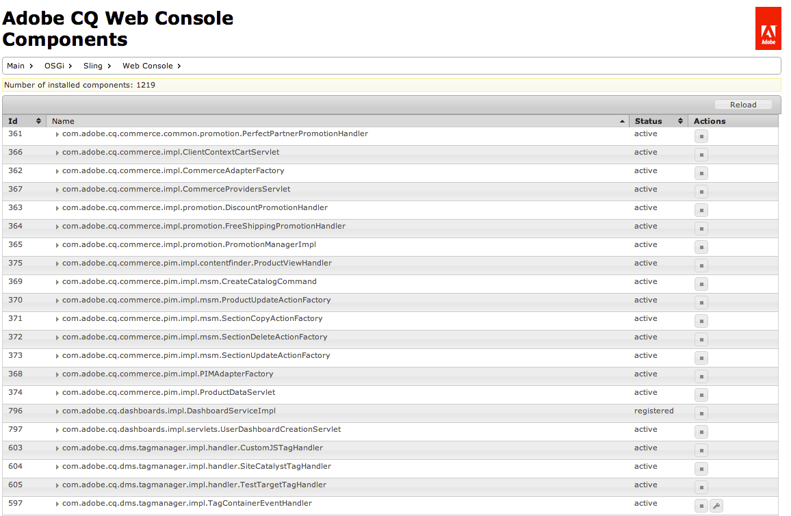

# Webconsole{#web-console}

De console van het Web in Adobe Experience Manager (AEM) is gebaseerd op de [ Console van het Beheer van het Web van Apache Felix ](https://felix.apache.org/documentation/subprojects/apache-felix-web-console.html). Apache Felix is een communautaire inspanning om het OSGi R4-dienstenplatform uit te voeren, dat het OSGi-framework en de standaarddiensten omvat.

>[!NOTE]
>
>Voor de console van het Web, hebben om het even welke beschrijvingen die standaardmontages vermelden met het Verschuiven gebreken.
>
>AEM heeft zijn eigen gebreken en zo zouden de geplaatste gebreken van die op de console kunnen verschillen worden gedocumenteerd.

De console van het Web biedt een selectie lusjes voor het handhaven van de bundels OSGi aan, die omvatten:

* [ Configuratie ](#configuration): gebruikt voor het vormen van de bundels OSGi, en is daarom het onderliggende mechanisme om AEM systeemparameters te vormen
* [ Bundels ](#bundles): gebruikt voor het installeren van bundels
* [ Componenten ](#components): gebruikt voor het controleren van het statuut van componenten die voor AEM worden vereist

Alle aangebrachte wijzigingen worden onmiddellijk toegepast op het actieve systeem. U hoeft de computer niet opnieuw op te starten.

De console is toegankelijk vanuit `../system/console`, bijvoorbeeld:

`http://localhost:4502/system/console/components`

## Configuratie {#configuration}

Het **lusje van de Configuratie** wordt gebruikt voor het vormen van de bundels OSGi, en is daarom het onderliggende mechanisme om AEM systeemparameters te vormen.

>[!NOTE]
>
>Zie {Configuratie 0} OSGi met de Console van het Web [&#128279;](/help/sites-deploying/configuring-osgi.md#osgi-configuration-with-the-web-console) voor verdere details.

Het **lusje van de Configuratie** kan door één van beide worden betreden:

* Het vervolgkeuzemenu:

  **OSGi >**

* De URL, bijvoorbeeld:

  `http://localhost:4502/system/console/configMgr`

Er wordt een lijst met configuraties weergegeven:

Er zijn twee soorten configuraties beschikbaar bij de drop-down lijsten op dit scherm:

* **Configuraties**

  Hiermee kunt u de bestaande configuraties bijwerken. Deze hebben een Persistent Identity (PID) en kunnen:

   * standaard en integraal aan AEM; deze zijn vereist, als geschrapt de waarden aan de standaardmontages terugkeren.
   * instanties die zijn gemaakt met fabrieksconfiguraties; deze instanties worden gemaakt door de gebruiker en met Verwijderen wordt de instantie verwijderd.

* **de Configuraties van de Fabriek**

  Maak een instantie van het vereiste functieobject.

  Dit wordt toegewezen aan een Blijvende Identiteit en vervolgens vermeld in de vervolgkeuzelijst Configuraties.

Als u een item in de lijst selecteert, worden de parameters met betrekking tot die configuratie weergegeven:

Vervolgens kunt u de parameters naar wens bijwerken en:

* **sparen**

  Sla de wijzigingen op.

  Voor een Configuratie van de Fabriek, leidt dit tot een geval met een Blijvende Identiteit. Het nieuwe exemplaar wordt vermeld onder Configuraties.

* **Terugstellen**

  Herstel de parameters die op het scherm worden getoond aan die het laatst worden bewaard.

* **Schrapping**

  Verwijder de huidige configuratie. Indien standaard, worden de parameters teruggegeven aan de standaardmontages. Indien gecreeerd van een Configuratie van de Fabriek, dan wordt de specifieke instantie geschrapt.

* **unbind**

  Koppel de huidige configuratie los van de bundel.

* **annuleert**

  Alle huidige wijzigingen annuleren.

## Bundels {#bundles}

Het **lusje van Bundels** is het mechanisme om de bundels te installeren OSGi die voor AEM worden vereist. Het tabblad is toegankelijk op een van de volgende manieren:

* Het vervolgkeuzemenu:

  **OSGi >**

* De URL, bijvoorbeeld:

  `http://localhost:4502/system/console/bundles`

Er wordt een lijst met bundels weergegeven:

Met dit tabblad kunt u:

* **installeer of Update**

  U kunt **doorbladeren** om het dossier te vinden dat uw bundel bevat en te specificeren of het **&#x200B;**&#x200B;onmiddellijk Begin zou moeten **en waarop** het Niveau van het Begin.

* **herladen**

  Hiermee vernieuwt u de weergegeven lijst.

* **verfrist zich Pakketten**

  Hiermee controleert u de referenties van alle pakketten en vernieuwt u deze zo nodig.

  Na een update kan de oude en de nieuwe versie bijvoorbeeld nog steeds actief zijn als gevolg van eerdere verwijzingen. Met deze optie worden alle verwijzingen naar de nieuwe versie gecontroleerd en verplaatst, zodat de oude versie stopt.

* **Begin**

  Hiermee wordt een bundel gestart op basis van het opgegeven beginniveau.

* **Einde**

  Stopt de bundel.

* **Uninstall**

  Hiermee wordt de bundel van het systeem verwijderd.

* **zie de status**

  In de lijst wordt de status van de bundel opgegeven. Klik op de naam van een specifieke bundel met meer informatie.

>[!NOTE]
>
>Na **Update**, adviseert de Adobe dat u a **uitvoert verfris Pakketten**.

## Onderdelen {#components}

Het **lusje van Componenten** laat u toelaten en/of de diverse componenten onbruikbaar maken. Het kan worden benaderd door:

* Het vervolgkeuzemenu:

  **Hoofd >**

* De URL, bijvoorbeeld:

  `http://localhost:4502/system/console/components`

Er wordt een lijst met componenten weergegeven. Er zijn verschillende pictogrammen beschikbaar waarmee u configuratiedetails voor een specifieke component kunt inschakelen, uitschakelen of (waar van toepassing) openen.

Wanneer u op de naam van een bepaalde component klikt, wordt meer informatie over de status weergegeven. Hier kunt u de component ook in-, uitschakelen of opnieuw laden.

>[!NOTE]
>
>Het inschakelen of uitschakelen van een component is alleen van toepassing tot AEM/CRX opnieuw wordt gestart.
>
>De begintoestand wordt gedefinieerd binnen de componentdescriptor, die tijdens de ontwikkeling wordt gegenereerd en in de bundel wordt opgeslagen op het moment dat de bundel wordt gemaakt.
