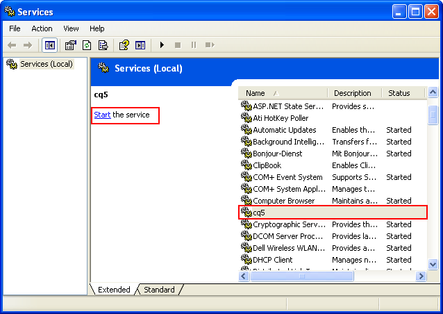

# Aangepaste standalone installatie{#custom-standalone-install}

In deze sectie worden de opties beschreven die beschikbaar zijn wanneer u een zelfstandige AEM installeert. U kunt ook [Opslagelementen](/help/sites-deploying/storage-elements-in-aem-6.md) voor meer informatie over het kiezen van het back-end opslagtype na de nieuwe installatie AEM 6.

## Het veranderen van het Aantal van de Haven door het Dossier anders te noemen {#changing-the-port-number-by-renaming-the-file}

De standaardpoort voor AEM is 4502. Als die haven niet beschikbaar of reeds in gebruik is, vormt QuickStart automatisch om het eerste beschikbare havenaantal als volgt te gebruiken: 4502, 8080, 8081, 8082, 8083, 8084, 8085, 888, 9362, `<*random*>`.

U kunt het poortnummer ook instellen door de naam van het JAR-bestand met de naam QuickStart te wijzigen, zodat de bestandsnaam het poortnummer bevat, bijvoorbeeld `cq5-publish-p4503.jar` of `cq5-author-p6754.jar`.

Er zijn verschillende regels die moeten worden gevolgd bij het wijzigen van de naam van het snelstartjar-bestand:

* Wanneer u de naam van het bestand wijzigt, moet u beginnen met `cq;` zoals in `cq5-publish-p4503.jar`.

* U wordt aangeraden *altijd* voegt u het poortnummer toe met -p; zoals in cq5-publish-p4503.jar of cq5-signer-p6754.jar.

>[!NOTE]
>
>Dit moet ervoor zorgen dat u zich geen zorgen hoeft te maken over het voldoen aan de regels die worden gebruikt voor het uitpakken van het poortnummer:
>
>* het havenaantal moet 4 of 5 cijfers zijn
>* deze cijfers moeten na een streepje komen
>* als er andere cijfers in filename zijn, dan moet het havenaantal met vooraf worden bepaald `-p`
>* het voorvoegsel &quot;cq5&quot; aan het begin van de bestandsnaam wordt genegeerd
>

>[!NOTE]
>
>U kunt het poortnummer ook wijzigen met de opdracht `-port` in de startopdracht.

### Overwegingen bij Java 11 {#java-considerations}

Als u Oracle Java 11 (of over het algemeen versies van Java nieuwer dan 8) in werking stelt, moeten de extra schakelaars aan uw bevellijn worden toegevoegd wanneer het beginnen van AEM.

* Het volgende - `-add-opens` de schakelaars moeten worden toegevoegd om de verwante berichten van de bezinningstoegang WARNING in te verhinderen `stdout.log`

```shell
--add-opens=java.desktop/com.sun.imageio.plugins.jpeg=ALL-UNNAMED --add-opens=java.base/sun.net.www.protocol.jrt=ALL-UNNAMED --add-opens=java.naming/javax.naming.spi=ALL-UNNAMED --add-opens=java.xml/com.sun.org.apache.xerces.internal.dom=ALL-UNNAMED --add-opens=java.base/java.lang=ALL-UNNAMED --add-opens=java.base/jdk.internal.loader=ALL-UNNAMED --add-opens=java.base/java.net=ALL-UNNAMED -Dnashorn.args=--no-deprecation-warning
```

* Bovendien moet u de `-XX:+UseParallelGC` Schakel over om mogelijke prestatieproblemen te beperken.

Hieronder ziet u een voorbeeld van hoe de extra JVM-parameters eruit moeten zien wanneer u AEM start op Java 11:

```shell
-XX:+UseParallelGC --add-opens=java.desktop/com.sun.imageio.plugins.jpeg=ALL-UNNAMED --add-opens=java.base/sun.net.www.protocol.jrt=ALL-UNNAMED --add-opens=java.naming/javax.naming.spi=ALL-UNNAMED --add-opens=java.xml/com.sun.org.apache.xerces.internal.dom=ALL-UNNAMED --add-opens=java.base/java.lang=ALL-UNNAMED --add-opens=java.base/jdk.internal.loader=ALL-UNNAMED --add-opens=java.base/java.net=ALL-UNNAMED -Dnashorn.args=--no-deprecation-warning
```

Tot slot als u een instantie in werking stelt die van AEM 6.3 wordt bevorderd, zorg ervoor het volgende bezit wordt geplaatst aan **true** krachtens `sling.properties`:

* `felix.bootdelegation.implicit`

## Modi uitvoeren {#run-modes}

**Modus Uitvoeren** Laat u uw AEM instantie voor een specifiek doel stemmen; bijvoorbeeld, auteur of publiceert, test, ontwikkeling, Intranet, etc. Met deze modi kunt u ook het gebruik van voorbeeldinhoud beheren. Deze voorbeeldinhoud wordt gedefinieerd voordat de quickstart wordt gemaakt en kan pakketten, configuraties, enzovoort bevatten. Dit kan met name handig zijn voor installaties die klaar zijn voor de productie wanneer u de installatie slank en zonder voorbeeldinhoud wilt houden. Zie voor meer informatie:

* [Modi uitvoeren](/help/sites-deploying/configure-runmodes.md)

## Een leverancier voor het installeren van bestanden toevoegen {#adding-a-file-install-provider}

Standaard is de map `crx-quickstart/install` wordt gecontroleerd op bestanden.
Deze map bestaat niet, maar kan eenvoudig bij uitvoering worden gemaakt.

Als een bundel, configuratie of inhoudspakket in deze folder wordt gezet, wordt het automatisch opgenomen en geïnstalleerd. Als het wordt verwijderd, wordt het verwijderd.
Het is een andere manier om bundels, inhoudspakketten of configuraties aan de bewaarplaats te zetten.

Dit is vooral interessant voor verschillende gebruiksgevallen:

* Tijdens de ontwikkeling, zou het gemakkelijker kunnen zijn om iets in het dossiersysteem te zetten.
* Als er iets mis gaat, zijn de webconsole en de opslagplaats niet bereikbaar. Met dit kunt u extra bundels in deze folder zetten en zij zouden moeten worden geïnstalleerd.
* De `crx-quickstart/install` U kunt een map maken voordat u de snelstartmap start en u kunt daar extra pakketten plaatsen.

>[!NOTE]
>
>Zie ook [CRX-pakketten automatisch installeren bij het opstarten van de server](https://helpx.adobe.com/experience-manager/kb/HowToInstallPackagesUsingRepositoryInstall.html) voor voorbeelden.

## Adobe Experience Manager installeren en starten als Windows-service {#installing-and-starting-adobe-experience-manager-as-a-windows-service}

>[!NOTE]
>
>Ben zeker om de volgende procedure uit te voeren terwijl het programma werd geopend als Beheerder of begin/stel deze stappen in werking gebruikend **Uitvoeren als beheerder** contextmenu-selectie.
>
>Wordt aangemeld als een gebruiker met beheerdersrechten **ontoereikend**. Als u zich niet als beheerder hebt aangemeld bij het uitvoeren van deze stappen, ontvangt u **Toegang geweigerd** fouten.

Om AEM als dienst van Vensters te installeren en te beginnen:

1. Open het bestand crx-quickstart\opt\helpers\instsrv.bat in een teksteditor.
1. Als u een 64-bits Windows-server configureert, vervangt u alle exemplaren van prunsrv door een van de volgende opdrachten, afhankelijk van het besturingssysteem:

   * prunsrv_amd64
   * prunsrv_ia64

   Dit bevel haalt het aangewezen manuscript aan dat de de dienstdaemon van Vensters in Java met 64 bits in plaats van Java met 32 bits begint.

1. Verhoog de PermGen JVM-parameter om te voorkomen dat het proces in meerdere processen wordt vervormd. Zoek de `set jvm_options` en stel de waarde als volgt in:

   `set jvm_options=-Xmx1792m`

1. Opdrachtprompt openen, de huidige map wijzigen in de map crx-quickstart/opt/helpers van de AEM-installatie en de volgende opdracht invoeren om de service te maken:

   `instsrv.bat cq5`

   Om te verifiëren dat de dienst wordt gecreeerd, open de Diensten in het Administratieve Controlebord of type van Hulpmiddelen `start services.msc` in Opdrachtprompt. De cq5-service wordt in de lijst weergegeven.

1. Start de service op een van de volgende manieren:

   * Klik in het configuratiescherm Services op cq5 en klik op Start.

   

   * Typ in de opdrachtregel het begin cq5 van het net.

   

1. De vensters wijst erop dat de dienst loopt. AEM wordt gestart en het uitvoerbare bestand van de prunsrv wordt weergegeven in Taakbeheer. Navigeer in uw webbrowser naar AEM, bijvoorbeeld `https://localhost:4502` om AEM te gebruiken.

   

>[!NOTE]
>
>De bezitswaarden in het instsrv.bat- dossier worden gebruikt wanneer het creëren van de dienst van Vensters. Als u de eigenschapswaarden in instsrv.bat bewerkt, moet u de service verwijderen en opnieuw installeren.

>[!NOTE]
>
>Wanneer u AEM als service installeert, moet u het absolute pad voor de logboekmap opgeven in `com.adobe.xmp.worker.files.ncomm.XMPFilesNComm` in Configuratiebeheer.

Klik op **Stoppen** in de **Services** navigeer naar de map en typ `instsrv.bat -uninstall cq5`. De service wordt verwijderd uit de lijst in het dialoogvenster **Services** regelpaneel of in de lijst op de opdrachtregel wanneer u typt `net start`.

## De locatie van de tijdelijke werkmap opnieuw definiëren {#redefining-the-location-of-the-temporary-work-directory}

De standaardlocatie van de tijdelijke map van de Java-machine is `/tmp`. AEM gebruikt deze map bijvoorbeeld ook bij het maken van pakketten.

Als u de locatie van de tijdelijke map wilt wijzigen (bijvoorbeeld als u een map met meer vrije ruimte nodig hebt), definieert u een * `<new-tmp-path>`* door de JVM-parameter toe te voegen:

`-Djava.io.tmpdir="/<*new-tmp-path*>"`

aan:

* de bevellijn van het serveropstarten
* de CQ_JVM_OPTS-omgevingsparameter in de server- of startscript

## Meer opties beschikbaar in het QuickStart-bestand {#further-options-available-from-the-quickstart-file}

Verdere opties en naamgevingsconventies worden beschreven in het Help-bestand van QuickStart, dat beschikbaar is via de optie -help. Voor toegang tot de Help typt u:

* `java -jar cq-quickstart-6.5.0.jar -help`

>[!CAUTION]
>
>Deze opties zijn geldig vanaf de oorspronkelijke versie van AEM 6.5 (6.5.0.0). De veranderingen in recentere versies van SP zijn mogelijk.

```shell
Loading quickstart properties: default
Loading quickstart properties: instance
Setting properties from filename '/Users/Desktop/AEM/cq-quickstart-6.5.0.jar'
--------------------------------------------------------------------------------
Adobe Experience Manager Quickstart (build 20190328)                            
--------------------------------------------------------------------------------
Usage:                                                                          
 Use these options on the Quickstart command line.                              
--------------------------------------------------------------------------------

-help (--help,-h)
         Show this help message                                                 
-quickstart.server.port (-p,-port) <port>
         Set server port number                                                 
-contextpath (-c,-org.apache.felix.http.context_path) <contextpath>
         Set context path                                                       
-debug <port>
         Enable Java Debugging on port number; forces forking                   
-gui 
         Show GUI if running on a terminal                                      
-nobrowser (-quickstart.nobrowser)
         Do not open browser at startup                                         
-unpack
         Unpack installation files only, do not start the server (implies       
         -verbose)                                                              
-v (-verbose)
         Do not redirect stdout/stderr to files and do not close stdin          
-nofork
         Do not fork the JVM, even if not running on a console                  
-fork
         Force forking the JVM if running on a console, using recommended       
         default memory settings for the forked JVM.                            
-forkargs <args> [<args> ...]
         Additional arguments for the forked JVM, defaults to '-Xmx1024m        
         -XX:MaxPermSize=256m '.  Use -- to specify values starting with -,     
         example: '-forkargs -- -server'                                        
-a (--interface) <interface>
         Optional IP address (interface) to bind to                             
-pt <string>
         Process type (main/fork) - do not use directly, used when forking a    
         process                                                                
-r <string> [<string> [<string> [<string> [<string> [<string> [<string> [<string> [<string> [<string>]]]]]]]]]
         Runmode(s) - Use this to define the run mode(s)                        
-b <string>
         Base folder - defines the path under which the quickstart work folder  
         is created                                                             
-low-mem-action <string>
         Low memory action - what to do if memory is insufficient at startup    
-use-control-port
         Start a control port                                                   
-nointeractive
         Start with no interactivity                                            
-ll <level>
         Define launchpad log level (1 = error...4 = debug)                     
-n   
         Do not install shutdown hook                                           
-D<property>=<value>
         Additional framework properties.                                       
-listener-port <listener-port>
         Set listener port number                                               
-x <string>
         Run a Quickstart extension.                                            
  Options for executing Quickstart extensions:
                                                                                
    -xargs <arg> [<arg> ...]
         Construct an arguments list for a Quickstart extension (for example, -xargs -- 
         -arg1 val1 -arg2 val2).                                                
--------------------------------------------------------------------------------
Quickstart filename options                                                     
--------------------------------------------------------------------------------
Usage:                                                                          
 Rename the jar file, including one of the patterns shown below, to set the     
corresponding option. Command-line options have priority on these filename      
patterns.                                                                       
--------------------------------------------------------------------------------

-NNNN
         Include -NNNN.jar or -pNNNN in the renamed jar filename to run on port 
         NNNN, for example: quickstart-8085.jar                                 
-nobrowser
         Include -nobrowser in the renamed jar filename to avoid opening the    
         browser at startup, example: quickstart-nobrowser-8085.jar             
-publish
         Include -publish in the renamed jar filename to run in "publish" mode, 
         example: cq-publish-7502.jar                                           
-dynamicmedia
         Include -dynamicmedia in the renamed jar filename to run in            
         "dynamicmedia" mode, example: quickstart-dynamicmedia-4502.jar         
-dynamicmedia_scene7
         Include -dynamicmedia_scene7 in the renamed jar filename to run in     
         "dynamicmedia_scene7" mode, example:                                   
         quickstart-dynamicmedia_scene7-p4502.jar                               
--------------------------------------------------------------------------------
The license.properties file
--------------------------------------------------------------------------------
  The license.properties file stores licensing information, created from the    
  licensing form displayed on first startup and stored in the folder from where 
  Quickstart is run.                                                            
--------------------------------------------------------------------------------
Log files
--------------------------------------------------------------------------------
  Once Quickstart has been unpacked and started, log files can be found under   
  /Users/aemdocs/CQInstallationKits/AEM-65150-L8/crx-quickstart/logs.           
--------------------------------------------------------------------------------
```

## AEM installeren in de Amazon EC2-omgeving {#installing-aem-in-the-amazon-ec-environment}

Wanneer u AEM installeert op een Amazon Elastic Compute Cloud (EC2)-instantie, als u zowel auteur als publicatie op het EC2-exemplaar installeert, wordt de Author-instantie correct geïnstalleerd door de procedure op [Instanties van AEM Manager installeren](#installinginstancesofaemmanager)De instantie Publiceren wordt echter Auteur.

Ga als volgt te werk voordat u de instantie Publish op uw EC2-omgeving installeert:

1. Pak het jar-bestand voor de instantie Publish uit voordat u de instantie voor de eerste keer start. Als u het bestand wilt uitpakken, gebruikt u de volgende opdracht:

   ```xml
   java -jar quickstart.jar -unpack
   ```

   >[!NOTE]
   >
   >Als u de modus wijzigt **na** wanneer u de instantie de eerste keer start, kunt u de runmode niet wijzigen.

1. Start de instantie door deze uit te voeren:

   ```xml
   java -jar quickstart.jar -r publish
   ```

   >[!CAUTION]
   >
   >Zorg ervoor dat u de instantie eerst uitvoert nadat u deze hebt uitgepakt door de bovenstaande opdracht uit te voeren. Anders wordt de vulling quickstart.properties niet gegenereerd. Zonder dit bestand zullen toekomstige AEM upgrades mislukken.

1. In de **bin** de map openen **start** en controleer de volgende sectie:

   ```xml
   # runmode(s)
   if [ -z "$CQ_RUNMODE" ]; then
    CQ_RUNMODE='author'
   fi
   ```

1. De runmode wijzigen in **publish** en sla het bestand op.

   ```xml
   # runmode(s)
   if [ -z "$CQ_RUNMODE" ]; then
    CQ_RUNMODE='publish'
   fi
   ```

1. Stop de instantie en start deze opnieuw door de **start** script.

## De installatie controleren {#verifying-the-installation}

De volgende verbindingen kunnen worden gebruikt om te verifiëren dat uw installatie operationeel is (alle voorbeelden zijn op de basis dat de instantie op haven 8080 van localhost loopt, dat CRX onder /crx en Launchpad onder /) geïnstalleerd is:

* `https://localhost:8080/crx/de`
De CRXDE Lite-console.

* `https://localhost:8080/system/console`
De webconsole.

## Handelingen na installatie {#actions-after-installation}

Hoewel er vele mogelijkheden zijn om AEM WCM te vormen, zouden bepaalde acties moeten worden ondernomen, of minstens onmiddellijk na installatie herzien:

* Raadpleeg de [Beveiligingscontrolelijst](/help/sites-administering/security-checklist.md) voor taken die nodig zijn om ervoor te zorgen dat uw systeem veilig blijft.
* Herzie de lijst van standaardgebruikers en groepen die met AEM WCM geïnstalleerd zijn. Controleer of u actie wilt ondernemen voor andere accounts - raadpleeg [Beveiliging en gebruikersbeheer](/help/sites-administering/security.md) voor nadere bijzonderheden.

## Toegang tot CRXDE Lite en de webconsole {#accessing-crxde-lite-and-the-web-console}

Nadat AEM WCM is gestart, hebt u ook toegang tot:

* [CRXDE Lite](#accessing-crxde-lite) - wordt gebruikt voor toegang tot en beheer van de gegevensopslagplaats
* [Webconsole](#accessing-the-web-console) - wordt gebruikt om de bundels te beheren of te vormen OSGi (ook genoemd als Console OSGi)

### Toegang tot CRXDE Lite {#accessing-crxde-lite}

Als u CRXDE Lite wilt openen, selecteert u **CRXDE Lite** vanuit het welkomstscherm of gebruik uw browser om naar

```
 https://<<i>host</i>>:<<i>port</i>>/crx/de/index.jsp
```

Bijvoorbeeld:
`https://localhost:4502/crx/de/index.jsp`


#### Toegang tot de webconsole {#accessing-the-web-console}

Als u toegang wilt tot de Adobe CQ-webconsole, kunt u **OSGi Console** vanuit het welkomstscherm of gebruik uw browser om naar

```
 https://<host>:<port>/system/console
```

Bijvoorbeeld:
`https://localhost:4502/system/console`
of voor de pagina Bundles
`https://localhost:4502/system/console/bundles`


Zie [OSGi Configuratie met de Console van het Web](/help/sites-deploying/configuring-osgi.md#osgi-configuration-with-the-web-console) voor nadere bijzonderheden.

## Problemen oplossen {#troubleshooting}

Voor informatie over het behandelen van kwesties die tijdens installatie kunnen verschijnen, zie:

* [Problemen oplossen](/help/sites-deploying/troubleshooting.md)

## Adobe Experience Manager verwijderen {#uninstalling-adobe-experience-manager}

Aangezien AEM in één map installeert, is een hulpprogramma voor verwijderen niet nodig. Het verwijderen van de installatiemap kan eenvoudig zijn, maar hoe u de installatiemap verwijdert, hangt AEM af van wat u wilt bereiken en van welke permanente opslag u gebruikt.

Als permanente opslag is ingesloten in de installatiemap, bijvoorbeeld in de standaard-TarPM-installatie, worden bij het verwijderen van mappen ook gegevens verwijderd.

>[!NOTE]
>
>Adobe raadt u ten zeerste aan een back-up van de opslagplaats te maken voordat u AEM verwijdert. Als u de gehele &lt;cq-installation-directory>, verwijdert u de opslagplaats. Als u de gegevens in de opslagplaats wilt bewaren voordat u de gegevens verwijdert, verplaatst of kopieert u de &lt;cq-installation-directory>/crx-quickstart/repository folder ergens anders alvorens de andere omslagen te schrappen.

Als bij de installatie van AEM externe opslag wordt gebruikt, bijvoorbeeld een databaseserver, worden de gegevens niet automatisch verwijderd wanneer u een map verwijdert. De opslagconfiguratie wordt echter wel verwijderd, waardoor het herstellen van de JCR-inhoud moeilijk wordt.
