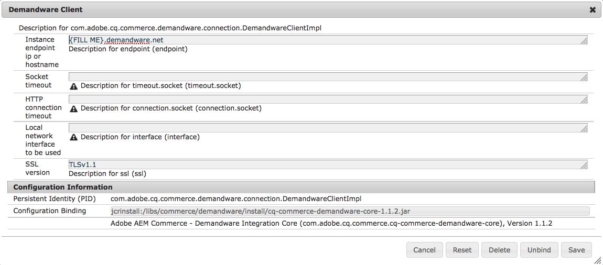
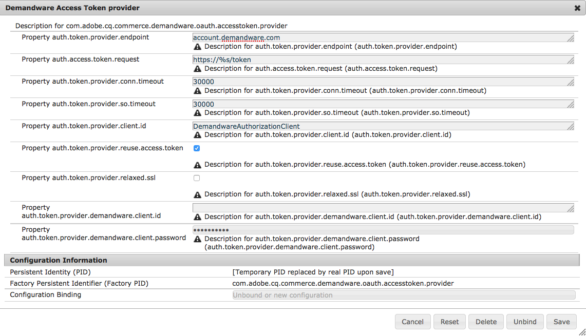

# Salesforce Commerce Cloud{#salesforce-commerce-cloud}

De implementatie van de noodzakelijke e-commercepakketten zal de volledige functionaliteit van het eCommerce-kader bieden, samen met een referentie-implementatie van de eCommerce-functionaliteit zoals voorzien van een implementatie van Salesforce Commerce Cloud/Demandware (inclusief een demonstratiecatalogus).

## Pakketten nodig voor e-handel met Salesforce Commerce Cloud {#packages-needed-for-ecommerce-with-salesforce-commerce-cloud}

Voor de installatie van eCommerce-functionaliteit hebt u het volgende nodig:

* AEM e-Commerce-kader:

   * dit is onderdeel van een standaard AEM-installatie

* Inhoud van AEM Demandware Commerce-pakket

   * cq-6.4.0-featurepack-10262

>[!NOTE]
>
>Deze integratie steunt de instanties van de Koophandel van de Koophandel van Salesforce Cloud/Demandware die worden gevormd om OCAPI versie 17.6 of later te gebruiken.

### Installatie van eCommerce met Salesforce Commerce Cloud {#installation-of-ecommerce-with-salesforce-commerce-cloud}

Om AEM met een de integratieconfiguratie van de Handel van de Demandware (gebruikend de demonstratiecatalogus, Geometrixx Buiten) te installeren, zijn de basisstappen:

1. [Installeer AEM](/help/sites-deploying/deploy.md).
1. Installeer het inhoudspakket met behulp van [pakketbeheer](/help/sites-administering/package-manager.md):
1. [Maak](/help/sites-authoring/page-authoring.md) aanvullende pagina&#39;s die u in AEM nodig hebt.

>[!NOTE]
>
>Navigeer naar [Pakket delen](/help/sites-administering/package-manager.md#package-share)om de pakketten te downloaden.

De serververbinding tussen AEM en de Duidelijke Sandbox moet worden gevormd. Het grootste deel van de configuratie is reeds preconfigured om met het verstrekte pakket van de de demo inhoud te werken SiteGenisis gebruikend standaardwegen, bibliotheken, etc. Als de schakelaar met andere plaatsen en bibliotheken wordt gebruikt, zult u deze configuratie moeten bijwerken.

1. Ga naar [https://localhost:4502/system/console/configMgr](https://localhost:4502/system/console/configMgr).
1. Klik op **Demandware Client**.
1. Ga het eindpunt van de **Instantie ip of hostname** in zoals vereist.

   

1. Click **Save**.
1. Klik **Insteekmodule van de Vraag TransportHandler voor WebDAV**.
1. Stel de **WebDAV-gebruiker** en het **WebDAV-gebruikerswachtwoord** in.

   

1. Click **Save**.

#### Replicatie {#replication}

De replicatie zou na de pakketinstallatie moeten worden toegelaten, kunt u verifiëren dat hier: [https://localhost:4502/etc/replication/agents.author/demandware.html](https://localhost:4502/etc/replication/agents.author/demandware.html)

>[!NOTE]
>
>De replicatieagent wordt gevormd aan het niveau van het informatielogboek door gebrek. Als u meer informatie wilt hebben, kunt u het logboekniveau veranderen om te zuiveren.

#### OAuth {#oauth}

De OAuth-client is geconfigureerd om te werken met een veeleisende sandbox-instantie. Voor testdoeleinden is geen wijziging nodig.

Voor het opvoeren en de productiesystemen, moeten de cliënten OAuth met aangewezen cliëntidentiteitskaart en wachtwoord worden gevormd.

1. Ga naar [https://localhost:4502/system/console/configMgr](https://localhost:4502/system/console/configMgr).
1. Klik op **Tokenprovider** voor toegang tot hardware.

   

1. Wijzig desgewenst de waarden en klik op **Opslaan**.

### Salesforce Commerce Cloud Sandbox {#salesforce-commerce-cloud-sandbox}

De Duandware Sandbox moet worden gevormd om de nieuwe het malplaatjemotor van de Snelheid in werking te stellen.

>[!NOTE]
>
>De volgende wizard maakt geen deel uit van de AEM Demandware-connector. Deze pagina wordt geleverd als onderdeel van het pakket met demo-inhoud, zodat u snel de SiteGenesis-demopagina&#39;s kunt instellen.

1. Ga naar [https://localhost:4502/etc/demandware/init.html](https://localhost:4502/etc/demandware/init.html).
1. Click **Edit.**
1. Controleer de waarden en klik op **OK**.
1. Klik op **Initialiseren**.
1. Ga naar de WebDAV-map en controleer op gepubliceerde sjabloonbestanden, bijvoorbeeld onder `adobe01-tech-prtnr-na01-dw.demandware.net/on/demandware.servlet/webdav/Sites/Dynamic/SiteGenesis`.

   >[!NOTE]
   >
   >De extensie wordt `.vs`.

1. Controleer ook op geëxporteerde JS- en CSS-bestanden, bijvoorbeeld onder `adobe01-tech-prtnr-na01-dw.demandware.net/on/demandware.servlet/webdav/Sites/Libraries/SiteGenesisSharedLibrary`.

