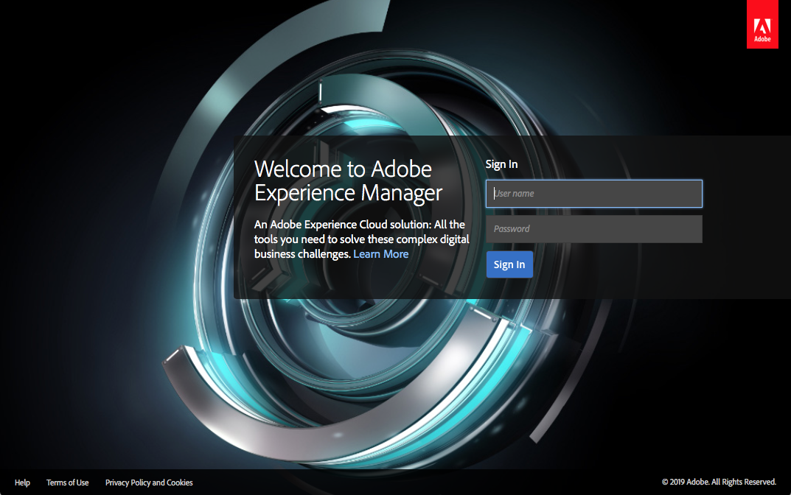

# Implementeren en onderhouden{#deploying-and-maintaining}

Op deze pagina vindt u:

* [Basisconcepten](#basic-concepts)

   * [Wat is AEM?](#what-is-aem)
   * [Typische implementaties](#typical-deployment-scenarios)

      * [Op locatie](#on-premise)
      * [Managed Services met Cloud Manager](#managed-services-using-cloud-manager)

* [Aan de slag](#getting-started)

   * [Vereisten](#prerequisites)
   * [De software ophalen](#getting-the-software)
   * [Standaard lokale installatie](#default-local-install)
   * [Auteur- en publicatie-installaties](#author-and-publish-installs)
   * [Onverpakte installatiemap](#unpacked-install-directory)
   * [Starten en stoppen](#starting-and-stopping)

Als u zich vertrouwd hebt gemaakt met deze basisbeginselen, vindt u meer geavanceerde en gedetailleerde informatie op de volgende subpagina&#39;s:

* [Technische vereisten](/help/sites-deploying/technical-requirements.md)
* [Aanbevolen implementaties](/help/sites-deploying/recommended-deploys.md)
* [Aangepaste standalone installatie](/help/sites-deploying/custom-standalone-install.md)
* [Installeren van toepassingsserver](/help/sites-deploying/application-server-install.md)
* [Problemen oplossen](/help/sites-deploying/troubleshooting.md)
* [Start en stop van opdrachtregel](/help/sites-deploying/command-line-start-and-stop.md)
* [Configureren](/help/sites-deploying/configuring.md)
* [Upgrade uitvoeren naar AEM 6.5](/help/sites-deploying/upgrade.md)
* [eCommerce](/help/commerce/cif-classic/deploying/ecommerce.md)
* [Hoe kan ik-artikelen configureren](/help/sites-deploying/ht-deploy.md)
* [Webconsole](/help/sites-deploying/web-console.md)
* [Problemen met replicatie oplossen](/help/sites-deploying/troubleshoot-rep.md)
* [Aanbevolen procedures](/help/sites-deploying/best-practices.md)
* [Gemeenschappen inzetten](/help/communities/deploy-communities.md)
* [Inleiding tot het AEM-platform](/help/sites-deploying/platform.md)
* [Richtlijnen voor prestaties](/help/sites-deploying/performance-guidelines.md)
* [Aan de slag met AEM Mobile](/help/mobile/getting-started-aem-mobile.md)
* [&#x200B; wat is AEM Screens?](https://experienceleague.adobe.com/docs/experience-manager-screens/user-guide/aem-screens-introduction.html?lang=nl-NL)

## Basisconcepten {#basic-concepts}

### Wat is AEM? {#what-is-aem}

Adobe Experience Manager is een op het web gebaseerd clientserversysteem voor het bouwen, beheren en implementeren van commerciële websites en verwante services. Het combineert verscheidene infrastructuur-niveau en toepassing-vlakke functies in één enkel geïntegreerd pakket.

Op infrastructuurniveau biedt AEM het volgende:

* **de Server van de Toepassing van het Web**: AEM kan op standalone wijze (het omvat een geïntegreerde Webserver van de Jetty) of als Webtoepassing binnen een server van de derdetoepassing worden opgesteld.
* **Kader van de Toepassing van het Web**: AEM neemt het Verschuivende Kader van de Toepassing van het Web op dat het schrijven van RESTful, tevreden-georiënteerde Webtoepassingen vereenvoudigt.
* **Bewaarplaats van de Inhoud**: AEM omvat een Bewaarplaats van de Inhoud Java™ (JCR), een type van hiërarchisch gegevensbestand dat specifiek voor ongestructureerde en semi-gestructureerde gegevens wordt ontworpen. De gegevensopslagruimte slaat niet alleen de gebruikersgerichte inhoud op, maar ook alle code, sjablonen en interne gegevens die door de toepassing worden gebruikt.

Op basis hiervan biedt AEM ook verschillende functies op toepassingsniveau voor het beheer van:

* **Websites**
* **Mobiele Toepassingen**
* **Digitale Publicaties**
* **Forms &amp; Documenten**
* **Digitale Assets**
* **Gemeenschappen**
* **Online Commerce**

Tot slot kunnen de klanten deze infrastructuur en toepassing-vlakke bouwstenen gebruiken om aangepaste oplossingen tot stand te brengen door toepassingen van hun te bouwen.

De server van AEM is **op Java-Gebaseerd** en loopt op de meeste werkende systemen die dat platform steunen. Alle cliëntinteractie met AEM wordt gedaan door a **Webbrowser**.

>[!NOTE]
>
>De functie Adaptive Forms, die beschikbaar is in AEM 6.5 QuickStart, is alleen ontworpen voor exploratie- en evaluatiedoeleinden. Voor productiegebruik is het van essentieel belang een geldige licentie voor AEM Forms te verkrijgen, aangezien voor de adaptieve Forms-functionaliteit een correcte licentie vereist is.

### Typische implementatiescenario&#39;s {#typical-deployment-scenarios}

In AEM-terminologie is een &quot;instantie&quot; een kopie van AEM die op een server wordt uitgevoerd. Bij AEM-installaties worden meestal ten minste twee instanties betrokken, die doorgaans op afzonderlijke computers worden uitgevoerd:

* **Auteur**: Een instantie van AEM die wordt gebruikt om, inhoud tot stand te brengen te uploaden en uit te geven en de website te beheren. Wanneer de inhoud gereed is om live te gaan, wordt deze gekopieerd naar de publicatie-instantie.
* **publiceer**: Een instantie van AEM die de gepubliceerde inhoud aan het publiek dient.

Deze exemplaren zijn identiek wat geïnstalleerde software betreft. Ze worden alleen gedifferentieerd naar configuratie. Bovendien gebruiken de meeste installaties een Dispatcher:

* **Dispatcher**: Een statische Webserver (Apache httpd, Microsoft® IIS, etc.) die met de module van Dispatcher van AEM wordt uitgebreid. Webpagina&#39;s die door de instantie publish worden gemaakt, worden in het cachegeheugen opgeslagen om de prestaties te verbeteren.

Er zijn veel geavanceerde opties en uitbreidingen van deze installatie, maar het basispatroon van auteur, publicatie en Dispatcher staat centraal bij de meeste implementaties. Laten we ons eerst richten op een eenvoudige opstelling. Hierna volgen besprekingen over geavanceerde implementatieopties.

In de volgende secties worden beide scenario&#39;s beschreven:

* **Op-gebouw**: AEM die in uw collectief milieu wordt opgesteld en wordt beheerd.

* **Managed Services - Cloud Manager voor Adobe Experience Manager**: AEM opgesteld en beheerd door Adobe Managed Services.

### Op locatie {#on-premise}

U kunt AEM installeren op servers in uw bedrijfsomgeving. Voorbeelden van gebruikelijke installatieprogramma&#39;s zijn: ontwikkelings-, test- en publicatieomgevingen. Zie [&#x200B; Begonnen het Worden &#x200B;](/help/sites-deploying/deploy.md#getting%20started) voor basisdetails op hoe te om de software van AEM te krijgen om het plaatselijk te installeren.

Om meer over de typische plaatsingen te leren op-gebouw, zie [&#x200B; Geadviseerde Plaatsingen &#x200B;](/help/sites-deploying/recommended-deploys.md).

### Managed Services met Cloud Manager {#managed-services-using-cloud-manager}

AEM Managed Services is een complete oplossing voor Digital Experience Management. Het biedt voordelen van de oplossing van de ervaringslevering in de wolk terwijl het handhaven van alle controle, veiligheid, en aanpassingsvoordelen van een plaatsing op-premise. AEM Managed Services stelt klanten in staat sneller te starten door te implementeren in de cloud en door te leren van de beste praktijken en support van Adobe. Organisaties en zakelijke gebruikers kunnen hun klanten zo weinig mogelijk tijd in dienst nemen, hun marktaandeel vergroten en zich richten op het maken van innovatieve marketingcampagnes en tegelijk de last voor de IT-afdeling verminderen.

Met AEM Managed Services kunnen klanten de volgende voordelen realiseren:

**Snellere Tijd aan Markt:** met flexibele wolkeninfrastructuur van Adobe Managed Services, kunnen de organisaties succesvolle digitale ervaringen snel plannen, lanceren en optimaliseren. Adobe beheert de cloudarchitectuur zonder extra kapitaal, hardware of software vereist en Adobe Customer Solutions Engineers, hulp met de AEM-architectuur, provisioning, aanpassing voor het maken van verbinding met back-end apps en &#39;go-live&#39; best practices.

**Hogere Prestaties:** verstrekt betrouwbare digitale ervaringen voor uw zaken met vier opties van de de dienstbeschikbaarheid 99.5%, 99.9%, 99.95%, en 99.99%. Bovendien maakt het automatische back-up en multimode modellen voor noodherstel mogelijk om betrouwbaarheid en noodbeheer te garanderen.

**Geoptimaliseerde Kosten van IT:** de pro-actieve begeleiding en de organisaties van de expertisehulp blijven huidig op de recentste versie van AEM. Adobe Platinum Maintenance and Support wordt automatisch opgenomen in nieuwe implementaties van AMS Enterprise/Basic, die technische expertise en operationele ervaring bieden om organisaties te helpen hun bedrijfskritieke toepassingen te onderhouden. Gratis basisanalysemogelijkheden of doelmogelijkheden bieden extra waarde, met name voor organisaties uit het midden- en kleinbedrijf die weinig behoefte hebben aan analyses en personalisatie.

**Hoogste Veiligheid:** verzekert onderneming-rang fysiek, netwerk, en gegevensveiligheid door klantentoepassingen in een beperkt-toegangsfaciliteit, achter firewallsystemen, of binnen een virtuele privé wolk te ontvangen. Het omvat virtuele machines van één huurder met robuuste gegevensopslagencryptie, antivirale middelen, en gegevensisolatie.

**Cloud Manager**: Cloud Manager, een deel van het aanbieden van Adobe Experience Manager Managed Services is een zelfbedieningsportaal dat verder organisaties toelaat om Adobe Experience Manager in de wolk zelf-te beheren. Het omvat een geavanceerde ononderbroken integratie en ononderbroken levering (CI/CD) pijpleiding die de teams van IT en implementatiepartners de levering van aanpassingen of updates laat versnellen zonder prestaties of veiligheid te compromitteren. Cloud Manager is alleen beschikbaar voor Adobe Managed Service-klanten.

Meer over de Manager van de Wolk en zijn middelen leren, zie {de Gids van de Gebruiker van 0} Cloud Manager [**&#x200B;**.](https://experienceleague.adobe.com/docs/experience-manager-cloud-manager/content/introduction.html?lang=nl-NL)

## Aan de slag {#getting-started}

### Vereisten {#prerequisites}

Terwijl de productieinstanties in werking worden gesteld op specifieke machines die officieel gesteund OS in werking stellen (zie [&#x200B; Technische Vereisten &#x200B;](/help/sites-deploying/technical-requirements.md)), zal de server van Experience Manager eigenlijk op om het even welk systeem lopen dat [**StandaardUitgave 8 van Java™** &#x200B;](https://www.oracle.com/java/technologies/downloads/#java8) steunt.

Om vertrouwd te raken en zich op AEM te ontwikkelen, is het gebruikelijk om een instantie te gebruiken die op uw lokale computer wordt geïnstalleerd die OS X of Desktopversies van Microsoft® Windows of Linux® in werking stelt.

Op cliënt-kant, werkt AEM met alle moderne browsers (**Microsoft® Edge**, **Internet Explorer** 11, **Chrome &#x200B;** 51+**&#x200B; **, **Firefox &#x200B;** 47+, **Safari** 8+) op zowel Desktop als tablet werkende systemen. Zie [&#x200B; Ondersteunde Platforms van de Cliënt &#x200B;](/help/sites-deploying/technical-requirements.md#supported-client-platforms) voor details.

### De software ophalen {#getting-the-software}

De klanten met een geldig onderhoud en steuncontract zouden een postbericht met een code moeten hebben ontvangen en AEM van de [**Adobe Vergunnende Website** kunnen downloaden &#x200B;](https://licensing.adobe.com/). De bedrijfspartners kunnen downloadtoegang van [**verzoeken spphelp@adobe.com**](mailto:spphelp@adobe.com).

Het AEM-softwarepakket is beschikbaar in twee vormen:

* **cq-quickstart-6.5.0.jar:** Een standalone uitvoerbaar *jar* dossier dat alles omvat die u moet lopen.

* **cq-quickstart-6.5.0.war:** A *oorlog* dossier voor plaatsing in een server van de derdetoepassing.

In de volgende sectie beschrijven wij de **standalone installatie**. Voor details bij het installeren van AEM in een toepassingsserver zie [&#x200B; de Server van de Toepassing installeren &#x200B;](/help/sites-deploying/application-server-install.md).

### Standaard lokale installatie {#default-local-install}

1. Maak een installatiemap op uw lokale computer. Bijvoorbeeld:

   Installatielocatie UNIX®: **/opt/aem**

   Installatielocatie voor Windows: **`C:\aem`**

   Het is ook gebruikelijk om voorbeeldexemplaren in een map rechts op het bureaublad te installeren. In elk geval wordt deze locatie door Adobe algemeen aangeduid als:

   `<aem-install>`

   *de weg van de dossierfolder moet uit slechts de karakters van ASCII van de V.S. bestaan.*

1. Plaats de **jar** en **vergunning** dossiers in deze folder:

   ```shell
   <aem-install>/
       cq-quickstart-6.5.0.jar
       license.properties
   ```

   Als u geen a `license.properties` dossier verstrekt, leidt AEM uw browser aan het a **Welkome** scherm op opstarten opnieuw, waar u een vergunningssleutel kunt ingaan. Als u nog geen geldige licentiecode hebt, moet u een geldige licentiecode aanvragen bij Adobe.

1. Als u de instantie wilt starten in een GUI-omgeving, dubbelklikt u op het bestand **`cq-quickstart-6.5.0.jar`** .

   U kunt AEM ook starten vanaf de opdrachtregel:

   ```shell
       java -Xmx1024M -jar cq-quickstart-6.5.0.jar
   ```

AEM neemt enkele minuten in beslag om het jar-bestand uit te pakken, te installeren en op te starten. Deze procedure leidt tot:

* een **de auteur van AEM** instantie
* lopend op **localhost**
* op haven **4502**

Als u toegang wilt krijgen tot de instantie, moet u de browser raadplegen op:

**`https://localhost:4502`**

Het resultaat in auteursinstantie zal automatisch worden gevormd om met a **te verbinden publiceert instantie** op **`localhost:4503`**.

### Auteur- en publicatie-installaties {#author-and-publish-installs}

Het gebrek installeert (een **auteur** instantie op **`localhost:4502`**) kan eenvoudig worden veranderd door het `jar` dossier anders te noemen alvorens het voor het eerst te lanceren. Het naamgevingspatroon is:

**`cq-<instance-type>-p<port-number>.jar`**

De naam van het bestand wijzigen in

**`cq-author-p4502.jar`**

En het lanceren van het, resulteert in een auteursinstantie die op **`localhost:4502`** loopt.

Ook de naam van het bestand wijzigen en het bestand starten

**`cq-publish-p4503.jar`**

Resulteert in een publicatie-instantie die op **`localhost:4503`** wordt uitgevoerd.

U installeert deze twee varianten bijvoorbeeld in

`<aem-install>/author` en

**`<aem-install>/publish`**

Raadpleeg de volgende bronnen voor meer informatie over het aanpassen van de installatie:

* [Aangepaste standalone installatie](/help/sites-deploying/custom-standalone-install.md)
* [Modi uitvoeren](/help/sites-deploying/configure-runmodes.md)

### Onverpakte installatiemap {#unpacked-install-directory}

Wanneer de snelstartjar voor het eerst wordt gestart, wordt deze zichzelf in dezelfde map uitgepakt onder een nieuwe submap met de naam `crx-quickstart` . U zou het volgende moeten hebben:

```xml
<aem-install>/
    license.properties
    cq-quickstart-6.5.0.jar
    crx-quickstart/
        app/
        bin/
        conf/
        launchpad/
        logs/
        metrics/
        monitoring/
        opt/
        repository/
        threaddumps/
        eula-de_DE.html
        eula-en_US.html
        eula-fr_FR.html
        eula-ja_JP.html
        readme.txt
```

Als de instantie is geïnstalleerd via de gebruikersinterface, wordt automatisch een browservenster geopend en wordt ook een venster van de bureaubladtoepassing geopend met daarin de host en poort van de instantie en een aan/uit-schakelaar:


### Starten en stoppen {#starting-and-stopping}

Wanneer AEM zichzelf heeft uitpakken en voor het eerst is opgestart, door te dubbelklikken op het JAR-bestand in de installatiemap, wordt de instantie gewoon gestart, maar wordt deze niet opnieuw geïnstalleerd.

Om de instantie van GUI tegen te houden, klik **aan/van** schakelaar op het venster van de Desktoptoepassing.

U kunt AEM ook stoppen en starten vanaf de opdrachtregel. Veronderstellend u reeds de instantie voor het eerst hebt geïnstalleerd, zijn de **bevel-lijn manuscripten** hier:

**`<aem-install>/crx-quickstart/bin/`**

Deze map bevat de volgende UNIX® bash shell-scripts:

* **`start`**: hiermee wordt de instantie gestart
* `stop`: hiermee wordt de instantie gestopt
* **`status`**: meldt de status van de instantie
* **`quickstart`**: wordt gebruikt om begininformatie te configureren, indien nodig.

Er zijn ook equivalente **`bat`** bestanden voor Windows. Zie voor meer informatie:

* [Start en stop van opdrachtregel](/help/sites-deploying/command-line-start-and-stop.md)

AEM start en leidt uw webbrowser automatisch om naar de juiste pagina, meestal de aanmeldingspagina, bijvoorbeeld:

`https://localhost:4502/`



Nadat u bent aangemeld, hebt u toegang tot AEM. Raadpleeg de volgende secties voor meer informatie, afhankelijk van uw rol:

* [Authoring](/help/sites-authoring/first-steps.md)
* [Beheer](/help/sites-administering/home.md)
* [Ontwikkelen](/help/sites-developing/getting-started.md)
* [Beheer](/help/managing/best-practices.md)

## Geavanceerde implementatie {#advanced-deployment}

In het bovenstaande gedeelte hebt u een goed inzicht in de basisbeginselen van AEM-installatie. De installatie van een volledig productiesysteem van AEM kan echter aanzienlijk complexer zijn. Zie de volgende subpagina&#39;s voor volledige dekking van geavanceerde installatie:

* [Technische vereisten](/help/sites-deploying/technical-requirements.md)
* [Aanbevolen implementaties](/help/sites-deploying/recommended-deploys.md)
* [Aangepaste standalone installatie](/help/sites-deploying/custom-standalone-install.md)
* [Installeren van toepassingsserver](/help/sites-deploying/application-server-install.md)
* [Problemen oplossen](/help/sites-deploying/troubleshooting.md)
* [Start en stop van opdrachtregel](/help/sites-deploying/command-line-start-and-stop.md)
* [Configureren](/help/sites-deploying/configuring.md)
* [Upgrade uitvoeren naar AEM 6.5](/help/sites-deploying/upgrade.md)
* [eCommerce](/help/commerce/cif-classic/deploying/ecommerce.md)
* [Hoe kan ik-artikelen configureren](/help/sites-deploying/ht-deploy.md)
* [Webconsole](/help/sites-deploying/web-console.md)
* [Problemen met replicatie oplossen](/help/sites-deploying/troubleshoot-rep.md)
* [Aanbevolen procedures](/help/sites-deploying/best-practices.md)
* [Gemeenschappen inzetten](/help/communities/deploy-communities.md)
* [Inleiding tot het AEM-platform](/help/sites-deploying/platform.md)
* [Richtlijnen voor prestaties](/help/sites-deploying/performance-guidelines.md)
* [Aan de slag met AEM Mobile](/help/mobile/getting-started-aem-mobile.md)
* [&#x200B; wat is AEM Screens?](https://experienceleague.adobe.com/docs/experience-manager-screens/user-guide/aem-screens-introduction.html?lang=nl-NL)
