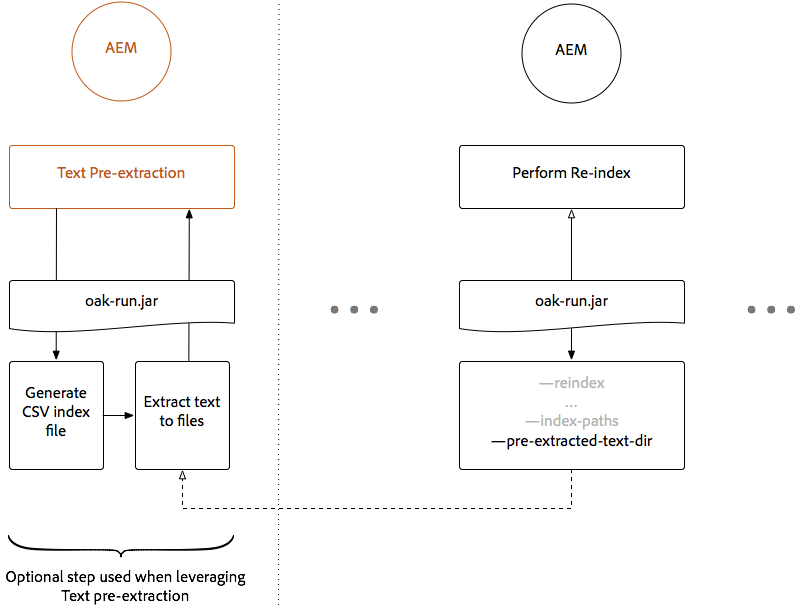
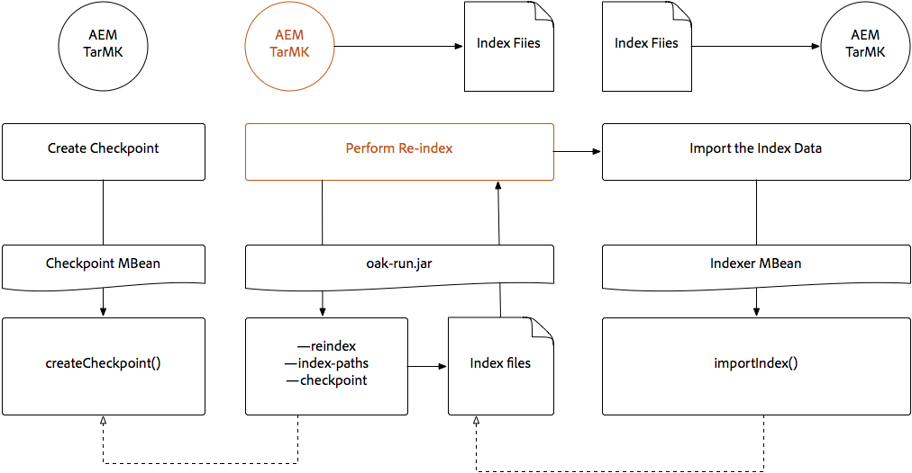

# Indexering via de eiken-run-jar {#indexing-via-the-oak-run-jar}

De eiken-looppas steunt alle indexerende gebruiksgevallen op de bevellijn zonder het moeten van JMX niveau werken. De voordelen van de &quot;eak-run&quot;-aanpak zijn:

1. Het is een nieuwe indexerende toolset voor AEM 6.4
1. Het vermindert tijd-aan-herindex die nuttige gevolgen herindextijden op grotere bewaarplaatsen heeft
1. Het vermindert het hulpbronnenverbruik tijdens het herindexeren van AEM, wat resulteert in betere systeemprestaties voor andere AEM
1. Oak-run biedt out-of-band ondersteuning: als de productieomstandigheden het niet mogelijk maken om opnieuw te indexeren op productie-instanties, kan een gekloonde omgeving worden gebruikt om opnieuw te indexeren om een kritische invloed op de prestaties te voorkomen.

Hieronder volgt een lijst met gebruiksgevallen die kunnen worden gebruikt bij het uitvoeren van indexeringsbewerkingen via de `oak-run` gebruiken.

## Consistentiecontroles index {#indexconsistencychecks}

>[!NOTE]
>
>Voor meer gedetailleerde informatie over dit scenario raadpleegt u [Hoofdlettergebruik 1 - Consistentiecontrole index](/help/sites-deploying/oak-run-indexing-usecases.md#usercase1indexconsistencycheck).

* `oak-run.jar`bepaalt snel of de indexen van het Eik van Lucene corrupt zijn.
* Het is veilig om op een in gebruik AEM instantie voor consistentie te lopen controleniveaus 1 en 2.

## Indexstatistieken {#indexstatistics}

>[!NOTE]
>
>Voor meer gedetailleerde informatie over dit scenario raadpleegt u [Hoofdlettergebruik 2 - Indexstatistieken](/help/sites-deploying/oak-run-indexing-usecases.md#usecase2indexstatistics)

* `oak-run.jar` Hiermee plaatst u alle indexdefinities, belangrijke indexstatussen en indexinhoud voor offline analyse.
* Veilig om uit te voeren op een AEM.

## Beslissingsstructuur voor opnieuw indexeren nadering {#reindexingapproachdecisiontree}

Dit diagram is een beslissingsstructuur voor wanneer de verschillende herindexeringsbenaderingen moeten worden gebruikt.

## MongoMK/RDMBMK opnieuw indexeren {#reindexingmongomk}

>[!NOTE]
>
>Voor meer gedetailleerde informatie over dit scenario raadpleegt u [Hoofdlettergebruik 3 - opnieuw indexeren](/help/sites-deploying/oak-run-indexing-usecases.md#usecase3reindexing).

### Voorvertoning van tekst voor SegmentNodeStore en DocumentNodeStore {#textpre-extraction}

[Tekstomloop vooraf](/help/sites-deploying/best-practices-for-queries-and-indexing.md#how-to-perform-text-pre-extraction) (een functie die al bestond met AEM 6.3) kan worden gebruikt om de tijd voor herindexering te verkorten. De preextractie van de tekst kan met alle het opnieuw indexeren benaderingen worden gebruikt.

Afhankelijk van de `oak-run.jar` De indexerende benadering, zijn er diverse stappen aan beide kanten van de Perform Reindex stap in het hieronder diagram.

>[!NOTE]
>
>Oranje duidt activiteiten aan waarbij AEM zich in een onderhoudsvenster moeten bevinden.

### Onlinereïndexering voor MongoMK of RDBMK met behulp van eak-run.jar {#onlinere-indexingformongomk}

>[!NOTE]
>
>Voor meer gedetailleerde informatie over dit scenario raadpleegt u [Opnieuw indexeren - DocumentNodeStore](/help/sites-deploying/oak-run-indexing-usecases.md#reindexdocumentnodestore).

Dit is de aanbevolen methode voor het opnieuw indexeren van MongoMK (en RDBMK) AEM installaties. Er mag geen andere methode worden gebruikt.

Voer dit proces alleen uit tegen één AEM instantie in de cluster.

## TarMK opnieuw indexeren {#re-indexingtarmk}

>[!NOTE]
>
>Voor meer gedetailleerde informatie over dit scenario raadpleegt u [Opnieuw indexeren - SegmentNodeStore](/help/sites-deploying/oak-run-indexing-usecases.md#reindexsegmentnodestore).

* **Koude stand-byoverwegingen (TarMK)**

   * Er zijn geen speciale overwegingen voor Cold Standby; de instanties van de Reserve van de Koude veranderen de synchronisatie zoals gewoonlijk.

* **AEM Publicatiebedrijven (publicatiebedrijven voor AE moeten altijd TarMK zijn)**

   * Voor publiceer landbouwbedrijf, moet het voor allen worden gedaan OF de stappen op één enkele uitvoeren publiceert. Vervolgens kloont u de instellingen voor anderen (alle gebruikelijke voorzorgsmaatregelen nemen bij het klonen AEM instanties; sling.id - moet hier een koppeling maken naar iets).

### Online opnieuw indexeren voor TarMK {#onlinere-indexingfortarmk}

>[!NOTE]
>
>Voor meer gedetailleerde informatie over dit scenario raadpleegt u [Online opnieuw indexeren - SegmentNodeStore](/help/sites-deploying/oak-run-indexing-usecases.md#onlinereindexsegmentnodestore).

Dit is de methode die vóór de introductie van de nieuwe indexeringsmogelijkheden van eak-run.jar wordt gebruikt. Dit gebeurt door het instellen van de `reindex=true` eigenschap op de index van de eik.

Deze benadering kan worden gebruikt als de tijd en prestatiesgevolgen aan index voor de klant aanvaardbaar zijn. Dit is vaak het geval voor kleine tot middelgrote AEM.

### Online TarMK opnieuw indexeren met behulp van eak-run.jar {#onlinere-indexingtarmkusingoak-run-jar}

>[!NOTE]
>
>Voor meer gedetailleerde informatie over dit scenario raadpleegt u [Online opnieuw indexeren - SegmentNodeStore - De AEM-instantie wordt uitgevoerd](/help/sites-deploying/oak-run-indexing-usecases.md#onlinereindexsegmentnodestoretheaeminstanceisrunning).

Het online opnieuw indexeren van TarMK die oak-run.jar gebruikt is sneller dan [Online opnieuw indexeren voor TarMK](#onlinere-indexingfortarmk) hierboven beschreven. Het vereist echter ook uitvoering tijdens een onderhoudsvenster, met de vermelding dat het venster korter is en dat er meer stappen nodig zijn om het opnieuw indexeren uit te voeren.

>[!NOTE]
>
>Oranje duidt op transacties waarbij AEM moeten worden uitgevoerd in een reserveperiode.

### Offline opnieuw indexeren TarMK met gebruik van eikenrun.jar {#offlinere-indexingtarmkusingoak-run-jar}

>[!NOTE]
>
>Voor meer gedetailleerde informatie over dit scenario raadpleegt u [Online opnieuw indexeren - SegmentNodeStore - de AEM instantie is gesloten](/help/sites-deploying/oak-run-indexing-usecases.md#onlinereindexsegmentnodestoreaeminstanceisdown).

Offline opnieuw indexeren van TarMK is het eenvoudigst `oak-run.jar` op basis van herindexering voor TarMK, aangezien hiervoor één enkele methode is vereist `oak-run.jar` opmerking. Het vereist echter dat de AEM-instantie wordt afgesloten.

>[!NOTE]
>
>Rood geeft bewerkingen aan waarbij AEM moet worden afgesloten.

### Out-of-band re-Indexing TarMK gebruikend oak-run.jar  {#out-of-bandre-indexingtarmkusingoak-run-jar}

>[!NOTE]
>
>Voor meer gedetailleerde informatie over dit scenario raadpleegt u [Opnieuw indexeren buiten bandbreedte - SegmentNodeStore](/help/sites-deploying/oak-run-indexing-usecases.md#outofbandreindexsegmentnodestore).

Buiten-de-band herindexeren minimaliseert het effect van het opnieuw indexeren op in-use AEM instanties.

>[!NOTE]
>
>Rood geeft bewerkingen aan waarbij AEM kan worden afgesloten.

## Indexdefinities bijwerken {#updatingindexingdefinitions}

>[!NOTE]
>
>Voor meer gedetailleerde informatie over dit scenario, zie [Hoofdlettergebruik 4 - Indexdefinities bijwerken](/help/sites-deploying/oak-run-indexing-usecases.md#usecase4updatingindexdefinitions).

### Indexdefinities maken en bijwerken op TarMK met ACS Zorg voor index {#creatingandupdatingindexdefinitionsontarmkusingacsensureindex}

>[!NOTE]
>
>ACS verzekert Index is een gemeenschap-gesteund project, en niet door de Steun van de Adobe gesteund.

Hierdoor kan de definitie van de verzendindex worden gebruikt voor het inhoudspakket, wat later resulteert in opnieuw indexeren door de herindexmarkering in te stellen op `true`. Dit werkt voor kleinere instellingen waarbij het opnieuw indexeren niet lang duurt.

Zie de klasse [ACS garandeert indexdocumentatie](https://adobe-consulting-services.github.io/acs-aem-commons/features/ensure-oak-index/index.html) voor meer informatie.

### Indexdefinities maken en bijwerken op TarMK met behulp van eak-run.jar {#creatingandupdatingindexdefinitionsontarmkusingoak-run-jar}

Als de tijd- of prestatieinvloed van het opnieuw gebruiken van niet-`oak-run.jar` de volgende methoden zijn te hoog: `oak-run.jar` De gebaseerde benadering kan worden gebruikt om de definities van de Index van Lucene in een op TarMK gebaseerde AEM in te voeren en opnieuw te indexeren.

### Indexdefinities maken en bijwerken op MonogMK met gebruik van eikrun.jar {#creatingandupdatingindexdefinitionsonmonogmkusingoak-run-jar}

Als de tijd- of prestatieinvloed van het opnieuw gebruiken van niet-`oak-run.jar` de volgende methoden zijn te hoog: `oak-run.jar` De gebaseerde benadering kan worden gebruikt om de definities van de Index van Lucene in op MongoMK gebaseerde AEM installaties in te voeren en opnieuw te indexeren.

