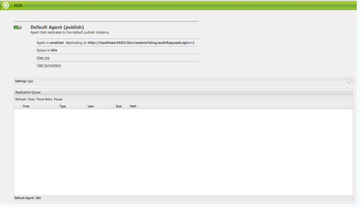
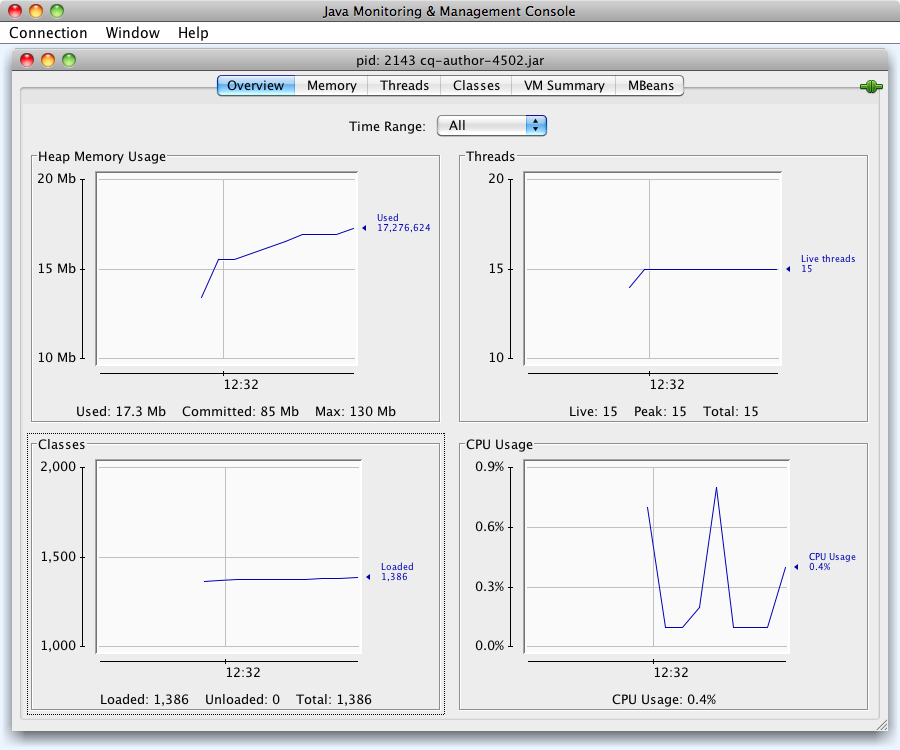

# Uw AEM-instantie bewaken en onderhouden{#monitoring-and-maintaining-your-aem-instance}

Nadat uw AEM-instanties zijn geïmplementeerd, zijn bepaalde taken nodig om de werking, prestaties en integriteit van deze instanties te controleren en te onderhouden.

Een belangrijke factor hierbij is dat u, om potentiële problemen te herkennen, moet weten hoe uw systemen er onder normale omstandigheden uitzien en zich gedragen. Dit kan het best worden gedaan door het systeem te controleren en informatie over een bepaalde periode te verzamelen.

| Vinkje | Overwegingen | Opmerkingen / Handelingen |
|---|---|---|
| Back-upplan. |  | Zie hoe u een [back-up van uw instantie](/help/sites-deploying/monitoring-and-maintaining.md#backups)kunt maken. |
| Rampenherstelplan. | De richtlijnen voor noodherstel van uw bedrijf. |  |
| Er is een systeem voor foutcontrole beschikbaar voor het melden van problemen. | Bijvoorbeeld [bugzilla](https://www.bugzilla.org/), [jira](https://www.atlassian.com/software/jira/)of een van vele andere. |  |
| Bestandssystemen worden gecontroleerd. | De CRX-opslagplaats zal &quot;bevriezen&quot; als er onvoldoende vrije schijfruimte is. Het wordt hervat zodra er ruimte beschikbaar is. | De &quot; `*ERROR* LowDiskSpaceBlocker`&quot;berichten kunnen in het logboekdossier worden gezien wanneer de vrije ruimte laag wordt. |
| [Logbestanden](/help/sites-deploying/monitoring-and-maintaining.md#working-with-audit-records-and-log-files) worden gecontroleerd. |  |  |
| Systeembewaking wordt (voortdurend) op de achtergrond uitgevoerd. | Inclusief CPU-, geheugen-, schijf- en netwerkgebruik. Gebruik bijvoorbeeld iostat / vmstat / perfmon. | De geregistreerde gegevens worden visualiseerd en kunnen voor het volgen van prestatiesproblemen worden gebruikt. Onbewerkte gegevens zijn ook toegankelijk. |
| [AEM-prestaties worden gecontroleerd](/help/sites-deploying/monitoring-and-maintaining.md#monitoring-performance). | Met inbegrip van de Tellers [van het](/help/sites-deploying/monitoring-and-maintaining.md#request-counters) Verzoek om verkeersniveaus te controleren. | Indien een aanzienlijk of langdurig prestatieverlies wordt vastgesteld, moet een grondig onderzoek worden ingesteld. |
| U controleert uw [replicatieagenten](/help/sites-deploying/monitoring-and-maintaining.md#monitoring-your-replication-agents). &quot; |  |  |
| Workflowinstanties regelmatig leegmaken. | Grootte opslagplaats en workflowprestaties. | Zie [Regular Purging of Workflow Instances](/help/sites-administering/workflows-administering.md#regular-purging-of-workflow-instances). |

## Back-ups {#backups}

Het is een goede gewoonte back-ups te maken van:

* Uw software-installatie - voor/na belangrijke wijzigingen in de configuratie
* De inhoud die binnen de gegevensbank wordt gehouden - regelmatig

Uw bedrijf zal waarschijnlijk een reservebeleid hebben dat u zult moeten volgen, extra overwegingen van wat aan steun en wanneer omvatten:

* hoe kritisch het systeem en de gegevens zijn.
* hoe vaak de software of gegevens worden gewijzigd.
* gegevensvolume; De capaciteit kan af en toe een probleem zijn, evenals de tijd nodig om de steun uit te voeren.
* of uw back-up kan worden gemaakt terwijl gebruikers online zijn; en zo mogelijk, wat is de invloed op de prestaties.
* de geografische spreiding van de gebruikers; d.w.z. wanneer is de beste tijd om een back-up te maken (om de impact tot een minimum te beperken)?
* uw beleid voor noodherstel; zijn er richtsnoeren over waar de back-upgegevens moeten worden opgeslagen (bijv. buiten de locatie, specifiek medium, enz.).

Vaak wordt een volledige back-up gemaakt met regelmatige tussenpozen (bijvoorbeeld dagelijks, wekelijks of maandelijks), met incrementele back-ups tussen (bijvoorbeeld uur, dag of week).

>[!CAUTION]
>
>Bij het implementeren van back-ups van uw productieinstanties *moeten* tests worden uitgevoerd om ervoor te zorgen dat de back-up kan worden hersteld.

>Zonder dit, is de steun potentieel nutteloos (worstcasescenario).
>
>[!NOTE]
Lees de sectie [Back-upprestaties](/help/sites-deploying/configuring-performance.md#backup-performance) voor meer informatie over back-upprestaties.

### Back-up maken van de software-installatie {#backing-up-your-software-installation}

Maak na de installatie of na belangrijke wijzigingen in de configuratie een back-up van de software-installatie.

Hiervoor moet u een [back-up maken van de gehele opslagplaats](#backing-up-your-repository) en vervolgens:

1. Stop AEM.
1. Maak een back-up van het gehele `<cq-installation-dir>` bestandssysteem.

>[!CAUTION]
Als u een toepassingsserver van een andere fabrikant gebruikt, kunnen extra mappen zich op een andere locatie bevinden en moeten er mogelijk ook back-ups van worden gemaakt. Zie [Hoe te om AEM met een Server](/help/sites-deploying/application-server-install.md) van de Toepassing te installeren voor informatie over het installeren van toepassingsservers. [](/content/docs/en/aem/6-3/deploy/installing.md#installing adobe Experience Manager with an application server)

>[!CAUTION]
Incrementele back-up van de bestandsgegevensopslag wordt ondersteund. wanneer u incrementele back-up voor andere componenten gebruikt (zoals de Lucene-index), moet u ervoor zorgen dat verwijderde bestanden ook zijn gemarkeerd als verwijderd in de back-up.

>[!NOTE]
Schijfspiegeling kan ook worden gebruikt als back-upmechanisme.

### Back-up maken van uw opslagplaats {#backing-up-your-repository}

Het gedeelte [Back-up en herstel](/help/sites-administering/backup-and-restore.md) van de CRX-documentatie behandelt alle problemen met betrekking tot back-ups van de CRX-opslagplaats.

Zie Een online back-up [maken voor meer informatie over het maken van een online &quot;hot&quot; back-up](/help/sites-administering/backup-and-restore.md#online-backup).

## Versie leegmaken {#version-purging}

Het **gereedschap Versies** wissen is bedoeld voor het verwijderen van de versies van een knooppunt of een hiërarchie van knooppunten in uw opslagplaats. Het belangrijkste doel is om u te helpen de grootte van uw opslagplaats te verminderen door oude versies van uw knopen te verwijderen.

Deze sectie behandelt onderhoudswerkzaamheden met betrekking tot de versieeigenschap van AEM. Het gereedschap **Versie** wissen is bedoeld voor het verwijderen van de versies van een knooppunt of een hiërarchie van knooppunten in uw opslagplaats. Het belangrijkste doel is om u te helpen de grootte van uw opslagplaats te verminderen door oude versies van uw knopen te verwijderen.

### Overzicht {#overview}

Het gereedschap **Versies** wissen is beschikbaar in de **[Tools](/help/sites-administering/tools-consoles.md)Console **onder**Versioning **of rechtstreeks op:

`https://<server>:<port>/etc/versioning/purge.html`


**Startpad** Een absoluut pad waarop moet worden gewist. U kunt het Startpad selecteren door op de boomnavigator in de repository te klikken.

**Recursief** bij het wissen van gegevens kunt u kiezen tussen het uitvoeren van de bewerking op één knooppunt of op een hele hiërarchie door Recursief te selecteren. In het laatste geval definieert het opgegeven pad het basisknooppunt van de hiërarchie.

**Maximale versies om het maximumaantal versies te houden** dat voor een knooppunt moet worden bewaard. Wanneer dit getal deze waarde overschrijdt, worden de oudste versies gewist.

**Maximale versieleeftijd** De maximale leeftijd van de versie van een knooppunt. Wanneer de leeftijd van een versie deze waarde overschrijdt, wordt het leeggemaakt.

**Droog uitvoeren** Omdat het verwijderen van versies van uw inhoud definitief is en niet kan worden teruggedraaid zonder een steun te herstellen, verstrekt het hulpmiddel van de Versies van de Wissen een droge loopwijze die u toestaat om de gezuiverde versies voor te vertonen. Klik op Droog uitvoeren om een droge run van het zuiveringsproces te starten.

**Wis** Start het leegmaken van de versies op het knooppunt dat wordt gedefinieerd door het beginpad.

### Versies van een website wissen {#purging-versions-of-a-web-site}

Ga als volgt te werk om versies van een website te wissen:

1. Navigeer naar de **[Tools](/help/sites-administering/tools-consoles.md)****Console**, selecteer **Versioning**en dubbelklik op **Purge Versies.**
1. Het beginpad instellen van de inhoud die moet worden gewist (bijvoorbeeld `/content/geometrixx-outdoors`).

   * Als u het knooppunt dat door het pad wordt gedefinieerd alleen wilt leegmaken, schakelt u **Recursief** uit.
   * Als u het knooppunt dat door het pad en de onderliggende knooppunten wordt gedefinieerd, wilt leegmaken, selecteert u **Recursief**.

1. Stel het maximumaantal versies (voor elk knooppunt) in dat u wilt behouden. Laat leeg om deze instelling niet te gebruiken.

1. Stel de maximale versiepagina in dagen in (voor elk knooppunt) die u wilt behouden. Laat leeg om deze instelling niet te gebruiken.

1. Klik op **Droog uitvoeren** om een voorvertoning weer te geven van wat het leegmaken zou doen.
1. Klik op **Leegmaken** om het proces te starten.

>[!CAUTION]
Opgeloste knooppunten kunnen niet worden hersteld zonder de opslagplaats te herstellen. Zorg voor uw configuratie, dus raden we u aan altijd een droge run uit te voeren voordat u gaat leegmaken.

### De console analyseren {#analyzing-the-console}

In de processen **Dry Run** en **Purge** worden alle knooppunten weergegeven die zijn verwerkt. Tijdens het proces, kan een knoop één van de volgende status hebben:

* `ignore (not versionnable)`: het knooppunt ondersteunt geen versiebeheer en wordt tijdens het proces genegeerd.

* `ignore (no version)`: het knooppunt heeft geen versie en wordt tijdens het proces genegeerd. &quot;

* `retained`: het knooppunt is niet gewist.
* `purged`: Het knooppunt wordt gewist.

Bovendien verstrekt de console nuttige informatie over de versies:

* `V 1.0`: het versienummer.
* `V 1.0.1`*: de ster geeft aan dat de versie de huidige versie is.

* `Thu Mar 15 2012 08:37:32 GMT+0100`: de datum van de versie.

In het volgende voorbeeld:

* De versies **Shirts** worden gewist omdat hun versieleeftijd langer is dan 2 dagen.
* De **Tonga Fashions!** versies worden gewist omdat het aantal versies groter is dan 5.


## Werken met auditrecords en logbestanden {#working-with-audit-records-and-log-files}

U kunt op verschillende locaties auditrecords en logbestanden met betrekking tot Adobe Experience Manager (AEM) vinden. Hieronder vindt u een overzicht van waar u kunt vinden.

### Werken met logbestanden {#working-with-logs}

AEM WCM registreert gedetailleerde logboeken. Nadat u QuickStart hebt uitpakken en gestart, kunt u logbestanden vinden:

* `<cq-installation-dir>/crx-quickstart/logs/`

* `<cq-installation-dir>/crx-quickstart/repository/`

#### Bestandsrotatie logbestand {#log-file-rotation}

De omwenteling van het dossier van het logboek verwijst naar het proces dat de groei van dossier door nieuw dossier periodiek te creëren beperkt. In AEM, `error.log` zal een geroepen logboekdossier één keer per dag volgens de bepaalde regels worden geroteerd:

* De naam van het `error.log` bestand wordt gewijzigd volgens het patroon {original_filename} `.yyyy-MM-dd`. Op 11 juli 2010 wordt bijvoorbeeld de naam van het huidige logbestand gewijzigd `error.log-2010-07-10`en wordt een nieuw logbestand `error.og` gemaakt.

* Eerdere logbestanden worden niet verwijderd. Het is dus uw verantwoordelijkheid om oude logbestanden regelmatig te wissen om het schijfgebruik te beperken.

>[!NOTE]
Als u uw AEM-installatie upgradet, ziet u dat bestaande logbestanden die niet meer door AEM worden gebruikt, op de schijf blijven staan. U kunt ze zonder risico verwijderen. Alle nieuwe logitems worden in de nieuwe logbestanden geschreven.

### De logbestanden zoeken {#finding-the-log-files}

Verschillende logbestanden worden opgeslagen op de bestandsserver waarop u AEM hebt geïnstalleerd:

* `<cq-installation-dir>/crx-quickstart/logs`

   * `access.log`
Alle toegangsverzoeken aan AEM WCM en de gegevensopslagplaats worden hier geregistreerd.

   * `audit.log`
Moderatiehandelingen worden hier geregistreerd.

   * `error.log`
Foutberichten (van verschillende ernst) worden hier geregistreerd.

   * [ `ImageServer-<PortId>-yyyy>-<mm>-<dd>.log`](https://marketing.adobe.com/resources/help/en_US/s7/is_ir_api/is_api/c_image_server_log.html)Dit logboek wordt slechts gebruikt als [!DNL Dynamic Media] wordt toegelaten. Het verstrekt statistieken en analytische informatie die voor het analyseren van gedrag van het interne proces ImageServer wordt gebruikt.

   * `request.log`
Elk toegangsverzoek wordt hier geregistreerd samen met de reactie.

   * [ `s7access-<yyyy>-<mm>-<dd>.log`](https://marketing.adobe.com/resources/help/en_US/s7/is_ir_api/is_api/c_Access_Log.html)Dit logboek wordt slechts gebruikt als [!DNL Dynamic Media] wordt toegelaten. Het s7access logboek registreert elk verzoek aan [!DNL Dynamic Media] door `/is/image` en `/is/content`.

   * `stderr.log`
Bevat foutberichten, opnieuw van verschillende niveaus van ernst, die tijdens het opstarten worden gegenereerd. Standaard is het logniveau ingesteld op `Warning` ( `WARN`)

   * `stdout.log`
Bevat logboekberichten die op gebeurtenissen tijdens opstarten wijzen.

   * `upgrade.log`
Verstrekt een logboek van alle verbeteringsverrichtingen die van de `com.day.compat.codeupgrade` en `com.adobe.cq.upgradesexecutor` pakketten lopen.

* `<*cq-installation-dir*>/crx-quickstart/repository`

   * `revision.log`
Informatie over Revisie-journalistiek.

>[!NOTE]
De logboeken van ImageServer en s7access zijn niet inbegrepen in **Download volledig **pakket dat van het **systeem/console/status-Bundlelist **pagina wordt geproduceerd. Als u [!DNL Dynamic Media] problemen ondervindt, voegt u voor ondersteuningsdoeleinden ook de registratie van ImageServer en s7access toe wanneer u contact opneemt met de Klantenondersteuning.

### Het FOUTOPSPORINGSlogniveau activeren {#activating-the-debug-log-level}

Het standaardlogniveau ([Apache Sling Logging Configuration](/help/sites-deploying/osgi-configuration-settings.md#apacheslingloggingconfiguration)) is Informatie, zodat worden de foutopsporingsberichten niet geregistreerd.

Om het debug logboekniveau voor een Logger te activeren, plaats het bezit `org.apache.sling.commons.log.level` aan zuivert in de bewaarplaats. Stel bijvoorbeeld dat u de `/libs/sling/config/org.apache.sling.commons.log.LogManager` algemene Apache Sling Logging [](/help/sites-deploying/osgi-configuration-settings.md#apacheslingloggingconfiguration)moet configureren.

>[!CAUTION]
Verlaat het logboek bij zuivert logboekniveau niet langer dan noodzakelijk, aangezien het veel logboekingangen produceert, waarbij middelen worden verbruikt.

Een lijn in zuivert dossier begint gewoonlijk met DEBUG, dan verstrekt het logboekniveau, de installeractie en het logboekbericht. Bijvoorbeeld:

```shell
DEBUG 3 WebApp Panel: WebApp successfully deployed
```

De logniveaus zijn als volgt:

| 0 | Fatale fout | De handeling is mislukt en het installatieprogramma kan niet doorgaan. |
|---|---|---|
| 1 | Fout | De handeling is mislukt. De installatie gaat door, maar een deel van AEM WCM was niet correct geïnstalleerd en zal niet werken. |
| 2 | Waarschuwing | De actie is geslaagd maar heeft problemen ondervonden. AEM WCM werkt mogelijk niet correct. |
| 3 | Informatie | De actie is geslaagd. |

### Een aangepast logbestand maken {#create-a-custom-log-file}

>[!NOTE]
Wanneer u met Adobe Experience Manager werkt, zijn er verschillende methoden om de configuratie-instellingen voor dergelijke services te beheren. zie het [Vormen OSGi](/help/sites-deploying/configuring-osgi.md) voor meer details en de geadviseerde praktijken.

In bepaalde omstandigheden wilt u mogelijk een aangepast logbestand met een ander logniveau maken. U kunt dit in de repository doen door:

1. Als het nog niet bestaat, creeer een nieuwe configuratiemap ( `sling:Folder`) voor uw project `/apps/<*project-name*>/config`.
1. Onder `/apps/<*project-name*>/config`, creeer een knoop voor de nieuwe [Logger van de Logboekregistratie van Apache Sling](/help/sites-deploying/osgi-configuration-settings.md#apacheslingloggingloggerconfigurationfactoryconfiguration):

   * Naam: `org.apache.sling.commons.log.LogManager.factory.config-<*identifier*>` (aangezien dit een Logger is)

      Waar `<*identifier*>` wordt vervangen door vrije tekst die u (moet) invoeren om het exemplaar te identificeren (u kunt deze informatie niet weglaten).

      Bijvoorbeeld: `org.apache.sling.commons.log.LogManager.factory.config-MINE`

   * Type: `sling:OsgiConfig`
   >[!NOTE]
   Hoewel het geen technische eis is, is het raadzaam `<*identifier*>` uniek te maken.

1. Stel de volgende eigenschappen in voor dit knooppunt:

   * Naam: `org.apache.sling.commons.log.file`

      Type: String

      Waarde: het logbestand specificeren; bijvoorbeeld: `logs/myLogFile.log`

   * Naam: `org.apache.sling.commons.log.names`

      Type: String[] (String + Multi)

      Waarde: specificeert de diensten OSGi waarvoor de Logger berichten moet registreren; bijvoorbeeld:

      * `org.apache.sling`
      * `org.apache.felix`
      * `com.day`
   * Naam: `org.apache.sling.commons.log.level`

      Type: String

      Waarde: het vereiste logniveau specificeren ( `debug`, `info`, `warn` of `error`); bijvoorbeeld `debug`

   * Configureer de overige parameters naar wens:

      * Naam: `org.apache.sling.commons.log.pattern`

         Type: `String`

         Waarde: het patroon van het logbericht specificeren, indien nodig; bijvoorbeeld:

         `{0,date,dd.MM.yyyy HH:mm:ss.SSS} *{4}* [{2}] {3} {5}`
   >[!NOTE]
   `org.apache.sling.commons.log.pattern` ondersteunt maximaal zes argumenten.

   >{0} The timestamp of type `java.util.Date`{1} the log marker{2} the name of the current thread{3} the name of the logger{4} the log level{5} the log message

   >Als de logboekvraag een `Throwable` stapelspoor omvat wordt toegevoegd aan het bericht.

   >[!CAUTION]
   org.apache.sling.commons.log.names moet een waarde hebben.

   >[!NOTE]
   Logschrijfpaden zijn relatief ten opzichte van de `crx-quickstart` locatie.
   Daarom wordt een logbestand opgegeven als:
   `logs/thelog.log`

   >schrijft naar:
   `` ` ` `<*cq-installation-dir*>/``crx-quickstart/logs/thelog.log&quot;.
   En een logbestand dat is opgegeven als:
   `../logs/thelog.log`

   >schrijft naar een map:
   ` <*cq-installation-dir*>/logs/`
&quot;(d.w.z. naast ` `&lt;*cq-installation-dir*>/`crx-quickstart/`)

1. Deze stap is alleen nodig wanneer een nieuwe schrijver is vereist (dat wil zeggen met een andere configuratie dan de standaardschrijver).

   >[!CAUTION]
   Een nieuwe configuratie van de schrijver van het Registreren wordt slechts vereist wanneer het bestaande gebrek niet geschikt is.

   >Als geen expliciete Schrijver wordt gevormd zal het systeem automatisch een impliciete Schrijver produceren die op het gebrek wordt gebaseerd.

   Onder `/apps/<*project-name*>/config`, creeer een knoop voor de nieuwe [Configuratie](/help/sites-deploying/osgi-configuration-settings.md#apacheslingloggingwriterconfigurationfactoryconfiguration)van de Schrijver van het Registreren van de Sling van Apache:

   * Naam: `org.apache.sling.commons.log.LogManager.factory.writer-<*identifier*>` (aangezien dit een schrijver is)

      Net als bij Logger, `<*identifier*>` wordt vervangen door vrije tekst die u (moet) ingaan om de instantie te identificeren (u kunt deze informatie niet weglaten). Bijvoorbeeld: `org.apache.sling.commons.log.LogManager.factory.writer-MINE`

   * Type: `sling:OsgiConfig`
   >[!NOTE]
   Hoewel het geen technische eis is, is het raadzaam `<*identifier*>` uniek te maken.

   Stel de volgende eigenschappen in voor dit knooppunt:

   * Naam: `org.apache.sling.commons.log.file`

      Type: `String`

      Waarde: geeft het logbestand op, zodat het overeenkomt met het bestand dat is opgegeven in het logbestand;

      voor dit voorbeeld, `../logs/myLogFile.log`.

   * Configureer de overige parameters naar wens:

      * Naam: `org.apache.sling.commons.log.file.number`

         Type: `Long`

         Waarde: het aantal logbestanden opgeven dat u wilt behouden; bijvoorbeeld: `5`

      * Naam: `org.apache.sling.commons.log.file.size`

         Type: `String`

         Waarde: specificeren zoals vereist om de omwenteling van het dossier door grootte/datum te controleren; bijvoorbeeld: `'.'yyyy-MM-dd`
   >[!NOTE]
   `org.apache.sling.commons.log.file.size` Hiermee bepaalt u de rotatie van het logbestand door een van de volgende instellingen in te stellen:
   * een maximale bestandsgrootte
   * een datum-/tijdschema
   om aan te geven wanneer een nieuw bestand wordt gemaakt (en de naam van het bestaande bestand wordt gewijzigd volgens het naampatroon).
   * Een formaatlimiet kan met een getal worden opgegeven. Als er geen grootteindicator is opgegeven, wordt deze gebruikt als het aantal bytes. U kunt ook een van de grootteindicatoren toevoegen - `KB`, `MB`of `GB` (hoofdlettergebruik wordt genegeerd).
   * U kunt een tijd-/datumschema opgeven als een `java.util.SimpleDateFormat` patroon. Hiermee wordt de periode gedefinieerd waarna het bestand wordt geroteerd. ook het achtervoegsel dat aan het geroteerde dossier (voor identificatie) wordt toegevoegd.
   De standaardwaarde is &#39;.&#39;jjjj-MM-dd (voor dagelijkse logrotatie).
   Bijvoorbeeld, om middernacht van 20 Januari 2010 (of wanneer het eerste logboekbericht na dit voorkomt om precies te zijn), zal ../logs/error.log worden anders genoemd aan ../logs/error.log.2010-01-20. Logboekregistratie voor 21 januari wordt uitgevoerd naar (een nieuw en leeg) ../logs/error.log totdat de logbestanden bij de volgende wijziging van de dag worden doorgehaald.
   | `'.'yyyy-MM` | Rotatie aan het begin van elke maand |
   |---|---|
   | `'.'yyyy-ww` | Rotatie op de eerste dag van elke week (afhankelijk van de landinstelling). |
   | `'.'yyyy-MM-dd` | Rotatie elke dag om middernacht. |
   | `'.'yyyy-MM-dd-a` | Roteren om middernacht en middag van elke dag. |
   | `'.'yyyy-MM-dd-HH` | Rotatie boven aan elk uur. |
   | `'.'yyyy-MM-dd-HH-mm` | Rotatie aan het begin van elke minuut. |
   Opmerking: Wanneer u een tijd/datum opgeeft:
   1. U moet letterlijke tekst met enkele aanhalingstekens (&#39; &#39;) &quot;escape&quot;-tekens gebruiken;
dit om te voorkomen dat bepaalde tekens worden geïnterpreteerd als patroonletters.
   1. Gebruik alleen tekens die zijn toegestaan voor een geldige bestandsnaam op een willekeurige plaats in de optie.


1. Lees het nieuwe logbestand met het gekozen gereedschap.

   Het logbestand dat in dit voorbeeld wordt gemaakt, wordt `../crx-quickstart/logs/myLogFile.log`weergegeven.

De Felix-console biedt ook informatie over de ondersteuning voor het verkooplogboek op `../system/console/slinglog`; bijvoorbeeld `https://localhost:4502/system/console/slinglog`.

### Controleregisters zoeken {#finding-the-audit-records}

Er worden auditrecords bijgehouden om een overzicht te geven van wie wat heeft gedaan en wanneer. Er worden verschillende auditverslagen gegenereerd voor zowel AEM WCM- als OSGi-gebeurtenissen.

#### AEM WCM-auditrecords die worden weergegeven bij het ontwerpen van pagina&#39;s {#aem-wcm-audit-records-shown-when-page-authoring}

1. Open een pagina.
1. Vanuit het hulpprogramma kunt u het tabblad selecteren met het vergrendelingspictogram en vervolgens dubbelklikken op **Controlelogboek..**
1. Er wordt een nieuw venster geopend met de lijst met auditrecords voor de huidige pagina.

   

1. Klik op **OK** als u het venster wilt sluiten.

#### AEM WCM-controlegegevens in de opslagplaats {#aem-wcm-auditing-records-within-the-repository}

Binnen de `/var/audit` omslag, worden de controleverslagen gehouden volgens het middel. U kunt naar beneden boren tot u de individuele verslagen en de informatie kunt zien zij bevatten.

Deze vermeldingen bevatten dezelfde gegevens als bij het bewerken van een pagina.

#### OSGi-auditrecords van de webconsole {#osgi-audit-records-from-the-web-console}

OSGi-gebeurtenissen genereren ook auditrecords die u kunt zien op het tabblad **Configuratiestatus** -> **Logbestanden **tabblad in de AEM-webconsole:


## Uw replicatieagents controleren {#monitoring-your-replication-agents}

U kunt uw [replicatierijen](/help/sites-deploying/replication.md) controleren om te ontdekken wanneer een rij of neer of geblokkeerd is - die op zijn beurt op een probleem met een het publiceren instantie of extern systeem zou kunnen wijzen:

* zijn alle vereiste rijen ingeschakeld?
* zijn om het even welke gehandicapte rijen nog vereist?
* alle `enabled` rijen moeten de status `idle` of `active`, die op normale verrichting wijzen; er zouden geen rijen moeten zijn `blocked`, wat vaak een teken is van problemen aan de ontvangerszijde.

* als de grootte van de rij in tijd groeit, kan dit op een geblokkeerde rij wijzen.

Om een replicatieagent te controleren:

1. Open het tabblad **Gereedschappen** in AEM.
1. Klik op **Replicatie**.
1. Dubbelklik op de koppeling naar agents voor de juiste omgeving (links of rechts); bijvoorbeeld **Agenten op auteur**.

   Het resulterende venster toont een overzicht van al uw replicatieagenten voor het auteursmilieu, met inbegrip van hun doel en status.

1. Klik de aangewezen agentennaam (die een verbinding is) om gedetailleerde informatie over die agent te tonen:

   

   Hier kunt u:

   * Zie of de agent wordt toegelaten.
   * Zie het doel van eventuele replicaties.
   * Zie of de replicatierij momenteel actief (toegelaten) is.
   * Zie of er items in de wachtrij staan.
   * **Vernieuwen** of **Wissen** om de weergave van wachtrijitems bij te werken; dit helpt u punten te zien ingaan en de rij verlaten.

   * **Logboek** van de mening om tot het logboek van om het even welke acties door de replicatieagent toegang te hebben.
   * **Verbinding** met de doelinstantie testen.
   * **Indien nodig opnieuw proberen** afdwingen voor alle wachtrij-items.
   >[!CAUTION]
   Gebruik de koppeling &quot;Verbinding testen&quot; niet voor het selectievakje Reverse Replication Outbox op een publicatie-instantie.
   Als een replicatietest voor een Postbus rij wordt uitgevoerd, om het even welke punten die ouder zijn dan de testreplicatie zullen met elke omgekeerde replicatie opnieuw worden verwerkt.
   Als dergelijke items al in een wachtrij staan, kunt u ze vinden met de volgende JCR-query voor XPath en moet u ze verwijderen.
   `/jcr:root/var/replication/outbox//*[@cq:repActionType='TEST']`

Opnieuw kunt u een oplossing ontwikkelen om alle replicatieagenten (onder `/etc/replication/author` of `/etc/replication/publish`) te ontdekken, dan het statuut van de agent (, `enabled`) en de onderliggende rij ( `disabled`, `active`, `idle``blocked`) te controleren.

## Monitorprestaties {#monitoring-performance}

[Prestatieoptimalisatie](/help/sites-deploying/configuring-performance.md) is een interactief proces dat tijdens de ontwikkeling de focus krijgt. Na plaatsing wordt het gewoonlijk herzien na specifieke intervallen of gebeurtenissen.

Methoden die worden gebruikt bij het verzamelen van informatie voor optimalisatie kunnen ook worden gebruikt voor doorlopende bewaking.

>[!NOTE]
Ook kunnen specifieke [configuraties die beschikbaar zijn om de prestaties](/help/sites-deploying/configuring-performance.md#configuring-for-performance) te verbeteren, worden gecontroleerd.

Hieronder worden gemeenschappelijke prestatieproblemen opgesomd die zich voordoen, samen met voorstellen voor het opsporen en bestrijden van deze problemen.

| Gebied | Symptom(s) | Capaciteit verhogen... | Volume verkleinen... |
|---|---|---|---|
| Client | Hoog CPU-gebruik van de client. | Installeer een client-CPU met hogere prestaties. | Vereenvoudig de lay-out (HTML). |
|  | Laag CPU-gebruik van de server. | Voer een upgrade uit naar een snellere browser. | Cache op de client verbeteren. |
|  | Sommige clients zijn snel, sommige traag. |  |  |
| Server |  |  |  |
| Netwerk | Het CPU-gebruik is laag op zowel servers als clients. | Verwijder netwerkknelpunten. | Verbeter/optimaliseer de configuratie van het cliëntgeheime voorgeheugen. |
|  | Lokaal bladeren op de server is (relatief) snel. | Verhoog de netwerkbandbreedte. | Verminder de &#39;dikte&#39; van uw webpagina&#39;s (bijvoorbeeld minder afbeeldingen, geoptimaliseerde HTML). |
| Webserver | Het CPU-gebruik op de webserver is hoog. | Cluster uw webservers. | Verminder de hits per pagina (bezoek). |
|  |  | Gebruik een taakverdelingsmechanisme voor hardware. |  |
| Toepassing | Het CPU-gebruik van de server is hoog. | Cluster uw AEM-instanties. | Zoeken naar CPU- en geheugenhogs en deze elimineren (gebruik coderevisie, timinguitvoer, enz.). |
|  | Hoge geheugenconsumptie. |  | Verbeter caching op alle niveaus. |
|  | Lage responstijd. |  | Sjablonen en componenten optimaliseren (bijvoorbeeld structuur, logica). |
| Bewaarplaats |  |  |  |
| Cache |  |  |  |

Prestatieproblemen kunnen het gevolg zijn van een aantal oorzaken die niets te maken hebben met uw website, zoals tijdelijke vertragingen in de verbindingssnelheid, CPU-belasting en nog veel meer.

Het kan ook gevolgen hebben voor al uw bezoekers of alleen voor een deel ervan.

Al deze informatie moet worden verkregen, gesorteerd en geanalyseerd voordat u de algemene prestaties kunt optimaliseren of specifieke problemen kunt oplossen.

* Voordat u een prestatieprobleem ervaart:

   * zoveel mogelijk informatie verzamelen om onder normale omstandigheden een goede werkkennis van het systeem op te bouwen

* Wanneer u een prestatieprobleem ondervindt:

   * proberen deze te repliceren met een (of bij voorkeur meer) standaardwebbrowser, op een andere client waarvan u weet dat deze goede algemene prestaties levert en/of op de server zelf (indien mogelijk)
   * controleren of er iets (met betrekking tot het systeem) binnen een passende tijdspanne is gewijzigd en of een van deze wijzigingen van invloed kan zijn geweest op de prestaties
   * vragen stellen zoals:

      * komt dit probleem alleen op specifieke tijdstippen voor ?
      * komt de kwestie slechts op specifieke pagina&#39;s voor?
      * worden andere verzoeken ingewilligd ?
   * zoveel mogelijk informatie verzamelen om onder normale omstandigheden met uw kennis van het systeem te kunnen vergelijken:


### Gereedschappen voor het bewaken en analyseren van prestaties {#tools-for-monitoring-and-analyzing-performance}

Hieronder vindt u een kort overzicht van enkele gereedschappen die beschikbaar zijn voor het bewaken en analyseren van de prestaties.

Sommige hiervan zijn afhankelijk van uw besturingssysteem.

<table>
 <tbody>
  <tr>
   <td>Gereedschap</td>
   <td>Wordt gebruikt om te analyseren...</td>
   <td>Gebruik / Meer informatie...</td>
  </tr>
  <tr>
   <td>request.log</td>
   <td>Responstijden en gelijktijdige toediening.</td>
   <td><a href="#interpreting-the-request-log">Het interpreteren van request.log</a>.</td>
  </tr>
  <tr>
   <td>sporen</td>
   <td>Pagina wordt geladen</td>
   <td><p>Unix/Linux bevelen om systeemvraag en signalen te volgen. Verhoog het logniveau tot <code>INFO</code>.</p> <p>Analyseer het aantal pagina's dat per aanvraag wordt geladen, welke pagina's enzovoort.</p> </td>
  </tr>
  <tr>
   <td>Draad-dumpen</td>
   <td>Bekijk JVM-threads. Identificeer contouren, sluizen en lange looptijden.</td>
   <td><p>Afhankelijk van het besturingssysteem:<br /> - Unix/Linux: <code>kill -QUIT &lt;<em>pid</em>&gt;</code><br /> - Windows (consolemodus): Ctrl-einde<br /> </p> <p>Er zijn ook analysehulpmiddelen beschikbaar, zoals <a href="https://java.net/projects/tda/">TDA</a>.<br /> </p> </td>
  </tr>
  <tr>
   <td>Heap Dumps</td>
   <td>Onvoldoende geheugen, wat langzame prestaties tot gevolg heeft.</td>
   <td><p>Voeg het volgende toe:<br /> <code>-XX:+HeapDumpOnOutOfMemoryError</code><br /> optie voor de Java-oproep aan AEM.</p> <p>Raadpleeg de <a href="https://java.sun.com/javase/6/webnotes/trouble/TSG-VM/html/clopts.html#gbzrr">handleiding voor probleemoplossing voor Java SE 6 met HotSpot VM</a>.</p> </td>
  </tr>
  <tr>
   <td>Systeemaanroepen</td>
   <td>Problemen met timing vaststellen.</td>
   <td><p>De vraag aan <code>System.currentTimeMillis()</code> of <code>com.day.util</code>.Timing wordt gebruikt om timestamps van uw code, of via <a href="#html-comments">HTML-commentaren</a>te produceren.</p> <p><strong>Opmerking:</strong> Deze moeten zo worden geïmplementeerd dat ze indien nodig kunnen worden geactiveerd/gedeactiveerd; wanneer een systeem soepel functioneert , zal de overhead van het verzamelen van statistieken niet nodig zijn .</p> </td>
  </tr>
  <tr>
   <td>Apache Bench</td>
   <td>Identificeer geheugenlekken, selectief analyseer reactietijd.</td>
   <td><p>basisgebruik is:</p> <p><code>ab -k -n &lt;<em>requests</em>&gt; -c &lt;<em>concurrency</em>&gt; &lt;<em>url</em>&gt;</code></p> <p>Zie <a href="#apache-bench">Apache Bench</a> en de pagina <a href="https://httpd.apache.org/docs/2.2/programs/ab.html"></a> Ab man voor meer informatie.</p> </td>
  </tr>
  <tr>
   <td>Zoekanalyse</td>
   <td> </td>
   <td>Zoekopdrachten offline uitvoeren, reactietijd van query identificeren, testen en resultaatset bevestigen.<br /> </td>
  </tr>
  <tr>
   <td>JMeter</td>
   <td>Belastings- en functionele tests.</td>
   <td><a href="https://jakarta.apache.org/jmeter/">https://jakarta.apache.org/jmeter/</a></td>
  </tr>
  <tr>
   <td>JProfiler</td>
   <td>Uitgebreide CPU- en geheugenprofilering.</td>
   <td><a href="https://www.ej-technologies.com/">https://www.ej-technologies.com/</a></td>
  </tr>
  <tr>
   <td>JConsole</td>
   <td>Bekijk JVM-metriek en -threads.</td>
   <td><p>Gebruik: jconsole</p> <p>Zie <a href="https://java.sun.com/developer/technicalArticles/J2SE/jconsole.html">jconsole</a> en <a href="#monitoring-performance-using-jconsole">Monitoring Prestaties met behulp van JConsole</a>.</p> <p><strong>Opmerking:</strong> Met JDK 1.6 is JConsole uitbreidbaar met plug-ins. bijvoorbeeld Top of TDA (Thread Dump Analyzer).</p> </td>
  </tr>
  <tr>
   <td>Java VisualVM</td>
   <td>Bekijk JVM-metriek, threads, geheugen en profilering.</td>
   <td><p>Gebruik: jvisualvm of visualvm<br /> </p> <p>Zie <a href="https://java.sun.com/javase/6/docs/technotes/tools/share/jvisualvm.html">jvisualvm</a>, <a href="https://visualvm.dev.java.net/">visualvm</a> en de Prestaties van de <a href="#monitoring-performance-using-j-visualvm">Controle gebruikend (J)VisualVM</a>.</p> <p><strong>Opmerking:</strong> Met JDK 1.6, is VisualVM verlengbaar met stop-ins.</p> </td>
  </tr>
  <tr>
   <td>worstjes/resten, laatste</td>
   <td>De diepte vraag van de kernel en procesanalyse (Unix).</td>
   <td>Unix/Linux-opdrachten.</td>
  </tr>
  <tr>
   <td>Timingstatistieken</td>
   <td>Zie timingstatistieken voor paginerendering.</td>
   <td><p>Als u timingstatistieken voor het weergeven van pagina's wilt zien, kunt u <strong>Ctrl-Shift-U</strong> <code>?debugClientLibs=true</code> gebruiken in combinatie met de tijdinstellingen in de URL.</p> </td>
  </tr>
  <tr>
   <td>Hulpprogramma voor CPU- en geheugenanalyse<br /> </td>
   <td><a href="#interpreting-the-request-log">Wordt gebruikt bij het analyseren van langzame aanvragen tijdens de ontwikkeling</a>.</td>
   <td>Bijvoorbeeld <a href="https://www.yourkit.com/">YourKit</a>.</td>
  </tr>
  <tr>
   <td><a href="#information-collection">Informatie verzamelen</a></td>
   <td>De huidige staat van uw installatie.</td>
   <td>Als u zoveel mogelijk weet over de installatie, kunt u ook bijhouden wat een wijziging in de prestaties heeft veroorzaakt en of deze wijzigingen gerechtvaardigd zijn. Deze gegevens moeten regelmatig worden verzameld, zodat u gemakkelijk significante veranderingen kunt zien.</td>
  </tr>
 </tbody>
</table>

### Het interpreteren van request.log {#interpreting-the-request-log}

In dit bestand wordt basisinformatie geregistreerd over elk verzoek aan AEM. Uit deze waardevolle conclusies kunnen we lering trekken.

Het `request.log` biedt een ingebouwde manier om te zien hoe lang verzoeken duren. Voor ontwikkelingsdoeleinden is het nuttig om `tail -f` de `request.log` en wacht op langzame reactietijden. Als u een groter gebied wilt analyseren, raden `request.log` we u aan [dat `rlog.jar` te gebruiken, zodat u kunt sorteren en filteren op responstijden](#using-rlog-jar-to-find-requests-with-long-duration-times).

We raden u aan om de &#39;trage&#39; pagina&#39;s van de pagina te isoleren `request.log`en ze vervolgens individueel af te stemmen voor betere prestaties. Dit wordt gewoonlijk gedaan door prestatiesmetriek per component of het gebruiken van een prestaties het profileren hulpmiddel zoals ` [yourkit](https://www.yourkit.com/)`te omvatten.

#### Bewaking van verkeer op uw website {#monitoring-traffic-on-your-website}

Het aanvraaglogboek registreert elke ingediende aanvraag, samen met het gegeven antwoord:

```xml
09:43:41 [66] -> GET /author/y.html HTTP/1.1
09:43:41 [66] <- 200 text/html 797ms
```

Door alle GET ingangen binnen een specifieke periodes (b.v. over diverse periodes van 24 uur) in totaal op te nemen kunt u verklaringen over het gemiddelde verkeer op uw website doen.

#### De reactietijden van de controle met request.log {#monitoring-response-times-with-the-request-log}

Een goed uitgangspunt voor prestatiesanalyse is het verzoeklogboek:

`<*cq-installation-dir*>/crx-quickstart/logs/request.log`

Het logbestand ziet er als volgt uit (de regels worden ingekort om het eenvoudig te houden):

```xml
31/Mar/2009:11:32:57 +0200 [379] -> GET /path/x HTTP/1.1
31/Mar/2009:11:32:57 +0200 [379] <- 200 text/html 33ms
31/Mar/2009:11:33:17 +0200 [380] -> GET /path/y HTTP/1.1
31/Mar/2009:11:33:17 +0200 [380] <- 200 application/json 39ms
```

Dit logboek heeft één lijn per verzoek of reactie:

* De datum waarop elk verzoek of antwoord is ingediend.
* The number of the request, in square brackets. Dit aantal komt voor het verzoek en de reactie overeen.
* Een pijl die aangeeft of dit een aanvraag (pijl die naar rechts wijst) of een reactie (pijl naar links) is.
* Voor verzoeken bevat de regel:

   * de methode (doorgaans GET, HEAD of POST)
   * de gevraagde pagina
   * het protocol

* Voor reacties bevat de regel:

   * de statuscode (200 betekent &quot;succes&quot;, 404 betekent &quot;pagina niet gevonden&quot;
   * het MIME-type
   * de responstijd

Met behulp van kleine scripts kunt u de vereiste informatie uit het logbestand extraheren en de gewenste statistieken samenstellen. Hieruit kunt u zien welke pagina&#39;s of typen pagina&#39;s langzaam zijn en of de prestaties over het geheel genomen bevredigend zijn.

#### De onderzoekreactie tijden van het toezicht met request.log {#monitoring-search-response-times-with-the-request-log}

Zoekverzoeken worden ook in het logbestand geregistreerd:

```xml
31/Mar/2009:11:35:34 +0200 [338] -> GET /author/playground/en/tools/search.html?query=dilbert&size=5&dispenc=utf-8 HTTP/1.1
31/Mar/2009:11:35:34 +0200 [338] <- 200 text/html 1562ms
```

Dus, zoals hierboven, kunt u manuscripten gebruiken om de relevante informatie te halen en statistieken op te bouwen.

Als u echter eenmaal de responstijd hebt bepaald, moet u misschien analyseren waarom het verzoek de tijd neemt die het nodig heeft en wat er kan worden gedaan om de reactie te verbeteren.

#### Het aantal en de gevolgen van gelijktijdige gebruikers controleren {#monitoring-the-number-and-impact-of-concurrent-users}

Ook hier `request.log` kan het worden gebruikt om de samenhang en de reactie van het systeem daarop te controleren.

Er moeten tests worden uitgevoerd om te bepalen hoeveel gelijktijdige gebruikers het systeem kan verwerken voordat een negatieve invloed wordt waargenomen. Opnieuw kunnen de manuscripten worden gebruikt om resultaten uit het logboekdossier te halen:

* na te gaan hoeveel verzoeken binnen een bepaalde tijdspanne, bijvoorbeeld één minuut, worden ingediend
* de effecten te testen van een specifiek aantal gebruikers die allemaal op hetzelfde tijdstip (zo dicht mogelijk) dezelfde verzoeken indienen; Bijvoorbeeld 30 gebruikers die tegelijkertijd op **Opslaan** klikken.

```xml
31/Mar/2009:11:45:29 +0200 [333] -> GET /author/libs/Personalize/content/statics.close.gif HTTP/1.1
31/Mar/2009:11:45:29 +0200 [334] -> GET /author/libs/Personalize/content/statics.detach.gif HTTP/1.1
31/Mar/2009:11:45:30 +0200 [335] -> GET /author/libs/CFC/content/imgs/logo.rZMNURccynWcTpCxyuBNiTCoiBMmw000.default.gif HTTP/1.1
31/Mar/2009:11:45:32 +0200 [335] <- 304 text/html 0ms
31/Mar/2009:11:45:33 +0200 [334] <- 200 image/gif 31ms
31/Mar/2009:11:45:38 +0200 [333] <- 200 image/gif 31ms
31/Mar/2009:11:45:42 +0200 [336] -> GET /author/libs/CFC/content/imgs/logo.rZMNURccynWcTZRXunQbbQtvuuCMbRRBuWXz0000.default.gif HTTP/1.1
31/Mar/2009:11:45:43 +0200 [337] -> GET /author/titlebar_bg.gif HTTP/1.1
31/Mar/2009:11:45:43 +0200 [336] <- 304 text/html 0ms
31/Mar/2009:11:45:44 +0200 [337] <- 304 text/html 0ms
```

### Het gebruiken van rlog.jar om verzoeken met lange duurtijden te vinden {#using-rlog-jar-to-find-requests-with-long-duration-times}

AEM bevat diverse hulplijnen in:
`<*cq-installation-dir*>/crx-quickstart/opt/helpers`

Een van deze `rlog.jar`, kan worden gebruikt om snel te sorteren `request.log` zodat aanvragen op duur, van langste tot kortste tijd worden weergegeven.

De volgende opdracht toont de mogelijke argumenten:

```shell
$java -jar rlog.jar
Request Log Analyzer Version 21584 Copyright 2005 Day Management AG
Usage:
  java -jar rlog.jar [options] <filename>
Options:
  -h               Prints this usage.
  -n <maxResults>  Limits output to <maxResults> lines.
  -m <maxRequests> Limits input to <maxRequest> requests.
  -xdev            Exclude POST request to CRXDE.
```

U kunt het bestand bijvoorbeeld uitvoeren door het als parameter op te geven en de 10 eerste aanvragen met de langste duur weer te geven: `request.log`

```shell
$ java -jar ../opt/helpers/rlog.jar -n 10 request.log
*Info * Parsed 464 requests.
*Info * Time for parsing: 22ms
*Info * Time for sorting: 2ms
*Info * Total Memory: 1mb
*Info * Free Memory: 1mb
*Info * Used Memory: 0mb
------------------------------------------------------
     18051ms 31/Mar/2009:11:15:34 +0200 200 GET /content/geometrixx/en/company.html text/ html
      2198ms 31/Mar/2009:11:15:20 +0200 200 GET /libs/cq/widgets.js application/x-javascript
      1981ms 31/Mar/2009:11:15:11 +0200 200 GET /libs/wcm/content/welcome.html text/html
      1973ms 31/Mar/2009:11:15:52 +0200 200 GET /content/campaigns/geometrixx.teasers..html text/html
      1883ms 31/Mar/2009:11:15:20 +0200 200 GET /libs/security/cq-security.js application/x-javascript
      1876ms 31/Mar/2009:11:15:20 +0200 200 GET /libs/tagging/widgets.js application/x-javascript
      1869ms 31/Mar/2009:11:15:20 +0200 200 GET /libs/tagging/widgets/themes/default.js application/x-javascript
      1729ms 30/Mar/2009:16:45:56 +0200 200 GET /libs/wcm/content/welcome.html text/html; charset=utf-8
      1510ms 31/Mar/2009:11:15:34 +0200 200 GET /bin/wcm/contentfinder/asset/view.json/ content/dam?_dc=1238490934657&query=&mimeType=image&_charset_=utf-8 application/json
      1462ms 30/Mar/2009:17:23:08 +0200 200 GET /libs/wcm/content/welcome.html text/html; charset=utf-8
```

Mogelijk moet u de afzonderlijke `request.log` bestanden samenvoegen als u deze bewerking wilt uitvoeren in een groot gegevensvoorbeeld.

### Apache Bench {#apache-bench}

Om het effect van speciale gevallen (zoals huisvuilinzameling, enz.) te minimaliseren, wordt het geadviseerd om een hulpmiddel zoals `apachebench` (zie bijvoorbeeld, [ab](https://httpd.apache.org/docs/2.2/programs/ab.html) voor verdere documentatie) te gebruiken helpen geheugenlekken identificeren en selectief reactietijd analyseren.

Apache Bench kan als volgt worden gebruikt:

```shell
$ ab -c 5 -k -n 1000 "https://localhost:4503/content/geometrixx/en/company.html"
This is ApacheBench, Version 2.3 <$Revision: 655654 $>
Copyright 1996 Adam Twiss, Zeus Technology Ltd, https://www.zeustech.net/
Licensed to The Apache Software Foundation, https://www.apache.org/

Benchmarking localhost (be patient)
Completed 100 requests
Completed 200 requests
Completed 300 requests
Completed 400 requests
Completed 500 requests
Completed 600 requests
Completed 700 requests
Completed 800 requests
Completed 900 requests
Completed 1000 requests
Finished 1000 requests

Server Software: Day-Servlet-Engine/4.1.52
Server Hostname: localhost
Server Port: 4503

Document Path: /content/geometrixx/en/company.html
Document Length: 24127 bytes

Concurrency Level: 5
Time taken for tests: 69.766 seconds
Complete requests: 1000
Failed requests: 998
(Connect: 0, Receive: 0, Length: 998, Exceptions: 0)
Write errors: 0
Keep-Alive requests: 0
Total transferred: 24160923 bytes
HTML transferred: 24010923 bytes
Requests per second: 14.33 /sec (mean)
Time per request: 348.828 [ms] (mean)
Time per request: 69.766 [ms] (mean, across all concurrent requests)
Transfer rate: 338.20 [Kbytes/sec] received

Connection Times (ms)
min mean[+/-sd] median max
Connect: 0 1 3.9 0 58
Processing: 138 347 568.5 282 8106
Waiting: 137 344 568.1 281 8106
Total: 139 348 568.4 283 8106

Percentage of the requests served within a certain time (ms)
50% 283
66% 323
75% 356
80% 374
90% 439
95% 512
98% 1047
99% 1132
100% 8106 (longest request)
```

De bovenstaande nummers zijn afkomstig van een standaard MAcBook Pro-laptop (medio 2010) die toegang heeft tot de geometrixx-bedrijfspagina, zoals opgenomen in een standaard AEM-installatie. De pagina is heel eenvoudig, maar niet geoptimaliseerd voor prestaties.

`apachebench` geeft ook de tijd per verzoek als gemiddelde, over alle gezamenlijke verzoeken weer; zie `Time per request: 54.595 [ms]` (gemiddeld, over alle gelijktijdige aanvragen). U kunt de waarde van de parameter voor gelijktijdige uitvoering wijzigen `-c` (aantal meerdere aanvragen dat tegelijkertijd moet worden uitgevoerd) om effecten te zien.

### Aanvraagtellers {#request-counters}

De informatie over verzoekverkeer (aantal verzoeken tijdens een specifieke tijdspanne) geeft u een aanwijzing van de lading op uw geval. Deze informatie kan uit [request.log](#interpreting-the-request-log)worden gehaald, hoewel het gebruiken van tellers gegevensinzameling zal automatiseren om u te laten zien:

* significante verschillen in activiteit ( dat wil zeggen onderscheid maken tussen &quot; veel verzoeken &quot; en &quot; lage activiteit &quot; )
* wanneer een instantie niet wordt gebruikt
* om het even welke nieuwe begin (tellers worden teruggesteld aan 0)

Om informatieinzameling te automatiseren kunt u een RequestFilter ook installeren om een teller op elk verzoek te verhogen. De veelvoudige tellers kunnen voor verschillende tijdsperioden worden gebruikt.

De verzamelde informatie kan worden gebruikt om aan te geven:

* belangrijke veranderingen in de activiteit
* een redundante instantie
* opnieuw opstarten (teller teruggesteld aan 0)

### HTML-opmerkingen {#html-comments}

Aanbevolen wordt dat elk project `html comments` voor serverprestaties omvat. Er zijn veel goede openbare voorbeelden te vinden; Selecteer een pagina, open de paginabron voor weergave en schuif naar de onderkant. U ziet bijvoorbeeld de volgende code:

```xml
</body>
 </html>
        <!--
        Page took 58 milliseconds to be rendered by server
         -->
```

### Prestaties controleren met behulp van JConsole {#monitoring-performance-using-jconsole}

De gereedschapsopdracht `jconsole` is beschikbaar in de JDK.

1. Start uw AEM-instantie.
1. Uitvoeren `jconsole.`
1. Selecteer uw AEM-instantie en **Connect**.

1. Dubbelklik vanuit de `Local` toepassing `com.day.crx.quickstart.Main`; het Overzicht zal als gebrek worden getoond:

   

   Hierna kunt u andere opties selecteren.

### Prestaties bewaken met behulp van (J)VisualVM {#monitoring-performance-using-j-visualvm}

Sinds JDK 1.6 `jvisualvm` is de gereedschapsopdracht beschikbaar. Nadat u JDK 1.6 hebt geïnstalleerd, kunt u:

1. Start uw AEM-instantie.

   >[!NOTE]
   Als u Java 5 gebruikt, kunt u het `-Dcom.sun.management.jmxremote` argument toevoegen aan de Java-opdrachtregel waarmee uw JVM wordt gestart. JMX is standaard ingeschakeld in Java 6.

1. Voer een van beide uit:

   * `jvisualvm`: in de map JDK 1.6 bin (geteste versie)
   * `visualvm`: kan worden gedownload van [VisualVM](https://visualvm.dev.java.net/) (versie voor de rand van de bloeding)

1. Dubbelklik vanuit de `Local` toepassing `com.day.crx.quickstart.Main`; het Overzicht zal als gebrek worden getoond:

   

   Hierna kunt u andere opties selecteren, waaronder Monitor:

   

U kunt dit gereedschap gebruiken om thread-dumps en dumps voor geheugenkoppen te maken. Deze informatie wordt vaak gevraagd door het technische ondersteuningsteam.

### Informatie verzamelen {#information-collection}

Als u zoveel mogelijk weet wat u met de installatie kunt doen, kunt u nagaan wat een wijziging in de prestaties heeft veroorzaakt en of deze wijzigingen gerechtvaardigd zijn. Deze gegevens moeten regelmatig worden verzameld, zodat u gemakkelijk significante veranderingen kunt zien.

De volgende informatie kan nuttig zijn:

* [Hoeveel auteurs werken met het systeem?](#how-many-authors-are-working-with-the-system)
* [Wat is het gemiddelde aantal paginanavigaties per dag?](#what-is-the-average-number-of-page-activations-per-day)
* [Hoeveel pagina&#39;s handhaaft u momenteel op dit systeem?](#how-many-pages-do-you-currently-maintain-on-this-system)
* [Als u MSM gebruikt, wat is het gemiddelde aantal rollouts per maand?](#if-you-use-msm-what-is-the-average-number-of-rollouts-per-month)
* [Wat is het gemiddelde aantal levende exemplaren per maand?](#what-is-the-average-number-of-live-copies-per-month)
* [Als u AEM-middelen gebruikt, hoeveel middelen houdt u momenteel aan in Middelen?](#ifyouusecqdamhowmanyassetsdoyoucurrentlymaintainincqdam)
* [Wat is de gemiddelde omvang van de activa?](#what-is-the-average-size-of-the-assets)
* [Hoeveel sjablonen worden momenteel gebruikt?](#how-many-templates-are-currently-used)
* [Hoeveel componenten worden momenteel gebruikt?](#how-many-components-are-currently-used)
* [Hoeveel verzoeken hebt u per uur op het auteurssysteem op piektijd?](#how-many-requests-per-hour-do-you-have-on-the-author-system-at-peak-time)
* [Hoeveel verzoeken per uur hebt u op het publicatiesysteem bij piektijd?](#how-many-requests-per-hour-do-you-have-on-the-publish-system-at-peak-time)

#### Hoeveel auteurs werken met het systeem? {#how-many-authors-are-working-with-the-system}

Om het aantal auteurs te zien die het systeem sinds installatie hebben gebruikt gebruik de bevellijn:

```shell
cd <cq-installation-dir>/crx-quickstart/logs
cut -d " " -f 3 access.log | sort -u | wc -l
```

Om het aantal auteurs te zien die op een bepaalde datum werken:

```shell
grep "<date>" access.log | cut -d " " -f 3 | sort -u | wc -l
```

#### Wat is het gemiddelde aantal paginanavigaties per dag? {#what-is-the-average-number-of-page-activations-per-day}

Om het totale aantal paginanavigaties te zien sinds de serverinstallatie een dataopslagvraag gebruikt; via CRXDE - Hulpmiddelen - Vraag:

* **Type**`XPath`

* **Pad**`/`

* **Query**`//element(*, cq:AuditEvent)[@cq:type='Activate']`

Bereken vervolgens het aantal dagen dat is verstreken sinds de installatie om het gemiddelde te berekenen.

#### Hoeveel pagina&#39;s handhaaft u momenteel op dit systeem? {#how-many-pages-do-you-currently-maintain-on-this-system}

Om het aantal pagina&#39;s momenteel op de server te zien gebruik een bewaarplaatvraag; via CRXDE - Hulpmiddelen - Vraag:

* **Type**`XPath`

* **Pad**`/`

* **Query**`//element(*, cq:Page)`

#### Als u MSM gebruikt, wat is het gemiddelde aantal rollouts per maand? {#if-you-use-msm-what-is-the-average-number-of-rollouts-per-month}

Om het totale aantal rollouts sinds installatie te bepalen gebruik een bewaarplaatvraag; via CRXDE - Hulpmiddelen - Vraag:

* **Type**`XPath`

* **Pad**`/`

* **Query**`//element(*, cq:AuditEvent)[@cq:type='PageRolledOut']`

Bereken het aantal maanden dat is verstreken sinds de installatie om het gemiddelde te berekenen.

#### Wat is het gemiddelde aantal levende exemplaren per maand? {#what-is-the-average-number-of-live-copies-per-month}

Om het totale aantal Actieve Kopieën te bepalen die sinds installatie worden gemaakt gebruikt een bewaarplaatvraag; via CRXDE - Hulpmiddelen - Vraag:

* **Type**`XPath`

* **Pad**`/`

* **Query**`//element(*, cq:LiveSyncConfig)`

Gebruik opnieuw het aantal maanden dat sinds installatie is verstreken om het gemiddelde te berekenen.

#### Als u AEM-middelen gebruikt, hoeveel middelen houdt u momenteel aan in Middelen? {#if-you-use-aem-assets-how-many-assets-do-you-currently-maintain-in-assets}

Als u wilt zien hoeveel DAM-middelen u momenteel beheert, gebruikt u een query voor de opslagplaats. via CRXDE - Hulpmiddelen - Vraag:

* **Type**`XPath`
* **Pad**`/`
* **Query**`/jcr:root/content/dam//element(*, dam:Asset)`

#### Wat is de gemiddelde omvang van de activa? {#what-is-the-average-size-of-the-assets}

De totale grootte van de `/var/dam` map bepalen:

1. Gebruik WebDAV om de opslagplaats aan het lokale dossiersysteem in kaart te brengen.

1. Gebruik de opdrachtregel:

   ```shell
   cd /Volumes/localhost/var
   du -sh dam/
   ```

   Om de gemiddelde grootte te krijgen, verdeel de globale grootte door het totale aantal activa in (hierboven verkregen) `/var/dam` .

#### Hoeveel sjablonen worden momenteel gebruikt? {#how-many-templates-are-currently-used}

Om het aantal malplaatjes momenteel op de server te zien gebruik een bewaarplaatvraag; via CRXDE - Hulpmiddelen - Vraag:

* **Type**`XPath`
* **Pad**`/`
* **Query**`//element(*, cq:Template)`

#### Hoeveel componenten worden momenteel gebruikt? {#how-many-components-are-currently-used}

Om het aantal componenten te zien momenteel op de server gebruik een bewaarplaatvraag; via CRXDE - Hulpmiddelen - Vraag:

* **Type**`XPath`
* **Pad**`/`
* **Query**`//element(*, cq:Component)`

#### Hoeveel verzoeken hebt u per uur op het auteurssysteem op piektijd? {#how-many-requests-per-hour-do-you-have-on-the-author-system-at-peak-time}

Om de verzoeken per uur te bepalen hebt u op het auteurssysteem bij piektijd:

1. Om het totale aantal verzoeken te bepalen sinds installatie gebruik de bevellijn:

   ```shell
   cd <cq-installation-dir>/crx-quickstart/logs
   grep -R "\->" request.log | wc -l
   ```

1. De begin- en einddatum bepalen:

   ```shell
   vim request.log
   G / 1G: for the last/first lines
   ```

   Gebruik deze waarden om het aantal uren te berekenen die sinds installatie zijn verstreken, dan het gemiddelde aantal verzoeken per uur.

#### Hoeveel verzoeken per uur hebt u op het publicatiesysteem bij piektijd? {#how-many-requests-per-hour-do-you-have-on-the-publish-system-at-peak-time}

Herhaal de bovenstaande procedure voor uw publicatieexemplaar.

## Specifieke scenario&#39;s analyseren {#analyzing-specific-scenarios}

Hieronder volgt een lijst met suggesties voor het controleren of er bepaalde prestatieproblemen optreden. De lijst is (helaas) niet volledig.

>[!NOTE]
Zie ook de volgende artikelen voor meer informatie:
* [Draad-dumpen](https://helpx.adobe.com/experience-manager/kb/TakeThreadDump.html)
* [Geheugenproblemen analyseren](https://helpx.adobe.com/experience-manager/kb/AnalyzeMemoryProblems.html)
* [Analyseren met ingebouwde analyse](https://helpx.adobe.com/experience-manager/kb/AnalyzeUsingBuiltInProfiler.html)
* [Langzame en geblokkeerde processen analyseren](https://helpx.adobe.com/experience-manager/kb/AnalyzeSlowAndBlockedProcesses.html)


### CPU bij 100% {#cpu-at}

Als de CPU van uw systeem constant op 100% draait, zie dan:

* De Knowledge Base:

   * [Trage en geblokkeerde processen analyseren](https://helpx.adobe.com/experience-manager/kb/AnalyzeSlowAndBlockedProcesses.html)

### Onvoldoende geheugen {#out-of-memory}

Hoewel dergelijke fouten tijdens de ontwikkeling en het testen moeten worden ontdekt, kunnen bepaalde scenario&#39;s door glijden.

Als er onvoldoende geheugen beschikbaar is voor uw systeem, is dit op verschillende manieren zichtbaar, zoals prestatievermindering en foutmeldingen, waaronder de subtekst:

`java.lang.OutOfMemoryError`

Controleer in deze gevallen:

* de JVM-instellingen die worden gebruikt om AEM te [starten](/help/sites-deploying/deploy.md#getting-started)
* De Knowledge Base:

   * [Geheugenproblemen analyseren](https://helpx.adobe.com/experience-manager/kb/AnalyzeMemoryProblems.html)

### I/O schijf {#disk-i-o}

Als er onvoldoende schijfruimte beschikbaar is op uw systeem of als u merkt dat de schijf wordt vastgezet, zie:

* Of u inzameling van zuivert informatie hebt onbruikbaar gemaakt; dit kan op diverse plaatsen worden gevormd, die omvatten:

   * [Apache Sling JSP Script Handler](/help/sites-deploying/osgi-configuration-settings.md#apacheslingjspscripthandler)
   * [Apache Sling Java Script Handler](/help/sites-deploying/osgi-configuration-settings.md#apacheslingjavascripthandler)
   * [Configuratie van Apache Sling-logboekregistratie](/help/sites-deploying/osgi-configuration-settings.md#apacheslingloggingconfiguration)
   * [HTML-bibliotheekbeheer CQ](/help/sites-deploying/osgi-configuration-settings.md#daycqhtmllibrarymanager)
   * [CQ WCM-foutopsporingsfilter](/help/sites-deploying/osgi-configuration-settings.md#daycqwcmdebugfilter)
   * [Loggers](/help/sites-deploying/monitoring-and-maintaining.md#activating-the-debug-log-level)[](/help/sites-deploying/configuring.md#loggersandwritersforindividualservices)

* Of en hoe u [Versie het Zuiveren hebt gevormd](/help/sites-deploying/version-purging.md)
* De Knowledge Base:

   * [Te veel geopende bestanden](https://helpx.adobe.com/experience-manager/kb/TooManyOpenFiles.html)
   * [Dagboek verbruikt te veel schijfruimte](https://helpx.adobe.com/experience-manager/kb/JournalTooMuchDiskSpace.html)

### Reguliere prestatievermindering {#regular-performance-degradation}

Als u ziet dat de prestaties van uw instantie achteruitgaan nadat u opnieuw hebt opgestart (soms een week of meer later), kunt u het volgende controleren:

* [Onvoldoende geheugen](#outofmemory)
* De Knowledge Base:

   * [Niet-gesloten sessies](https://helpx.adobe.com/experience-manager/kb/AnalyzeUnclosedSessions.html)

### JVM-tuning {#jvm-tuning}

De JVM (Java Virtual Machine) is aanzienlijk verbeterd op het gebied van tuning (vooral sinds Java 7). Daarom is het vaak handig om een redelijke, vaste JVM-grootte op te geven en de standaardinstellingen te gebruiken.

Als de standaardinstellingen niet geschikt zijn, is het belangrijk een methode vast te stellen om de GC-prestaties te controleren en te beoordelen voordat wordt geprobeerd de JVM af te stemmen. dit kan bestaan uit monitoringfactoren zoals heapgrootte , algoritme en andere aspecten .

Enkele algemene keuzen zijn:

* VerboseGC:

   ```
   -verbose:gc \
    -Xloggc:$LOGS/verbosegc.log \
    -XX:+PrintGCDetails \
    -XX:+PrintGCDateStamps
   ```

Het resulterende logboek kan door GC visualizer zoals worden opgenomen:

` [https://www.ibm.com/developerworks/library/j-ibmtools2/](https://www.ibm.com/developerworks/library/j-ibmtools2/)`

Of JConsole:

* Deze instellingen zijn bedoeld voor een &quot;brede open&quot; JMX-verbinding:

   ```
   -Dcom.sun.management.jmxremote \
    -Dcom.sun.management.jmxremote.port=8889 \
    -Dcom.sun.management.jmxremote.authenticate=false \
    -Dcom.sun.management.jmxremote.ssl=false
   ```

* Maak vervolgens verbinding met de JVM met de JConsole; zie:
   ` [https://docs.oracle.com/javase/6/docs/technotes/guides/management/jconsole.html](https://docs.oracle.com/javase/6/docs/technotes/guides/management/jconsole.html)`

Zo kunt u zien hoeveel geheugen wordt gebruikt, welke GC-algoritmen worden gebruikt, hoe lang het duurt om te werken en welk effect dit heeft op de prestaties van uw toepassing. Zonder dit, is het stemmen enkel &quot;willekeurig het draaien knopen&quot;.

>[!NOTE]
Voor de VM van Oracle is er ook informatie op:
[https://docs.oracle.com/javase/7/docs/technotes/guides/vm/server-class.html](https://docs.oracle.com/javase/7/docs/technotes/guides/vm/server-class.html)
