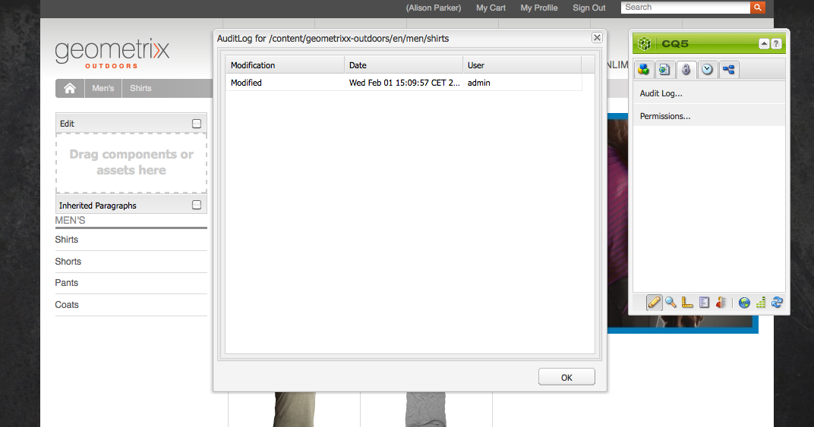

# Uw Adobe Experience Manager-exemplaar controleren en onderhouden{#monitoring-and-maintaining-your-aem-instance}

Nadat uw AEM-instanties zijn geïmplementeerd, moet u de werking, prestaties en integriteit van deze instanties controleren en onderhouden.

Een belangrijke factor in dit verband is dat als u potentiële problemen wilt herkennen, u moet weten hoe uw systeem er onder normale omstandigheden uitziet en zich gedraagt. Deze mogelijkheid kan het best worden verwezenlijkt door het systeem te controleren en informatie in de loop van de tijd te verzamelen.

| Controleren | Overwegingen | Opmerkingen / Handelingen |
|---|---|---|
| Back-upplan. |  | Zie hoe te [&#x200B; file uw Instantie &#x200B;](/help/sites-deploying/monitoring-and-maintaining.md#backups). |
| Rampenherstelplan. | De richtlijnen voor noodherstel van uw bedrijf. |  |
| Er is een systeem voor foutcontrole beschikbaar voor het melden van problemen. | Bijvoorbeeld, [&#x200B; Bugzilla &#x200B;](https://www.bugzilla.org/), [&#x200B; Jira &#x200B;](https://www.atlassian.com/software/jira), of één van vele anderen. |  |
| Bestandssystemen worden gecontroleerd. | De CRX-opslagplaats &quot;bevriest&quot; als er onvoldoende vrije schijfruimte is. Het wordt hervat nadat ruimte beschikbaar wordt. | De &quot; `*ERROR* LowDiskSpaceBlocker`&quot;berichten kunnen in het logboekdossier worden gezien wanneer de vrije ruimte laag wordt. |
| [&#x200B; de dossiers van het Logboek &#x200B;](/help/sites-deploying/monitoring-and-maintaining.md#working-with-audit-records-and-log-files) worden gecontroleerd. |  |  |
| Systeembewaking wordt (voortdurend) op de achtergrond uitgevoerd. | Inclusief CPU, geheugen, schijf en netwerkgebruik. Gebruik bijvoorbeeld iostat / vmstat / perfmon. | De geregistreerde gegevens worden visualiseerd en kunnen voor het volgen van prestatiesproblemen worden gebruikt. Onbewerkte gegevens zijn ook toegankelijk. |
| [&#x200B; de prestaties van AEM worden gecontroleerd &#x200B;](/help/sites-deploying/monitoring-and-maintaining.md#monitoring-performance). | Omvat [&#x200B; Tellers van het Verzoek &#x200B;](/help/sites-deploying/monitoring-and-maintaining.md#request-counters) om verkeersniveaus te controleren. | Indien een aanzienlijk of langdurig prestatieverlies wordt vastgesteld, moet een grondig onderzoek worden ingesteld. |
| U controleert uw [&#x200B; Agenten van de Replicatie &#x200B;](/help/sites-deploying/monitoring-and-maintaining.md#monitoring-your-replication-agents). |  |  |
| Workflowinstanties regelmatig leegmaken. | Grootte opslagplaats en workflowprestaties. | Zie [&#x200B; Regelmatige het Schrappen van de Instanties van het Werkschema &#x200B;](/help/sites-administering/workflows-administering.md#regular-purging-of-workflow-instances). |

## Back-ups {#backups}

Het is een goede gewoonte om back-ups te maken van:

* Uw software-installatie - voor/na belangrijke wijzigingen in de configuratie
* De inhoud die binnen de gegevensbank wordt gehouden - regelmatig

Uw bedrijf heeft waarschijnlijk een reservebeleid dat u volgt, extra overwegingen van wat en wanneer aan file omvatten het volgende:

* hoe kritisch het systeem en de gegevens zijn.
* hoe vaak de software of gegevens worden gewijzigd.
* gegevensvolume; capaciteit kan soms een probleem zijn, evenals de tijd om de back-up uit te voeren.
* of uw back-up kan worden gemaakt terwijl gebruikers online zijn en, indien mogelijk, wat is de invloed op de prestaties.
* de geografische spreiding van de gebruikers, d.w.z. wanneer is het beste moment om een back-up te maken (om de gevolgen tot een minimum te beperken)?
* uw beleid voor noodherstel; zijn er richtlijnen over waar de back-upgegevens moeten worden opgeslagen (bijvoorbeeld extern en specifiek medium).

Vaak wordt een volledige steun genomen met regelmatige intervallen (bijvoorbeeld, dagelijks, wekelijks, of maandelijks), met stijgende steunen binnen tussen (bijvoorbeeld, uur, dag, of wekelijks).

>[!CAUTION]
>
>Wanneer het uitvoeren van file-ups van uw productieversies, moeten de tests ** worden gemaakt om ervoor te zorgen dat u de steun kunt met succes herstellen.
>
>Zonder deze test is de back-up mogelijk nutteloos (worst case-scenario).

>[!NOTE]
>
>Voor meer informatie over reserveprestaties, lees de [&#x200B; sectie van de Prestaties van de file &#x200B;](/help/sites-deploying/configuring-performance.md#backup-performance).

### Back-up maken van de software-installatie {#backing-up-your-software-installation}

Na installatie, of significante veranderingen in de configuratie, creeer een steun van uw softwareinstallatie.

Om deze taak te verwezenlijken, [&#x200B; file uw volledige bewaarplaats &#x200B;](#backing-up-your-repository) en toen:

1. Stop AEM.
1. Maak een back-up van de gehele `<cq-installation-dir>` vanuit uw bestandssysteem.

>[!CAUTION]
>
>Als u een externe toepassingsserver gebruikt, kunnen extra mappen zich op een andere locatie bevinden en moet er ook een back-up van worden gemaakt. Zie [&#x200B; hoe te om AEM met een Server van de Toepassing &#x200B;](/help/sites-deploying/application-server-install.md) voor informatie te installeren over het installeren van toepassingsservers.

>[!CAUTION]
>
>Incrementele back-up van de bestandsgegevensopslag wordt ondersteund. Wanneer u incrementele back-up voor andere componenten gebruikt (zoals de Lucene-index), moet u ervoor zorgen dat verwijderde bestanden ook worden gemarkeerd als verwijderd in de back-up.

>[!NOTE]
>
>Schijfspiegeling kan ook worden gebruikt als back-upmechanisme.

### Back-up maken van uw opslagplaats {#backing-up-your-repository}

De [&#x200B; reserve en herstelt &#x200B;](/help/sites-administering/backup-and-restore.md) sectie van de documentatie van CRX behandelt alle kwesties met betrekking tot steunen van de bewaarplaats van CRX.

Voor volledige details van het maken van online &quot;hete&quot;steun, zie [&#x200B; Creërend een Online Steun &#x200B;](/help/sites-administering/backup-and-restore.md#online-backup).

## Versie leegmaken {#version-purging}

Het **hulpmiddel van de Versies van de Woorden** is voorgenomen voor het zuiveren van de versies van een knoop of een hiërarchie van knopen in uw bewaarplaats. Het belangrijkste doel is om u te helpen de grootte van uw opslagplaats te verminderen door oude versies van uw knopen te verwijderen.

Deze sectie behandelt onderhoudsbewerkingen met betrekking tot de versiefunctie van AEM. Het **hulpmiddel van de Versie van de Woorden** is voorgenomen voor het zuiveren van de versies van een knoop of een hiërarchie van knopen in uw bewaarplaats. Het belangrijkste doel is om u te helpen de grootte van uw opslagplaats te verminderen door oude versies van uw knopen te verwijderen.

### Overzicht {#overview}

Het **hulpmiddel van de Versies van de Woorden** is beschikbaar als wekelijkse onderhoudstaak. Alvorens voor het eerst te gebruiken, moet het worden toegevoegd, dan gevormd. Daarna kan het op verzoek of wekelijks worden uitgevoerd.

### Versies van een website wissen {#purging-versions-of-a-web-site}

Ga als volgt te werk om versies van een website te wissen:

1. Navigeer aan de **[Hulpmiddelen](/help/sites-administering/tools-consoles.md)** **console**, uitgezochte **Verrichting**, **Onderhoud**, toen **Wekelijks het Venster van het Onderhoud**.

1. Selecteer **+ toevoegen** van de hoogste toolbar.

   

1. Selecteer **Woorden van de Versie** van de drop-down lijst in **Nieuwe Taak** dialoog toevoegen. Dan **sparen**.

   

1. De **taak van de Woorden van 0&rbrace; Versie wordt toegevoegd.** Met de kaartacties kunt u:
   * Selecteren - hiermee worden extra acties op de bovenste werkbalk weergegeven
   * Uitvoeren - om de gevormde zuivering onmiddellijk in werking te stellen
   * Configureren - voor het configureren van de wekelijkse zuiveringstaak

   

1. Selecteer **vormen** actie om de Console van het Web voor **de Taak van de WCM van de WCM van de Versie van de Dag te openen WCM**, waar u kunt vormen:

   

   * **Wis wegen**
Stel het beginpad in van de inhoud die moet worden gewist, bijvoorbeeld `/content/wknd` .

     >[!CAUTION]
     >
     >Adobe raadt u aan meerdere paden te definiëren voor elk van uw websites.
     >
     >Als u een pad met te veel kinderen definieert, kan de tijd voor het leegmaken aanzienlijk langer worden.

   * **zuivert recursief versies**

      * Schakel deze optie uit als u alleen het knooppunt dat door het pad wordt gedefinieerd, wilt leegmaken.
      * Selecteer deze optie als u het knooppunt dat door het pad en de onderliggende knooppunten wordt gedefinieerd, wilt leegmaken.

   * **Maximum aantal versies**
Stel het maximumaantal versies (voor elk knooppunt) in dat u wilt behouden. Laat leeg om deze instelling niet te gebruiken.

   * **Minimum aantal versies**
Stel het minimale aantal versies (voor elk knooppunt) in dat u wilt behouden. Laat leeg om deze instelling niet te gebruiken.

   * **Maximale versiepagina**
Stel de maximale versiepagina in dagen in (voor elk knooppunt) die u wilt behouden. Laat leeg om deze instelling niet te gebruiken.

   Dan **sparen**.

1. Navigeer/terugkeer aan het **venster van het Onderhoud van 0&rbrace; Wekelijks &lbrace;en selecteer** Looppas **om het proces onmiddellijk te lanceren.**

>[!CAUTION]
>
>U kunt de Klassieke dialoog gebruiken UI om a [&#x200B; Dry Looppas &#x200B;](#analyzing-the-console) van uw configuratie uit te voeren:
>
>* http://localhost:4502/etc/versioning/purge.html
>
>Opgeloste knooppunten kunnen niet worden hersteld zonder de opslagplaats te herstellen. Zorg voor uw configuratie door altijd een droge run uit te voeren alvorens te zuiveren.

#### Droog uitvoeren - De console analyseren {#analyzing-the-console}

De klassieke UI verstrekt de optie van de Looppas van de a **Dry** van:

* http://localhost:4502/etc/versioning/purge.html

In dit proces worden alle knooppunten weergegeven die zijn verwerkt. Tijdens het proces kan een knooppunt een van de volgende statussen hebben:

* `ignore (not versionnable)`: het knooppunt ondersteunt geen versiebeheer en wordt tijdens het proces genegeerd.

* `ignore (no version)`: het knooppunt heeft geen versie en wordt tijdens het proces genegeerd.

* `retained`: het knooppunt is niet gewist.
* `purged`: het knooppunt wordt gewist.

Bovendien verstrekt de console nuttige informatie over de versies:

* `V 1.0` : het versienummer.
* `V 1.0.1`&#42; : de ster geeft aan dat de versie de huidige (basis)versie is en niet kan worden gewist.

* `Thu Mar 15 2012 08:37:32 GMT+0100` : de datum van de versie.

In het volgende voorbeeld:

* De versies van **[!DNL Shirts]** worden gewist omdat hun versieleeftijd langer is dan twee dagen.
* De **[!DNL Tonga Fashions!]** -versies worden gewist omdat het aantal versies groter is dan 5.


## Werken met auditrecords en logbestanden {#working-with-audit-records-and-log-files}

Op verschillende plaatsen zijn controledossiers en logbestanden met betrekking tot Adobe Experience Manager (AEM) te vinden. Hieronder vindt u een overzicht van wat u kunt vinden en waar u het kunt vinden.

### Werken met logbestanden {#working-with-logs}

AEM WCM registreert gedetailleerde logboeken. Nadat u QuickStart hebt uitpakken en gestart, kunt u logbestanden vinden:

* `<cq-installation-dir>/crx-quickstart/logs/`

* `<cq-installation-dir>/crx-quickstart/repository/`

#### Bestandsrotatie logbestand {#log-file-rotation}

De omwenteling van het dossier van het logboek verwijst naar het proces dat de groei van het dossier door een dossier periodiek te creëren beperkt. In AEM wordt een logbestand met de naam `error.log` eenmaal per dag geroteerd volgens de opgegeven regels:

* De naam van het bestand `error.log` wordt gewijzigd volgens het patroon `{original_filename}.yyyy-MM-dd` . Op 11 juli 2010 bijvoorbeeld wordt de naam van het huidige logbestand gewijzigd in `error.log-2010-07-10` en wordt vervolgens een nieuwe `error.log` gemaakt.

* Eerdere logbestanden worden niet verwijderd. Het is dus uw verantwoordelijkheid om oude logbestanden regelmatig te wissen om het schijfgebruik te beperken.

>[!NOTE]
>
>Als u de AEM-installatie upgradet, blijven bestaande logbestanden die niet meer door AEM worden gebruikt, op de schijf staan. U kunt ze zonder risico verwijderen. Alle nieuwe logitems worden geschreven in de nieuwe logbestanden.

### De logbestanden zoeken {#finding-the-log-files}

Verschillende logbestanden worden opgeslagen op de bestandsserver waarop u AEM hebt geïnstalleerd:

* `<cq-installation-dir>/crx-quickstart/logs`

   * `access.log`
Alle verzoeken om toegang tot de AEM WCM en de opslagplaats worden hier geregistreerd.

   * `audit.log`
Moderatiehandelingen worden hier geregistreerd.

   * `error.log`
Foutberichten (van verschillende ernst) worden hier geregistreerd.

   * [`ImageServer-<PortId>-yyyy>-<mm>-<dd>.log` &#x200B;](https://experienceleague.adobe.com/docs/dynamic-media-developer-resources/image-serving-api/image-serving-api/config-admin/server-logging/c-image-server-log.html?lang=nl-NL)
Dit logbestand wordt alleen gebruikt als [!DNL Dynamic Media] is ingeschakeld. Het verstrekt statistieken en analytische informatie die voor het analyseren van gedrag van het interne proces ImageServer wordt gebruikt.

   * `request.log`
Elk toegangsverzoek wordt hier geregistreerd samen met de reactie.

   * [`s7access-<yyyy>-<mm>-<dd>.log` &#x200B;](https://experienceleague.adobe.com/docs/dynamic-media-developer-resources/image-serving-api/image-serving-api/config-admin/server-logging/c-access-log.html?lang=nl-NL)
Dit logbestand wordt alleen gebruikt als [!DNL Dynamic Media] is ingeschakeld. In het s7access-logboek wordt elke aanvraag vastgelegd die aan [!DNL Dynamic Media] tot en met `/is/image` en `/is/content` is gedaan.

   * `stderr.log`
Bevat foutberichten, opnieuw van verschillende niveaus van ernst, die tijdens het opstarten worden gegenereerd. Standaard is het logniveau ingesteld op `Warning` ( `WARN`)

   * `stdout.log`
Bevat logboekberichten die op gebeurtenissen tijdens opstarten wijzen.

   * `upgrade.log`
Bevat een logboek van alle upgradebewerkingen die worden uitgevoerd vanuit de pakketten `com.day.compat.codeupgrade` en `com.adobe.cq.upgradesexecutor` .

* `<cq-installation-dir>/crx-quickstart/repository/segmentstore`

   * `journal.log`
Informatie over Revisie-journalistiek.

>[!NOTE]
>
>De logboeken van ImageServer en s7access zijn niet inbegrepen in **Download volledig &#x200B;** pakket dat van het **systeem/console/status-Bundlelist &#x200B;** pagina wordt geproduceerd. Als u problemen met [!DNL Dynamic Media] ondervindt, voegt u voor ondersteuningsdoeleinden de logboeken ImageServer en s7access toe wanneer u contact opneemt met de Klantenondersteuning.

### Het FOUTOPSPORINGSlogniveau activeren {#activating-the-debug-log-level}

Het standaardlogboekniveau ([&#x200B; Apache die het Registreren van de Configuratie van het Logboekregistratie &#x200B;](/help/sites-deploying/osgi-configuration-settings.md#apacheslingloggingconfiguration)) registreert is Informatie, zodat zuiver berichten niet worden geregistreerd.

Om het debug logboekniveau voor een Logger te activeren, plaats het bezit `org.apache.sling.commons.log.level` om in de bewaarplaats te zuiveren. Bijvoorbeeld, op `/libs/sling/config/org.apache.sling.commons.log.LogManager` om het [&#x200B; globale Loggen van het Sling van Apache te vormen &#x200B;](/help/sites-deploying/osgi-configuration-settings.md#apacheslingloggingconfiguration).

>[!CAUTION]
>
>Verlaat het logboek bij zuivert logboekniveau niet langer dan noodzakelijk, omdat het talrijke logboekingangen produceert, die middelen verbruiken.

Een lijn in zuivert dossier begint gewoonlijk met DEBUG, dan verstrekt het logboekniveau, de installeractie, en het logboekbericht. Bijvoorbeeld:

```shell
DEBUG 3 WebApp Panel: WebApp successfully deployed
```

De logniveaus zijn als volgt:

| 0 | Fatale fout | De handeling is mislukt en het installatieprogramma kan niet doorgaan. |
|---|---|---|
| 1 | Fout | De handeling is mislukt. De installatie gaat door, maar een deel van AEM WCM is niet correct geïnstalleerd en werkt niet. |
| 2 | Waarschuwing | De actie is geslaagd maar heeft problemen ondervonden. AEM WCM werkt mogelijk niet correct. |
| 3 | Informatie | De actie is geslaagd. |

### Een aangepast logbestand maken {#create-a-custom-log-file}

>[!NOTE]
>
>Wanneer het werken met Adobe Experience Manager, zijn er verscheidene methodes om de configuratiemontages voor dergelijke diensten te beheren; zie [&#x200B; Vormend OSGi &#x200B;](/help/sites-deploying/configuring-osgi.md) voor meer details en de geadviseerde praktijken.

In bepaalde omstandigheden, kunt u een dossier van het douanelogboek met een verschillend logboekniveau willen tot stand brengen. Voer de volgende handelingen uit in de opslagplaats:

1. Als deze niet bestaat, maakt u een configuratiemap ( `sling:Folder` ) voor uw project `/apps/<project-name>/config` .
1. Onder `/apps/<project-name>/config`, creeer een knoop voor de nieuwe [&#x200B; Apache die Logger van het Registreren van de Registratie &#x200B;](/help/sites-deploying/osgi-configuration-settings.md#apacheslingloggingloggerconfigurationfactoryconfiguration) sloopt:

   * Naam: `org.apache.sling.commons.log.LogManager.factory.config-<identifier>`

     Waar `<identifier>` wordt vervangen door vrije tekst die u (moet) invoeren om het exemplaar te identificeren (u kunt deze informatie niet weglaten).

     Bijvoorbeeld: `org.apache.sling.commons.log.LogManager.factory.config-MINE`

   * Type: `sling:OsgiConfig`

   >[!NOTE]
   >
   >Hoewel dit geen technische vereiste is, is het raadzaam `<identifier>` uniek te maken.

1. Stel de volgende eigenschappen in voor dit knooppunt:

   * Naam: `org.apache.sling.commons.log.file`

     Type: String

     Waarde: geef het logbestand op, bijvoorbeeld `logs/myLogFile.log`

   * Naam: `org.apache.sling.commons.log.names`

     Type: String [] (String + Multi)

     Waarde: specificeer de diensten OSGi waarvoor Logger berichten moet registreren; bijvoorbeeld, al het volgende:

      * `org.apache.sling`
      * `org.apache.felix`
      * `com.day`

   * Naam: `org.apache.sling.commons.log.level`

     Type: String

     Waarde: geef het vereiste logniveau op ( `debug` , `info` , `warn` of `error` ), bijvoorbeeld `debug`

   * Configureer de overige parameters naar wens:

      * Naam: `org.apache.sling.commons.log.pattern`

        Type: `String`

        Waarde: geef desgewenst het patroon van het logbericht op, bijvoorbeeld

        `{0,date,dd.MM.yyyy HH:mm:ss.SSS} *{4}* [{2}] {3} {5}`

   >[!NOTE]
   >
   >`org.apache.sling.commons.log.pattern` ondersteunt maximaal zes argumenten.
   >
   >{0} The timestamp of type `java.util.Date`
   >
   >{1} de logboekmarkering
   >
   >{2} the name of the current thread
   >
   >{3} de naam van de logboekregistratie
   >
   >{4} het logniveau
   >
   >{5} het logbericht
   >
   >Als de logboekvraag a `Throwable` omvat, wordt stacktrace toegevoegd aan het bericht.

   >[!CAUTION]
   >
   >org.apache.sling.commons.log.names moet een waarde hebben.

   >[!NOTE]
   >
   >Logschrijfpaden zijn relatief ten opzichte van de locatie `crx-quickstart` .
   >
   >Daarom wordt een logbestand opgegeven als:
   >
   >`logs/thelog.log`
   >
   >schrijft naar:
   >
   >`<cq-installation-dir>/crx-quickstart/logs/thelog.log`.
   >
   >En een logbestand opgegeven als:
   >
   >`../logs/thelog.log`
   >
   >schrijft naar een map:
   >
   >`<cq-installation-dir>/logs/`\
   >(dus naast `<cq-installation-dir>/crx-quickstart/` )

1. Deze stap is alleen nodig wanneer een nieuwe schrijver is vereist (dat wil zeggen met een andere configuratie dan de standaardschrijver).

   >[!CAUTION]
   >
   >Een nieuwe configuratie van de schrijver van het Registreren wordt slechts vereist wanneer het bestaande gebrek niet geschikt is.
   >
   >Als geen expliciete Schrijver wordt gevormd, produceert het systeem automatisch een impliciete Schrijver die op het gebrek wordt gebaseerd.

   Onder `/apps/<project-name>/config`, creeer een knoop voor de nieuwe [&#x200B; Apache die het Registreren van de Schrijver Configuratie van het Logboekregistratie &#x200B;](/help/sites-deploying/osgi-configuration-settings.md#apacheslingloggingwriterconfigurationfactoryconfiguration):

   * Naam: `org.apache.sling.commons.log.LogManager.factory.writer-<identifier>` (een schrijver)

     Net als bij Logger wordt `<identifier>` vervangen door vrije tekst die u (moet) invoeren om de instantie te identificeren (u kunt deze informatie niet weglaten). Bijvoorbeeld: `org.apache.sling.commons.log.LogManager.factory.writer-MINE`

   * Type: `sling:OsgiConfig`

   >[!NOTE]
   >
   >Hoewel dit geen technische vereiste is, is het raadzaam `<identifier>` uniek te maken.

   Stel de volgende eigenschappen in voor dit knooppunt:

   * Naam: `org.apache.sling.commons.log.file`

     Type: `String`

     Waarde: geef het logbestand op, zodat dit overeenkomt met het bestand dat is opgegeven in het logbestand.

     voor dit voorbeeld, `../logs/myLogFile.log`.

   * Configureer de overige parameters naar wens:

      * Naam: `org.apache.sling.commons.log.file.number`

        Type: `Long`

        Waarde: geef het aantal logbestanden op dat u wilt behouden, bijvoorbeeld `5`

      * Naam: `org.apache.sling.commons.log.file.size`

        Type: `String`

        Waarde: geef de vereiste waarde op om de rotatie van het bestand op grootte/datum te bepalen, bijvoorbeeld `'.'yyyy-MM-dd`

   >[!NOTE]
   >
   >`org.apache.sling.commons.log.file.size` bepaalt de rotatie van het logbestand door een van de volgende instellingen in te stellen:
   >
   >* een maximale bestandsgrootte
   >* een datum-/tijdschema
   >
   >om aan te geven wanneer een nieuw bestand wordt gemaakt (en de naam van het bestaande bestand wordt gewijzigd volgens het naampatroon).
   >
   >* Een formaatlimiet kan met een getal worden opgegeven. Als er geen grootteindicator is opgegeven, wordt deze gebruikt als het aantal bytes. U kunt ook een van de grootteindicatoren - `KB`, `MB` of `GB` (hoofdlettergebruik wordt genegeerd) toevoegen.
   >* Een tijd-/datumschema kan worden opgegeven als een `java.util.SimpleDateFormat` patroon. Hiermee wordt de tijdsperiode gedefinieerd waarna het bestand wordt geroteerd. Het achtervoegsel dat aan het geroteerde bestand is toegevoegd (ter identificatie).
   >
   >De standaardwaarde is &#39;.&#39;jjjj-MM-dd (voor dagelijkse logrotatie).
   >
   >Bijvoorbeeld, om middernacht Januari 20, 2010 (of wanneer het eerste logboekbericht na deze datum om precies te zijn voorkomt), wordt ../logs/error.log anders genoemd aan ../logs/error.log.2010-01-20. Logboekregistratie voor 21 januari wordt uitgevoerd naar (een nieuw en leeg) ../logs/error.log totdat het bij de volgende verandering van dag wordt doorgehaald.
   >
   >| `'.'yyyy-MM` | Rotatie aan het begin van elke maand |
   >|---|---|
   >| `'.'yyyy-ww` | Rotatie op de eerste dag van elke week (afhankelijk van de landinstelling). |
   >| `'.'yyyy-MM-dd` | Rotatie elke dag om middernacht. |
   >| `'.'yyyy-MM-dd-a` | Roteren om middernacht en middag van elke dag. |
   >| `'.'yyyy-MM-dd-HH` | Rotatie boven aan elk uur. |
   >| `'.'yyyy-MM-dd-HH-mm` | Rotatie aan het begin van elke minuut. |
   >
   >Opmerking: wanneer u een tijd/datum opgeeft:
   >
   >1. U moet letterlijke tekst met enkele aanhalingstekens (&#39; &#39;) &quot;escape&quot; (escape)&quot;;
   >
   >    Hiermee voorkomt u dat bepaalde tekens worden geïnterpreteerd als patroonletters.
   >
   >1. Gebruik alleen tekens die zijn toegestaan voor een geldige bestandsnaam op een willekeurige plaats in de optie.

1. Lees het nieuwe logbestand met het gekozen gereedschap.

   Het logbestand dat in dit voorbeeld wordt gemaakt, is `../crx-quickstart/logs/myLogFile.log` .

De Felix-console biedt ook informatie over Sling Log Support op `../system/console/slinglog`, bijvoorbeeld `https://localhost:4502/system/console/slinglog` .

### Controleregisters zoeken {#finding-the-audit-records}

Er worden auditrecords bijgehouden om een overzicht te geven van wie wat heeft gedaan en wanneer. Er worden verschillende auditverslagen gegenereerd voor zowel AEM WCM- als OSGi-gebeurtenissen.

#### AEM WCM-auditrecords die worden weergegeven bij het ontwerpen van pagina&#39;s {#aem-wcm-audit-records-shown-when-page-authoring}

1. Open een pagina.
1. Van sidekick kunt u het lusje met het slotpictogram selecteren, dan **Logboek van de Controle tweemaal klikken..**
1. Er wordt een nieuw venster geopend met de lijst met auditrecords voor de huidige pagina.

   

1. Klik **O.K.** wanneer u het venster wilt sluiten.

#### AEM WCM-controlegegevens in de gegevensopslagruimte {#aem-wcm-auditing-records-within-the-repository}

In de map `/var/audit` worden auditrecords bijgehouden op basis van de bron. U kunt naar beneden boren tot u individuele verslagen en de informatie ziet die zij bevatten.

Deze vermeldingen bevatten dezelfde gegevens als bij het bewerken van een pagina.

#### OSGi-auditrecords van de webconsole {#osgi-audit-records-from-the-web-console}

De gebeurtenissen OSGi produceren ook controleverslagen die van het **lusje van de Status van de Configuratie** kunnen worden gezien **de Dossiers van het Logboek** tabel in de Console van het Web van AEM:


## Uw replicatieagents controleren {#monitoring-your-replication-agents}

U kunt uw [&#x200B; replicatierijen &#x200B;](/help/sites-deploying/replication.md) controleren om te ontdekken wanneer een rij of neer of geblokkeerd is - die op zijn beurt op een probleem met een het publiceren instantie of extern systeem zouden kunnen wijzen:

* zijn alle vereiste rijen ingeschakeld?
* zijn om het even welke gehandicapte rijen nog vereist?
* alle `enabled` wachtrijen moeten de status `idle` of `active` hebben, die de normale bewerking aangeven. Er mogen geen wachtrijen `blocked` zijn, wat vaak een teken is van problemen aan de ontvangerszijde.

* als de grootte van de rij in tijd groeit, kan het op een geblokkeerde rij wijzen.

Om een replicatieagent te controleren:

1. Heb toegang tot het **lusje van Hulpmiddelen** in AEM.
1. Klik **Replicatie**.
1. Dubbelklik de verbinding aan agenten voor het aangewezen milieu (of de linkerzijde of de juiste ruit); bijvoorbeeld, **Agenten op auteur**.

   Het resulterende venster toont een overzicht van al uw replicatieagenten voor het auteursmilieu, met inbegrip van hun doel en status.

1. Klik de aangewezen agentennaam (die een verbinding is) om gedetailleerde informatie over die agent te tonen:

   

   Hier kunt u:

   * Zie of de agent wordt toegelaten.
   * Zie het doel van eventuele replicaties.
   * Zie of de replicatierij actief (toegelaten) is.
   * Zie of er items in de wachtrij staan.
   * **verfrist zich** of **Duidelijk** om de vertoning van rijingangen bij te werken. Dit helpt u om punten te zien die ingaan en de rij verlaten.
   * **Logboek van de Mening** om tot het logboek van om het even welke acties door de replicatieagent toegang te hebben.
   * **Verbinding van de Test** aan de doelinstantie.
   * **dwingen opnieuw** op om het even welke rijpunten, indien nodig.

   >[!CAUTION]
   >
   >Gebruik de koppeling &quot;Verbinding testen&quot; niet voor het selectievakje Reverse Replication Outbox op een publicatie-instantie.
   >
   >Als een replicatietest voor een Postbus rij wordt uitgevoerd, worden om het even welke punten die ouder zijn dan de testreplicatie opnieuw verwerkt met elke omgekeerde replicatie.
   >
   >Als dergelijke punten in een rij bestaan, kunnen zij met de volgende vraag van JCR van XPath worden gevonden en zouden moeten worden verwijderd.
   >
   >`/jcr:root/var/replication/outbox//*[@cq:repActionType='TEST']`

Ook hier kunt u een oplossing ontwikkelen om alle replicatieagents (die zich onder `/etc/replication/author` of `/etc/replication/publish` bevinden) te detecteren en vervolgens de status van de agent ( `enabled` , `disabled` ) en de onderliggende wachtrij ( `active` , `idle`, `blocked` ) te controleren.

## Monitorprestaties {#monitoring-performance}

[&#x200B; Optimalisering van Prestaties &#x200B;](/help/sites-deploying/configuring-performance.md) is een interactief proces dat nadruk tijdens ontwikkeling ontvangt. Na plaatsing, wordt het herzien na specifieke intervallen of gebeurtenissen.

Methoden die worden gebruikt bij het verzamelen van informatie voor optimalisatie kunnen ook worden gebruikt voor doorlopende bewaking.

>[!NOTE]
>
>De specifieke [&#x200B; configuraties beschikbaar om prestaties te verbeteren &#x200B;](/help/sites-deploying/configuring-performance.md#configuring-for-performance) kunnen ook worden gecontroleerd.

Hieronder worden gemeenschappelijke prestatieproblemen weergegeven die zich voordoen, samen met voorstellen voor het opsporen en bestrijden van deze problemen.

| Gebied | Symptoom | Capaciteit verhogen... | Volume verkleinen... |
|---|---|---|---|
| Client | CPU-gebruik op hoge client. | Installeer een client-CPU met hogere prestaties. | Vereenvoudig de layout (HTML). |
|   | CPU-gebruik met lage server. | Voer een upgrade uit naar een snellere browser. | Cache aan de clientzijde verbeteren. |
|   | Sommige clients zijn snel, sommige traag. |  |  |
| Server |  |  |  |
| Netwerk | CPU gebruikt weinig op zowel servers als clients. | Verwijder netwerkknelpunten. | Verbeter/optimaliseer de configuratie van het cliëntgeheime voorgeheugen. |
|   | Lokaal bladeren op de server is (relatief) snel. | Verhoog de netwerkbandbreedte. | Verminder het &quot;gewicht&quot; van uw webpagina&#39;s (bijvoorbeeld minder afbeeldingen, geoptimaliseerde HTML). |
| Webserver | CPU-gebruik op de webserver is hoog. | Cluster uw webservers. | Verminder de hits per pagina (bezoek). |
|   |  | Gebruik een taakverdelingsmechanisme voor hardware. |  |
| Toepassing | CPU-servergebruik is hoog. | Cluster uw AEM-instanties. | Zoek naar, en elimineer, CPU, en geheugenhogs (gebruik codeoverzicht en timingoutput). |
|   | Hoog geheugenverbruik. |  | Verbeter caching op alle niveaus. |
|   | Lage responstijden. |  | Sjablonen en componenten optimaliseren (bijvoorbeeld structuur, logica). |
| Bewaarplaats |  |  |  |
| Cache |  |  |  |

Prestatieproblemen kunnen het gevolg zijn van verschillende oorzaken die niets te maken hebben met uw website, zoals tijdelijke vertragingen in de verbindingssnelheid, het laden van CPU en nog veel meer.

Het kan ook gevolgen hebben voor al uw bezoekers of alleen voor een deel ervan.

Al deze informatie moet worden verkregen, gesorteerd en geanalyseerd voordat u de algemene prestaties kunt optimaliseren of specifieke problemen kunt oplossen.

* Voordat u een prestatieprobleem ervaart:

   * zoveel mogelijk informatie verzamelen om onder normale omstandigheden een goede werkkennis van het systeem op te bouwen

* Wanneer u een prestatieprobleem ondervindt:

   * proberen deze te repliceren met een (of bij voorkeur meer) standaardwebbrowser, op een andere client waarvan u weet dat deze goede algemene prestaties levert en/of op de server zelf (indien mogelijk)
   * controleren of er iets (met betrekking tot het systeem) binnen een passende tijdspanne is gewijzigd en of een van deze wijzigingen van invloed kan zijn geweest op de prestaties
   * vragen stellen zoals:

      * komt dit probleem alleen op specifieke tijdstippen voor ?
      * komt de kwestie slechts op specifieke pagina&#39;s voor?
      * worden andere verzoeken beïnvloed?

   * zoveel mogelijk informatie verzamelen om onder normale omstandigheden met uw kennis van het systeem te kunnen vergelijken:

### Gereedschappen voor het bewaken en analyseren van prestaties {#tools-for-monitoring-and-analyzing-performance}

Hieronder vindt u een kort overzicht van enkele gereedschappen die beschikbaar zijn voor het bewaken en analyseren van de prestaties.

Sommige van deze gereedschappen zijn afhankelijk van uw besturingssysteem.

<table>
 <tbody>
  <tr>
   <td>Gereedschap</td>
   <td>Wordt gebruikt om te analyseren...</td>
   <td>Gebruik / Meer informatie...</td>
  </tr>
  <tr>
   <td>request.log</td>
   <td>Responstijden en gelijktijdige toediening.</td>
   <td><a href="#interpreting-the-request-log"> Interpreting the request.log </a>.</td>
  </tr>
  <tr>
   <td>sporen</td>
   <td>Pagina wordt geladen</td>
   <td><p>Unix/Linux bevelen om systeemvraag en signalen te volgen. Verhoog het logniveau tot <code>INFO</code>.</p> <p>Analyseer het aantal pagina's dat per aanvraag wordt geladen en welke pagina's.</p> </td>
  </tr>
  <tr>
   <td>Draad-dumpen</td>
   <td>Bekijk JVM-threads. Identificeer inhoud, sloten, en lange looprunners.</td>
   <td><p>Afhankelijk van het besturingssysteem:<br /> - Unix/Linux: <code>kill -QUIT &lt;<em>pid</em>&gt;</code><br /> - Windows (consolemodus): Ctrl-Break <br /> </p> <p>De hulpmiddelen van de analyse zijn ook beschikbaar, zoals <a href="https://github.com/irockel/tda"> TDA </a>.<br /> </p> </td>
  </tr>
  <tr>
   <td>Heap Dumps</td>
   <td>Onvoldoende geheugen, waardoor de prestaties vertragen.</td>
   <td><p>Voeg de optie:<br /> <code>-XX:+HeapDumpOnOutOfMemoryError</code><br /> toe aan de Java™-aanroep die naar AEM gaat.</p> <p>Zie <a href="https://docs.oracle.com/javase/8/docs/technotes/guides/troubleshoot/prepapp002.html#CEGBHDFH"> Opties/Vlaggen voor JVM het Oplossen van problemen Pagina </a>.</p> </td>
  </tr>
  <tr>
   <td>Systeemaanroepen</td>
   <td>Problemen met timing vaststellen.</td>
   <td><p>Roept <code>System.currentTimeMillis()</code> of <code>com.day.util</code> aan. De timing wordt gebruikt om tijdstempels van uw code, of als <a href="#html-comments"> HTML-commentaren </a> te produceren.</p> <p><strong> Nota:</strong> voer deze dingen uit zodat zij kunnen worden geactiveerd/worden gedeactiveerd zoals vereist; wanneer een systeem regelmatig loopt, is de overheadkosten van het verzamelen van statistieken niet nodig.</p> </td>
  </tr>
  <tr>
   <td>Apache Bench</td>
   <td>Identificeer geheugenlekken, selectief analyseer reactietijd.</td>
   <td><p>basisgebruik is:</p> <p><code>ab -k -n &lt;<em>requests</em>&gt; -c &lt;<em>concurrency</em>&gt; &lt;<em>url</em>&gt;</code></p> <p>Zie <a href="#apache-bench"> de Bench van Apache </a> en de <a href="https://httpd.apache.org/docs/2.4/programs/ab.html"> Web man pagina </a> voor volledige details.</p> </td>
  </tr>
  <tr>
   <td>Zoekanalyse</td>
   <td> </td>
   <td>Voer offline onderzoeksvragen uit, identificeer reactietijd van vraag, test, en bevestig resultaatreeks.<br /> </td>
  </tr>
  <tr>
   <td>JMeter</td>
   <td>Belastings- en functionele tests.</td>
   <td><a href="https://jmeter.apache.org/">https://jmeter.apache.org/</a></td>
  </tr>
  <tr>
   <td>JProfiler</td>
   <td>Uitgebreide CPU- en geheugenprofilering.</td>
   <td><a href="https://www.ej-technologies.com/">https://www.ej-technologies.com/</a></td>
  </tr>
  <tr>
   <td>Java™ Flight Recorder</td>
   <td>Java™ Flight Recorder (JFR) is een hulpmiddel voor het verzamelen van diagnostische en profilerende gegevens over een lopende Java™-toepassing.</td>
   <td><a href="https://docs.oracle.com/javase/8/docs/technotes/guides/troubleshoot/tooldescr004.html#BABJJEEE">https://docs.oracle.com/javase/8/docs/technotes/guides/troubleshoot/tooldescr004.html#BABJJEEE</a></td>
  </tr>
  <tr>
   <td>JConsole</td>
   <td>Bekijk JVM-metriek en -threads.</td>
   <td><p>Gebruik: jconsole</p> <p>Zie <a href="https://docs.oracle.com/javase/8/docs/technotes/guides/management/jconsole.html"> jconsole </a> en <a href="#monitoring-performance-using-jconsole"> Prestaties van de Controle gebruikend JConsole </a>.</p> <p><strong> Nota:</strong> met JDK 1.8, is JConsole verlengbaar met stop-ins; bijvoorbeeld, Hoogste of TDA (de Analysator van de Dumpel van de Drong van de Drong).</p> </td>
  </tr>
  <tr>
   <td>Java™ VisualVM</td>
   <td>Bekijk JVM-metriek, threads, geheugen en profilering.</td>
   <td><p>Gebruik: visualvm of visualvm <br /> </p> <p>Zie <a href="https://docs.oracle.com/javase/8/docs/technotes/guides/visualvm/"> visualvm </a> en <a href="#monitoring-performance-using-j-visualvm"> Prestaties van de Controle gebruikend (J) VisualVM </a>.</p> <p><strong> Nota:</strong> met JDK 1.8, is VisualVM verlengbaar met stop-ins. VisualVM wordt stopgezet na JDK 9. Gebruik in plaats hiervan de Java™ Flight Recorder.</p> </td>
  </tr>
  <tr>
   <td>worstjes/resten, laatste</td>
   <td>Diepgaande kernel vraag en procesanalyse (UNIX®).</td>
   <td>Unix/Linux-opdrachten.</td>
  </tr>
  <tr>
   <td>Timingstatistieken</td>
   <td>Zie timingstatistieken voor het weergeven van pagina's.</td>
   <td><p>Om timatiestatistieken voor pagina te zien die teruggeven, kunt u <strong> CTRL-verschuiving-U </strong> samen met <code>?debugClientLibs=true</code> gebruiken in URL wordt geplaatst.</p> </td>
  </tr>
  <tr>
   <td>CPU en geheugen het profileren hulpmiddel <br /> </td>
   <td><a href="#interpreting-the-request-log"> gebruikt wanneer het analyseren van langzame verzoeken tijdens ontwikkeling </a>.</td>
   <td>Bijvoorbeeld, <a href="https://www.yourkit.com/"> YourKit </a>. of <a href="https://docs.oracle.com/javase/8/docs/technotes/guides/troubleshoot/tooldescr004.html#BABJJEEE"> Java™ Vliegrecorder </a>.</td>
  </tr>
  <tr>
   <td><a href="#information-collection">Informatieverzameling</a></td>
   <td>De huidige staat van uw installatie.</td>
   <td>Als u zoveel mogelijk weet over de installatie, kunt u ook bijhouden wat een wijziging in de prestaties heeft veroorzaakt en of deze wijzigingen gerechtvaardigd zijn. Verzamel deze metriek met regelmatige intervallen zodat u significante veranderingen gemakkelijk kunt zien.</td>
  </tr>
 </tbody>
</table>

### Het interpreteren van request.log {#interpreting-the-request-log}

In dit bestand wordt basisinformatie geregistreerd over elk verzoek dat aan AEM wordt gedaan. Hieruit kunnen waardevolle conclusies worden getrokken.

De `request.log` biedt een ingebouwde manier om te zien hoe lang verzoeken duren. Voor ontwikkelingsdoeleinden is het handig om `tail -f` de `request.log` te  en te controleren op langzame responstijden. Om groter te analyseren `request.log`, adviseert Adobe het [&#x200B; gebruik van `rlog.jar` dat u voor reactietijden &#x200B;](#using-rlog-jar-to-find-requests-with-long-duration-times) laat sorteren en filtreren.

Adobe raadt aan om de &#39;trage&#39; pagina&#39;s te isoleren van `request.log` en ze vervolgens individueel af te stemmen voor betere prestaties. Prestatiewaarden per component opnemen of een hulpprogramma voor het maken van prestatieprofielen gebruiken, zoals ` [yourkit](https://www.yourkit.com/)` .

#### Bewaking van verkeer op uw website {#monitoring-traffic-on-your-website}

Het aanvraaglogboek registreert elke ingediende aanvraag, samen met het gegeven antwoord:

```xml
09:43:41 [66] -> GET /author/y.html HTTP/1.1
09:43:41 [66] <- 200 text/html 797ms
```

Door alle GET-items in een bepaalde periode op te tellen (bijvoorbeeld over verschillende periodes van 24 uur), kunt u instructies geven over het gemiddelde verkeer op uw website.

#### De reactietijden van de controle met request.log {#monitoring-response-times-with-the-request-log}

Een goed uitgangspunt voor prestatiesanalyse is het verzoeklogboek:

`<cq-installation-dir>/crx-quickstart/logs/request.log`

Het logbestand ziet er als volgt uit (de regels worden ingekort om het eenvoudig te houden):

```xml
31/Mar/2009:11:32:57 +0200 [379] -> GET /path/x HTTP/1.1
31/Mar/2009:11:32:57 +0200 [379] <- 200 text/html 33ms
31/Mar/2009:11:33:17 +0200 [380] -> GET /path/y HTTP/1.1
31/Mar/2009:11:33:17 +0200 [380] <- 200 application/json 39ms
```

Dit logboek heeft één lijn per verzoek of reactie:

* De datum waarop elk verzoek of antwoord is ingediend.
* The number of the request, in square brackets. Dit aantal komt voor het verzoek en de reactie overeen.
* Een pijl die aangeeft of het een aanvraag (pijl die naar rechts wijst) of een reactie (pijl naar links) is.
* Voor verzoeken bevat de regel:

   * de methode (doorgaans GET, HEAD of POST)
   * de gevraagde pagina
   * het protocol

* Voor reacties bevat de regel:

   * de statuscode (200 betekent &quot;succes&quot;, 404 betekent &quot;pagina niet gevonden&quot;
   * het MIME-type
   * de responstijd

Met behulp van kleine scripts kunt u de vereiste informatie uit het logbestand extraheren en de gewenste statistieken samenstellen. Uit deze statistieken kunt u zien welke pagina&#39;s of typen pagina&#39;s langzaam zijn en of de prestaties over het geheel genomen bevredigend zijn.

#### De onderzoekreactie tijden van het toezicht met request.log {#monitoring-search-response-times-with-the-request-log}

Zoekverzoeken worden ook in het logbestand geregistreerd:

```xml
31/Mar/2009:11:35:34 +0200 [338] -> GET /author/playground/en/tools/search.html?query=dilbert&size=5&dispenc=utf-8 HTTP/1.1
31/Mar/2009:11:35:34 +0200 [338] <- 200 text/html 1562ms
```

Dus, zoals hierboven, kunt u manuscripten gebruiken om de relevante informatie te halen en statistieken op te bouwen.

Nadat u echter de responstijd hebt bepaald, analyseert u waarom het verzoek de tijd neemt die nodig is en wat u kunt doen om de reactie te verbeteren.

#### Het aantal en de gevolgen van gelijktijdige gebruikers controleren {#monitoring-the-number-and-impact-of-concurrent-users}

Ook hier kan `request.log` worden gebruikt om de gelijktijdige uitvoering en de reactie van het systeem hierop te controleren.

Er moeten tests worden uitgevoerd om te bepalen hoeveel gelijktijdige gebruikers het systeem kan verwerken voordat een negatieve invloed wordt waargenomen. Opnieuw kunnen de manuscripten worden gebruikt om resultaten uit het logboekdossier te halen:

* controleren hoeveel verzoeken binnen een specifieke tijdspanne, zoals één minuut worden gedaan.
* de effecten te testen van een specifiek aantal gebruikers die allemaal dezelfde aanvragen indienen (zo dicht mogelijk) op hetzelfde tijdstip. Bijvoorbeeld, 30 gebruikers die **klikken sparen** tezelfdertijd.

```xml
31/Mar/2009:11:45:29 +0200 [333] -> GET /author/libs/Personalize/content/statics.close.gif HTTP/1.1
31/Mar/2009:11:45:29 +0200 [334] -> GET /author/libs/Personalize/content/statics.detach.gif HTTP/1.1
31/Mar/2009:11:45:30 +0200 [335] -> GET /author/libs/CFC/content/imgs/logo.rZMNURccynWcTpCxyuBNiTCoiBMmw000.default.gif HTTP/1.1
31/Mar/2009:11:45:32 +0200 [335] <- 304 text/html 0ms
31/Mar/2009:11:45:33 +0200 [334] <- 200 image/gif 31ms
31/Mar/2009:11:45:38 +0200 [333] <- 200 image/gif 31ms
31/Mar/2009:11:45:42 +0200 [336] -> GET /author/libs/CFC/content/imgs/logo.rZMNURccynWcTZRXunQbbQtvuuCMbRRBuWXz0000.default.gif HTTP/1.1
31/Mar/2009:11:45:43 +0200 [337] -> GET /author/titlebar_bg.gif HTTP/1.1
31/Mar/2009:11:45:43 +0200 [336] <- 304 text/html 0ms
31/Mar/2009:11:45:44 +0200 [337] <- 304 text/html 0ms
```

### Het gebruiken van rlog.jar om verzoeken met lange duurtijden te vinden {#using-rlog-jar-to-find-requests-with-long-duration-times}

AEM bevat de volgende verschillende hulplijnen:
`<cq-installation-dir>/crx-quickstart/opt/helpers`

Met een van deze gereedschappen, `rlog.jar` , kunt u `request.log` snel sorteren, zodat aanvragen worden weergegeven op duur, van langst tot kortst.

De volgende opdracht toont de mogelijke argumenten:

```shell
$java -jar rlog.jar
Request Log Analyzer Version 21584 Copyright 2005 Day Management AG
Usage:
  java -jar rlog.jar [options] <filename>
Options:
  -h               Prints this usage.
  -n <maxResults>  Limits output to <maxResults> lines.
  -m <maxRequests> Limits input to <maxRequest> requests.
  -xdev            Exclude POST request to CRXDE.
```

U kunt bijvoorbeeld het `request.log` -bestand als parameter opgeven en de tien eerste aanvragen met de langste duur weergeven:

```shell
$ java -jar ../opt/helpers/rlog.jar -n 10 request.log
*Info * Parsed 464 requests.
*Info * Time for parsing: 22ms
*Info * Time for sorting: 2ms
*Info * Total Memory: 1mb
*Info * Free Memory: 1mb
*Info * Used Memory: 0mb
------------------------------------------------------
     18051ms 31/Mar/2009:11:15:34 +0200 200 GET /content/geometrixx/en/company.html text/ html
      2198ms 31/Mar/2009:11:15:20 +0200 200 GET /libs/cq/widgets.js application/x-javascript
      1981ms 31/Mar/2009:11:15:11 +0200 200 GET /libs/wcm/content/welcome.html text/html
      1973ms 31/Mar/2009:11:15:52 +0200 200 GET /content/campaigns/geometrixx.teasers..html text/html
      1883ms 31/Mar/2009:11:15:20 +0200 200 GET /libs/security/cq-security.js application/x-javascript
      1876ms 31/Mar/2009:11:15:20 +0200 200 GET /libs/tagging/widgets.js application/x-javascript
      1869ms 31/Mar/2009:11:15:20 +0200 200 GET /libs/tagging/widgets/themes/default.js application/x-javascript
      1729ms 30/Mar/2009:16:45:56 +0200 200 GET /libs/wcm/content/welcome.html text/html; charset=utf-8
      1510ms 31/Mar/2009:11:15:34 +0200 200 GET /bin/wcm/contentfinder/asset/view.json/ content/dam?_dc=1238490934657&query=&mimeType=image&_charset_=utf-8 application/json
      1462ms 30/Mar/2009:17:23:08 +0200 200 GET /libs/wcm/content/welcome.html text/html; charset=utf-8
```

Plaats de afzonderlijke `request.log` -bestanden als u deze bewerking moet uitvoeren in een groot gegevensvoorbeeld.

### Apache Bench {#apache-bench}

Om het effect van speciale gevallen (zoals huisvuilinzameling) te minimaliseren, wordt het geadviseerd om een hulpmiddel zoals `apachebench` (bijvoorbeeld, [&#x200B; ab &#x200B;](https://httpd.apache.org/docs/2.4/programs/ab.html) voor verdere documentatie) te gebruiken helpen geheugenlekken identificeren en responstijd selectief te analyseren.

Apache Bench kan als volgt worden gebruikt:

```shell
$ ab -c 5 -k -n 1000 "https://localhost:4503/content/geometrixx/en/company.html"
This is ApacheBench, Version 2.3 <$Revision: 655654 $>
Copyright 1996 Adam Twiss, Zeus Technology Ltd, https://www.zeustech.net/
Licensed to The Apache Software Foundation, https://www.apache.org/

Benchmarking localhost (be patient)
Completed 100 requests
Completed 200 requests
Completed 300 requests
Completed 400 requests
Completed 500 requests
Completed 600 requests
Completed 700 requests
Completed 800 requests
Completed 900 requests
Completed 1000 requests
Finished 1000 requests

Server Software: Day-Servlet-Engine/4.1.52
Server Hostname: localhost
Server Port: 4503

Document Path: /content/geometrixx/en/company.html
Document Length: 24127 bytes

Concurrency Level: 5
Time taken for tests: 69.766 seconds
Complete requests: 1000
Failed requests: 998
(Connect: 0, Receive: 0, Length: 998, Exceptions: 0)
Write errors: 0
Keep-Alive requests: 0
Total transferred: 24160923 bytes
HTML transferred: 24010923 bytes
Requests per second: 14.33 /sec (mean)
Time per request: 348.828 [ms] (mean)
Time per request: 69.766 [ms] (mean, across all concurrent requests)
Transfer rate: 338.20 [Kbytes/sec] received

Connection Times (ms)
min mean[+/-sd] median max
Connect: 0 1 3.9 0 58
Processing: 138 347 568.5 282 8106
Waiting: 137 344 568.1 281 8106
Total: 139 348 568.4 283 8106

Percentage of the requests served within a certain time (ms)
50% 283
66% 323
75% 356
80% 374
90% 439
95% 512
98% 1047
99% 1132
100% 8106 (longest request)
```

De bovenstaande nummers zijn afkomstig van een standaard MAcBook Pro-laptop (medio 2010) die toegang heeft tot de Geometrixx-bedrijfspagina, zoals deze is opgenomen in een standaard AEM-installatie. De pagina is eenvoudig, maar niet geoptimaliseerd voor prestaties.

In `apachebench` wordt ook de tijd per aanvraag als het gemiddelde weergegeven voor alle gelijktijdige aanvragen. Zie `Time per request: 54.595 [ms]` (gemiddeld voor alle gelijktijdige aanvragen). U kunt de waarde van de parameter voor gelijktijdige uitvoering `-c` (aantal meerdere aanvragen dat tegelijkertijd moet worden uitgevoerd) wijzigen om effecten te zien.

### Aanvraagtellers {#request-counters}

De informatie over verzoekverkeer (aantal verzoeken tijdens een specifieke tijdspanne) geeft u een aanwijzing van de lading op uw geval. Deze informatie kan uit [&#x200B; request.log &#x200B;](#interpreting-the-request-log) worden gehaald, hoewel het gebruiken van tellers gegevensinzameling automatiseert om u te laten zien:

* significante verschillen in activiteit ( d.w.z. onderscheid maken tussen &quot; veel verzoeken &quot; en &quot; lage activiteit &quot; )
* wanneer een instantie niet wordt gebruikt
* om het even welke nieuwe begin (tellers worden teruggesteld aan 0)

Om informatieinzameling te automatiseren, kunt u een RequestFilter ook installeren om een teller op elk verzoek te verhogen. De veelvoudige tellers kunnen voor verschillende tijdsperioden worden gebruikt.

De verzamelde informatie kan worden gebruikt om aan te geven:

* belangrijke veranderingen in de activiteit
* een redundante instantie
* opnieuw opstarten (teller teruggesteld aan 0)

### HTML-opmerkingen {#html-comments}

Het wordt aanbevolen dat elk project `html comments` bevat voor serverprestaties. Er zijn veel goede openbare voorbeelden te vinden. Selecteer een pagina, open de paginabron voor weergave en schuif naar de onderkant. U kunt de volgende code zien:

```xml
</body>
 </html>
        <!--
        Page took 58 milliseconds to be rendered by server
         -->
```

### Prestaties controleren met behulp van JConsole {#monitoring-performance-using-jconsole}

De gereedschapsopdracht `jconsole` is beschikbaar in de JDK.

1. Start uw AEM-exemplaar.
1. Uitvoeren `jconsole.`
1. Selecteer uw instantie van AEM en **verbinden**.

1. Dubbelklik vanuit de `Local` -toepassing op `com.day.crx.quickstart.Main` . Het overzicht wordt standaard weergegeven:

   

   Nu kunt u andere opties selecteren.

### Prestaties bewaken met behulp van (J)VisualVM {#monitoring-performance-using-j-visualvm}

Voor JDK 6-8 is de gereedschapsopdracht `visualvm` beschikbaar. Nadat u een JDK hebt geïnstalleerd, kunt u het volgende doen:

1. Start uw AEM-exemplaar.

   >[!NOTE]
   >
   >Als u Java™ 5 gebruikt, kunt u het argument `-Dcom.sun.management.jmxremote` toevoegen aan de Java™ opdrachtregel waarmee uw JVM wordt gestart. JMX is standaard ingeschakeld met Java™ 6.

1. Voer een van beide uit:

   * `jvisualvm`: in de map JDK 1.6 bin (geteste versie)
   * `visualvm`: kan van [&#x200B; VisualVM &#x200B;](https://docs.oracle.com/javase/8/docs/technotes/guides/visualvm/) (het bloeden versie van de randversie worden gedownload)

1. Dubbelklik in de `Local` -toepassing `com.day.crx.quickstart.Main` . Het overzicht wordt getoond als gebrek:

   

   Nu kunt u andere opties selecteren, waaronder Monitor:

   

U kunt dit gereedschap gebruiken om thread-dumps en dumps voor geheugenkoppen te maken. Deze informatie wordt vaak gevraagd door het technische ondersteuningsteam.

### Informatieverzameling {#information-collection}

Als u zoveel mogelijk weet wat u met de installatie kunt doen, kunt u nagaan wat een wijziging in de prestaties heeft veroorzaakt en of deze wijzigingen gerechtvaardigd zijn. Verzamel deze metriek met regelmatige intervallen zodat u significante veranderingen gemakkelijk kunt zien.

De volgende informatie kan nuttig zijn:

* [Hoeveel auteurs werken met het systeem?](#how-many-authors-are-working-with-the-system)
* [Wat is het gemiddelde aantal paginanavigaties per dag?](#what-is-the-average-number-of-page-activations-per-day)
* [Hoeveel pagina&#39;s handhaaft u momenteel op dit systeem?](#how-many-pages-do-you-currently-maintain-on-this-system)
* [Als u MSM gebruikt, wat is het gemiddelde aantal rollouts per maand?](#if-you-use-msm-what-is-the-average-number-of-rollouts-per-month)
* [Wat is het gemiddelde aantal levende exemplaren per maand?](#what-is-the-average-number-of-live-copies-per-month)
* [Als u AEM Assets gebruikt, hoeveel middelen handhaaft u momenteel in Assets?](#ifyouusecqdamhowmanyassetsdoyoucurrentlymaintainincqdam)
* [Wat is de gemiddelde omvang van de activa?](#what-is-the-average-size-of-the-assets)
* [Hoeveel sjablonen worden momenteel gebruikt?](#how-many-templates-are-currently-used)
* [Hoeveel componenten worden momenteel gebruikt?](#how-many-components-are-currently-used)
* [Hoeveel verzoeken hebt u per uur op het auteurssysteem op piektijd?](#how-many-requests-per-hour-do-you-have-on-the-author-system-at-peak-time)
* [Hoeveel verzoeken per uur hebt u op het publicatiesysteem bij piektijd?](#how-many-requests-per-hour-do-you-have-on-the-publish-system-at-peak-time)

#### Hoeveel auteurs werken met het systeem? {#how-many-authors-are-working-with-the-system}

Om het aantal auteurs te zien die het systeem sinds installatie hebben gebruikt gebruik de bevellijn:

```shell
cd <cq-installation-dir>/crx-quickstart/logs
cut -d " " -f 3 access.log | sort -u | wc -l
```

Om het aantal auteurs te zien die op een bepaalde datum werken:

```shell
grep "<date>" access.log | cut -d " " -f 3 | sort -u | wc -l
```

#### Wat is het gemiddelde aantal paginanavigaties per dag? {#what-is-the-average-number-of-page-activations-per-day}

Als u het totale aantal paginaberichten sinds de serverinstallatie wilt zien, gebruikt u een opslagruimtequery; als CRXDE - Tools - Query:

* **Type** `XPath`

* **Weg** `/`

* **Vraag** `//element(*, cq:AuditEvent)[@cq:type='Activate']`

Bereken vervolgens het aantal dagen dat is verstreken sinds de installatie om het gemiddelde te berekenen.

#### Hoeveel pagina&#39;s handhaaft u momenteel op dit systeem? {#how-many-pages-do-you-currently-maintain-on-this-system}

Als u het aantal pagina&#39;s wilt zien dat momenteel op de server staat, gebruikt u een query in de repository; via CRXDE - Tools - Query:

* **Type** `XPath`

* **Weg** `/`

* **Vraag** `//element(*, cq:Page)`

#### Als u MSM gebruikt, wat is het gemiddelde aantal rollouts per maand? {#if-you-use-msm-what-is-the-average-number-of-rollouts-per-month}

Om het totale aantal rollouts sinds installatie te bepalen, gebruik een bewaarplaatvraag; als CRXDE - Hulpmiddelen - Vraag:

* **Type** `XPath`

* **Weg** `/`

* **Vraag** `//element(*, cq:AuditEvent)[@cq:type='PageRolledOut']`

Bereken het aantal maanden dat is verstreken sinds de installatie om het gemiddelde te berekenen.

#### Wat is het gemiddelde aantal levende exemplaren per maand? {#what-is-the-average-number-of-live-copies-per-month}

Om het totale aantal Actieve Kopieën te bepalen die sinds installatie worden gemaakt gebruikt een bewaarplaatvraag; via CRXDE - Hulpmiddelen - Vraag:

* **Type** `XPath`

* **Weg** `/`

* **Vraag** `//element(*, cq:LiveSyncConfig)`

Gebruik opnieuw het aantal maanden dat sinds installatie is verstreken om het gemiddelde te berekenen.

#### Als u AEM Assets gebruikt, hoeveel middelen handhaaft u momenteel in Assets? {#if-you-use-aem-assets-how-many-assets-do-you-currently-maintain-in-assets}

Als u wilt zien hoeveel DAM-middelen u momenteel beheert, gebruikt u een query voor de opslagplaats; via CRXDE - Tools - Query:

* **Type** `XPath`
* **Weg** `/`
* **Vraag** `/jcr:root/content/dam//element(*, dam:Asset)`

#### Wat is de gemiddelde omvang van de activa? {#what-is-the-average-size-of-the-assets}

De totale grootte van de map `/var/dam` bepalen:

1. Gebruik WebDAV om de opslagplaats aan het lokale dossiersysteem in kaart te brengen.

1. Gebruik de opdrachtregel:

   ```shell
   cd /Volumes/localhost/var
   du -sh dam/
   ```

   U krijgt de gemiddelde grootte door de algemene grootte te delen door het totale aantal elementen in `/var/dam` (boven verkregen).

#### Hoeveel sjablonen worden momenteel gebruikt? {#how-many-templates-are-currently-used}

Om het aantal malplaatjes momenteel op de server te zien gebruik een bewaarplaatvraag; via CRXDE - Hulpmiddelen - Vraag:

* **Type** `XPath`
* **Weg** `/`
* **Vraag** `//element(*, cq:Template)`

#### Hoeveel componenten worden momenteel gebruikt? {#how-many-components-are-currently-used}

Als u het aantal componenten wilt zien dat momenteel op de server aanwezig is, gebruikt u een query voor de opslagplaats; via CRXDE - Tools - Query:

* **Type** `XPath`
* **Weg** `/`
* **Vraag** `//element(*, cq:Component)`

#### Hoeveel verzoeken hebt u per uur op het auteurssysteem op piektijd? {#how-many-requests-per-hour-do-you-have-on-the-author-system-at-peak-time}

Om de verzoeken per uur te bepalen die u op het auteurssysteem bij piektijd hebt:

1. Om het totale aantal verzoeken sinds installatie te bepalen, gebruik de bevellijn:

   ```shell
   cd <cq-installation-dir>/crx-quickstart/logs
   grep -R "\->" request.log | wc -l
   ```

1. De begin- en einddatum bepalen:

   ```shell
   vim request.log
   G / 1G: for the last/first lines
   ```

   Gebruik deze waarden om het aantal uren te berekenen die sinds installatie zijn verstreken, dan het gemiddelde aantal verzoeken per uur.

#### Hoeveel verzoeken per uur hebt u op het publicatiesysteem bij piektijd? {#how-many-requests-per-hour-do-you-have-on-the-publish-system-at-peak-time}

Herhaal de bovenstaande procedure voor uw publicatieexemplaar.

## Specifieke scenario&#39;s analyseren {#analyzing-specific-scenarios}

Hieronder volgt een lijst met suggesties voor het controleren of er bepaalde prestatieproblemen optreden. De lijst is (helaas) niet volledig.

>[!NOTE]
>
>Zie ook de volgende artikelen voor meer informatie:
>
>* [&#x200B; Dempingsdumps &#x200B;](https://experienceleague.adobe.com/docs/experience-cloud-kcs/kbarticles/KA-17452.html?lang=nl-NL)
>* [&#x200B; analyseer geheugenproblemen &#x200B;](https://experienceleague.adobe.com/docs/experience-cloud-kcs/kbarticles/KA-17482.html?lang=nl-NL)
>* [&#x200B; analyseert gebruikend ingebouwde analyse &#x200B;](https://experienceleague.adobe.com/docs/experience-cloud-kcs/kbarticles/KA-17499.html?lang=nl-NL)
>

### Onvoldoende geheugen {#out-of-memory}

Hoewel dergelijke fouten tijdens de ontwikkeling en het testen moeten worden ontdekt, kunnen bepaalde scenario&#39;s door glijden.

Als er onvoldoende geheugen beschikbaar is voor uw systeem, kunt u dit probleem op verschillende manieren zien, waaronder prestatievermindering en foutmeldingen, zoals de subtekst:

`java.lang.OutOfMemoryError`

Controleer in deze gevallen:

* De montages JVM die aan [&#x200B; worden gebruikt beginnen AEM &#x200B;](/help/sites-deploying/deploy.md#getting-started)
* De Knowledge Base:

* [&#x200B; Analyseer de Problemen van het Geheugen &#x200B;](https://experienceleague.adobe.com/docs/experience-cloud-kcs/kbarticles/KA-17482.html?lang=nl-NL)

### I/O schijf {#disk-i-o}

Als er onvoldoende schijfruimte beschikbaar is op uw systeem, of als u merkt dat de schijf wordt vastgezet, raadpleegt u:

* Of u inzameling van zuivert informatie hebt onbruikbaar gemaakt, kan het in diverse plaatsen, met inbegrip van het volgende worden gevormd:

   * [Apache Sling JSP Script Handler](/help/sites-deploying/osgi-configuration-settings.md#apacheslingjspscripthandler)
   * [Apache Sling JavaScript Handler](/help/sites-deploying/osgi-configuration-settings.md#apacheslingjavascripthandler)
   * [Configuratie van Apache Sling-logboekregistratie](/help/sites-deploying/osgi-configuration-settings.md#apacheslingloggingconfiguration)
   * [CQ HTML Library Manager](/help/sites-deploying/osgi-configuration-settings.md#daycqhtmllibrarymanager)
   * [CQ WCM-foutopsporingsfilter](/help/sites-deploying/osgi-configuration-settings.md#daycqwcmdebugfilter)
   * [Logboeken](/help/sites-deploying/monitoring-and-maintaining.md#activating-the-debug-log-level)

* Of en hoe u [&#x200B; het Opschonen van de Versie &#x200B;](/help/sites-deploying/version-purging.md) hebt gevormd
* De Knowledge Base:

   * [ Te veel open Dossiers ] (https://experienceleague.adobe.com/docs/experience-cloud-kcs/kbarticles/KA-17470.html?lang=nl-NL

### Regelmatige afbraak van prestaties {#regular-performance-degradation}

Als u ziet dat de prestaties van uw instantie achteruitgaan nadat u opnieuw hebt opgestart (soms een week of later), kunt u het volgende controleren:

* [Onvoldoende geheugen](#outofmemory)
* De Knowledge Base:

   * [&#x200B; Unclosed Resolver van het Middel &#x200B;](https://experienceleague.adobe.com/nl/docs/experience-cloud-kcs/kbarticles/ka-23761)

### JVM-tuning {#jvm-tuning}

De JVM (Java™ Virtual Machine) is verbeterd op het gebied van tuning (vooral sinds Java™ 7). Als zodanig is het vaak handig een redelijke vaste JVM-grootte op te geven en de standaardinstellingen te gebruiken.

Als de standaardinstellingen niet geschikt zijn, is het belangrijk dat u een methode instelt om de GC-prestaties te controleren en te beoordelen. Doe dit voordat u probeert de JVM af te stemmen. Dit proces kan controlefactoren omvatten zoals heapgrootte, algoritme, en andere aspecten.

Enkele algemene keuzen zijn:

* VerboseGC:

  ```
  -verbose:gc \
   -Xloggc:$LOGS/verbosegc.log \
   -XX:+PrintGCDetails \
   -XX:+PrintGCDateStamps
  ```

Het resulterende logboek kan door GC visualizer zoals worden opgenomen:

` [https://www.ibm.com/developerworks/library/j-ibmtools2/](https://www.ibm.com/developerworks/library/j-ibmtools2/)`

Of JConsole:

* Deze instellingen zijn bedoeld voor een &quot;brede open&quot; JMX-verbinding:

  ```
  -Dcom.sun.management.jmxremote \
   -Dcom.sun.management.jmxremote.port=8889 \
   -Dcom.sun.management.jmxremote.authenticate=false \
   -Dcom.sun.management.jmxremote.ssl=false
  ```

* Maak vervolgens verbinding met de JVM met de JConsole. Zie het volgende:
  ` [https://docs.oracle.com/javase/8/docs/technotes/guides/management/jconsole.html](https://docs.oracle.com/javase/8/docs/technotes/guides/management/jconsole.html)`

U kunt zien hoeveel geheugen wordt gebruikt, welke GC-algoritmen worden gebruikt, hoe lang het duurt om te werken en welk effect dit proces heeft op de prestaties van uw toepassing. Zonder dit, is het stemmen enkel &quot;willekeurig het draaien knopen&quot;.

>[!NOTE]
>
>Voor Oracle VM is er ook informatie beschikbaar op:
>
>[&#x200B; https://docs.oracle.com/javase/8/docs/technotes/guides/vm/server-class.html](https://docs.oracle.com/javase/8/docs/technotes/guides/vm/server-class.html)
