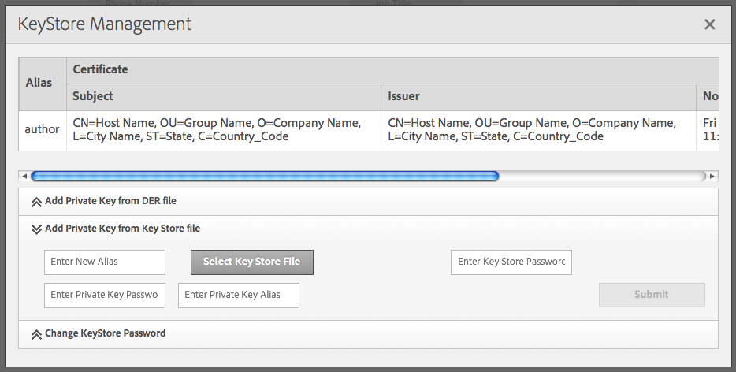

# Repliceren met wederzijdse SSL{#replicating-using-mutual-ssl}

Vorm AEM zodat een replicatieagent op de auteursinstantie wederzijdse SSL (MSSL) gebruikt om met te verbinden publiceert instantie. Gebruikend MSSL, gebruiken de replicatieagent en de dienst van HTTP op de publicatie instantie certificaten om elkaar voor authentiek te verklaren.

Wanneer u MSSL configureert voor replicatie, moet u de volgende stappen uitvoeren:

1. Maak of verkrijg persoonlijke sleutels en certificaten voor de auteur en publiceer instanties.
1. Installeer de sleutels en de certificaten op de auteur en publiceer instanties:

   * Auteur: persoonlijke sleutel van auteur en certificaat publiceren.
   * Publiceren: persoonlijke sleutel en certificaat van auteur publiceren. Het certificaat is gekoppeld aan de gebruikersaccount die is geverifieerd met de replicatieagent.

1. Configureer de op Jetty gebaseerde HTTP-service op de instantie Publish.
1. Vorm het vervoer en SSL eigenschappen van de replicatieagent.


Bepaal welke gebruikersaccount de replicatie uitvoert. Wanneer u het certificaat van de vertrouwde auteur op de publicatie-instantie installeert, is het certificaat gekoppeld aan dit gebruikersaccount.

## Credentials verkrijgen of maken voor MSSL {#obtaining-or-creating-credentials-for-mssl}

U hebt een persoonlijke sleutel en een openbaar certificaat nodig voor de auteur en u publiceert exemplaren:

* Persoonlijke sleutels moeten de indeling PKCS#12 of JKS hebben.
* Certificaten moeten de indeling pkcs#12 of JKS hebben. Bovendien kan het certificaat in formaat &quot;CER&quot;ook aan Granite Truststore worden toegevoegd.
* Certificaten kunnen zelfondertekend of ondertekend zijn door een erkende CA.

### JKS-indeling {#jks-format}

Genereer een persoonlijke sleutel en een certificaat in JKS-indeling. De persoonlijke sleutel wordt opgeslagen in een KeyStore-bestand en het certificaat wordt opgeslagen in een TrustStore-bestand. Gebruiken [Java `keytool`](https://docs.oracle.com/javase/7/docs/technotes/tools/solaris/keytool.html) om beide te maken.

Voer de volgende stappen uit met Java `keytool` om de persoonlijke sleutel en de referentie te maken:

1. Genereer een sleutelpaar private-public in een KeyStore.
1. Het certificaat maken of verkrijgen:

   * Zelfondertekend: het certificaat exporteren vanuit de KeyStore.
   * Met CA-handtekening: Genereer een certificaatverzoek en verzend het naar CA.

1. Importeer het certificaat in een TrustStore.

Gebruik de volgende procedure om een persoonlijke sleutel en een zelfondertekend certificaat te maken voor zowel de auteur als de publicatie. Gebruik dienovereenkomstig verschillende waarden voor bevelopties.

1. Open een opdrachtregelvenster of terminal. Als u het paar openbare sleutels voor een persoonlijke sleutel wilt maken, voert u de volgende opdracht in en gebruikt u de optiewaarden uit de onderstaande tabel:

   ```shell
   keytool -genkeypair -keyalg RSA -validity 3650 -alias alias -keystore keystorename.keystore  -keypass key_password -storepass  store_password -dname "CN=Host Name, OU=Group Name, O=Company Name,L=City Name, S=State, C=Country_ Code"
   ```

   | Optie | Auteur | Publiceren |
   |---|---|---|
   | -alias | auteur | publish |
   | -keystore | author.keystore | publish.keystore |

1. Als u het certificaat wilt exporteren, voert u de volgende opdracht in met behulp van de optiewaarden uit de onderstaande tabel:

   ```shell
   keytool -exportcert -alias alias -file cert_file -storetype jks -keystore keystore -storepass store_password
   ```

   | Optie | Auteur | Publiceren |
   |---|---|---|
   | -alias | auteur | publish |
   | -file | author.cer | publish.cer |
   | -keystore | author.keystore | publish.keystore |

### pkcs#12-indeling {#pkcs-format}

Genereer een persoonlijke sleutel en een certificaat in de pkcs#12-indeling. Gebruiken [openSSL](https://www.openssl.org/) om ze te genereren. Gebruik de volgende procedure om een persoonlijke sleutel en een certificaatverzoek te produceren. Om het certificaat te verkrijgen, ondertekent u het verzoek met uw persoonlijke sleutel (zelfondertekend certificaat) of verzendt u het verzoek naar een CA. Vervolgens genereert u het archief pkcs#12 dat de persoonlijke sleutel en het certificaat bevat.

1. Open een opdrachtregelvenster of terminal. Als u de persoonlijke sleutel wilt maken, voert u de volgende opdracht in met behulp van de optiewaarden uit de onderstaande tabel:

   ```shell
   openssl genrsa -out keyname.key 2048
   ```

   | Optie | Auteur | Publiceren |
   |---|---|---|
   | -out | author.key | publish.key |

1. Als u een certificaataanvraag wilt genereren, voert u de volgende opdracht in met behulp van de optiewaarden uit de onderstaande tabel:

   ```shell
   openssl req -new -key keyname.key -out key_request.csr
   ```

   | Optie | Auteur | Publiceren |
   |---|---|---|
   | -toets | author.key | publish.key |
   | -out | auteur_request.csr | publish_request.csr |

   Onderteken het certificaatverzoek of verzend het verzoek naar CA.

1. Als u het certificaatverzoek wilt ondertekenen, voert u de volgende opdracht in en gebruikt u de optiewaarden uit de onderstaande tabel:

   ```shell
   openssl x509 -req -days 3650 -in key_request.csr -signkey keyname.key -out certificate.cer
   ```

   | Optie | Auteur | Publiceren |
   |---|---|---|
   | -signkey | author.key | publish.key |
   | -in | auteur_request.csr | publish_request.csr |
   | -out | author.cer | publish.cer |

1. Als u uw persoonlijke sleutel en het ondertekende certificaat aan een bestand pkcs#12 wilt toevoegen, voert u de volgende opdracht in met de optiewaarden uit de onderstaande tabel:

   ```shell
   openssl pkcs12 -keypbe PBE-SHA1-3DES -certpbe PBE-SHA1-3DES -export -in certificate.cer -inkey keyname.key -out pkcs12_archive.pfx -name "alias"
   ```

   | Optie | Auteur | Publiceren |
   |---|---|---|
   | -inkey | author.key | publish.key |
   | -out | author.pfx | publish.pfx |
   | -in | author.cer | publish.cer |
   | -name | auteur | publish |

## Privésleutel en TrustStore installeren op auteur {#install-the-private-key-and-truststore-on-author}

Installeer de volgende items op de instantie van de auteur:

* De persoonlijke sleutel van de auteurinstantie.
* Het certificaat van het publicatieexemplaar.

Om de volgende procedure uit te voeren, moet u als beheerder van de auteursinstantie worden het programma geopend.

### De persoonlijke sleutel van de auteur installeren {#install-the-author-private-key}

1. Open de pagina Gebruikersbeheer voor de auteurinstantie. ([http://localhost:4502/libs/granite/security/content/useradmin.html](http://localhost:4502/libs/granite/security/content/useradmin.html))
1. Klik op uw gebruikersnaam om de eigenschappen van uw gebruikersaccount te openen.
1. Als de koppeling Create KeyStore wordt weergegeven in het gedeelte Account Settings, klikt u op de koppeling. Configureer een wachtwoord en klik op OK.
1. Klik in het gedeelte Account Settings op Manage Keystore.

   

1. Klik op Persoonlijke sleutel toevoegen uit sleutelarchiefbestand.

   

1. Klik op het bestand Key Store selecteren, blader naar het bestand maker.keystore of het bestand maker.pfx als u pkcs#12 gebruikt en selecteer dit. Klik vervolgens op Openen.
1. Voer een alias en het wachtwoord voor de sleutelarchief in. Voer de alias en het wachtwoord voor de persoonlijke sleutel in en klik op Verzenden.
1. Sluit het dialoogvenster KeyStore Management.

   

### Het publicatiecertificaat installeren {#install-the-publish-certificate}

1. Open de pagina Gebruikersbeheer voor de auteurinstantie. ([http://localhost:4502/libs/granite/security/content/useradmin.html](http://localhost:4502/libs/granite/security/content/useradmin.html))
1. Klik op uw gebruikersnaam om de eigenschappen van uw gebruikersaccount te openen.
1. Als de koppeling TrustStore maken wordt weergegeven in het gedeelte Accountinstellingen, klikt u op de koppeling, maakt u een wachtwoord voor de TrustStore en klikt u op OK.
1. Klik in het gedeelte Accountinstellingen op Betrouwbaarheidsopslag beheren.
1. Klik op Certificaat toevoegen uit CER-bestand.

   

1. Schakel de optie Certificaat toewijzen aan gebruiker uit. Klik op Certificaatbestand selecteren, selecteer publish.cer en klik op Openen.
1. Sluit het dialoogvenster TrustStore-beheer.

   

## Persoonlijke sleutel en TrustStore installeren bij publicatie {#install-private-key-and-truststore-on-publish}

Installeer de volgende items op de publicatie-instantie:

* De persoonlijke sleutel van de publicatie-instantie.
* Het certificaat van de auteurinstantie. Koppel het certificaat aan de gebruiker die wordt gebruikt om replicatieverzoeken uit te voeren.

Als u de volgende procedure wilt uitvoeren, moet u zijn aangemeld als beheerder van de publicatieinstantie.

### De persoonlijke sleutel voor publiceren installeren {#install-the-publish-private-key}

1. Open de pagina Gebruikersbeheer voor de publicatie-instantie. ([http://localhost:4503/libs/granite/security/content/useradmin.html](http://localhost:4503/libs/granite/security/content/useradmin.html))
1. Klik op uw gebruikersnaam om de eigenschappen van uw gebruikersaccount te openen.
1. Als de koppeling Create KeyStore wordt weergegeven in het gedeelte Account Settings, klikt u op de koppeling. Configureer een wachtwoord en klik op OK.
1. Klik in het gedeelte Account Settings op Manage Keystore.
1. Klik op Persoonlijke sleutel toevoegen uit sleutelarchiefbestand.
1. Klik op het sleutelarchiefbestand selecteren, blader naar het bestand publish.keystore of het bestand publish.pfx als u pkcs#12 gebruikt en selecteer dit. Klik vervolgens op Openen.
1. Voer een alias en het wachtwoord voor de sleutelarchief in. Voer de alias en het wachtwoord voor de persoonlijke sleutel in en klik op Verzenden.
1. Sluit het dialoogvenster KeyStore Management.

### Auteurscertificaat installeren {#install-the-author-certificate}

1. Open de pagina Gebruikersbeheer voor de publicatie-instantie. ([http://localhost:4503/libs/granite/security/content/useradmin.html](http://localhost:4503/libs/granite/security/content/useradmin.html))
1. Als de koppeling TrustStore maken wordt weergegeven in het gebied Global Trust Store, klikt u op de koppeling, maakt u een wachtwoord voor de TrustStore en klikt u op OK.
1. Klik in het gedeelte Accountinstellingen op Betrouwbaarheidsopslag beheren.
1. Klik op Certificaat toevoegen uit CER-bestand.
1. Controleer of de optie Certificaat toewijzen aan gebruiker is geselecteerd. Klik op Certificaatbestand selecteren, selecteer auteur.cer en klik op Openen.
1. Klik op Verzenden en sluit het dialoogvenster TrustStore Management.

## De HTTP-service configureren bij publiceren {#configure-the-http-service-on-publish}

Configureer de eigenschappen van de op Jetty Gebaseerde HTTP-service van Apache Felix op de publicatie-instantie, zodat deze HTTPS gebruikt bij de toegang tot Granite Keystore. De PID van de service is `org.apache.felix.http`.

De volgende lijst maakt een lijst van de eigenschappen OSGi die u moet vormen of u de Console van het Web gebruikt.

| Eigenschapnaam op webconsole | OSGi Eigenschapnaam | Waarde |
|---|---|---|
| HTTPS inschakelen | org.apache.felix.https.enable | true |
| HTTPS inschakelen voor Granite KeyStore | org.apache.felix.https.use.granite.keystore | true |
| HTTPS-poort | org.osgi.service.http.port.secure | 8443 (of andere gewenste poort) |
| Clientcertificaat | org.apache.felix.https.clientcertificate | &quot;Gezocht clientcertificaat&quot; |

## De Replication Agent configureren op auteur {#configure-the-replication-agent-on-author}

Configureer de replicatieagent op de auteurinstantie om het HTTPS-protocol te gebruiken wanneer u verbinding maakt met de publicatieinstantie. Voor volledige informatie over het vormen van replicatieagenten zie [De replicatieagents configureren](/help/sites-deploying/replication.md#configuring-your-replication-agents).

Om MSSL toe te laten, vorm de eigenschappen op het lusje van het Vervoer volgens de volgende lijst:

<table>
 <tbody>
  <tr>
   <th>Eigenschap</th>
   <th>Waarde</th>
  </tr>
  <tr>
   <td>URI</td>
   <td><p>https://server_name:SSL_port/bin/receive?sling:authRequestLogin=1</p> <p>Bijvoorbeeld:</p> <p>http://localhost:8443/bin/receive?sling:authRequestLogin=1</p> </td>
  </tr>
  <tr>
   <td>Gebruiker</td>
   <td>Geen waarde</td>
  </tr>
  <tr>
   <td>Wachtwoord</td>
   <td>Geen waarde</td>
  </tr>
  <tr>
   <td>SSL</td>
   <td>Client Auth</td>
  </tr>
 </tbody>
</table>


Nadat u de replicatieagent vormt, test de verbinding om te bepalen of MSSL correct wordt gevormd.

```xml
29.08.2014 14:02:46 - Create new HttpClient for Default Agent
29.08.2014 14:02:46 - * HTTP Version: 1.1
29.08.2014 14:02:46 - * Using Client Auth SSL configuration *
29.08.2014 14:02:46 - adding header: Action:Test
29.08.2014 14:02:46 - adding header: Path:/content
29.08.2014 14:02:46 - adding header: Handle:/content
29.08.2014 14:02:46 - deserialize content for delivery
29.08.2014 14:02:46 - No message body: Content ReplicationContent.VOID is empty
29.08.2014 14:02:46 - Sending POST request to http://localhost:8443/bin/receive?sling:authRequestLogin=1
29.08.2014 14:02:46 - sent. Response: 200 OK
29.08.2014 14:02:46 - ------------------------------------------------
29.08.2014 14:02:46 - Sending message to localhost:8443
29.08.2014 14:02:46 - >> POST /bin/receive HTTP/1.0
29.08.2014 14:02:46 - >> Action: Test
29.08.2014 14:02:46 - >> Path: /content
29.08.2014 14:02:46 - >> Handle: /content
29.08.2014 14:02:46 - >> Referer: about:blank
29.08.2014 14:02:46 - >> Content-Length: 0
29.08.2014 14:02:46 - >> Content-Type: application/octet-stream
29.08.2014 14:02:46 - --
29.08.2014 14:02:46 - << HTTP/1.1 200 OK
29.08.2014 14:02:46 - << Connection: Keep-Alive
29.08.2014 14:02:46 - << Server: Day-Servlet-Engine/4.1.64
29.08.2014 14:02:46 - << Content-Type: text/plain;charset=utf-8
29.08.2014 14:02:46 - << Content-Length: 26
29.08.2014 14:02:46 - << Date: Fri, 29 Aug 2014 18:02:46 GMT
29.08.2014 14:02:46 - << Set-Cookie: login-token=3529326c-1500-4888-a4a3-93d299726f28%3ac8be86c6-04bb-4d18-80d6-91278e08d720_98797d969258a669%3acrx.default; Path=/; HttpOnly; Secure
29.08.2014 14:02:46 - << Set-Cookie: cq-authoring-mode=CLASSIC; Path=/; Secure
29.08.2014 14:02:46 - <<
29.08.2014 14:02:46 - << R
29.08.2014 14:02:46 - << eplicationAction TEST ok.
29.08.2014 14:02:46 - Message sent.
29.08.2014 14:02:46 - ------------------------------------------------
29.08.2014 14:02:46 - Replication (TEST) of /content successful.
Replication test succeeded
```
