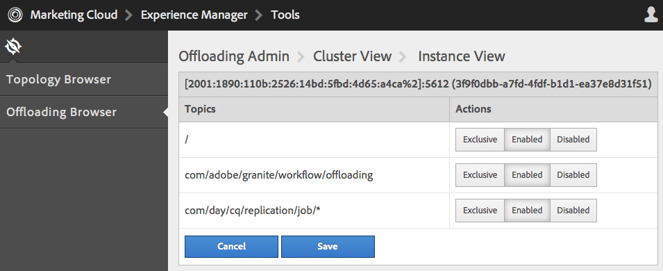
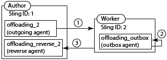

# Taken verschuiven{#offloading-jobs}

## Inleiding {#introduction}

Het ontladen verdeelt verwerkingstaken onder instanties Experience Manager in een topologie. Met offloading kunt u specifieke Experience Manager-instanties gebruiken voor het uitvoeren van specifieke typen verwerking. Met gespecialiseerde verwerking kunt u het gebruik van beschikbare serverbronnen maximaliseren.

Offloaden is gebaseerd op de functies [Apache Sling Discovery](https://sling.apache.org/documentation/bundles/discovery-api-and-impl.html) en Sling JobManager. Om het ontladen te gebruiken, voegt u de clusters van Experience Manager aan een topologie toe en identificeert de baanonderwerpen die het clusterproces. Clusters bestaan uit een of meer Experience Manager-instanties, zodat één instantie als een cluster wordt beschouwd.

Voor informatie over het toevoegen van instanties aan een topologie, zie [het Beheer Topologieën](/help/sites-deploying/offloading.md#administering-topologies).

### Taakverdeling {#job-distribution}

Sling JobManager en JobConsumer laten de verwezenlijking van banen toe die in een topologie worden verwerkt:

* JobManager: De dienst die banen voor specifieke onderwerpen leidt.
* JobConsumer: De dienst die banen van één of meerdere onderwerpen uitvoert. De veelvoudige diensten JobConsumer kunnen voor het zelfde onderwerp worden geregistreerd.

Wanneer JobManager een taak maakt, selecteert het Offloading-framework een Experience Manager-cluster in de topologie om de taak uit te voeren:

* De cluster moet één of meerdere instanties omvatten die een JobConsumer in werking stellen die voor het baanonderwerp wordt geregistreerd.
* Het onderwerp moet voor minstens één geval in de cluster worden toegelaten.

Zie [het Vormen de Consumptie](/help/sites-deploying/offloading.md#configuring-topic-consumption) van het Onderwerp voor informatie over het raffineren van baandistributie.

Wanneer het Offloading-framework een cluster selecteert om een taak uit te voeren en de cluster uit meerdere instanties bestaat, bepaalt Sling Distribution welke instantie in de cluster de taak uitvoert.

### Job Payloads {#job-payloads}

Het offloading-framework ondersteunt taaktaken die taken koppelen aan bronnen in de opslagplaats. Taaktaken zijn handig wanneer taken worden gemaakt voor de verwerking van bronnen en de taak wordt overgeladen naar een andere computer.

Bij het maken van een taak wordt de lading alleen gegarandeerd geplaatst op het exemplaar dat de taak maakt. Wanneer het ontladen van de baan, zorgen de replicatieagenten ervoor dat de lading op de instantie wordt gecreeerd die uiteindelijk de baan verbruikt. Wanneer de uitvoering van de taak is voltooid, zorgt omgekeerde replicatie ervoor dat de payload wordt gekopieerd naar de instantie die de taak heeft gemaakt.

## Onderwerptechnologieën beheren {#administering-topologies}

De topologieën zijn losjes-verbonden Experience Manager clusters die aan het ontladen deelnemen. Een cluster bestaat uit een of meer Experience Manager-serverinstanties (één instantie wordt als een cluster beschouwd).

Elke Experience Manager-instantie voert de volgende offloading-gerelateerde services uit:

* Detectieservice: Verzendt verzoeken naar een Schakelaar van de Topologie om zich bij de topologie aan te sluiten.
* Topology Connector: Ontvangt om zich bij verzoeken aan te sluiten en of keurt goed of weigert elk verzoek.

De dienst van de Ontdekking van alle leden van de topologie richt aan de Schakelaar van de Topologie op één van de leden. In de volgende secties wordt dit lid het hoofdlid genoemd.

Elke cluster in de topologie bevat een instantie die als leider wordt erkend. De clusterleider communiceert met de topologie namens de andere leden van de cluster. Wanneer de leader de cluster verlaat, wordt automatisch een nieuwe leader voor de cluster gekozen.

### De topologie weergeven {#viewing-the-topology}

Browser van de Topologie van het gebruik om de staat van de topologie te onderzoeken waarin de instantie van Experience Manager deelneemt. Browser van de topologie toont de clusters en de instanties van de topologie.

Voor elke cluster, ziet u een lijst van clusterleden die op de orde wijst waarin elk lid zich bij de cluster aansloot, en welk lid de Leider is. De eigenschap Current geeft de instantie aan die u momenteel beheert.

Voor elke instantie in de cluster, kunt u verscheidene op topologie betrekking hebbende eigenschappen zien:

* Een lijst met onderwerpen toestaan voor de professionele gebruiker van de instantie.
* De eindpunten die voor het verbinden met de topologie worden blootgesteld.
* De taakonderwerpen waarvoor de instantie is geregistreerd voor offloaden.
* De taakonderwerpen die de instantie verwerkt.

1. Klik met de aanraakinterface op het tabblad Gereedschappen. ([http://localhost:4502/tools.html](http://localhost:4502/tools.html))
1. Klik in het gebied Bewerkingen graniet op Browser offloaden.
1. Klik in het navigatievenster op Topologiebrowser.

   De clusters die aan de topologie deelnemen verschijnen.

   

1. Klik op een cluster om een lijst weer te geven met de instanties in de cluster en hun id, huidige status en leaderstatus.
1. Klik op een instantie-id voor meer gedetailleerde eigenschappen.

U kunt de Console van het Web ook gebruiken om topologieinformatie te bekijken. De console verstrekt verdere informatie over de topologieclusters:

* Welke instantie is de lokale instantie.
* De diensten van de Verbinding van de Topologie die deze instantie gebruikt om met de topologie (uitgaande), en de diensten te verbinden die met deze (inkomende) instantie verbinden.
* De geschiedenis van de verandering voor de topologie en instantiereigenschappen.

Gebruik de volgende procedure om de pagina van het Beheer van de Topologie van de Console van het Web te openen:

1. Open de webconsole in uw browser. ([http://localhost:4502/system/console](http://localhost:4502/system/console))
1. Klik op Hoofd > Topologiebeheer.

   

### Het vormen Lidmaatschap van de Topologie {#configuring-topology-membership}

De Apache Sling Resource-Based Dienst van de Ontdekking stelt op elke instantie in werking om te controleren hoe de instanties van Experience Manager met een topologie interactie aangaan.

De dienst van de Ontdekking verzendt periodieke POST- verzoeken (hartslagen) naar de diensten van de Verbinding van de Topologie om verbindingen met de topologie te vestigen en te handhaven. De dienst van de Verbinding van de Topologie handhaaft een toegestane lijst van IP adressen of gastheernamen die zich bij de topologie mogen aansluiten:

* Om zich bij een instantie aan een topologie aan te sluiten, specificeer URL van de dienst van de Verbinding van de Topologie van het wortellid.
* Om een instantie toe te laten om zich bij een topologie aan te sluiten, voeg de instantie aan toe staat lijst van de dienst van de Verbinding van de Topologie van het wortellid toe.

Gebruik de console van het Web of een sling:knoop OsgiConfig om de volgende eigenschappen van de dienst te vormen org.apache.sling.discovery.impt.Config:

<table>
 <tbody>
  <tr>
   <th>Eigenschapnaam</th>
   <th>OSGi-naam</th>
   <th>Beschrijving</th>
   <th>Standaardwaarde</th>
  </tr>
  <tr>
   <td>Time-out hartslag (seconden)</td>
   <td>hartslagTimeout</td>
   <td>De hoeveelheid tijd in seconden die moet worden gewacht op een hartslagreactie voordat de doelinstantie als niet beschikbaar wordt beschouwd. </td>
   <td>20</td>
  </tr>
  <tr>
   <td>Hartslaginterval (seconden)</td>
   <td>hartslagInterval</td>
   <td>De hoeveelheid tijd in seconden tussen hartslagen.</td>
   <td>15</td>
  </tr>
  <tr>
   <td>Minimale vertraging bij gebeurtenissen (seconden)</td>
   <td>minEventDelay</td>
   <td>
Wanneer een verandering in de topologie voorkomt, de hoeveelheid tijd om de verandering van staat van TOPOLOGY_CHANGING in TOPOLOGY_CHANGED te vertragen. Elke verandering die voorkomt wanneer de staat TOPOLOGY_CHANGING is verhoogt de vertraging met deze hoeveelheid tijd.
 
Hierdoor wordt voorkomen dat listeners overlopen door gebeurtenissen. 
 
Als u geen vertraging wilt gebruiken, geeft u 0 of een negatief getal op.
 </td>
   <td>3</td>
  </tr>
  <tr>
   <td>Topology Connector-URL's</td>
   <td>topologieConnectorUrls</td>
   <td>De URLs van de Diensten van de Verbinding van de Topologie om hartslagberichten te verzenden.</td>
   <td>http://localhost:4502/libs/sling/topology/connector</td>
  </tr>
  <tr>
   <td>Lijst toestaan voor topologieconnector</td>
   <td>topologieConnectorWhitelist</td>
   <td>De lijst van IP adressen of gastheernamen die de lokale dienst van de Verbinding van de Topologie in de topologie toestaat. </td>
   <td>
localhost
 
127.0.0.1
 </td>
  </tr>
  <tr>
   <td>Naam beschrijving opslagplaats</td>
   <td>leaderSelectionRepositoryDescriptor</td>
   <td> </td>
   <td>&lt;geen waarde&gt;</td>
  </tr>
 </tbody>
</table>

Gebruik de volgende procedure om een instantie CQ met het wortellid van een topologie te verbinden. De procedure richt de instantie aan de Schakelaar URL van de Topologie van het lid van de worteltopologie. Voer deze procedure op alle leden van de topologie uit.

1. Open de webconsole in uw browser. ([http://localhost:4502/system/console](http://localhost:4502/system/console))
1. Klik op Hoofd > Topologiebeheer.
1. Klik op Discovery Service configureren.
1. Voeg een punt aan het bezit van de Verbinding URLs van de Topologie toe, en specificeer URL van de dienst van de Verbinding van de Topologie van het lid van de worteltopologie. De URL heeft de notatie https://rootservername:4502/libs/sling/topology/connector.

Voer de volgende procedure op het wortellid van de topologie uit. De procedure voegt de namen van de andere topologieleden aan zijn Dienst van de Ontdekking toe staat lijst toe.

1. Open de webconsole in uw browser. ([http://localhost:4502/system/console](http://localhost:4502/system/console))
1. Klik op Hoofd > Topologiebeheer.
1. Klik op Discovery Service configureren.
1. Voor elk lid van de topologie, voeg een punt aan de Schakelaar van de Topologie toe staat lijsteigenschap toe, en specificeer de gastheernaam of IP adres van het topologielid.

## Het vormen onderwerpconsumptie {#configuring-topic-consumption}

Gebruik het Offloaden Browser om onderwerpconsumptie voor de instanties van Experience Manager in de topologie te vormen. Voor elke instantie, kunt u de onderwerpen specificeren die het gebruikt. Bijvoorbeeld, om uw topologie te vormen zodat slechts één instantie onderwerpen van een specifiek type verbruikt, maak het onderwerp op alle instanties behalve één onbruikbaar.

De taken worden verdeeld onder instanties die het bijbehorende die onderwerp hebben door middel van round-robin logica wordt toegelaten.

1. Klik met de aanraakinterface op het tabblad Gereedschappen. ([http://localhost:4502/tools.html](http://localhost:4502/tools.html))
1. Klik in het gebied Bewerkingen graniet op Browser offloaden.
1. Klik in het navigatievenster op Browser verschuiven.

   De offloading onderwerpen en de serverinstanties die de onderwerpen kunnen verbruiken verschijnen.

   

1. Om de consumptie van een onderwerp voor een instantie onbruikbaar te maken, onder de onderwerpnaam klik onbruikbaar maken naast de instantie.
1. Om al onderwerpconsumptie voor een instantie te vormen, klik het instantieherkenningsteken onder om het even welk onderwerp.

   

1. Klik één van de volgende knopen naast een onderwerp om het verbruiksgedrag voor de instantie te vormen, en dan sparen te klikken:

   * Ingeschakeld: Dit exemplaar verbruikt banen van dit onderwerp.
   * Uitgeschakeld: Dit exemplaar verbruikt geen banen van dit onderwerp.
   * Exclusief: Dit exemplaar verbruikt slechts banen van dit onderwerp.
   **Opmerking:** Wanneer u Uitsluitend voor een onderwerp selecteert, worden alle andere onderwerpen automatisch geplaatst aan Gehandicapten.

### Geïnstalleerde taakgebruikers {#installed-job-consumers}

Verschillende JobConsumer-implementaties worden geïnstalleerd met Experience Manager. De onderwerpen waarvoor deze JobConsumers worden geregistreerd verschijnen in het Offloaden Browser. De extra onderwerpen die verschijnen zijn die die douaneJobConsumers hebben geregistreerd. In de volgende tabel wordt de standaard JobConsumers beschreven.

| Taakonderwerp | Service PID | Beschrijving |
|---|---|---|
| / | org.apache.sling.event.impl.jobs.deprecated.EventAdminBridge | Geïnstalleerd met Apache Sling. Verwerkt banen die OSGi gebeurtenisadmin, voor achterwaartse verenigbaarheid produceert. |
| com/day/cq/replication/job/&amp;ast; | com.day.cq.replication.impl.AgentManagerImpl | Een replicatieagent die taakladingen herhaalt. |
| com/adobe/granite/workflow/offloading | com.adobe.granite.workflow.core.offloading.WorkflowOffloadingJobConsumer | Verwerkt taken die door de workflow van DAM Update Asset Offloader worden gegenereerd. |

### Onderwerpen voor een instantie uitschakelen en inschakelen {#disabling-and-enabling-topics-for-an-instance}

De service Apache Sling Job Consumer Manager biedt een onderwerp waarin lijst- en bloklijsteigenschappen zijn toegestaan. Vorm deze eigenschappen om de verwerking van specifieke onderwerpen op een instantie van Experience Manager toe te laten of onbruikbaar te maken.

**Opmerking:** Als de instantie tot een topologie behoort, kunt u het Offloaden Browser op om het even welke computer in de topologie ook gebruiken om onderwerpen toe te laten of onbruikbaar te maken.

De logica die tot de lijst van toegelaten onderwerpen leidt staat eerst alle onderwerpen toe die in toestaan lijst zijn, en verwijdert dan onderwerpen die op de bloklijst zijn. Standaard zijn alle onderwerpen ingeschakeld (de waarde in de lijst met toegestane onderwerpen is `*`) en zijn geen onderwerpen uitgeschakeld (de lijst met blokken heeft geen waarde).

Gebruik de Console of een `sling:OsgiConfig` knoop van het Web om de volgende eigenschappen te vormen. Voor `sling:OsgiConfig` knooppunten is org.apache.sling.event.impl.jobs.JobConsumerManager de PID van de service Job Consumer Manager.

| Eigenschapnaam in webconsole | OSGi-id | Beschrijving |
|---|---|---|
| Lijst met toegestane onderwerpen | job.consumermanager.whitelist | Een lijst met onderwerpen die de lokale dienst JobManager verwerkt. De standaardwaarde van &amp;ast; veroorzaakt alle onderwerpen om naar de geregistreerde dienst te worden verzonden TopicConsumer. |
| Lijst met onderwerpblokken | job.consumermanager.blacklist | Een lijst met onderwerpen die de lokale JobManager-service niet verwerkt. |

## Replication-agents voor offloaden maken {#creating-replication-agents-for-offloading}

Het offloading-framework gebruikt replicatie om bronnen tussen auteur en worker te vervoeren. Het het ontladen kader leidt automatisch tot replicatieagenten wanneer de instanties zich bij de topologie aansluiten. De agenten worden gecreeerd met standaardwaarden. U moet het wachtwoord manueel veranderen dat de agenten voor authentificatie gebruiken.

>[!CAUTION]
>
>Een bekende kwestie met de automatisch-geproduceerde replicatieagenten vereist u om nieuwe replicatieagenten manueel tot stand te brengen. Volg de procedure in [Problemen die de Automatisch Gegenereerde Agenten](/help/sites-deploying/offloading.md#problems-using-the-automatically-generated-replication-agents) van de Replicatie gebruiken alvorens u de agenten voor het Offloaden creeert.

Creeer de replicatieagenten die baanlading tussen instanties voor het ontladen vervoeren. De volgende illustratie toont de agenten die worden vereist om van de auteur aan een arbeidersinstantie te offloaden. De auteur heeft een Sling-id van 1 en de arbeidersinstantie heeft een Sling-id van 2:

Deze opstelling vereist de volgende drie agenten:

1. Een uitgaande agent op de auteurinstantie die aan de arbeidersinstantie herhaalt.
1. Een reverse agent op de auteurinstantie die vanaf outbox op de arbeidersinstantie trekt.
1. Een outbox agent op de arbeidersinstantie.

Dit replicatieschema is vergelijkbaar met het replicatieschema dat wordt gebruikt tussen auteur- en publicatieinstanties. Voor de ontladingssituatie zijn alle betrokken gevallen echter ontwerpgevallen.

>[!NOTE]
>
>Het kader van het Verschuiven gebruikt de topologie om de IP adressen van de het ontladen instanties te verkrijgen. Het kader leidt dan automatisch tot de replicatieagenten die op deze IP adressen worden gebaseerd. Als de IP adressen van de het ontladen instanties later veranderen, wordt de verandering automatisch verspreid op de topologie nadat de instantie opnieuw begint. Nochtans, werkt het Offloading kader niet automatisch de replicatieagenten bij om op de nieuwe IP adressen te wijzen. Om deze situatie te vermijden, gebruik vaste IP adressen voor alle instanties in de topologie.

### De replicatieagents benoemen voor offloaden {#naming-the-replication-agents-for-offloading}

Gebruik een specifiek formaat voor het bezit van de ***Naam*** van de replicatieagenten zodat het het ontladen kader automatisch de correcte agent voor specifieke arbeidersinstanties gebruikt.

**De naam van de uitgaande agent op de auteurinstantie:**

`offloading_<slingid>`, waarbij `<slingid>` de id Verdelen van de arbeidersinstantie is.

Voorbeeld: `offloading_f5c8494a-4220-49b8-b079-360a72f71559`

**De reverse-agent een naam geven op de auteurinstantie:**

`offloading_reverse_<slingid>`, waarbij `<slingid>` de id Verdelen van de arbeidersinstantie is.

Voorbeeld: `offloading_reverse_f5c8494a-4220-49b8-b079-360a72f71559`

**De naam van het uitvoervak in de worker-instantie:**

`offloading_outbox`

### Het creëren van de uitgaande agent {#creating-the-outgoing-agent}

1. Creeer een Agent **van de** Replicatie op auteur. (Zie de [documentatie voor replicatieagenten](/help/sites-deploying/replication.md)). Geef een **titel** op. De **naam** moet de naamgevingsconventie volgen.
1. Creeer de agent gebruikend de volgende eigenschappen:

   | Eigenschap | Waarde |
   |---|---|
   | Instellingen > Type serienummering | Standaard |
   | Transport > Transport URI | https://*`<ip of target instance>`*:*`<port>`*`/bin/receive?sling:authRequestLogin=1` |
   | Transport > Transport-gebruiker | Replicatiegebruiker op doelinstantie |
   | Transport > Transport Password | Replicatiewachtwoord voor doelinstantie |
   | Uitgebreid > HTTP-methode | POST |
   | Triggers > Standaard negeren | Waar |

### De reverse agent maken {#creating-the-reverse-agent}

1. Maak een **reverse Replication Agent** bij de auteur. (Zie de [documentatie voor replicatieagenten](/help/sites-deploying/replication.md).) Geef een **titel** op. De **naam** moet de naamgevingsconventie volgen.
1. Creeer de agent gebruikend de volgende eigenschappen:

   | Eigenschap | Waarde |
   |---|---|
   | Instellingen > Type serienummering | Standaard |
   | Transport > Transport URI | https://*`<ip of target instance>`*:*`<port>`*`/bin/receive?sling:authRequestLogin=1` |
   | Transport > Transport-gebruiker | Replicatiegebruiker op doelinstantie |
   | Transport > Transport Password | Replicatiewachtwoord voor doelinstantie |
   | Uitgebreid > HTTP-methode | GET |

### Het creëren van de outbox agent {#creating-the-outbox-agent}

1. Creeer een Agent **van de** Replicatie op de arbeidersinstantie. (Zie de [documentatie voor replicatieagenten](/help/sites-deploying/replication.md).) Geef een **titel** op. De **naam** moet `offloading_outbox`zijn.
1. Creeer de agent gebruikend de volgende eigenschappen.

   | Eigenschap | Waarde |
   |---|---|
   | Instellingen > Type serienummering | Standaard |
   | Transport > Transport URI | repo://var/replication/outbox |
   | Trigger > Standaard negeren | Waar |

### De verkoper-id zoeken {#finding-the-sling-id}

Verkrijg identiteitskaart van het Verkopen van een instantie van Experience Manager gebruikend één van beide volgende methodes:

* Open de Console van het Web en, in de het Verdelen Montages, vind de waarde van het het Verdelen bezit van identiteitskaart ([http://localhost:4502/system/console/status-slingsettings](http://localhost:4502/system/console/status-slingsettings)). Deze methode is nuttig als de instantie nog geen deel van de topologie uitmaakt.
* Gebruik browser van de Topologie als de instantie reeds deel van de topologie uitmaakt.

## De verwerking van DAM-activa verschuiven {#offloading-the-processing-of-dam-assets}

Vorm de instanties van een topologie zodat de specifieke instanties de achtergrondverwerking van activa uitvoeren die in DAM worden toegevoegd of bijgewerkt.

Standaard voert Experience Manager de [!UICONTROL DAM Update Asset] workflow uit wanneer een DAM-element wordt gewijzigd of een DAM-element wordt toegevoegd. Wijzig het standaardgedrag zodat Experience Manager de [!UICONTROL DAM Update Asset Offloader] workflow uitvoert. Deze workflow genereert een JobManager-taak met een onderwerp `com/adobe/granite/workflow/offloading`. Dan, vorm de topologie zodat de baan aan een specifieke worker wordt geoffload.

>[!CAUTION]
>
>Er mag geen tijdelijke workflow worden gebruikt bij het offloaden van de workflow. De [!UICONTROL DAM Update Asset] workflow mag bijvoorbeeld niet van voorbijgaande aard zijn wanneer deze wordt gebruikt voor het offloaden van elementen. Zie [Tijdelijke workflows](/help/assets/performance-tuning-guidelines.md#workflows)voor informatie over het instellen/ongedaan maken van de overgangsmarkering voor een workflow.

De volgende procedure veronderstelt de volgende kenmerken voor de het ontladen topologie:

* Een of meer Experience Manager-instanties zijn ontwerpinstanties waarmee gebruikers werken bij het toevoegen of bijwerken van DAM-elementen.
* Gebruikers kunnen niet rechtstreeks communiceren met een of meer Experience Manager-instanties die de DAM-middelen verwerken. Deze instanties zijn gewijd aan de achtergrondverwerking van DAM-middelen.

1. Voor elke instantie van Experience Manager, vorm de Dienst van de Ontdekking zodat het aan de schakelaar van de wortelTopografie richt. (Zie [het Vormen Lidmaatschap](#title4)van Topologie.)
1. Vorm de schakelaar van de wortelTopografie zodat de verbindende instanties op toestaan lijst zijn.
1. Open de Offloading Browser en maak het `com/adobe/granite/workflow/offloading` onderwerp op de instanties onbruikbaar waarmee de gebruikers om activa te uploaden of te veranderen DAM met elkaar in wisselwerking staan.

   

1. Bij elke instantie waarmee gebruikers communiceren om DAM-elementen te uploaden of te wijzigen, configureert u de draagkrachtstarters voor de workflow zo dat deze de [!UICONTROL DAM Update Asset Offloading] workflow gebruiken:

   1. Open de Workflowconsole.
   1. Klik op het tabblad Launcher.
   1. Zoek de twee opstartconfiguraties die de [!UICONTROL DAM Update Asset] workflow uitvoeren. Één type van de de gebeurtenisgebeurtenis van de lanceringsconfiguratie is Gemaakt Knoop, en het andere type is Gewijzigde Knoop.
   1. Wijzig beide gebeurtenistypen, zodat deze de [!UICONTROL DAM Update Asset Offloading] werkstroom uitvoeren. (Zie Workflows [starten wanneer knooppunten worden gewijzigd](/help/sites-administering/workflows-starting.md)voor informatie over startconfiguraties.)

1. Schakel in de gevallen waarin de achtergrondverwerking van DAM-elementen wordt uitgevoerd de werkstroomstartprogramma&#39;s uit die de [!UICONTROL DAM Update Asset] werkstroom uitvoeren.

## Meer informatie {#further-reading}

Naast de details op deze pagina kunt u ook het volgende lezen:

* Voor informatie over het gebruiken van Java APIs om banen en baanconsumenten tot stand te brengen, zie het [Creëren en het Verbruiken van Banen voor het Offloaden](/help/sites-developing/dev-offloading.md).
