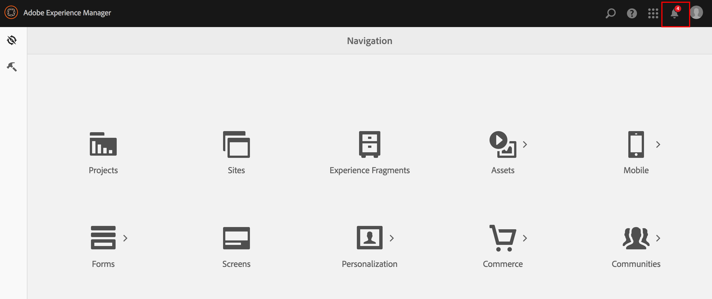

# Opteren in verzameling van samengevoegde verbruiksstatistieken{#opting-into-aggregated-usage-statistics-collection}

## Inleiding {#introduction}

U kunt Adobe Experience Cloud helpen verbeteren door Adobe statistieken over hoe u met Adobe Experience Manager (AEM) wisselt te verzenden. Deze informatie bevat geen gegevens over de sitebezoekers van uw bedrijf en wordt alleen gebruikt om de Adobe te helpen uw gebruikerservaring te leveren, te ondersteunen en te verbeteren.

U kunt in de inzameling van gebruiksstatistieken door of Touch UI of de Console van het Web te gebruiken kiezen.

>[!NOTE]
>
>Er zijn verschillende regels inzake gegevensbescherming en privacy, waaronder bijvoorbeeld de GDPR en de CCPA. AEM Sites is klaar om klanten te helpen met hun verplichtingen op het gebied van gegevensbescherming en privacy. Deze pagina begeleidt klanten door de procedures aan opt-in (of uit) van de Geaggregeerde Verzameling van de Statistieken van het Gebruik.
>
>Zie voor meer informatie ook de [Privacy Center van Adobe](https://www.adobe.com/privacy.html).

>[!NOTE]
>
>U kunt op elk gewenst moment de optie Weigeren kiezen met de optie [Webconsole](/help/sites-deploying/opt-in-aggregated-usage-statistics.md#opt-in-by-using-the-web-console) of door de optie "opt-in" niet te selecteren op het AEM aanmeldingsscherm.

## Inschakelen via de aanraakinterface {#opt-in-by-using-the-touch-ui}

De eerste keer dat u AEM start, kunt u zich aanmelden via de aanraakinterface:

1. Klik in het scherm AEM navigatie op de knop **Inbox** (bel) pictogram.

   

1. Klik in de vervolgkeuzelijst op "**Verzamelde verzameling van verbruiksstatistieken inschakelen**".

   

1. Selecteer "**Verzamelen van statistische gegevens over geaggregeerd gebruik toestaan**".

   

1. Klik op ‘**Gereed**".

## Aanmelden met de webconsole {#opt-in-by-using-the-web-console}

U kunt als volgt de optie Aanmelden (of Weigeren) gebruiken met de webconsole:

1. Klik in het scherm AEM navigatie op **Gereedschappen** en vervolgens **Bewerkingen**.

   

1. Klik in het venster Bewerkingen op **Webconsole**.

   

1. Zoeken naar "**Samengevoegde verzameling verbruiksstatistieken**".
1. Klik op de knop **Bewerken** pictogram.

   

1. Selecteer de **Ingeschakeld** selectievakje. U kunt ook het selectievakje uitschakelen als u de verzameling van verbruiksstatistieken wilt uitschakelen.

   

1. Klikken **Opslaan**.
