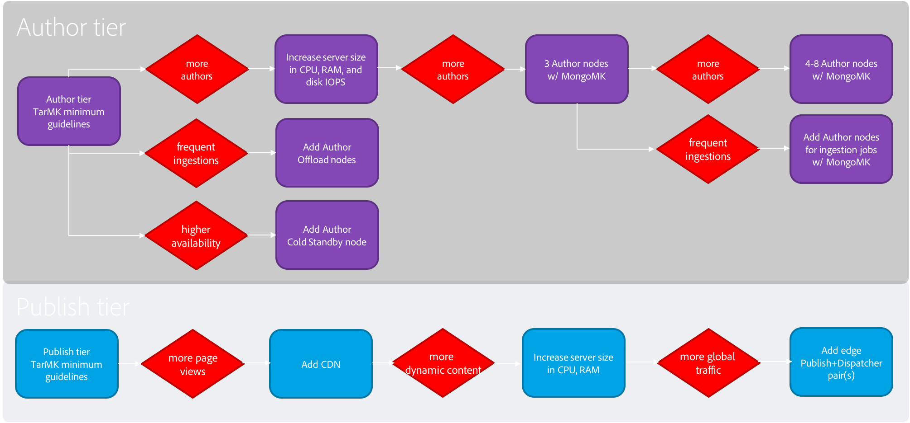

# Richtlijnen voor prestaties{#performance-guidelines}

Deze pagina biedt algemene richtlijnen voor het optimaliseren van de prestaties van uw AEM-implementatie. Als u nog niet eerder hebt AEM, bekijkt u eerst de volgende pagina&#39;s voordat u de prestatierichtlijnen gaat lezen:

* [Basisconcepten AEM](/help/sites-deploying/deploy.md#basic-concepts)
* [Overzicht van opslag in AEM](/help/sites-deploying/storage-elements-in-aem-6.md#overview-of-storage-in-aem)
* [Aanbevolen implementaties](/help/sites-deploying/recommended-deploys.md)
* [Technische vereisten](/help/sites-deploying/technical-requirements.md)

Hieronder ziet u de implementatieopties die beschikbaar zijn voor AEM (schuiven om alle opties weer te geven):

<table>
 <tbody>
  <tr>
   <td>
<strong>AEM</strong>
 
<strong>Product</strong>
 </td>
   <td>
<strong>Topologie</strong>
 </td>
   <td>
<strong>Besturingssysteem</strong>
 </td>
   <td>
<strong>Toepassingsserver</strong>
 </td>
   <td>
<strong>JRE</strong>
 </td>
   <td>
<strong>Beveiliging</strong>
 </td>
   <td>
<strong>Micro Kernel</strong>
 </td>
   <td>
<strong>Datastore</strong>
 </td>
   <td>
<strong>Indexeren</strong>
 </td>
   <td>
<strong>Webserver</strong>
 </td>
   <td>
<strong>Browser</strong>
 </td>
   <td>
<strong>Experience Cloud</strong>
 </td>
  </tr>
  <tr>
   <td>
Sites
 </td>
   <td>
Niet-HA
 </td>
   <td>
Windows
 </td>
   <td>
CQSE
 </td>
   <td>
Oracle
 </td>
   <td>
LDAP
 </td>
   <td>
Tar
 </td>
   <td>
Segment
 </td>
   <td>
Eigenschap
 </td>
   <td>
Apache
 </td>
   <td>
Edge
 </td>
   <td>
Doel
 </td>
  </tr>
  <tr>
   <td>
Assets
 </td>
   <td>
Publish-HA
 </td>
   <td>
Solaris™
 </td>
   <td>
WebLogic
 </td>
   <td>
IBM®
 </td>
   <td>
SAML
 </td>
   <td>
MongoDB
 </td>
   <td>
Bestand
 </td>
   <td>
Lucene
 </td>
   <td>
IIS
 </td>
   <td>
IE
 </td>
   <td>
Analyse
 </td>
  </tr>
  <tr>
   <td>
Gemeenschappen
 </td>
   <td>
Auteur-CS
 </td>
   <td>
Rode hoed®
 </td>
   <td>
WebSphere®
 </td>
   <td>
HP
 </td>
   <td>
Oauth
 </td>
   <td>
RDB/Oracle
 </td>
   <td>
S3/Azure
 </td>
   <td>
Solr
 </td>
   <td>
iPlanet
 </td>
   <td>
FireFox
 </td>
   <td>
Campagne
 </td>
  </tr>
  <tr>
   <td>
Forms
 </td>
   <td>
Auteur-offload
 </td>
   <td>
HP-UX
 </td>
   <td>
Tomcat
 </td>
   <td>
 
 </td>
   <td>
 
 </td>
   <td>
RDB/DB2
 </td>
   <td>
MongoDB
 </td>
   <td>
 
 </td>
   <td>
 
 </td>
   <td>
Chrome
 </td>
   <td>
Sociaal
 </td>
  </tr>
  <tr>
   <td>
Mobiel
 </td>
   <td>
Auteur-cluster
 </td>
   <td>
IBM® AIX®
 </td>
   <td>
JBoss®
 </td>
   <td>
 
 </td>
   <td>
 
 </td>
   <td>
RDB/MySQL
 </td>
   <td>
RDBMS
 </td>
   <td>
 
 </td>
   <td>
 
 </td>
   <td>
Safari
 </td>
   <td>
Publiek
 </td>
  </tr>
  <tr>
   <td>
Meerdere sites
 </td>
   <td>
ASRP
 </td>
   <td>
SUSE®
 </td>
   <td>
 
 </td>
   <td>
 
 </td>
   <td>
 
 </td>
   <td>
RDB/SQLServer
 </td>
   <td>
 
 </td>
   <td>
 
 </td>
   <td>
 
 </td>
   <td>
 
 </td>
   <td>
Assets
 </td>
  </tr>
  <tr>
   <td>
Commerce
 </td>
   <td>
MSRP
 </td>
   <td>
APPLE OS
 </td>
   <td>
 
 </td>
   <td>
 
 </td>
   <td>
 
 </td>
   <td>
 
 </td>
   <td>
 
 </td>
   <td>
 
 </td>
   <td>
 
 </td>
   <td>
 
 </td>
   <td>
Activering
 </td>
  </tr>
  <tr>
   <td>
Dynamic Media
 </td>
   <td>
JSRP
 </td>
   <td>
 
 </td>
   <td>
 
 </td>
   <td>
 
 </td>
   <td>
 
 </td>
   <td>
 
 </td>
   <td>
 
 </td>
   <td>
 
 </td>
   <td>
 
 </td>
   <td>
 
 </td>
   <td>
Mobiel
 </td>
  </tr>
  <tr>
   <td>
Brand Portal
 </td>
   <td>
J2E
 </td>
   <td>
 
 </td>
   <td>
 
 </td>
   <td>
 
 </td>
   <td>
 
 </td>
   <td>
 
 </td>
   <td>
 
 </td>
   <td>
 
 </td>
   <td>
 
 </td>
   <td>
 
 </td>
   <td>
 
 </td>
  </tr>
  <tr>
   <td>
AoD
 </td>
   <td>
 
 </td>
   <td>
 
 </td>
   <td>
 
 </td>
   <td>
 
 </td>
   <td>
 
 </td>
   <td>
 
 </td>
   <td>
 
 </td>
   <td>
 
 </td>
   <td>
 
 </td>
   <td>
 
 </td>
   <td>
 
 </td>
  </tr>
  <tr>
   <td>
LiveFyre
 </td>
   <td>
 
 </td>
   <td>
 
 </td>
   <td>
 
 </td>
   <td>
 
 </td>
   <td>
 
 </td>
   <td>
 
 </td>
   <td>
 
 </td>
   <td>
 
 </td>
   <td>
 
 </td>
   <td>
 
 </td>
   <td>
 
 </td>
  </tr>
  <tr>
   <td>
Screens
 </td>
   <td>
 
 </td>
   <td>
 
 </td>
   <td>
 
 </td>
   <td>
 
 </td>
   <td>
 
 </td>
   <td>
 
 </td>
   <td>
 
 </td>
   <td>
 
 </td>
   <td>
 
 </td>
   <td>
 
 </td>
   <td>
 
 </td>
  </tr>
  <tr>
   <td>
Documentbeveiliging
 </td>
   <td>
 
 </td>
   <td>
 
 </td>
   <td>
 
 </td>
   <td>
 
 </td>
   <td>
 
 </td>
   <td>
 
 </td>
   <td>
 
 </td>
   <td>
 
 </td>
   <td>
 
 </td>
   <td>
 
 </td>
   <td>
 
 </td>
  </tr>
  <tr>
   <td>
Procesbeheer
 </td>
   <td>
 
 </td>
   <td>
 
 </td>
   <td>
 
 </td>
   <td>
 
 </td>
   <td>
 
 </td>
   <td>
 
 </td>
   <td>
 
 </td>
   <td>
 
 </td>
   <td>
 
 </td>
   <td>
 
 </td>
   <td>
 
 </td>
  </tr>
  <tr>
   <td>
bureaubladtoepassing
 </td>
   <td>
 
 </td>
   <td>
 
 </td>
   <td>
 
 </td>
   <td>
 
 </td>
   <td>
 
 </td>
   <td>
 
 </td>
   <td>
 
 </td>
   <td>
 
 </td>
   <td>
 
 </td>
   <td>
 
 </td>
   <td>
 
 </td>
  </tr>
 </tbody>
</table>

>[!NOTE]
>
>De prestatierichtsnoeren zijn voornamelijk van toepassing op AEM Sites.

## Wanneer moeten de prestatierichtlijnen worden gebruikt? {#when-to-use-the-performance-guidelines}

Gebruik de prestatierichtlijnen in de volgende situaties:

* **Eerste plaatsing**: Wanneer het van plan zijn om AEM Sites of Assets voor het eerst op te stellen, is het belangrijk om de beschikbare opties te begrijpen. Vooral bij het configureren van de Micro Kernel, Node Store en Data Store (in vergelijking met de standaardinstellingen). Zo wijzigt u de standaardinstellingen van de gegevensopslag voor TarMK in de gegevensopslag van het bestand.
* **Bevorderend aan een nieuwe versie**: Wanneer het bevorderen aan een nieuwe versie, is het belangrijk om de prestatiesverschillen te begrijpen in vergelijking met het lopende milieu. Bijvoorbeeld, bevordering van AEM 6.1 aan 6.2, of van AEM 6.0 CRX2 aan 6.2 OAK.
* **de tijd van de Reactie is langzaam**: Wanneer de geselecteerde architectuur van Nodestore niet aan uw vereisten voldoet, is het belangrijk om de prestatiesverschillen te begrijpen vergeleken met andere topologieopties. U kunt bijvoorbeeld TarMK gebruiken in plaats van MongoMK, of een File Data Sore gebruiken in plaats van een Amazon S3 of Microsoft® Azure Data Store.
* **Toevoegend meer auteurs**: Wanneer de geadviseerde topologie TarMK niet aan de prestatiesvereisten voldoet en het upsizing van de knoop van de Auteur de maximumbeschikbare capaciteit heeft bereikt, begrijp de prestatiesverschillen. Ben met het gebruiken van MongoMK met drie of meer knopen van de Auteur vergelijkbaar. U kunt bijvoorbeeld MongoMK gebruiken in plaats van TarMK.
* **Toevoegend meer inhoud**: Wanneer de geadviseerde architectuur van de Opslag van Gegevens niet aan uw vereisten voldoet, is het belangrijk om de prestatiesverschillen in vergelijking met andere opties van de Opslag van Gegevens te begrijpen. Voorbeeld: Amazon S3 of Microsoft® Azure Data Store gebruiken in plaats van een File Data Store.

## Inleiding {#introduction}

In dit hoofdstuk wordt een algemeen overzicht gegeven van de AEM architectuur en de belangrijkste onderdelen ervan. Zij bevat ook ontwikkelingsrichtsnoeren en beschrijft de testscenario&#39;s die in de TarMK- en MongoMK-benchmarktests worden gebruikt.

### Het AEM {#the-aem-platform}

Het AEM platform bestaat uit de volgende onderdelen:

Voor meer informatie over het AEM platform, zie [&#x200B; wat AEM &#x200B;](/help/sites-deploying/deploy.md#what-is-aem) is.

### De AEM architectuur {#the-aem-architecture}

Er zijn drie belangrijke bouwstenen aan een AEM plaatsing. De **Instantie van de Auteur** die door inhoudauteurs, redacteurs, en fiatteurs wordt gebruikt om inhoud tot stand te brengen en te herzien. Wanneer de inhoud wordt goedgekeurd, wordt het gepubliceerd aan een tweede instantietype genoemd de **Instantie van Publish** van waar het door het eind wordt betreden - gebruikers. De derde bouwsteen is **Dispatcher** die een module is die caching en URL het filtreren behandelt en op de webserver geïnstalleerd is. Voor extra informatie over de AEM architectuur, zie [&#x200B; Typische Scenario&#39;s van de Plaatsing &#x200B;](/help/sites-deploying/deploy.md#typical-deployment-scenarios).

### Micro Kernels {#micro-kernels}

Micro Kernels fungeert als persistentiemanagers in AEM. Er zijn drie soorten Micro Kernels die met AEM worden gebruikt: TarMK, MongoDB, en Relationele Gegevensbestand (onder beperkte steun). Het kiezen van één om uw behoefte te passen hangt van het doel van uw instantie en het plaatsingstype af u overweegt. Voor extra informatie over Micro Kernels, zie de [&#x200B; Geadviseerde pagina van Inzet &#x200B;](/help/sites-deploying/recommended-deploys.md).

### Nodestore {#nodestore}

In AEM kunnen binaire gegevens onafhankelijk van inhoudsknooppunten worden opgeslagen. De plaats waar het binaire gegeven wordt opgeslagen wordt bedoeld als **Opslag van Gegevens**, terwijl de plaats van de inhoudsknopen en de eigenschappen wordt genoemd de **Opslag van de Knoop**.

>[!NOTE]
>
>De Adobe raadt TarMK aan om de standaardpersistentietechnologie te zijn die door klanten voor zowel de AEM Auteur als de instanties van Publish wordt gebruikt.

>[!CAUTION]
>
>De relationele Database Micro Kernel wordt beperkt ondersteund. De Zorg van de Klant van de Adobe van het contact [&#128279;](https://experienceleague.adobe.com/nl?support-solution=General&support-tab=home#support) alvorens dit type van Micro Kernel te gebruiken.

### Gegevensopslag {#data-store}

Wanneer het behandelen van groot aantal binaire getallen, adviseert men dat u een externe gegevensopslag in plaats van de standaardknoopopslag gebruikt om prestaties te maximaliseren. Als uw project bijvoorbeeld veel media-elementen vereist, kunt u deze sneller openen dan ze rechtstreeks in een MongoDB opslaan als de File of Azure/S3 Data Store.

Voor verdere details over de beschikbare configuratieopties, zie [&#x200B; het Vormen Knoop en de Opslag van Gegevens &#x200B;](/help/sites-deploying/data-store-config.md).

>[!NOTE]
>
>Adobe raadt u aan de optie te kiezen om AEM in Azure of Amazon Web Services (AWS) te implementeren met behulp van Adobe Managed Services. Klanten profiteren van een team dat de ervaring en vaardigheden heeft om AEM in deze cloud computing-omgevingen te implementeren en te gebruiken. Zie [&#x200B; extra documentatie op Adobe Managed Services &#x200B;](https://business.adobe.com/products/experience-manager/managed-services.html?aemClk=t).
>
>Voor aanbevelingen voor de implementatie van AEM in Azure of AWS, buiten Adobe Managed Services, raadt Adobe aan rechtstreeks met de cloud provider te werken. Of werk met een van de partners van de Adobe die de implementatie van AEM in de cloud-omgeving van uw keuze ondersteunen. De geselecteerde wolkenleverancier of partner is verantwoordelijk voor de rangschikkingsspecificaties, het ontwerp, en de implementatie van de architectuur zij steunen om aan uw specifieke prestaties, lading, scalability, en veiligheidseisen te voldoen.
>
>&#x200B;>Zie ook de [&#x200B; technische vereisten &#x200B;](/help/sites-deploying/technical-requirements.md#supported-platforms) pagina.

### Zoeken {#search-features}

In deze sectie worden de aangepaste indexproviders vermeld die met AEM worden gebruikt. Om meer over het indexeren te weten, zie [&#x200B; Vragen van Oak en het Indexeren &#x200B;](/help/sites-deploying/queries-and-indexing.md).

>[!NOTE]
>
>Voor de meeste plaatsingen, adviseert de Adobe het gebruiken van de Index van Lucene. Gebruik Solr alleen voor schaalbaarheid in gespecialiseerde en complexe implementaties.

### Richtlijnen voor ontwikkeling {#development-guidelines}

Ontwikkel voor AEM het richten op **prestaties en scalability**. Hier volgt een overzicht van aanbevolen procedures:

**DOEN**

* Scheiding van presentatie, logica en inhoud toepassen
* Bestaande AEM-API&#39;s (bijvoorbeeld Verdelen) en gereedschappen (bijvoorbeeld Replicatie) gebruiken
* Ontwikkelen in de context van werkelijke inhoud
* Ontwikkelen voor optimale kakkerbaarheid
* Minimaliseer het aantal spaarbestanden (bijv. door tijdelijke workflows te gebruiken)
* Zorg ervoor dat alle eindpunten van HTTP RESTful zijn
* Het bereik van de GCR-waarneming beperken
* Onthoud asynchrone thread

**NIET**

* Gebruik niet direct JCR-API&#39;s, als dat mogelijk is
* Wijzig /libs niet, maar gebruik overlays
* Gebruik waar mogelijk geen query&#39;s
* Gebruik geen Sling Bindings om de diensten OSGi in code te krijgen Java™, maar eerder gebruik:

   * @Reference in een DS-component
   * @Injecteren in een verkoopmodel
   * sling.getService() in een klasse voor rechtmatig gebruik
   * sling.getService() in een JSP
   * een ServiceTracker
   * directe toegang tot het OSGi-serviceregister

Voor verdere details over het ontwikkelen op AEM, lees [&#x200B; het Ontwikkelen - de Grondbeginselen &#x200B;](/help/sites-developing/the-basics.md). Voor extra beste praktijken, zie [&#x200B; Beste praktijken van de Ontwikkeling &#x200B;](/help/sites-developing/best-practices.md).

### Benchmark Scenarios {#benchmark-scenarios}

>[!NOTE]
>
>Alle benchmarktests die op deze pagina worden weergegeven, zijn uitgevoerd in een laboratoriumomgeving.

De hieronder beschreven testscenario&#39;s worden gebruikt voor de benchmarksecties van de hoofdstukken TarMK, MongoMk en TarMK vs MongoMk. Om te zien welk scenario voor een bepaalde benchmarktest werd gebruikt, lees het gebied van het Scenario van de [&#x200B; Technische Specificaties &#x200B;](/help/sites-deploying/performance-guidelines.md#tarmk-performance-benchmark) lijst.

**Enig Scenario van het Product**

AEM Assets:

* Gebruikersinteracties: Bladeren door Assets / Zoeken in Assets / Elementen downloaden / Metagegevens van element lezen / Metagegevens van element bijwerken / Element uploaden / Workflow van element uploaden uitvoeren
* Uitvoermodus: gelijktijdige gebruikers, enkele interactie per gebruiker

**de Scenario van de Producten van de mengeling**

AEM Sites + Assets:

* Gebruikersinteracties voor sites: Artikelpagina lezen / Pagina lezen / Alinea maken / Alinea bewerken / Pagina Inhoud maken / Pagina Inhoud activeren / Zoeken auteur
* Assets-gebruikersinteracties: Bladeren door Assets / Zoeken in Assets / Asset downloaden / Metadata van element lezen / Metagegevens van element bijwerken / Element uploaden / Workflow voor uploaden van element uitvoeren
* Uitvoermodus: gelijktijdige gebruikers, gemengde interacties per gebruiker

**Verticaal scenario van het Geval van het Gebruik**

Media:

* `Read Article Page (27.4%), Read Page (10.9%), Create Session (2.6%), Activate Content Page (1.7%), Create Content Page (0.4%), Create Paragraph (4.3%), Edit Paragraph (0.9%), Image Component (0.9%), Browse Assets (20%), Read Asset Metadata (8.5%), Download Asset (4.2%), Search Asset (0.2%), Update Asset Metadata (2.4%), Upload Asset (1.2%), Browse Project (4.9%), Read Project (6.6%), Project Add Asset (1.2%), Project Add Site (1.2%), Create Project (0.1%), Author Search (0.4%)`
* Uitvoermodus: gelijktijdige gebruikers, gemengde interacties per gebruiker

## TarMK {#tarmk}

Dit hoofdstuk geeft algemene prestatiesrichtlijnen voor TarMK die de minimumarchitectuurvereisten en de montageconfiguratie specificeren. Er wordt ook voorzien in benchmarktests voor verdere verduidelijking.

De Adobe adviseert TarMK om de standaardpersistentietechnologie te zijn die door klanten in alle plaatsingsscenario&#39;s, voor zowel de AEM Auteur als de instanties van Publish wordt gebruikt.

Voor meer informatie over TarMK, zie {de Scenario&#39;s van de Plaatsing 1} en [&#x200B; Opslag van de Tar &#x200B;](/help/sites-deploying/storage-elements-in-aem-6.md#tar-storage).[&#128279;](/help/sites-deploying/recommended-deploys.md#deployment-scenarios)

### Richtlijnen voor minimale architectuur van TarMK {#tarmk-minimum-architecture-guidelines}

>[!NOTE]
>
>De hieronder voorgestelde minimale architectuurrichtlijnen zijn voor productiemilieu&#39;s en hoge verkeersplaatsen. Deze richtlijnen zijn **niet** de [&#x200B; minimumspecificaties &#x200B;](/help/sites-deploying/technical-requirements.md#prerequisites) om AEM in werking te stellen.

Om goede prestaties te vestigen wanneer het gebruiken van TarMK, zou u van de volgende architectuur moeten beginnen:

* Eén instantie Auteur
* Twee Publish-instanties
* Twee verzenders

Hieronder ziet u de architectuurrichtlijnen voor AEM sites en AEM Assets.

>[!NOTE]
>
>Binair-less replicatie zou **&#x200B;**&#x200B;moeten worden gedraaid als de Datastore van het Dossier wordt gedeeld.

**de Richtlijnen van de Architectuur van de Tar voor AEM Sites**

**de Richtlijnen van de Architectuur van de Tar voor AEM Assets**

### TarMK Settings Guideline {#tarmk-settings-guideline}

Voor goede prestaties, zou u de montages hieronder voorgestelde richtlijnen moeten volgen. Voor instructies op hoe te om de montages te veranderen, zie [&#x200B; Optimalisering van Prestaties &#x200B;](/help/sites-deploying/configuring-performance.md).

<table>
 <tbody>
  <tr>
   <td><strong>Instelling</strong></td>
   <td><strong>Parameter</strong></td>
   <td><strong>Waarde</strong></td>
   <td><strong>Beschrijving</strong></td>
  </tr>
  <tr>
   <td>Taakwachtrijen voor verkopen</td>
   <td><code>queue.maxparallel</code></td>
   <td>Stel waarde in op de helft van het aantal CPU-cores. </td>
   <td>Standaard is het aantal gelijktijdige threads per taakwachtrij gelijk aan het aantal CPU-cores.</td>
  </tr>
  <tr>
   <td>Graniet Transient Workflow Queue</td>
   <td><code>Max Parallel</code></td>
   <td>Stel waarde in op de helft van het aantal CPU-cores</td>
   <td> </td>
  </tr>
  <tr>
   <td>JVM-parameters</td>
   <td>
<code>Doak.queryLimitInMemory</code>
 
<code>Doak.queryLimitReads</code>
 
<code>Dupdate.limit</code>
 
<code>Doak.fastQuerySize</code>
 </td>
   <td>
500000
 
100000
 
250000
 
Waar
 </td>
   <td>Om expansieve vragen te verhinderen de systemen te overbelasten, voeg deze parameters JVM in het AEM beginmanuscript toe.</td>
  </tr>
  <tr>
   <td>Lucene-indexconfiguratie</td>
   <td>
<code>CopyOnRead</code>
 
<code>CopyOnWrite</code>
 
<code>Prefetch Index Files</code>
 </td>
   <td>
Ingeschakeld
 
Ingeschakeld
 
Ingeschakeld
 </td>
   <td>Voor meer details over de beschikbare parameters, zie <a href="https://jackrabbit.apache.org/oak/docs/query/lucene.html"> deze pagina </a>.</td>
  </tr>
  <tr>
   <td>Data Store = S3 Datastore</td>
   <td>
<code>maxCachedBinarySize</code>
 
<code>cacheSizeInMB</code>
 </td>
   <td>
1048576 (1 MB) of kleiner
 
2-10% van maximale heapgrootte
 </td>
   <td>Zie ook <a href="/help/sites-deploying/data-store-config.md#data-store-configurations"> Configuraties van de Opslag van Gegevens </a>.</td>
  </tr>
  <tr>
   <td>Workflow voor DAM-update-middelen</td>
   <td><code>Transient Workflow</code></td>
   <td>ingeschakeld</td>
   <td>Deze workflow beheert de update van elementen.</td>
  </tr>
  <tr>
   <td>DAM MetaData Writeback</td>
   <td><code>Transient Workflow</code></td>
   <td>ingeschakeld</td>
   <td>Deze workflow beheert XMP terugschrijven naar het oorspronkelijke binaire getal en stelt de datum van laatste wijziging in JCR in.</td>
  </tr>
 </tbody>
</table>

### TarMK Performance Benchmark {#tarmk-performance-benchmark}

#### Technische specificaties {#technical-specifications}

De benchmarktests werden uitgevoerd op de volgende specificaties:

| | **Knoop van de Auteur** |
|---|---|
| Server | Hardware voor onbewerkte metalen (HP) |
| Besturingssysteem | Red Hat® Linux® |
| CPU/kernen | Intel(R) Xeon(R) CPU E5-2407 @2,40 GHz, 8 kernen |
| RAM | 32 GB |
| Schijf | Magnetisch |
| Java™ | Oracle JRE versie 8 |
| JVM Heap | 16 GB |
| Product | AEM 6,2 |
| Nodestore | TarMK |
| Datastore | Bestand DS |
| Scenario | Eén product: Assets / 30 gelijktijdige threads |

#### Resultaten prestatie-benchmark {#performance-benchmark-results}

>[!NOTE]
>
>De hieronder vermelde aantallen zijn genormaliseerd aan 1 als basislijn en zijn niet de daadwerkelijke productienummers.

 

## MongoMK {#mongomk}

De primaire reden voor het kiezen van de MongoMK persistence backend over TarMK is de instanties horizontaal te schalen. Deze mogelijkheid houdt in dat twee of meer actieve auteur-instanties altijd worden uitgevoerd en dat MongoDB wordt gebruikt als het opslagsysteem voor persistentie. De noodzaak om meer dan één auteurinstantie in werking te stellen vloeit over het algemeen voort uit het feit dat de cpu en geheugencapaciteit van één enkele server, die alle gezamenlijke auteursactiviteiten steunt, niet meer duurzaam is.

Voor meer informatie over TarMK, zie {de Scenario&#39;s van de Plaatsing 1} en [&#x200B; Mongo Opslag &#x200B;](/help/sites-deploying/storage-elements-in-aem-6.md#mongo-storage).[&#128279;](/help/sites-deploying/recommended-deploys.md#deployment-scenarios)

### Richtlijnen voor minimale architectuur van MongoMK {#mongomk-minimum-architecture-guidelines}

Om goede prestaties te vestigen wanneer het gebruiken van MongoMK, zou u van de volgende architectuur moeten beginnen:

* Drie instanties van Auteur
* Twee Publish-instanties
* Drie MongoDB-instanties
* Twee verzenders

>[!NOTE]
>
>In productieomgevingen wordt MongoDB altijd gebruikt als een replicaset met een primaire en twee secundaire server. Lezen en schrijven gaan naar de primaire website en lezen kan naar de secundaire medewerkers gaan. Als opslag niet beschikbaar is, kan een van de secundaire bestanden worden vervangen door een arbiter, maar MongoDB-replicasets moeten altijd uit een oneven aantal instanties bestaan.

>[!NOTE]
>
>Binair-less replicatie zou **&#x200B;**&#x200B;moeten worden gedraaid als de Datastore van het Dossier wordt gedeeld.

### Richtlijnen voor MongoMK-instellingen {#mongomk-settings-guidelines}

Voor goede prestaties, zou u de montages hieronder voorgestelde richtlijnen moeten volgen. Voor instructies op hoe te om de montages te veranderen, zie [&#x200B; Optimalisering van Prestaties &#x200B;](/help/sites-deploying/configuring-performance.md).

<table>
 <tbody>
  <tr>
   <td><strong>Instelling</strong></td>
   <td><strong>Parameter</strong></td>
   <td><strong>Waarde (standaardwaarde)</strong></td>
   <td><strong>Beschrijving</strong></td>
  </tr>
  <tr>
   <td>Taakwachtrijen voor verkopen</td>
   <td><code>queue.maxparallel</code></td>
   <td>Stel waarde in op de helft van het aantal CPU-cores. </td>
   <td>Standaard is het aantal gelijktijdige threads per taakwachtrij gelijk aan het aantal CPU-cores.</td>
  </tr>
  <tr>
   <td>Graniet Transient Workflow Queue</td>
   <td><code>Max Parallel</code></td>
   <td>Stel waarde in op de helft van het aantal CPU-cores.</td>
   <td> </td>
  </tr>
  <tr>
   <td>JVM-parameters</td>
   <td>
<code>Doak.queryLimitInMemory</code>
 
<code>Doak.queryLimitReads</code>
 
<code>Dupdate.limit</code>
 
<code>Doak.fastQuerySize</code>
 
<code>Doak.mongo.maxQueryTimeMS</code>
 </td>
   <td>
500000
 
100000
 
250000
 
Waar
 
60000
 </td>
   <td>Om expansieve vragen te verhinderen de systemen te overbelasten, voeg deze parameters JVM in het AEM beginmanuscript toe.</td>
  </tr>
  <tr>
   <td>Lucene-indexconfiguratie</td>
   <td>
<code>CopyOnRead</code>
 
<code>CopyOnWrite</code>
 
<code>Prefetch Index Files</code>
 </td>
   <td>
Ingeschakeld
 
Ingeschakeld
 
Ingeschakeld
 </td>
   <td>Voor meer details over beschikbare parameters, zie <a href="https://jackrabbit.apache.org/oak/docs/query/lucene.html"> deze pagina </a>.</td>
  </tr>
  <tr>
   <td>Data Store = S3 Datastore</td>
   <td>
<code>maxCachedBinarySize</code>
 
<code>cacheSizeInMB</code>
 </td>
   <td>
1048576 (1 MB) of kleiner
 
2-10% van maximale heapgrootte
 </td>
   <td>Zie ook <a href="/help/sites-deploying/data-store-config.md#data-store-configurations"> Configuraties van de Opslag van Gegevens </a>.</td>
  </tr>
  <tr>
   <td>DocumentNodeStoreService</td>
   <td>
<code>cache</code>
 
<code>nodeCachePercentage</code>
 
<code>childrenCachePercentage</code>
 
<code>diffCachePercentage</code>
 
<code>docChildrenCachePercentage</code>
 
<code>prevDocCachePercentage</code>
 
<code>persistentCache</code>
 </td>
   <td>
2048
 
(25)
 
20
 
30 (5)
 
10
 
4
 
./cache,size=2048,binary=0,-compact,-compress
 </td>
   <td>
De standaardgrootte van de cache is ingesteld op 256 MB.
 
Heeft invloed op de tijd die nodig is om cachevalidatie uit te voeren.
 </td>
  </tr>
  <tr>
   <td>eik-waarneming</td>
   <td>
<code>thread pool</code>
 
<code>length</code>
 </td>
   <td>
min &amp; max = 20
 
50000
 </td>
   <td> </td>
  </tr>
 </tbody>
</table>

### MongoMK Performance Benchmark {#mongomk-performance-benchmark}

### Technische specificaties {#technical-specifications-1}

De benchmarktests werden uitgevoerd op de volgende specificaties:

| | **de knoop van de Auteur** | **knoop MongoDB** |
|---|---|---|
| Server | Hardware voor onbewerkte metalen (HP) | Hardware voor onbewerkte metalen (HP) |
| Besturingssysteem | Red Hat® Linux® | Red Hat® Linux® |
| CPU/kernen | Intel(R) Xeon(R) CPU E5-2407 @2,40 GHz, 8 kernen | Intel(R) Xeon(R) CPU E5-2407 @2,40 GHz, 8 kernen |
| RAM | 32 GB | 32 GB |
| Schijf | Magnetisch - >1k IOPS | Magnetisch - >1k IOPS |
| Java™ | Oracle JRE versie 8 | NVT |
| JVM Heap | 16 GB | NVT |
| Product | AEM 6,2 | MongoDB 3.2 WiredTiger |
| Nodestore | MongoMK | NVT |
| Datastore | Bestand DS | NVT |
| Scenario | Eén product: Assets / 30 gelijktijdige threads | Eén product: Assets / 30 gelijktijdige threads |

### Resultaten prestatie-benchmark {#performance-benchmark-results-1}

>[!NOTE]
>
>De hieronder vermelde aantallen zijn genormaliseerd aan 1 als basislijn en zijn niet de daadwerkelijke productienummers.

 

## TarMK vs MongoMK {#tarmk-vs-mongomk}

De basisregel om voor rekening te brengen wanneer het kiezen tussen twee is dat TarMK voor prestaties wordt ontworpen, terwijl MongoMK voor scalability wordt gebruikt. De Adobe adviseert TarMK om de standaardpersistentietechnologie te zijn die door klanten in alle plaatsingsscenario&#39;s, voor zowel de AEM Auteur als de instanties van Publish wordt gebruikt.

De primaire reden voor het kiezen van de MongoMK persistence backend over TarMK is de instanties horizontaal te schalen. Deze functionaliteit houdt in dat twee of meer actieve auteur-instanties altijd worden uitgevoerd en dat MongoDB wordt gebruikt als het opslagsysteem voor persistentie. De noodzaak om meer dan één auteurinstantie in werking te stellen vloeit over het algemeen voort uit het feit dat de cpu en geheugencapaciteit van één enkele server, die alle gezamenlijke auteursactiviteiten steunt, niet meer duurzaam is.

Voor verdere details op TarMK vs MongoMK, zie [&#x200B; Geadviseerde Plaatsingen &#x200B;](/help/sites-deploying/recommended-deploys.md#microkernels-which-one-to-use).

### TarMK vs MongoMk Guidelines {#tarmk-vs-mongomk-guidelines}

**Voordelen van TarMK**

* Speciaal ontworpen voor toepassingen voor inhoudsbeheer
* Bestanden zijn altijd consistent en er kunnen back-ups van worden gemaakt met elk bestandsgebaseerd back-upprogramma
* Verstrekt een failovermechanisme - zie [&#x200B; Koude Reserve &#x200B;](/help/sites-deploying/tarmk-cold-standby.md) voor meer details
* Biedt hoge prestaties en betrouwbare gegevensopslag met minimale operationele overhead
* Lagere totale eigendomskosten

**Criteria om MongoMK** te kiezen

* Aantal benoemde gebruikers verbonden op een dag: in de duizenden of meer
* Aantal gelijktijdige gebruikers: in honderden of meer
* Omvang van de ingenomen activa per dag: in honderdduizenden of meer
* Volume van paginabewerkingen per dag: in honderdduizenden of meer
* Aantal zoekopdrachten per dag: in tienduizenden of meer

### TarMK vs MongoMK Benchmarks {#tarmk-vs-mongomk-benchmarks}

>[!NOTE]
>
>De hieronder vermelde aantallen zijn genormaliseerd aan 1 als basislijn en zijn geen daadwerkelijke productienummers.

### Scenario 1 — Technische specificaties {#scenario-technical-specifications}

<table>
 <tbody>
  <tr>
   <td><strong> </strong></td>
   <td><strong>Oak-knooppunt voor auteur</strong></td>
   <td><strong>MongoDB-knooppunt</strong></td>
   <td> </td>
  </tr>
  <tr>
   <td>Server</td>
   <td>Hardware voor onbewerkte metalen (HP)</td>
   <td>Hardware voor onbewerkte metalen (HP)</td>
   <td> </td>
  </tr>
  <tr>
   <td>Besturingssysteem</td>
   <td>Red Hat® Linux®</td>
   <td>Red Hat® Linux®</td>
   <td> </td>
  </tr>
  <tr>
   <td>CPU/kernen</td>
   <td>Intel(R) Xeon(R) CPU E5-2407 @2,40 GHz, 8 kernen</td>
   <td>Intel(R) Xeon(R) CPU E5-2407 @2,40 GHz, 8 kernen</td>
   <td> </td>
  </tr>
  <tr>
   <td>RAM</td>
   <td>32 GB</td>
   <td>32 GB</td>
   <td> </td>
  </tr>
  <tr>
   <td>Schijf</td>
   <td>Magnetisch - &gt;1k IOPS</td>
   <td>Magnetisch - &gt;1k IOPS</td>
   <td> </td>
  </tr>
  <tr>
   <td>Java™</td>
   <td>Oracle JRE versie 8</td>
   <td>NVT</td>
   <td> </td>
  </tr>
  <tr>
   <td>JVM Heap16 GB</td>
   <td>16 GB</td>
   <td>NVT</td>
   <td> </td>
  </tr>
  <tr>
   <td>Product </td>
   <td>AEM 6,2</td>
   <td>MongoDB 3.2 WiredTiger</td>
   <td> </td>
  </tr>
  <tr>
   <td>Nodestore</td>
   <td>TarMK of MongoMK</td>
   <td>NVT</td>
   <td> </td>
  </tr>
  <tr>
   <td>Datastore</td>
   <td>Bestand DS </td>
   <td>NVT</td>
   <td> </td>
  </tr>
  <tr>
   <td>Scenario</td>
   <td>
  Eén product: Assets / 30 gelijktijdige threads per run
 </td>
   <td> </td>
   <td> </td>
  </tr>
 </tbody>
</table>

### Scenario 1 prestatie-benchmarkresultaten {#scenario-performance-benchmark-results}

### Scenario 2 — Technische specificaties {#scenario-technical-specifications-1}

>[!NOTE]
>
>Als u hetzelfde aantal auteurs met MongoDB wilt inschakelen als met één TarMK-systeem, hebt u een cluster met twee AEM knooppunten nodig. Een cluster met vier knooppunten in MongoDB kan 1,8 keer het aantal auteurs afhandelen dan één TarMK-instantie. Een achtnodencluster MongoDB kan 2.3 keer het aantal Auteurs behandelen dan één instantie TarMK.

<table>
 <tbody>
  <tr>
   <td><strong> </strong></td>
   <td><strong>Auteur TarMK-knooppunt</strong></td>
   <td><strong>Auteur MongoMK Node</strong></td>
   <td><strong>MongoDB-knooppunt</strong></td>
  </tr>
  <tr>
   <td>Server</td>
   <td>AWS c3.8xlarge</td>
   <td>AWS c3.8xlarge</td>
   <td>AWS c3.8xlarge</td>
  </tr>
  <tr>
   <td>Besturingssysteem</td>
   <td>Red Hat® Linux®</td>
   <td>Red Hat® Linux®</td>
   <td>Red Hat® Linux®</td>
  </tr>
  <tr>
   <td>CPU/kernen</td>
   <td>32</td>
   <td>32</td>
   <td>32</td>
  </tr>
  <tr>
   <td>RAM</td>
   <td>60 GB</td>
   <td>60 GB</td>
   <td>60 GB</td>
  </tr>
  <tr>
   <td>Schijf</td>
   <td>SSD - 10.000 IOPS</td>
   <td>SSD - 10.000 IOPS</td>
   <td>SSD - 10.000 IOPS</td>
  </tr>
  <tr>
   <td>Java™</td>
   <td>Oracle JRE versie 8</td>
   <td>  Oracle JRE versie 8</td>
   <td>NVT</td>
  </tr>
  <tr>
   <td>JVM Heap16 GB</td>
   <td>30 GB</td>
   <td>30 GB</td>
   <td>NVT</td>
  </tr>
  <tr>
   <td>Product </td>
   <td>AEM 6,2</td>
   <td>AEM 6,2</td>
   <td>  MongoDB 3.2 WiredTiger</td>
  </tr>
  <tr>
   <td>Nodestore</td>
   <td>TarMK </td>
   <td>MongoMK</td>
   <td>  NVT</td>
  </tr>
  <tr>
   <td>Datastore</td>
   <td>Bestand DS </td>
   <td>  Bestand DS</td>
   <td>  NVT</td>
  </tr>
  <tr>
   <td>Scenario</td>
   <td>
    Verticaal gebruik: Media / 2000 gelijktijdige threads
 </td>
   <td></td>
   <td></td>
  </tr>
 </tbody>
</table>

### Scenario 2 prestatie-benchmarkresultaten {#scenario-performance-benchmark-results-1}

### Richtlijnen voor schaalbaarheid van architectuur voor AEM Sites en Assets {#architecture-scalability-guidelines-for-aem-sites-and-assets}

## Samenvatting van de prestatierichtlijnen  {#summary-of-performance-guidelines}

De richtsnoeren op deze pagina kunnen als volgt worden samengevat:

* **TarMK met de Datastore van het Dossier** - de geadviseerde architectuur voor de meeste klanten:

   * Minimale topologie: één instantie van de Auteur, twee instanties van Publish, twee Verzenders
   * Binair-less replicatie aangezet als de Datastore van het Dossier wordt gedeeld

* **MongoMK met de Datastore van het Dossier** - de geadviseerde architectuur voor horizontale scalability van de rij van de Auteur:

   * Minimale topologie: drie instanties van de Auteur, drie instanties MongoDB, twee instanties van Publish, twee Verzenders
   * Binair-less replicatie aangezet als de Datastore van het Dossier wordt gedeeld

* **Nodestore** - opgeslagen op de lokale schijf, niet een netwerk in bijlage opslag (NAS)
* Wanneer het gebruiken van **Amazon S3**:

   * De Amazon S3-datastore wordt gedeeld door de Auteur en de Publish-laag
   * Binair-less replicatie moet worden aangezet
   * Voor de afvalophaling van Datastore is een eerste uitvoering vereist voor alle Auteur- en Publish-knooppunten en een tweede uitvoering voor Auteur

* **de index van de Douane zou naast uit de doos index** - moeten worden gecreeerd die op de meeste gemeenschappelijke onderzoeken wordt gebaseerd

   * Lucene-indexen moeten worden gebruikt voor aangepaste indexen

* **het Aanpassen van werkschema kan de prestaties** wezenlijk verbeteren - verwijder de videostap in het werkschema &quot;van de Activa van de Update&quot;, die luisteraars onbruikbaar maken die niet worden gebruikt, etc.

Voor meer details, lees ook de [&#x200B; Geadviseerde pagina van Inzet &#x200B;](/help/sites-deploying/recommended-deploys.md).
