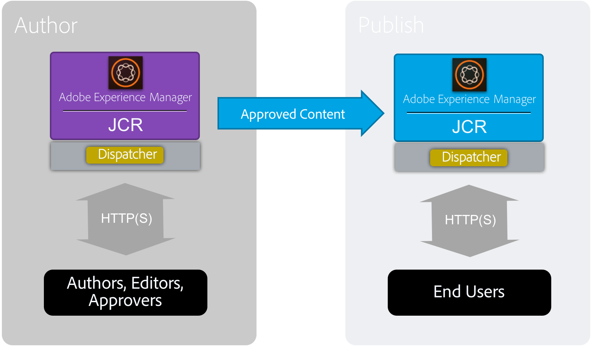

# Prestatierichtlijnen{#performance-guidelines}

Deze pagina biedt algemene richtlijnen voor het optimaliseren van de prestaties van uw AEM-implementatie. Als u nog niet eerder hebt AEM, moet u de volgende pagina&#39;s doorlopen voordat u de prestatierichtlijnen gaat lezen:

* [Basisconcepten AEM](/help/sites-deploying/deploy.md#basic-concepts)
* [Overzicht van opslag in AEM](/help/sites-deploying/storage-elements-in-aem-6.md#overview-of-storage-in-aem)
* [Aanbevolen implementaties](/help/sites-deploying/recommended-deploys.md)
* [Technische vereisten](/help/sites-deploying/technical-requirements.md)

Hieronder ziet u de implementatieopties die beschikbaar zijn voor AEM (schuiven om alle opties weer te geven):

<table>
 <tbody>
  <tr>
   <td>
<strong>AEM</strong>
 
<strong>Product</strong>
 </td>
   <td>
<strong>Topologie</strong>
 </td>
   <td>
<strong>Besturingssysteem</strong>
 </td>
   <td>
<strong>Toepassingsserver</strong>
 </td>
   <td>
<strong>JRE</strong>
 </td>
   <td>
<strong>Beveiliging</strong>
 </td>
   <td>
<strong>Micro Kernel</strong>
 </td>
   <td>
<strong>Datastore</strong>
 </td>
   <td>
<strong>Indexeren</strong>
 </td>
   <td>
<strong>Webserver</strong>
 </td>
   <td>
<strong>Browser</strong>
 </td>
   <td>
<strong>Marketing Cloud</strong>
 </td>
  </tr>
  <tr>
   <td>
Sites
 </td>
   <td>
Niet-HA
 </td>
   <td>
Windows
 </td>
   <td>
CQSE
 </td>
   <td>
Oracle
 </td>
   <td>
LDAP
 </td>
   <td>
Tar
 </td>
   <td>
Segment
 </td>
   <td>
Eigenschap
 </td>
   <td>
Apache
 </td>
   <td>
Rand
 </td>
   <td>
Doel
 </td>
  </tr>
  <tr>
   <td>
Assets
 </td>
   <td>
Publiceren-HA
 </td>
   <td>
Solaris
 </td>
   <td>
WebLogic
 </td>
   <td>
IBM
 </td>
   <td>
SAML
 </td>
   <td>
MongoDB
 </td>
   <td>
Bestand
 </td>
   <td>
Lucene
 </td>
   <td>
IIS
 </td>
   <td>
IE
 </td>
   <td>
Analyse
 </td>
  </tr>
  <tr>
   <td>
Gemeenschappen
 </td>
   <td>
Auteur-CS
 </td>
   <td>
Rode hoed
 </td>
   <td>
WebSphere
 </td>
   <td>
HP
 </td>
   <td>
Oauth
 </td>
   <td>
RDB/Oracle
 </td>
   <td>
S3/Azure
 </td>
   <td>
Solr
 </td>
   <td>
iPlanet
 </td>
   <td>
FireFox
 </td>
   <td>
Campagne
 </td>
  </tr>
  <tr>
   <td>
Forms
 </td>
   <td>
Auteur-offload
 </td>
   <td>
HP-UX
 </td>
   <td>
Tomcat
 </td>
   <td>
 
 </td>
   <td>
 
 </td>
   <td>
RDB/DB2
 </td>
   <td>
MongoDB
 </td>
   <td>
 
 </td>
   <td>
 
 </td>
   <td>
Chroom
 </td>
   <td>
Sociaal
 </td>
  </tr>
  <tr>
   <td>
Mobiel
 </td>
   <td>
Auteur-cluster
 </td>
   <td>
IBM AIX
 </td>
   <td>
JBoss
 </td>
   <td>
 
 </td>
   <td>
 
 </td>
   <td>
RDB/MySQL
 </td>
   <td>
RDBMS
 </td>
   <td>
 
 </td>
   <td>
 
 </td>
   <td>
Safari
 </td>
   <td>
Publiek
 </td>
  </tr>
  <tr>
   <td>
Meerdere sites
 </td>
   <td>
ASRP
 </td>
   <td>
SUSE
 </td>
   <td>
 
 </td>
   <td>
 
 </td>
   <td>
 
 </td>
   <td>
RDB/SQLServer
 </td>
   <td>
 
 </td>
   <td>
 
 </td>
   <td>
 
 </td>
   <td>
 
 </td>
   <td>
Activa
 </td>
  </tr>
  <tr>
   <td>
Handel
 </td>
   <td>
MSRP
 </td>
   <td>
Apple OS
 </td>
   <td>
 
 </td>
   <td>
 
 </td>
   <td>
 
 </td>
   <td>
 
 </td>
   <td>
 
 </td>
   <td>
 
 </td>
   <td>
 
 </td>
   <td>
 
 </td>
   <td>
Activering
 </td>
  </tr>
  <tr>
   <td>
 Dynamic Media 
 </td>
   <td>
JSRP
 </td>
   <td>
 
 </td>
   <td>
 
 </td>
   <td>
 
 </td>
   <td>
 
 </td>
   <td>
 
 </td>
   <td>
 
 </td>
   <td>
 
 </td>
   <td>
 
 </td>
   <td>
 
 </td>
   <td>
Mobiel
 </td>
  </tr>
  <tr>
   <td>
Brand Portal
 </td>
   <td>
J2E
 </td>
   <td>
 
 </td>
   <td>
 
 </td>
   <td>
 
 </td>
   <td>
 
 </td>
   <td>
 
 </td>
   <td>
 
 </td>
   <td>
 
 </td>
   <td>
 
 </td>
   <td>
 
 </td>
   <td>
 
 </td>
  </tr>
  <tr>
   <td>
AoD
 </td>
   <td>
 
 </td>
   <td>
 
 </td>
   <td>
 
 </td>
   <td>
 
 </td>
   <td>
 
 </td>
   <td>
 
 </td>
   <td>
 
 </td>
   <td>
 
 </td>
   <td>
 
 </td>
   <td>
 
 </td>
   <td>
 
 </td>
  </tr>
  <tr>
   <td>
LiveFyre
 </td>
   <td>
 
 </td>
   <td>
 
 </td>
   <td>
 
 </td>
   <td>
 
 </td>
   <td>
 
 </td>
   <td>
 
 </td>
   <td>
 
 </td>
   <td>
 
 </td>
   <td>
 
 </td>
   <td>
 
 </td>
   <td>
 
 </td>
  </tr>
  <tr>
   <td>
Schermen
 </td>
   <td>
 
 </td>
   <td>
 
 </td>
   <td>
 
 </td>
   <td>
 
 </td>
   <td>
 
 </td>
   <td>
 
 </td>
   <td>
 
 </td>
   <td>
 
 </td>
   <td>
 
 </td>
   <td>
 
 </td>
   <td>
 
 </td>
  </tr>
  <tr>
   <td>
Documentbeveiliging
 </td>
   <td>
 
 </td>
   <td>
 
 </td>
   <td>
 
 </td>
   <td>
 
 </td>
   <td>
 
 </td>
   <td>
 
 </td>
   <td>
 
 </td>
   <td>
 
 </td>
   <td>
 
 </td>
   <td>
 
 </td>
   <td>
 
 </td>
  </tr>
  <tr>
   <td>
Procesbeheer
 </td>
   <td>
 
 </td>
   <td>
 
 </td>
   <td>
 
 </td>
   <td>
 
 </td>
   <td>
 
 </td>
   <td>
 
 </td>
   <td>
 
 </td>
   <td>
 
 </td>
   <td>
 
 </td>
   <td>
 
 </td>
   <td>
 
 </td>
  </tr>
  <tr>
   <td>
bureaubladtoepassing
 </td>
   <td>
 
 </td>
   <td>
 
 </td>
   <td>
 
 </td>
   <td>
 
 </td>
   <td>
 
 </td>
   <td>
 
 </td>
   <td>
 
 </td>
   <td>
 
 </td>
   <td>
 
 </td>
   <td>
 
 </td>
   <td>
 
 </td>
  </tr>
 </tbody>
</table>

>[!NOTE]
>
>De prestatierichtsnoeren zijn voornamelijk van toepassing op AEM Sites.

## Wanneer moet u de prestatierichtlijnen gebruiken {#when-to-use-the-performance-guidelines}

In de volgende situaties moet u de prestatierichtlijnen gebruiken:

* **Eerste implementatie**: Wanneer u AEM Sites of Middelen voor het eerst wilt implementeren, is het belangrijk dat u weet welke opties beschikbaar zijn wanneer u de Micro Kernel, Node Store en Data Store configureert (in vergelijking met de standaardinstellingen). Bijvoorbeeld, veranderend de standaardmontages van het Opslag van Gegevens voor TarMK in de Opslag van de Gegevens van het Dossier.
* **Een upgrade uitvoeren naar een nieuwe versie**: Wanneer u een upgrade uitvoert naar een nieuwe versie, is het belangrijk dat u de verschillen in prestaties begrijpt ten opzichte van de actieve omgeving. Bijvoorbeeld, bevordering van AEM 6.1 aan 6.2, of van AEM 6.0 CRX2 aan 6.2 OAK.
* **De responstijd is traag**: Wanneer de geselecteerde architectuur van Nodestore niet aan uw vereisten voldoet, is het belangrijk om de prestatiesverschillen te begrijpen vergeleken met andere topologieopties. Bijvoorbeeld, plaatsend TarMK in plaats van MongoMK, of het gebruiken van een Sore van de Gegevens van het Dossier in plaats van een Amazon S3 of Microsoft Azure de Opslag van Gegevens.
* **Meer auteurs** toevoegen: Wanneer de geadviseerde topologie TarMK niet aan de prestatiesvereisten voldoet en het upsizing van de knoop van de Auteur de maximumbeschikbare capaciteit heeft bereikt, is het belangrijk om de prestatiesverschillen te begrijpen vergeleken bij het gebruiken van MongoMK met drie of meer knopen van de Auteur. U kunt bijvoorbeeld MongoMK gebruiken in plaats van TarMK.
* **Meer inhoud** toevoegen: Als de aanbevolen gegevensopslagarchitectuur niet aan uw vereisten voldoet, is het belangrijk dat u weet welke prestatieverschillen er zijn ten opzichte van andere gegevensopslagopties. Voorbeeld: met de Amazon S3 of Microsoft Azure Data Store in plaats van een File Data Store.

## Inleiding {#introduction}

In dit hoofdstuk wordt een algemeen overzicht gegeven van de AEM architectuur en de belangrijkste onderdelen ervan. Zij bevat ook ontwikkelingsrichtsnoeren en beschrijft de testscenario&#39;s die in de TarMK- en MongoMK-benchmarktests worden gebruikt.

### Het AEM Platform {#the-aem-platform}

Het AEM platform bestaat uit de volgende onderdelen:

Voor meer informatie over het AEM platform, zie [Wat is AEM](/help/sites-deploying/deploy.md#what-is-aem).

### De AEM architectuur {#the-aem-architecture}

Er zijn drie belangrijke bouwstenen aan een AEM plaatsing. De **Instantie auteur** die door auteurs van inhoud, redacteuren, en fiatteurs wordt gebruikt om inhoud tot stand te brengen en te herzien. Wanneer de inhoud wordt goedgekeurd, wordt het gepubliceerd aan een tweede instantietype genoemd **Publish Instantie** van waar het door het eind wordt betreden - gebruikers. De derde bouwsteen is **Dispatcher** die een module is die caching en het filtreren URL behandelt en op de webserver geïnstalleerd is. Zie [Typische implementatiescenario&#39;s](/help/sites-deploying/deploy.md#typical-deployment-scenarios) voor meer informatie over de AEM architectuur.

### Micro Kernels {#micro-kernels}

Micro Kernels fungeert als persistentiemanagers in AEM. Er worden drie soorten Micro Kernels gebruikt met AEM: TarMK, MongoDB, en Relationele Gegevensbestand (onder beperkte steun). Het kiezen van één om uw behoeften te passen hangt van het doel van uw instantie en het plaatsingstype af u overweegt. Voor extra informatie over Micro Kernels, zie [Aanbevolen Plaatsingen](/help/sites-deploying/recommended-deploys.md) pagina.

### Nodestore {#nodestore}

In AEM kunnen binaire gegevens onafhankelijk van inhoudsknooppunten worden opgeslagen. De locatie waar de binaire gegevens worden opgeslagen, wordt de **Gegevensopslag** genoemd, terwijl de locatie van de inhoudsknooppunten en eigenschappen de **Nodeopslag** wordt genoemd.

>[!NOTE]
>
>Adobe raadt TarMK aan de standaardpersistentietechnologie te zijn die door klanten voor zowel de auteur AEM als de Publish instanties wordt gebruikt.

>[!CAUTION]
>
>De relationele Database Micro Kernel wordt beperkt ondersteund. Neem contact op met de [klantenservice van Adobe](https://helpx.adobe.com/marketing-cloud/contact-support.html) voordat u dit type Micro Kernel gebruikt.

### Gegevensopslag {#data-store}

Wanneer het behandelen van groot aantal binaire getallen, adviseert men dat een externe gegevensopslag in plaats van de standaardknoopopslag wordt gebruikt om prestaties te maximaliseren. Als uw project bijvoorbeeld een groot aantal media-elementen vereist, kunt u deze sneller openen dan ze rechtstreeks in een MongoDB opslaan als u ze onder de File of Azure/S3 Data Store opslaat.

Voor verdere details over de beschikbare configuratieopties, zie [Het Vormen van Knoop en de Opslag van Gegevens](/help/sites-deploying/data-store-config.md).

>[!NOTE]
>
>Adobe raadt aan om de optie te kiezen voor het implementeren van AEM op Azure of Amazon Web Services (AWS) met behulp van Adobe Managed Services, waarbij klanten profiteren van een team dat de ervaring en de vaardigheden heeft om AEM in deze cloud computing-omgevingen te implementeren en te gebruiken. Raadpleeg onze [aanvullende documentatie over Adobe Managed Services](https://www.adobe.com/marketing-cloud/enterprise-content-management/managed-services-cloud-platform.html?aemClk=t).
>
>Voor aanbevelingen over het implementeren van AEM op Azure of AWS, buiten Adobe Managed Services, raden we u ten zeerste aan rechtstreeks samen te werken met de cloud provider of een van onze partners die de implementatie van AEM in de cloud-omgeving van uw keuze ondersteunen. De geselecteerde cloudprovider of partner is verantwoordelijk voor de groottesortering van specificaties, het ontwerp en de implementatie van de architectuur die zij ondersteunen om te voldoen aan uw specifieke vereisten op het gebied van prestaties, belasting, schaalbaarheid en beveiliging.
>
>Zie ook de pagina [technische vereisten](/help/sites-deploying/technical-requirements.md#supported-platforms) voor meer informatie.

### Zoeken {#search-features}

In deze sectie worden de aangepaste indexproviders vermeld die met AEM worden gebruikt. Voor meer informatie over indexeren, zie [Eak Vragen en het Indexeren](/help/sites-deploying/queries-and-indexing.md).

>[!NOTE]
>
>Voor de meeste plaatsingen, adviseert Adobe het gebruiken van de Index van Lucene. U zou Solr slechts voor scalability in gespecialiseerde en complexe plaatsingen moeten gebruiken.

### Richtlijnen voor ontwikkeling {#development-guidelines}

U moet zich ontwikkelen voor AEM gericht op **prestaties en schaalbaarheid**. Hieronder vindt u een aantal aanbevolen procedures die u kunt volgen:

**DO**

* Scheiding van presentatie, logica en inhoud toepassen
* Bestaande AEM-API&#39;s gebruiken (bijvoorbeeld: Sling) en gereedschap (bv. Replicatie)
* Ontwikkelen in de context van werkelijke inhoud
* Ontwikkelen voor optimale kakkerbaarheid
* Aantal spaarbestanden minimaliseren (bijv.: door gebruik te maken van tijdelijke workflows)
* Zorg ervoor alle eindpunten van HTTP RESTful zijn
* Het bereik van de GCR-waarneming beperken
* Onthoud asynchrone thread

**NIET**

* Gebruik niet direct JCR-API&#39;s, als dat mogelijk is
* Geen /libs-wijziging, maar gebruik overlays
* Gebruik waar mogelijk geen query&#39;s
* Gebruik geen Sling Bindings om de diensten OSGi in code van Java te krijgen, maar eerder gebruik:

   * @Reference in een DS-component
   * @Injecteren in een verkoopmodel
   * sling.getService() in een klasse voor rechtmatig gebruik
   * sling.getService() in een JSP
   * een ServiceTracker
   * directe toegang tot het OSGi-serviceregister

Lees [Developing - The Basics](/help/sites-developing/the-basics.md) voor meer informatie over het ontwikkelen op AEM. Voor extra beste praktijken, zie [Beste praktijken van de Ontwikkeling](/help/sites-developing/best-practices.md).

### Benchmarkscenario&#39;s {#benchmark-scenarios}

>[!NOTE]
>
>Alle benchmarktests die op deze pagina worden weergegeven, zijn uitgevoerd in een laboratoriumomgeving.

De hieronder beschreven testscenario&#39;s worden gebruikt voor de benchmarksecties van de hoofdstukken TarMK, MongoMk en TarMK vs MongoMk. Om te zien welk scenario voor een bepaalde benchmarktest werd gebruikt, lees het gebied van het Scenario van de [Technische Specificaties](/help/sites-deploying/performance-guidelines.md#tarmk-performance-benchmark) lijst.

**Scenario één product**

AEM Assets:

* Gebruikersinteracties: Blader middelen / zoekmiddelen / element downloaden / Metagegevens van element lezen / Metagegevens van element bijwerken / element uploaden / workflow voor uploaden van element uitvoeren
* Uitvoermodus: gelijktijdige gebruikers, enkele interactie per gebruiker

**Productscenario mixen**

AEM Sites + Middelen:

* Gebruikersinteracties voor sites: Artikelpagina lezen / Pagina lezen / Alinea maken / Alinea bewerken / Pagina Inhoud maken / Pagina Inhoud plaatsen/Zoeken in auteur activeren
* Gebruikersinteracties voor middelen: Blader middelen / zoekmiddelen / element downloaden / Metagegevens van element lezen / Metagegevens van element bijwerken / element uploaden / workflow voor uploaden van element uitvoeren
* Uitvoermodus: gelijktijdige gebruikers, gemengde interacties per gebruiker

**Het verticale Scenario van het Geval van het Gebruik**

Media:

* Artikelpagina lezen (27,4%), Pagina lezen (10,9%), Sessie maken (2,6%), Pagina met inhoud activeren (1,7%), Pagina met inhoud maken (0,4%), Alinea maken (4,3%), Alinea bewerken (0,9%), Afbeeldingscomponent (0,9%), Bladeren-elementen (20%), Metagegevens van element lezen (8,5%), Downloadmiddel (4,2%), Zoekmiddel (0,2%), Asset-metagegevens bijwerken (2,4%), Element uploaden (1,2%), Bladeren project (4,9%), Project lezen (6,6%), Project toevoegen element (1,2%), Project toevoegen Site (1,2%), Project maken (0,1%), Auteur zoeken (0,4%)
* Uitvoermodus: gelijktijdige gebruikers, gemengde interacties per gebruiker

## TarMK {#tarmk}

Dit hoofdstuk geeft algemene prestatiesrichtlijnen voor TarMK die de minimumarchitectuurvereisten en de montageconfiguratie specificeren. Er wordt ook voorzien in benchmarktests voor verdere verduidelijking.

Adobe raadt TarMK aan om de standaardpersistentietechnologie te zijn die door klanten in alle plaatsingsscenario&#39;s, voor zowel auteur AEM als Publish instanties wordt gebruikt.

Zie [Implementatiescenario&#39;s](/help/sites-deploying/recommended-deploys.md#deployment-scenarios) en [Tar Storage](/help/sites-deploying/storage-elements-in-aem-6.md#tar-storage) voor meer informatie over TarMK.

### TarMK-richtlijnen voor minimale architectuur {#tarmk-minimum-architecture-guidelines}

>[!NOTE]
>
>De onderstaande minimale architectuurrichtlijnen zijn van toepassing op productieomgevingen en grote verkeerslocaties. Dit zijn **not** de [minimum specificaties](/help/sites-deploying/technical-requirements.md#prerequisites) nodig om AEM in werking te stellen.

Om goede prestaties te vestigen wanneer het gebruiken van TarMK, zou u van de volgende architectuur moeten beginnen:

* Eén instantie Auteur
* Twee publicatie-instanties
* Twee verzenders

Hieronder ziet u de architectuurrichtlijnen voor AEM sites en AEM Assets.

>[!NOTE]
>
>Binair-less replicatie zou **ON** moeten worden gedraaid als de Datastore van het Dossier wordt gedeeld.

**Richtlijnen voor de Tar Architecture voor AEM Sites**

**Richtlijnen voor de Tar Architecture voor AEM Assets**

### TarMK Settings Guideline {#tarmk-settings-guideline}

Voor goede prestaties, zou u de montages hieronder voorgestelde richtlijnen moeten volgen. Voor instructies over hoe te om de montages te veranderen, [zie deze pagina](https://helpx.adobe.com/experience-manager/kb/performance-tuning-tips.html).

<table>
 <tbody>
  <tr>
   <td><strong>Instelling</strong></td>
   <td><strong>Parameter</strong></td>
   <td><strong>Waarde</strong></td>
   <td><strong>Beschrijving</strong></td>
  </tr>
  <tr>
   <td>Taakwachtrijen voor verkopen</td>
   <td><code>queue.maxparallel</code></td>
   <td>Stel waarde in op de helft van het aantal CPU-cores. </td>
   <td>Standaard is het aantal gelijktijdige threads per taakwachtrij gelijk aan het aantal CPU-cores.</td>
  </tr>
  <tr>
   <td>Graniet Transient Workflow Queue</td>
   <td><code>Max Parallel</code></td>
   <td>Stel waarde in op de helft van het aantal CPU-cores</td>
   <td> </td>
  </tr>
  <tr>
   <td>JVM-parameters</td>
   <td>
<code>Doak.queryLimitInMemory</code>
 
<code>Doak.queryLimitReads</code>
 
<code>Dupdate.limit</code>
 
<code>Doak.fastQuerySize</code>
 </td>
   <td>
500000
 
100000
 
250000
 
Waar
 </td>
   <td>Voeg deze JVM-parameters toe aan het AEM-beginscript om te voorkomen dat uitgebreide query's de systemen overladen.</td>
  </tr>
  <tr>
   <td>Lucene-indexconfiguratie</td>
   <td>
<code>CopyOnRead</code>
 
<code>CopyOnWrite</code>
 
<code>Prefetch Index Files</code>
 </td>
   <td>
Ingeschakeld
 
Ingeschakeld
 
Ingeschakeld
 </td>
   <td>Zie <a href="https://jackrabbit.apache.org/oak/docs/query/lucene.html">deze pagina</a> voor meer informatie over de beschikbare parameters.</td>
  </tr>
  <tr>
   <td>Data Store = S3 Datastore</td>
   <td>
<code>maxCachedBinarySize</code>
 
<code>cacheSizeInMB</code>
 </td>
   <td>
1048576 (1 MB) of kleiner
 
2-10% van maximale heapgrootte
 </td>
   <td>Zie ook <a href="/help/sites-deploying/data-store-config.md#data-store-configurations">Configuraties van de Opslag van Gegevens</a>.</td>
  </tr>
  <tr>
   <td>Workflow voor DAM-update-middelen</td>
   <td><code>Transient Workflow</code></td>
   <td>ingeschakeld</td>
   <td>Deze workflow beheert de update van elementen.</td>
  </tr>
  <tr>
   <td>DAM MetaData Writeback</td>
   <td><code>Transient Workflow</code></td>
   <td>ingeschakeld</td>
   <td>Deze workflow beheert XMP terugschrijven naar het oorspronkelijke binaire getal en stelt de datum van laatste wijziging in JCR in.</td>
  </tr>
 </tbody>
</table>

### TarMK Performance Benchmark {#tarmk-performance-benchmark}

#### Technische specificaties {#technical-specifications}

De benchmarktests werden uitgevoerd op de volgende specificaties:

|  | **Auteursknooppunt** |
|---|---|
| Server | Hardware voor onbewerkte metalen (HP) |
| Besturingssysteem | RedHat Linux |
| CPU/kernen | Intel(R) Xeon(R) CPU E5-2407 @2,40 GHz, 8 kernen |
| RAM | 32 GB |
| Schijf | Magnetisch |
| Java | Oracle JRE versie 8 |
| JVM Heap | 16 GB |
| Product | AEM 6,2 |
| Nodestore | TarMK |
| Datastore | Bestand DS |
| Scenario | Enkel product: Elementen / 30 gelijktijdige threads |

#### Resultaten prestatie-benchmark {#performance-benchmark-results}

>[!NOTE]
>
>De hieronder vermelde aantallen zijn genormaliseerd aan 1 als basislijn en zijn niet de daadwerkelijke productienummers.

 

## MongoMK {#mongomk}

De primaire reden voor het kiezen van de MongoMK persistence backend over TarMK is de instanties horizontaal te schalen. Dit betekent dat er altijd twee of meer actieve auteur-instanties moeten worden uitgevoerd en dat MongoDB moet worden gebruikt als het opslagsysteem voor persistentie. De noodzaak om meer dan één auteurinstantie in werking te stellen vloeit over het algemeen voort uit het feit dat de cpu en geheugencapaciteit van één enkele server, die alle gezamenlijke auteursactiviteiten steunt, niet meer duurzaam is.

Zie [Implementatiescenario&#39;s](/help/sites-deploying/recommended-deploys.md#deployment-scenarios) en [Mongo Storage](/help/sites-deploying/storage-elements-in-aem-6.md#mongo-storage) voor meer informatie over TarMK.

### MongoMK-richtlijnen voor minimale architectuur {#mongomk-minimum-architecture-guidelines}

Om goede prestaties te vestigen wanneer het gebruiken van MongoMK, zou u van de volgende architectuur moeten beginnen:

* Drie instanties van Auteur
* Twee publicatie-instanties
* Drie MongoDB-instanties
* Twee verzenders

>[!NOTE]
>
>In productieomgevingen wordt MongoDB altijd gebruikt als een replicaset met een primaire en twee secundaire server. Lezen en schrijven gaan naar de primaire website en lezen kan naar de secundaire medewerkers gaan. Als opslag niet beschikbaar is, kan een van de secundaire bestanden worden vervangen door een arbiter, maar MongoDB-replicasets moeten altijd uit een oneven aantal instanties bestaan.

>[!NOTE]
>
>Binair-less replicatie zou **ON** moeten worden gedraaid als de Datastore van het Dossier wordt gedeeld.

### MongoMK Settings Guidelines {#mongomk-settings-guidelines}

Voor goede prestaties, zou u de montages hieronder voorgestelde richtlijnen moeten volgen. Voor instructies over hoe te om de montages te veranderen, [zie deze pagina](https://helpx.adobe.com/experience-manager/kb/performance-tuning-tips.html).

<table>
 <tbody>
  <tr>
   <td><strong>Instelling</strong></td>
   <td><strong>Parameter</strong></td>
   <td><strong>Waarde (standaardwaarde)</strong></td>
   <td><strong>Beschrijving</strong></td>
  </tr>
  <tr>
   <td>Taakwachtrijen voor verkopen</td>
   <td><code>queue.maxparallel</code></td>
   <td>Stel waarde in op de helft van het aantal CPU-cores. </td>
   <td>Standaard is het aantal gelijktijdige threads per taakwachtrij gelijk aan het aantal CPU-cores.</td>
  </tr>
  <tr>
   <td>Graniet Transient Workflow Queue</td>
   <td><code>Max Parallel</code></td>
   <td>Stel waarde in op de helft van het aantal CPU-cores.</td>
   <td> </td>
  </tr>
  <tr>
   <td>JVM-parameters</td>
   <td>
<code>Doak.queryLimitInMemory</code>
 
<code>Doak.queryLimitReads</code>
 
<code>Dupdate.limit</code>
 
<code>Doak.fastQuerySize</code>
 
<code>Doak.mongo.maxQueryTimeMS</code>
 </td>
   <td>
500000
 
100000
 
250000
 
Waar
 
60000
 </td>
   <td>Voeg deze JVM-parameters toe aan het AEM-beginscript om te voorkomen dat uitgebreide query's de systemen overladen.</td>
  </tr>
  <tr>
   <td>Lucene-indexconfiguratie</td>
   <td>
<code>CopyOnRead</code>
 
<code>CopyOnWrite</code>
 
<code>Prefetch Index Files</code>
 </td>
   <td>
Ingeschakeld
 
Ingeschakeld
 
Ingeschakeld
 </td>
   <td>Zie <a href="https://jackrabbit.apache.org/oak/docs/query/lucene.html">deze pagina</a> voor meer informatie over beschikbare parameters.</td>
  </tr>
  <tr>
   <td>Data Store = S3 Datastore</td>
   <td>
<code>maxCachedBinarySize</code>
 
<code>cacheSizeInMB</code>
 </td>
   <td>
1048576 (1 MB) of kleiner
 
2-10% van maximale heapgrootte
 </td>
   <td>Zie ook <a href="/help/sites-deploying/data-store-config.md#data-store-configurations">Configuraties van de Opslag van Gegevens</a>.</td>
  </tr>
  <tr>
   <td>DocumentNodeStoreService</td>
   <td>
<code>cache</code>
 
<code>nodeCachePercentage</code>
 
<code>childrenCachePercentage</code>
 
<code>diffCachePercentage</code>
 
<code>docChildrenCachePercentage</code>
 
<code>prevDocCachePercentage</code>
 
<code>persistentCache</code>
 </td>
   <td>
2048
 
35 (25)
 
20 (10)
 
30
 
10
 
4
 
./cache,size=2048,binary=0,-compact,-compress
 </td>
   <td>
De standaardgrootte van de cache is ingesteld op 256 MB.
 
Heeft invloed op de tijd die nodig is om cachevalidatie uit te voeren.
 </td>
  </tr>
  <tr>
   <td>eik-waarneming</td>
   <td>
<code>thread pool</code>
 
<code>length</code>
 </td>
   <td>
min &amp; max = 20
 
50000
 </td>
   <td> </td>
  </tr>
 </tbody>
</table>

### MongoMK Performance Benchmark {#mongomk-performance-benchmark}

### Technische specificaties {#technical-specifications-1}

De benchmarktests werden uitgevoerd op de volgende specificaties:

|  | **Auteur-knooppunt** | **MongoDB-knooppunt** |
|---|---|---|
| Server | Hardware voor onbewerkte metalen (HP) | Hardware voor onbewerkte metalen (HP) |
| Besturingssysteem | RedHat Linux | RedHat Linux |
| CPU/kernen | Intel(R) Xeon(R) CPU E5-2407 @2,40 GHz, 8 kernen | Intel(R) Xeon(R) CPU E5-2407 @2,40 GHz, 8 kernen |
| RAM | 32 GB | 32 GB |
| Schijf | Magnetisch - >1k IOPS | Magnetisch - >1k IOPS |
| Java | Oracle JRE versie 8 | N.v.t. |
| JVM Heap | 16 GB | N.v.t. |
| Product | AEM 6,2 | MongoDB 3.2 WiredTiger |
| Nodestore | MongoMK | N.v.t. |
| Datastore | Bestand DS | N.v.t. |
| Scenario | Enkel product: Elementen / 30 gelijktijdige threads | Enkel product: Elementen / 30 gelijktijdige threads |

### Resultaten prestatie-benchmark {#performance-benchmark-results-1}

>[!NOTE]
>
>De hieronder vermelde aantallen zijn genormaliseerd aan 1 als basislijn en zijn niet de daadwerkelijke productienummers.

 

## TarMK vs MongoMK {#tarmk-vs-mongomk}

De basisregel die in overweging moet worden genomen wanneer het kiezen tussen twee is dat TarMK voor prestaties wordt ontworpen, terwijl MongoMK voor scalability wordt gebruikt. Adobe raadt TarMK aan om de standaardpersistentietechnologie te zijn die door klanten in alle plaatsingsscenario&#39;s, voor zowel auteur AEM als Publish instanties wordt gebruikt.

De primaire reden voor het kiezen van de MongoMK persistence backend over TarMK is de instanties horizontaal te schalen. Dit betekent dat er altijd twee of meer actieve auteur-instanties moeten worden uitgevoerd en dat MongoDB moet worden gebruikt als het opslagsysteem voor persistentie. De noodzaak om meer dan één auteurinstantie in werking te stellen vloeit over het algemeen voort uit het feit dat de cpu en geheugencapaciteit van één enkele server, die alle gezamenlijke auteursactiviteiten steunt, niet meer duurzaam is.

Zie [Aanbevolen implementaties](/help/sites-deploying/recommended-deploys.md#microkernels-which-one-to-use) voor meer informatie over TarMK vs MongoMK.

### TarMK vs MongoMk Guidelines {#tarmk-vs-mongomk-guidelines}

**Voordelen van TarMK**

* Speciaal ontworpen voor toepassingen voor inhoudsbeheer
* Bestanden zijn altijd consistent en er kunnen back-ups van worden gemaakt met elk bestandsgebaseerd back-upprogramma
* Verstrekt een failovermechanisme - zie [Cold Standby](/help/sites-deploying/tarmk-cold-standby.md) voor meer details
* Biedt hoge prestaties en betrouwbare gegevensopslag met minimale operationele overhead
* Lagere totale eigendomskosten (totale eigendomskosten)

**Criteria voor de keuze van MongoMK**

* Aantal benoemde gebruikers verbonden in een dag: in duizenden of meer
* Aantal gelijktijdige gebruikers: in honderden of meer
* Omvang van de ingenomen activa per dag: in honderdduizenden of meer
* Volume van paginabewerkingen per dag: in honderdduizenden of meer
* Volume zoekopdrachten per dag: in tienduizenden of meer

### TarMK vs MongoMK Benchmarks {#tarmk-vs-mongomk-benchmarks}

>[!NOTE]
>
>De hieronder vermelde aantallen zijn genormaliseerd aan 1 als basislijn en zijn geen daadwerkelijke productienummers.

### Scenario 1 — Technische specificaties {#scenario-technical-specifications}

<table>
 <tbody>
  <tr>
   <td><strong> </strong></td>
   <td><strong>Auteur-OAK-knooppunt</strong></td>
   <td><strong>MongoDB-knooppunt</strong></td>
   <td> </td>
  </tr>
  <tr>
   <td>Server</td>
   <td>Hardware voor onbewerkte metalen (HP)</td>
   <td>Hardware voor onbewerkte metalen (HP)</td>
   <td> </td>
  </tr>
  <tr>
   <td>Besturingssysteem</td>
   <td>RedHat Linux</td>
   <td>RedHat Linux</td>
   <td> </td>
  </tr>
  <tr>
   <td>CPU/kernen</td>
   <td>Intel(R) Xeon(R) CPU E5-2407 @2,40 GHz, 8 kernen</td>
   <td>Intel(R) Xeon(R) CPU E5-2407 @2,40 GHz, 8 kernen</td>
   <td> </td>
  </tr>
  <tr>
   <td>RAM</td>
   <td>32 GB</td>
   <td>32 GB</td>
   <td> </td>
  </tr>
  <tr>
   <td>Schijf</td>
   <td>Magnetisch - &gt;1k IOPS</td>
   <td>Magnetisch - &gt;1k IOPS</td>
   <td> </td>
  </tr>
  <tr>
   <td>Java</td>
   <td>Oracle JRE versie 8</td>
   <td>N.v.t.</td>
   <td> </td>
  </tr>
  <tr>
   <td>JVM Heap16 GB</td>
   <td>16 GB</td>
   <td>N.v.t.</td>
   <td> </td>
  </tr>
  <tr>
   <td>Product </td>
   <td>AEM 6,2</td>
   <td>MongoDB 3.2 WiredTiger</td>
   <td> </td>
  </tr>
  <tr>
   <td>Nodestore</td>
   <td>TarMK of MongoMK</td>
   <td>N.v.t.</td>
   <td> </td>
  </tr>
  <tr>
   <td>Datastore</td>
   <td>Bestand DS </td>
   <td>N.v.t.</td>
   <td> </td>
  </tr>
  <tr>
   <td>Scenario</td>
   <td>
  Enkel product: Elementen / 30 gelijktijdige threads per run
 </td>
   <td> </td>
   <td> </td>
  </tr>
 </tbody>
</table>

### Prestatiebenchmarkresultaten scenario 1 {#scenario-performance-benchmark-results}

### Scenario 2: Technische specificaties {#scenario-technical-specifications-1}

>[!NOTE]
>
>Om het zelfde aantal Auteurs met MongoDB toe te laten zoals met één systeem TarMK hebt u een cluster met twee AEM knopen nodig. Een cluster met vier knooppunten in MongoDB kan 1,8 keer het aantal auteurs afhandelen dan één TarMK-instantie. Een achtnodencluster MongoDB kan 2.3 keer het aantal Auteurs behandelen dan één instantie TarMK.

<table>
 <tbody>
  <tr>
   <td><strong> </strong></td>
   <td><strong>Auteur TarMK-knooppunt</strong></td>
   <td><strong>Auteur MongoMK Node</strong></td>
   <td><strong>MongoDB-knooppunt</strong></td>
  </tr>
  <tr>
   <td>Server</td>
   <td>AWS c3.8xlarge</td>
   <td>AWS c3.8xlarge</td>
   <td>AWS c3.8xlarge</td>
  </tr>
  <tr>
   <td>Besturingssysteem</td>
   <td>RedHat Linux</td>
   <td>RedHat Linux</td>
   <td>RedHat Linux</td>
  </tr>
  <tr>
   <td>CPU/kernen</td>
   <td>32</td>
   <td>32</td>
   <td>32</td>
  </tr>
  <tr>
   <td>RAM</td>
   <td>60 GB</td>
   <td>60 GB</td>
   <td>60 GB</td>
  </tr>
  <tr>
   <td>Schijf</td>
   <td>SSD - 10.000 IOPS</td>
   <td>SSD - 10.000 IOPS</td>
   <td>SSD - 10.000 IOPS</td>
  </tr>
  <tr>
   <td>Java</td>
   <td>Oracle JRE versie 8</td>
   <td>  Oracle JRE versie 8</td>
   <td>N.v.t.</td>
  </tr>
  <tr>
   <td>JVM Heap16 GB</td>
   <td>30 GB</td>
   <td>30 GB</td>
   <td>N.v.t.</td>
  </tr>
  <tr>
   <td>Product </td>
   <td>AEM 6,2</td>
   <td>AEM 6,2</td>
   <td>  MongoDB 3.2 WiredTiger</td>
  </tr>
  <tr>
   <td>Nodestore</td>
   <td>TarMK </td>
   <td>MongoMK</td>
   <td>  N.v.t.</td>
  </tr>
  <tr>
   <td>Datastore</td>
   <td>Bestand DS </td>
   <td>  Bestand DS</td>
   <td>  N.v.t.</td>
  </tr>
  <tr>
   <td>Scenario</td>
   <td>
    Verticaal gebruik: Media / 2000 gelijktijdige threads
 </td>
   <td></td>
   <td></td>
  </tr>
 </tbody>
</table>

### Scenario 2 Performance Benchmark Resultaten {#scenario-performance-benchmark-results-1}

### Richtlijnen voor schaalbaarheid van architectuur voor AEM Sites en assets {#architecture-scalability-guidelines-for-aem-sites-and-assets}

## Overzicht van prestatierichtlijnen {#summary-of-performance-guidelines}

De richtsnoeren op deze pagina kunnen als volgt worden samengevat:

* **TarMK met de Datastorea van het Dossier is de geadviseerde architectuur voor de meeste klanten:** 

   * Minimale topologie: één instantie Auteur, twee instanties Publish, twee Verzenders
   * Binair-less replicatie aangezet als de Datastore van het Dossier wordt gedeeld

* **MongoMK met de Datastoreis van het Dossier** de geadviseerde architectuur voor horizontale scalability van de rij van de Auteur:

   * Minimale topologie: drie instanties Auteur, drie instanties MongoDB, twee instanties Publish, twee Verzenders
   * Binair-less replicatie aangezet als de Datastore van het Dossier wordt gedeeld

* **De** Nodestores zouden op de lokale schijf moeten worden opgeslagen, niet een netwerk in bijlage opslag (NAS)
* Bij gebruik van **Amazon S3**:

   * De Amazon S3-datastore wordt gedeeld tussen de laag Auteur en Publiceren
   * Binair-less replicatie moet worden aangezet
   * Voor de afvalophaling van Datastore is een eerste uitvoering vereist voor alle auteur- en publicatieknooppunten en vervolgens een tweede uitvoering voor Auteur

* **De aangepaste index moet worden gemaakt naast de index voor de** index van het vak op basis van de meest gebruikte zoekopdrachten

   * Lucene-indexen moeten worden gebruikt voor aangepaste indexen

* **Door de workflow aan te passen, kunt u de prestaties** aanzienlijk verbeteren, bijvoorbeeld door de videostap in de workflow Element bijwerken te verwijderen, listeners die niet worden gebruikt uit te schakelen, enz.

Lees voor meer informatie ook de pagina [Aanbevolen implementaties](/help/sites-deploying/recommended-deploys.md).
