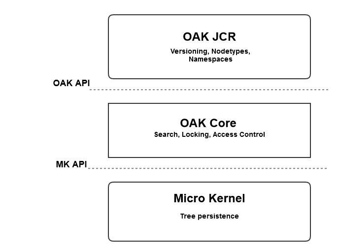

# Inleiding tot het AEM-platform{#introduction-to-the-aem-platform}

Het AEM-platform in AEM 6 is gebaseerd op Apache Jackrabbit Oak.

Apache Jackrabbit Oak probeert een schaalbare en krachtige hiërarchische opslagplaats voor inhoud te implementeren die als basis kan dienen voor moderne websites van wereldklasse en andere veeleisende inhoudstoepassingen.

Het is de opvolger van Jackrabbit 2 en wordt door AEM 6 gebruikt als de standaardobject voor de gegevensopslagruimte, CRX.

## Ontwerpbeginselen en -doelstellingen {#design-principles-and-goals}

Oak voert [ JSR-283 ](https://jcp.org/en/jsr/detail?id=283) (JCR 2.0) specificatie uit. De belangrijkste ontwerpdoelstellingen zijn:

* Betere ondersteuning voor grote opslagplaatsen
* Meerdere gedistribueerde clusterknooppunten voor hoge beschikbaarheid
* Betere prestaties
* Ondersteuning voor veel onderliggende knooppunten en toegangsbeheerniveaus

## Architectuurconcept {#architecture-concept}

### Opslag {#storage}

Het doel van de opslaglaag is:

* Een structuurmodel implementeren
* Opslag pluggable maken
* Een clusteringsmechanisme bieden

### Oak Core {#oak-core}

De Oak Core voegt verschillende lagen toe aan de opslaglaag:

* Besturingselementen op toegangsniveau
* Zoeken en indexeren
* Waarneming

### Oak JCR {#oak-jcr}

Het hoofddoel van het GCO van Oak is de semantiek van het GCO om te zetten in boombewerkingen. Zij is ook verantwoordelijk voor:

* De JCR-API implementeren
* Bevat haken die JCR-beperkingen implementeren

Bovendien zijn niet-Java-implementaties nu mogelijk en maken ze deel uit van het JCR-concept van Oak.

## Overzicht van opslag {#storage-overview}

De Oak-opslaglaag biedt een abstractielaag voor de werkelijke opslag van de inhoud.

Momenteel, zijn er twee opslagimplementaties beschikbaar in AEM6: **Opslag van de Tar** en **Opslag MongoDB**.

### Teeropslag {#tar-storage}

Voor de Tar-opslag worden teerbestanden gebruikt. De inhoud wordt opgeslagen als diverse typen records binnen grotere segmenten. Journalen worden gebruikt om de meest recente status van de opslagplaats te volgen.

Er zijn verschillende basisprincipes voor het ontwerp waarop het is gebouwd:

* **Immuable Segmenten**

De inhoud wordt opgeslagen in segmenten die maximaal 256 kB kunnen zijn. Ze zijn onveranderlijk, waardoor het gemakkelijk wordt om vaak geopende segmenten in de cache op te slaan en systeemfouten die de opslagplaats kunnen beschadigen, worden verminderd.

Elk segment wordt geïdentificeerd door een uniek herkenningsteken (UUID) en bevat een ononderbroken ondergroep van de inhoudsboom. Daarnaast kunnen segmenten verwijzen naar andere inhoud. Elk segment houdt een lijst van UUIDs van andere referenced segmenten bij.

* **Localiteit**

Verwante verslagen zoals een knoop en zijn directe kinderen worden opgeslagen in het zelfde segment. Hierdoor verloopt het zoeken in de repository snel en worden de meeste cachefouten vermeden voor typische clients die per sessie toegang hebben tot meer dan één gerelateerd knooppunt.

* **Compactheid**

De opmaak van records is geoptimaliseerd om de IO-kosten te verlagen en om zoveel mogelijk inhoud in caches te plaatsen.

### Mongo-opslag {#mongo-storage}

De opslag MongoDB gebruikt MongoDB voor het delen en groeperen. De repository tree wordt bewaard in één MongoDB database waar elk knooppunt een afzonderlijk document is.

Het heeft verschillende bijzonderheden:

* Revisies

Voor elke update (commit) van de inhoud wordt een nieuwe revisie gemaakt. Een revisie bestaat in feite uit drie elementen:

1. Een tijdstempel die is afgeleid van de systeemtijd van de computer waarop deze is gegenereerd
1. Een teller om herzieningen te onderscheiden die met dezelfde tijdstempel zijn gemaakt
1. De clusternode-id waar de revisie is gemaakt

* Branches

De takken worden gesteund, die cliënt toestaan om veelvoudige veranderingen te werkgebied en hen zichtbaar te maken met één enkele fusievraag.

* Vorige documenten

Bij MongoDB-opslag worden gegevens aan een document toegevoegd met elke wijziging. Nochtans, schrapt het slechts gegevens als een schoonmaakbeurt uitdrukkelijk wordt teweeggebracht. Oude gegevens worden verplaatst wanneer aan een bepaalde drempelwaarde wordt voldaan. Eerdere documenten bevatten alleen onveranderlijke gegevens, wat betekent dat ze alleen doorgevoerde en samengevoegde revisies bevatten.

* Metagegevens clusterknooppunt

Gegevens over actieve en inactieve clusterknooppunten worden in de database bewaard om clusterbewerkingen te vergemakkelijken.

Een standaard AEM-clusterinstallatie met MongoDB-opslag:

## Wat is er anders dan Jackrabbit 2? {#what-is-different-from-jackrabbit}

Aangezien Oak achterwaarts compatibel is met de JCR 1.0-standaard, zijn er bijna geen wijzigingen op gebruikersniveau. Er zijn echter enkele merkbare verschillen waarmee u rekening moet houden bij het instellen van een AEM-installatie op Oak:

* Oak maakt niet automatisch indexen. Daarom moeten aangepaste indexen worden gemaakt wanneer dat nodig is.
* In tegenstelling tot Jackrabbit 2, waar sessies altijd de meest recente status van de opslagplaats weergeven, weerspiegelt een sessie met Oak een stabiele weergave van de opslagplaats vanaf het moment dat de sessie werd verkregen. De reden hiervoor is het MVCC-model waarop Oak is gebaseerd.
* SNS (Same Name siblings) wordt niet ondersteund in Oak.

## Overige documentatie over het platform {#other-platform-related-documentation}

Raadpleeg ook de volgende artikelen voor meer informatie over het AEM-platform:

* [Knooppuntenwinkels en gegevensopslag configureren in AEM 6](/help/sites-deploying/data-store-config.md)
* [Oak-query&#39;s en indexering](/help/sites-deploying/queries-and-indexing.md)
* [Opslagelementen in AEM 6](/help/sites-deploying/storage-elements-in-aem-6.md)
* [AEM met MongoDB](/help/sites-deploying/aem-with-mongodb.md)
