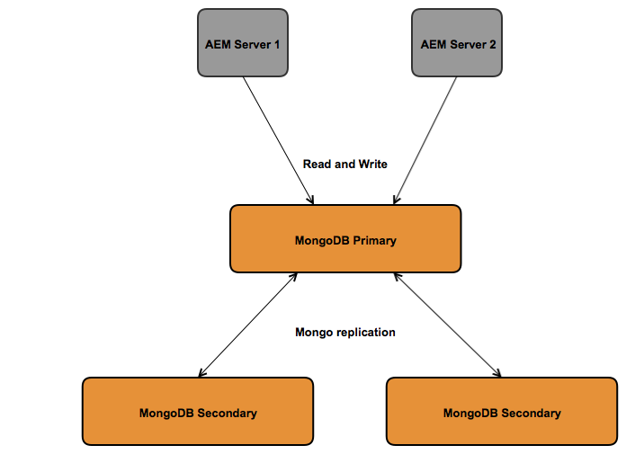

# Aanbevolen implementaties{#recommended-deployments}

>[!NOTE]
>
>Deze pagina verwijst naar geadviseerde topologieën voor AEM. Voor meer informatie over het groeperen van mogelijkheden en hoe te om hen te vormen, zie [Apache Sling API-documentatie](https://sling.apache.org/documentation/bundles/discovery-api-and-impl.html).

MicroKernels fungeren vanaf AEM 6.2 als persistentiemanagers. Het kiezen van één om uw behoeften te passen hangt van het doel van uw instantie en het plaatsingstype af u overweegt.

De volgende voorbeelden moeten een indicatie zijn van wat hun aanbevolen gebruik in de meest gebruikelijke AEM is.

## Implementatiescenario&#39;s {#deployment-scenarios}

### Single TarMK-instantie {#single-tarmk-instance}

In dit scenario, loopt één enkele instantie TarMK op één enkele server.

**Dit is de standaardplaatsing voor auteursinstanties.**

De voordelen:

* eenvoudig
* Eenvoudig onderhoud
* Goede prestaties

De nadelen:

* Niet schaalbaar buiten de grenzen van de servercapaciteit
* Geen failover-capaciteit

### TarMK Cold Standby {#tarmk-cold-standby}

Eén TarMK-instantie fungeert als de primaire instantie. De opslagplaats van de primaire opslagplaats wordt gerepliceerd naar een stand-by failover-systeem.

Het koude reservemechanisme kan ook als steun worden gebruikt omdat de volledige bewaarplaats constant aan de failoverserver wordt herhaald. De failoverserver loopt op koude reservewijze, wat betekent dat slechts HttpReceiver van de instantie loopt.

De voordelen:

* Eenvoud
* Onderhoudsmogelijkheden
* Prestaties
* Failover

De nadelen:

* Niet schaalbaar buiten de grenzen van de servercapaciteit
* Eén server is meestal inactief
* De failover is niet automatisch. Het moet extern worden ontdekt alvorens het failoversysteem verzoeken kan beginnen te dienen.

>[!NOTE]
>
>Voor meer informatie over hoe te om AEM met TarMK Koude Reserve te vormen, zie [dit](/help/sites-deploying/tarmk-cold-standby.md) artikel.

>[!NOTE]
>
>De plaatsing van de Reserve van de Koude in dit voorbeeld TarMK vereist dat zowel de primaire als reserve instanties afzonderlijk worden vergunning gegeven, aangezien er constante replicatie aan de failoverserver is. Raadpleeg voor meer informatie over licenties de [Algemene licentievoorwaarden van de Adobe](https://www.adobe.com/legal/terms/enterprise-licensing.html).

### TarMK Farm {#tarmk-farm}

Meerdere instanties van het type Oak worden elk uitgevoerd met één instantie TarMK. De TarMK-opslagplaatsen zijn onafhankelijk en moeten gesynchroniseerd blijven.

Het houden van de bewaarplaatsen in synchronisatie wordt voorzien van het feit dat de auteurserver de zelfde inhoud aan elk landbouwbedrijflid publiceert. Zie voor meer informatie [Replicatie](/help/sites-deploying/replication.md).

Voor AEM Communities wordt door de gebruiker gegenereerde inhoud (UGC) nooit gerepliceerd. Voor ondersteuning van UGC op een TarMK-farm raadpleegt u [overwegingen voor AEM Communities](#considerations-for-aem-communities).

**Dit is de standaardimplementatie voor publicatieomgevingen.**

De voordelen:

* Prestaties
* Schaalbaarheid voor leestoegang
* Failover

### Eak-cluster met MongoMK-failover voor hoge beschikbaarheid in één datacenter {#oak-cluster-with-mongomk-failover-for-high-availability-in-a-single-datacenter}

Deze benadering impliceert veelvoudige instanties van het Eak die tot een replica toegang hebben MongoDB binnen één enkel gegevenscentrum, in feite creërend een actief-actieve cluster voor het AEM auteursmilieu. Replicasets in MongoDB worden gebruikt om hoge beschikbaarheid en redundantie te bieden in het geval van een hardware- of netwerkstoring.

De voordelen:

* De mogelijkheid om horizontaal te schalen met nieuwe AEM auteur-instanties
* Hoge beschikbaarheid, overtolligheid, en geautomatiseerde failover van gegevenslaag

De nadelen:

* De prestaties kunnen lager zijn dan met TarMK voor sommige scenario&#39;s

### Eak-cluster met MongoMK-failover over meerdere datacenters {#oak-cluster-with-mongomk-failover-across-multiple-datacenters}

Deze benadering impliceert veelvoudige instanties van het Eak die tot een replica toegang hebben MongoDB die over veelvoudige gegevenscentra wordt geplaatst, in feite creërend een actief-actieve cluster voor het AEM auteursmilieu. Met meerdere datacenters biedt de replicatie van MongoDB dezelfde hoge beschikbaarheid en redundantie, maar nu ook de mogelijkheid om een storing in het datacenter te verwerken.

De voordelen:

* De mogelijkheid om horizontaal te schalen met nieuwe AEM auteur-instanties
* Hoge beschikbaarheid, overtolligheid, en geautomatiseerde failover van gegevenslaag (met inbegrip van gegevenscentrumstroomonderbrekingen)

>[!NOTE]
>
>In het diagram hierboven, worden AEM Server 3 en AEM Server 4 voorgesteld met een inactieve status veronderstellend een netwerklatentie binnen tussen de AEM Servers in Centrum 2 van Gegevens en het primaire knooppunt MongoDB in Datacenter 1 die hoger is dan het vereiste gedocumenteerd [hier](/help/sites-deploying/aem-with-mongodb.md#checklists). Als de maximumlatentie compatibel is met de vereisten, bijvoorbeeld door het gebruik van beschikbaarheidszones, dan kunnen de AEM servers in Datacenter 2 ook actief zijn, die tot een actief-actieve AEM cluster over veelvoudige datacenters leiden.

>[!NOTE]
>
>Voor meer informatie over de architecturale concepten MongoDB die in deze sectie worden beschreven, raadpleegt u [MongoDB-replicatie](https://docs.mongodb.org/manual/replication/).

## Microkorrels: één voor gebruik {#microkernels-which-one-to-use}

De basisregel waarmee rekening moet worden gehouden bij het kiezen tussen de twee beschikbare microkorrels is dat TarMK ontworpen is voor prestaties, terwijl MongoMK wordt gebruikt voor schaalbaarheid.

U kunt deze besluitmatrices gebruiken om te bepalen wat het beste type implementatie is dat aan uw vereisten is aangepast.

De Adobe adviseert hoogst TarMK om de standaardpersistentietechnologie te zijn die door klanten in alle plaatsingsscenario&#39;s, voor zowel de AEM Auteur als Publish instanties wordt gebruikt, behalve in de hieronder geschetste gebruiksgevallen.

### Uitzonderingen voor het kiezen van AEM MongoMK in TarMK op authorinstanties {#exceptions-for-choosing-aem-mongomk-over-tarmk-on-author-instances}

De primaire reden voor het kiezen van de MongoMK persistence backend over TarMK is de instanties horizontaal te schalen. Dit betekent dat er altijd twee of meer actieve auteur-instanties moeten worden uitgevoerd en dat MongoDB moet worden gebruikt als het opslagsysteem voor persistentie. De noodzaak om meer dan één auteurinstantie in werking te stellen vloeit over het algemeen voort uit het feit dat de cpu en geheugencapaciteit van één enkele server, die alle gezamenlijke auteursactiviteiten steunt, niet meer duurzaam is.

Het is bijna onmogelijk om te voorspellen wat het precieze gelijktijdige model zal zijn nadat een nieuwe site live gaat. Daarom adviseert de Adobe u de volgende criteria in overweging te nemen wanneer het evalueren of om MongoMK en twee of meer Actieve knopen van de Auteur te gebruiken:

1. Aantal benoemde gebruikers verbonden in een dag: in de duizenden of meer.
1. Aantal gelijktijdige gebruikers: in honderden of meer.
1. Hoeveelheid ingenomen activa per dag: in honderdduizenden of meer.
1. Volume van paginabewerkingen per dag: in honderdduizenden of meer (inclusief automatische updates via Meerdere Sitebeheer of inname van nieuwsberichten).
1. Aantal zoekopdrachten per dag: in tienduizenden of meer.

>[!NOTE]
>
>U kunt de lange dag gebruiken om de prestaties van de toepassing van de klant in de context van de geïmplementeerde hardwareconfiguratie te evalueren. Meer informatie over dit gereedschap is beschikbaar [hier](/help/sites-developing/tough-day.md).

Een minimumplaatsing met MongoDB zal typisch de volgende topologie impliceren:

* Een MongoDB-replicaset bestaande uit één primair knooppunt, twee secundaire knooppunten met elk van de MongoDB-instanties die in een beschikbaarheidszone met een latentie onder 15 milliseconden op elk knooppunt worden uitgevoerd;
* Een cluster van auteurinstanties met één leaderknoop, één niet-leaderknooppunt en beide actief op elk moment, met elk van de auteurinstanties die in elk van de datacenters worden uitgevoerd, waar de primaire en secundaire MongoDB-instanties worden uitgevoerd.

Daarnaast wordt het ten zeerste aanbevolen de datastore op een gedeeld bestandssysteem of Amazon S3 te configureren, zodat de elementen of binaire bestanden niet in MongoDB worden opgeslagen. Dit zorgt voor optimale prestaties binnen de implementatie.

Een van de extra voordelen van de implementatie van een MongoDB-replicaset met een cluster van twee of meer auteurinstanties is dat er een geautomatiseerd herstelscenario met minimale downtime bestaat als er auteurinstanties, MongoDB-replica of een volledige datacenterfout zijn. Niettemin zou de keuze van MongoMK over TarMK niet alleen door het terugwinningsvereiste moeten worden gedreven, aangezien TarMK ook een minimale downtime oplossing met een gecontroleerd failovermechanisme kan verstrekken.

Als de bovenstaande criteria naar verwachting niet tijdens de eerste 18 maanden van plaatsing zullen worden vervuld, wordt het aangemoedigd eerst AEM op te stellen gebruikend TarMK, dan uw configuratie op een recentere datum opnieuw te evalueren wanneer de bovengenoemde criteria van toepassing zijn, en definitief te bepalen of om op TarMK te blijven of aan MongoMK te migreren.

### Uitzonderingen voor het kiezen van AEM MongoMK in TarMK bij publicatie-instanties {#exceptions-for-choosing-aem-mongomk-over-tarmk-on-publish-instances}

Het wordt afgeraden MongoMK te implementeren voor publicatie-instanties. De publicatielaag van de plaatsing wordt bijna altijd opgesteld als landbouwbedrijf van volledig onafhankelijke publiceer instanties die TarMK in werking stellen, die in synchronisatie door inhoud van de auteursinstanties te herhalen worden gehouden. Deze &quot;gedeelde niets&quot;architectuur, behoorlijk aan de publiceer instanties, staat de plaatsing van toe publiceert rij om horizontaal op een lineaire manier te schrapen. De landbouwbedrijftopologie verstrekt ook het voordeel om het even welke update of verbetering toe te passen om instanties op een voortschrijdende basis te publiceren, zodat om het even welke verandering in publiceer rij geen onderbreking zal vereisen.

Dit is niet van toepassing op AEM Communities die MongoMK-clusters gebruikt op de publicatielijst als er meerdere uitgevers zijn. Als u JSRP (zie [Opslag van communautaire inhoud](/help/communities/working-with-srp.md)), dan zou een cluster MongoMK aangewezen zijn, zoals om het even welke publish zijcluster ongeacht de gekozen MK, zoals MongoDB of RDB.

### Vereisten en Recommendations bij de implementatie van AEM met MongoMK {#prerequisites-and-recommendations-when-deploying-aem-with-mongomk}

Een reeks eerste vereisten en aanbevelingen is beschikbaar als u een plaatsing MongoMK voor AEM overweegt:

**Verplichte voorwaarden voor MongoDB-implementaties:**

1. De mongoDB-implementatiearchitectuur en -grootte moeten deel uitmaken van de projectimplementatie met hulp van Adobe Consulting of MongoDB-architecten die vertrouwd zijn met AEM.
1. De deskundigheid MongoDB moet binnen de partner of het klantenteam aanwezig zijn om vertrouwen in het kunnen een bestaande of nieuwe milieu te kunnen handhaven MongoDB;
1. U kunt ervoor kiezen om de commerciële of open-sourceversie van MongoDB te implementeren (AEM ondersteunt beide), maar u moet rechtstreeks een MongoDB-onderhouds- en ondersteuningscontract aanschaffen bij MongoDB Inc;
1. De algemene AEM en MongoDB-architecturen en -infrastructuren moeten duidelijk gedefinieerd en gevalideerd worden door een Adobe AEM architect;
1. Controleer het supportmodel voor AEM implementaties die MongoDB bevatten.

**Sterke aanbevelingen voor MongoDB-implementaties:**

* Raadpleeg de MongoDB voor Adobe Experience Manager [artikel](https://www.mongodb.com/lp/contact/mongodb-adobe-experience-manager);
* De MongoDB-productie bekijken [checklist](https://docs.mongodb.org/manual/administration/production-checklist/);
* Een certificeringsklasse bijwonen op MongoDB die online beschikbaar is [hier](https://university.mongodb.com/).

>[!NOTE]
>
>Voor alle aanvullende vragen over deze richtlijnen, voorwaarden en aanbevelingen kunt u contact opnemen met [Klantenservice Adoben](https://helpx.adobe.com/marketing-cloud/contact-support.html).

### Overwegingen voor AEM Communities {#considerations-for-aem-communities}

Voor sites die van plan zijn te implementeren [AEM Communities](/help/communities/overview.md)wordt aanbevolen [kiezen voor een implementatie](/help/communities/working-with-srp.md#characteristicsofstorageoptions) geoptimaliseerd voor de verwerking van UGC die door leden van de gemeenschap vanuit de publicatieomgeving is geplaatst.

Door een [gemeenschappelijk archief](/help/communities/working-with-srp.md), hoeft UGC niet te worden gerepliceerd tussen auteur- en andere publicatieinstanties om een consistente weergave van de UGC te verkrijgen.

Hieronder vindt u een reeks beslissingsmatrixen die u kunnen helpen bij het kiezen van het beste type persistentie voor uw implementatie:

#### Het implementatietype kiezen voor auteur-instanties {#choosing-the-deployment-type-for-author-instances}

#### Het implementatietype kiezen voor publicatie-instanties {#choosing-the-deployment-type-for-publish-instances}

>[!NOTE]
>
>MongoDB is software van derden en is niet opgenomen in het AEM licentiepakket. Zie voor meer informatie de [Beleid voor MongoDB-licenties](https://www.mongodb.org/about/licensing/) pagina.
>
>Om optimaal gebruik te kunnen maken van uw AEM, raadt Adobe u aan een licentie te verlenen voor de MongoDB Enterprise-versie, zodat u kunt profiteren van professionele ondersteuning.
>
>De licentie bevat een standaard replicaset, die bestaat uit één primaire en twee secundaire instanties die kunnen worden gebruikt voor de auteur of de publicatieimplementaties.
>
>Als u zowel de auteur als de publicatie op MongoDB wilt uitvoeren, moet u twee aparte licenties aanschaffen.
>
>Zie de klasse [Pagina MongoDB voor Adobe Experience Manager](https://www.mongodb.com/lp/contact/mongodb-adobe-experience-manager).
