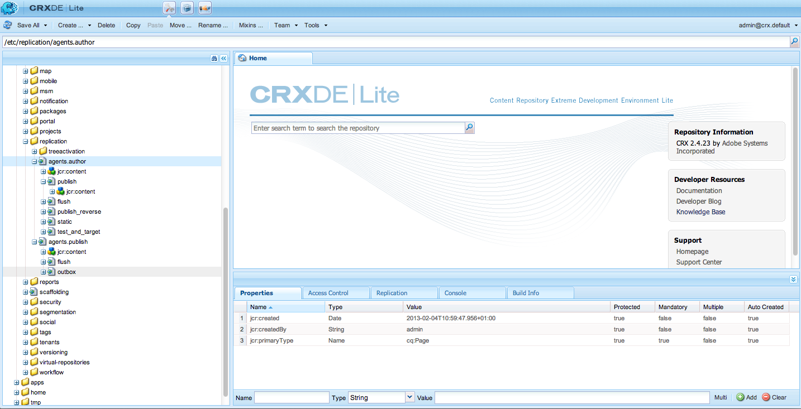

# Replicatie{#replication}

De agenten van de replicatie zijn centraal aan Adobe Experience Manager (AEM) als mechanisme dat wordt gebruikt om:

* [ Publish (activeer) ](/help/sites-authoring/publishing-pages.md#activatingcontent) inhoud van een Auteur aan een milieu van Publish.
* Inhoud expliciet uit de Dispatcher-cache verwijderen.
* Retourneer gebruikersinvoer (bijvoorbeeld formulierinvoer) van de Publish-omgeving naar de Auteur-omgeving (onder controle van de Auteur-omgeving).

De verzoeken worden [ een rij gevormd ](/help/sites-deploying/osgi-configuration-settings.md#apacheslingjobeventhandler) aan de aangewezen agent voor verwerking.

>[!NOTE]
>
>Gebruikersgegevens (gebruikers, gebruikersgroepen en gebruikersprofielen) worden niet gerepliceerd tussen auteur- en Publish-instanties.
>
>Voor veelvoudige instanties van Publish, worden de gebruikersgegevens verspreid wanneer [ de Synchronisatie van de Gebruiker ](/help/sites-administering/sync.md) wordt toegelaten.

## Replicatie van auteur naar Publish {#replicating-from-author-to-publish}

De replicatie, aan een Publish instantie of Dispatcher, vindt in verscheidene stappen plaats:

* De auteur vraagt dat bepaalde inhoud wordt gepubliceerd (geactiveerd). Dit kan worden geïnitieerd door een handmatig verzoek of door automatische triggers die vooraf zijn geconfigureerd.
* het verzoek wordt overgegaan tot de aangewezen standaard replicatieagent; een milieu kan verscheidene standaardagenten hebben die altijd voor dergelijke acties worden geselecteerd.
* de replicatieagent &quot;verpakt&quot;de inhoud en plaatst het in de replicatierij.
* in het lusje van Websites wordt de [ gekleurde statusindicator ](/help/sites-authoring/publishing-pages.md#determiningpagepublicationstatus) geplaatst voor de individuele pagina&#39;s.
* de inhoud wordt opgeheven van de rij en vervoerd naar het milieu van Publish gebruikend het gevormde protocol; gewoonlijk is dit HTTP.
* een servlet in de Publish-omgeving ontvangt het verzoek en publiceert de ontvangen inhoud; de standaardservlet is `https://localhost:4503/bin/receive` .

* Er kunnen meerdere auteur- en Publish-omgevingen worden geconfigureerd.

### Replicatie van Publish naar auteur {#replicating-from-publish-to-author}

Met sommige functies kunnen gebruikers gegevens invoeren op een Publish-exemplaar.

Soms, is een type van replicatie die als omgekeerde replicatie wordt bekend, nodig om deze gegevens aan het milieu van de Auteur terug te keren van waar het aan andere milieu&#39;s van Publish wordt herverdeeld. Om veiligheidsredenen moet het verkeer van de Publish naar de Auteur-omgeving strikt worden gecontroleerd.

De omgekeerde replicatie gebruikt een agent in het milieu van Publish die verwijzingen het milieu van de Auteur. Deze agent plaatst de gegevens in een outbox. Deze outbox wordt aangepast met replicatieluisteraars in het milieu van de Auteur. De luisteraars onderzoeken de outboxes om het even welke ingevoerde gegevens te verzamelen en dan het zonodig te verspreiden. Dit zorgt ervoor dat het milieu van de Auteur al verkeer controleert.

In andere gevallen, zoals bij de functies van de Gemeenschappen (bijvoorbeeld forums, blogs, opmerkingen en revisies), is het moeilijk om de hoeveelheid door de gebruiker gegenereerde inhoud (UGC) die in de Publish-omgeving wordt ingevoerd, op efficiënte wijze te synchroniseren over AEM instanties die replicatie gebruiken.

AEM [ Gemeenschappen ](/help/communities/overview.md) gebruikt nooit replicatie voor UGC. In plaats daarvan, vereist de plaatsing voor Gemeenschappen een gemeenschappelijke opslag voor UGC (zie [ Communautaire Opslag van de Inhoud ](/help/communities/working-with-srp.md)).

### Replicatie - uit de doos {#replication-out-of-the-box}

De wij-kleinhandelswebsite die in een standaardinstallatie van AEM inbegrepen is kan worden gebruikt om replicatie te illustreren.

Om dit voorbeeld te volgen, en de standaardreplicatieagenten te gebruiken, [ installeer AEM ](/help/sites-deploying/deploy.md) met:

* de omgeving Auteur op de poort `4502`
* de Publish-omgeving op de poort `4503`

>[!NOTE]
>
>Standaard ingeschakeld:
>
>* Agenten op Auteur: StandaardAgent (publiceren)
>
>Effectief uitgeschakeld (vanaf AEM 6.1):
>
>* Agenten op Auteur: Omgekeerde Agent van de Replicatie (publish_reverse)
>* Medewerkers op Publish: Reverse Replication (outbox)
>
>Om het statuut van of de agent of de rij te controleren, gebruik de **console van Hulpmiddelen**.
>Zie [ Controle uw Agenten van de Replicatie ](#monitoring-your-replication-agents).

#### Replicatie (auteur naar Publish) {#replication-author-to-publish}

1. Navigeer naar de ondersteuningspagina in de ontwerpomgeving.
   **https://localhost:4502/content/we-retail/us/en/experience.html** `<pi>`
1. Bewerk de pagina zodat u nieuwe tekst kunt toevoegen.
1. **activeer Pagina** zodat kunt u de veranderingen publiceren.
1. Open de ondersteuningspagina in de Publish-omgeving:
   **https://localhost:4503/content/we-retail/us/en/experience.html**
1. U kunt nu de wijzigingen zien die u hebt ingevoerd voor de auteur.

Deze replicatie wordt van het milieu van de Auteur in actie gebracht door:

* **StandaardAgent (publiceert)**
Deze agent dupliceert inhoud naar de standaard Publish-instantie.
De details van dit (configuratie en logboeken) kunnen van de console van Hulpmiddelen van het milieu van de Auteur worden betreden; of:
  `https://localhost:4502/etc/replication/agents.author/publish.html`.

#### Replication Agents - Out of the Box {#replication-agents-out-of-the-box}

De volgende agenten zijn beschikbaar in een standaard AEM installatie:

* [ StandaardAgent ](#replication-author-to-publish)
Wordt gebruikt voor replicatie van auteur naar Publish.

* Dispatcher Flush
Dit wordt gebruikt voor het beheren van de Dispatcher cache. Zie [ het Invalideren van het Geheime voorgeheugen van Dispatcher van het Authoring Milieu ](https://experienceleague.adobe.com/docs/experience-manager-dispatcher/using/configuring/page-invalidate.html#invalidating-dispatcher-cache-from-the-authoring-environment) en [ het Invalideren van het Geheime voorgeheugen van Dispatcher van een het Publiceren Instantie ](https://experienceleague.adobe.com/docs/experience-manager-dispatcher/using/configuring/page-invalidate.html#invalidating-dispatcher-cache-from-a-publishing-instance) voor meer informatie.

* [ Omgekeerde Replicatie ](#reverse-replication-publish-to-author)
Wordt gebruikt voor replicatie van Publish naar Auteur. Reverse-replicatie wordt niet gebruikt voor functies van Gemeenschappen, zoals forums, blogs en opmerkingen. De optie is in feite uitgeschakeld omdat de Postvak UIT niet is ingeschakeld. Het gebruik van omgekeerde replicatie zou douaneconfiguratie vereisen.

* Statische agent
Dit is een &quot;Agent die een statische vertegenwoordiging van een knoop in het filesystem opslaat.&quot;
Met de standaardinstellingen worden de inhoudspagina&#39;s en de dam-elementen bijvoorbeeld opgeslagen onder `/tmp` als HTML of in de juiste indeling voor elementen. Zie de tabbladen `Settings` en `Rules` voor de configuratie.
Dit is aangevraagd zodat de inhoud zichtbaar is wanneer de pagina rechtstreeks bij de toepassingsserver wordt aangevraagd. Dit is een gespecialiseerde agent en (waarschijnlijk) wordt niet vereist voor de meeste gevallen.

## Replicatieagents - configuratieparameters {#replication-agents-configuration-parameters}

Wanneer het vormen van een replicatieagent van de console van Hulpmiddelen, zijn vier lusjes beschikbaar binnen de dialoog:

### Instellingen {#settings}

* **Naam**

  Een unieke naam voor de replicatieagent.

* **Beschrijving**

  Een beschrijving van het doel deze replicatieagent dient.

* **Toegelaten**

  Geeft aan of de replicatieagent is ingeschakeld.

  Wanneer de agent **** wordt toegelaten, wordt de rij getoond als:

   * **Actief** wanneer de punten worden verwerkt.
   * **nutteloos** wanneer de rij leeg is.
   * **Geblokkeerd** wanneer de punten in de rij zijn, maar kunnen niet worden verwerkt; bijvoorbeeld, wanneer de ontvangende rij wordt onbruikbaar gemaakt.

* **Type van rangschikking**

  Het type van rangschikking:

   * **Gebrek**: Plaats als de agent automatisch moet worden geselecteerd.
   * **de Duw van Dispatcher**: Selecteer dit als de agent voor het spoelen van het geheime voorgeheugen van Dispatcher moet worden gebruikt.

* **opnieuw Vertraging**

  De vertraging (wachttijd in milliseconden) tussen twee pogingen, mocht een probleem worden ontmoet.

  Standaard: `60000`

* **Gebruiker - identiteitskaart van de Agent**

  Afhankelijk van het milieu, gebruikt de agent deze gebruikersrekening om:

   * de inhoud van de ontwerpomgeving verzamelen en in een pakket plaatsen
   * de inhoud maken en schrijven in de Publish-omgeving

  Laat dit veld leeg om de systeemgebruikersaccount te gebruiken (de account die in sling is gedefinieerd als de beheerdersgebruiker; standaard is dit `admin` ).

  >[!CAUTION]
  >
  >Voor een agent op het milieu van de Auteur moet dit rekening ** gelezen toegang tot alle wegen hebben die u wilt hebben gerepliceerd.

  >[!CAUTION]
  >
  >Voor een agent op het milieu van Publish moet deze rekening ** creeren/schrijven toegang hebben die wordt vereist om de inhoud te herhalen.

  >[!NOTE]
  >
  >Dit kan als mechanisme worden gebruikt om specifieke inhoud voor replicatie te selecteren.

* **Niveau van het Logboek**

  Hiermee bepaalt u het detailniveau dat voor logberichten moet worden gebruikt.

   * `Error`: alleen fouten worden vastgelegd
   * `Info`: fouten, waarschuwingen en andere informatieberichten worden vastgelegd
   * `Debug`: er wordt een hoog detailniveau gebruikt in de berichten, vooral voor foutopsporingsdoeleinden

  Standaard: `Info`

* **Gebruik voor omgekeerde replicatie**

  Wijst erop of deze agent voor omgekeerde replicatie wordt gebruikt; keert gebruikersinput van Publish aan het milieu van de Auteur terug.

* **Alias update**

  Als u deze optie selecteert, worden aanvragen voor validatie van aliassen of ijdelingspaden naar Dispatcher ingeschakeld. Ook, zie [ Vormend een Uitlijnende Agent van Dispatcher ](/help/sites-deploying/replication.md#configuring-a-dispatcher-flush-agent).

#### Vervoer {#transport}

* **URI**

  Dit specificeert het ontvangende servlet bij de doelplaats. Met name kunt u hier de hostnaam (of alias) en het contextpad naar de doelinstantie opgeven.

  Bijvoorbeeld:

   * Een standaardagent kan worden gerepliceerd naar `https://localhost:4503/bin/receive`
   * Een Dispatcher Flush-agent kan worden gerepliceerd naar `https://localhost:8000/dispatcher/invalidate.cache`

  Het hier opgegeven protocol (HTTP of HTTPS) bepaalt de transportmethode.

  Voor Dispatcher Flush-agents wordt de URI-eigenschap alleen gebruikt als u padgebaseerde virtualhost-items gebruikt om onderscheid te maken tussen boerderijen, gebruikt u dit veld om de farm als doel in te stellen voor ongeldig maken. farm #1 heeft bijvoorbeeld een virtuele host van `www.mysite.com/path1/*` en farm #2 heeft een virtuele host van `www.mysite.com/path2/*` . U kunt een URL van `/path1/invalidate.cache` gebruiken om het eerste landbouwbedrijf te richten en `/path2/invalidate.cache` om het tweede landbouwbedrijf te richten.

* **Gebruiker**

  De gebruikersnaam van de account die moet worden gebruikt voor toegang tot het doel.

* **Wachtwoord**

  Wachtwoord voor de account die moet worden gebruikt voor toegang tot het doel.

* **NTLM Domein**

  Domein voor NTML-verificatie.

* **NTLM Gastheer**

  Host voor NTML-verificatie.

* **laat ontspannen SSL** toe

  Schakel deze optie in als u wilt dat zelfgecertificeerde SSL-certificaten worden geaccepteerd.

* **staat verlopen certs** toe

  Schakel deze optie in als u verlopen SSL-certificaten wilt accepteren.

#### Proxy {#proxy}

De volgende instellingen zijn alleen nodig als een proxy nodig is:

* **Gastheer van de Volmacht**

  Hostnaam van de proxy die wordt gebruikt voor vervoer.

* **de Haven van de Volmacht**

  Poort van de proxy.

* **Gebruiker van de Volmacht**

  De gebruikersnaam van de account die moet worden gebruikt.

* **Wachtwoord van de Volmacht**

  Wachtwoord van de account die moet worden gebruikt.

* **Volmacht NTLM Domein**

  Het NTLM-proxydomein.

* **Volmacht NTLM Gastheer**

  Het NTLM-proxydomein.

#### Uitgebreid {#extended}

* **Interface**

  Hier kunt u de socketinterface definiëren waaraan u wilt binden.

  Hiermee wordt het lokale adres ingesteld dat moet worden gebruikt bij het maken van verbindingen. Als deze niet is ingesteld, wordt het standaardadres gebruikt. Dit is nuttig om de interface te specificeren om op multi-homed of gegroepeerde systemen te gebruiken.

* **Methode van HTTP**

  De HTTP-methode die moet worden gebruikt.

  Voor een Dispatcher Flush-agent is dit bijna altijd GET en mag dit niet worden gewijzigd (POST zou een andere mogelijke waarde zijn).

* **Kopballen van HTTP**

  Deze worden gebruikt voor Dispatcher Flush-middelen en geven elementen op die moeten worden verwijderd.

  Voor een Dispatcher Flush-agent hoeven de drie standaarditems niet te worden gewijzigd:

   * `CQ-Action:{action}`
   * `CQ-Handle:{path}`
   * `CQ-Path:{path}`

  Deze worden, indien van toepassing, gebruikt om de actie aan te geven die moet worden gebruikt bij het spoelen van de handgreep of het pad. De subparameters zijn dynamisch:

   * `{action}` geeft een replicatiehandeling aan

   * `{path}` geeft een pad aan

  Zij worden vervangen door het pad/de actie die relevant is voor het verzoek en hoeven daarom niet &quot;hardcoded&quot; te zijn:

  >[!NOTE]
  >
  >Als u AEM in een andere context dan de geadviseerde standaardcontext hebt geïnstalleerd, dan moet u de context in de Kopballen van HTTP registreren. Bijvoorbeeld:
  >`CQ-Handle:/<*yourContext*>{path}`

* **dicht Verbinding**

  Schakel deze optie in zodat u de verbinding na elke aanvraag kunt sluiten.

* **verbind Onderbreking**

  Time-out (in milliseconden) die moet worden toegepast wanneer wordt geprobeerd verbinding te maken.

* **Onderbreking van de Zak**

  Time-out (in milliseconden) die moet worden toegepast wanneer wordt gewacht op verkeer nadat een verbinding tot stand is gebracht.

* **Versie van het Protocol**

  Versie van het protocol. Bijvoorbeeld `1.0` voor HTTP/1.0.

#### Triggers {#triggers}

Deze instellingen worden gebruikt om triggers voor geautomatiseerde replicatie te definiëren:

* **negeert gebrek**

  Indien gecontroleerd, wordt de agent uitgesloten van standaardreplicatie; dit betekent het niet wordt gebruikt als een tevreden auteur een replicatieactie uitgeeft.

* **op Wijziging**

  Hier wordt een replicatie door deze agent automatisch teweeggebracht wanneer een pagina wordt gewijzigd. Wordt gebruikt voor Dispatcher Flush-agents, maar ook voor omgekeerde replicatie.

* **op Distribute**

  Als deze optie is ingeschakeld, wordt alle inhoud die is gemarkeerd voor distributie automatisch door de agent gerepliceerd wanneer deze wordt gewijzigd.

* **bereikte On-/Offtime**

  Dit activeert automatische replicatie (om een pagina te activeren of te deactiveren zoals aangewezen) wanneer de tijden of de tijden die voor een pagina worden bepaald voorkomen. Dit wordt vooral gebruikt voor Dispatcher Flush-middelen.

* **op Ontvang**

  Indien gecontroleerd, repliceren de agentenketens wanneer het ontvangen van replicatiegebeurtenissen.

* **Geen Update van de Status**

  Wanneer gecontroleerd, dwingt de agent geen update van de replicatiestatus.

* **Geen Versioning**

  Als deze optie is ingeschakeld, dwingt de agent geen versiering van geactiveerde pagina&#39;s.

## De replicatieagents configureren {#configuring-your-replication-agents}

Voor informatie over het aansluiten van replicatieagenten aan de instantie van Publish die MSSL gebruiken, zie [ het Repliceren Gebruikend Wederzijdse SSL ](/help/sites-deploying/mssl-replication.md).

### Het vormen van uw Agenten van de Replicatie van het Milieu van de Auteur {#configuring-your-replication-agents-from-the-author-environment}

Van het lusje van Hulpmiddelen in het milieu van de Auteur, kunt u replicatieagenten vormen die in of het milieu van de Auteur (**Agenten op Auteur**) of het milieu van Publish (**Agenten op Publish**) verblijven. De volgende procedures illustreren de configuratie van een agent voor het milieu van de Auteur, maar kunnen voor beide worden gebruikt.

>[!NOTE]
>
>Wanneer een Dispatcher HTTP-aanvragen voor auteur- of Publish-instanties afhandelt, moet de HTTP-aanvraag van de replicatieagent de PATH-header bevatten. Naast de volgende procedure, moet u de kopbal van het PAD aan de lijst van Dispatcher van cliëntkopballen toevoegen. Zie [/clientheaders (de Kopballen van de Cliënt) ](https://experienceleague.adobe.com/docs/experience-manager-dispatcher/using/configuring/dispatcher-configuration.html#specifying-the-http-headers-to-pass-through-clientheaders).
>

1. Heb toegang tot het **lusje van Hulpmiddelen** in AEM.
1. Klik **Replicatie** (linkerruit om de omslag te openen).
1. Dubbelklik **Agenten op Auteur** (of de linkerzijde of de juiste ruit).
1. Klik de aangewezen agentennaam (die een verbinding) is om gedetailleerde informatie over die agent te tonen.
1. Klik **uitgeven** zodat wordt de doos van de configuratiedialoog geopend:

   

1. De opgegeven waarden moeten voldoende zijn voor een standaardinstallatie. Als u veranderingen aanbrengt, klik O.K. **om hen (zie [ de Agenten van de Replicatie - de Parameters van de Configuratie ](#replication-agents-configuration-parameters) voor informatie over individuele parameters) te bewaren.**

>[!NOTE]
>
>Een standaardinstallatie van AEM specificeert `admin` als gebruiker voor vervoergeloofsbrieven binnen de standaardreplicatieagenten.
>
>Dit moet worden gewijzigd in een sitespecifieke gebruikersaccount voor replicatie met de bevoegdheden om de vereiste paden te repliceren.

### Omgekeerde replicatie configureren {#configuring-reverse-replication}

De omgekeerde replicatie wordt gebruikt om gebruikersinhoud terug te krijgen die op een instantie van Publish wordt geproduceerd aan een instantie van de Auteur. Dit wordt doorgaans gebruikt voor functies zoals enquêtes en registratieformulieren.

Om veiligheidsredenen, staan de meeste netwerktopologieën geen verbindingen *van* de &quot;Gedemilitariseerde Zone&quot;toe (subnetwork die de externe diensten aan een onbetrouwbaar netwerk zoals Internet) blootstelt.

Aangezien de omgeving van Publish gewoonlijk in DMZ is, om inhoud terug naar het milieu van de Auteur te krijgen moet de verbinding van de instantie van de Auteur in werking worden gesteld. Dit wordt gedaan met:

* een *outbox* in het milieu van Publish waar de inhoud wordt geplaatst.
* een agent (publiceren) in het milieu van de Auteur die periodiek outbox voor nieuwe inhoud opiniepeilt.

>[!NOTE]
>
>Voor AEM [ Gemeenschappen ](/help/communities/overview.md), wordt de replicatie niet gebruikt voor gebruiker-geproduceerde inhoud op een instantie van Publish. Zie [ Communautaire Opslag van de Inhoud ](/help/communities/working-with-srp.md).

Hiervoor hebt u het volgende nodig:

**een omgekeerde replicatieagent in het milieu van de Auteur** - handelt als actieve component om informatie van outbox in het milieu van Publish te verzamelen:

Als u omgekeerde replicatie wilt gebruiken, zorg ervoor dat deze agent wordt geactiveerd.

**Een omgekeerde replicatieagent in het milieu van Publish (een outbox)** - het passieve element aangezien het als &quot;outbox&quot;dienst doet. De input van de gebruiker wordt hier geplaatst, van waar het door de agent in het milieu van de Auteur wordt verzameld.

### Replicatie configureren voor meerdere Publish-instanties {#configuring-replication-for-multiple-publish-instances}

>[!NOTE]
>
>Alleen inhoud wordt gerepliceerd. Gebruikersgegevens worden niet gekopieerd (gebruikers, gebruikersgroepen en gebruikersprofielen).
>
>Om gebruikersgegevens over veelvoudige instanties van Publish te synchroniseren, laat [ Synchronisatie van de Gebruiker ](/help/sites-administering/sync.md) toe.

Na installatie, wordt een standaardagent reeds gevormd voor replicatie van inhoud aan een instantie van Publish die op haven 4503 van localhost loopt.

Om replicatie van inhoud voor een extra instantie van Publish te vormen, creeer en vorm een nieuwe replicatieagent:

1. Open het **lusje van Hulpmiddelen** in AEM.
1. Selecteer **Replicatie**, toen **Agenten op Auteur** in het linkerpaneel.
1. Selecteer **Nieuw...**.
1. Plaats de **Titel** en **Naam**, dan selecteer **Agent van de Replicatie**.
1. Klik **creëren** zodat kunt u de agent tot stand brengen.
1. Dubbelklik op het nieuwe agentitem zodat het configuratievenster wordt geopend.
1. Klik **uitgeven** - het **de dialoogvakje van de Montages van de Agent** opent - het **Type van Rangschikking** wordt reeds bepaald als Gebrek, dit moet zo blijven.

   * In het **lusje van Montages**:

      * Activeer **Toegelaten**.
      * Ga a **Beschrijving** in.
      * Plaats **opnieuw probeert Vertraging** aan `60000`.

      * Verlaat het **Type van Rangschikking** als `Default`.

   * In het **Vervoer** lusje:

      * Voer de vereiste URI in voor de nieuwe Publish-instantie, bijvoorbeeld
        `https://localhost:4504/bin/receive`.

      * Voer de sitespecifieke gebruikersaccount in die voor replicatie wordt gebruikt.
      * U kunt desgewenst andere parameters configureren.

1. Klik **OK**.

Vervolgens kunt u de bewerking testen door een pagina in de ontwerpomgeving bij te werken en te publiceren.

De updates worden weergegeven op alle Publish-instanties die als hierboven zijn geconfigureerd.

Als u problemen ondervindt, kunt u de logboekbestanden in de instantie Auteur controleren. Afhankelijk van het vereiste niveau van detail kunt u het **Niveau van het Logboek** aan `Debug` ook plaatsen gebruikend de **dialoog van de Montages van de Agent** zoals hierboven.

>[!NOTE]
>
>Dit kan met gebruik van [ identiteitskaart van de Gebruiker van de Agent ](#agentuserid) worden gecombineerd om verschillende inhoud voor het herhalen aan de individuele milieu&#39;s van Publish te selecteren. Voor elke Publish-omgeving:
>
>1. Configureer een replicatieagent voor replicatie naar die Publish-omgeving.
>1. Een gebruikersaccount configureren; met de toegangsrechten die zijn vereist voor het lezen van de inhoud die wordt gerepliceerd naar die specifieke Publish-omgeving.
>1. Wijs de gebruikersrekening als **identiteitskaart van de Gebruiker van de Agent** voor de replicatieagent toe.
>

### Een Dispatcher Flush-agent configureren {#configuring-a-dispatcher-flush-agent}

De standaardagenten zijn inbegrepen met de installatie. Nochtans, is een bepaalde configuratie nog nodig en het zelfde is van toepassing als u een nieuwe agent bepaalt:

1. Open het **lusje van Hulpmiddelen** in AEM.
1. Klik **Plaatsing**.
1. Selecteer **Replicatie** en dan **Agenten op Publish**.
1. Dubbelklik op het **Dispatcher Flush** punt om het overzicht te openen.
1. Klik **uitgeven** - het **de dialoogvakje van de Montages van de Agent** opent:

   * In het **lusje van Montages**:

      * Activeer **Toegelaten**.
      * Ga a **Beschrijving** in.
      * Verlaat het **Type van Rangschikking** als `Dispatcher Flush`, of plaats het als dusdanig als het creëren van een agent.

      * (facultatief) selecteer **Update van de Alias** om alias of verzoeken van de de ongeldig wordingsweg aan Dispatcher toe te laten.

   * In het **Vervoer** lusje:

      * Voer de vereiste URI in voor de nieuwe Publish-instantie, bijvoorbeeld
        `https://localhost:80/dispatcher/invalidate.cache`.

      * Voer de sitespecifieke gebruikersaccount in die voor replicatie wordt gebruikt.
      * U kunt desgewenst andere parameters configureren.

   Voor Dispatcher Flush-agents wordt de URI-eigenschap alleen gebruikt als u padgebaseerde virtualhost-items gebruikt om onderscheid te maken tussen boerderijen, gebruikt u dit veld om de farm als doel in te stellen voor ongeldig maken. farm #1 heeft bijvoorbeeld een virtuele host van `www.mysite.com/path1/*` en farm #2 heeft een virtuele host van `www.mysite.com/path2/*` . U kunt een URL van `/path1/invalidate.cache` gebruiken om het eerste landbouwbedrijf te richten en `/path2/invalidate.cache` om het tweede landbouwbedrijf te richten.

   >[!NOTE]
   >
   >Als u AEM in een context buiten de geadviseerde standaardcontext hebt geïnstalleerd, vorm de [ Kopballen van HTTP ](#extended) in **Uitgebreide** tabel.

1. Klik **OK**.
1. Terugkeer aan het **lusje van Hulpmiddelen**, van hier kunt u **** de **Vlek van Dispatcher** agent (**Agenten op Publish**) activeren.

De **replicatieagent van de Flush van 0} Dispatcher is niet actief op de Auteur.** U hebt toegang tot dezelfde pagina in de Publish-omgeving met behulp van de equivalente URI, bijvoorbeeld `https://localhost:4503/etc/replication/agents.publish/flush.html` .

### Toegang tot replicatieagents beheren {#controlling-access-to-replication-agents}

De toegang tot de pagina&#39;s die worden gebruikt om de replicatieagenten te vormen kan worden gecontroleerd door gebruiker en/of groepspaginachtigingen op de `etc/replication` knoop te gebruiken.

>[!NOTE]
>
>Het instellen van dergelijke machtigingen heeft geen invloed op gebruikers die inhoud repliceren (bijvoorbeeld via de websiteconsole of de optie sidekick). Het replicatieframework gebruikt niet de &quot;gebruikerssessie&quot; van de huidige gebruiker om toegang te krijgen tot replicatieagents tijdens het repliceren van pagina&#39;s.

### Het vormen van uw Medewerkers van de Replicatie van CRXDE Lite {#configuring-your-replication-agents-from-crxde-lite}

>[!NOTE]
>
>Het maken van replicatieagents wordt alleen ondersteund op de locatie van de `/etc/replication` -opslagplaats. Dit is nodig voor bijbehorende ACLs om behoorlijk te worden behandeld. Het creëren van een replicatieagent in een andere plaats van de boom zou tot onbevoegde toegang kunnen leiden.

Diverse parameters van uw replicatieagenten kunnen worden gevormd gebruikend CRXDE Lite.

Als u naar `/etc/replication` navigeert, ziet u de volgende drie knooppunten:

* `agents.author`
* `agents.publish`
* `treeactivation`

De twee `agents` bevatten configuratiegegevens over de juiste omgeving en zijn alleen actief wanneer die omgeving wordt uitgevoerd. `agents.publish` wordt bijvoorbeeld alleen gebruikt in de Publish-omgeving. Het volgende screenshot toont de Publish-agent in de Auteur-omgeving, zoals opgenomen in AEM WCM:

## Uw replicatieagents controleren {#monitoring-your-replication-agents}

Om een replicatieagent te controleren:

1. Heb toegang tot het **lusje van Hulpmiddelen** in AEM.
1. Klik **Replicatie**.
1. Dubbelklik op de koppeling naar agents voor de juiste omgeving (links of rechts). Bijvoorbeeld, **Agenten op Auteur**.

   Het resulterende venster toont een overzicht van al uw replicatieagenten voor het milieu van de Auteur, met inbegrip van hun doel en status.

1. Klik de aangewezen agentennaam (die een verbinding is) om gedetailleerde informatie over die agent te tonen:

   

   Hier kunt u het volgende doen:

   * Zie of de agent wordt toegelaten.
   * Zie het doel van eventuele replicaties.
   * Zie of de replicatierij actief (toegelaten) is.
   * Zie of er items in de wachtrij staan.
   * **verfrist zich** of **Duidelijk** om de vertoning van rijingangen bij te werken. Dit helpt u zien dat de punten ingaan en de rij verlaten.

   * **Logboek van de Mening** om tot het logboek van om het even welke acties door de replicatieagent toegang te hebben.
   * **Verbinding van de Test** aan de doelinstantie.
   * **dwingen opnieuw** op om het even welke rijpunten, indien nodig.

   >[!CAUTION]
   >
   >Gebruik de koppeling &#39;Verbinding testen&#39; niet voor het selectievakje Reverse Replication Outbox op een Publish-instantie.
   >
   >
   >Als een replicatietest voor een Postbus rij wordt uitgevoerd, worden om het even welke punten die ouder zijn dan de testreplicatie opnieuw verwerkt met elke omgekeerde replicatie.
   >
   >
   >Als dergelijke punten in een rij bestaan, kunnen zij met de volgende vraag van JCR van XPath worden gevonden en zouden moeten worden verwijderd.
   >
   >
   >`/jcr:root/var/replication/outbox//*[@cq:repActionType='TEST']`

## Batchreplicatie {#batch-replication}

De batchreplicatie dupliceert geen afzonderlijke pagina&#39;s of elementen, maar wacht op de eerste drempelwaarde van de twee, op basis van de tijd of grootte, die moeten worden geactiveerd.

Vervolgens worden alle replicatiepunten in een pakket opgenomen, dat vervolgens als één bestand wordt gerepliceerd naar de uitgever.

De uitgever pak alle punten, sparen hen en rapporteert terug naar de Auteur.

### Batchreplicatie configureren {#configuring-batch-replication}

1. Ga naar `http://serveraddress:serverport/siteadmin`
1. Druk op het pictogram **[!UICONTROL Tools]** boven in het scherm
1. Ga vanuit de linkerzijnavigatieregel naar **[!UICONTROL Replication - Agents on Author]** en dubbelklik **[!UICONTROL Default Agent]** .
   * U kunt ook de standaard Publish-replicatieagent bereiken door rechtstreeks naar `http://serveraddress:serverport/etc/replication/agents.author/publish.html` te gaan
1. Druk op de knop **[!UICONTROL Edit]** boven de replicatiewachtrij.
1. Ga in het volgende venster naar de tab **[!UICONTROL Batch]** :
   
1. Vorm de agent.

### Parameters {#parameters}

* `[!UICONTROL Enable Batch Mode]` - de batchreplicatiemodus in- of uitschakelen
* `[!UICONTROL Max Wait Time]` - Maximale wachttijd totdat een batchverzoek wordt gestart, in seconden. De standaardwaarde is 2 seconden.
* `[!UICONTROL Trigger Size]` - Batch-replicatie wordt gestart wanneer deze formaatlimiet wordt bereikt

## Aanvullende bronnen {#additional-resources}

Voor details over het oplossen van problemen, kunt u de [ pagina van de Replicatie van het Oplossen van problemen ](/help/sites-deploying/troubleshoot-rep.md) lezen.
